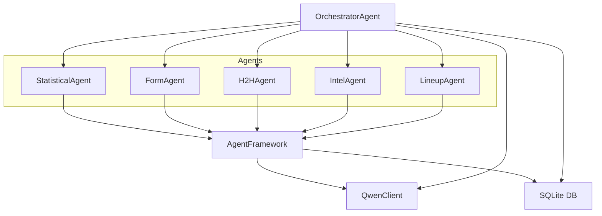
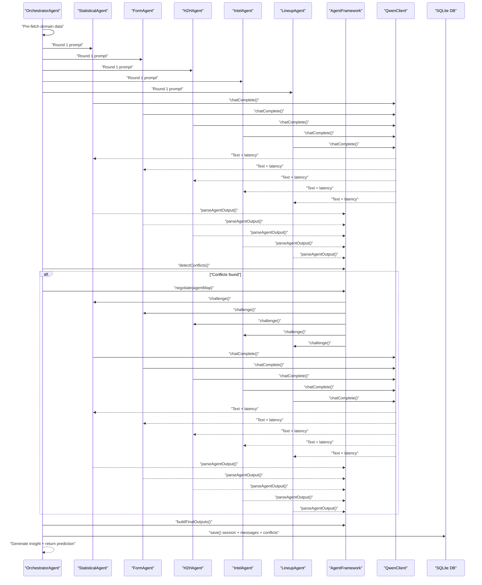
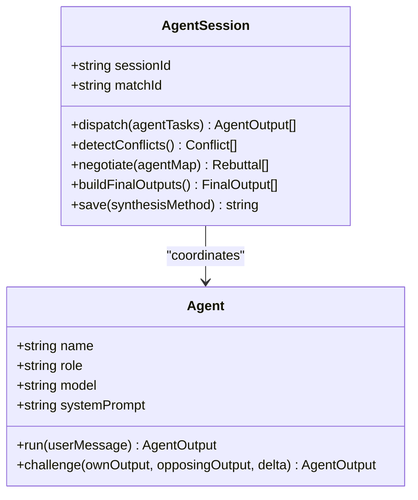
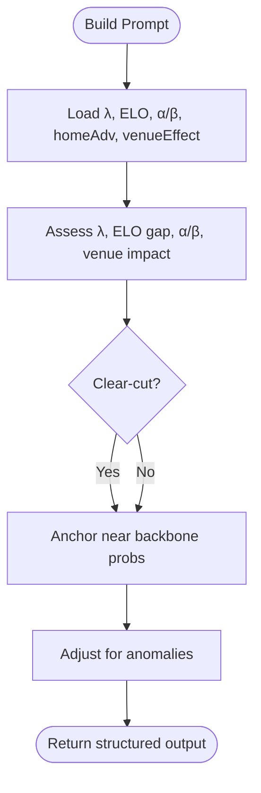
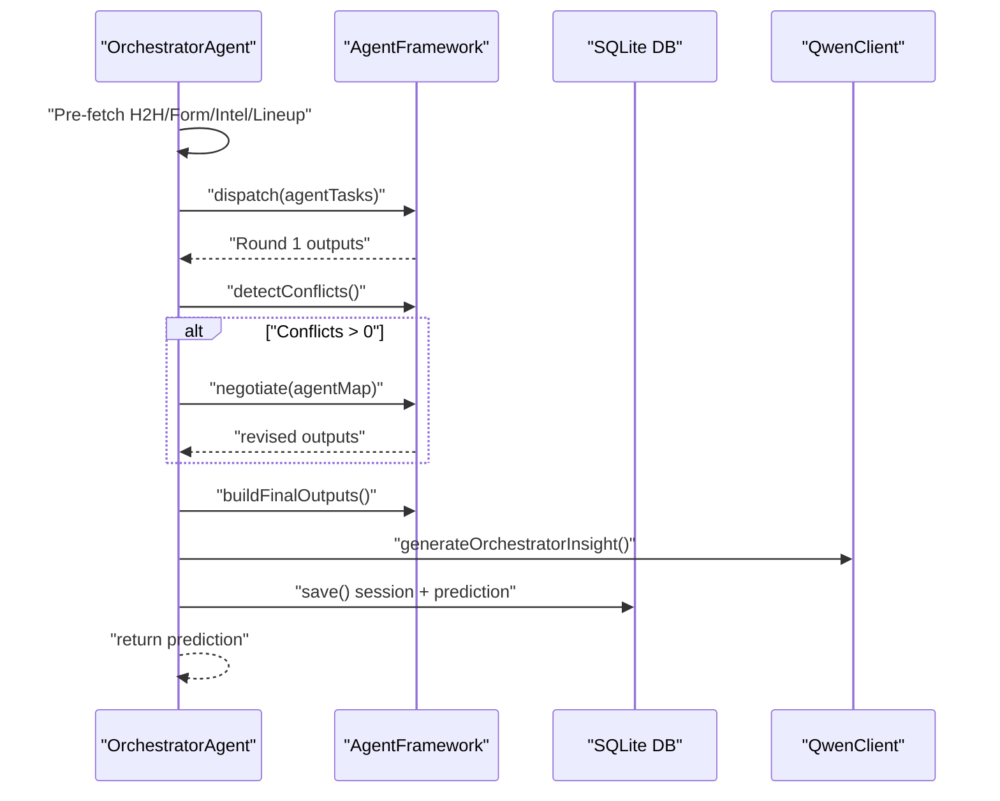
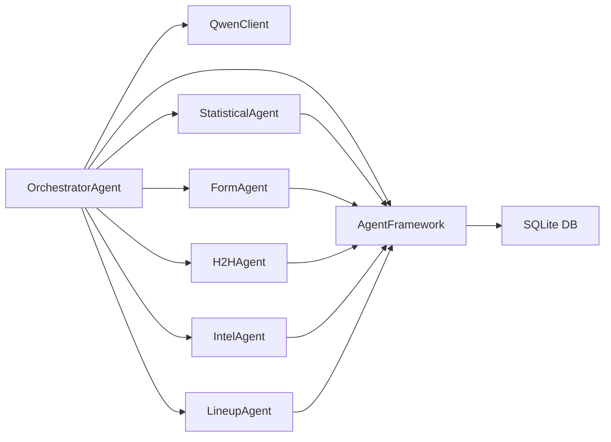

# AI Agent System

<cite>
**Referenced Files in This Document**
- [agentFramework.js](file://backend/services/agents/agentFramework.js)
- [statisticalAgent.js](file://backend/services/agents/statisticalAgent.js)
- [formAgent.js](file://backend/services/agents/formAgent.js)
- [h2hAgent.js](file://backend/services/agents/h2hAgent.js)
- [intelAgent.js](file://backend/services/agents/intelAgent.js)
- [lineupAgent.js](file://backend/services/agents/lineupAgent.js)
- [orchestratorAgent.js](file://backend/services/agents/orchestratorAgent.js)
- [qwenClient.js](file://backend/services/qwenClient.js)
- [db.js](file://backend/database/db.js)
- [SPEC.md](file://specs/SPEC.md)
</cite>

## Table of Contents
1. [Introduction](#introduction)
2. [Project Structure](#project-structure)
3. [Core Components](#core-components)
4. [Architecture Overview](#architecture-overview)
5. [Detailed Component Analysis](#detailed-component-analysis)
6. [Dependency Analysis](#dependency-analysis)
7. [Performance Considerations](#performance-considerations)
8. [Troubleshooting Guide](#troubleshooting-guide)
9. [Conclusion](#conclusion)
10. [Appendices](#appendices)

## Introduction
This document explains the multi-agent AI system architecture used to produce World Cup 2026 match predictions. The system coordinates five specialized agents that analyze distinct aspects of a match, then negotiates differences to produce a robust, weighted synthesis. It integrates Qwen models across three tiers (qwen-max, qwen-plus, qwen-turbo) to balance cost, performance, and capability. The framework enforces strict output schemas, tracks sessions and conflicts, and persists insights for auditability and reproducibility.

## Project Structure
The multi-agent system is implemented in the backend under services/agents and orchestrated by orchestratorAgent.js. Agents communicate via a shared framework that handles LLM calls, parsing, conflict detection, negotiation, and persistence. Qwen integration is encapsulated in qwenClient.js, while SQLite-backed persistence is handled in db.js. The product specification in SPEC.md defines the prediction pipeline and agent roles.

**Diagram sources**
- [orchestratorAgent.js:309-502](file://backend/services/agents/orchestratorAgent.js#L309-L502)
- [agentFramework.js:208-586](file://backend/services/agents/agentFramework.js#L208-L586)
- [qwenClient.js:1-123](file://backend/services/qwenClient.js#L1-L123)
- [db.js:167-207](file://backend/database/db.js#L167-L207)

**Section sources**
- [SPEC.md:148-159](file://specs/SPEC.md#L148-L159)
- [orchestratorAgent.js:309-502](file://backend/services/agents/orchestratorAgent.js#L309-L502)
- [agentFramework.js:208-586](file://backend/services/agents/agentFramework.js#L208-L586)
- [qwenClient.js:1-123](file://backend/services/qwenClient.js#L1-L123)
- [db.js:167-207](file://backend/database/db.js#L167-L207)

## Core Components
- AgentFramework: Base class for agents and orchestration of multi-agent sessions. Provides JSON schema enforcement, parsing, conflict detection, negotiation, and persistence.
- Specialized Agents: Five agents interpret domain-specific signals (statistical backbone, form, H2H, intelligence, confirmed lineups) and return structured outputs.
- OrchestratorAgent: Coordinates agent dispatch, conflict detection, negotiation, blending, and saving results.
- QwenClient: Unified interface to DashScope-compatible Qwen API with retries and model selection.
- Persistence: AgentSessions, agent_messages, and agent_conflicts tables track methodology attribution and insight generation.

Key behaviors:
- Conflict detection uses a maximum probability delta threshold to trigger pairwise negotiation.
- Negotiation adjusts weights post-resolution: the agent that moved less “wins” and receives a weight boost; the other’s weight is penalized.
- Outputs are normalized and validated to ensure consistent JSON schema compliance.

**Section sources**
- [agentFramework.js:31-53](file://backend/services/agents/agentFramework.js#L31-L53)
- [agentFramework.js:113-119](file://backend/services/agents/agentFramework.js#L113-L119)
- [agentFramework.js:376-404](file://backend/services/agents/agentFramework.js#L376-L404)
- [agentFramework.js:406-445](file://backend/services/agents/agentFramework.js#L406-L445)
- [agentFramework.js:447-503](file://backend/services/agents/agentFramework.js#L447-L503)
- [agentFramework.js:184-205](file://backend/services/agents/agentFramework.js#L184-L205)
- [db.js:167-207](file://backend/database/db.js#L167-L207)

## Architecture Overview
The system follows a deterministic pipeline:
1. Precompute backbone (Dixon-Coles) and venue/home-advantage context.
2. Pre-fetch domain data in parallel (H2H, form, intel, lineup).
3. Build agent tasks and dispatch Round 1 in parallel.
4. Detect conflicts and run Round 2 rebuttals if needed.
5. Adjust weights based on concessions and synthesize final probabilities.
6. Generate insight and save session and prediction.

**Diagram sources**
- [orchestratorAgent.js:319-499](file://backend/services/agents/orchestratorAgent.js#L319-L499)
- [agentFramework.js:355-374](file://backend/services/agents/agentFramework.js#L355-L374)
- [agentFramework.js:382-404](file://backend/services/agents/agentFramework.js#L382-L404)
- [agentFramework.js:411-445](file://backend/services/agents/agentFramework.js#L411-L445)
- [agentFramework.js:455-503](file://backend/services/agents/agentFramework.js#L455-L503)
- [agentFramework.js:510-571](file://backend/services/agents/agentFramework.js#L510-L571)
- [qwenClient.js:53-101](file://backend/services/qwenClient.js#L53-L101)
- [db.js:167-207](file://backend/database/db.js#L167-L207)

## Detailed Component Analysis

### AgentFramework
- Agent base class:
  - run(): Executes LLM call with system prompt and user message; parses and validates output; retries once on JSON parse failure.
  - challenge(): Builds a negotiation prompt and executes LLM call; falls back to original Round 1 output if LLM fails.
- AgentSession:
  - dispatch(): Runs all agents concurrently and collects outputs.
  - detectConflicts(): Compares every pair of outputs and flags conflicts exceeding the threshold.
  - negotiate(): Challenges conflicting pairs simultaneously and records resolutions.
  - buildFinalOutputs(): Computes final weights by measuring movement in Round 2 and applying boosts/penalties accordingly.
  - save(): Persists session metadata, messages, and conflict resolutions to the database.

**Diagram sources**
- [agentFramework.js:211-330](file://backend/services/agents/agentFramework.js#L211-L330)
- [agentFramework.js:336-572](file://backend/services/agents/agentFramework.js#L336-L572)

**Section sources**
- [agentFramework.js:211-330](file://backend/services/agents/agentFramework.js#L211-L330)
- [agentFramework.js:336-572](file://backend/services/agents/agentFramework.js#L336-L572)

### Statistical Agent (qwen-plus)
- Role: Interprets Dixon-Coles backbone output (λ values, ELO, attack/defense α/β, home advantage, venue effect) into natural language probabilities.
- Output: Uses the backbone as an anchor, adjusting for observed statistical factors.

**Diagram sources**
- [statisticalAgent.js:32-87](file://backend/services/agents/statisticalAgent.js#L32-L87)

**Section sources**
- [statisticalAgent.js:1-98](file://backend/services/agents/statisticalAgent.js#L1-L98)

### Form Agent (qwen-turbo)
- Role: Evaluates recent form (last 10 matches), momentum, goals-for/goals-against, and competition weighting.
- Output: Emphasizes recent results and quality of opposition.

**Section sources**
- [formAgent.js:1-113](file://backend/services/agents/formAgent.js#L1-L113)

### H2H Agent (qwen-turbo)
- Role: Interprets a competition-weighted head-to-head record from a large historical dataset.
- Behavior: Returns null when fewer than two meetings exist; otherwise computes weighted probabilities and flags data quality.

**Section sources**
- [h2hAgent.js:1-107](file://backend/services/agents/h2hAgent.js#L1-L107)

### Intel Agent (qwen-plus)
- Role: Interprets pre-match intelligence (injuries, motivation, rotation) and estimates probability shifts.
- Output: Calibrated shifts based on severity and confidence; reduces weight when data is sparse.

**Section sources**
- [intelAgent.js:1-128](file://backend/services/agents/intelAgent.js#L1-L128)

### Lineup Agent (qwen-plus)
- Role: Assesses confirmed starting XI strength and formation matchups.
- Behavior: Activates only when lineup is available (~60–75 min before KO). Carries the highest weight when active.

**Section sources**
- [lineupAgent.js:1-118](file://backend/services/agents/lineupAgent.js#L1-L118)

### OrchestratorAgent
- Coordinates the multi-agent run:
  - Pre-fetches domain data in parallel.
  - Builds agent tasks and dispatches Round 1.
  - Detects conflicts and negotiates if needed.
  - Blends outputs via log-pool and applies temperature scaling.
  - Generates insight and saves session and prediction.

**Diagram sources**
- [orchestratorAgent.js:319-499](file://backend/services/agents/orchestratorAgent.js#L319-L499)

**Section sources**
- [orchestratorAgent.js:1-502](file://backend/services/agents/orchestratorAgent.js#L1-L502)

### Qwen Integration and Model Tiering
- Models:
  - qwen-max: Orchestrator (complex reasoning, insight generation).
  - qwen-plus: Statistical, Intel, Lineup agents (balanced).
  - qwen-turbo: Form, H2H agents (fast throughput).
- chatComplete():
  - Enforces OpenAI-compatible messages.
  - Retries on transient failures with exponential backoff.
  - Returns text, latency, and optional usage.

**Section sources**
- [qwenClient.js:1-123](file://backend/services/qwenClient.js#L1-L123)
- [SPEC.md:152-156](file://specs/SPEC.md#L152-L156)

### Agent Session Tracking, Methodology Attribution, and Insight Generation
- AgentSession persists:
  - Session metadata (agents used, rounds, conflicts).
  - Round 1 and Round 2 messages with probabilities, confidence, and evidence.
  - Conflict detections and resolutions with winner/loser and reasoning.
- OrchestratorAgent builds:
  - Factors list with agent name, description, favor direction, impact, and weight.
  - Methodology string summarizing weighted contributions.
  - Insight paragraph generated from top evidence and conflict resolution.

**Section sources**
- [agentFramework.js:510-571](file://backend/services/agents/agentFramework.js#L510-L571)
- [db.js:167-207](file://backend/database/db.js#L167-L207)
- [orchestratorAgent.js:184-271](file://backend/services/agents/orchestratorAgent.js#L184-L271)

## Dependency Analysis
- OrchestratorAgent depends on:
  - AgentFramework for orchestration and persistence.
  - QwenClient for model calls.
  - Specialized agents for domain prompts and data fetching.
  - Services for domain data (form, H2H, intel, lineup).
- AgentFramework depends on:
  - QwenClient for LLM calls.
  - Database for message and session persistence.
- Specialized agents depend on:
  - AgentFramework for base class and JSON schema.
  - QwenClient for model selection.
  - Domain services for data fetching.

**Diagram sources**
- [orchestratorAgent.js:32-37](file://backend/services/agents/orchestratorAgent.js#L32-L37)
- [agentFramework.js:28-29](file://backend/services/agents/agentFramework.js#L28-L29)
- [db.js:167-207](file://backend/database/db.js#L167-L207)

**Section sources**
- [orchestratorAgent.js:32-37](file://backend/services/agents/orchestratorAgent.js#L32-L37)
- [agentFramework.js:28-29](file://backend/services/agents/agentFramework.js#L28-L29)
- [db.js:167-207](file://backend/database/db.js#L167-L207)

## Performance Considerations
- Parallelism:
  - Round 1 dispatch runs all agents concurrently to minimize latency.
  - Negotiation challenges conflicting pairs simultaneously.
- Cost optimization:
  - Use qwen-turbo for high-volume, pattern-recognition tasks (Form, H2H).
  - Reserve qwen-plus for nuanced interpretation (Statistical, Intel, Lineup).
  - Use qwen-max only for orchestrator tasks requiring synthesis and insight.
- Robustness:
  - JSON parsing with sanitization and retries.
  - Graceful fallbacks when domain data is unavailable.
- Persistence overhead:
  - Batch writes for messages and conflicts.
  - Minimal schema footprint with JSON fields for flexibility.

[No sources needed since this section provides general guidance]

## Troubleshooting Guide
Common issues and remedies:
- JSON parse errors:
  - The framework retries once with a stricter instruction; if still failing, falls back to uniform priors and marks parse errors.
- LLM call failures:
  - Agent.run() and Agent.challenge() catch exceptions and return safe defaults; negotiation falls back to original Round 1 output if rebuttal fails.
- Missing domain data:
  - Agents return null prompts or skip themselves when data is unavailable (e.g., LineupAgent).
- Conflict resolution:
  - If negotiation fails, the system retains Round 1 outputs and proceeds with blending.

**Section sources**
- [agentFramework.js:122-156](file://backend/services/agents/agentFramework.js#L122-L156)
- [agentFramework.js:245-248](file://backend/services/agents/agentFramework.js#L245-L248)
- [agentFramework.js:297-300](file://backend/services/agents/agentFramework.js#L297-L300)
- [lineupAgent.js:64-66](file://backend/services/agents/lineupAgent.js#L64-L66)

## Conclusion
The multi-agent system combines five domain-specialists with a robust negotiation protocol to produce accurate, explainable match predictions. Strict output schemas, conflict detection, and weight adjustments ensure that diverse signals coalesce into a coherent synthesis. Qwen tiering balances cost and capability, while comprehensive persistence enables methodological transparency and continuous improvement.

[No sources needed since this section summarizes without analyzing specific files]

## Appendices

### Agent Negotiation Protocol Details
- Threshold: Conflict triggers when the maximum probability delta exceeds 0.20.
- Movement metric: Euclidean-like distance in probability space between Round 1 and Round 2 outputs.
- Outcome:
  - Winner: agent with smaller movement; receives a 1.3× weight boost.
  - Loser: agent with larger movement; receives a 0.6× weight penalty and its revised probabilities are used in final blending.

**Section sources**
- [agentFramework.js:32-34](file://backend/services/agents/agentFramework.js#L32-L34)
- [agentFramework.js:463-486](file://backend/services/agents/agentFramework.js#L463-L486)

### Example Interaction Scenarios
- Scenario A: StatisticalAgent and IntelAgent disagree on home advantage. After negotiation, StatisticalAgent holds position; IntelAgent concedes. Final weight for StatisticalAgent increases; IntelAgent’s revised output replaces its Round 1 probabilities in the final blend.
- Scenario B: FormAgent and H2HAgent present contrasting views due to small H2H sample. H2HAgent returns null prompt; FormAgent remains the sole contributor.
- Scenario C: LineupAgent activates with confirmed XI. Its high weight dominates the final blend, with minimal movement in negotiation.

**Section sources**
- [agentFramework.js:463-500](file://backend/services/agents/agentFramework.js#L463-L500)
- [h2hAgent.js:55-61](file://backend/services/agents/h2hAgent.js#L55-L61)
- [lineupAgent.js:64-66](file://backend/services/agents/lineupAgent.js#L64-L66)