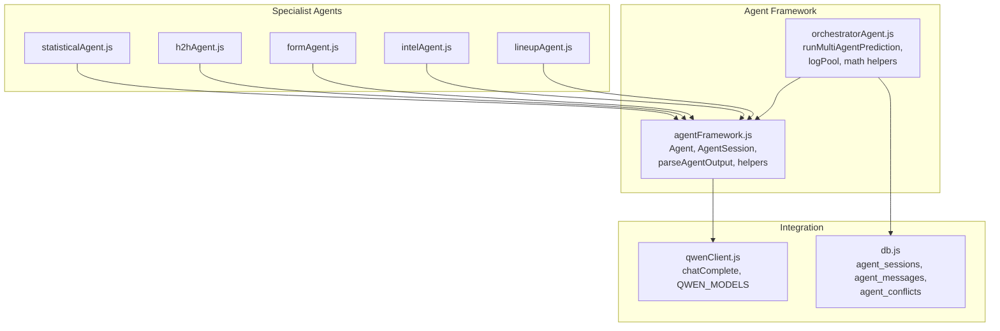
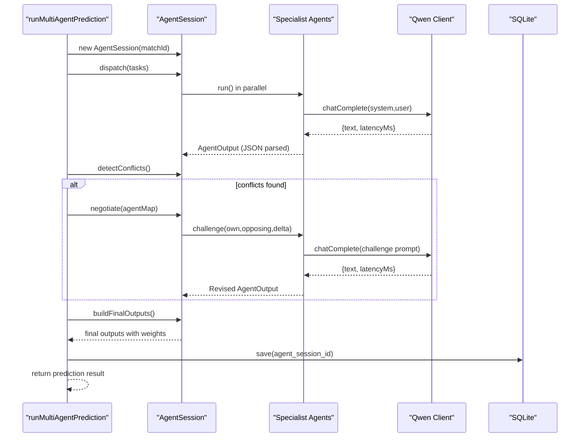
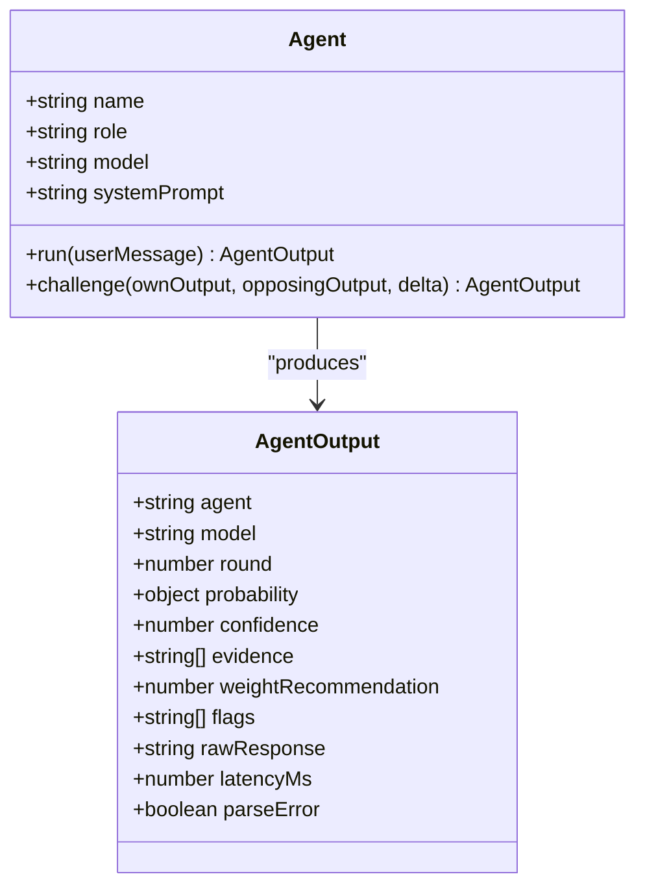
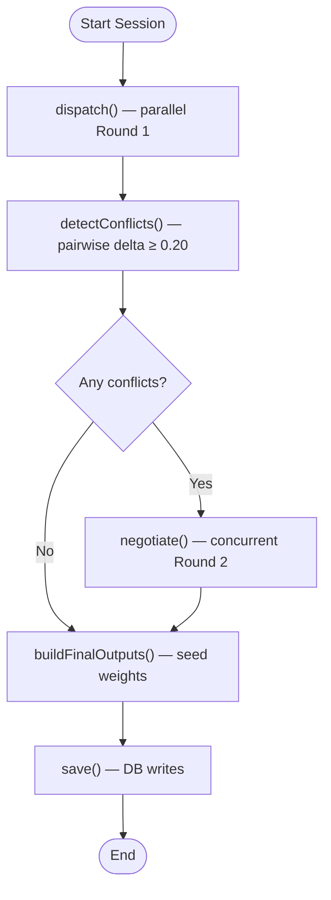
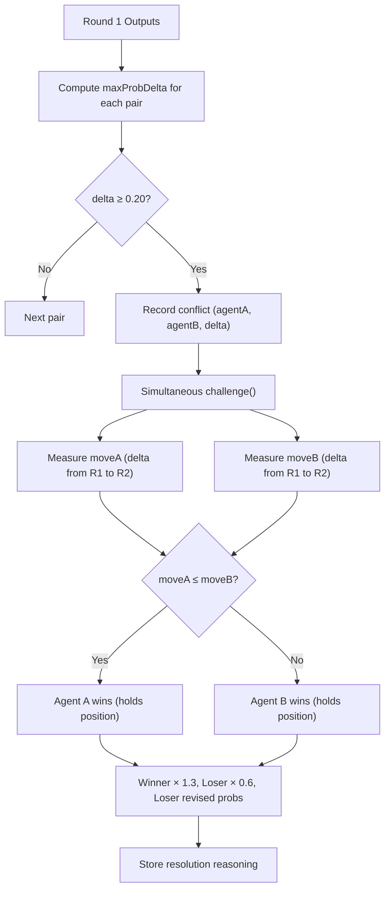
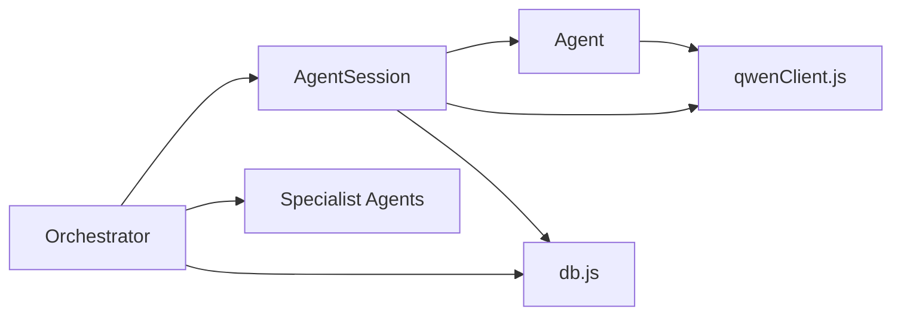

# Agent Framework Core

<cite>
**Referenced Files in This Document**
- [agentFramework.js](file://backend/services/agents/agentFramework.js)
- [orchestratorAgent.js](file://backend/services/agents/orchestratorAgent.js)
- [statisticalAgent.js](file://backend/services/agents/statisticalAgent.js)
- [h2hAgent.js](file://backend/services/agents/h2hAgent.js)
- [formAgent.js](file://backend/services/agents/formAgent.js)
- [intelAgent.js](file://backend/services/agents/intelAgent.js)
- [lineupAgent.js](file://backend/services/agents/lineupAgent.js)
- [qwenClient.js](file://backend/services/qwenClient.js)
- [db.js](file://backend/database/db.js)
- [SPEC.md](file://specs/SPEC.md)
</cite>

## Table of Contents
1. [Introduction](#introduction)
2. [Project Structure](#project-structure)
3. [Core Components](#core-components)
4. [Architecture Overview](#architecture-overview)
5. [Detailed Component Analysis](#detailed-component-analysis)
6. [Dependency Analysis](#dependency-analysis)
7. [Performance Considerations](#performance-considerations)
8. [Troubleshooting Guide](#troubleshooting-guide)
9. [Conclusion](#conclusion)

## Introduction
This document explains the core multi-agent prediction framework used by the World Cup 2026 prediction system. It covers the Agent base class design, LLM integration patterns, JSON response parsing, and the AgentSession orchestration lifecycle. It documents conflict detection using pairwise probability deltas, negotiation mechanics, and the weight adjustment system. It also describes the JSON schema for agent outputs, error handling and fallbacks, and database persistence for sessions, messages, and conflict resolutions.

## Project Structure
The agent framework lives under backend/services/agents and integrates with the broader prediction pipeline via the orchestrator. LLM calls are routed through a shared Qwen client, and results are persisted to an SQLite database with dedicated tables for sessions, messages, and conflicts.

**Diagram sources**
- [agentFramework.js:1-586](file://backend/services/agents/agentFramework.js#L1-L586)
- [orchestratorAgent.js:1-502](file://backend/services/agents/orchestratorAgent.js#L1-L502)
- [qwenClient.js:1-123](file://backend/services/qwenClient.js#L1-L123)
- [db.js:167-207](file://backend/database/db.js#L167-L207)

**Section sources**
- [agentFramework.js:1-586](file://backend/services/agents/agentFramework.js#L1-L586)
- [orchestratorAgent.js:1-502](file://backend/services/agents/orchestratorAgent.js#L1-L502)
- [qwenClient.js:1-123](file://backend/services/qwenClient.js#L1-L123)
- [db.js:167-207](file://backend/database/db.js#L167-L207)

## Core Components
- Agent: A lightweight LLM wrapper that enforces a strict JSON schema, performs robust JSON extraction, and supports retry-on-failure for both Round 1 and Round 2.
- AgentSession: Orchestrates multi-agent runs, pairwise conflict detection, simultaneous negotiation, and final output synthesis with weight adjustments.
- Qwen client: Shared OpenAI-compatible client with retry/backoff logic and model selection constants.
- Database schema: Dedicated tables for agent sessions, messages, and conflicts with JSON-serialized fields for probabilities and evidence.

**Section sources**
- [agentFramework.js:208-330](file://backend/services/agents/agentFramework.js#L208-L330)
- [agentFramework.js:336-572](file://backend/services/agents/agentFramework.js#L336-L572)
- [qwenClient.js:13-123](file://backend/services/qwenClient.js#L13-L123)
- [db.js:167-207](file://backend/database/db.js#L167-L207)

## Architecture Overview
The orchestrator coordinates a multi-agent run per match. It builds prompts for each specialist agent, dispatches them in parallel, detects conflicts, negotiates, merges outputs with adjusted weights, and persists results.

**Diagram sources**
- [orchestratorAgent.js:319-499](file://backend/services/agents/orchestratorAgent.js#L319-L499)
- [agentFramework.js:355-444](file://backend/services/agents/agentFramework.js#L355-L444)
- [agentFramework.js:231-329](file://backend/services/agents/agentFramework.js#L231-L329)
- [qwenClient.js:53-101](file://backend/services/qwenClient.js#L53-L101)
- [db.js:510-571](file://backend/database/db.js#L510-L571)

## Detailed Component Analysis

### Agent Base Class Design
- Responsibilities:
  - Encapsulates model, system prompt, and role.
  - Round 1: sends user message to LLM, parses JSON, and retries once on failure.
  - Round 2: constructs a negotiation prompt, challenges the opposing agent, and retries once.
- JSON schema enforcement:
  - Agents embed a canonical schema in their system prompt requiring probability, confidence, evidence, weightRecommendation, and optional flags.
  - parseAgentOutput validates and normalizes outputs, applies fallbacks on parse errors, and ensures probabilities sum to 1.
- LLM integration:
  - Uses chatComplete with model selection and bounded tokens.
  - Applies retry-on-failure with a stricter prompt on second attempt.

**Diagram sources**
- [agentFramework.js:211-330](file://backend/services/agents/agentFramework.js#L211-L330)
- [agentFramework.js:122-156](file://backend/services/agents/agentFramework.js#L122-L156)

**Section sources**
- [agentFramework.js:211-330](file://backend/services/agents/agentFramework.js#L211-L330)
- [agentFramework.js:122-156](file://backend/services/agents/agentFramework.js#L122-L156)
- [qwenClient.js:53-101](file://backend/services/qwenClient.js#L53-L101)

### AgentSession Orchestration
- dispatch(): Runs all agents concurrently, collects settled results, filters rejections, and records Round 1 outputs.
- detectConflicts(): Computes pairwise max probability delta using a 0.20 threshold and records conflict pairs.
- negotiate(): For each conflict, challenges both agents concurrently and stores revised outputs.
- buildFinalOutputs(): Seeds from Round 1 weights, adjusts winners by 1.3x and losers by 0.6x based on who conceded more, and records resolutions.
- save(): Persists session metadata, Round 1 and Round 2 messages, and conflict-resolution records.

**Diagram sources**
- [agentFramework.js:355-444](file://backend/services/agents/agentFramework.js#L355-L444)
- [agentFramework.js:455-503](file://backend/services/agents/agentFramework.js#L455-L503)
- [agentFramework.js:510-571](file://backend/services/agents/agentFramework.js#L510-L571)

**Section sources**
- [agentFramework.js:355-444](file://backend/services/agents/agentFramework.js#L355-L444)
- [agentFramework.js:455-503](file://backend/services/agents/agentFramework.js#L455-L503)
- [agentFramework.js:510-571](file://backend/services/agents/agentFramework.js#L510-L571)

### Conflict Detection and Resolution
- Conflict detection:
  - maxProbDelta computes the largest absolute difference among winHome, draw, and winAway.
  - Threshold is 0.20; any delta exceeding it triggers negotiation.
- Resolution strategy:
  - Winner is the agent that moved less (smaller maxProbDelta) in Round 2.
  - Adjust weights: winner × 1.3, loser × 0.6, and replace loser’s probability with their revised output.
- Pairwise comparison logic:
  - Nested loops compare every pair once, capturing both agents’ outputs and the computed delta.

**Diagram sources**
- [agentFramework.js:113-119](file://backend/services/agents/agentFramework.js#L113-L119)
- [agentFramework.js:382-404](file://backend/services/agents/agentFramework.js#L382-L404)
- [agentFramework.js:463-500](file://backend/services/agents/agentFramework.js#L463-L500)

**Section sources**
- [agentFramework.js:113-119](file://backend/services/agents/agentFramework.js#L113-L119)
- [agentFramework.js:382-404](file://backend/services/agents/agentFramework.js#L382-L404)
- [agentFramework.js:463-500](file://backend/services/agents/agentFramework.js#L463-L500)

### Weight Adjustment Mechanics
- WINNER_WEIGHT_BOOST: 1.3x multiplier applied to the winner’s final weight.
- LOSER_WEIGHT_PENALTY: 0.6x multiplier applied to the loser’s final weight.
- Application occurs after negotiation: the loser’s probability is replaced with their revised output to reflect concession.

**Section sources**
- [agentFramework.js:32-34](file://backend/services/agents/agentFramework.js#L32-L34)
- [agentFramework.js:473-486](file://backend/services/agents/agentFramework.js#L473-L486)

### JSON Schema for Agent Responses
Every agent must respond with a JSON object matching the schema embedded in the system prompt. The framework enforces and normalizes this schema.

- probability: winHome, draw, winAway (must sum to 1.0)
- confidence: scalar in [0, 1]
- evidence: array of 2–4 concise bullet strings (≤80 chars each)
- weightRecommendation: scalar in [0, 1]
- flags: optional array of tags

Parsing and normalization:
- sanitizeJSON fixes common malformed arrays.
- extractJSON finds JSON inside fenced code blocks or bare objects.
- normalizeProbs ensures probabilities sum to 1.
- parseAgentOutput validates fields, caps extremes, and injects fallbacks on parse errors.

**Section sources**
- [agentFramework.js:40-53](file://backend/services/agents/agentFramework.js#L40-L53)
- [agentFramework.js:56-100](file://backend/services/agents/agentFramework.js#L56-L100)
- [agentFramework.js:103-111](file://backend/services/agents/agentFramework.js#L103-L111)
- [agentFramework.js:122-156](file://backend/services/agents/agentFramework.js#L122-L156)

### LLM Integration Patterns and Retry Logic
- chatComplete:
  - Uses OpenAI-compatible endpoint with Bearer token.
  - Supports retries with exponential backoff on 5xx or timeouts.
  - Returns text, latencyMs, and optional usage.
- Agent.run and Agent.challenge:
  - On first failure, immediately retry with a stricter prompt emphasizing JSON-only responses.
  - On persistent failure, fall back to a uniform prior and minimal confidence/weight.
- Orchestrator insight generation:
  - Uses a separate prompt to synthesize human-readable insight, with a fallback when LLM fails.

**Section sources**
- [qwenClient.js:53-101](file://backend/services/qwenClient.js#L53-L101)
- [agentFramework.js:231-272](file://backend/services/agents/agentFramework.js#L231-L272)
- [agentFramework.js:282-329](file://backend/services/agents/agentFramework.js#L282-L329)
- [orchestratorAgent.js:196-271](file://backend/services/agents/orchestratorAgent.js#L196-L271)

### Database Persistence Patterns
Tables:
- agent_sessions: session metadata, rounds, conflict counts, synthesis method, timing.
- agent_messages: Round 1 “analysis” and Round 2 “rebuttal” entries with serialized probability and evidence.
- agent_conflicts: conflict records with resolution and reasoning.

Persistence flow:
- After building final outputs, AgentSession.save writes:
  - Session header
  - Round 1 messages
  - Round 2 rebuttal messages
  - Conflict-resolution rows

**Section sources**
- [db.js:167-207](file://backend/database/db.js#L167-L207)
- [agentFramework.js:510-571](file://backend/services/agents/agentFramework.js#L510-L571)

### Specialist Agents Overview
Each agent extends the base Agent and supplies:
- A system prompt embedding the canonical JSON schema.
- A buildPrompt function that formats match context and domain data.
- An agent singleton instance with model selection.

- StatisticalAgent: Uses Dixon-Coles backbone outputs and ELO/alpha-beta ratings.
- H2HAgent: Uses weighted head-to-head record; skips when insufficient meetings.
- FormAgent: Summarizes recent form with competition weighting.
- IntelAgent: Interprets injuries, rotation, motivation from structured intelligence.
- LineupAgent: Analyzes confirmed starting XI; activates only when available.

**Section sources**
- [statisticalAgent.js:18-98](file://backend/services/agents/statisticalAgent.js#L18-L98)
- [h2hAgent.js:18-107](file://backend/services/agents/h2hAgent.js#L18-L107)
- [formAgent.js:17-113](file://backend/services/agents/formAgent.js#L17-L113)
- [intelAgent.js:20-128](file://backend/services/agents/intelAgent.js#L20-L128)
- [lineupAgent.js:18-118](file://backend/services/agents/lineupAgent.js#L18-L118)

## Dependency Analysis
- Agent depends on:
  - Qwen client for LLM calls.
  - Framework helpers for JSON extraction, normalization, and delta computation.
- AgentSession depends on:
  - Agent instances and their outputs.
  - Qwen client for negotiation prompts.
  - Database helpers for persistence.
- Orchestrator depends on:
  - AgentSession orchestration.
  - Specialist agents and math helpers (log-pool blending, temperature scaling, scoreline derivation).
  - Database for saving predictions and retrieving calibration temperature.

**Diagram sources**
- [agentFramework.js:29-29](file://backend/services/agents/agentFramework.js#L29-L29)
- [orchestratorAgent.js:28-37](file://backend/services/agents/orchestratorAgent.js#L28-L37)
- [db.js:167-207](file://backend/database/db.js#L167-L207)

**Section sources**
- [agentFramework.js:29-29](file://backend/services/agents/agentFramework.js#L29-L29)
- [orchestratorAgent.js:28-37](file://backend/services/agents/orchestratorAgent.js#L28-L37)
- [db.js:167-207](file://backend/database/db.js#L167-L207)

## Performance Considerations
- Parallelism: AgentSession.dispatch runs all agents concurrently to minimize wall-clock time.
- Negotiation concurrency: AgentSession.negotiate challenges both sides simultaneously for each conflict.
- JSON parsing: sanitizeJSON and extractJSON reduce retries by fixing common malformed outputs.
- Temperature and token limits: chatComplete uses conservative maxTokens and low temperature for deterministic JSON output.
- Weight adjustments: Winners gain more influence, reducing subsequent iterations and stabilizing the blend.

[No sources needed since this section provides general guidance]

## Troubleshooting Guide
Common issues and mitigations:
- LLM failures:
  - chatComplete retries on 5xx or timeouts; Agent.run and Agent.challenge retry once with a stricter JSON-only instruction.
  - Persistent failures fall back to uniform priors with minimal confidence and weight.
- JSON parsing errors:
  - sanitizeJSON repairs common array-closing mistakes.
  - parseAgentOutput injects fallback fields and flags parseError for downstream filtering.
- Missing lineup or intelligence:
  - LineupAgent returns null to signal skip; orchestrator omits it.
  - IntelAgent returns null on scrape failure; orchestrator proceeds with lower weight.
- Database errors:
  - saveMessage and save wrap writes in try/catch and log errors without aborting the session.

**Section sources**
- [qwenClient.js:67-98](file://backend/services/qwenClient.js#L67-L98)
- [agentFramework.js:252-269](file://backend/services/agents/agentFramework.js#L252-L269)
- [agentFramework.js:304-321](file://backend/services/agents/agentFramework.js#L304-L321)
- [agentFramework.js:56-62](file://backend/services/agents/agentFramework.js#L56-L62)
- [agentFramework.js:122-156](file://backend/services/agents/agentFramework.js#L122-L156)
- [lineupAgent.js:64-66](file://backend/services/agents/lineupAgent.js#L64-L66)
- [intelAgent.js:50-57](file://backend/services/agents/intelAgent.js#L50-L57)
- [agentFramework.js:184-205](file://backend/services/agents/agentFramework.js#L184-L205)
- [agentFramework.js:566-568](file://backend/services/agents/agentFramework.js#L566-L568)

## Conclusion
The agent framework provides a robust, extensible foundation for multi-agent prediction. By enforcing a strict JSON schema, applying deterministic parsing, and integrating resilient LLM calls with retry logic, it ensures reliable outputs. The AgentSession orchestrator coordinates parallel analysis, conflict detection, negotiation, and weighted blending, while comprehensive database persistence enables auditability and reproducibility.