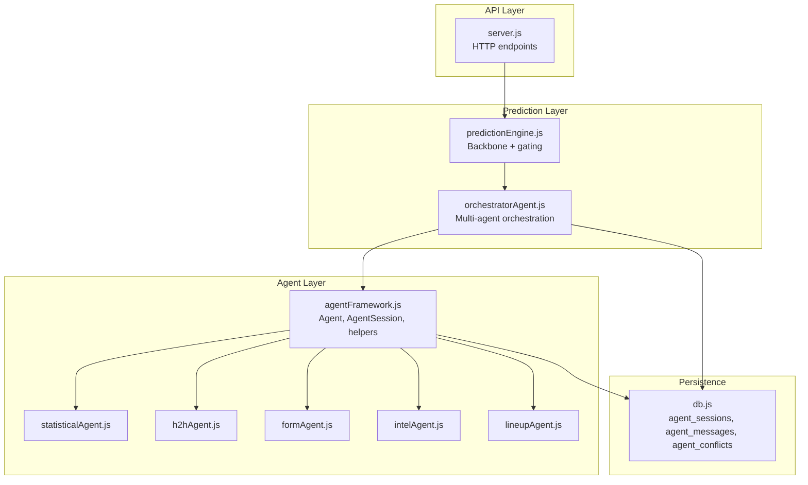
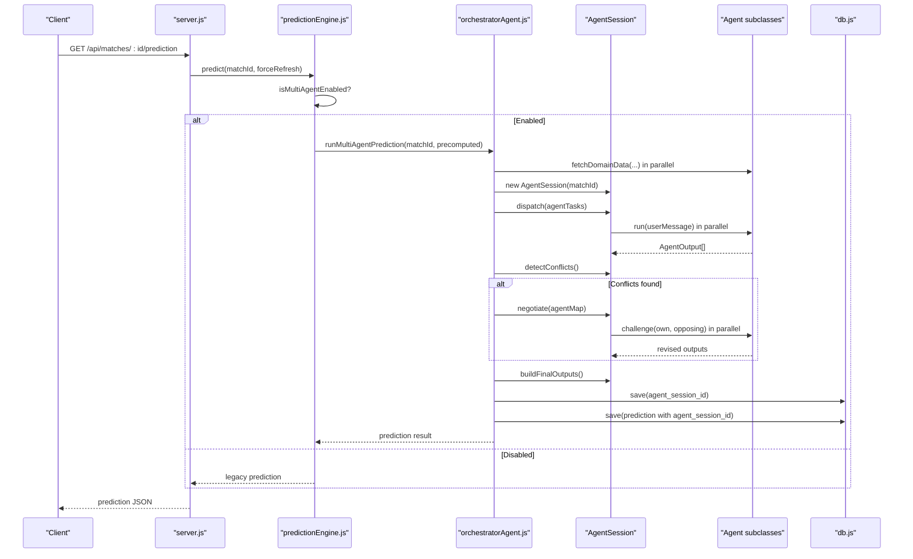
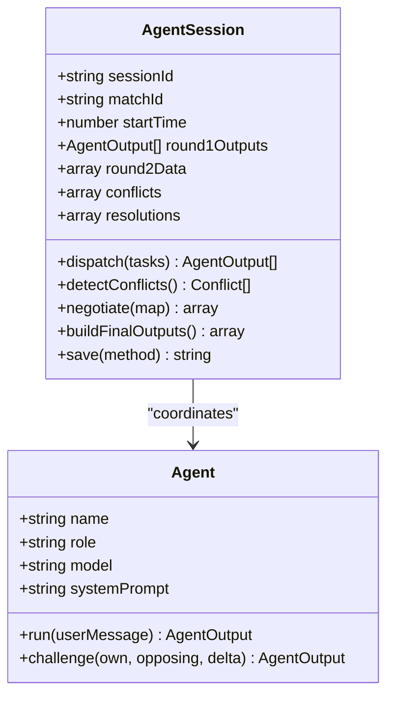
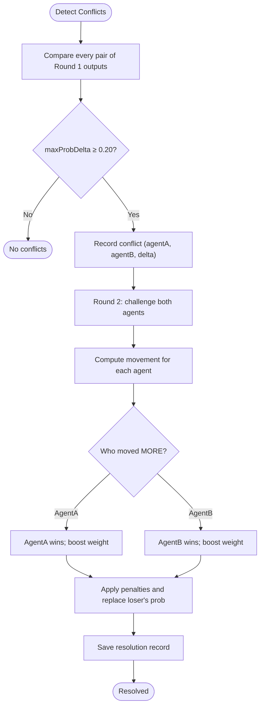
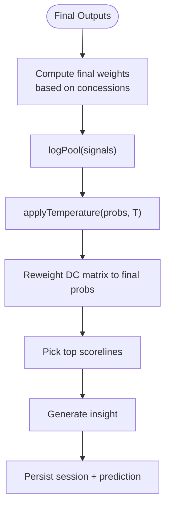
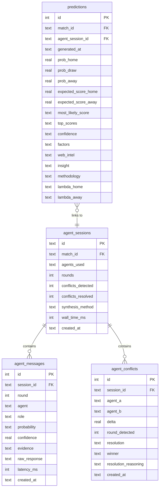
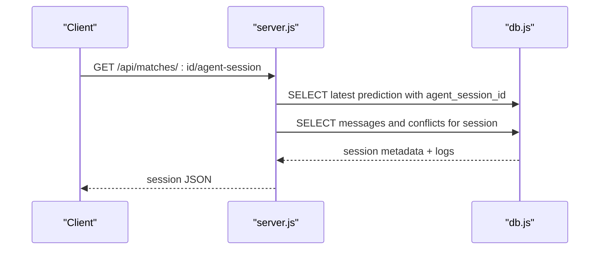
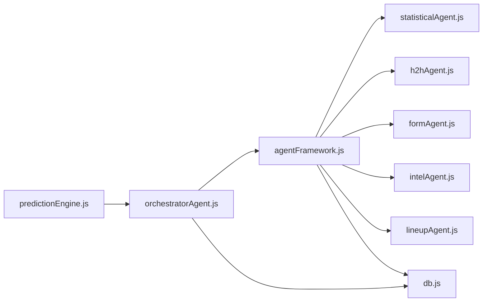

# Agent Session Management

<cite>
**Referenced Files in This Document**
- [agentFramework.js](file://backend/services/agents/agentFramework.js)
- [orchestratorAgent.js](file://backend/services/agents/orchestratorAgent.js)
- [db.js](file://backend/database/db.js)
- [predictionEngine.js](file://backend/services/predictionEngine.js)
- [server.js](file://backend/server.js)
</cite>

## Table of Contents
1. [Introduction](#introduction)
2. [Project Structure](#project-structure)
3. [Core Components](#core-components)
4. [Architecture Overview](#architecture-overview)
5. [Detailed Component Analysis](#detailed-component-analysis)
6. [Dependency Analysis](#dependency-analysis)
7. [Performance Considerations](#performance-considerations)
8. [Troubleshooting Guide](#troubleshooting-guide)
9. [Conclusion](#conclusion)
10. [Appendices](#appendices)

## Introduction
This document explains the agent session lifecycle and tracking for the multi-agent prediction system. It covers how AgentSession orchestrates parallel agent execution, detects and negotiates conflicts, synthesizes final outputs, and persists session data for auditability and debugging. It also documents the database schemas for agent sessions, messages, and conflicts, along with wall-time tracking, round counting, and correlation patterns linking predictions to agent sessions.

## Project Structure
The multi-agent prediction pipeline spans several modules:
- Agent framework: defines Agent and AgentSession, orchestration primitives, and persistence helpers
- Orchestrator: composes domain data, builds agent tasks, runs the two-round negotiation, and produces final predictions
- Database: defines schemas for agent_sessions, agent_messages, agent_conflicts, and links them to predictions
- Prediction engine: computes the backbone model and delegates to the orchestrator when multi-agent mode is enabled
- Server: exposes endpoints to fetch predictions and agent sessions

**Diagram sources**
- [server.js:325-358](file://backend/server.js#L325-L358)
- [predictionEngine.js:46-53](file://backend/services/predictionEngine.js#L46-L53)
- [orchestratorAgent.js:309-501](file://backend/services/agents/orchestratorAgent.js#L309-L501)
- [agentFramework.js:208-586](file://backend/services/agents/agentFramework.js#L208-L586)
- [db.js:167-208](file://backend/database/db.js#L167-L208)

**Section sources**
- [server.js:325-358](file://backend/server.js#L325-L358)
- [predictionEngine.js:46-53](file://backend/services/predictionEngine.js#L46-L53)
- [orchestratorAgent.js:309-501](file://backend/services/agents/orchestratorAgent.js#L309-L501)
- [agentFramework.js:208-586](file://backend/services/agents/agentFramework.js#L208-L586)
- [db.js:167-208](file://backend/database/db.js#L167-L208)

## Core Components
- AgentSession: encapsulates a single multi-agent run, tracks round outputs, detects conflicts, negotiates, and persists results
- Agent: wraps an LLM-backed specialist with a fixed role; supports Round 1 analysis and Round 2 rebuttal
- Orchestrator: coordinates pre-fetching domain data, building agent tasks, running AgentSession phases, blending outputs, and saving predictions
- Persistence: writes agent_sessions, agent_messages, and agent_conflicts rows; prediction rows link to agent_session_id

Key behaviors:
- UUID generation for session identifiers
- Parallel dispatch of agents in Round 1
- Pairwise conflict detection using a configurable threshold
- Simultaneous negotiation in Round 2
- Final output synthesis via weighted log-pool blending
- Wall-time tracking and round counting
- Audit trail persisted to DB for inspection and debugging

**Section sources**
- [agentFramework.js:336-572](file://backend/services/agents/agentFramework.js#L336-L572)
- [agentFramework.js:211-330](file://backend/services/agents/agentFramework.js#L211-L330)
- [orchestratorAgent.js:309-501](file://backend/services/agents/orchestratorAgent.js#L309-L501)

## Architecture Overview
The multi-agent prediction flow begins in the prediction engine, which optionally delegates to the orchestrator when multi-agent mode is enabled. The orchestrator pre-fetches domain data, constructs agent tasks, and hands control to AgentSession. After conflict detection and optional negotiation, the orchestrator blends outputs and generates insights, then persists both the agent session and the prediction.

**Diagram sources**
- [server.js:325-358](file://backend/server.js#L325-L358)
- [predictionEngine.js:46-53](file://backend/services/predictionEngine.js#L46-L53)
- [orchestratorAgent.js:309-501](file://backend/services/agents/orchestratorAgent.js#L309-L501)
- [agentFramework.js:336-572](file://backend/services/agents/agentFramework.js#L336-L572)
- [db.js:167-208](file://backend/database/db.js#L167-L208)

## Detailed Component Analysis

### AgentSession Lifecycle
AgentSession manages a single multi-agent run:
- Initialization: generates a UUID, captures matchId, starts timing
- Round 1 dispatch: runs all agents concurrently and collects outputs
- Conflict detection: compares every pair of outputs and flags differences exceeding a threshold
- Round 2 negotiation: challenges conflicting agents simultaneously and records revised outputs
- Final synthesis: adjusts weights based on concessions and prepares outputs for blending
- Persistence: inserts agent_sessions, agent_messages (round 1 and 2), and agent_conflicts records

**Diagram sources**
- [agentFramework.js:336-572](file://backend/services/agents/agentFramework.js#L336-L572)
- [agentFramework.js:211-330](file://backend/services/agents/agentFramework.js#L211-L330)

**Section sources**
- [agentFramework.js:336-572](file://backend/services/agents/agentFramework.js#L336-L572)

### Conflict Detection and Negotiation
- Conflict threshold: any maximum probability delta ≥ 0.20 triggers negotiation
- Round 2: both conflicting agents are challenged simultaneously; the agent that moved less is considered the winner and receives a weight boost; the loser’s weight is penalized and its probability is replaced in the final synthesis
- Resolutions capture winner, loser, movement metrics, and reasoning for auditability

**Diagram sources**
- [agentFramework.js:376-503](file://backend/services/agents/agentFramework.js#L376-L503)

**Section sources**
- [agentFramework.js:376-503](file://backend/services/agents/agentFramework.js#L376-L503)

### Final Output Synthesis and Blending
- Uses a weighted log-pool to combine agent outputs into final probabilities
- Applies temperature calibration for confidence scaling
- Reweights the Dixon–Coles score matrix to derive top scorelines and expected goals
- Generates insight text and builds factor metadata for transparency

**Diagram sources**
- [orchestratorAgent.js:417-449](file://backend/services/agents/orchestratorAgent.js#L417-L449)
- [db.js:274-303](file://backend/database/db.js#L274-L303)

**Section sources**
- [orchestratorAgent.js:417-449](file://backend/services/agents/orchestratorAgent.js#L417-L449)
- [db.js:274-303](file://backend/database/db.js#L274-L303)

### Session Persistence Strategy
Agent session data is persisted across three tables:
- agent_sessions: session metadata, round count, conflict counts, synthesis method, and wall time
- agent_messages: per-agent round 1 and round 2 rebuttals, including probabilities, confidence, evidence, raw responses, and latency
- agent_conflicts: detected conflicts, winners, and resolution reasoning

Predictions link to sessions via agent_session_id for traceability.

**Diagram sources**
- [db.js:167-208](file://backend/database/db.js#L167-L208)

**Section sources**
- [db.js:167-208](file://backend/database/db.js#L167-L208)

### Session State Management and Correlation
- Session ID: UUID generated at AgentSession construction
- Correlation: predictions include agent_session_id to link back to the agent session
- Audit trail: agent_messages and agent_conflicts provide a complete transcript of reasoning and decisions
- Endpoint exposure: server endpoint returns the latest prediction with agent_session_id and allows fetching the full session logs

**Diagram sources**
- [server.js:343-358](file://backend/server.js#L343-L358)
- [db.js:167-208](file://backend/database/db.js#L167-L208)

**Section sources**
- [server.js:343-358](file://backend/server.js#L343-L358)
- [db.js:167-208](file://backend/database/db.js#L167-L208)

### Error Handling and Cleanup
- Agent.run and Agent.challenge include robust error handling: LLM failures fall back to parsing errors with uniform priors; retries are attempted once; on persistent failure, the original Round 1 output is returned unchanged
- AgentSession.dispatch filters rejected promises and logs errors; negotiation handles missing agent instances gracefully
- AgentSession.save wraps DB writes in try/catch and logs failures; prediction persistence follows the same pattern
- Cleanup: no explicit cleanup routines are implemented; SQLite connections are managed centrally and locked appropriately

**Section sources**
- [agentFramework.js:231-330](file://backend/services/agents/agentFramework.js#L231-L330)
- [agentFramework.js:355-374](file://backend/services/agents/agentFramework.js#L355-L374)
- [agentFramework.js:411-445](file://backend/services/agents/agentFramework.js#L411-L445)
- [agentFramework.js:510-571](file://backend/services/agents/agentFramework.js#L510-L571)
- [orchestratorAgent.js:274-303](file://backend/services/agents/orchestratorAgent.js#L274-L303)

## Dependency Analysis
- Circular dependency avoidance: predictionEngine lazily loads runMultiAgentPrediction to prevent cycles
- Orchestrator depends on AgentSession and agent modules; AgentSession depends on Agent and persistence helpers
- Database schema migrations ensure compatibility across deployments

**Diagram sources**
- [predictionEngine.js:46-53](file://backend/services/predictionEngine.js#L46-L53)
- [orchestratorAgent.js:309-501](file://backend/services/agents/orchestratorAgent.js#L309-L501)
- [agentFramework.js:208-586](file://backend/services/agents/agentFramework.js#L208-L586)
- [db.js:167-208](file://backend/database/db.js#L167-L208)

**Section sources**
- [predictionEngine.js:46-53](file://backend/services/predictionEngine.js#L46-L53)
- [orchestratorAgent.js:309-501](file://backend/services/agents/orchestratorAgent.js#L309-L501)
- [agentFramework.js:208-586](file://backend/services/agents/agentFramework.js#L208-L586)
- [db.js:167-208](file://backend/database/db.js#L167-L208)

## Performance Considerations
- Parallelism: Round 1 executes all agents concurrently; Round 2 executes rebuttals for each conflict pair concurrently
- Threshold tuning: CONFLICT_THRESHOLD balances thoroughness against overhead; lowering increases negotiation frequency
- Weight adjustments: Winners gain weight, losers lose weight; this stabilizes the log-pool blend and reduces drift
- Latency tracking: agent_messages stores latency_ms per message for observability
- Temperature calibration: helps align confidence with observed accuracy

[No sources needed since this section provides general guidance]

## Troubleshooting Guide
Common issues and remedies:
- All agents fail: Orchestrator throws an error when no final outputs are available; check domain data fetches and agent prompts
- Missing agent instances: AgentSession logs warnings when negotiate cannot find agents by name; ensure agentMap is complete
- JSON parsing errors: Agent.run and Agent.challenge include fallbacks and retries; inspect raw_response and parseError flags in agent_messages
- DB write failures: AgentSession.save and savePrediction wrap writes in try/catch; check logs for detailed errors
- Endpoint queries:
  - Get prediction: /api/matches/:id/prediction
  - Get agent session logs: /api/matches/:id/agent-session

Debugging techniques:
- Inspect agent_messages for raw responses and latencies
- Review agent_conflicts for resolution reasoning and winner/loser assignments
- Use prediction.multiAgent fields to confirm session metadata
- Verify agent_session_id linkage in predictions

**Section sources**
- [orchestratorAgent.js:413-415](file://backend/services/agents/orchestratorAgent.js#L413-L415)
- [agentFramework.js:364-366](file://backend/services/agents/agentFramework.js#L364-L366)
- [agentFramework.js:245-248](file://backend/services/agents/agentFramework.js#L245-L248)
- [agentFramework.js:297-300](file://backend/services/agents/agentFramework.js#L297-L300)
- [agentFramework.js:566-568](file://backend/services/agents/agentFramework.js#L566-L568)
- [server.js:325-358](file://backend/server.js#L325-L358)

## Conclusion
The multi-agent session lifecycle centers on AgentSession, which coordinates parallel agent execution, detects and negotiates conflicts, and persists a complete audit trail. The orchestrator composes domain data, runs the negotiation loop, and produces a calibrated, transparent prediction linked back to the session. The database schemas provide robust tracing and enable post-hoc analysis and debugging.

[No sources needed since this section summarizes without analyzing specific files]

## Appendices

### Session Data Structures and Queries
- Session metadata: agent_sessions
- Messages: agent_messages (round 1 and 2)
- Conflicts: agent_conflicts
- Prediction linkage: predictions.agent_session_id

Example queries:
- Latest session for a match:
  - SELECT agent_session_id FROM predictions WHERE match_id = ? AND agent_session_id IS NOT NULL ORDER BY generated_at DESC LIMIT 1
- Messages for a session:
  - SELECT * FROM agent_messages WHERE session_id = ? ORDER BY round, agent
- Conflicts for a session:
  - SELECT * FROM agent_conflicts WHERE session_id = ?

Audit fields:
- agent_messages.probability, evidence, raw_response, latency_ms
- agent_conflicts.resolution_reasoning, winner
- predictions.methodology, factors, insight

**Section sources**
- [db.js:167-208](file://backend/database/db.js#L167-L208)
- [server.js:343-358](file://backend/server.js#L343-L358)