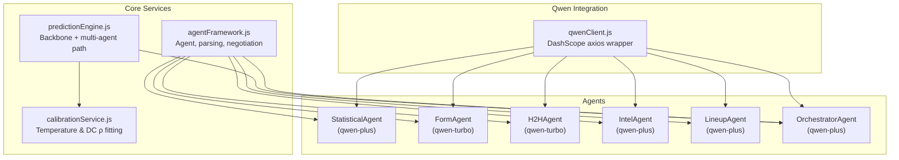
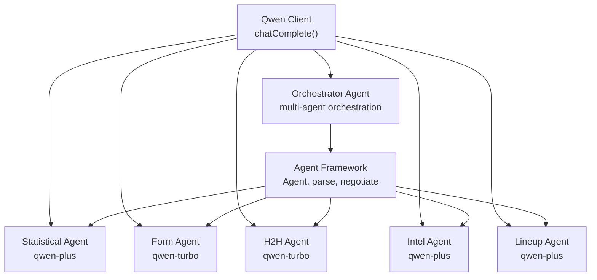
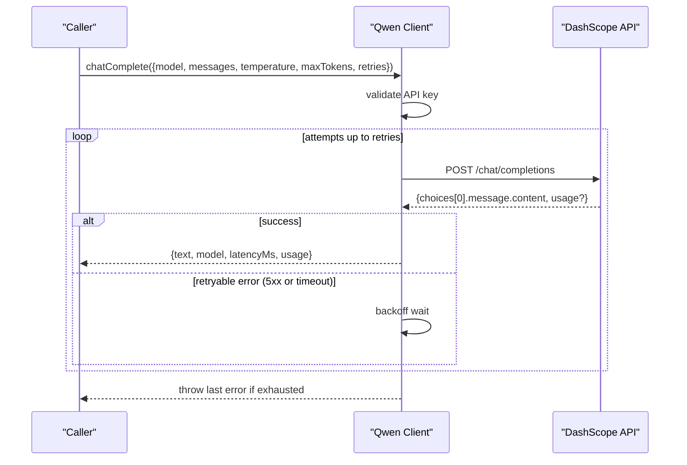
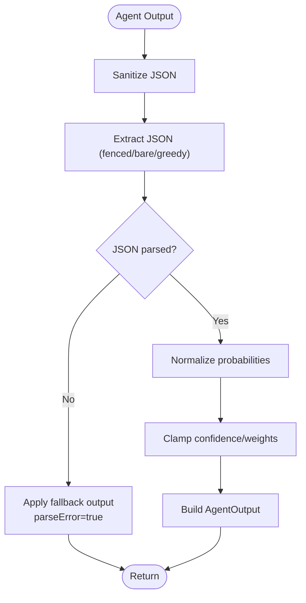
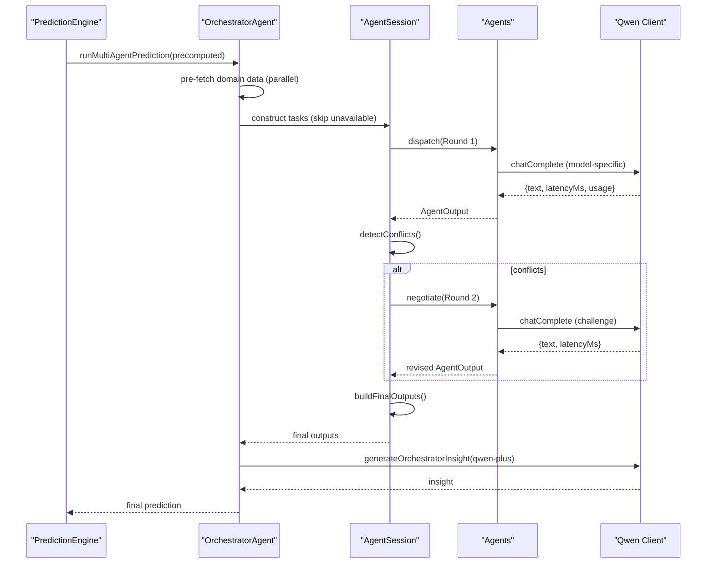
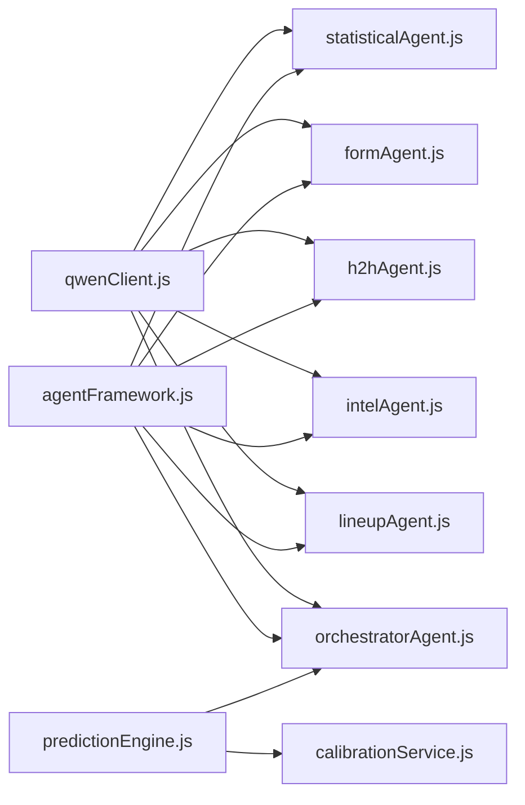

# Qwen Model Integration

<cite>
**Referenced Files in This Document**
- [qwenClient.js](file://backend/services/qwenClient.js)
- [agentFramework.js](file://backend/services/agents/agentFramework.js)
- [orchestratorAgent.js](file://backend/services/agents/orchestratorAgent.js)
- [statisticalAgent.js](file://backend/services/agents/statisticalAgent.js)
- [formAgent.js](file://backend/services/agents/formAgent.js)
- [h2hAgent.js](file://backend/services/agents/h2hAgent.js)
- [intelAgent.js](file://backend/services/agents/intelAgent.js)
- [lineupAgent.js](file://backend/services/agents/lineupAgent.js)
- [predictionEngine.js](file://backend/services/predictionEngine.js)
- [calibrationService.js](file://backend/services/calibrationService.js)
- [README.md](file://README.md)
</cite>

## Table of Contents
1. [Introduction](#introduction)
2. [Project Structure](#project-structure)
3. [Core Components](#core-components)
4. [Architecture Overview](#architecture-overview)
5. [Detailed Component Analysis](#detailed-component-analysis)
6. [Dependency Analysis](#dependency-analysis)
7. [Performance Considerations](#performance-considerations)
8. [Troubleshooting Guide](#troubleshooting-guide)
9. [Conclusion](#conclusion)
10. [Appendices](#appendices)

## Introduction
This document explains the Qwen model integration and management strategy for the multi-agent prediction system. It covers the tiered model selection (qwen-max, qwen-plus, qwen-turbo), the chatComplete function wrapper, request/response handling, error management, JSON extraction and sanitization, model-specific prompt engineering, safety and fallback strategies, performance monitoring, latency tracking, cost optimization, and model versioning and migration.

## Project Structure
The Qwen integration centers around a lightweight Qwen client that wraps the DashScope OpenAI-compatible API, a multi-agent framework that orchestrates specialized agents, and a prediction engine that coordinates the end-to-end pipeline. Agents are grouped by model tier and responsibility, with the orchestrator managing negotiation and final blending.

**Diagram sources**
- [qwenClient.js:17-21](file://backend/services/qwenClient.js#L17-L21)
- [agentFramework.js:211-330](file://backend/services/agents/agentFramework.js#L211-L330)
- [orchestratorAgent.js:28-37](file://backend/services/agents/orchestratorAgent.js#L28-L37)
- [statisticalAgent.js:90-95](file://backend/services/agents/statisticalAgent.js#L90-L95)
- [formAgent.js:105-110](file://backend/services/agents/formAgent.js#L105-L110)
- [h2hAgent.js:99-104](file://backend/services/agents/h2hAgent.js#L99-L104)
- [intelAgent.js:119-124](file://backend/services/agents/intelAgent.js#L119-L124)
- [lineupAgent.js:109-114](file://backend/services/agents/lineupAgent.js#L109-L114)
- [predictionEngine.js:43-53](file://backend/services/predictionEngine.js#L43-L53)
- [calibrationService.js:15-16](file://backend/services/calibrationService.js#L15-L16)

**Section sources**
- [README.md:18-112](file://README.md#L18-L112)
- [qwenClient.js:1-122](file://backend/services/qwenClient.js#L1-L122)
- [agentFramework.js:1-586](file://backend/services/agents/agentFramework.js#L1-L586)
- [orchestratorAgent.js:1-502](file://backend/services/agents/orchestratorAgent.js#L1-L502)
- [predictionEngine.js:1-1046](file://backend/services/predictionEngine.js#L1-L1046)
- [calibrationService.js:1-132](file://backend/services/calibrationService.js#L1-L132)

## Core Components
- Qwen client: Provides a unified chatComplete wrapper around DashScope’s compatible endpoint, with retry/backoff, latency tracking, and usage metadata.
- Agent framework: Defines the Agent class, JSON schema contract, robust extraction/sanitization, parsing, negotiation, and persistence.
- Specialized agents: Each agent selects a model tier appropriate to its workload and prompt complexity.
- Orchestrator: Coordinates multi-agent runs, conflict detection, negotiation, final blending, and insight generation.
- Prediction engine: Chooses between single-model and multi-agent paths, computes backbone probabilities, and integrates agent outputs.
- Calibration service: Fits temperature scaling and Dixon-Clay rho to improve probability calibration.

**Section sources**
- [qwenClient.js:41-101](file://backend/services/qwenClient.js#L41-L101)
- [agentFramework.js:36-156](file://backend/services/agents/agentFramework.js#L36-L156)
- [orchestratorAgent.js:309-499](file://backend/services/agents/orchestratorAgent.js#L309-L499)
- [predictionEngine.js:55-61](file://backend/services/predictionEngine.js#L55-L61)
- [calibrationService.js:53-82](file://backend/services/calibrationService.js#L53-L82)

## Architecture Overview
The system uses a tiered model strategy:
- qwen-max: Reserved for orchestrator-level complex reasoning and full-context coordination.
- qwen-plus: Used by agents requiring numerical reasoning, qualitative interpretation, and structured synthesis.
- qwen-turbo: Used by agents focused on fast, high-throughput tasks with simpler prompts.

**Diagram sources**
- [qwenClient.js:17-21](file://backend/services/qwenClient.js#L17-L21)
- [agentFramework.js:211-330](file://backend/services/agents/agentFramework.js#L211-L330)
- [orchestratorAgent.js:309-499](file://backend/services/agents/orchestratorAgent.js#L309-L499)
- [statisticalAgent.js:90-95](file://backend/services/agents/statisticalAgent.js#L90-L95)
- [formAgent.js:105-110](file://backend/services/agents/formAgent.js#L105-L110)
- [h2hAgent.js:99-104](file://backend/services/agents/h2hAgent.js#L99-L104)
- [intelAgent.js:119-124](file://backend/services/agents/intelAgent.js#L119-L124)
- [lineupAgent.js:109-114](file://backend/services/agents/lineupAgent.js#L109-L114)

## Detailed Component Analysis

### Qwen Client: chatComplete Wrapper
- Purpose: Unified interface to DashScope compatible endpoint with OpenAI-style messages.
- Request handling:
  - Validates presence of API key.
  - Sends POST /chat/completions with model, messages, temperature, and max_tokens.
  - Tracks latencyMs and captures usage metadata when returned.
- Error handling:
  - Retries on 5xx or timeouts with exponential backoff (1s, 2s, 3s).
  - Throws the last error after retries exhausted.
- Connectivity ping: Quick qwen-turbo health check for latency measurement.

**Diagram sources**
- [qwenClient.js:53-101](file://backend/services/qwenClient.js#L53-L101)

**Section sources**
- [qwenClient.js:41-101](file://backend/services/qwenClient.js#L41-L101)
- [qwenClient.js:103-122](file://backend/services/qwenClient.js#L103-L122)

### Agent Framework: JSON Extraction, Parsing, and Negotiation
- JSON schema contract: Agents must respond with a strict JSON structure containing probabilities, confidence, evidence, weightRecommendation, and optional flags.
- Extraction and sanitization:
  - Sanitizes malformed arrays (common qwen-plus artifact).
  - Extracts JSON from fenced code blocks, first object, or greedy match.
- Parsing:
  - Normalizes probabilities to sum to 1.
  - Clamps confidence and weightRecommendation to [0,1].
  - Records parse errors and applies fallback outputs.
- Negotiation:
  - Detects conflicts via max probability delta ≥ 0.20.
  - Round 2 challenges prompt includes comparative estimates and evidence.
  - Applies weight adjustments (winner boosted, loser penalized) and replaces loser’s probability with revised output.

**Diagram sources**
- [agentFramework.js:56-156](file://backend/services/agents/agentFramework.js#L56-L156)

**Section sources**
- [agentFramework.js:36-53](file://backend/services/agents/agentFramework.js#L36-L53)
- [agentFramework.js:56-100](file://backend/services/agents/agentFramework.js#L56-L100)
- [agentFramework.js:122-156](file://backend/services/agents/agentFramework.js#L122-L156)
- [agentFramework.js:376-404](file://backend/services/agents/agentFramework.js#L376-L404)
- [agentFramework.js:406-445](file://backend/services/agents/agentFramework.js#L406-L445)
- [agentFramework.js:447-503](file://backend/services/agents/agentFramework.js#L447-L503)

### Orchestrator Agent: Multi-Agent Orchestration and Blending
- Pre-fetches domain data (H2H, form, intel, lineup) in parallel.
- Builds agent tasks, skipping agents when prompts/data are unavailable.
- Runs AgentSession.dispatch(), detects conflicts, negotiates, and builds final outputs.
- Blends via log-pool with weights and applies temperature scaling.
- Generates final insight using qwen-plus with safety checks against unvalidated player absence claims.

**Diagram sources**
- [orchestratorAgent.js:319-499](file://backend/services/agents/orchestratorAgent.js#L319-L499)
- [agentFramework.js:355-374](file://backend/services/agents/agentFramework.js#L355-L374)
- [agentFramework.js:406-445](file://backend/services/agents/agentFramework.js#L406-L445)
- [agentFramework.js:447-503](file://backend/services/agents/agentFramework.js#L447-L503)

**Section sources**
- [orchestratorAgent.js:309-499](file://backend/services/agents/orchestratorAgent.js#L309-L499)
- [predictionEngine.js:729-755](file://backend/services/predictionEngine.js#L729-L755)

### Model Selection Criteria and Prompt Engineering
- qwen-plus:
  - StatisticalAgent: Numerical reasoning over λ, α/β, ELO, and venue effects.
  - IntelAgent: Qualitative interpretation of injuries, motivation, rotation.
  - LineupAgent: Tactical reasoning on confirmed XI strength and formation.
- qwen-turbo:
  - FormAgent: Lightweight analysis of recent results with competition weighting.
  - H2HAgent: Pattern recognition over structured historical records.
- Safety and prompt engineering:
  - Strict JSON schema embedded in system prompts.
  - Explicit instructions to avoid unsupported claims (e.g., unlisted injuries).
  - Calibration guidance for approximate shifts (e.g., key injuries, rotation).
- Fallback strategies:
  - Agent-level retry with stricter instructions and lower temperature.
  - Session-level fallback outputs when parsing fails.
  - Orchestrator-level fallback insight when LLM fails.

**Section sources**
- [statisticalAgent.js:18-30](file://backend/services/agents/statisticalAgent.js#L18-L30)
- [intelAgent.js:20-40](file://backend/services/agents/intelAgent.js#L20-L40)
- [lineupAgent.js:18-37](file://backend/services/agents/lineupAgent.js#L18-L37)
- [formAgent.js:17-33](file://backend/services/agents/formAgent.js#L17-L33)
- [h2hAgent.js:18-30](file://backend/services/agents/h2hAgent.js#L18-L30)
- [agentFramework.js:252-269](file://backend/services/agents/agentFramework.js#L252-L269)
- [agentFramework.js:304-321](file://backend/services/agents/agentFramework.js#L304-L321)

### Response Parsing, JSON Extraction, and Sanitization
- Sanitization fixes malformed arrays commonly produced by qwen-plus.
- Extraction supports fenced code blocks, first object, and greedy match.
- Parsing enforces schema compliance, normalization, and clamping.
- Fallback ensures robustness when JSON cannot be extracted.

**Section sources**
- [agentFramework.js:56-100](file://backend/services/agents/agentFramework.js#L56-L100)
- [agentFramework.js:122-156](file://backend/services/agents/agentFramework.js#L122-L156)

### Latency Tracking and Cost Optimization
- Latency tracking:
  - chatComplete measures latencyMs per request.
  - Agent outputs capture latencyMs for persistence and diagnostics.
- Cost optimization:
  - Model tiering balances speed and cost (qwen-turbo for fast tasks, qwen-plus for balanced workloads, qwen-max for orchestrator).
  - Token limits and retries tuned to reduce unnecessary calls.
  - Temperature tuning via calibrationService reduces overconfidence and improves reliability.

**Section sources**
- [qwenClient.js:76-82](file://backend/services/qwenClient.js#L76-L82)
- [agentFramework.js:232-248](file://backend/services/agents/agentFramework.js#L232-L248)
- [agentFramework.js:284-300](file://backend/services/agents/agentFramework.js#L284-L300)
- [calibrationService.js:53-82](file://backend/services/calibrationService.js#L53-L82)

### Model Versioning, Compatibility, and Migration
- Versioning:
  - Models are identified by constants (MAX, PLUS, TURBO) to decouple from provider specifics.
- Compatibility:
  - OpenAI-compatible endpoint simplifies upgrades.
  - Environment variable DASHSCOPE_BASE_URL enables alternate endpoints.
- Migration:
  - chatComplete encapsulates API changes; clients depend on exported interface.
  - ping() provides quick connectivity verification for migrations.

**Section sources**
- [qwenClient.js:15-21](file://backend/services/qwenClient.js#L15-L21)
- [qwenClient.js:107-120](file://backend/services/qwenClient.js#L107-L120)

## Dependency Analysis
The multi-agent system depends on the Qwen client for LLM calls, the agent framework for orchestration and parsing, and the orchestrator for negotiation and blending. Calibration service influences output quality by adjusting temperature and DC ρ.

**Diagram sources**
- [qwenClient.js:13-39](file://backend/services/qwenClient.js#L13-L39)
- [agentFramework.js:27-29](file://backend/services/agents/agentFramework.js#L27-L29)
- [orchestratorAgent.js:28-30](file://backend/services/agents/orchestratorAgent.js#L28-L30)
- [predictionEngine.js:43-53](file://backend/services/predictionEngine.js#L43-L53)
- [calibrationService.js:15-16](file://backend/services/calibrationService.js#L15-L16)

**Section sources**
- [qwenClient.js:13-39](file://backend/services/qwenClient.js#L13-L39)
- [agentFramework.js:27-29](file://backend/services/agents/agentFramework.js#L27-L29)
- [orchestratorAgent.js:28-30](file://backend/services/agents/orchestratorAgent.js#L28-L30)
- [predictionEngine.js:43-53](file://backend/services/predictionEngine.js#L43-L53)
- [calibrationService.js:15-16](file://backend/services/calibrationService.js#L15-L16)

## Performance Considerations
- Model tiering: Use qwen-turbo for high-volume, fast tasks; qwen-plus for balanced reasoning; qwen-max for orchestrator-level coordination.
- Token limits: Tune maxTokens per agent to balance quality and cost.
- Retries and backoff: Reduce transient failures and improve throughput.
- Parallelism: Agents run concurrently; orchestrate in parallel where possible.
- Calibration: Temperature scaling improves reliability and reduces overconfidence.

[No sources needed since this section provides general guidance]

## Troubleshooting Guide
- Missing API key: chatComplete throws an error if DASHSCOPE_API_KEY is unset.
- Retryable failures: 5xx and timeouts are retried with exponential backoff.
- JSON parse errors: Agent-level fallback and retry with stricter instructions.
- Insight generation failures: Fallback insight without LLM.
- Connectivity checks: Use ping() to measure latency and confirm availability.

**Section sources**
- [qwenClient.js:60-62](file://backend/services/qwenClient.js#L60-L62)
- [qwenClient.js:86-96](file://backend/services/qwenClient.js#L86-L96)
- [agentFramework.js:252-269](file://backend/services/agents/agentFramework.js#L252-L269)
- [agentFramework.js:304-321](file://backend/services/agents/agentFramework.js#L304-L321)
- [orchestratorAgent.js:254-258](file://backend/services/agents/orchestratorAgent.js#L254-L258)
- [qwenClient.js:107-120](file://backend/services/qwenClient.js#L107-L120)

## Conclusion
The Qwen integration employs a tiered model strategy to balance cost, performance, and capability. The chatComplete wrapper centralizes request handling, error management, and latency tracking. The agent framework enforces strict JSON contracts, robust extraction, and negotiation protocols. The orchestrator coordinates multi-agent runs, blends outputs, and generates insights with safety checks. Calibration and configuration enable continuous improvement and operational flexibility.

[No sources needed since this section summarizes without analyzing specific files]

## Appendices

### Model Tier and Agent Mapping
- qwen-max: OrchestratorAgent
- qwen-plus: StatisticalAgent, IntelAgent, LineupAgent
- qwen-turbo: FormAgent, H2HAgent

**Section sources**
- [README.md:64-71](file://README.md#L64-L71)
- [statisticalAgent.js:90-95](file://backend/services/agents/statisticalAgent.js#L90-L95)
- [intelAgent.js:119-124](file://backend/services/agents/intelAgent.js#L119-L124)
- [lineupAgent.js:109-114](file://backend/services/agents/lineupAgent.js#L109-L114)
- [formAgent.js:105-110](file://backend/services/agents/formAgent.js#L105-L110)
- [h2hAgent.js:99-104](file://backend/services/agents/h2hAgent.js#L99-L104)