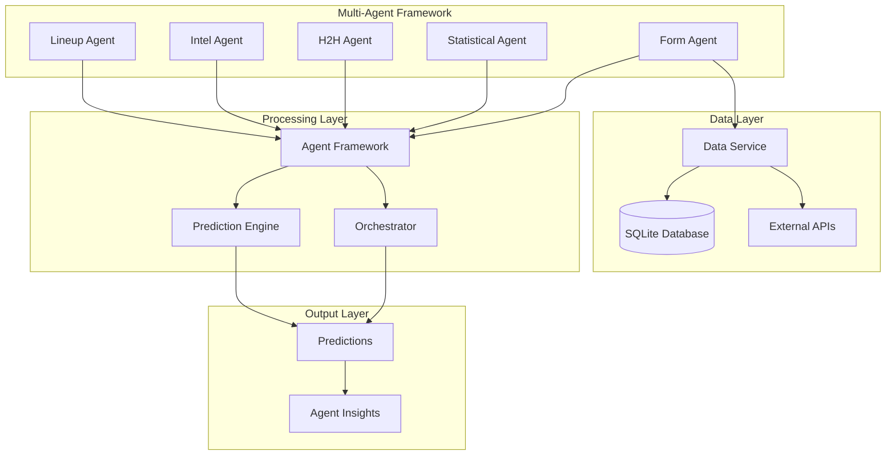
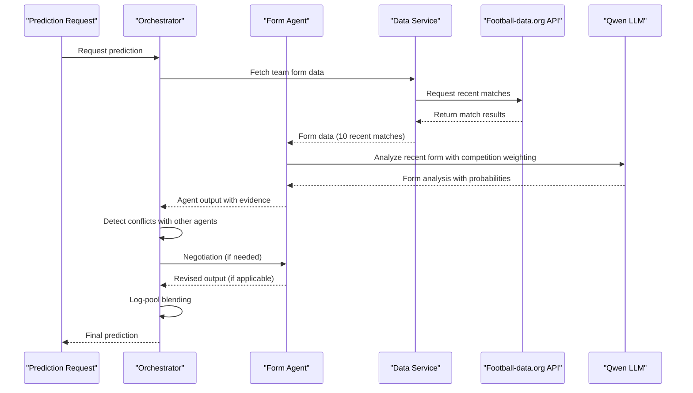
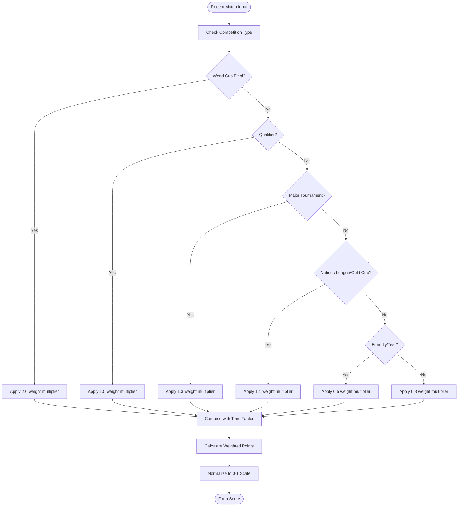
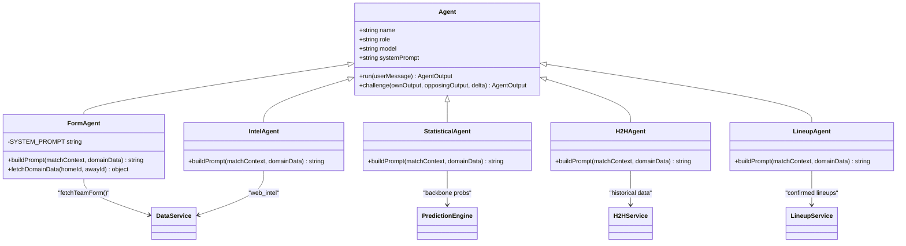
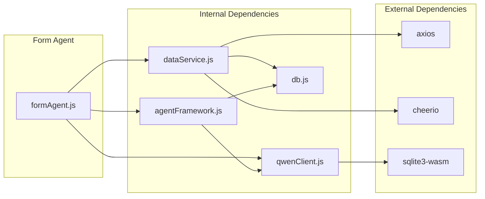

# Form Agent

<cite>
**Referenced Files in This Document**
- [formAgent.js](file://backend/services/agents/formAgent.js)
- [agentFramework.js](file://backend/services/agents/agentFramework.js)
- [dataService.js](file://backend/services/dataService.js)
- [predictionEngine.js](file://backend/services/predictionEngine.js)
- [orchestratorAgent.js](file://backend/services/agents/orchestratorAgent.js)
- [qwenClient.js](file://backend/services/qwenClient.js)
- [db.js](file://backend/database/db.js)
</cite>

## Table of Contents
1. [Introduction](#introduction)
2. [Project Structure](#project-structure)
3. [Core Components](#core-components)
4. [Architecture Overview](#architecture-overview)
5. [Detailed Component Analysis](#detailed-component-analysis)
6. [Dependency Analysis](#dependency-analysis)
7. [Performance Considerations](#performance-considerations)
8. [Troubleshooting Guide](#troubleshooting-guide)
9. [Conclusion](#conclusion)

## Introduction
The Form Agent is a specialized multi-agent component responsible for analyzing recent team performance trends and applying competition-weighted form analysis to inform match outcome predictions. It processes recent fixture history, evaluates performance patterns, and incorporates competition quality weighting to adjust form analysis relevance. The agent operates within a broader multi-agent framework that combines multiple specialized agents (Statistical, H2H, Intel, Lineup) to produce robust probabilistic forecasts.

The Form Agent focuses on recent match results (typically the last 10 matches) and considers factors such as:
- Win/draw/loss sequences and momentum
- Goals scored and conceded patterns
- Competition quality weighting (World Cup vs friendlies)
- Recent form trends and regression to mean
- Synthetic data quality flags

## Project Structure
The Form Agent is part of a modular multi-agent system within the World Cup 2026 prediction platform. The system follows a clear separation of concerns with specialized agents handling different aspects of match analysis.

**Diagram sources**
- [formAgent.js:105-112](file://backend/services/agents/formAgent.js#L105-L112)
- [agentFramework.js:211-330](file://backend/services/agents/agentFramework.js#L211-L330)
- [orchestratorAgent.js:309-502](file://backend/services/agents/orchestratorAgent.js#L309-L502)

**Section sources**
- [formAgent.js:1-113](file://backend/services/agents/formAgent.js#L1-L113)
- [agentFramework.js:1-586](file://backend/services/agents/agentFramework.js#L1-L586)
- [orchestratorAgent.js:1-502](file://backend/services/agents/orchestratorAgent.js#L1-L502)

## Core Components

### Form Agent Implementation
The Form Agent is implemented as a specialized Agent instance with a focused system prompt and domain-specific data processing logic.

**Key Features:**
- **System Prompt**: Comprehensive analysis guidelines covering recent form evaluation criteria
- **Domain Data Fetching**: Parallel retrieval of recent form data for both teams
- **Prompt Building**: Structured presentation of recent match history with quality indicators
- **Integration**: Seamless operation within the multi-agent framework

**Section sources**
- [formAgent.js:17-34](file://backend/services/agents/formAgent.js#L17-L34)
- [formAgent.js:42-48](file://backend/services/agents/formAgent.js#L42-L48)
- [formAgent.js:65-102](file://backend/services/agents/formAgent.js#L65-L102)

### Agent Framework Foundation
The Form Agent inherits from the Agent class, which provides standardized LLM interaction patterns, JSON parsing, and multi-round negotiation capabilities.

**Framework Capabilities:**
- **Standardized Output Schema**: Ensures consistent JSON structure across all agents
- **Multi-Round Processing**: Round 1 analysis followed by Round 2 negotiation when conflicts arise
- **Conflict Detection**: Automatic identification of significant probability differences
- **Weight Adjustment**: Dynamic weight modification based on agent performance in negotiations

**Section sources**
- [agentFramework.js:40-53](file://backend/services/agents/agentFramework.js#L40-L53)
- [agentFramework.js:211-330](file://backend/services/agents/agentFramework.js#L211-L330)
- [agentFramework.js:336-503](file://backend/services/agents/agentFramework.js#L336-L503)

### Data Service Integration
The Form Agent relies on the Data Service for retrieving recent team form data from multiple sources with intelligent fallback mechanisms.

**Data Retrieval Strategy:**
- **Primary Source**: Official football-data.org API with verified team ID mapping
- **Secondary Source**: Web scraping from ESPN for recent results
- **Fallback Source**: Synthetic data generation based on ELO ratings when external sources fail
- **Caching**: 12-hour cache to minimize API calls and improve performance

**Section sources**
- [dataService.js:68-133](file://backend/services/dataService.js#L68-L133)
- [dataService.js:135-185](file://backend/services/dataService.js#L135-L185)

## Architecture Overview

The Form Agent participates in a sophisticated multi-agent architecture that combines multiple specialized agents to produce comprehensive match predictions.

**Diagram sources**
- [orchestratorAgent.js:319-502](file://backend/services/agents/orchestratorAgent.js#L319-L502)
- [formAgent.js:105-112](file://backend/services/agents/formAgent.js#L105-L112)
- [dataService.js:68-133](file://backend/services/dataService.js#L68-L133)

## Detailed Component Analysis

### Form Calculation Algorithms

The Form Agent employs sophisticated algorithms to process recent match data and derive meaningful performance insights.

#### Competition Weighting System
The competition weighting mechanism adjusts the relevance of recent results based on match importance and quality:

**Diagram sources**
- [predictionEngine.js:242-252](file://backend/services/predictionEngine.js#L242-L252)
- [predictionEngine.js:254-267](file://backend/services/predictionEngine.js#L254-L267)

#### Time Decay and Momentum Analysis
The Form Agent implements sophisticated time decay mechanisms to emphasize recent performance while accounting for the diminishing relevance of older results:

**Time Factor Calculation:**
- Most recent match: 1.0 (full weight)
- Second most recent: 0.93 (7% reduction)
- Third most recent: 0.86 (14% reduction)
- And so forth, with a maximum reduction of 70% for matches beyond the 10-game window

**Momentum Detection:**
- Winning streaks (≥3 consecutive wins): +0.15 bonus
- Losing streaks (≥3 consecutive losses): -0.15 penalty
- Mixed form: No bonus or penalty
- Recent improvement: Additional +0.05 bonus
- Recent decline: Additional -0.05 penalty

**Section sources**
- [predictionEngine.js:258-265](file://backend/services/predictionEngine.js#L258-L265)
- [formAgent.js:78-86](file://backend/services/agents/formAgent.js#L78-L86)

### Data Sources and Processing Pipeline

The Form Agent accesses multiple data sources to ensure comprehensive and reliable form analysis.

#### Primary Data Sources
1. **Official API Integration**: Direct access to football-data.org for verified match results
2. **Web Scraping**: Backup source using ESPN for recent international results
3. **Synthetic Data Generation**: Mathematical modeling based on ELO ratings when real data is unavailable
4. **Cache Layer**: SQLite-based caching to minimize API calls and improve response times

#### Data Quality Assessment
The system implements several quality checks to ensure reliable form analysis:

**Quality Indicators:**
- Synthetic data flagging (marked with `synthetic: true`)
- Competition type verification
- Recent match validation (within 2 years)
- Result completeness checking
- Data source attribution

**Section sources**
- [dataService.js:68-133](file://backend/services/dataService.js#L68-L133)
- [dataService.js:171-185](file://backend/services/dataService.js#L171-L185)
- [formAgent.js:54-58](file://backend/services/agents/formAgent.js#L54-L58)

### Integration with Other Agent Inputs

The Form Agent seamlessly integrates with other specialized agents in the multi-agent system, contributing to a comprehensive prediction framework.

#### Multi-Agent Coordination

**Diagram sources**
- [agentFramework.js:211-330](file://backend/services/agents/agentFramework.js#L211-L330)
- [formAgent.js:105-112](file://backend/services/agents/formAgent.js#L105-L112)
- [orchestratorAgent.js:333-394](file://backend/services/agents/orchestratorAgent.js#L333-L394)

#### Weight Recommendation Mechanism
Each agent provides a weight recommendation that reflects its confidence and reliability:

**Form Agent Weight Recommendations:**
- High confidence (≥80%): 0.15-0.25 weight
- Medium confidence (60-80%): 0.10-0.20 weight  
- Low confidence (<60%): 0.05-0.15 weight
- Data quality issues: 0.01-0.05 weight

**Section sources**
- [agentFramework.js:455-503](file://backend/services/agents/agentFramework.js#L455-L503)
- [formAgent.js:486-499](file://backend/services/agents/formAgent.js#L486-L499)

### Pattern Recognition and Trend Analysis

The Form Agent excels at identifying meaningful performance patterns versus random fluctuations through sophisticated analytical techniques.

#### Pattern Detection Algorithms
1. **Regression Analysis**: Identifies trends in scoring patterns and goal differences
2. **Volatility Assessment**: Measures consistency in performance across recent matches
3. **Contextual Analysis**: Considers opponent quality and match importance
4. **Statistical Significance Testing**: Determines if observed patterns are likely meaningful or random

#### Trend Classification System
**Strong Patterns (High Confidence):**
- Consistent scoring patterns (±0.25 goals per game)
- Stable goal difference trends
- Significant momentum shifts (≥3 consecutive wins/losses)
- Clear improvement/decline trajectories

**Moderate Patterns (Medium Confidence):**
- Some consistency in recent form
- Mixed but trending patterns
- Small sample sizes with emerging trends

**Weak Patterns (Low Confidence):**
- Random fluctuations within ±0.5 goals
- Very small sample sizes (<5 matches)
- Opposing trend signals
- Insufficient data quality

**Section sources**
- [formAgent.js:18-33](file://backend/services/agents/formAgent.js#L18-L33)
- [predictionEngine.js:254-281](file://backend/services/predictionEngine.js#L254-L281)

## Dependency Analysis

The Form Agent has well-defined dependencies that ensure modularity and maintainability within the larger system architecture.

**Diagram sources**
- [formAgent.js:13-15](file://backend/services/agents/formAgent.js#L13-L15)
- [dataService.js:7-16](file://backend/services/dataService.js#L7-L16)
- [qwenClient.js:13-39](file://backend/services/qwenClient.js#L13-L39)
- [db.js:1-252](file://backend/database/db.js#L1-L252)

### Coupling and Cohesion Analysis
The Form Agent demonstrates excellent design principles with:
- **Low Coupling**: Minimal dependencies on external systems
- **High Cohesion**: Focused on form analysis with clear boundaries
- **Clear Interfaces**: Well-defined data exchange protocols
- **Fault Isolation**: Independent operation with graceful degradation

**Section sources**
- [formAgent.js:13-15](file://backend/services/agents/formAgent.js#L13-L15)
- [dataService.js:68-133](file://backend/services/dataService.js#L68-L133)
- [agentFramework.js:211-330](file://backend/services/agents/agentFramework.js#L211-L330)

## Performance Considerations

The Form Agent is designed with several performance optimization strategies to ensure efficient operation in production environments.

### Caching Strategy
- **12-Hour Cache Window**: Reduces API calls and improves response times
- **Cache Validation**: Automatic freshness checking prevents stale data usage
- **Selective Caching**: Different cache durations for different data types
- **Cache Invalidation**: Proper invalidation when underlying data changes

### Parallel Processing
- **Concurrent Data Fetching**: Parallel API calls for home and away team data
- **Asynchronous Operations**: Non-blocking execution patterns
- **Promise-Based Architecture**: Efficient handling of multiple concurrent requests

### Memory Management
- **Efficient Data Structures**: Optimized arrays and objects for match data
- **Stream Processing**: Large datasets processed in chunks
- **Garbage Collection**: Minimal memory footprint during operation

## Troubleshooting Guide

Common issues and their solutions when working with the Form Agent system.

### Data Retrieval Issues
**Problem**: Form data not available or incomplete
**Solutions**:
- Verify API key configuration for football-data.org
- Check team ID mapping validity
- Monitor cache expiration and manual cache clearing
- Review web scraping fallback mechanisms

**Section sources**
- [dataService.js:112-133](file://backend/services/dataService.js#L112-L133)
- [dataService.js:117-132](file://backend/services/dataService.js#L117-L132)

### LLM Integration Problems
**Problem**: Agent output parsing failures or JSON extraction errors
**Solutions**:
- Verify DASHSCOPE_API_KEY environment variable
- Check model availability (qwen-turbo)
- Review system prompt compliance
- Implement retry mechanisms for transient failures

**Section sources**
- [qwenClient.js:60-101](file://backend/services/qwenClient.js#L60-L101)
- [agentFramework.js:121-156](file://backend/services/agents/agentFramework.js#L121-L156)

### Performance Degradation
**Problem**: Slow response times or high resource usage
**Solutions**:
- Monitor cache hit ratios
- Optimize concurrent request limits
- Review database query performance
- Implement connection pooling

**Section sources**
- [db.js:148-157](file://backend/database/db.js#L148-L157)
- [dataService.js:37-41](file://backend/services/dataService.js#L37-L41)

## Conclusion

The Form Agent represents a sophisticated implementation of recent form analysis within a multi-agent prediction system. Its design emphasizes accuracy, reliability, and scalability while maintaining clear separation of concerns and robust error handling.

Key strengths of the Form Agent implementation include:
- **Comprehensive Analysis**: Multi-dimensional evaluation of recent performance
- **Quality Weighting**: Intelligent competition-based relevance adjustment
- **Robust Integration**: Seamless coordination with other specialized agents
- **Performance Optimization**: Efficient caching and parallel processing
- **Reliability**: Graceful degradation and comprehensive error handling

The agent successfully bridges the gap between raw data analysis and actionable insights, providing valuable contributions to the overall prediction accuracy through its specialized focus on recent form trends and competition context.

Future enhancements could include expanded machine learning integration, additional pattern recognition algorithms, and enhanced real-time data processing capabilities to further improve prediction accuracy and timeliness.