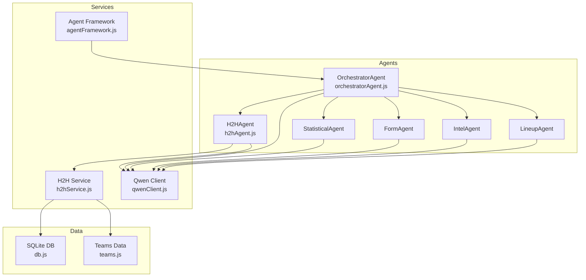
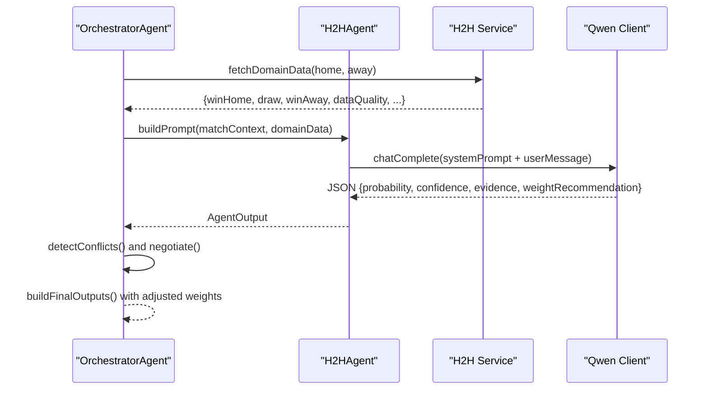
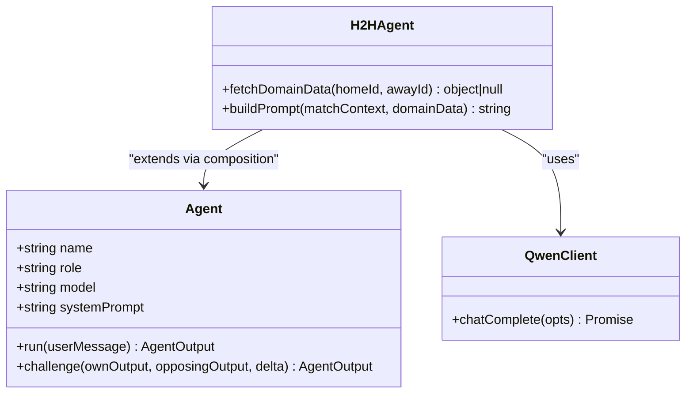
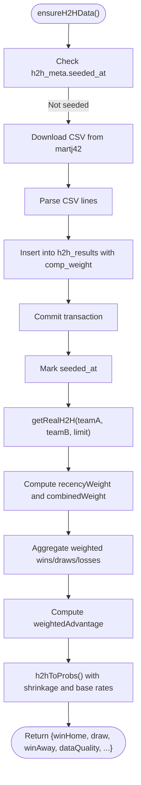
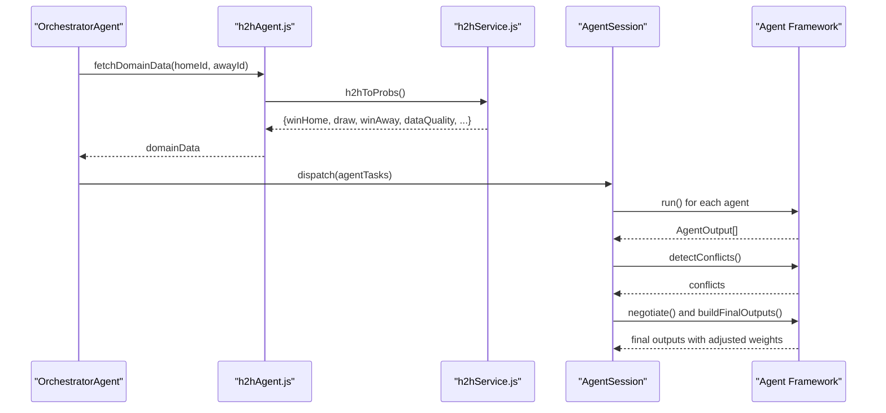
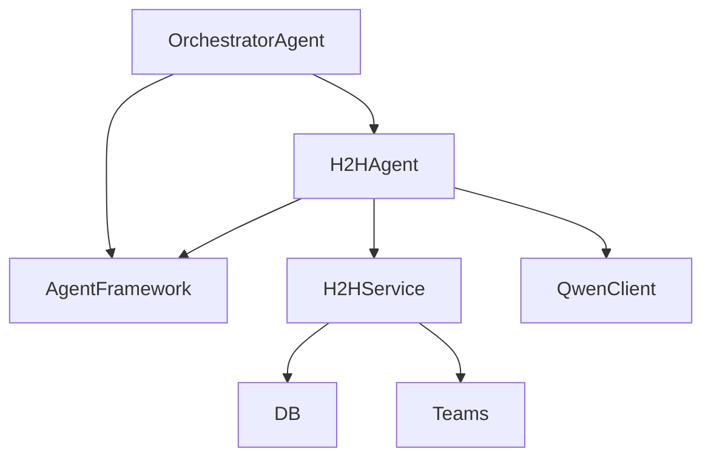

# Head-to-Head Agent

<cite>
**Referenced Files in This Document**
- [h2hAgent.js](file://backend/services/agents/h2hAgent.js)
- [h2hService.js](file://backend/services/h2hService.js)
- [agentFramework.js](file://backend/services/agents/agentFramework.js)
- [orchestratorAgent.js](file://backend/services/agents/orchestratorAgent.js)
- [qwenClient.js](file://backend/services/qwenClient.js)
- [SPEC.md](file://specs/SPEC.md)
- [teams.js](file://backend/data/teams.js)
- [db.js](file://backend/database/db.js)
- [MatchDetail.jsx](file://frontend/src/pages/MatchDetail.jsx)
</cite>

## Table of Contents
1. [Introduction](#introduction)
2. [Project Structure](#project-structure)
3. [Core Components](#core-components)
4. [Architecture Overview](#architecture-overview)
5. [Detailed Component Analysis](#detailed-component-analysis)
6. [Dependency Analysis](#dependency-analysis)
7. [Performance Considerations](#performance-considerations)
8. [Troubleshooting Guide](#troubleshooting-guide)
9. [Conclusion](#conclusion)

## Introduction
The Head-to-Head Agent (H2HAgent) is a specialized multi-agent component that interprets historical head-to-head records from a comprehensive international football dataset containing approximately 47,000 matches dating back to 1872. Its purpose is to assess whether historical patterns meaningfully favour one side in a World Cup context, incorporating competition weighting, recency, and data quality considerations. The agent participates in a multi-agent prediction session orchestrated by the OrchestratorAgent, contributing a probability assessment with confidence and evidence, and optionally adjusting its stance during a negotiation phase when conflicts arise with other agents.

## Project Structure
The H2HAgent resides within the multi-agent prediction framework alongside other specialists (StatisticalAgent, FormAgent, IntelAgent, LineupAgent). It interacts with the H2H service for data retrieval and the Qwen client for LLM inference. The agent’s outputs are persisted in the agent_sessions and agent_messages tables for transparency and auditability.

**Diagram sources**
- [h2hAgent.js:1-107](file://backend/services/agents/h2hAgent.js#L1-L107)
- [h2hService.js:1-315](file://backend/services/h2hService.js#L1-L315)
- [agentFramework.js:1-586](file://backend/services/agents/agentFramework.js#L1-L586)
- [orchestratorAgent.js:309-354](file://backend/services/agents/orchestratorAgent.js#L309-L354)
- [qwenClient.js:1-123](file://backend/services/qwenClient.js#L1-L123)
- [db.js:23-200](file://backend/database/db.js#L23-L200)
- [teams.js:1-234](file://backend/data/teams.js#L1-L234)

**Section sources**
- [h2hAgent.js:1-107](file://backend/services/agents/h2hAgent.js#L1-L107)
- [h2hService.js:1-315](file://backend/services/h2hService.js#L1-L315)
- [agentFramework.js:1-586](file://backend/services/agents/agentFramework.js#L1-L586)
- [orchestratorAgent.js:309-354](file://backend/services/agents/orchestratorAgent.js#L309-L354)
- [qwenClient.js:1-123](file://backend/services/qwenClient.js#L1-L123)
- [db.js:23-200](file://backend/database/db.js#L23-L200)
- [teams.js:1-234](file://backend/data/teams.js#L1-L234)

## Core Components
- H2HAgent: Specialized agent interpreting competition-weighted head-to-head records and generating a structured probability assessment with confidence and evidence.
- H2H Service: Manages seeding and querying the 47,000-match dataset, applying competition and recency weights, and computing weighted summaries and probabilities.
- Agent Framework: Provides the Agent and AgentSession classes, JSON parsing/validation, conflict detection, negotiation, and persistence mechanisms.
- OrchestratorAgent: Coordinates multi-agent runs, pre-fetches domain data, builds prompts, and synthesizes outputs via log-pool blending.
- Qwen Client: Handles OpenAI-compatible chat completions with retry logic and model selection.

**Section sources**
- [h2hAgent.js:1-107](file://backend/services/agents/h2hAgent.js#L1-L107)
- [h2hService.js:1-315](file://backend/services/h2hService.js#L1-L315)
- [agentFramework.js:1-586](file://backend/services/agents/agentFramework.js#L1-L586)
- [orchestratorAgent.js:309-354](file://backend/services/agents/orchestratorAgent.js#L309-L354)
- [qwenClient.js:1-123](file://backend/services/qwenClient.js#L1-L123)

## Architecture Overview
The H2HAgent operates within a multi-agent pipeline:
- Pre-fetch phase: The OrchestratorAgent concurrently requests H2H data along with other domain signals.
- Prompt construction: The H2HAgent builds a structured prompt embedding match context and H2H summary statistics.
- LLM inference: The agent submits the prompt to Qwen (Turbo) and parses the standardized JSON output.
- Conflict and negotiation: If another agent proposes significantly different probabilities, a negotiation phase adjusts weights and outputs.
- Persistence: All agent messages and resolutions are saved for auditing and analysis.

**Diagram sources**
- [orchestratorAgent.js:331-354](file://backend/services/agents/orchestratorAgent.js#L331-L354)
- [h2hAgent.js:47-96](file://backend/services/agents/h2hAgent.js#L47-L96)
- [h2hService.js:272-312](file://backend/services/h2hService.js#L272-L312)
- [qwenClient.js:53-101](file://backend/services/qwenClient.js#L53-L101)
- [agentFramework.js:376-445](file://backend/services/agents/agentFramework.js#L376-L445)

## Detailed Component Analysis

### H2HAgent Implementation
The H2HAgent encapsulates:
- System prompt tailored to interpret historical head-to-head records with emphasis on sample size, recency, and competition quality.
- Domain data fetcher that delegates to the H2H service and handles failures gracefully.
- Prompt builder that formats match context and H2H summary for the LLM.
- Agent singleton leveraging the shared Agent class with Qwen Turbo.

**Diagram sources**
- [agentFramework.js:211-330](file://backend/services/agents/agentFramework.js#L211-L330)
- [h2hAgent.js:14-106](file://backend/services/agents/h2hAgent.js#L14-L106)
- [qwenClient.js:53-101](file://backend/services/qwenClient.js#L53-L101)

**Section sources**
- [h2hAgent.js:1-107](file://backend/services/agents/h2hAgent.js#L1-L107)

### H2H Service: Data Processing Pipeline
The H2H service performs:
- Dataset seeding: Downloads a CSV of international results (~47k matches), normalizes team names, and inserts records into SQLite with competition weights and neutral venue flags.
- Query enrichment: Retrieves last N meetings, computes recency weights, and aggregates weighted wins/draws/losses.
- Probability conversion: Transforms raw H2H frequencies into probabilities using shrinkage toward base rates and assigns data quality tiers.

**Diagram sources**
- [h2hService.js:95-165](file://backend/services/h2hService.js#L95-L165)
- [h2hService.js:192-266](file://backend/services/h2hService.js#L192-L266)
- [h2hService.js:272-312](file://backend/services/h2hService.js#L272-L312)

**Section sources**
- [h2hService.js:1-315](file://backend/services/h2hService.js#L1-L315)

### Multi-Agent Orchestration and H2H Integration
The OrchestratorAgent coordinates:
- Parallel pre-fetch of H2H, form, intelligence, and lineup data.
- Construction of agent tasks and agent map for conflict detection.
- Log-pool synthesis of outputs with per-signal weights, including H2H weight of 0.30 when sufficient meetings exist.

**Diagram sources**
- [orchestratorAgent.js:331-354](file://backend/services/agents/orchestratorAgent.js#L331-L354)
- [h2hAgent.js:38-45](file://backend/services/agents/h2hAgent.js#L38-L45)
- [h2hService.js:272-312](file://backend/services/h2hService.js#L272-L312)
- [agentFramework.js:355-503](file://backend/services/agents/agentFramework.js#L355-L503)

**Section sources**
- [orchestratorAgent.js:309-354](file://backend/services/agents/orchestratorAgent.js#L309-L354)
- [agentFramework.js:355-503](file://backend/services/agents/agentFramework.js#L355-L503)

### Pattern Recognition and Predictive Insights
The H2HAgent’s pattern recognition leverages:
- Competition weighting: World Cup finals (×4), qualifiers (×2.5), continental championships (×2), friendlies (×0.5).
- Recency weighting: Most recent matches carry higher influence; oldest in the set are downweighted.
- Data quality thresholds: Low/medium/high quality based on meeting count; small samples trigger conservative assessments.
- Shrinkage modeling: Balances historical frequencies with global base rates to avoid overfitting sparse H2H.

Examples of insights derived from the 47k dataset:
- Dominant historical trends: When a team has a strong weighted advantage and recent World Cup meetings dominate the record.
- Situational advantages: Small-sample noise versus robust patterns; emphasis on recent high-level competition.
- Unique match characteristics: Neutral venue effects, historical motivation, and context-specific factors surfaced in the prompt and interpreted by the LLM.

**Section sources**
- [h2hService.js:56-67](file://backend/services/h2hService.js#L56-L67)
- [h2hService.js:214-234](file://backend/services/h2hService.js#L214-L234)
- [h2hService.js:287-300](file://backend/services/h2hService.js#L287-L300)
- [SPEC.md:186-189](file://specs/SPEC.md#L186-L189)

## Dependency Analysis
The H2HAgent depends on:
- Agent Framework for standardized output parsing and negotiation.
- H2H Service for dataset access and probability computation.
- Qwen Client for LLM inference.
- OrchestratorAgent for orchestration and multi-agent synthesis.

**Diagram sources**
- [h2hAgent.js:14-16](file://backend/services/agents/h2hAgent.js#L14-L16)
- [h2hService.js:20-21](file://backend/services/h2hService.js#L20-L21)
- [agentFramework.js:27-29](file://backend/services/agents/agentFramework.js#L27-L29)
- [orchestratorAgent.js:28-37](file://backend/services/agents/orchestratorAgent.js#L28-L37)
- [db.js:72-89](file://backend/database/db.js#L72-L89)
- [teams.js:1-7](file://backend/data/teams.js#L1-L7)

**Section sources**
- [h2hAgent.js:14-16](file://backend/services/agents/h2hAgent.js#L14-L16)
- [h2hService.js:20-21](file://backend/services/h2hService.js#L20-L21)
- [agentFramework.js:27-29](file://backend/services/agents/agentFramework.js#L27-L29)
- [orchestratorAgent.js:28-37](file://backend/services/agents/orchestratorAgent.js#L28-L37)
- [db.js:72-89](file://backend/database/db.js#L72-L89)
- [teams.js:1-7](file://backend/data/teams.js#L1-L7)

## Performance Considerations
- Dataset seeding: Single-threaded download and insertion with transaction batching; subsequent queries are fast due to SQLite and indexing.
- Parallelization: OrchestratorAgent pre-fetches H2H and other domain data concurrently to reduce latency.
- LLM inference: Uses Qwen Turbo for cost-effective throughput; JSON parsing includes sanitization and fallbacks to mitigate hallucinations.
- Conflict resolution: Negotiation is bounded and parallelized; weight adjustments are applied only when conflicts exceed the threshold.

[No sources needed since this section provides general guidance]

## Troubleshooting Guide
Common issues and remedies:
- Insufficient historical meetings: The agent returns a near-uniform distribution with low confidence when fewer than two meetings are found.
- JSON parsing failures: The framework retries inference with stricter prompts and falls back to uniform priors with explicit flags.
- API key or connectivity issues: The Qwen client throws descriptive errors; ensure the environment variable is configured and retry logic is active.
- Data seeding failures: The H2H service wraps insertions in transactions and logs errors; verify network connectivity and database permissions.

**Section sources**
- [h2hAgent.js:55-61](file://backend/services/agents/h2hAgent.js#L55-L61)
- [agentFramework.js:122-156](file://backend/services/agents/agentFramework.js#L122-L156)
- [qwenClient.js:60-101](file://backend/services/qwenClient.js#L60-L101)
- [h2hService.js:150-165](file://backend/services/h2hService.js#L150-L165)

## Conclusion
The Head-to-Head Agent provides a robust, data-driven interpretation of historical head-to-head patterns using a large, competition-weighted dataset. By combining structured data processing, recency-aware weighting, and LLM-based reasoning, it contributes meaningful predictive signals within a multi-agent framework. Its outputs are integrated into a broader prediction system, with transparent persistence and conflict resolution ensuring reliable and explainable outcomes.

[No sources needed since this section summarizes without analyzing specific files]