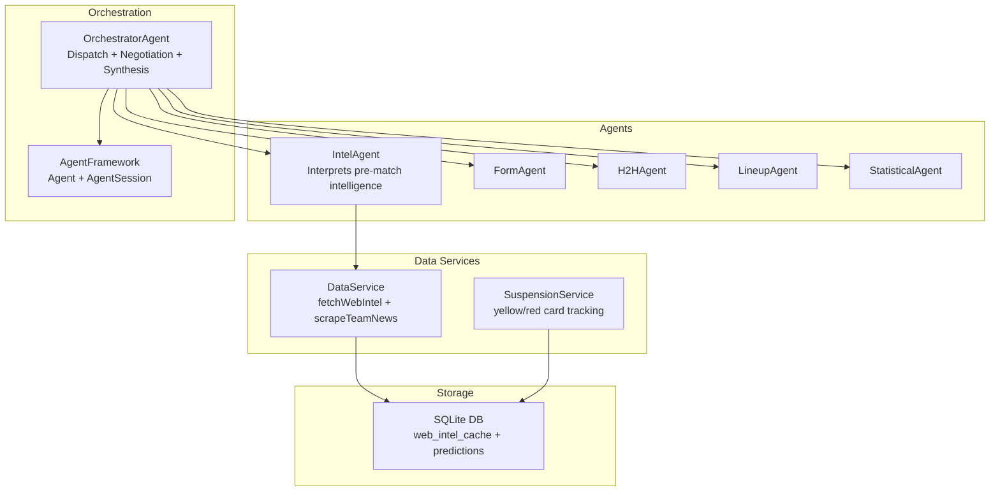
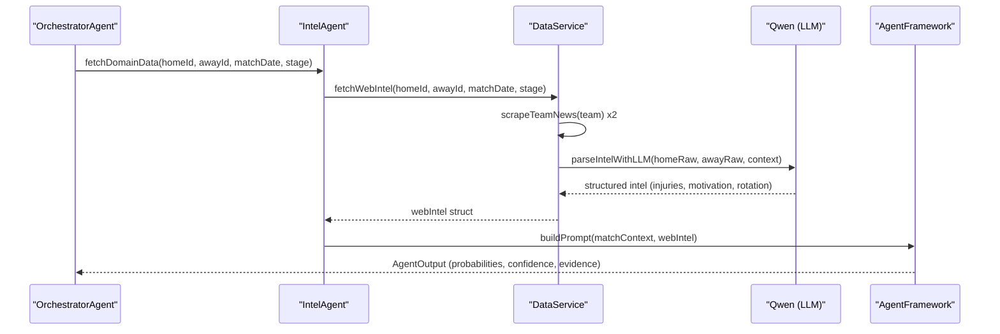
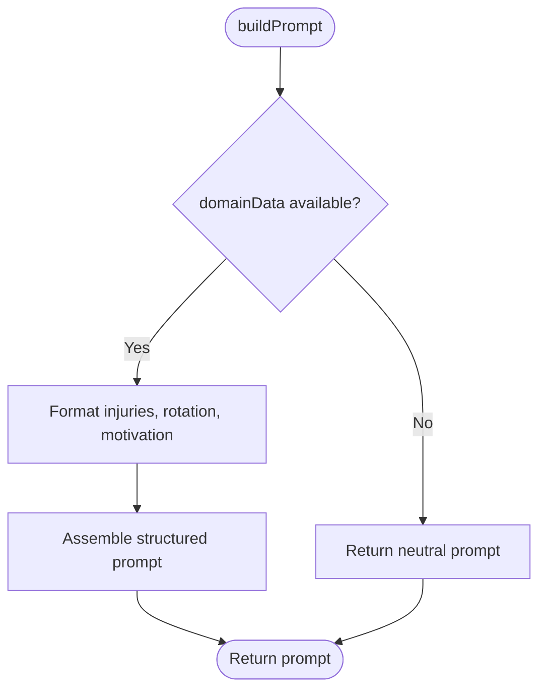
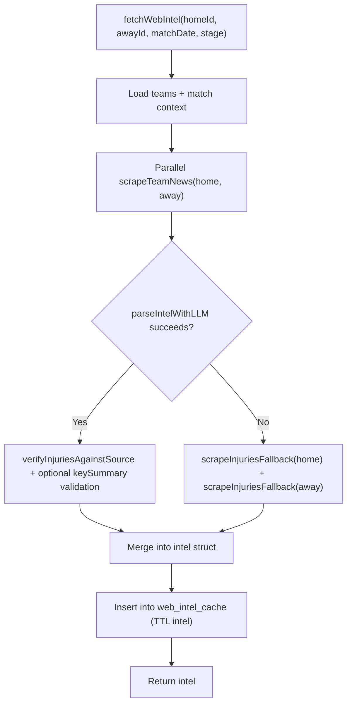
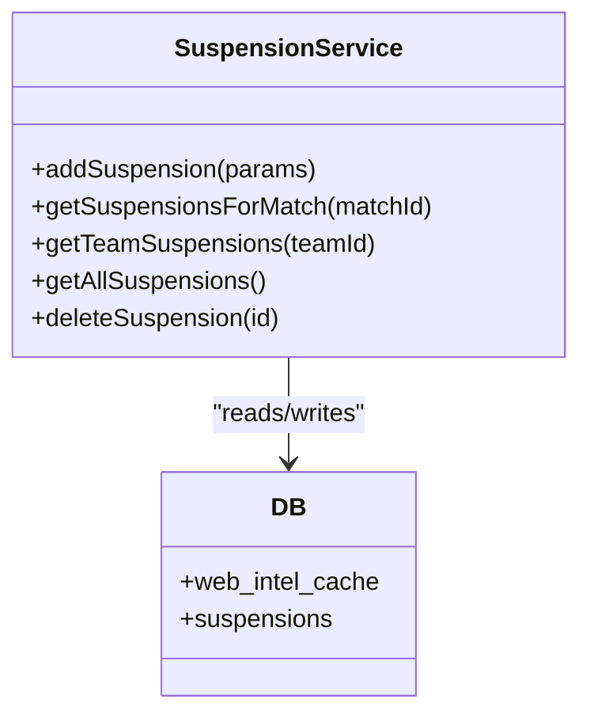
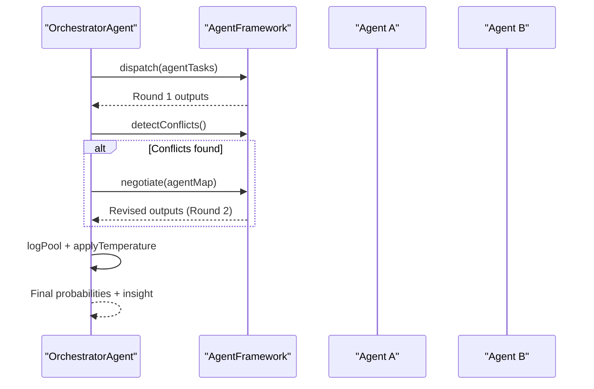
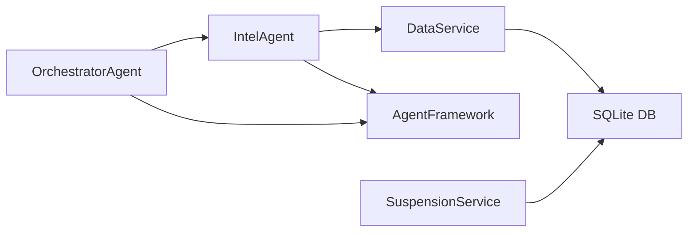

# Intelligence Agent

<cite>
**Referenced Files in This Document**
- [intelAgent.js](file://backend/services/agents/intelAgent.js)
- [dataService.js](file://backend/services/dataService.js)
- [orchestratorAgent.js](file://backend/services/agents/orchestratorAgent.js)
- [agentFramework.js](file://backend/services/agents/agentFramework.js)
- [db.js](file://backend/database/db.js)
- [suspensionService.js](file://backend/services/suspensionService.js)
- [README.md](file://README.md)
</cite>

## Table of Contents
1. [Introduction](#introduction)
2. [Project Structure](#project-structure)
3. [Core Components](#core-components)
4. [Architecture Overview](#architecture-overview)
5. [Detailed Component Analysis](#detailed-component-analysis)
6. [Dependency Analysis](#dependency-analysis)
7. [Performance Considerations](#performance-considerations)
8. [Troubleshooting Guide](#troubleshooting-guide)
9. [Conclusion](#conclusion)

## Introduction
This document describes the Intelligence Agent responsible for gathering and interpreting pre-match intelligence for World Cup 2026 predictions. It covers:
- Web scraping workflows for injuries, suspensions, and player availability from official and news sources
- External data integration combining multiple sources for robust intelligence
- Data processing algorithms that extract structured signals from unstructured text
- The agent’s role in synthesizing signals into probabilistic shifts and integrating them with other predictive factors

The Intelligence Agent sits within a multi-agent orchestration pipeline that blends quantitative models with qualitative off-pitch signals such as injuries, motivation, and squad rotation.

## Project Structure
The Intelligence Agent is part of a modular agent framework with a dedicated data service for web intelligence and a central orchestrator that coordinates multiple agents.

**Diagram sources**
- [orchestratorAgent.js:309-500](file://backend/services/agents/orchestratorAgent.js#L309-L500)
- [agentFramework.js:208-586](file://backend/services/agents/agentFramework.js#L208-L586)
- [intelAgent.js:1-128](file://backend/services/agents/intelAgent.js#L1-L128)
- [dataService.js:268-510](file://backend/services/dataService.js#L268-L510)
- [db.js:147-208](file://backend/database/db.js#L147-L208)
- [suspensionService.js:1-152](file://backend/services/suspensionService.js#L1-L152)

**Section sources**
- [README.md](file://README.md)
- [orchestratorAgent.js:1-502](file://backend/services/agents/orchestratorAgent.js#L1-L502)
- [agentFramework.js:1-586](file://backend/services/agents/agentFramework.js#L1-L586)
- [intelAgent.js:1-128](file://backend/services/agents/intelAgent.js#L1-L128)
- [dataService.js:1-602](file://backend/services/dataService.js#L1-L602)
- [db.js:1-252](file://backend/database/db.js#L1-L252)
- [suspensionService.js:1-152](file://backend/services/suspensionService.js#L1-L152)

## Core Components
- Intelligence Agent (IntelAgent): Extracts structured signals (injuries, motivation, rotation) from web-scraped news and interprets their impact on match outcomes.
- DataService: Implements web scraping and LLM-based parsing to produce structured intelligence for a match.
- OrchestratorAgent: Coordinates multiple agents, detects conflicts, negotiates differences, and synthesizes a final prediction.
- AgentFramework: Provides the Agent and AgentSession base classes, conflict detection, and message persistence.
- SuspensionService: Tracks yellow/red cards and match suspensions to inform potential absences.
- Database: Caches web intelligence, predictions, and agent sessions/messages.

**Section sources**
- [intelAgent.js:1-128](file://backend/services/agents/intelAgent.js#L1-L128)
- [dataService.js:268-510](file://backend/services/dataService.js#L268-L510)
- [orchestratorAgent.js:309-500](file://backend/services/agents/orchestratorAgent.js#L309-L500)
- [agentFramework.js:208-586](file://backend/services/agents/agentFramework.js#L208-L586)
- [suspensionService.js:1-152](file://backend/services/suspensionService.js#L1-L152)
- [db.js:147-208](file://backend/database/db.js#L147-L208)

## Architecture Overview
The Intelligence Agent participates in a two-round multi-agent process:
1. Parallel pre-fetch of domain data (including web intelligence) and agent-specific prompts.
2. Round 1: Agents run concurrently; Round 2: Negotiation resolves conflicts exceeding a threshold.
3. Final outputs are blended using a log-pool method and temperature scaling, then saved to the database.

**Diagram sources**
- [orchestratorAgent.js:331-396](file://backend/services/agents/orchestratorAgent.js#L331-L396)
- [intelAgent.js:50-117](file://backend/services/agents/intelAgent.js#L50-L117)
- [dataService.js:432-509](file://backend/services/dataService.js#L432-L509)
- [agentFramework.js:211-330](file://backend/services/agents/agentFramework.js#L211-L330)

## Detailed Component Analysis

### Intelligence Agent (IntelAgent)
Responsibilities:
- Fetches structured web intelligence for a match.
- Builds a prompt enriched with injuries, motivation, rotation, and narrative form.
- Interprets qualitative signals to adjust win/draw/loss probabilities.

Key behaviors:
- Falls back gracefully when no intelligence is available.
- Emphasizes data quality indicators (LLM vs regex parsing).
- Enforces strict rules to avoid hallucinations (only list players confirmed in the raw text near injury-related keywords).

**Diagram sources**
- [intelAgent.js:64-117](file://backend/services/agents/intelAgent.js#L64-L117)

**Section sources**
- [intelAgent.js:1-128](file://backend/services/agents/intelAgent.js#L1-L128)

### Data Service: Web Intelligence Pipeline
Responsibilities:
- Scrape recent news for both teams using Google News RSS.
- Parse raw text with an LLM to extract structured intelligence.
- Apply anti-hallucination checks to ensure claims are grounded in the source text.
- Provide a regex fallback when LLM parsing fails.
- Cache results for performance and freshness.

Processing logic highlights:
- Scraping: Queries Google News RSS with team-specific terms and concatenates item titles/descriptions.
- LLM parsing: Prompts a model to return a JSON object containing injuries, motivation, rotation, and a concise key summary.
- Anti-hallucination: Validates claimed injuries by ensuring the player name appears near an injury-related keyword within a bounded context.
- Fallback: Regex-based extraction of injury names when LLM fails.
- Caching: Stores content in web_intel_cache with TTL.

**Diagram sources**
- [dataService.js:432-509](file://backend/services/dataService.js#L432-L509)
- [dataService.js:271-292](file://backend/services/dataService.js#L271-L292)
- [dataService.js:313-399](file://backend/services/dataService.js#L313-L399)
- [dataService.js:401-430](file://backend/services/dataService.js#L401-L430)

**Section sources**
- [dataService.js:268-510](file://backend/services/dataService.js#L268-L510)

### Suspension Tracking Integration
Suspensions are tracked separately and stored in the database. While the Intelligence Agent focuses on news-driven signals, suspension data can influence the interpretation of injuries and availability. The SuspensionService provides:
- Adding/updating suspensions (yellow/red cards, reasons, match-specific bans)
- Retrieving suspensions for a specific match
- Yellow card watch lists for players close to a ban

**Diagram sources**
- [suspensionService.js:1-152](file://backend/services/suspensionService.js#L1-L152)
- [db.js:133-145](file://backend/database/db.js#L133-L145)

**Section sources**
- [suspensionService.js:1-152](file://backend/services/suspensionService.js#L1-L152)
- [db.js:133-145](file://backend/database/db.js#L133-L145)

### Multi-Agent Orchestration and Synthesis
The OrchestratorAgent:
- Pre-fetches domain data in parallel (H2H, form, intel, lineup).
- Builds agent tasks and dispatches them concurrently.
- Detects conflicts (probability deltas ≥ 0.20) and negotiates in Round 2.
- Blends outputs using a log-pool method and temperature scaling.
- Generates human-readable insights while guarding against hallucinations.

**Diagram sources**
- [orchestratorAgent.js:398-428](file://backend/services/agents/orchestratorAgent.js#L398-L428)
- [agentFramework.js:350-503](file://backend/services/agents/agentFramework.js#L350-L503)

**Section sources**
- [orchestratorAgent.js:1-502](file://backend/services/agents/orchestratorAgent.js#L1-L502)
- [agentFramework.js:1-586](file://backend/services/agents/agentFramework.js#L1-L586)

## Dependency Analysis
- IntelAgent depends on DataService for fetching web intelligence and on AgentFramework for prompt building and output parsing.
- OrchestratorAgent composes multiple agents and coordinates their execution and conflict resolution.
- DataService depends on Qwen for LLM parsing and Cheerio/Axios for scraping.
- Database schema supports caching and persistence for web intelligence, predictions, and agent sessions.

**Diagram sources**
- [intelAgent.js:16-18](file://backend/services/agents/intelAgent.js#L16-L18)
- [orchestratorAgent.js:32-38](file://backend/services/agents/orchestratorAgent.js#L32-L38)
- [dataService.js:7-21](file://backend/services/dataService.js#L7-L21)
- [db.js:147-208](file://backend/database/db.js#L147-L208)
- [suspensionService.js](file://backend/services/suspensionService.js#L13)

**Section sources**
- [intelAgent.js:1-128](file://backend/services/agents/intelAgent.js#L1-L128)
- [orchestratorAgent.js:1-502](file://backend/services/agents/orchestratorAgent.js#L1-L502)
- [dataService.js:1-602](file://backend/services/dataService.js#L1-L602)
- [db.js:1-252](file://backend/database/db.js#L1-L252)
- [suspensionService.js:1-152](file://backend/services/suspensionService.js#L1-L152)

## Performance Considerations
- Parallelization: Web scraping and agent runs are executed in parallel to minimize latency.
- Caching: Intelligence and other domain data are cached with TTLs to reduce repeated network calls.
- Robustness: Fallbacks (regex extraction, default forms) ensure predictions remain available even when upstream sources fail.
- Conflict resolution: Negotiation reduces extreme swings caused by individual agent disagreement.

[No sources needed since this section provides general guidance]

## Troubleshooting Guide
Common issues and remedies:
- Scrape failures: If Google News RSS is unavailable, scraping returns empty content; the system falls back to regex extraction and default forms.
- LLM parsing errors: The system retries with stricter instructions; if still failing, it returns a neutral prompt and reduces confidence.
- Hallucination prevention: Claims are validated against the raw text within a bounded window around injury-related keywords; invalid claims are dropped and summaries sanitized.
- Data quality: The prompt indicates whether the intelligence was parsed by LLM or regex; sparse or regex-only intel lowers confidence and weight.

**Section sources**
- [dataService.js:271-292](file://backend/services/dataService.js#L271-L292)
- [dataService.js:313-399](file://backend/services/dataService.js#L313-L399)
- [dataService.js:401-430](file://backend/services/dataService.js#L401-L430)
- [agentFramework.js:121-156](file://backend/services/agents/agentFramework.js#L121-L156)
- [intelAgent.js:67-73](file://backend/services/agents/intelAgent.js#L67-L73)

## Conclusion
The Intelligence Agent transforms unstructured news and official announcements into structured, validated signals that inform match outcome probabilities. Its integration with the multi-agent orchestration ensures robust synthesis by combining quantitative models with qualitative off-pitch factors such as injuries, motivation, and squad rotation. Anti-hallucination safeguards and caching mechanisms improve reliability and performance, while suspension tracking complements injury reporting to provide a comprehensive pre-match intelligence picture.