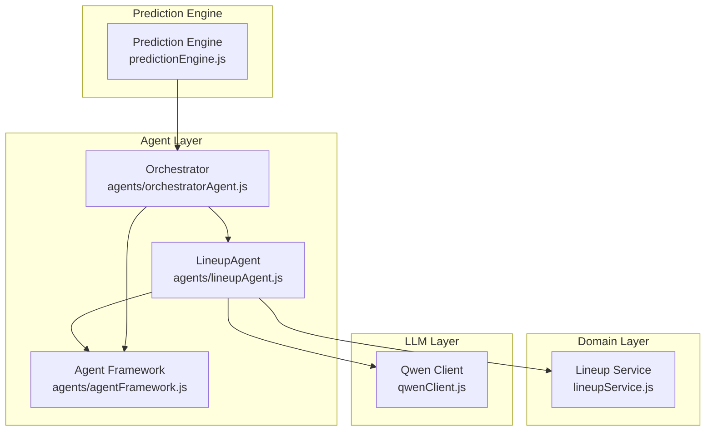
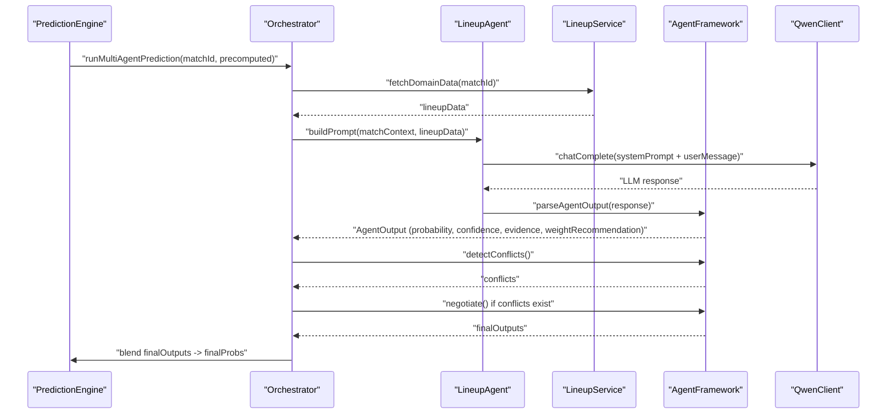
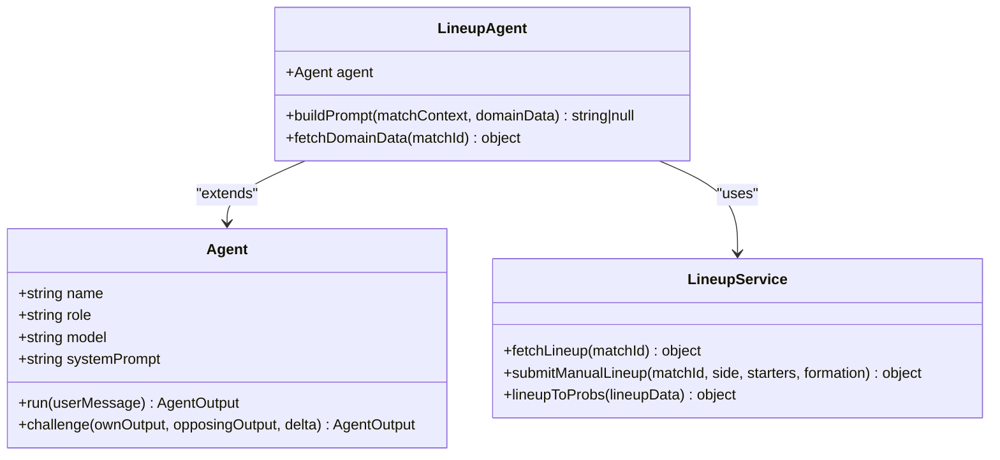
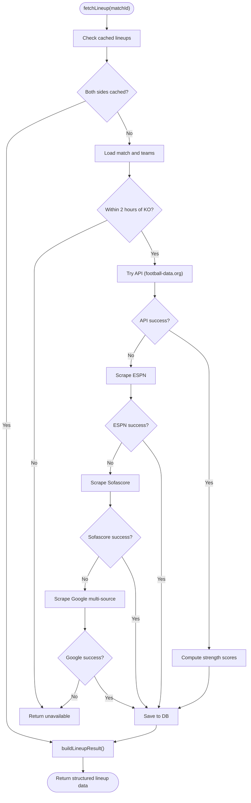
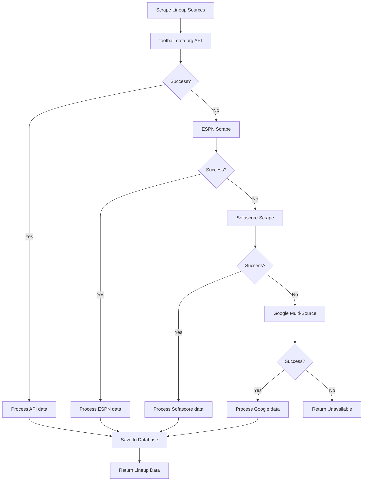
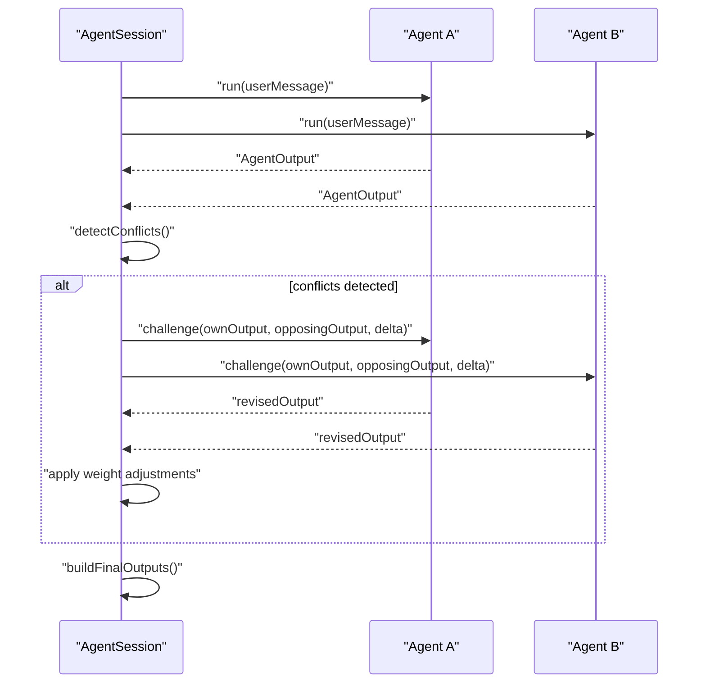
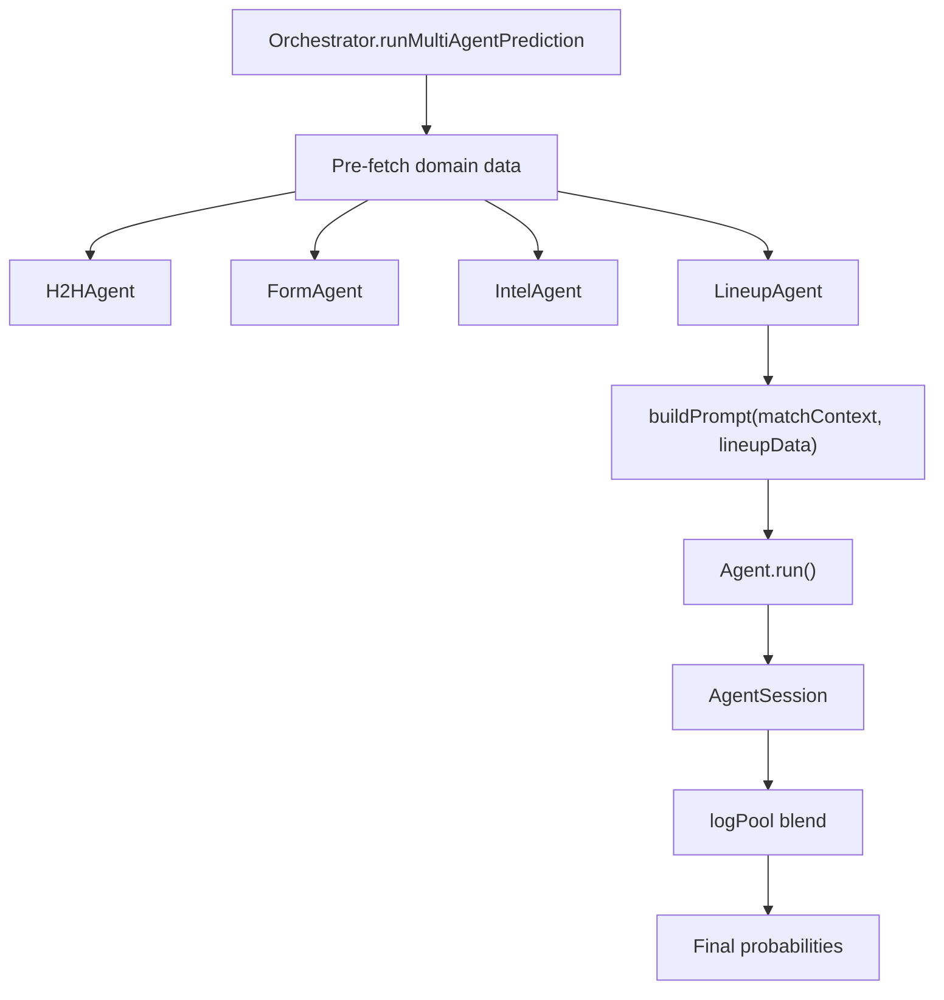
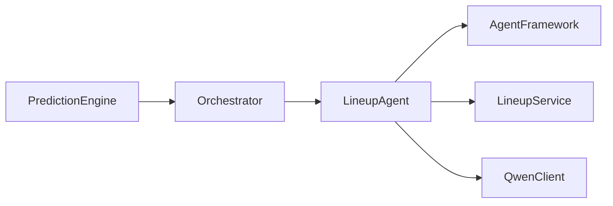

# Lineup Agent

<cite>
**Referenced Files in This Document**
- [lineupAgent.js](file://backend/services/agents/lineupAgent.js)
- [lineupService.js](file://backend/services/lineupService.js)
- [agentFramework.js](file://backend/services/agents/agentFramework.js)
- [orchestratorAgent.js](file://backend/services/agents/orchestratorAgent.js)
- [predictionEngine.js](file://backend/services/predictionEngine.js)
- [qwenClient.js](file://backend/services/qwenClient.js)
</cite>

## Update Summary
**Changes Made**
- Updated Lineup Service section to reflect new Google-based multi-source scraper (scrapeLineupGoogle)
- Added Sofascore-specific scraper (scrapeLineupSofascore) to the data fetching pipeline
- Enhanced fallback sources documentation with additional reliability improvements
- Updated architecture diagrams to show the expanded scraping pipeline

## Table of Contents
1. [Introduction](#introduction)
2. [Project Structure](#project-structure)
3. [Core Components](#core-components)
4. [Architecture Overview](#architecture-overview)
5. [Detailed Component Analysis](#detailed-component-analysis)
6. [Dependency Analysis](#dependency-analysis)
7. [Performance Considerations](#performance-considerations)
8. [Troubleshooting Guide](#troubleshooting-guide)
9. [Conclusion](#conclusion)

## Introduction
The Lineup Agent is a specialized multi-agent component that analyzes confirmed starting XI data to assess lineup strength and tactical implications for World Cup 2026 matches. It operates only when lineup data is available (typically ~60–75 minutes before kickoff) and carries the highest signal weight among pre-match agents (0.40) because confirmed lineups resolve uncertainty about who will actually play. The agent evaluates:
- Lineup strength scores (0–10 scale) and the delta between teams
- Key player absences versus expected lineups
- Formation matchups and tactical implications
- Whether either team appears to be playing a weakened or rotated side

**Updated** Enhanced with improved data reliability through expanded scraping sources including Google multi-source search and Sofascore integration.

## Project Structure
The Lineup Agent integrates within the multi-agent prediction framework:
- Agent definition and orchestration: [lineupAgent.js](file://backend/services/agents/lineupAgent.js)
- Domain data fetching and computation: [lineupService.js](file://backend/services/lineupService.js)
- Agent framework and session orchestration: [agentFramework.js](file://backend/services/agents/agentFramework.js)
- Multi-agent orchestrator: [orchestratorAgent.js](file://backend/services/agents/orchestratorAgent.js)
- Prediction engine integration: [predictionEngine.js](file://backend/services/predictionEngine.js)
- LLM client: [qwenClient.js](file://backend/services/qwenClient.js)

**Diagram sources**
- [lineupAgent.js:1-118](file://backend/services/agents/lineupAgent.js#L1-L118)
- [lineupService.js:1-572](file://backend/services/lineupService.js#L1-L572)
- [agentFramework.js:1-586](file://backend/services/agents/agentFramework.js#L1-L586)
- [orchestratorAgent.js:1-502](file://backend/services/agents/orchestratorAgent.js#L1-L502)
- [predictionEngine.js:1-1046](file://backend/services/predictionEngine.js#L1-L1046)
- [qwenClient.js:1-123](file://backend/services/qwenClient.js#L1-L123)

**Section sources**
- [lineupAgent.js:1-118](file://backend/services/agents/lineupAgent.js#L1-L118)
- [lineupService.js:1-572](file://backend/services/lineupService.js#L1-L572)
- [agentFramework.js:1-586](file://backend/services/agents/agentFramework.js#L1-L586)
- [orchestratorAgent.js:1-502](file://backend/services/agents/orchestratorAgent.js#L1-L502)
- [predictionEngine.js:1-1046](file://backend/services/predictionEngine.js#L1-L1046)
- [qwenClient.js:1-123](file://backend/services/qwenClient.js#L1-L123)

## Core Components
- Lineup Agent: Specialized LLM agent that analyzes confirmed starting XI data and generates high-confidence probability assessments with explicit weight recommendations.
- Lineup Service: Fetches and computes lineup data from multiple sources, calculates strength scores, detects key absences, and builds structured results for downstream consumption.
- Agent Framework: Provides the Agent class, AgentSession orchestration, conflict detection and negotiation, and standardized output parsing with JSON schema enforcement.
- Orchestrator: Coordinates multi-agent runs, manages agent tasks, conflict resolution, and final probability blending.
- Prediction Engine: Integrates lineup signals into the broader prediction pipeline, weighting lineup data at 0.40 when available.

**Updated** The Lineup Service now includes enhanced scraping capabilities with Google multi-source search and Sofascore integration for improved data reliability.

**Section sources**
- [lineupAgent.js:14-118](file://backend/services/agents/lineupAgent.js#L14-L118)
- [lineupService.js:41-572](file://backend/services/lineupService.js#L41-L572)
- [agentFramework.js:208-586](file://backend/services/agents/agentFramework.js#L208-L586)
- [orchestratorAgent.js:309-502](file://backend/services/agents/orchestratorAgent.js#L309-L502)
- [predictionEngine.js:92-100](file://backend/services/predictionEngine.js#L92-L100)

## Architecture Overview
The Lineup Agent participates in two prediction modes:
- Single-agent mode: Uses the prediction engine's unified pipeline with lineupToProbs conversion.
- Multi-agent mode: Operates within AgentSession orchestration, generating structured outputs with confidence, evidence, and weight recommendations.

**Diagram sources**
- [orchestratorAgent.js:319-502](file://backend/services/agents/orchestratorAgent.js#L319-L502)
- [lineupAgent.js:44-118](file://backend/services/agents/lineupAgent.js#L44-L118)
- [lineupService.js:221-463](file://backend/services/lineupService.js#L221-L463)
- [agentFramework.js:211-586](file://backend/services/agents/agentFramework.js#L211-L586)
- [qwenClient.js:53-101](file://backend/services/qwenClient.js#L53-L101)

## Detailed Component Analysis

### Lineup Agent Implementation
The Lineup Agent is a focused tactical analyst that:
- Activates only when lineup data is available (returns null otherwise)
- Carries the highest pre-match signal weight (0.40)
- Builds a structured prompt containing formation, strength scores, starters, and key absences
- Emphasizes lineup strength delta and key absences in its reasoning

**Diagram sources**
- [lineupAgent.js:110-118](file://backend/services/agents/lineupAgent.js#L110-L118)
- [lineupAgent.js:44-107](file://backend/services/agents/lineupAgent.js#L44-L107)
- [lineupService.js:221-572](file://backend/services/lineupService.js#L221-L572)
- [agentFramework.js:211-330](file://backend/services/agents/agentFramework.js#L211-L330)

**Section sources**
- [lineupAgent.js:14-118](file://backend/services/agents/lineupAgent.js#L14-L118)

### Lineup Service: Data Fetching and Computation
The Lineup Service performs:
- Availability checks (time proximity to kickoff)
- Multi-source fetching (football-data.org API, ESPN scrape, Sofascore scrape, Google multi-source search)
- Strength score computation using position weights and team ELO baselines
- Key absence detection by comparing current starters to recent lineup patterns
- Result construction with strength delta and impact scores

**Updated** Enhanced with two new scraping sources: Google multi-source search for broader coverage and Sofascore integration for structured data extraction.

**Diagram sources**
- [lineupService.js:221-463](file://backend/services/lineupService.js#L221-L463)
- [lineupService.js:465-509](file://backend/services/lineupService.js#L465-L509)

**Section sources**
- [lineupService.js:83-155](file://backend/services/lineupService.js#L83-L155)
- [lineupService.js:157-183](file://backend/services/lineupService.js#L157-L183)
- [lineupService.js:185-218](file://backend/services/lineupService.js#L185-L218)
- [lineupService.js:221-463](file://backend/services/lineupService.js#L221-L463)
- [lineupService.js:465-509](file://backend/services/lineupService.js#L465-L509)

### Enhanced Scraping Pipeline

**Updated** The Lineup Service now includes sophisticated scraping capabilities with multiple fallback sources:

#### Google Multi-Source Scraper (`scrapeLineupGoogle`)
- Searches across multiple football websites using Google Custom Search
- Extracts formation patterns (e.g., "4-3-3", "4-4-2") from featured snippets
- Parses structured data from Google's rich results and knowledge panels
- Identifies player names from various text formats and patterns

#### Sofascore Integration (`scrapeLineupSofascore`)
- Uses Google search to locate Sofascore match pages
- Extracts structured data from JSON-LD script tags for SEO optimization
- Falls back to text parsing when structured data is unavailable
- Filters player names using common word lists to improve accuracy

**Diagram sources**
- [lineupService.js:157-209](file://backend/services/lineupService.js#L157-L209)
- [lineupService.js:211-290](file://backend/services/lineupService.js#L211-L290)
- [lineupService.js:416-426](file://backend/services/lineupService.js#L416-L426)

**Section sources**
- [lineupService.js:157-209](file://backend/services/lineupService.js#L157-L209)
- [lineupService.js:211-290](file://backend/services/lineupService.js#L211-L290)
- [lineupService.js:416-426](file://backend/services/lineupService.js#L416-L426)

### Agent Framework: Session Orchestration and Conflict Resolution
The Agent Framework provides:
- Standardized Agent class with run() and challenge() methods
- JSON schema enforcement and robust parsing with fallbacks
- AgentSession orchestration with parallel dispatch, conflict detection, and negotiation
- Weight adjustment rules: winner boosted by 1.3×, loser penalized to 0.6×

**Diagram sources**
- [agentFramework.js:336-503](file://backend/services/agents/agentFramework.js#L336-L503)

**Section sources**
- [agentFramework.js:211-330](file://backend/services/agents/agentFramework.js#L211-L330)
- [agentFramework.js:336-503](file://backend/services/agents/agentFramework.js#L336-L503)

### Multi-Agent Orchestration and Lineup Integration
The Orchestrator coordinates agent tasks and integrates lineup data:
- Pre-fetches domain data (H2H, form, intel, lineup) in parallel
- Skips agents with null prompts (e.g., LineupAgent when unavailable)
- Builds AgentSession and handles conflict resolution
- Blends final outputs using log-pool weighting

**Diagram sources**
- [orchestratorAgent.js:319-502](file://backend/services/agents/orchestratorAgent.js#L319-L502)

**Section sources**
- [orchestratorAgent.js:331-396](file://backend/services/agents/orchestratorAgent.js#L331-L396)
- [orchestratorAgent.js:402-449](file://backend/services/agents/orchestratorAgent.js#L402-L449)

## Dependency Analysis
The Lineup Agent depends on:
- Agent Framework for output parsing and session orchestration
- Lineup Service for reliable lineup data and strength computations
- Qwen Client for LLM inference
- Orchestrator for multi-agent coordination

**Diagram sources**
- [lineupAgent.js:14-16](file://backend/services/agents/lineupAgent.js#L14-L16)
- [agentFramework.js:28-29](file://backend/services/agents/agentFramework.js#L28-L29)
- [lineupService.js:43](file://backend/services/lineupService.js#L43)
- [qwenClient.js:27-40](file://backend/services/qwenClient.js#L27-L40)
- [orchestratorAgent.js:30-37](file://backend/services/agents/orchestratorAgent.js#L30-L37)
- [predictionEngine.js:40-53](file://backend/services/predictionEngine.js#L40-L53)

**Section sources**
- [lineupAgent.js:14-16](file://backend/services/agents/lineupAgent.js#L14-L16)
- [agentFramework.js:28-29](file://backend/services/agents/agentFramework.js#L28-L29)
- [lineupService.js:43](file://backend/services/lineupService.js#L43)
- [qwenClient.js:27-40](file://backend/services/qwenClient.js#L27-L40)
- [orchestratorAgent.js:30-37](file://backend/services/agents/orchestratorAgent.js#L30-L37)
- [predictionEngine.js:40-53](file://backend/services/predictionEngine.js#L40-L53)

## Performance Considerations
- Availability gating: Lineup Agent returns null when data is unavailable, preventing unnecessary LLM calls.
- Parallel orchestration: In multi-agent mode, agents run concurrently, reducing total prediction latency.
- Weighted blending: The 0.40 weight ensures lineup signals dominate when available, while other signals remain influential.
- Robust parsing: JSON extraction with sanitization and fallbacks minimizes parse errors and improves reliability.
- Enhanced reliability: Multiple scraping sources with intelligent fallback mechanisms increase data availability and accuracy.

**Updated** Improved data reliability through expanded scraping sources reduces the likelihood of lineup unavailability and provides more consistent data quality.

## Troubleshooting Guide
Common issues and resolutions:
- Lineup data unavailable: Agent returns null; orchestrator skips LineupAgent for that run.
- JSON parse errors: AgentFramework applies fallback outputs with minimal confidence and flags.
- LLM failures: AgentFramework retries once and falls back to default outputs.
- Absence detection: If recent lineup patterns are insufficient, absence detection may be empty; verify DB entries.
- Scraping failures: Enhanced fallback pipeline ensures multiple attempts across different sources before declaring failure.

**Updated** Enhanced troubleshooting guidance for new scraping sources and improved fallback mechanisms.

**Section sources**
- [lineupAgent.js:64-66](file://backend/services/agents/lineupAgent.js#L64-L66)
- [agentFramework.js:122-156](file://backend/services/agents/agentFramework.js#L122-L156)
- [agentFramework.js:252-269](file://backend/services/agents/agentFramework.js#L252-L269)
- [lineupService.js:190-218](file://backend/services/lineupService.js#L190-L218)

## Conclusion
The Lineup Agent provides a robust, high-confidence analysis of confirmed starting XI data within the multi-agent prediction system. By leveraging structured prompts, standardized output schemas, and conflict-aware negotiation, it delivers actionable insights on lineup strength, key absences, and tactical implications. Its integration with the Lineup Service ensures reliable data sourcing and computation through an enhanced multi-source scraping pipeline. The addition of Google multi-source search and Sofascore integration significantly improves data reliability and availability. The Orchestrator coordinates seamless multi-agent workflows and final probability blending, making the Lineup Agent a critical component in the World Cup 2026 prediction system.