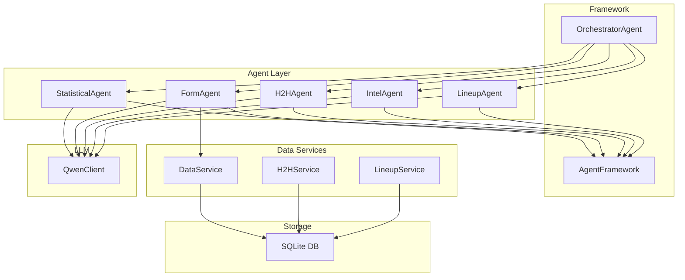
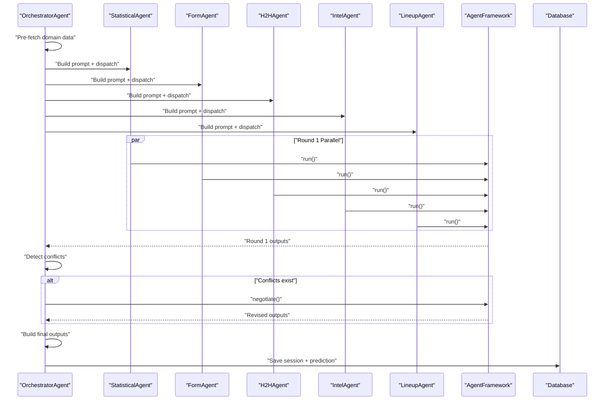
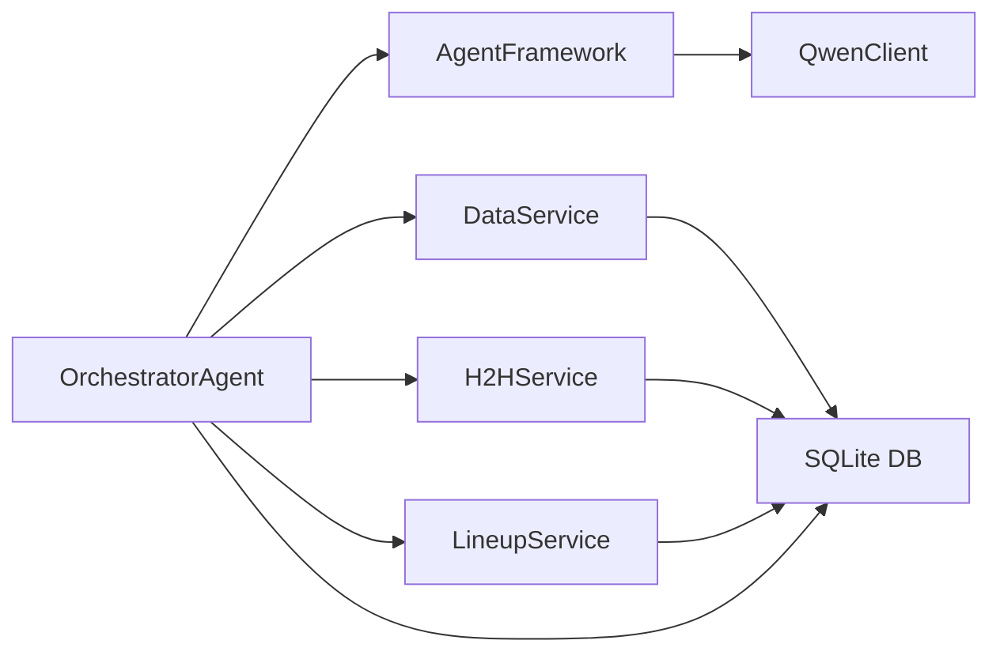

# Specialized Agents

<cite>
**Referenced Files in This Document**
- [statisticalAgent.js](file://backend/services/agents/statisticalAgent.js)
- [formAgent.js](file://backend/services/agents/formAgent.js)
- [h2hAgent.js](file://backend/services/agents/h2hAgent.js)
- [intelAgent.js](file://backend/services/agents/intelAgent.js)
- [lineupAgent.js](file://backend/services/agents/lineupAgent.js)
- [agentFramework.js](file://backend/services/agents/agentFramework.js)
- [orchestratorAgent.js](file://backend/services/agents/orchestratorAgent.js)
- [dataService.js](file://backend/services/dataService.js)
- [h2hService.js](file://backend/services/h2hService.js)
- [lineupService.js](file://backend/services/lineupService.js)
- [qwenClient.js](file://backend/services/qwenClient.js)
- [db.js](file://backend/database/db.js)
</cite>

## Table of Contents
1. [Introduction](#introduction)
2. [Project Structure](#project-structure)
3. [Core Components](#core-components)
4. [Architecture Overview](#architecture-overview)
5. [Detailed Component Analysis](#detailed-component-analysis)
6. [Dependency Analysis](#dependency-analysis)
7. [Performance Considerations](#performance-considerations)
8. [Troubleshooting Guide](#troubleshooting-guide)
9. [Conclusion](#conclusion)
10. [Appendices](#appendices)

## Introduction
This document explains the five specialized AI agents that power the multi-agent prediction system for the 2026 World Cup. Each agent focuses on a distinct aspect of match analysis: statistical backbone interpretation, recent form, head-to-head history, pre-match intelligence, and confirmed lineups. Together, they provide a robust, negotiated prediction pipeline that blends quantitative signals with qualitative insights.

## Project Structure
The agents are implemented as modular specialists that share a common framework and orchestration layer. They communicate with external data sources and the LLM provider via a unified client.

**Diagram sources**
- [agentFramework.js:1-586](file://backend/services/agents/agentFramework.js#L1-L586)
- [orchestratorAgent.js:1-502](file://backend/services/agents/orchestratorAgent.js#L1-L502)
- [dataService.js:1-200](file://backend/services/dataService.js#L1-L200)
- [h2hService.js:1-200](file://backend/services/h2hService.js#L1-L200)
- [lineupService.js:1-200](file://backend/services/lineupService.js#L1-L200)
- [qwenClient.js:1-123](file://backend/services/qwenClient.js#L1-L123)
- [db.js:1-252](file://backend/database/db.js#L1-L252)

**Section sources**
- [agentFramework.js:1-586](file://backend/services/agents/agentFramework.js#L1-L586)
- [orchestratorAgent.js:1-502](file://backend/services/agents/orchestratorAgent.js#L1-L502)

## Core Components
- AgentFramework: Defines the shared Agent class and AgentSession orchestration, including JSON output schema, parsing, conflict detection, and negotiation.
- Agent Specialists: Five agents with dedicated system prompts, data fetchers, and prompt builders tailored to their domains.
- OrchestratorAgent: Coordinates agent activation, parallel execution, conflict detection, negotiation, and final synthesis.
- Data Services: Provide domain data (form, H2H, lineups, injuries) via APIs and web scraping with caching.
- QwenClient: Unified interface to the LLM provider with model selection and retry logic.
- Database: Stores predictions, agent sessions, messages, and caches.

**Section sources**
- [agentFramework.js:40-156](file://backend/services/agents/agentFramework.js#L40-L156)
- [agentFramework.js:211-330](file://backend/services/agents/agentFramework.js#L211-L330)
- [agentFramework.js:336-572](file://backend/services/agents/agentFramework.js#L336-L572)
- [orchestratorAgent.js:309-502](file://backend/services/agents/orchestratorAgent.js#L309-L502)

## Architecture Overview
The system runs a two-round negotiation among agents. Round 1 produces independent probability estimates with confidence and evidence. Round 2 resolves conflicts exceeding a threshold by challenging agents to justify or revise positions. Final outputs are blended using a log-pool with weights adjusted based on concessions.

**Diagram sources**
- [orchestratorAgent.js:331-469](file://backend/services/agents/orchestratorAgent.js#L331-L469)
- [agentFramework.js:350-445](file://backend/services/agents/agentFramework.js#L350-L445)
- [agentFramework.js:447-503](file://backend/services/agents/agentFramework.js#L447-L503)

## Detailed Component Analysis

### Statistical Agent
- Purpose: Interprets the pre-computed Dixon-Coles Poisson backbone (λ values, ELO ratings, attack/defense α/β parameters, home advantage, venue effects) into a natural-language probability assessment.
- Data sources:
  - Backboned λ_home, λ_away, backbone probabilities, home advantage, venue effect.
  - Team ELO and α/β parameters from the prediction engine’s precomputed inputs.
- Processing algorithm:
  - Uses the pre-computed λ and backbone probabilities as anchors.
  - Adjusts for ELO gaps, attack/defense ratings, and venue/home factors.
  - Emphasizes statistical anomalies and uncertainty.
- System prompt focus:
  - Expected goals, ELO gap impact, α/β differentials, venue/home effects, and statistical clarity.
- Output format: JSON with probability, confidence, evidence bullets, weight recommendation, and optional flags.
- Example input data:
  - Match context (home/away teams, stage, venue, scheduled date).
  - Backbone outputs (λ_home, λ_away, P(winHome), P(draw), P(winAway)).
  - ELO ratings and α/β parameters.
  - Home advantage and venue effect.
- Example processing workflow:
  - Build prompt with formatted backbone stats and contextual factors.
  - LLM returns JSON with calibrated probabilities and justification.
- Example output format:
  - probability: { winHome, draw, winAway }
  - confidence, evidence, weightRecommendation, flags
- Specialization trade-off:
  - Strengths: Anchors predictions in rigorous math; flags anomalies.
  - Limitations: Does not re-run Poisson; relies on precomputed backbone.
- Value timing:
  - Always active; provides baseline for other agents.

**Section sources**
- [statisticalAgent.js:1-98](file://backend/services/agents/statisticalAgent.js#L1-L98)
- [agentFramework.js:40-53](file://backend/services/agents/agentFramework.js#L40-L53)
- [qwenClient.js:17-21](file://backend/services/qwenClient.js#L17-L21)

### Form Agent
- Purpose: Analyzes recent match form (last 10 results) with competition weighting to assess momentum and recent trends.
- Data sources:
  - Recent form via DataService (football-data.org API or web scraping).
  - Competition quality mapping for weighting.
- Processing algorithm:
  - Fetches home and away forms in parallel.
  - Formats match entries with result, score, opponent, competition, and recency.
  - Computes quick summaries (W/D/L, GF/GA) and flags synthetic or friendly-only data.
- System prompt focus:
  - Momentum sequences, scoring patterns, competition quality, and context (e.g., friendlies).
- Output format: JSON with probability, confidence, evidence bullets, weight recommendation, and optional flags.
- Example input data:
  - Match context and arrays of recent form entries for both teams.
- Example processing workflow:
  - Build prompt with summaries and recent entries.
  - LLM assesses form quality and recommends weight.
- Example output format:
  - probability, confidence, evidence, weightRecommendation, flags
- Specialization trade-off:
  - Strengths: Captures current form and context; lightweight.
  - Limitations: May be noisy if synthetic or friendly-heavy; short horizon.
- Value timing:
  - Active when form data is available; otherwise skipped.

**Section sources**
- [formAgent.js:1-113](file://backend/services/agents/formAgent.js#L1-L113)
- [dataService.js:68-133](file://backend/services/dataService.js#L68-L133)
- [qwenClient.js:17-21](file://backend/services/qwenClient.js#L17-L21)

### H2H Agent
- Purpose: Interprets a competition-weighted head-to-head record from a 47k-match dataset to assess historical patterns’ predictive value.
- Data sources:
  - H2HService queries a seeded SQLite table derived from the martj42 dataset.
  - Competition weights: WC finals, qualifiers, continental championships, NL/Gold Cup, friendlies.
- Processing algorithm:
  - Ensures H2H data is seeded; queries matches between teams with weights and recency.
  - Computes raw record, WC-specific counts, weighted probabilities, and advantage score.
  - Returns null when fewer than 2 meetings exist.
- System prompt focus:
  - Win/draw/loss ratios, WC emphasis, recency, sample size, and quality weighting.
- Output format: JSON with probability, confidence, evidence bullets, weight recommendation, and optional flags.
- Example input data:
  - Match context and H2H summary (matchCount, wcMeetings, rawRecord, weightedAdvantage).
- Example processing workflow:
  - Build prompt with H2H stats and recent meeting.
  - LLM interprets historical significance and recommends weight.
- Example output format:
  - probability, confidence, evidence, weightRecommendation, flags
- Specialization trade-off:
  - Strengths: Long-term historical signal; robust weighting.
  - Limitations: Requires sufficient meetings; may be outdated for rapidly changing teams.
- Value timing:
  - Active when H2H meets minimum threshold; otherwise skipped.

**Section sources**
- [h2hAgent.js:1-107](file://backend/services/agents/h2hAgent.js#L1-L107)
- [h2hService.js:1-200](file://backend/services/h2hService.js#L1-L200)
- [qwenClient.js:17-21](file://backend/services/qwenClient.js#L17-L21)

### Intel Agent
- Purpose: Interprets pre-match intelligence (injuries, suspensions, motivation, rotation) to adjust probabilities from pure statistics.
- Data sources:
  - DataService web scraping of Google News RSS for both teams.
  - Structured extraction of injuries, motivation, and rotation; fallbacks and caching.
- Processing algorithm:
  - Fetches structured intelligence for both teams.
  - Builds narrative summaries for motivation and form.
  - Enforces strict rule: only reference players listed as unavailable.
  - Provides calibration guidelines for impact magnitudes.
- System prompt focus:
  - Key injuries, confirmed rotation, motivation, compounding effects, and data quality.
- Output format: JSON with probability, confidence, evidence bullets, weight recommendation, and optional flags.
- Example input data:
  - Match context and webIntel structure (injuries, rotation, motivation, form narrative).
- Example processing workflow:
  - Build prompt with injuries, rotation, motivation, and quality indicators.
  - LLM assesses probability impact and sets weight.
- Example output format:
  - probability, confidence, evidence, weightRecommendation, flags
- Specialization trade-off:
  - Strengths: High-value off-pitch signals; dynamic and timely.
  - Limitations: Sparse or unreliable intel reduces confidence; hallucination risk mitigated by strict rules.
- Value timing:
  - Active when intelligence is available; otherwise returns near-neutral.

**Section sources**
- [intelAgent.js:1-128](file://backend/services/agents/intelAgent.js#L1-L128)
- [dataService.js:135-185](file://backend/services/dataService.js#L135-L185)
- [qwenClient.js:17-21](file://backend/services/qwenClient.js#L17-L21)

### Lineup Agent
- Purpose: Analyzes confirmed starting XI to resolve uncertainty and provide high-confidence tactical assessment.
- Data sources:
  - LineupService fetches confirmed lineups from football-data.org API or web scraping.
  - Computes formation, strength scores, and key absences.
- Processing algorithm:
  - Fetches lineup data; returns null when unavailable (skips agent).
  - Computes strength delta and highlights key absences.
  - Provides calibration guide for strength delta impacts.
- System prompt focus:
  - Formation matchups, lineup strength, key absences, and tactical implications.
- Output format: JSON with probability, confidence, evidence bullets, weight recommendation, and optional flags.
- Example input data:
  - Match context and lineup structure (home/away starters, formation, strength scores, key absences).
- Example processing workflow:
  - Build prompt with starters, strengths, and delta.
  - LLM provides high-confidence assessment and sets high weight.
- Example output format:
  - probability, confidence, evidence, weightRecommendation, flags
- Specialization trade-off:
  - Strengths: Highest signal weight; resolves uncertainty; tactical nuance.
  - Limitations: Available only ~60–75 minutes before kickoff; null when unavailable.
- Value timing:
  - Active only when lineup is confirmed; otherwise skipped.

**Section sources**
- [lineupAgent.js:1-118](file://backend/services/agents/lineupAgent.js#L1-L118)
- [lineupService.js:1-200](file://backend/services/lineupService.js#L1-L200)
- [qwenClient.js:17-21](file://backend/services/qwenClient.js#L17-L21)

## Dependency Analysis
- AgentFramework depends on QwenClient for LLM calls and defines the shared JSON schema and negotiation logic.
- OrchestratorAgent composes agents, pre-fetches domain data, and manages the multi-agent session lifecycle.
- DataServices and H2HService encapsulate external integrations and caching.
- Database persists predictions, agent sessions, and caches.

**Diagram sources**
- [orchestratorAgent.js:331-396](file://backend/services/agents/orchestratorAgent.js#L331-L396)
- [agentFramework.js:29,578-585](file://backend/services/agents/agentFramework.js#L29,L578-L585)
- [dataService.js:68-133](file://backend/services/dataService.js#L68-L133)
- [h2hService.js:95-165](file://backend/services/h2hService.js#L95-L165)
- [lineupService.js:84-113](file://backend/services/lineupService.js#L84-L113)
- [db.js:147-157](file://backend/database/db.js#L147-L157)

**Section sources**
- [orchestratorAgent.js:331-469](file://backend/services/agents/orchestratorAgent.js#L331-L469)
- [agentFramework.js:336-503](file://backend/services/agents/agentFramework.js#L336-L503)

## Performance Considerations
- Model selection:
  - qwen-plus for agents requiring nuanced interpretation (Statistical, Intel, Lineup).
  - qwen-turbo for high-throughput pattern recognition (Form, H2H).
- Parallelism:
  - Agents run in parallel during Round 1; conflicts are negotiated in parallel in Round 2.
- Caching:
  - Form, H2H, and intel data are cached to reduce latency and API load.
- Parsing resilience:
  - Robust JSON extraction and sanitization minimize parse errors and retries.
- Calibration:
  - Temperature scaling and log-pool blending improve calibration and stability.

[No sources needed since this section provides general guidance]

## Troubleshooting Guide
- JSON parse errors:
  - AgentFramework automatically falls back to uniform priors and logs parse errors.
- LLM failures:
  - Retries with stricter prompts; if still failing, outputs fallback with parseError flag.
- Missing data:
  - Agents return null prompts when data is unavailable (e.g., lineup not yet released).
- Conflict resolution:
  - If negotiation fails, agents retain Round 1 positions; final weights reflect concessions.

**Section sources**
- [agentFramework.js:122-156](file://backend/services/agents/agentFramework.js#L122-L156)
- [agentFramework.js:231-329](file://backend/services/agents/agentFramework.js#L231-L329)
- [lineupAgent.js:64-66](file://backend/services/agents/lineupAgent.js#L64-L66)

## Conclusion
The five agents combine rigorous statistical modeling, recent form, historical patterns, pre-match intelligence, and confirmed lineups into a robust, negotiated prediction system. Their specialized roles, shared framework, and careful data handling enable high-quality, interpretable outcomes with confidence and actionable insights.

[No sources needed since this section summarizes without analyzing specific files]

## Appendices

### Agent Output Schema
All agents must respond with a JSON object containing:
- probability: { winHome, draw, winAway }
- confidence
- evidence: array of 2–4 concise bullet points
- weightRecommendation
- flags: optional tags

**Section sources**
- [agentFramework.js:40-53](file://backend/services/agents/agentFramework.js#L40-L53)

### Model Selection
- qwen-max: Orchestrator (complex reasoning)
- qwen-plus: Statistical, Intel, Lineup agents
- qwen-turbo: Form, H2H agents

**Section sources**
- [qwenClient.js:17-21](file://backend/services/qwenClient.js#L17-L21)

### Data Storage
- Predictions, agent sessions, messages, caches, and model configs are persisted in SQLite.

**Section sources**
- [db.js:72-193](file://backend/database/db.js#L72-L193)