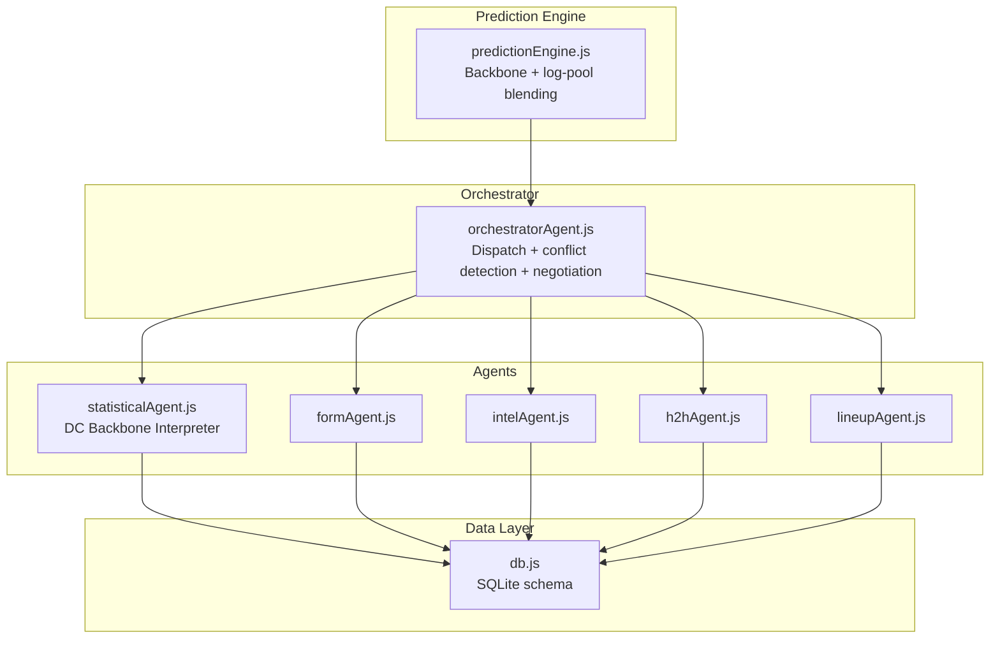
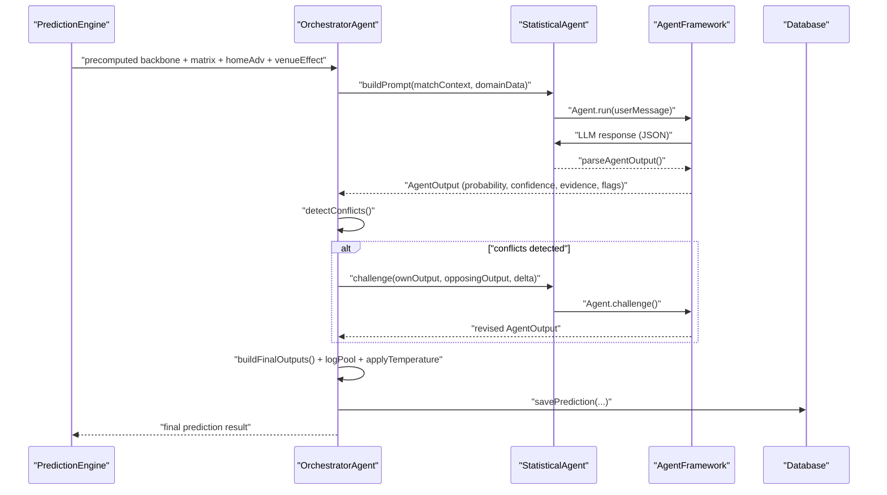
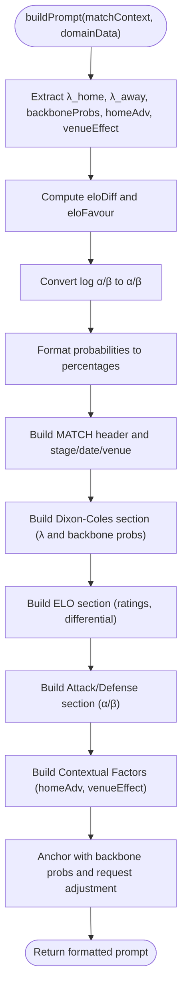
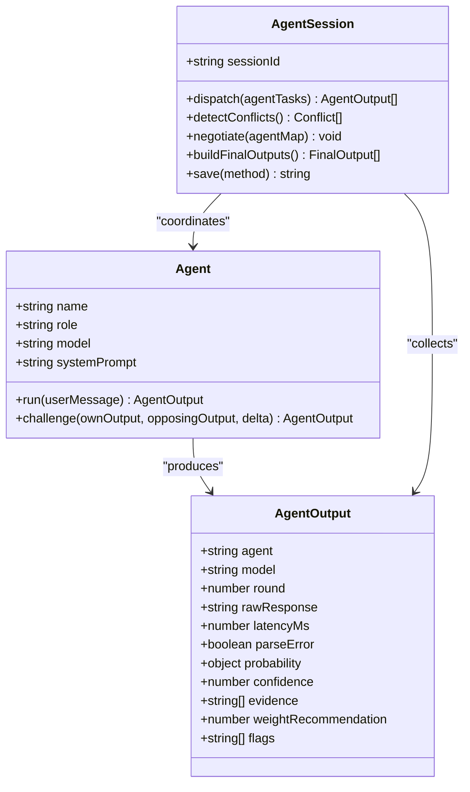
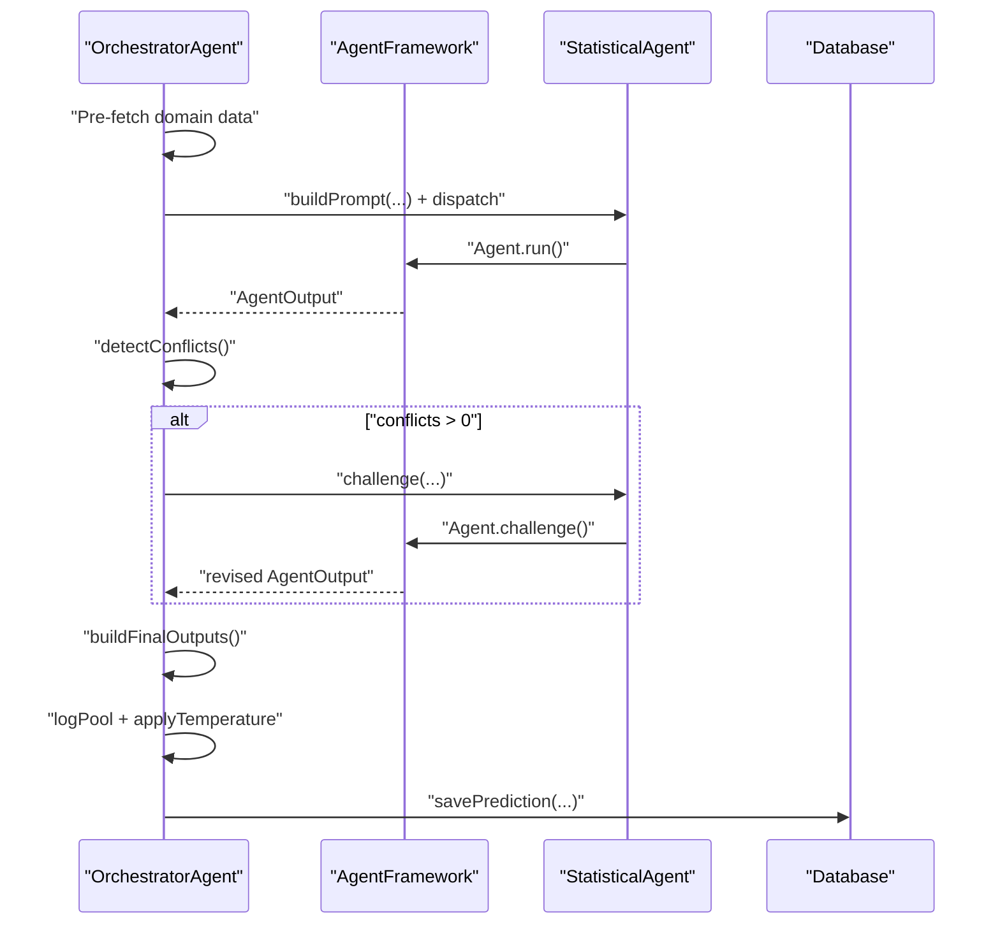
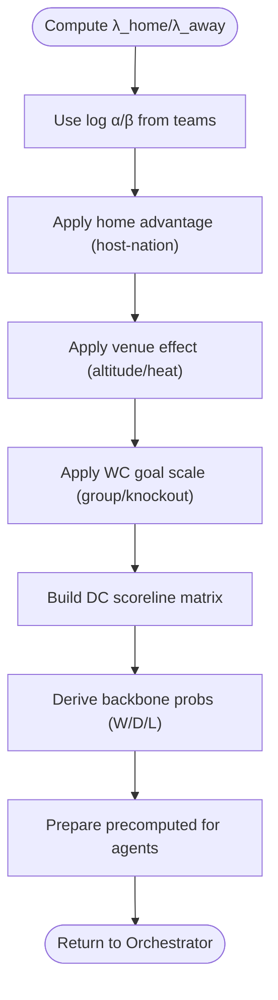
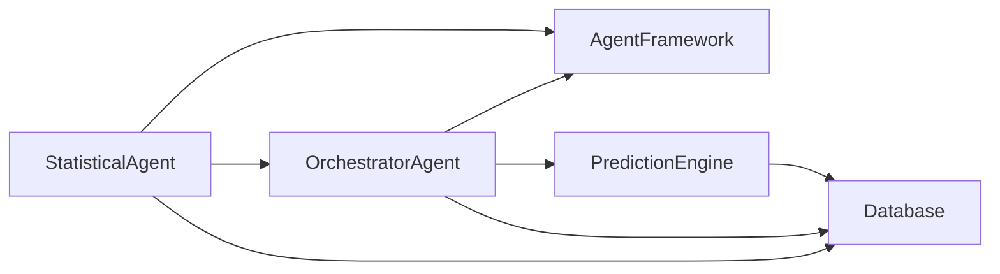

# Statistical Agent

<cite>
**Referenced Files in This Document**
- [statisticalAgent.js](file://backend/services/agents/statisticalAgent.js)
- [orchestratorAgent.js](file://backend/services/agents/orchestratorAgent.js)
- [agentFramework.js](file://backend/services/agents/agentFramework.js)
- [predictionEngine.js](file://backend/services/predictionEngine.js)
- [db.js](file://backend/database/db.js)
- [README.md](file://README.md)
- [SPEC-PREDICT.md](file://specs/SPEC-PREDICT.md)
</cite>

## Table of Contents
1. [Introduction](#introduction)
2. [Project Structure](#project-structure)
3. [Core Components](#core-components)
4. [Architecture Overview](#architecture-overview)
5. [Detailed Component Analysis](#detailed-component-analysis)
6. [Dependency Analysis](#dependency-analysis)
7. [Performance Considerations](#performance-considerations)
8. [Troubleshooting Guide](#troubleshooting-guide)
9. [Conclusion](#conclusion)
10. [Appendices](#appendices)

## Introduction
The Statistical Agent is a specialized multi-agent component that interprets the Dixon-Coles bivariate Poisson model backbone output and contextual factors to produce a natural-language probability assessment. It does not recompute the Poisson model but contextualizes pre-computed λ values, ELO ratings, attack/defense α/β parameters, and venue/home-advantage effects into a coherent statistical narrative. The agent focuses on translating mathematical outputs into clear, actionable reasoning for users and other agents, flagging anomalies and inconsistencies in the underlying model.

## Project Structure
The Statistical Agent resides within the multi-agent prediction system orchestrated by the Orchestrator Agent. The system computes a pure Dixon-Coles backbone (without form/intel goal nudges) and passes the results to the agents for interpretation and debate.

**Diagram sources**
- [predictionEngine.js](file://backend/services/predictionEngine.js)
- [orchestratorAgent.js](file://backend/services/agents/orchestratorAgent.js)
- [statisticalAgent.js](file://backend/services/agents/statisticalAgent.js)
- [agentFramework.js](file://backend/services/agents/agentFramework.js)
- [db.js](file://backend/database/db.js)

**Section sources**
- [README.md](file://README.md)
- [SPEC-PREDICT.md](file://specs/SPEC-PREDICT.md)

## Core Components
- Statistical Agent: Builds a structured prompt from pre-computed Dixon-Coles backbone data and contextual factors, then requests a JSON-formatted probability assessment from the LLM. It enforces strict output schema compliance and flags parsing failures.
- Orchestrator Agent: Coordinates multi-agent inference, dispatching agents in parallel, detecting conflicts, negotiating where needed, and synthesizing results via log-pool blending with temperature scaling.
- Agent Framework: Provides the Agent class, AgentSession orchestration, conflict detection thresholds, and standardized JSON output parsing/validation.
- Prediction Engine: Computes the Dixon-Coles backbone (λ values, ELO ratings, α/β parameters, home advantage, venue effects) and prepares the precomputed data passed to agents.

**Section sources**
- [statisticalAgent.js](file://backend/services/agents/statisticalAgent.js)
- [orchestratorAgent.js](file://backend/services/agents/orchestratorAgent.js)
- [agentFramework.js](file://backend/services/agents/agentFramework.js)
- [predictionEngine.js](file://backend/services/predictionEngine.js)

## Architecture Overview
The Statistical Agent operates as part of a five-agent system. The Orchestrator builds match context and pre-fetched domain data, then dispatches agents in parallel. The Statistical Agent receives the Dixon-Coles backbone output and contextual factors, constructs a prompt, and returns a structured JSON probability assessment. The Orchestrator detects conflicts among agents’ outputs and negotiates where differences exceed a threshold, finally blending outputs via log-pool with temperature scaling.

**Diagram sources**
- [orchestratorAgent.js](file://backend/services/agents/orchestratorAgent.js)
- [statisticalAgent.js](file://backend/services/agents/statisticalAgent.js)
- [agentFramework.js](file://backend/services/agents/agentFramework.js)
- [predictionEngine.js](file://backend/services/predictionEngine.js)

## Detailed Component Analysis

### Statistical Agent: System Prompt and Prompt Building
- System Prompt focus:
  - Expected goals (λ) interpretation: attacking intent and defensive quality.
  - ELO rating gap: historical significance (each 100-point gap ≈ 14% win-probability swing).
  - Attack (α) and defense (β) rating differentials: thresholds for “strong attack” and “leaky defense.”
  - Home advantage and venue effects: host-nation influence and environmental factors.
  - Uncertainty assessment: flagging when the statistical picture is clear-cut or genuinely uncertain.
- Prompt building:
  - Gathers match context (stage, date, venue), backbone λ values, backbone probabilities, home advantage, and venue effect.
  - Computes ELO differential and identifies the team favored by the gap.
  - Converts log α/β to α/β for readability and formats percentages consistently.
  - Emphasizes backbone probabilities as anchors while adjusting for observed factors.

**Diagram sources**
- [statisticalAgent.js](file://backend/services/agents/statisticalAgent.js)

**Section sources**
- [statisticalAgent.js](file://backend/services/agents/statisticalAgent.js)

### Agent Output Schema and Validation
- All agents must respond with a JSON object containing:
  - probability: winHome, draw, winAway (must sum to 1.0)
  - confidence: scalar [0,1]
  - evidence: array of 2–4 concise bullet points
  - weightRecommendation: suggested weight for final blending
  - flags: optional tags (e.g., anomalies)
- The Agent Framework parses and validates outputs, sanitizing malformed JSON and applying fallbacks on parse errors.

**Diagram sources**
- [agentFramework.js](file://backend/services/agents/agentFramework.js)

**Section sources**
- [agentFramework.js](file://backend/services/agents/agentFramework.js)

### Orchestrator Agent: Dispatch, Conflict Detection, and Blending
- Pre-fetches domain data (H2H, form, intel, lineup) in parallel.
- Builds agent tasks, including the always-active Statistical Agent.
- Dispatches agents in parallel, detects conflicts (Δ ≥ 20%), negotiates where needed, and builds final outputs.
- Synthesizes results via log-pool blending with temperature scaling and derives top scorelines and expected goals.

**Diagram sources**
- [orchestratorAgent.js](file://backend/services/agents/orchestratorAgent.js)
- [agentFramework.js](file://backend/services/agents/agentFramework.js)
- [statisticalAgent.js](file://backend/services/agents/statisticalAgent.js)

**Section sources**
- [orchestratorAgent.js](file://backend/services/agents/orchestratorAgent.js)

### Prediction Engine: Dixon-Coles Backbone and Venue Effects
- Computes λ_home and λ_away from log α/β parameters, home advantage, and venue effects.
- Builds the Dixon-Coles scoreline matrix with low-score correction and derives backbone probabilities.
- Applies WC phase-specific goal scaling and temperature calibration for final output.
- Provides venue effect computation (altitude and heat indices) and host-nation home advantage logic.

**Diagram sources**
- [predictionEngine.js](file://backend/services/predictionEngine.js)

**Section sources**
- [predictionEngine.js](file://backend/services/predictionEngine.js)

## Dependency Analysis
- Statistical Agent depends on:
  - Agent Framework for LLM orchestration and output parsing.
  - Orchestrator Agent for assembling match context and dispatching the agent.
  - Database for model configuration (temperature, DC ρ) and persistence of agent sessions and predictions.
- Orchestrator Agent depends on:
  - Agent Framework for conflict detection and negotiation.
  - Specialist agents (Statistical, Form, H2H, Intel, Lineup) for domain-specific reasoning.
  - Prediction Engine for precomputed backbone data.
- Prediction Engine depends on:
  - Team and match data, venue condition tables, and model configuration.

**Diagram sources**
- [statisticalAgent.js](file://backend/services/agents/statisticalAgent.js)
- [agentFramework.js](file://backend/services/agents/agentFramework.js)
- [orchestratorAgent.js](file://backend/services/agents/orchestratorAgent.js)
- [predictionEngine.js](file://backend/services/predictionEngine.js)
- [db.js](file://backend/database/db.js)

**Section sources**
- [statisticalAgent.js](file://backend/services/agents/statisticalAgent.js)
- [agentFramework.js](file://backend/services/agents/agentFramework.js)
- [orchestratorAgent.js](file://backend/services/agents/orchestratorAgent.js)
- [predictionEngine.js](file://backend/services/predictionEngine.js)
- [db.js](file://backend/database/db.js)

## Performance Considerations
- Multi-agent inference scales linearly with the number of active agents; the Statistical Agent is always active, while others may be skipped based on data availability.
- JSON parsing and LLM retries are handled robustly; ensure prompts are concise to minimize latency.
- Temperature scaling and log-pool blending preserve confidence and reduce overfitting to any single signal.
- Venue effect computation and host-nation logic are lightweight and cached via precomputation.

[No sources needed since this section provides general guidance]

## Troubleshooting Guide
- JSON parsing failures: The Agent Framework sanitizes common LLM mistakes and applies fallbacks; check raw responses and evidence arrays for malformed JSON.
- Agent session persistence: Verify agent sessions and messages are saved; inspect conflict resolutions and synthesis method.
- Database connectivity: Ensure SQLite WAL mode and foreign keys are enabled; stale locks are removed automatically.
- Multi-agent disabled: When USE_MULTI_AGENT is false, the system falls back to a single-model approach without agent negotiation.

**Section sources**
- [agentFramework.js](file://backend/services/agents/agentFramework.js)
- [db.js](file://backend/database/db.js)
- [README.md](file://README.md)

## Conclusion
The Statistical Agent plays a crucial role as the backbone interpreter in the multi-agent system. By translating Dixon-Coles λ values, ELO ratings, α/β parameters, and venue/home-advantage effects into natural language, it provides statistical reasoning that complements other agents’ domain-specific insights. Its strict adherence to the output schema ensures reliable downstream blending and negotiation, while the Orchestrator coordinates the entire inference pipeline for robust, interpretable predictions.

[No sources needed since this section summarizes without analyzing specific files]

## Appendices

### Input Data Formats
- Match context: includes match identifiers, stage, scheduled date, venue, and team attributes (ELO, FIFA rank, log α/β).
- Domain data for Statistical Agent:
  - λ_home, λ_away: expected goals from Dixon-Coles backbone.
  - backboneProbs: { winHome, draw, winAway } from the scoreline matrix.
  - homeAdv: { side, logHA } indicating host-nation advantage direction and magnitude.
  - venueEffect: { lambdaScale, description } capturing altitude and heat impacts.

**Section sources**
- [statisticalAgent.js](file://backend/services/agents/statisticalAgent.js)
- [predictionEngine.js](file://backend/services/predictionEngine.js)

### Output Probability Assessment
- Natural-language probability assessment anchored to backbone probabilities, with adjustments for observed factors.
- Confidence and evidence arrays guide downstream synthesis and transparency.
- Flags can indicate anomalies (e.g., parsing errors, extreme λ values, large ELO gaps).

**Section sources**
- [statisticalAgent.js](file://backend/services/agents/statisticalAgent.js)
- [agentFramework.js](file://backend/services/agents/agentFramework.js)