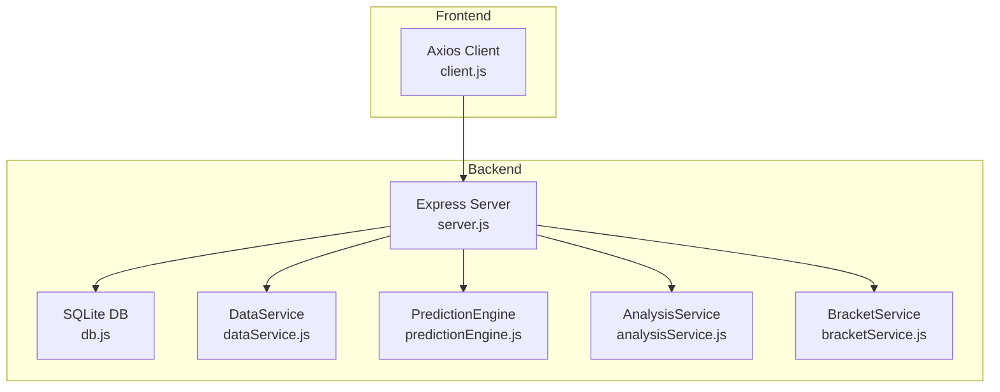
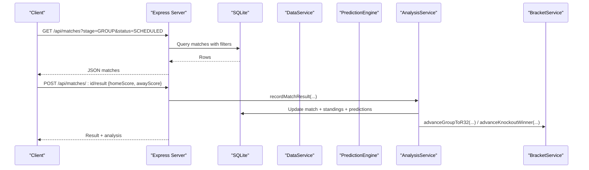
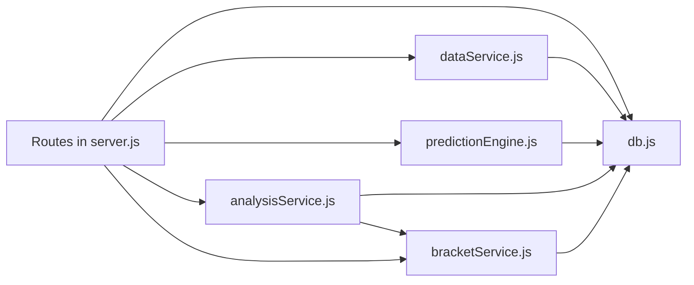

# API Reference

<cite>
**Referenced Files in This Document**
- [server.js](file://backend/server.js)
- [db.js](file://backend/database/db.js)
- [dataService.js](file://backend/services/dataService.js)
- [predictionEngine.js](file://backend/services/predictionEngine.js)
- [analysisService.js](file://backend/services/analysisService.js)
- [bracketService.js](file://backend/services/bracketService.js)
- [client.js](file://frontend/src/api/client.js)
- [README.md](file://README.md)
</cite>

## Table of Contents
1. [Introduction](#introduction)
2. [Project Structure](#project-structure)
3. [Core Components](#core-components)
4. [Architecture Overview](#architecture-overview)
5. [Detailed Component Analysis](#detailed-component-analysis)
6. [Dependency Analysis](#dependency-analysis)
7. [Performance Considerations](#performance-considerations)
8. [Troubleshooting Guide](#troubleshooting-guide)
9. [Conclusion](#conclusion)
10. [Appendices](#appendices)

## Introduction
This document provides comprehensive API documentation for the backend endpoints powering the World Cup 2026 prediction application. It covers HTTP methods, URL patterns, request/response schemas, authentication requirements, query parameters, filtering, pagination, error handling, rate limiting, and integration patterns. It also documents data service integrations, external API wrappers, and real-time synchronization mechanisms.

## Project Structure
The backend is an Express server exposing REST endpoints under /api. It integrates SQLite for persistence, a prediction engine, and several specialized services for data ingestion, analytics, and bracket simulation. The frontend consumes these endpoints via a thin Axios client.

**Diagram sources**
- [server.js:18-680](file://backend/server.js#L18-L680)
- [db.js:1-252](file://backend/database/db.js#L1-L252)
- [dataService.js:1-583](file://backend/services/dataService.js#L1-L583)
- [predictionEngine.js:1-1020](file://backend/services/predictionEngine.js#L1-L1020)
- [analysisService.js:1-422](file://backend/services/analysisService.js#L1-L422)
- [bracketService.js:1-1080](file://backend/services/bracketService.js#L1-L1080)
- [client.js:1-50](file://frontend/src/api/client.js#L1-L50)

**Section sources**
- [server.js:18-680](file://backend/server.js#L18-L680)
- [db.js:1-252](file://backend/database/db.js#L1-L252)
- [README.md:153-209](file://README.md#L153-L209)

## Core Components
- Express server initializes CORS, JSON body parsing, and registers all routes.
- SQLite database provides schema for teams, matches, predictions, model performance, and agent sessions.
- Services encapsulate:
  - Data ingestion and caching from external APIs and web scraping.
  - Prediction computation and multi-agent orchestration.
  - Post-match analysis, ELO updates, and group/knockout advancement.
  - Bracket simulation and Monte Carlo winner probabilities.
- Frontend client wraps API calls with typed helpers.

**Section sources**
- [server.js:18-680](file://backend/server.js#L18-L680)
- [db.js:23-252](file://backend/database/db.js#L23-L252)
- [dataService.js:1-583](file://backend/services/dataService.js#L1-L583)
- [predictionEngine.js:1-1020](file://backend/services/predictionEngine.js#L1-L1020)
- [analysisService.js:1-422](file://backend/services/analysisService.js#L1-L422)
- [bracketService.js:1-1080](file://backend/services/bracketService.js#L1-L1080)
- [client.js:1-50](file://frontend/src/api/client.js#L1-L50)

## Architecture Overview
The API exposes public endpoints for teams, matches, groups, tournament bracket, predictions, suspensions, analytics, and synchronization. Requests flow through Express middleware, query the database, and invoke services for data fetching and computation. Responses are JSON-formatted.

**Diagram sources**
- [server.js:110-302](file://backend/server.js#L110-L302)
- [analysisService.js:76-218](file://backend/services/analysisService.js#L76-L218)
- [bracketService.js:199-364](file://backend/services/bracketService.js#L199-L364)

## Detailed Component Analysis

### Authentication and Security
- Authentication: None. All endpoints are public.
- CORS: Enabled with origin configurable via FRONTEND_URL environment variable.
- Rate limiting: Not implemented at the API level. External rate limits apply for upstream providers (e.g., football-data.org free tier).
- Security considerations:
  - Validate and sanitize inputs on write endpoints (e.g., result submission).
  - Prefer HTTPS in production deployments.
  - Restrict sensitive environment variables (e.g., API keys) to backend only.

**Section sources**
- [server.js:21](file://backend/server.js#L21)
- [README.md:139-151](file://README.md#L139-L151)

### Teams Endpoints
- GET /api/teams
  - Purpose: Retrieve all teams ordered by group and performance metrics.
  - Response: Array of team objects with group standings fields.
  - Filtering: None.
  - Pagination: Not applicable.
  - Example request: GET /api/teams
  - Example response: [team, team, ...]

- GET /api/teams/:id
  - Purpose: Retrieve a specific team and related data (matches, ELO history, group teammates).
  - Path parameters:
    - id: Team identifier (3-letter code).
  - Response: Object containing team, matches, eloHistory, groupTeams.
  - Error: 404 if team not found.
  - Example request: GET /api/teams/ARG
  - Example response: { team, matches, eloHistory, groupTeams }

**Section sources**
- [server.js:25-75](file://backend/server.js#L25-L75)

### Matches Endpoints
- GET /api/matches
  - Purpose: Retrieve matches with optional filters and join prediction/model performance data.
  - Query parameters:
    - stage: Match stage (GROUP, R32, R16, QF, SF, F, THIRD_PLACE).
    - status: Match status (SCHEDULED, LIVE, COMPLETED).
    - date: Exact match date (YYYY-MM-DD).
    - group: Group code (single letter A–L).
  - Response: Array of match objects with joined team names, flags, ELO, and prediction fields.
  - Filtering: All parameters are optional and combined with AND logic.
  - Pagination: Not applicable.
  - Example request: GET /api/matches?stage=GROUP&status=SCHEDULED&group=A
  - Example response: [match, match, ...]

- GET /api/matches/today
  - Purpose: Retrieve matches scheduled for today.
  - Response: Array of match objects with prediction data.
  - Example request: GET /api/matches/today
  - Example response: [match, ...]

- GET /api/matches/upcoming
  - Purpose: Retrieve the next 4 calendar days (starting from the first future date with matches).
  - Response: Object with dates array of { date, matches }.
  - Example request: GET /api/matches/upcoming
  - Example response: { dates: [ { date, matches }, ... ] }

- GET /api/matches/upset-watch
  - Purpose: Retrieve top 10 matches where the favorite has <45% win probability and ELO difference ≥50.
  - Response: Array of matches enriched with favorite/underdog metadata and upset probability.
  - Example request: GET /api/matches/upset-watch
  - Example response: [match, ...]

- GET /api/matches/:id
  - Purpose: Retrieve a specific match with team names and basic stats.
  - Path parameters:
    - id: Match identifier (e.g., R32-01).
  - Response: Match object.
  - Error: 404 if not found.
  - Example request: GET /api/matches/R32-01
  - Example response: match

- POST /api/matches/:id/result
  - Purpose: Record match result and trigger post-match analysis, standings updates, and bracket advancement.
  - Path parameters:
    - id: Match identifier.
  - Request body:
    - homeScore: Integer.
    - awayScore: Integer.
    - homePens: Optional integer (penalty shootout home score).
    - awayPens: Optional integer (penalty shootout away score).
  - Response: Result object including analysis and winner.
  - Validation: Returns 400 for invalid numeric inputs.
  - Example request: POST /api/matches/R32-01/result { homeScore: 2, awayScore: 1 }
  - Example response: { matchId, result, analysis }

- GET /api/matches/:id/lineup
  - Purpose: Fetch confirmed lineup data for a match.
  - Path parameters:
    - id: Match identifier.
  - Response: Lineup object.
  - Error: 500 on failure.
  - Example request: GET /api/matches/R32-01/lineup
  - Example response: lineup

- GET /api/h2h/:teamA/:teamB
  - Purpose: Retrieve head-to-head statistics for two teams.
  - Path parameters:
    - teamA, teamB: Team identifiers.
  - Response: H2H data array.
  - Error: 500 on failure.
  - Example request: GET /api/h2h/ARG/BRA
  - Example response: [h2h, ...]

**Section sources**
- [server.js:110-322](file://backend/server.js#L110-L322)
- [analysisService.js:76-218](file://backend/services/analysisService.js#L76-L218)
- [dataService.js:495-580](file://backend/services/dataService.js#L495-L580)

### Predictions Endpoints
- GET /api/matches/:id/prediction
  - Purpose: Retrieve the latest prediction for a match.
  - Path parameters:
    - id: Match identifier.
  - Query parameters:
    - refresh: Boolean (force regeneration).
    - lang: String (e.g., zh for translated insight).
  - Response: Prediction object including probabilities, top scores, confidence, factors, and insight.
  - Example request: GET /api/matches/R32-01/prediction?refresh=true&lang=zh
  - Example response: prediction

- GET /api/matches/:id/agent-session
  - Purpose: Retrieve the multi-agent session logs for the latest prediction run.
  - Path parameters:
    - id: Match identifier.
  - Response: Object indicating availability and session details (messages, conflicts).
  - Example request: GET /api/matches/R32-01/agent-session
  - Example response: { available, session, messages, conflicts }

- GET /api/matches/:id/predictions
  - Purpose: Retrieve prediction history for a match.
  - Path parameters:
    - id: Match identifier.
  - Response: Array of prediction records.
  - Example request: GET /api/matches/R32-01/predictions
  - Example response: [prediction, ...]

- POST /api/predictions/generate-all
  - Purpose: Generate predictions for all scheduled matches in the earliest active stage, respecting a cooldown.
  - Response: Object with generated count, stage, and results array.
  - Example request: POST /api/predictions/generate-all
  - Example response: { generated, stage, results }

**Section sources**
- [server.js:325-461](file://backend/server.js#L325-L461)
- [predictionEngine.js:665-800](file://backend/services/predictionEngine.js#L665-L800)

### Groups Endpoints
- GET /api/groups
  - Purpose: Retrieve group standings for all 12 groups.
  - Response: Object keyed by group code with teams and matches.
  - Example request: GET /api/groups
  - Example response: { A: { teams, matches }, B: { teams, matches }, ... }

- GET /api/groups/:group
  - Purpose: Retrieve standings for a specific group.
  - Path parameters:
    - group: Group code (A–L).
  - Response: Standings object.
  - Error: 400 for invalid group code.
  - Example request: GET /api/groups/A
  - Example response: { teams, matches }

- GET /api/groups/:group/scenarios
  - Purpose: Retrieve qualification scenarios for a group.
  - Path parameters:
    - group: Group code (A–L).
  - Response: Scenario data.
  - Error: 500 on failure.
  - Example request: GET /api/groups/A/scenarios
  - Example response: scenarios

**Section sources**
- [server.js:77-107](file://backend/server.js#L77-L107)
- [bracketService.js:190-207](file://backend/services/bracketService.js#L190-L207)

### Tournament Endpoints
- GET /api/tournament/bracket
  - Purpose: Retrieve all knockout-stage matches with predictions.
  - Response: Array of knockout matches with team names and prediction data.
  - Example request: GET /api/tournament/bracket
  - Example response: [match, ...]

- GET /api/tournament/winner-probabilities
  - Purpose: Monte Carlo simulation of tournament winners.
  - Response: Object with simCount and probabilities.
  - Example request: GET /api/tournament/winner-probabilities
  - Example response: { simCount, probabilities }

- GET /api/tournament/road-to-final
  - Purpose: Retrieve predicted/actual snapshots per round.
  - Response: Road-to-Final data.
  - Error: 500 on failure.
  - Example request: GET /api/tournament/road-to-final
  - Example response: roadToFinal

- POST /api/tournament/simulate-knockout
  - Purpose: Run a full knockout bracket simulation.
  - Response: Simulation results including group placements, bracket, and champion.
  - Example request: POST /api/tournament/simulate-knockout
  - Example response: { groupStandings, best8ThirdPlace, r32Pairings, bracket, champion }

**Section sources**
- [server.js:463-512](file://backend/server.js#L463-L512)
- [bracketService.js:485-704](file://backend/services/bracketService.js#L485-L704)

### Suspensions Endpoints
- GET /api/suspensions
  - Purpose: Retrieve all suspensions.
  - Response: Array of suspension records.
  - Example request: GET /api/suspensions
  - Example response: [suspension, ...]

- GET /api/matches/:id/suspensions
  - Purpose: Retrieve suspensions for a specific match.
  - Path parameters:
    - id: Match identifier.
  - Response: Array of suspension records.
  - Example request: GET /api/matches/R32-01/suspensions
  - Example response: [suspension, ...]

- GET /api/teams/:id/suspensions
  - Purpose: Retrieve suspensions for a specific team.
  - Path parameters:
    - id: Team identifier.
  - Response: Array of suspension records.
  - Example request: GET /api/teams/ARG/suspensions
  - Example response: [suspension, ...]

**Section sources**
- [server.js:514-525](file://backend/server.js#L514-L525)

### Analytics Endpoints
- GET /api/analytics/accuracy
  - Purpose: Retrieve model accuracy statistics (overall, by stage, by confidence).
  - Response: Object with stats, byStage, byConfidence, recent10, currentWeights.
  - Example request: GET /api/analytics/accuracy
  - Example response: { stats, byStage, byConfidence, recent10, currentWeights }

- GET /api/analytics/model-weights
  - Purpose: Retrieve current model configuration weights.
  - Response: Array of model_config entries.
  - Example request: GET /api/analytics/model-weights
  - Example response: [weight, ...]

- GET /api/analytics/agent-performance
  - Purpose: Retrieve multi-agent performance overview (summary, byAgent, recentConflicts).
  - Response: Object with summary, byAgent, recentConflicts.
  - Example request: GET /api/analytics/agent-performance
  - Example response: { summary, byAgent, recentConflicts }

**Section sources**
- [server.js:527-570](file://backend/server.js#L527-L570)
- [analysisService.js:321-384](file://backend/services/analysisService.js#L321-L384)

### Sync Endpoint
- POST /api/sync
  - Purpose: Trigger live results synchronization from external API.
  - Response: Object with updated match IDs and count.
  - Example request: POST /api/sync
  - Example response: { updated, count }

**Section sources**
- [server.js:573-582](file://backend/server.js#L573-L582)
- [dataService.js:495-580](file://backend/services/dataService.js#L495-L580)

### Data Service Integration Endpoints
- External API wrappers:
  - Football-data.org API client configured with X-Auth-Token header.
  - Web scraping for team form and injuries via Cheerio.
  - Qwen LLM integration for structured intel parsing and insights.
- Caching:
  - Web intel cache with TTLs for form, H2H, and intel.
- Live sync:
  - Cron job runs every 5 minutes during tournament to update match statuses and results.

**Section sources**
- [dataService.js:18-28](file://backend/services/dataService.js#L18-L28)
- [dataService.js:30-41](file://backend/services/dataService.js#L30-L41)
- [dataService.js:495-580](file://backend/services/dataService.js#L495-L580)
- [server.js:585-631](file://backend/server.js#L585-L631)

### Real-Time Data Synchronization
- Live results sync:
  - POST /api/sync triggers syncLiveResults().
  - Updates match status to LIVE/COMPLETED and records scores.
  - Triggers post-match analysis and bracket advancement.
- Prediction cron:
  - Hourly prediction regeneration for next 3 match days.
  - Respects SGT timezone and stops after WC end date.

**Section sources**
- [server.js:573-582](file://backend/server.js#L573-L582)
- [dataService.js:495-580](file://backend/services/dataService.js#L495-L580)
- [server.js:596-631](file://backend/server.js#L596-L631)

### Request/Response Schemas
- Teams
  - Team object: id, name, flag, group_code, fifa_rank, fifa_points, elo, avg_scored, avg_conceded, wc_appearances, last_wc_round, gs_* fields, updated_at.
  - Team detail response: { team, matches, eloHistory, groupTeams }.

- Matches
  - Match object: id, stage, group_code, match_number, home_team, away_team, scheduled_date, scheduled_time, venue, status, home_score, away_score, home_score_pens, away_score_pens, winner, created_at, completed_at.
  - Matches response: Array of match objects with joined team names, flags, ELO, and prediction fields.

- Predictions
  - Prediction object: id, match_id, generated_at, prob_home, prob_draw, prob_away, expected_score_home, expected_score_away, most_likely_score, top_scores, confidence, factors, web_intel, insight, methodology, actual_outcome, was_correct, brier_score, upset, agent_session_id, lambda_home, lambda_away.

- Analytics
  - Accuracy stats: { stats, byStage, byConfidence, recent10, currentWeights }.
  - Model weights: Array of { key, value, description }.

- Suspensions
  - Suspension object: id, team_id, player_name, reason, yellow_cards, suspended_for_match_id, source, notes, created_at, updated_at.

**Section sources**
- [db.js:26-145](file://backend/database/db.js#L26-L145)
- [db.js:160-207](file://backend/database/db.js#L160-L207)
- [analysisService.js:321-384](file://backend/services/analysisService.js#L321-L384)

### Error Handling and Status Codes
- 400 Bad Request: Invalid group code, invalid numeric inputs for result submission.
- 404 Not Found: Team or match not found.
- 500 Internal Server Error: Service failures (e.g., external API errors, prediction engine exceptions).
- Successful responses: 200 OK with JSON payload.

**Section sources**
- [server.js:89-91](file://backend/server.js#L89-L91)
- [server.js:285-293](file://backend/server.js#L285-L293)
- [analysisService.js:76-94](file://backend/services/analysisService.js#L76-L94)

### Rate Limiting
- External provider limits:
  - football-data.org free tier: 10 requests per minute.
- Internal API: No built-in rate limiting. Consider adding throttling or caching for high-frequency endpoints.

**Section sources**
- [README.md:145](file://README.md#L145)

### Practical Usage Examples
- Fetch today’s matches:
  - GET /api/matches/today
- Filter matches by stage and status:
  - GET /api/matches?stage=GROUP&status=SCHEDULED
- Submit match result:
  - POST /api/matches/R32-01/result { homeScore: 2, awayScore: 1 }
- Generate predictions for all scheduled matches:
  - POST /api/predictions/generate-all
- Retrieve agent session logs:
  - GET /api/matches/R32-01/agent-session

**Section sources**
- [client.js:9-49](file://frontend/src/api/client.js#L9-L49)
- [server.js:110-461](file://backend/server.js#L110-L461)

### Client Implementation Guidelines
- Use the frontend client module for consistent base URL and timeouts.
- Apply client-side caching for repeated reads of static data (teams, groups).
- For batch operations (generate-all), increase timeout as indicated by the client.
- Handle optional fields gracefully (e.g., top_scores, web_intel).

**Section sources**
- [client.js:1-50](file://frontend/src/api/client.js#L1-L50)

### Integration Patterns
- Real-time updates:
  - Poll /api/sync periodically or rely on cron-triggered sync.
  - Listen for IndexNow notifications after result submissions.
- Prediction refresh:
  - Use refresh=true query param to bypass cache.
- Multi-agent diagnostics:
  - Use /api/matches/:id/agent-session to inspect agent reasoning and conflicts.

**Section sources**
- [server.js:295-299](file://backend/server.js#L295-L299)
- [server.js:573-582](file://backend/server.js#L573-L582)
- [server.js:344-382](file://backend/server.js#L344-L382)

## Dependency Analysis
The API routes depend on services and database modules. Services encapsulate business logic and integrate with external systems.

**Diagram sources**
- [server.js:18-680](file://backend/server.js#L18-L680)
- [db.js:1-252](file://backend/database/db.js#L1-252)
- [dataService.js:1-583](file://backend/services/dataService.js#L1-L583)
- [predictionEngine.js:1-1020](file://backend/services/predictionEngine.js#L1-L1020)
- [analysisService.js:1-422](file://backend/services/analysisService.js#L1-L422)
- [bracketService.js:1-1080](file://backend/services/bracketService.js#L1-L1080)

**Section sources**
- [server.js:18-680](file://backend/server.js#L18-L680)

## Performance Considerations
- Caching:
  - Web intel cache with TTLs reduces external API calls.
  - Predictions are cached until forced refresh or live match status.
- Query optimization:
  - Use indexed joins and selective projections in SQL queries.
  - Avoid N+1 queries by batching lookups where possible.
- Concurrency:
  - SQLite WAL mode improves concurrency; consider connection pooling for high load.
- External dependencies:
  - Monitor football-data.org rate limits and implement backoff/retry.
- Prediction generation:
  - Cooldown prevents excessive recomputation; batch generation targets earliest active stage.

**Section sources**
- [dataService.js:30-41](file://backend/services/dataService.js#L30-L41)
- [server.js:428-451](file://backend/server.js#L428-L451)

## Troubleshooting Guide
- CORS errors:
  - Ensure FRONTEND_URL matches the origin of the client.
- Missing predictions:
  - Verify match status and scheduled date; ensure predictions were generated for the stage.
- Live sync not updating:
  - Confirm FOOTBALL_DATA_API_KEY is set; check cron logs for failures.
- Multi-agent session not available:
  - Ensure USE_MULTI_AGENT is enabled and predictions were generated with multi-agent.
- Result submission fails:
  - Validate numeric inputs and ensure match exists.

**Section sources**
- [server.js:21](file://backend/server.js#L21)
- [README.md:139-151](file://README.md#L139-L151)
- [server.js:285-293](file://backend/server.js#L285-L293)

## Conclusion
The API provides a comprehensive set of endpoints for teams, matches, groups, predictions, analytics, and tournament bracket management. It integrates external data sources, caches results, and supports real-time synchronization. Clients should leverage caching, handle errors gracefully, and respect external provider rate limits.

## Appendices

### CORS Configuration
- Origin controlled by FRONTEND_URL environment variable.
- Default development origin is http://localhost:6001.

**Section sources**
- [server.js:21](file://backend/server.js#L21)
- [README.md:148](file://README.md#L148)

### Environment Variables
- FOOTBALL_DATA_API_KEY: Optional; enables live scores and form data.
- DASHSCOPE_API_KEY: Required for Qwen LLM calls.
- USE_MULTI_AGENT: Enable/disable multi-agent predictions.
- FRONTEND_URL: CORS origin.
- PORT: Backend port.

**Section sources**
- [README.md:139-151](file://README.md#L139-L151)