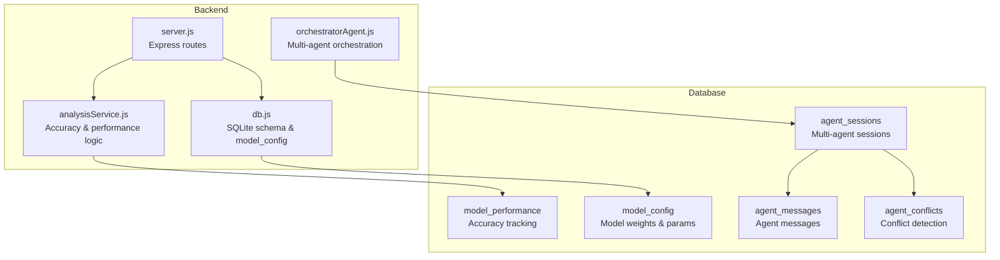
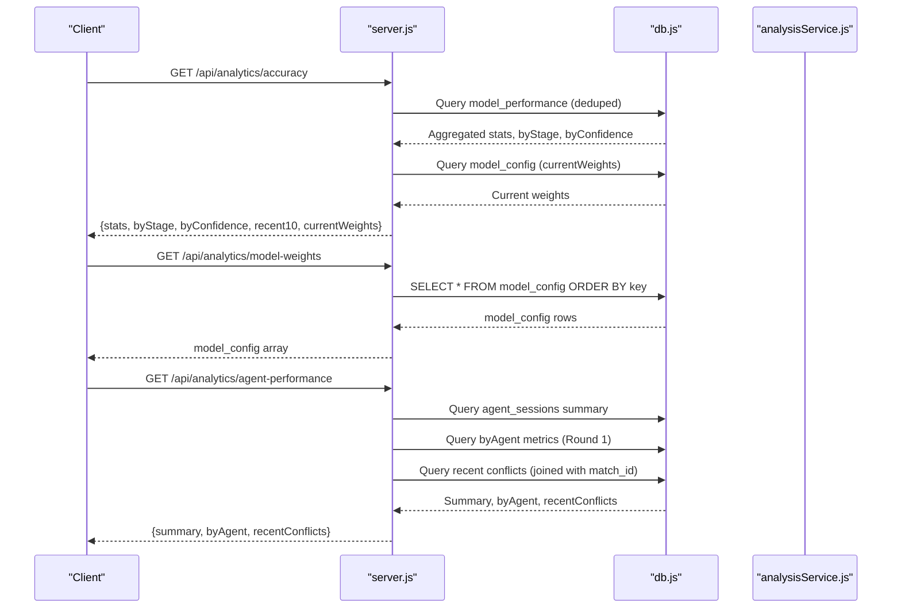
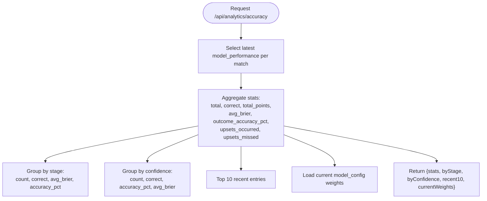
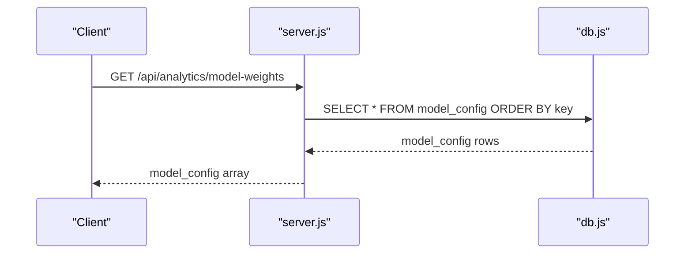
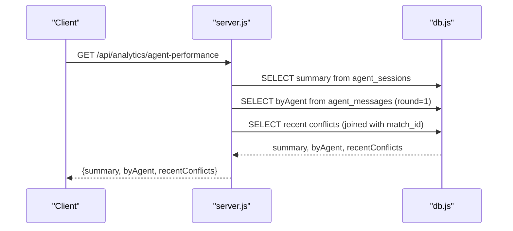
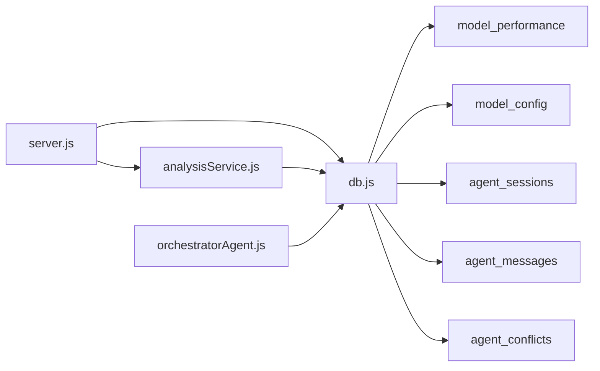

# Analytics & Performance API

<cite>
**Referenced Files in This Document**
- [server.js](file://backend/server.js)
- [analysisService.js](file://backend/services/analysisService.js)
- [db.js](file://backend/database/db.js)
- [SPEC-PREDICT.md](file://specs/SPEC-PREDICT.md)
- [README.md](file://README.md)
- [orchestratorAgent.js](file://backend/services/agents/orchestratorAgent.js)
</cite>

## Table of Contents
1. [Introduction](#introduction)
2. [Project Structure](#project-structure)
3. [Core Components](#core-components)
4. [Architecture Overview](#architecture-overview)
5. [Detailed Component Analysis](#detailed-component-analysis)
6. [Dependency Analysis](#dependency-analysis)
7. [Performance Considerations](#performance-considerations)
8. [Troubleshooting Guide](#troubleshooting-guide)
9. [Conclusion](#conclusion)

## Introduction
This document provides comprehensive API documentation for the analytics endpoints that power model performance monitoring, prediction model configuration, and multi-agent system analysis. The analytics endpoints enable stakeholders to track model accuracy, inspect current model weights, and monitor multi-agent performance across the tournament lifecycle.

The analytics endpoints are part of a larger prediction system that combines deterministic models (Dixon-Coles Poisson) with probabilistic multi-agent reasoning. The system tracks outcomes, computes accuracy metrics, maintains model weights, and logs multi-agent sessions with conflict detection and resolution.

## Project Structure
The analytics endpoints are implemented in the backend server and rely on services and database schemas that persist model performance, configuration, and multi-agent session data.

**Diagram sources**
- [server.js:527-570](file://backend/server.js#L527-L570)
- [analysisService.js:321-384](file://backend/services/analysisService.js#L321-L384)
- [db.js:96-208](file://backend/database/db.js#L96-L208)
- [orchestratorAgent.js:290-470](file://backend/services/agents/orchestratorAgent.js#L290-L470)

**Section sources**
- [server.js:527-570](file://backend/server.js#L527-L570)
- [db.js:96-208](file://backend/database/db.js#L96-L208)

## Core Components
This section documents the three analytics endpoints and their underlying data sources and calculations.

- GET /api/analytics/accuracy
  - Purpose: Returns comprehensive model accuracy statistics, including overall correctness, Brier score averages, stage-wise accuracy, confidence-based accuracy, recent performance, and current model weights.
  - Data source: model_performance table (deduplicated to latest record per match) and model_config for current weights.
  - Calculation highlights:
    - Outcome accuracy percentage: ratio of correct outcomes to total predictions.
    - Accuracy percentage (points-based): ratio of accumulated points to maximum possible points.
    - Average Brier score: mean calibration error across predictions.
    - Upsets occurred and upsets missed: counts derived from prediction outcomes.
  - Response structure includes:
    - stats: overall metrics
    - byStage: stage-wise accuracy
    - byConfidence: accuracy segmented by prediction confidence buckets
    - recent10: last 10 model_performance entries
    - currentWeights: active model_config entries

- GET /api/analytics/model-weights
  - Purpose: Returns the current model configuration weights and parameters used by the prediction engine.
  - Data source: model_config table ordered by key.
  - Typical weights include ELO, Poisson, form, H2H, web intelligence, World Cup experience, lineup strength, host advantage, and rest days factors, plus model parameters like K-factor and global average goals.

- GET /api/analytics/agent-performance
  - Purpose: Provides an overview of multi-agent system performance, including session summaries, agent-level metrics, and recent conflicts.
  - Data sources: agent_sessions, agent_messages, agent_conflicts tables.
  - Metrics include:
    - Total sessions, total conflicts detected/resolved, average wall time, average rounds, sessions with conflicts.
    - By-agent metrics: message count, average confidence, average latency for Round 1.
    - Recent conflicts: conflict details with match linkage.

**Section sources**
- [server.js:527-570](file://backend/server.js#L527-L570)
- [analysisService.js:321-384](file://backend/services/analysisService.js#L321-L384)
- [db.js:96-208](file://backend/database/db.js#L96-L208)

## Architecture Overview
The analytics endpoints integrate with the broader prediction pipeline. Accuracy metrics are derived from post-match analysis stored in model_performance. Model weights are persisted in model_config and influence prediction generation. Multi-agent performance is tracked through dedicated agent_sessions, agent_messages, and agent_conflicts tables.

**Diagram sources**
- [server.js:527-570](file://backend/server.js#L527-L570)
- [analysisService.js:321-384](file://backend/services/analysisService.js#L321-L384)
- [db.js:96-208](file://backend/database/db.js#L96-L208)

## Detailed Component Analysis

### Accuracy Endpoint: GET /api/analytics/accuracy
- Data source: model_performance (latest record per match) and model_config.
- Deduplication strategy: Uses a subquery to select the maximum id per match to avoid double-counting regrades.
- Metrics computed:
  - Total predictions, correct outcomes, total points, maximum possible points.
  - Outcome accuracy percentage and points-based accuracy percentage.
  - Average Brier score across predictions.
  - Upsets occurred and upsets missed.
  - Stage-wise accuracy and confidence-based accuracy.
  - Recent 10 model_performance entries for trend inspection.
  - Current model weights for interpretability.

**Diagram sources**
- [analysisService.js:321-384](file://backend/services/analysisService.js#L321-L384)

**Section sources**
- [analysisService.js:321-384](file://backend/services/analysisService.js#L321-L384)
- [SPEC-PREDICT.md:135-136](file://specs/SPEC-PREDICT.md#L135-L136)

### Model Weights Endpoint: GET /api/analytics/model-weights
- Data source: model_config table.
- Behavior: Returns all rows ordered by key, enabling inspection of current weights and parameters.
- Typical keys include:
  - Weight keys prefixed with w_ (e.g., w_elo, w_poisson, w_form, w_h2h, w_intel, w_wc_exp, w_lineup, w_host, w_rest).
  - Model parameters (e.g., elo_k_factor, global_avg_goals).
  - Feature flags (e.g., use_multi_agent).

**Diagram sources**
- [server.js:532-536](file://backend/server.js#L532-L536)
- [db.js:159-166](file://backend/database/db.js#L159-L166)

**Section sources**
- [server.js:532-536](file://backend/server.js#L532-L536)
- [db.js:159-166](file://backend/database/db.js#L159-L166)

### Agent Performance Endpoint: GET /api/analytics/agent-performance
- Data sources: agent_sessions, agent_messages, agent_conflicts.
- Summary metrics:
  - total_sessions, total_conflicts, total_resolved, avg_wall_time_ms, avg_rounds, sessions_with_conflicts.
- By-agent metrics (Round 1):
  - Messages per agent, average confidence, average latency.
- Recent conflicts:
  - Conflict details linked to match_id for context.

**Diagram sources**
- [server.js:538-570](file://backend/server.js#L538-L570)
- [db.js:167-208](file://backend/database/db.js#L167-L208)

**Section sources**
- [server.js:538-570](file://backend/server.js#L538-L570)
- [db.js:167-208](file://backend/database/db.js#L167-L208)

## Dependency Analysis
The analytics endpoints depend on the database schema and services that persist and compute performance metrics.

**Diagram sources**
- [server.js:527-570](file://backend/server.js#L527-L570)
- [analysisService.js:321-384](file://backend/services/analysisService.js#L321-L384)
- [db.js:96-208](file://backend/database/db.js#L96-L208)
- [orchestratorAgent.js:290-470](file://backend/services/agents/orchestratorAgent.js#L290-L470)

**Section sources**
- [server.js:527-570](file://backend/server.js#L527-L570)
- [analysisService.js:321-384](file://backend/services/analysisService.js#L321-L384)
- [db.js:96-208](file://backend/database/db.js#L96-L208)

## Performance Considerations
- Accuracy endpoint uses a subquery to deduplicate model_performance by selecting the latest record per match. This ensures accurate aggregation without double-counting regrades.
- Agent performance endpoint aggregates metrics across sessions and messages, leveraging SQL GROUP BY and aggregate functions for efficient computation.
- Model weights endpoint returns a small, ordered dataset from model_config, minimizing payload size and query complexity.
- Multi-agent orchestration persists session metadata, messages, and conflicts, enabling detailed performance analysis while maintaining normalized schema design.

[No sources needed since this section provides general guidance]

## Troubleshooting Guide
Common issues and resolutions:

- Empty or partial accuracy data:
  - Verify that model_performance contains records for completed matches and that deduplication is functioning as expected.
  - Confirm that predictions have been generated and post-match analysis has been executed.

- Missing model weights:
  - Ensure model_config seeding has completed and that default weights are present.
  - Check for any migrations that may have altered the schema.

- Agent performance anomalies:
  - Review agent_sessions for unexpected session counts or missing metadata.
  - Inspect agent_messages for missing Round 1 data or latency spikes.
  - Examine agent_conflicts for frequent conflicts indicating agent disagreement or negotiation inefficiencies.

**Section sources**
- [analysisService.js:321-384](file://backend/services/analysisService.js#L321-L384)
- [db.js:228-249](file://backend/database/db.js#L228-L249)
- [server.js:538-570](file://backend/server.js#L538-L570)

## Conclusion
The analytics endpoints provide a comprehensive view of model performance, configuration, and multi-agent system behavior. They enable continuous monitoring, iterative improvements, and transparent reporting of prediction quality. By leveraging deduplicated model_performance data, current model_config weights, and multi-agent session logs, stakeholders can track accuracy trends, adjust model weights, and optimize agent interactions for reliable, interpretable predictions.