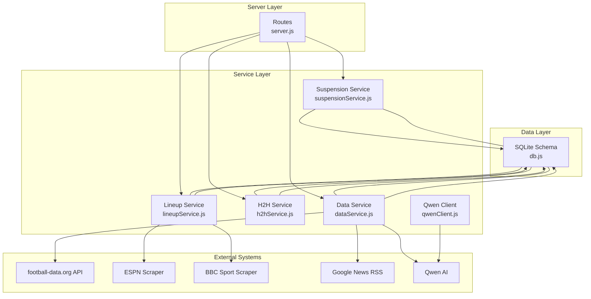
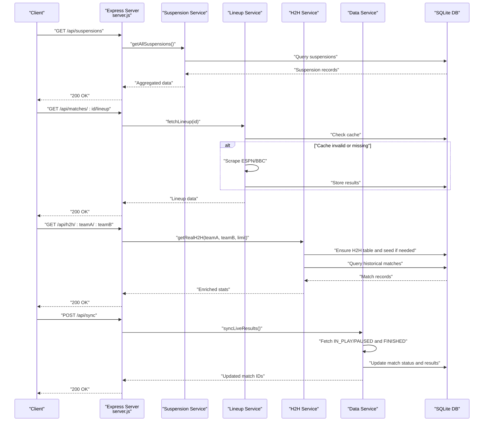
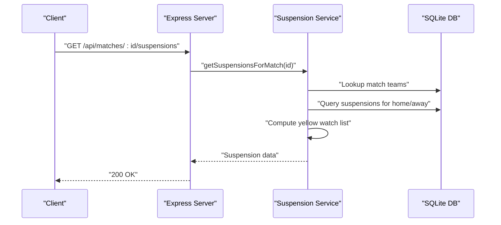
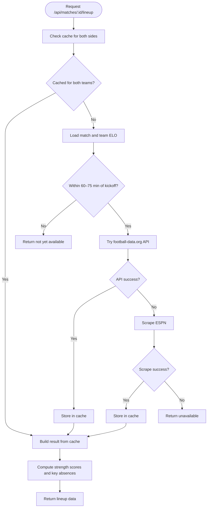
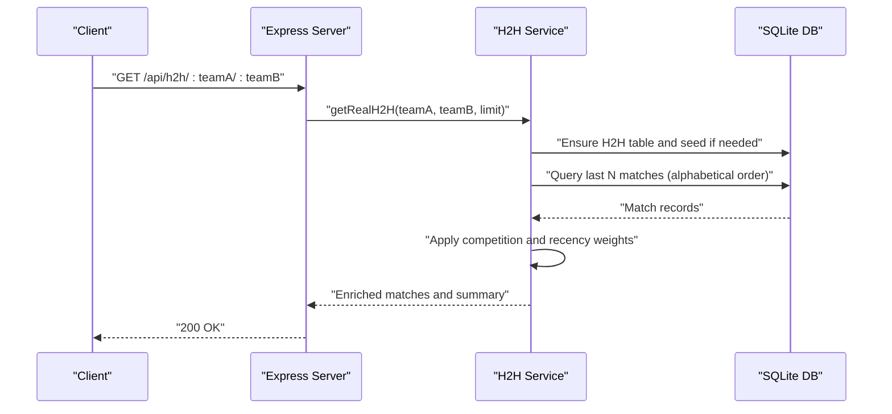
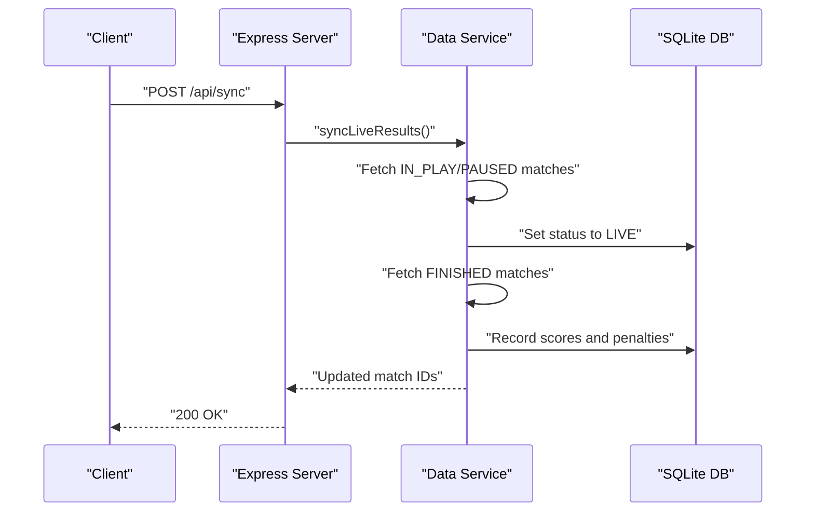
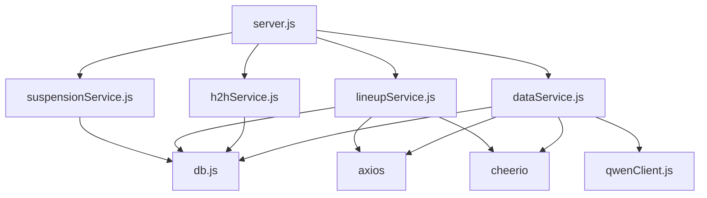

# Data Integration API

<cite>
**Referenced Files in This Document**
- [server.js](file://backend/server.js)
- [suspensionService.js](file://backend/services/suspensionService.js)
- [lineupService.js](file://backend/services/lineupService.js)
- [h2hService.js](file://backend/services/h2hService.js)
- [dataService.js](file://backend/services/dataService.js)
- [db.js](file://backend/database/db.js)
- [package.json](file://backend/package.json)
- [qwenClient.js](file://backend/services/qwenClient.js)
- [client.js](file://frontend/src/api/client.js)
</cite>

## Table of Contents
1. [Introduction](#introduction)
2. [Project Structure](#project-structure)
3. [Core Components](#core-components)
4. [Architecture Overview](#architecture-overview)
5. [Detailed Component Analysis](#detailed-component-analysis)
6. [Dependency Analysis](#dependency-analysis)
7. [Performance Considerations](#performance-considerations)
8. [Troubleshooting Guide](#troubleshooting-guide)
9. [Conclusion](#conclusion)
10. [Appendices](#appendices)

## Introduction
This document provides comprehensive API documentation for data integration endpoints focused on player suspension information, team lineups, head-to-head statistics, and manual data synchronization. It explains external API integration patterns, data refresh mechanisms, and real-time data updates. The documentation includes endpoint specifications, data retrieval workflows, synchronization procedures, and integration with external sources such as football-data.org, ESPN, BBC Sport, Google News, and the Qwen AI model.

## Project Structure
The backend is organized around route handlers in the server, service modules encapsulating domain logic, and a SQLite database with a well-defined schema. External integrations are handled via HTTP clients and web scrapers, while caching ensures efficient data refresh.

**Diagram sources**
- [server.js:304-322](file://backend/server.js#L304-L322)
- [suspensionService.js:1-152](file://backend/services/suspensionService.js#L1-L152)
- [lineupService.js:1-425](file://backend/services/lineupService.js#L1-L425)
- [h2hService.js:1-315](file://backend/services/h2hService.js#L1-L315)
- [dataService.js:1-583](file://backend/services/dataService.js#L1-L583)
- [db.js:23-252](file://backend/database/db.js#L23-L252)
- [qwenClient.js:1-123](file://backend/services/qwenClient.js#L1-L123)

**Section sources**
- [server.js:304-322](file://backend/server.js#L304-L322)
- [db.js:23-252](file://backend/database/db.js#L23-L252)

## Core Components
- Suspension tracking service manages player suspensions, yellow card accumulation, and match availability.
- Lineup service retrieves confirmed starting XI from external sources, caches results, and computes lineup strength.
- Head-to-head service integrates historical international results and enriches probabilities.
- Data service synchronizes live match results from football-data.org, scrapes injury news, and caches intelligence.
- Database schema defines tables for teams, matches, predictions, suspensions, and cached intelligence.

**Section sources**
- [suspensionService.js:1-152](file://backend/services/suspensionService.js#L1-L152)
- [lineupService.js:1-425](file://backend/services/lineupService.js#L1-L425)
- [h2hService.js:1-315](file://backend/services/h2hService.js#L1-L315)
- [dataService.js:1-583](file://backend/services/dataService.js#L1-L583)
- [db.js:23-252](file://backend/database/db.js#L23-L252)

## Architecture Overview
The API follows a layered architecture:
- Route handlers expose endpoints for suspensions, lineups, H2H, and synchronization.
- Services encapsulate business logic and integrate with external systems.
- Database persists structured data and caches for performance.
- Scheduled jobs keep data fresh; manual synchronization triggers immediate updates.

**Diagram sources**
- [server.js:304-322](file://backend/server.js#L304-L322)
- [suspensionService.js:129-143](file://backend/services/suspensionService.js#L129-L143)
- [lineupService.js:220-316](file://backend/services/lineupService.js#L220-L316)
- [h2hService.js:192-266](file://backend/services/h2hService.js#L192-L266)
- [dataService.js:495-580](file://backend/services/dataService.js#L495-L580)

## Detailed Component Analysis

### Suspension Endpoints
Endpoints:
- GET /api/suspensions
- GET /api/matches/:id/suspensions
- GET /api/teams/:id/suspensions

Behavior:
- Retrieve tournament-wide suspensions, match-specific suspensions, and team-specific suspensions.
- Include yellow card watch lists for players nearing suspension thresholds based on stage rules.
- Support adding, updating, and deleting suspensions programmatically.

**Diagram sources**
- [server.js:519-525](file://backend/server.js#L519-L525)
- [suspensionService.js:43-83](file://backend/services/suspensionService.js#L43-L83)

**Section sources**
- [server.js:514-525](file://backend/server.js#L514-L525)
- [suspensionService.js:1-152](file://backend/services/suspensionService.js#L1-L152)

### Lineup Endpoint
Endpoint:
- GET /api/matches/:id/lineup

Behavior:
- Confirms starting XI approximately 60–75 minutes before kick-off.
- Sources (priority): football-data.org API, ESPN scrape, BBC Sport scrape.
- Computes lineup strength scores and detects key absences compared to recent patterns.
- Stores results in cache for subsequent requests.

**Diagram sources**
- [lineupService.js:220-316](file://backend/services/lineupService.js#L220-L316)
- [lineupService.js:83-113](file://backend/services/lineupService.js#L83-L113)
- [lineupService.js:115-155](file://backend/services/lineupService.js#L115-L155)

**Section sources**
- [server.js:304-312](file://backend/server.js#L304-L312)
- [lineupService.js:1-425](file://backend/services/lineupService.js#L1-L425)

### Head-to-Head Endpoint
Endpoint:
- GET /api/h2h/:teamA/:teamB

Behavior:
- Downloads and seeds a historical international results dataset on first use.
- Normalizes team names to 3-letter codes and stores matches sorted alphabetically.
- Enriches matches with competition weights and recency weights.
- Computes weighted advantages and returns summary statistics.

**Diagram sources**
- [server.js:314-322](file://backend/server.js#L314-L322)
- [h2hService.js:92-165](file://backend/services/h2hService.js#L92-L165)
- [h2hService.js:192-266](file://backend/services/h2hService.js#L192-L266)

**Section sources**
- [server.js:314-322](file://backend/server.js#L314-L322)
- [h2hService.js:1-315](file://backend/services/h2hService.js#L1-L315)

### Synchronization Endpoint
Endpoint:
- POST /api/sync

Behavior:
- Manually triggers live result synchronization from football-data.org.
- Updates match statuses to LIVE for in-play matches and records final scores for finished matches.
- Invalidates simulation cache and notifies IndexNow for search indexing.

**Diagram sources**
- [server.js:573-582](file://backend/server.js#L573-L582)
- [dataService.js:495-580](file://backend/services/dataService.js#L495-L580)

**Section sources**
- [server.js:573-582](file://backend/server.js#L573-L582)
- [dataService.js:495-580](file://backend/services/dataService.js#L495-L580)

## Dependency Analysis
External dependencies and integrations:
- HTTP clients for football-data.org API and third-party services.
- Web scraping libraries for ESPN and Google News.
- Qwen AI client for structured intelligence extraction.
- SQLite database for persistence and caching.

**Diagram sources**
- [package.json:14-30](file://backend/package.json#L14-L30)
- [server.js:1-22](file://backend/server.js#L1-L22)
- [lineupService.js:41-43](file://backend/services/lineupService.js#L41-L43)
- [h2hService.js:20-21](file://backend/services/h2hService.js#L20-L21)
- [dataService.js:7-8](file://backend/services/dataService.js#L7-L8)
- [qwenClient.js:13-39](file://backend/services/qwenClient.js#L13-L39)

**Section sources**
- [package.json:14-30](file://backend/package.json#L14-L30)
- [server.js:1-22](file://backend/server.js#L1-L22)

## Performance Considerations
- Caching: Intelligence and lineup data are cached with TTLs to reduce external API calls and scraping overhead.
- Parallelization: Scraping and prediction generation leverage parallel requests and operations.
- Scheduled jobs: Cron tasks synchronize live results and regenerate predictions for upcoming matches.
- Database tuning: Busy timeout, synchronous mode, and foreign keys are configured for reliability.

[No sources needed since this section provides general guidance]

## Troubleshooting Guide
Common issues and resolutions:
- Missing API keys: Ensure FOOTBALL_DATA_API_KEY and optional DASHSCOPE_API_KEY are configured for external integrations.
- Rate limits: External APIs enforce quotas; caching mitigates repeated calls.
- Network failures: Retry logic and timeouts protect against transient errors.
- Data freshness: Use POST /api/sync to manually trigger synchronization; scheduled jobs run periodically.

**Section sources**
- [dataService.js:18-28](file://backend/services/dataService.js#L18-L28)
- [qwenClient.js:60-101](file://backend/services/qwenClient.js#L60-L101)
- [server.js:584-632](file://backend/server.js#L584-L632)

## Conclusion
The Data Integration API provides robust endpoints for retrieving suspension data, confirmed lineups, historical head-to-head statistics, and triggering manual synchronization. Through layered services, caching, and scheduled jobs, the system maintains data freshness while integrating external sources responsibly. Clients can rely on consistent responses and predictable workflows for real-time insights.

[No sources needed since this section summarizes without analyzing specific files]

## Appendices

### Endpoint Reference

- GET /api/suspensions
  - Description: Retrieve tournament-wide suspension summaries.
  - Response: Array of suspension records with team and match metadata.
  - Example usage: [client.js](file://frontend/src/api/client.js#L46)

- GET /api/matches/:id/suspensions
  - Description: Retrieve suspensions and yellow card watch list for a specific match.
  - Path parameters: id (match identifier).
  - Response: Home and away suspensions, yellow watch list, and totals.
  - Example usage: [client.js](file://frontend/src/api/client.js#L46)

- GET /api/teams/:id/suspensions
  - Description: Retrieve all suspensions for a team across the tournament.
  - Path parameters: id (team identifier).
  - Response: List of suspensions linked to matches and opponents.
  - Example usage: [client.js](file://frontend/src/api/client.js#L46)

- GET /api/matches/:id/lineup
  - Description: Retrieve confirmed starting XI and lineup metrics for a match.
  - Path parameters: id (match identifier).
  - Response: Formation, starters, bench, strength scores, and key absences.
  - Example usage: [client.js](file://frontend/src/api/client.js#L47)

- GET /api/h2h/:teamA/:teamB
  - Description: Retrieve recent head-to-head encounters with weighted statistics.
  - Path parameters: teamA, teamB (3-letter team codes).
  - Response: Matches with competition weights and summary statistics.
  - Example usage: [client.js](file://frontend/src/api/client.js#L48)

- POST /api/sync
  - Description: Manually synchronize live results from external sources.
  - Response: Updated match identifiers and counts.
  - Example usage: [client.js](file://frontend/src/api/client.js#L42)

**Section sources**
- [server.js:304-322](file://backend/server.js#L304-L322)
- [server.js:514-525](file://backend/server.js#L514-L525)
- [server.js:573-582](file://backend/server.js#L573-L582)
- [client.js:42-49](file://frontend/src/api/client.js#L42-L49)