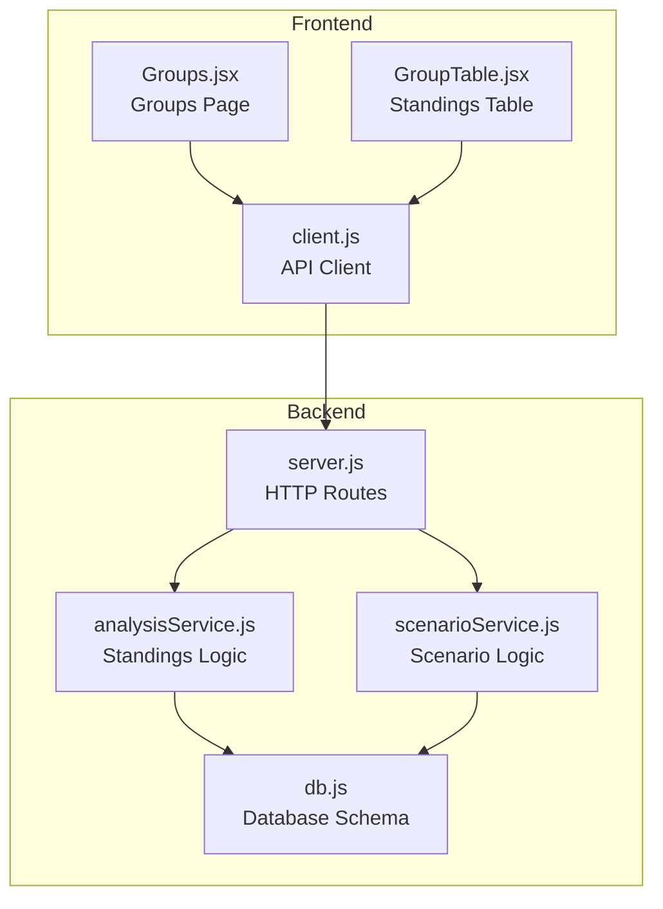
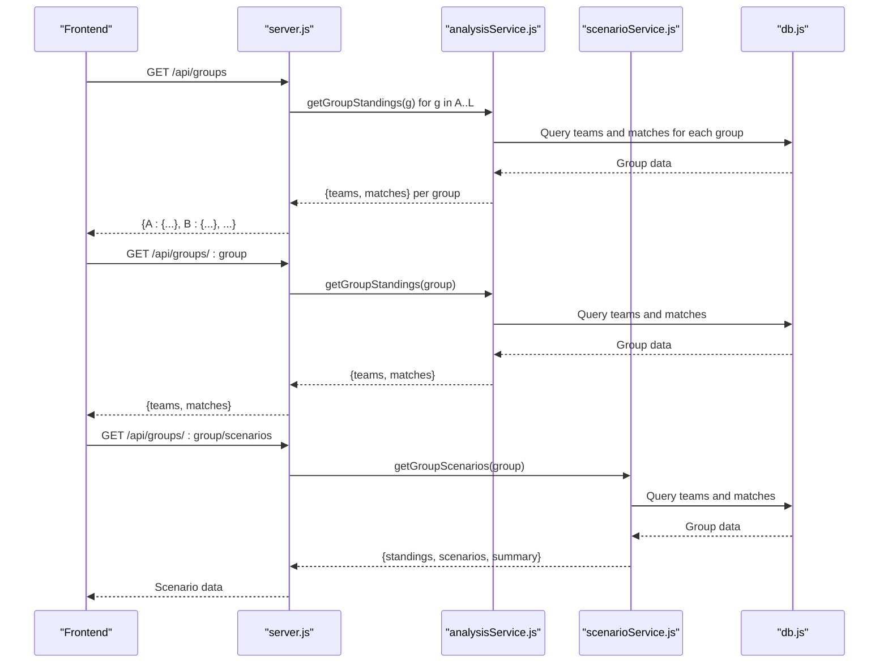
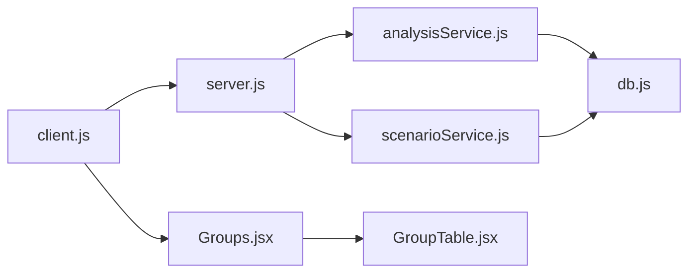

# Groups API

<cite>
**Referenced Files in This Document**
- [server.js](file://backend/server.js)
- [analysisService.js](file://backend/services/analysisService.js)
- [scenarioService.js](file://backend/services/scenarioService.js)
- [client.js](file://frontend/src/api/client.js)
- [Groups.jsx](file://frontend/src/pages/Groups.jsx)
- [GroupTable.jsx](file://frontend/src/components/GroupTable.jsx)
- [db.js](file://backend/database/db.js)
</cite>

## Table of Contents
1. [Introduction](#introduction)
2. [Project Structure](#project-structure)
3. [Core Components](#core-components)
4. [Architecture Overview](#architecture-overview)
5. [Detailed Component Analysis](#detailed-component-analysis)
6. [Dependency Analysis](#dependency-analysis)
7. [Performance Considerations](#performance-considerations)
8. [Troubleshooting Guide](#troubleshooting-guide)
9. [Conclusion](#conclusion)

## Introduction
This document provides comprehensive API documentation for the Groups endpoints that power the FIFA World Cup 2026 group stage functionality. It covers:
- Retrieving all group standings via GET /api/groups
- Retrieving a specific group's information via GET /api/groups/:group
- Analyzing qualification scenarios via GET /api/groups/:group/scenarios
- Group code validation rules
- Response schemas for team standings and match data
- Points calculation methodology
- Qualification probability data and integration with tournament progression logic

The documentation is designed for developers integrating with the backend, frontend engineers building UI components, and stakeholders needing to understand the data flow and business logic behind group stage analytics.

## Project Structure
The Groups API spans three primary areas:
- Backend HTTP routes that expose the endpoints
- Services that compute standings and scenarios
- Frontend consumers that render group data and scenarios

**Diagram sources**
- [server.js:77-107](file://backend/server.js#L77-L107)
- [analysisService.js:389-411](file://backend/services/analysisService.js#L389-L411)
- [scenarioService.js:71-177](file://backend/services/scenarioService.js#L71-L177)
- [db.js:23-208](file://backend/database/db.js#L23-L208)
- [client.js:33-35](file://frontend/src/api/client.js#L33-L35)
- [Groups.jsx:18-23](file://frontend/src/pages/Groups.jsx#L18-L23)
- [GroupTable.jsx:7-17](file://frontend/src/components/GroupTable.jsx#L7-L17)

**Section sources**
- [server.js:77-107](file://backend/server.js#L77-L107)
- [analysisService.js:389-411](file://backend/services/analysisService.js#L389-L411)
- [scenarioService.js:71-177](file://backend/services/scenarioService.js#L71-L177)
- [db.js:23-208](file://backend/database/db.js#L23-L208)
- [client.js:33-35](file://frontend/src/api/client.js#L33-L35)
- [Groups.jsx:18-23](file://frontend/src/pages/Groups.jsx#L18-L23)
- [GroupTable.jsx:7-17](file://frontend/src/components/GroupTable.jsx#L7-L17)

## Core Components

### HTTP Endpoints
- GET /api/groups
  - Returns a dictionary of all 12 groups (A–L), each containing teams and matches.
  - Response shape: `{ [groupLetter]: { teams: Team[], matches: Match[] } }`
- GET /api/groups/:group
  - Returns the specified group's standings and matches.
  - Path parameter validation: uppercase single letter from A–L; invalid inputs return 400 with error message.
  - Response shape: `{ teams: Team[], matches: Match[] }`
- GET /api/groups/:group/scenarios
  - Returns qualification scenarios for the specified group.
  - Path parameter validation: uppercase single letter from A–L; invalid inputs return 400 with error message.
  - Response shape: `{ groupCode, complete, standings, completedMatches, remainingMatches, totalScenarios, scenarios, summary }`

Validation logic ensures only valid group codes are accepted, preventing malformed requests.

**Section sources**
- [server.js:77-107](file://backend/server.js#L77-L107)

### Standings Computation
Standings are computed by aggregating completed group-stage matches and applying tiebreakers:
- Primary: total points (3 for a win, 1 for a draw, 0 for a loss)
- Secondary: goal difference (goals for minus goals against)
- Tertiary: goals for
- Quaternary: FIFA rank (ascending)

The computation resets each team's group-stage stats and recalculates totals from scratch to ensure correctness and idempotency.

**Section sources**
- [analysisService.js:238-293](file://backend/services/analysisService.js#L238-L293)
- [analysisService.js:389-411](file://backend/services/analysisService.js#L389-L411)

### Scenario Analysis
The scenario service enumerates possible outcomes for remaining matches:
- For groups with ≤ 3 remaining matches, it generates all 3^n combinations of HOME/DRAW/AWAY results.
- For each scenario, it simulates final standings and records who advances (1st and 2nd) and who is eligible for third place.
- Summary statistics include always qualifies, never qualifies, and qualification percentage for each team.

This enables fans and analysts to understand qualification probabilities and "what-if" scenarios.

**Section sources**
- [scenarioService.js:71-177](file://backend/services/scenarioService.js#L71-L177)

## Architecture Overview

**Diagram sources**
- [server.js:77-107](file://backend/server.js#L77-L107)
- [analysisService.js:389-411](file://backend/services/analysisService.js#L389-L411)
- [scenarioService.js:71-177](file://backend/services/scenarioService.js#L71-L177)
- [db.js:23-208](file://backend/database/db.js#L23-L208)

## Detailed Component Analysis

### Endpoint: GET /api/groups
- Purpose: Retrieve all group standings and match data for display across the application.
- Processing:
  - Iterates through group letters A–L.
  - Calls getGroupStandings for each group.
  - Aggregates results into a single response object keyed by group letter.
- Response schema:
  - teams: Array of team objects with group-stage stats (gs_played, gs_won, gs_drawn, gs_lost, gs_gf, gs_ga, gs_pts).
  - matches: Array of match objects with home/away team names and flags.

Integration note: The frontend consumes this endpoint to populate the overview grid and individual group views.

**Section sources**
- [server.js:77-86](file://backend/server.js#L77-L86)
- [analysisService.js:389-411](file://backend/services/analysisService.js#L389-L411)
- [Groups.jsx:18-23](file://frontend/src/pages/Groups.jsx#L18-L23)

### Endpoint: GET /api/groups/:group
- Purpose: Retrieve a specific group's standings and matches.
- Validation:
  - Converts path parameter to uppercase.
  - Ensures length equals 1 and character is within A–L.
  - Returns 400 with error message for invalid input.
- Response schema:
  - teams: Ordered by points, goal difference, goals for, and FIFA rank.
  - matches: Ordered by scheduled date.

Frontend usage: Selected group view renders the standings table and upcoming matches.

**Section sources**
- [server.js:88-94](file://backend/server.js#L88-L94)
- [analysisService.js:389-411](file://backend/services/analysisService.js#L389-L411)
- [GroupTable.jsx:7-17](file://frontend/src/components/GroupTable.jsx#L7-L17)

### Endpoint: GET /api/groups/:group/scenarios
- Purpose: Provide qualification scenario analysis for a group.
- Validation: Same as above; invalid inputs return 400.
- Response schema:
  - groupCode: The requested group letter.
  - complete: Boolean indicating whether the group is finished.
  - standings: Current teams with stats.
  - completedMatches: Matches already completed.
  - remainingMatches: Remaining matches to be simulated.
  - totalScenarios: Total possible combinations (3^n).
  - scenarios: Array of { results, outcome } where outcome includes first, second, and third place teams.
  - summary: Array of { id, name, flag, currentPts, currentGD, qualifyCount, totalScenarios, qualifyPct, alwaysQualifies, neverQualifies, eliminated }.

Qualification logic:
- First and second place teams advance automatically.
- Third-place teams are determined by the best four qualified teams among the remaining teams.

**Section sources**
- [server.js:96-107](file://backend/server.js#L96-L107)
- [scenarioService.js:71-177](file://backend/services/scenarioService.js#L71-L177)

### Group Code Validation
- Acceptable inputs: Single uppercase letter from A–L.
- Validation steps:
  - Convert input to uppercase.
  - Check length equals 1.
  - Verify membership in the valid set {A,B,C,D,E,F,G,H,I,J,K,L}.
- Error handling: Returns 400 with error message for invalid input.

**Section sources**
- [server.js:88-94](file://backend/server.js#L88-L94)
- [server.js:96-100](file://backend/server.js#L96-L100)

### Response Schemas

#### Team Standings Fields
- gs_played: Number of matches played
- gs_won: Number of matches won
- gs_drawn: Number of matches drawn
- gs_lost: Number of matches lost
- gs_gf: Goals for
- gs_ga: Goals against
- gs_pts: Total points

These fields are populated by the standings computation service and ordered according to the tiebreaker rules.

**Section sources**
- [analysisService.js:238-293](file://backend/services/analysisService.js#L238-L293)
- [db.js:26-49](file://backend/database/db.js#L26-L49)

#### Match Data Fields
- Basic match metadata: id, stage, group_code, match_number, scheduled_date, scheduled_time, venue, status
- Team references: home_team, away_team
- Scores: home_score, away_score, home_score_pens, away_score_pens, winner
- Additional fields for display: home_name, away_name, home_flag, away_flag

**Section sources**
- [db.js:51-70](file://backend/database/db.js#L51-L70)
- [analysisService.js:392-408](file://backend/services/analysisService.js#L392-L408)

#### Scenario Response Fields
- groupCode: Requested group letter
- complete: Whether the group is finished
- standings: Current team standings
- completedMatches: Completed matches
- remainingMatches: Remaining matches
- totalScenarios: 3^(number of remaining matches)
- scenarios: Array of scenario objects with results and outcome
- summary: Per-team summary with qualification statistics

**Section sources**
- [scenarioService.js:71-177](file://backend/services/scenarioService.js#L71-L177)

### Points Calculation
The backend computes points for predictions using the following scheme:
- 3 points: Actual scoreline matches the most likely scoreline
- 2 points: Actual scoreline appears in the top 3 predicted scorelines
- 1 point: Outcome matches the predicted outcome (derived from the most likely scoreline)
- 0 points: Otherwise

This scoring aligns with the analytics accuracy metrics and the prediction display logic.

**Section sources**
- [analysisService.js:37-57](file://backend/services/analysisService.js#L37-L57)

### Integration with Tournament Progression Logic
- Group completion triggers advancement to round-of-32 (R32) for the top two teams from each group.
- The bracket service coordinates this advancement and maintains the knockout bracket structure.
- Scenario analysis informs fans about qualification probabilities while the bracket service enforces tournament progression rules.

**Section sources**
- [analysisService.js:118-128](file://backend/services/analysisService.js#L118-L128)
- [scenarioService.js:71-111](file://backend/services/scenarioService.js#L71-L111)

## Dependency Analysis

**Diagram sources**
- [client.js:33-35](file://frontend/src/api/client.js#L33-L35)
- [server.js:77-107](file://backend/server.js#L77-L107)
- [analysisService.js:389-411](file://backend/services/analysisService.js#L389-L411)
- [scenarioService.js:71-177](file://backend/services/scenarioService.js#L71-L177)
- [db.js:23-208](file://backend/database/db.js#L23-L208)
- [Groups.jsx:18-23](file://frontend/src/pages/Groups.jsx#L18-L23)
- [GroupTable.jsx:7-17](file://frontend/src/components/GroupTable.jsx#L7-L17)

**Section sources**
- [client.js:33-35](file://frontend/src/api/client.js#L33-L35)
- [server.js:77-107](file://backend/server.js#L77-L107)
- [analysisService.js:389-411](file://backend/services/analysisService.js#L389-L411)
- [scenarioService.js:71-177](file://backend/services/scenarioService.js#L71-L177)
- [db.js:23-208](file://backend/database/db.js#L23-L208)
- [Groups.jsx:18-23](file://frontend/src/pages/Groups.jsx#L18-L23)
- [GroupTable.jsx:7-17](file://frontend/src/components/GroupTable.jsx#L7-L17)

## Performance Considerations
- Group enumeration endpoint iterates over 12 groups; each call executes two queries (teams and matches). This is efficient for the small fixed set of groups.
- Scenario computation scales exponentially with remaining matches (3^n). The service limits scenarios to groups with ≤ 3 remaining matches to maintain reasonable performance.
- Standings recomputation scans all completed matches for a group and updates team stats. This is linear in the number of completed matches and idempotent.

[No sources needed since this section provides general guidance]

## Troubleshooting Guide
Common issues and resolutions:
- Invalid group code:
  - Symptom: 400 error with "Invalid group".
  - Cause: Path parameter not a single uppercase letter from A–L.
  - Resolution: Ensure the group parameter is a valid single letter (A–L).
- Empty or stale data:
  - Symptom: Missing teams or matches in response.
  - Cause: No completed matches yet or database not seeded.
  - Resolution: Verify database initialization and that matches have progressed to completed status.
- Excessive scenario computation:
  - Symptom: Slow response for scenario endpoint.
  - Cause: Group has more than 3 remaining matches.
  - Resolution: The service caps scenarios to ≤ 3 remaining matches; consider reducing remaining matches or caching results.

**Section sources**
- [server.js:88-94](file://backend/server.js#L88-L94)
- [server.js:96-100](file://backend/server.js#L96-L100)
- [scenarioService.js:71-111](file://backend/services/scenarioService.js#L71-L111)

## Conclusion
The Groups API provides a robust foundation for displaying group stage standings, upcoming matches, and qualification scenarios. Its design emphasizes correctness (idempotent standings recomputation), scalability (bounded scenario computation), and clear validation. The frontend integrates seamlessly with these endpoints to deliver an engaging fan experience, while the backend services encapsulate the business logic for standings and scenario analysis.