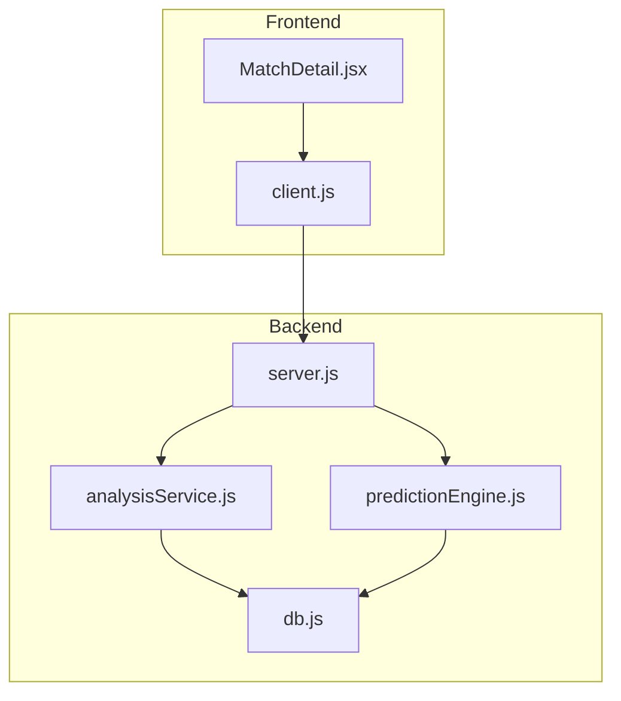
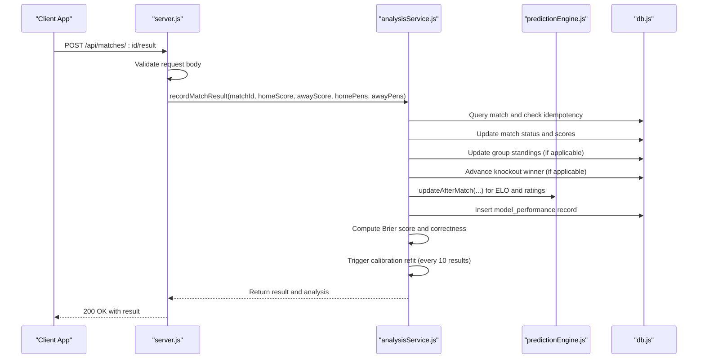
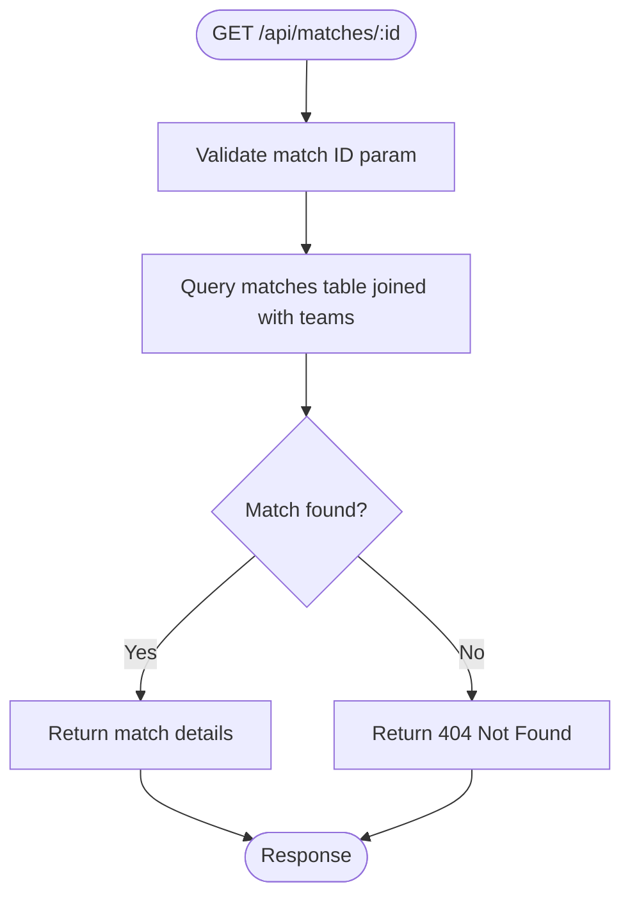
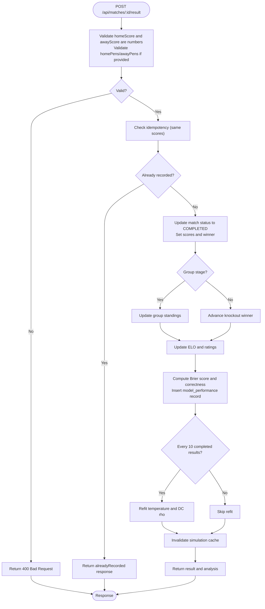
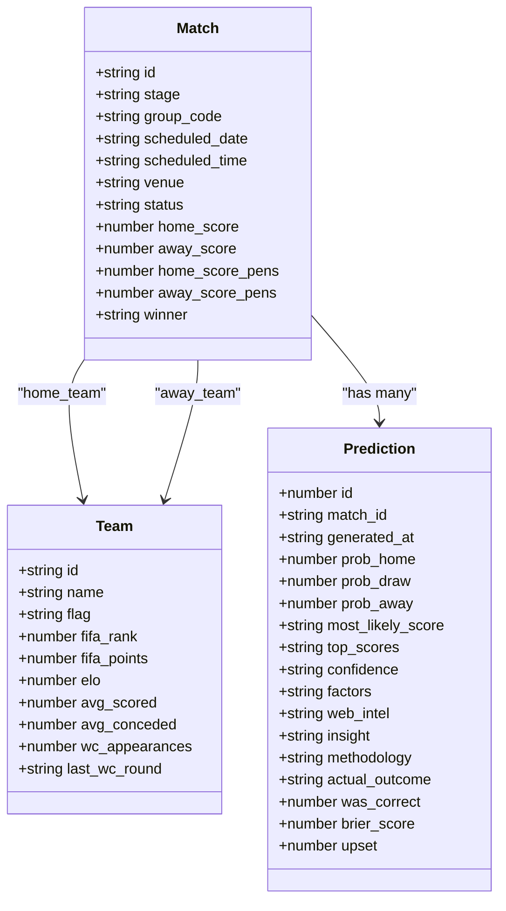
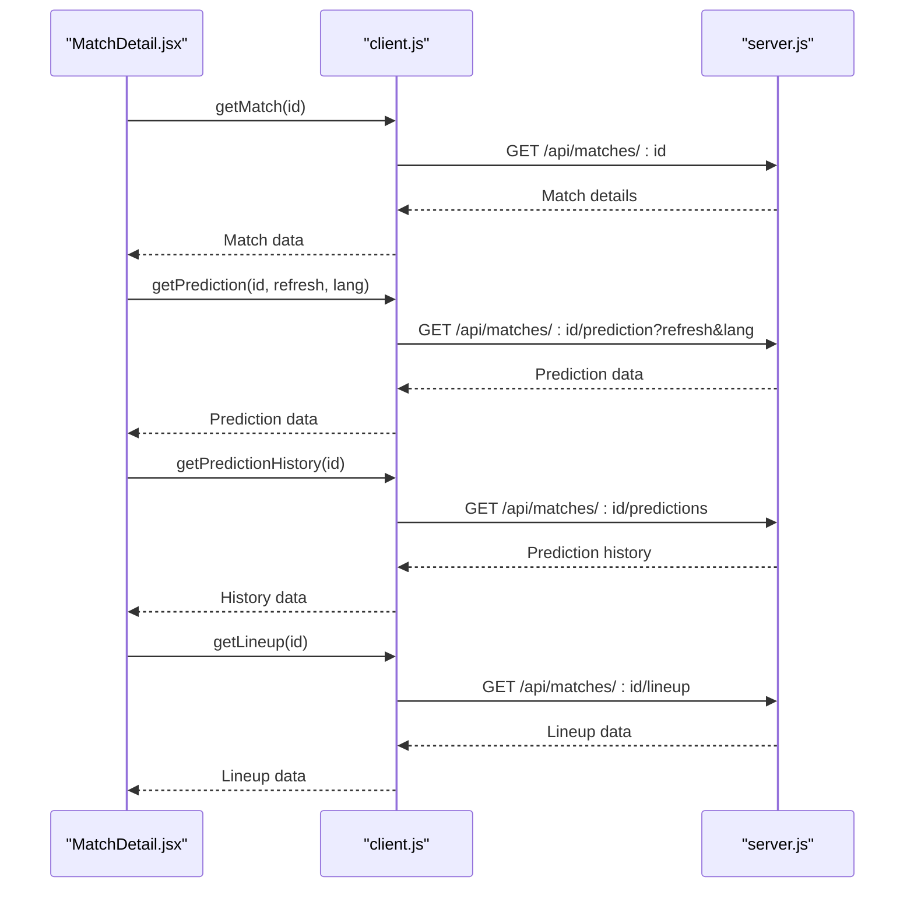
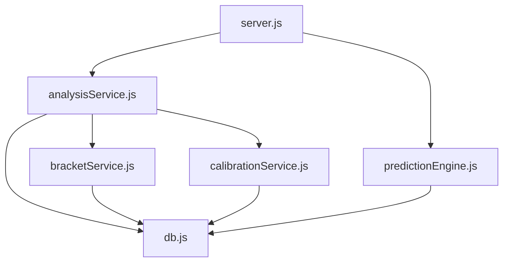

# Match Detail & Result Submission

<cite>
**Referenced Files in This Document**
- [server.js](file://backend/server.js)
- [analysisService.js](file://backend/services/analysisService.js)
- [predictionEngine.js](file://backend/services/predictionEngine.js)
- [db.js](file://backend/database/db.js)
- [client.js](file://frontend/src/api/client.js)
- [MatchDetail.jsx](file://frontend/src/pages/MatchDetail.jsx)
</cite>

## Table of Contents
1. [Introduction](#introduction)
2. [Project Structure](#project-structure)
3. [Core Components](#core-components)
4. [Architecture Overview](#architecture-overview)
5. [Detailed Component Analysis](#detailed-component-analysis)
6. [Dependency Analysis](#dependency-analysis)
7. [Performance Considerations](#performance-considerations)
8. [Troubleshooting Guide](#troubleshooting-guide)
9. [Conclusion](#conclusion)

## Introduction
This document provides comprehensive technical documentation for the match detail endpoints and result submission workflow in the World Cup 2026 Prediction App. It covers:
- GET /api/matches/:id for retrieving complete match details
- POST /api/matches/:id/result for submitting match results
- Request/response schemas and validation rules
- Integration with the prediction system and automatic recalibration
- Examples of match data retrieval with team information, player data, and prediction analytics
- Error handling for invalid results, duplicate submissions, and timing constraints

## Project Structure
The system consists of:
- Backend API server exposing match detail and result submission endpoints
- Services for analysis, prediction, and data management
- Frontend components that consume these APIs to render match details and predictions

**Diagram sources**
- [server.js:283-302](file://backend/server.js#L283-L302)
- [analysisService.js:76-218](file://backend/services/analysisService.js#L76-L218)
- [predictionEngine.js:665-695](file://backend/services/predictionEngine.js#L665-L695)
- [db.js:10-252](file://backend/database/db.js#L10-L252)

**Section sources**
- [server.js:264-280](file://backend/server.js#L264-L280)
- [server.js:283-302](file://backend/server.js#L283-L302)

## Core Components
This section documents the key endpoints and their behavior.

### GET /api/matches/:id
Retrieves comprehensive match details including team information and basic match metadata.

- **Route**: `GET /api/matches/:id`
- **Response Schema**:
  - `id`: Match identifier
  - `stage`: Tournament stage (GROUP, R32, R16, QF, SF, F)
  - `group_code`: Group letter (A–L) for group stage
  - `match_number`: Sequential match number within group
  - `home_team`, `away_team`: Team identifiers
  - `scheduled_date`, `scheduled_time`: Kickoff date and time (Singapore Time)
  - `venue`: Stadium name
  - `status`: SCHEDULED | LIVE | COMPLETED
  - `home_score`, `away_score`: Final scores (only for completed matches)
  - `home_score_pens`, `away_score_pens`: Penalty shootout scores (knockout matches)
  - `winner`: Winning team identifier (knockout matches)
  - `completed_at`: Timestamp when match completed
  - `home_name`, `home_flag`, `home_elo`, `home_avg_scored`, `home_wc_apps`: Home team details
  - `away_name`, `away_flag`, `away_elo`, `away_avg_scored`, `away_wc_apps`: Away team details

**Section sources**
- [server.js:264-280](file://backend/server.js#L264-L280)

### POST /api/matches/:id/result
Submits match results and triggers post-match analysis and prediction recalibration.

- **Route**: `POST /api/matches/:id/result`
- **Request Body**:
  - `homeScore`: Number (required)
  - `awayScore`: Number (required)
  - `homePens`: Number (optional)
  - `awayPens`: Number (optional)
- **Validation Rules**:
  - `homeScore` and `awayScore` must be numbers
  - `homePens` and `awayPens` must be numbers if provided
  - For knockout matches, if both teams are drawn after 90 minutes, penalty shootout scores must be provided
- **Response Schema**:
  - `matchId`: Match identifier
  - `result`: Contains submitted scores and computed outcome
  - `analysis`: Post-match analysis including Brier score, correctness, and insights
  - `alreadyRecorded`: Boolean indicating duplicate submission prevention
- **Behavior**:
  - Idempotency guard prevents duplicate processing for identical scores
  - Updates match status to COMPLETED and sets winner
  - Triggers group standings updates (group stage) and bracket advancement (knockout)
  - Updates ELO ratings and attack/defense ratings
  - Recalibrates prediction model at 10-result intervals
  - Invalidates simulation cache

**Section sources**
- [server.js:283-302](file://backend/server.js#L283-L302)
- [analysisService.js:76-218](file://backend/services/analysisService.js#L76-L218)

## Architecture Overview
The result submission workflow integrates with the prediction system and analysis pipeline.

**Diagram sources**
- [server.js:283-302](file://backend/server.js#L283-L302)
- [analysisService.js:76-218](file://backend/services/analysisService.js#L76-L218)
- [predictionEngine.js:665-695](file://backend/services/predictionEngine.js#L665-L695)
- [db.js:10-252](file://backend/database/db.js#L10-L252)

## Detailed Component Analysis

### Match Detail Endpoint Implementation
The GET endpoint retrieves a single match with team details and basic metadata.

**Diagram sources**
- [server.js:264-280](file://backend/server.js#L264-L280)

**Section sources**
- [server.js:264-280](file://backend/server.js#L264-L280)

### Result Submission Workflow
The POST endpoint validates input, processes the result, and triggers downstream updates.

**Diagram sources**
- [server.js:283-302](file://backend/server.js#L283-L302)
- [analysisService.js:76-218](file://backend/services/analysisService.js#L76-L218)

**Section sources**
- [server.js:283-302](file://backend/server.js#L283-L302)
- [analysisService.js:76-218](file://backend/services/analysisService.js#L76-L218)

### Prediction Integration
The system maintains prediction history and provides detailed analytics.

**Diagram sources**
- [db.js:51-94](file://backend/database/db.js#L51-L94)

**Section sources**
- [db.js:51-94](file://backend/database/db.js#L51-L94)

### Frontend Integration
The frontend consumes these endpoints to render match details and predictions.

**Diagram sources**
- [client.js:16-29](file://frontend/src/api/client.js#L16-L29)
- [MatchDetail.jsx:739-756](file://frontend/src/pages/MatchDetail.jsx#L739-L756)

**Section sources**
- [client.js:16-29](file://frontend/src/api/client.js#L16-L29)
- [MatchDetail.jsx:739-756](file://frontend/src/pages/MatchDetail.jsx#L739-L756)

## Dependency Analysis
The result submission depends on several services and database tables.

**Diagram sources**
- [server.js:283-302](file://backend/server.js#L283-L302)
- [analysisService.js:14-16](file://backend/services/analysisService.js#L14-L16)
- [db.js:10-252](file://backend/database/db.js#L10-L252)

**Section sources**
- [analysisService.js:14-16](file://backend/services/analysisService.js#L14-L16)

## Performance Considerations
- Database queries use prepared statements to prevent SQL injection and improve performance
- Prediction caching avoids recomputation for scheduled matches when predictions are already cached
- Batch operations for prediction generation during cron runs
- Indexes on frequently queried columns (match_id, generated_at) improve query performance

## Troubleshooting Guide

### Common Validation Errors
- **Invalid score types**: Ensure `homeScore` and `awayScore` are numbers. Non-numeric values return 400 Bad Request.
- **Invalid penalty scores**: If penalty shootout scores are provided, they must be numbers.
- **Missing penalty scores**: For knockout matches that end in a draw after 90 minutes, penalty shootout scores are required.

### Duplicate Submission Prevention
- The system checks if the match is already completed with identical scores and returns an `alreadyRecorded` response to prevent duplicate processing.

### Timing Constraints
- Predictions are locked once a match goes live, preventing updates to predictions for live matches.
- Results can only be submitted after the match has been recorded as completed.

### Database Integrity
- Foreign key constraints ensure referential integrity between matches, teams, and predictions.
- Transactions are used to maintain atomicity when updating match status, standings, and ratings.

**Section sources**
- [server.js:283-302](file://backend/server.js#L283-L302)
- [analysisService.js:76-218](file://backend/services/analysisService.js#L76-L218)
- [db.js:51-94](file://backend/database/db.js#L51-L94)

## Conclusion
The match detail and result submission endpoints provide a robust foundation for retrieving match information and processing results. The system enforces strict validation, prevents duplicate submissions, integrates with the prediction system for automatic recalibration, and maintains comprehensive analytics for model evaluation. The frontend components consume these endpoints to deliver rich match detail experiences with predictions, lineup information, and historical analytics.