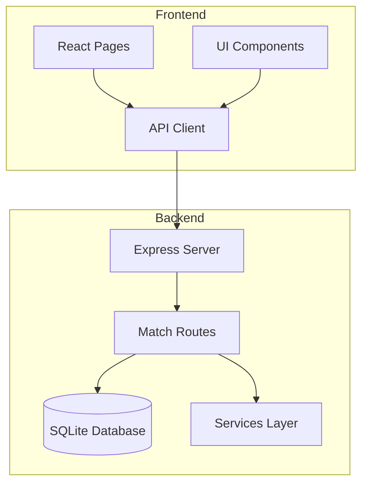
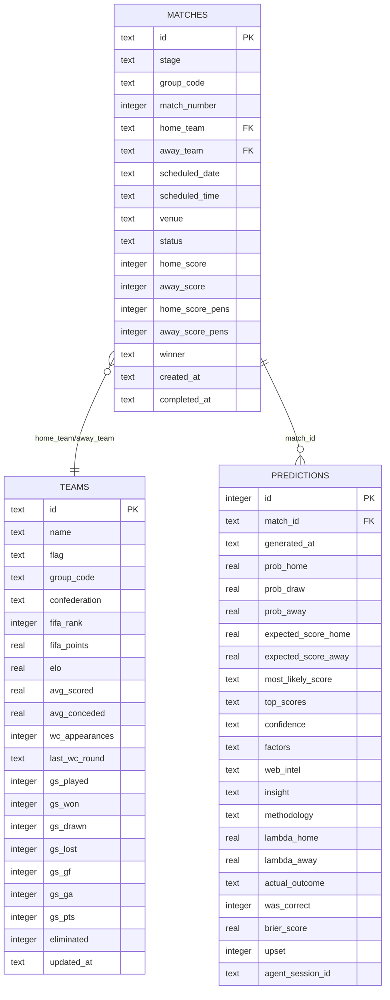
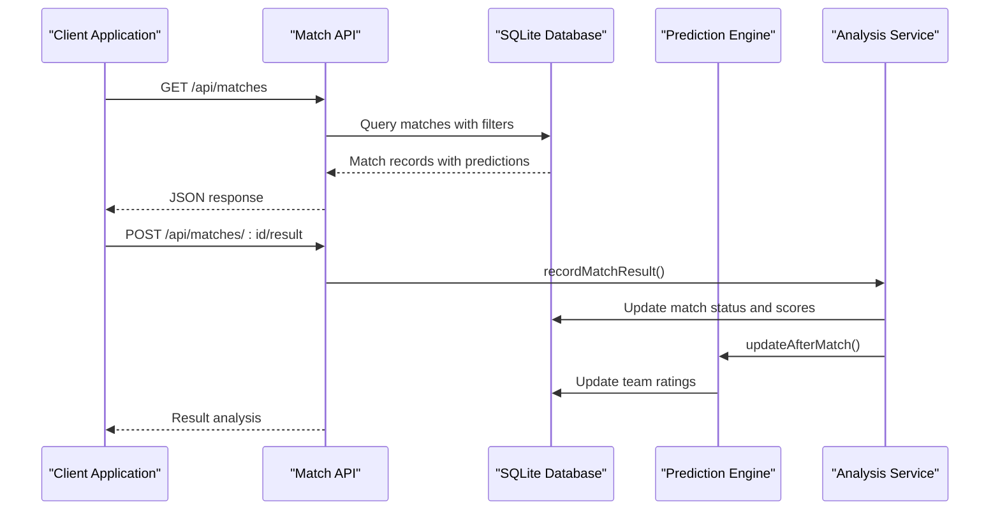
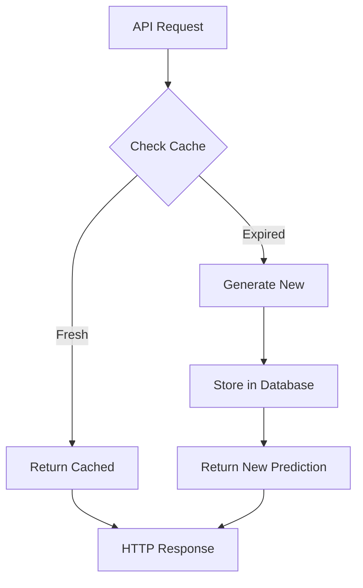
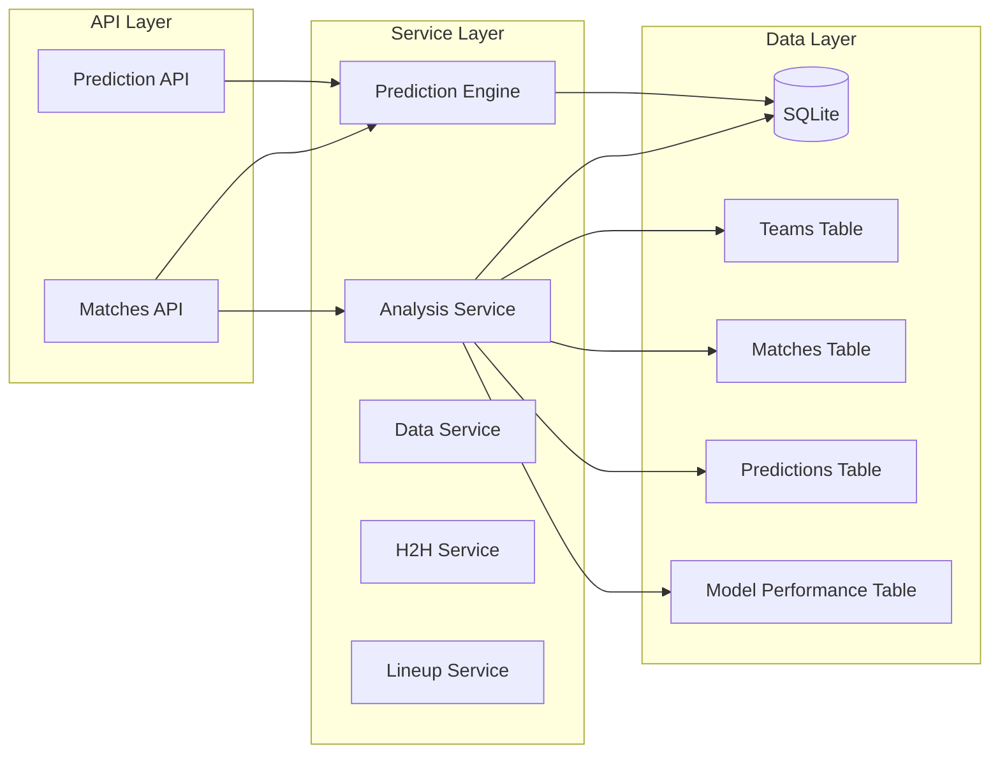

# Matches API

<cite>
**Referenced Files in This Document**
- [server.js](file://backend/server.js)
- [db.js](file://backend/database/db.js)
- [analysisService.js](file://backend/services/analysisService.js)
- [predictionEngine.js](file://backend/services/predictionEngine.js)
- [client.js](file://frontend/src/api/client.js)
- [MatchDetail.jsx](file://frontend/src/pages/MatchDetail.jsx)
- [MatchCard.jsx](file://frontend/src/components/MatchCard.jsx)
</cite>

## Table of Contents
1. [Introduction](#introduction)
2. [Project Structure](#project-structure)
3. [Core Components](#core-components)
4. [Architecture Overview](#architecture-overview)
5. [Detailed Component Analysis](#detailed-component-analysis)
6. [Dependency Analysis](#dependency-analysis)
7. [Performance Considerations](#performance-considerations)
8. [Troubleshooting Guide](#troubleshooting-guide)
9. [Conclusion](#conclusion)

## Introduction
This document provides comprehensive API documentation for the Matches endpoints in the WC2026 prediction application. It covers all match-related endpoints including listing matches with filtering, retrieving today's matches, upcoming matches, upset watch functionality, individual match details, and result submission workflows. The documentation includes request/response schemas, query parameters, filtering options, and real-time prediction data integration.

## Project Structure
The Matches API is implemented in the backend Express server with SQLite database storage. The frontend React application consumes these APIs through a dedicated client module.



**Diagram sources**
- [server.js:109-302](file://backend/server.js#L109-L302)
- [client.js:12-17](file://frontend/src/api/client.js#L12-L17)

**Section sources**
- [server.js:109-302](file://backend/server.js#L109-L302)
- [client.js:1-50](file://frontend/src/api/client.js#L1-L50)

## Core Components

### Database Schema
The matches endpoint relies on a well-structured SQLite schema with the following key tables:



**Diagram sources**
- [db.js:51-94](file://backend/database/db.js#L51-L94)

**Section sources**
- [db.js:23-252](file://backend/database/db.js#L23-L252)

## Architecture Overview



**Diagram sources**
- [server.js:109-302](file://backend/server.js#L109-L302)
- [analysisService.js:76-218](file://backend/services/analysisService.js#L76-L218)
- [predictionEngine.js:898-963](file://backend/services/predictionEngine.js#L898-L963)

## Detailed Component Analysis

### GET /api/matches - List Matches with Filtering

The primary endpoint for retrieving matches with comprehensive filtering capabilities.

**Query Parameters:**
- `stage`: Filter by tournament stage (GROUP, R32, R16, QF, SF, F)
- `status`: Filter by match status (SCHEDULED, LIVE, COMPLETED)
- `date`: Filter by specific date (YYYY-MM-DD)
- `group`: Filter by group code (A-L)

**Response Schema:**
```javascript
[
  {
    "id": "string",
    "stage": "string",
    "group_code": "string",
    "match_number": "integer",
    "home_team": "string",
    "away_team": "string",
    "scheduled_date": "string",
    "scheduled_time": "string",
    "venue": "string",
    "status": "string",
    "home_score": "integer|null",
    "away_score": "integer|null",
    "home_score_pens": "integer|null",
    "away_score_pens": "integer|null",
    "winner": "string|null",
    "created_at": "string",
    "completed_at": "string|null",
    "home_name": "string",
    "home_flag": "string",
    "home_elo": "number",
    "away_name": "string",
    "away_flag": "string",
    "away_elo": "number",
    "prob_home": "number|null",
    "prob_draw": "number|null",
    "prob_away": "number|null",
    "most_likely_score": "string|null",
    "confidence": "string|null",
    "graded_points": "integer|null"
  }
]
```

**Filtering Logic:**
- Case-insensitive stage filtering with automatic uppercase conversion
- Status filtering with case normalization
- Exact date matching for scheduled_date field
- Group filtering by group_code

**Section sources**
- [server.js:110-142](file://backend/server.js#L110-L142)
- [db.js:51-70](file://backend/database/db.js#L51-L70)

### GET /api/matches/today - Current Day Matches

Retrieves all matches scheduled for the current date with real-time prediction data.

**Response Schema:**
Same as main matches endpoint but filtered for today's date only.

**Key Features:**
- Automatically calculates current date in YYYY-MM-DD format
- Includes prediction data (probabilities, confidence, insight)
- Excludes completed matches from the response

**Section sources**
- [server.js:144-165](file://backend/server.js#L144-L165)

### GET /api/matches/upcoming - Next Few Days Matches

Returns matches for the current day plus the next 3 calendar days, grouped by date.

**Response Schema:**
```javascript
{
  "dates": [
    {
      "date": "string",
      "matches": [
        {
          // Same match schema as main endpoint
        }
      ]
    }
  ]
}
```

**Processing Logic:**
1. Finds the first future date with scheduled matches
2. Calculates end date as 3 days later (UTC timezone handling)
3. Groups matches by scheduled date or scheduled_time-adjusted date
4. Filters out completed matches

**Section sources**
- [server.js:167-216](file://backend/server.js#L167-L216)

### GET /api/matches/upset-watch - High-Upset Probability Matches

Identifies matches where favorites have less than 45% win probability despite significant ELO advantage.

**Filtering Criteria:**
- Status must be SCHEDULED
- Predictions must exist (prob_home/prob_away available)
- ELO difference ≥ 50 points
- Favorite's win probability < 0.45

**Response Schema:**
Enhanced match objects with additional upset-related fields:
- `favTeam`, `favFlag`, `favWinProb`
- `underdogTeam`, `underdogFlag`, `underdogWinProb`
- `eloDiff`: Rounded ELO difference
- `upsetProbability`: Underdog's win probability

**Section sources**
- [server.js:218-262](file://backend/server.js#L218-L262)

### GET /api/matches/:id - Individual Match Details

Retrieves comprehensive match information including team statistics and basic match data.

**Response Schema:**
```javascript
{
  "id": "string",
  "stage": "string",
  "group_code": "string",
  "match_number": "integer",
  "home_team": "string",
  "away_team": "string",
  "scheduled_date": "string",
  "scheduled_time": "string",
  "venue": "string",
  "status": "string",
  "home_score": "integer|null",
  "away_score": "integer|null",
  "home_score_pens": "integer|null",
  "away_score_pens": "integer|null",
  "winner": "string|null",
  "created_at": "string",
  "completed_at": "string|null",
  "home_name": "string",
  "home_flag": "string",
  "home_elo": "number",
  "home_avg_scored": "number",
  "home_wc_apps": "integer",
  "away_name": "string",
  "away_flag": "string",
  "away_elo": "number",
  "away_avg_scored": "number",
  "away_wc_apps": "integer"
}
```

**Section sources**
- [server.js:264-280](file://backend/server.js#L264-L280)

### POST /api/matches/:id/result - Submit Match Results

Allows authorized clients to submit match results and trigger post-processing workflows.

**Request Body:**
```javascript
{
  "homeScore": "number",
  "awayScore": "number",
  "homePens": "number|null",
  "awayPens": "number|null"
}
```

**Validation Rules:**
- `homeScore` and `awayScore` must be numbers
- `homePens` and `awayPens` must be numbers or null
- Penalties are only valid for knockout stage matches

**Response Schema:**
```javascript
{
  "matchId": "string",
  "result": {
    "homeScore": "number",
    "awayScore": "number",
    "outcome": "string", // HOME, DRAW, AWAY
    "winner": "string|null"
  },
  "analysis": {
    "predictedOutcome": "string",
    "actualOutcome": "string",
    "wasCorrect": "boolean",
    "brierScore": "number",
    "isUpset": "boolean",
    "notes": "string",
    "eloChange": "object"
  },
  "alreadyRecorded": "boolean"
}
```

**Processing Workflow:**
1. Validates input parameters
2. Updates match status to COMPLETED
3. Updates group standings (for group stage)
4. Advances knockout winners (for knockout stage)
5. Updates team ELO ratings
6. Grades prediction accuracy
7. Records model performance metrics
8. Invalidates simulation cache
9. Notifies IndexNow for SEO updates

**Section sources**
- [server.js:282-302](file://backend/server.js#L282-L302)
- [analysisService.js:76-218](file://backend/services/analysisService.js#L76-L218)

### Real-Time Prediction Integration

The Matches API integrates with the prediction engine to provide real-time probability updates:



**Prediction Data Fields:**
- `prob_home`, `prob_draw`, `prob_away`: Win/draw/loss probabilities
- `most_likely_score`: Predicted scoreline
- `top_scores`: Top 3 scorelines with probabilities
- `confidence`: Confidence level (VERY_HIGH, HIGH, MEDIUM, LOW)
- `insight`: LLM-generated analyst commentary
- `factors`: Breakdown of contributing factors

**Section sources**
- [predictionEngine.js:665-896](file://backend/services/predictionEngine.js#L665-L896)
- [server.js:326-341](file://backend/server.js#L326-L341)

## Dependency Analysis



**Diagram sources**
- [server.js:109-302](file://backend/server.js#L109-L302)
- [analysisService.js:13-422](file://backend/services/analysisService.js#L13-L422)
- [predictionEngine.js:37-1020](file://backend/services/predictionEngine.js#L37-L1020)

**Section sources**
- [server.js:109-302](file://backend/server.js#L109-L302)
- [analysisService.js:13-422](file://backend/services/analysisService.js#L13-L422)

## Performance Considerations

### Database Optimization
- **Index Usage**: Queries utilize WHERE clauses with indexed fields (stage, status, scheduled_date, group_code)
- **JOIN Optimization**: Left joins with lazy loading of prediction data
- **Pagination**: Upcoming matches endpoint limits results to 60 matches for upset watch
- **Caching**: Predictions are cached and served from database with freshness checks

### API Response Optimization
- **Selective Field Loading**: Only required fields are selected for each endpoint
- **Conditional Queries**: Filters are dynamically added based on provided parameters
- **Batch Operations**: Prediction generation supports batch processing for multiple matches

### Real-Time Processing
- **Prediction Generation**: Uses cooldown mechanism to prevent excessive recomputation
- **Cache Invalidation**: Automatic invalidation when results are submitted
- **Background Jobs**: Scheduled tasks for live result synchronization

## Troubleshooting Guide

### Common Issues and Solutions

**Match Not Found Errors:**
- Verify match ID exists in database
- Check case sensitivity for stage/group parameters
- Ensure proper URL encoding for special characters

**Prediction Generation Failures:**
- Check API key configuration for external services
- Verify database connectivity and schema initialization
- Review prediction engine logs for specific error messages

**Result Submission Issues:**
- Validate score inputs are numeric
- Ensure match hasn't already been recorded
- Check knockout stage penalty validation rules

**Performance Problems:**
- Monitor database query execution times
- Check prediction cache effectiveness
- Review frontend API call frequency limits

**Section sources**
- [server.js:282-302](file://backend/server.js#L282-L302)
- [analysisService.js:76-218](file://backend/services/analysisService.js#L76-L218)

## Conclusion

The Matches API provides comprehensive functionality for match data retrieval, filtering, and result management in the WC2026 prediction application. The implementation leverages a robust SQLite database schema, sophisticated prediction engine integration, and real-time processing capabilities. The API supports various filtering options, provides detailed match information with prediction data, and enables seamless result submission workflows with automated post-processing.

Key strengths include:
- Flexible filtering system with multiple parameter combinations
- Real-time prediction integration with confidence scoring
- Comprehensive result submission with automated analysis
- Efficient database design with proper indexing and caching
- Scalable architecture supporting concurrent API requests

The API serves as the foundation for the frontend applications, enabling rich user experiences including match scheduling, prediction visualization, and real-time result updates.