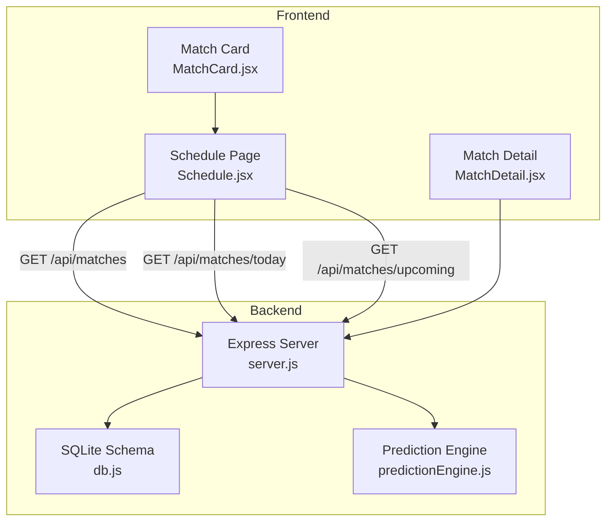
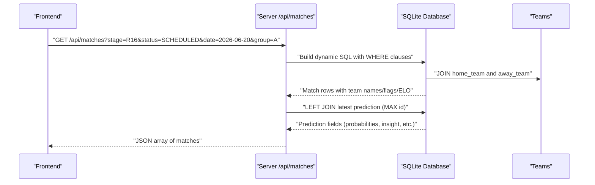
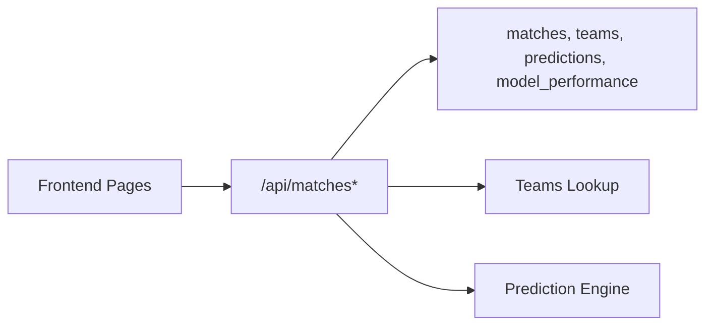

# Matches Listing & Filtering

<cite>
**Referenced Files in This Document**
- [server.js](file://backend/server.js)
- [db.js](file://backend/database/db.js)
- [SPEC.md](file://specs/SPEC.md)
- [MatchCard.jsx](file://frontend/src/components/MatchCard.jsx)
- [Schedule.jsx](file://frontend/src/pages/Schedule.jsx)
- [MatchDetail.jsx](file://frontend/src/pages/MatchDetail.jsx)
- [predictionEngine.js](file://backend/services/predictionEngine.js)
- [bracketService.js](file://backend/services/bracketService.js)
</cite>

## Table of Contents
1. [Introduction](#introduction)
2. [Project Structure](#project-structure)
3. [Core Components](#core-components)
4. [Architecture Overview](#architecture-overview)
5. [Detailed Component Analysis](#detailed-component-analysis)
6. [Dependency Analysis](#dependency-analysis)
7. [Performance Considerations](#performance-considerations)
8. [Troubleshooting Guide](#troubleshooting-guide)
9. [Conclusion](#conclusion)

## Introduction
This document provides comprehensive documentation for the matches listing endpoints that power the World Cup 2026 prediction application. It covers:
- GET /api/matches with robust filtering by stage, status, date, and group
- GET /api/matches/today for current-day matches
- GET /api/matches/upcoming for the next few days, grouped by date
It also explains the response schemas, prediction data linkage, stage categories, status enumeration, and date range filtering. Practical filtering workflows and data presentation patterns are included, along with the relationship between matches and their associated predictions, team information, and venue data.

## Project Structure
The matches endpoints are implemented in the backend server and backed by a SQLite database schema. Frontend pages consume these endpoints to render match listings and details.

**Diagram sources**
- [server.js:110-216](file://backend/server.js#L110-L216)
- [db.js:51-70](file://backend/database/db.js#L51-L70)
- [Schedule.jsx:149-154](file://frontend/src/pages/Schedule.jsx#L149-L154)
- [MatchCard.jsx:21-175](file://frontend/src/components/MatchCard.jsx#L21-L175)
- [MatchDetail.jsx:24-925](file://frontend/src/pages/MatchDetail.jsx#L24-L925)
- [predictionEngine.js:1-200](file://backend/services/predictionEngine.js#L1-L200)

**Section sources**
- [server.js:110-216](file://backend/server.js#L110-L216)
- [db.js:51-70](file://backend/database/db.js#L51-L70)
- [Schedule.jsx:135-484](file://frontend/src/pages/Schedule.jsx#L135-L484)
- [MatchCard.jsx:1-175](file://frontend/src/components/MatchCard.jsx#L1-L175)
- [MatchDetail.jsx:24-925](file://frontend/src/pages/MatchDetail.jsx#L24-L925)

## Core Components
- Matches endpoint with dynamic filtering
  - Endpoint: GET /api/matches
  - Query parameters: stage, status, date, group
  - Response: Array of match records with team names/flags/ELO and latest prediction data
- Today's matches endpoint
  - Endpoint: GET /api/matches/today
  - Response: Array of matches scheduled for today
- Upcoming matches endpoint
  - Endpoint: GET /api/matches/upcoming
  - Response: Object with dates array containing grouped matches for the next 4 days (excluding completed matches)

Key data relationships:
- matches table links to teams via home_team and away_team
- predictions table contains the latest prediction snapshot per match
- model_performance tracks grading metrics for predictions

**Section sources**
- [server.js:110-216](file://backend/server.js#L110-L216)
- [db.js:51-94](file://backend/database/db.js#L51-L94)

## Architecture Overview
The matches listing pipeline integrates frontend filters with backend SQL queries and joins to teams and predictions.

**Diagram sources**
- [server.js:110-142](file://backend/server.js#L110-L142)
- [db.js:51-94](file://backend/database/db.js#L51-L94)

## Detailed Component Analysis

### GET /api/matches
- Purpose: Retrieve matches with comprehensive filtering
- Query parameters:
  - stage: Case-insensitive stage filter (GROUP, R32, R16, QF, SF, F, THIRD_PLACE)
  - status: Case-insensitive status filter (SCHEDULED, LIVE, COMPLETED)
  - date: Exact ISO date filter (YYYY-MM-DD)
  - group: Case-insensitive group code filter (A–L)
- Response schema (selected fields):
  - Match identifiers and scheduling
    - id, stage, group_code, match_number, scheduled_date, scheduled_time, venue
  - Status and results
    - status, home_score, away_score, home_score_pens, away_score_pens, winner
  - Team identifiers
    - home_team, away_team
  - Team metadata (joined)
    - home_name, home_flag, home_elo, away_name, away_flag, away_elo
  - Latest prediction (joined)
    - prob_home, prob_draw, prob_away, most_likely_score, confidence, top_scores, insight
  - Model performance (joined)
    - graded_points
- Notes:
  - Filters are applied as additional AND conditions
  - Results ordered by scheduled_date, then id
  - Predictions are joined using the latest prediction id per match

Practical filtering workflows:
- Stage-only filtering: /api/matches?stage=R16
- Status-only filtering: /api/matches?status=COMPLETED
- Date-only filtering: /api/matches?date=2026-07-15
- Group-only filtering: /api/matches?group=A
- Combined filters: /api/matches?stage=R16&status=SCHEDULED&date=2026-06-20&group=A

**Section sources**
- [server.js:110-142](file://backend/server.js#L110-L142)
- [db.js:51-94](file://backend/database/db.js#L51-L94)

### GET /api/matches/today
- Purpose: Retrieve matches scheduled for the current date
- Behavior:
  - Uses today’s ISO date (YYYY-MM-DD)
  - Joins team and prediction data similar to the main endpoint
  - Orders by match id
- Response schema: Same as /api/matches excluding the group_code field in the joined query

Practical usage:
- Load today’s matches for the dashboard or notifications

**Section sources**
- [server.js:144-165](file://backend/server.js#L144-L165)
- [db.js:51-94](file://backend/database/db.js#L51-L94)

### GET /api/matches/upcoming
- Purpose: Retrieve the next 4 calendar days of scheduled matches (excluding completed)
- Behavior:
  - Finds the first date with scheduled matches after today
  - Returns matches from that date through 3 days later (inclusive)
  - Excludes completed matches
  - Groups results by a derived SGT date key (date or date+time adjusted to SGT)
- Response schema:
  - dates: Array of { date, matches: Match[] }
  - Each match includes team and prediction data as in the main endpoint

Practical usage:
- Render a multi-day schedule with grouped matches

**Section sources**
- [server.js:167-216](file://backend/server.js#L167-L216)
- [db.js:51-94](file://backend/database/db.js#L51-L94)

### Response Data Presentation Patterns
- Frontend consumption:
  - Schedule page fetches all matches and applies client-side filtering and grouping
  - Match cards display confidence badges, status chips, and prediction bars
  - Match detail page shows prediction breakdown, agent insights, and historical predictions
- Grouping mechanisms:
  - Backend grouping for upcoming: by derived SGT date key
  - Frontend grouping for schedule: by date and by stage

**Section sources**
- [Schedule.jsx:149-154](file://frontend/src/pages/Schedule.jsx#L149-L154)
- [Schedule.jsx:156-187](file://frontend/src/pages/Schedule.jsx#L156-L187)
- [MatchCard.jsx:15-78](file://frontend/src/components/MatchCard.jsx#L15-L78)
- [MatchDetail.jsx:24-925](file://frontend/src/pages/MatchDetail.jsx#L24-L925)

### Match Status Enumeration
- Values: SCHEDULED, LIVE, COMPLETED
- Used in:
  - matches.status column
  - Upcoming endpoint excludes COMPLETED matches
  - Frontend displays status chips and live indicators

**Section sources**
- [db.js:62-69](file://backend/database/db.js#L62-L69)
- [server.js:174-200](file://backend/server.js#L174-L200)

### Stage Categories
- Group stage: GROUP
- Knockout stages: R32, R16, QF, SF, F
- Third place: THIRD_PLACE
- Priority ordering for active stage selection:
  - GROUP < R32 < R16 < QF < SF < F = THIRD_PLACE

**Section sources**
- [db.js:54-55](file://backend/database/db.js#L54-L55)
- [SPEC.md:11-22](file://specs/SPEC.md#L11-L22)
- [server.js:403-412](file://backend/server.js#L403-L412)
- [bracketService.js:931-945](file://backend/services/bracketService.js#L931-L945)

### Date Range Filtering
- Exact date filtering: /api/matches?date=YYYY-MM-DD
- Upcoming grouping: Next 4 calendar days starting from the first future scheduled date
- Timezone handling:
  - Upcoming grouping adjusts scheduled_time to SGT (UTC+8) for grouping keys
  - Frontend displays SGT times consistently

**Section sources**
- [server.js:136-137](file://backend/server.js#L136-L137)
- [server.js:182-210](file://backend/server.js#L182-L210)
- [SPEC.md:200-205](file://specs/SPEC.md#L200-L205)

### Relationship Between Matches and Predictions
- Predictions are linked per match via the latest prediction id
- Prediction fields include:
  - Probabilities: prob_home, prob_draw, prob_away
  - Most likely scoreline: most_likely_score
  - Confidence: LOW, MEDIUM, HIGH, VERY_HIGH
  - Top scores: top_scores (JSON array of top scorelines)
  - Insight: human-readable explanation
  - Graded points: points from model_performance
- Prediction generation:
  - Backbone: Dixon-Coles bivariate Poisson with online α/β updates
  - Multi-agent orchestration (optional) blends specialist agent outputs
  - Predictions are refreshed nightly for the active stage

**Section sources**
- [server.js:124-129](file://backend/server.js#L124-L129)
- [db.js:72-94](file://backend/database/db.js#L72-L94)
- [predictionEngine.js:1-200](file://backend/services/predictionEngine.js#L1-L200)
- [SPEC.md:125-178](file://specs/SPEC.md#L125-L178)

### Team Information and Venue Data
- Team data:
  - Joined match records include team names, flags, and ELO ratings
  - Team table includes group_code, confederation, FIFA rank/points, and ELO
- Venue data:
  - matches.venue holds the venue name
  - Venue effects influence goal expectation in the prediction engine

**Section sources**
- [server.js:115-123](file://backend/server.js#L115-L123)
- [db.js:26-49](file://backend/database/db.js#L26-L49)
- [db.js:51-70](file://backend/database/db.js#L51-L70)
- [predictionEngine.js:102-133](file://backend/services/predictionEngine.js#L102-L133)

## Dependency Analysis
The matches endpoints depend on:
- Database schema for matches, teams, predictions, and model_performance
- Prediction engine for confidence thresholds and scoring logic
- Frontend pages for consuming and presenting match data

**Diagram sources**
- [server.js:110-216](file://backend/server.js#L110-L216)
- [db.js:51-110](file://backend/database/db.js#L51-L110)
- [predictionEngine.js:364-371](file://backend/services/predictionEngine.js#L364-L371)
- [Schedule.jsx:149-154](file://frontend/src/pages/Schedule.jsx#L149-L154)

**Section sources**
- [server.js:110-216](file://backend/server.js#L110-L216)
- [db.js:51-110](file://backend/database/db.js#L51-L110)
- [predictionEngine.js:364-371](file://backend/services/predictionEngine.js#L364-L371)
- [Schedule.jsx:149-154](file://frontend/src/pages/Schedule.jsx#L149-L154)

## Performance Considerations
- Dynamic query building with parameterized filters prevents SQL injection and supports efficient indexing
- Latest prediction join uses MAX(id) per match; ensure appropriate indexes exist on predictions(match_id, id)
- Upcoming grouping in memory after database retrieval; consider database-side grouping for very large datasets
- Prediction confidence thresholds are computed in the prediction engine; keep calculations lightweight

## Troubleshooting Guide
Common issues and resolutions:
- Empty results for /api/matches/upcoming
  - Verify matches exist after today and are not all COMPLETED
  - Confirm scheduled_date boundaries and timezone adjustments
- Unexpected empty predictions
  - Ensure predictions exist for scheduled matches in the active stage
  - Check prediction generation cron and manual batch generation endpoint
- Incorrect date grouping
  - Confirm scheduled_time is set and SGT conversion logic aligns with frontend expectations
- Status mismatches
  - Use exact status values: SCHEDULED, LIVE, COMPLETED

**Section sources**
- [server.js:171-200](file://backend/server.js#L171-L200)
- [SPEC.md:170-178](file://specs/SPEC.md#L170-L178)

## Conclusion
The matches listing endpoints provide flexible, efficient filtering and grouping for the World Cup 2026 application. They integrate seamlessly with team and prediction data, enabling rich frontend presentations and robust operational workflows for prediction generation and live result synchronization.