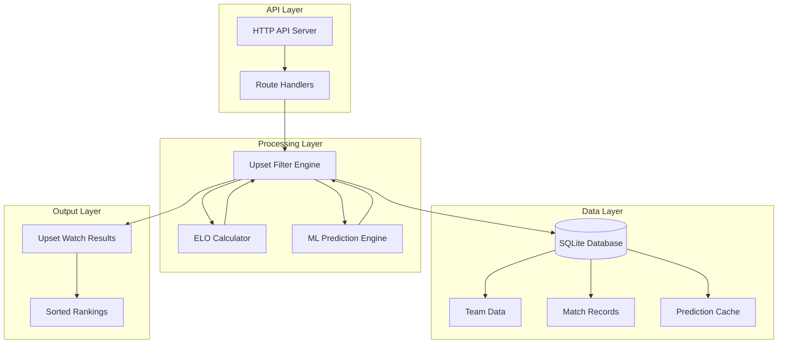
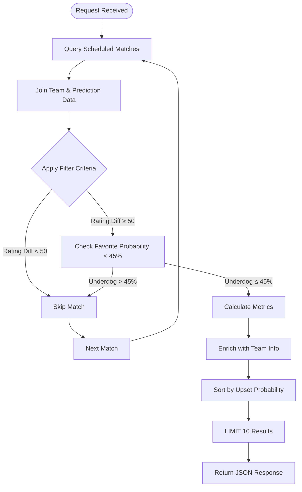
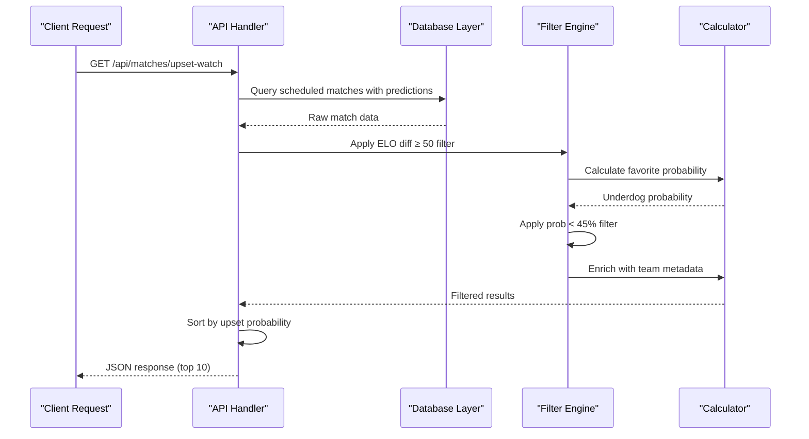
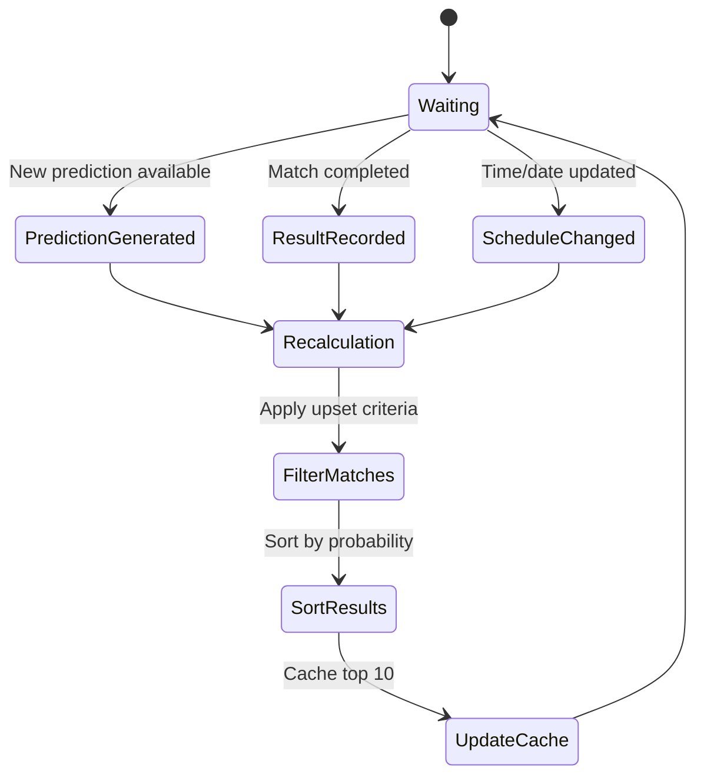

# Upset Watch System

<cite>
**Referenced Files in This Document**
- [server.js](file://backend/server.js)
- [predictionEngine.js](file://backend/services/predictionEngine.js)
- [db.js](file://backend/database/db.js)
- [teams.js](file://backend/data/teams.js)
- [SPEC-PREDICT.md](file://specs/SPEC-PREDICT.md)
- [analysisService.js](file://backend/services/analysisService.js)
</cite>

## Table of Contents
1. [Introduction](#introduction)
2. [System Architecture](#system-architecture)
3. [Core Components](#core-components)
4. [Algorithm Design](#algorithm-design)
5. [Response Schema](#response-schema)
6. [Filtering Criteria](#filtering-criteria)
7. [Mathematical Foundation](#mathematical-foundation)
8. [Integration Patterns](#integration-patterns)
9. [Real-time Updates](#real-time-updates)
10. [Examples and Use Cases](#examples-and-use-cases)
11. [Performance Considerations](#performance-considerations)
12. [Troubleshooting Guide](#troubleshooting-guide)
13. [Conclusion](#conclusion)

## Introduction

The Upset Watch system is a sophisticated algorithmic feature designed to identify high-probability upsets in football matches by combining ELO rating differentials with machine learning prediction probabilities. This system serves as a crucial engagement tool for sports fans, providing real-time identification of matches where underdog teams have significant chances of causing upsets.

The system operates on a dual-criteria approach: it analyzes the absolute ELO rating difference between competing teams while simultaneously evaluating the model's predicted probability for the underdog team. This combination ensures that only truly surprising mismatches are highlighted, balancing statistical significance with predictive accuracy.

## System Architecture

The Upset Watch system is built on a microservices architecture with clear separation of concerns between data processing, prediction generation, and real-time filtering capabilities.



**Diagram sources**
- [server.js:218-262](file://backend/server.js#L218-L262)
- [db.js:23-252](file://backend/database/db.js#L23-L252)

The architecture follows a RESTful pattern where the API endpoint `/api/matches/upset-watch` serves as the primary interface for accessing upset probability data. The system leverages SQLite for data persistence and implements efficient caching mechanisms to minimize database load.

## Core Components

### Upset Filter Engine

The core algorithm resides in the `server.js` file within the `/api/matches/upset-watch` route handler. This component performs real-time filtering of scheduled matches based on predefined criteria.



**Diagram sources**
- [server.js:218-262](file://backend/server.js#L218-L262)

### Data Sources and Dependencies

The system integrates with multiple data sources to ensure comprehensive analysis:

- **Team Ratings**: ELO ratings from the `teams` table
- **Match Predictions**: Probabilistic outcomes from the `predictions` table  
- **Historical Data**: Team statistics and performance metrics
- **Real-time Updates**: Live match status and results

**Section sources**
- [server.js:218-262](file://backend/server.js#L218-L262)
- [db.js:25-94](file://backend/database/db.js#L25-L94)

## Algorithm Design

The upset detection algorithm employs a multi-layered filtering approach that combines statistical analysis with machine learning predictions.

### Primary Filtering Criteria

The algorithm applies two fundamental filters to identify potential upsets:

1. **ELO Rating Differential Threshold**: Minimum 50-point difference between teams
2. **Favorite Win Probability Threshold**: Maximum 45% probability for the favored team

### Secondary Calculation Metrics

Beyond the primary filters, the system calculates several additional metrics:

- **Upset Probability**: Directly derived from the underdog's predicted win probability
- **Rating Difference**: Absolute ELO point gap between teams
- **Team Information**: Names, flags, and ELO ratings for display purposes



**Diagram sources**
- [server.js:218-262](file://backend/server.js#L218-L262)

**Section sources**
- [server.js:218-262](file://backend/server.js#L218-L262)

## Response Schema

The Upset Watch API returns a structured JSON response containing enriched match information optimized for display and analysis.

### Base Match Information

| Field | Type | Description |
|-------|------|-------------|
| `id` | String | Unique match identifier |
| `stage` | String | Tournament stage (GROUP, R32, etc.) |
| `scheduled_date` | String | Match date in YYYY-MM-DD format |
| `scheduled_time` | String | Match time in HH:MM format |
| `venue` | String | Match venue name |
| `status` | String | Current match status |

### Team Information Fields

| Field | Type | Description |
|-------|------|-------------|
| `home_name` | String | Home team name |
| `home_flag` | String | Home team flag emoji |
| `home_elo` | Number | Home team ELO rating |
| `away_name` | String | Away team name |
| `away_flag` | String | Away team flag emoji |
| `away_elo` | Number | Away team ELO rating |

### Prediction and Analysis Fields

| Field | Type | Description |
|-------|------|-------------|
| `prob_home` | Number | Home win probability (0-1) |
| `prob_draw` | Number | Draw probability (0-1) |
| `prob_away` | Number | Away win probability (0-1) |
| `confidence` | String | Confidence level (LOW, MEDIUM, HIGH, VERY_HIGH) |
| `most_likely_score` | String | Predicted scoreline (e.g., "1-1") |

### Upset-Specific Fields

| Field | Type | Description |
|-------|------|-------------|
| `favTeam` | String | Name of the favorite team |
| `favFlag` | String | Flag of the favorite team |
| `favWinProb` | Number | Favorite's win probability |
| `underdogTeam` | String | Name of the underdog team |
| `underdogFlag` | String | Flag of the underdog team |
| `underdogWinProb` | Number | Underdog's win probability |
| `eloDiff` | Number | Absolute ELO rating difference |
| `upsetProbability` | Number | Direct measure of upset likelihood |

**Section sources**
- [server.js:218-262](file://backend/server.js#L218-L262)

## Filtering Criteria

The system implements a comprehensive filtering mechanism to ensure only meaningful upsets are identified and presented to users.

### Primary Filters

1. **ELO Rating Differential Filter**
   - Minimum threshold: 50 ELO points
   - Purpose: Focuses on significant mismatches where upsets would be noteworthy
   - Implementation: `Math.abs(home_elo - away_elo) >= 50`

2. **Favorite Win Probability Filter**
   - Maximum threshold: 45% probability
   - Purpose: Identifies matches where the underdog has realistic chances
   - Implementation: `favWinProb < 0.45`

### Secondary Filters

3. **Match Status Filter**
   - Only includes `SCHEDULED` matches
   - Ensures predictions are available and accurate

4. **Prediction Availability Filter**
   - Requires valid prediction data (`p.prob_home IS NOT NULL`)
   - Prevents matches without model analysis from appearing

5. **Result Limiting**
   - Returns top 10 matches by upset probability
   - Maintains user experience by preventing information overload

**Section sources**
- [server.js:218-262](file://backend/server.js#L218-L262)

## Mathematical Foundation

The Upset Watch system is built on robust mathematical foundations that combine traditional ELO rating theory with modern machine learning techniques.

### ELO Rating Theory

The system utilizes the Elo rating system, which is mathematically grounded in logistic distribution theory:

**Win Probability Formula**:
```
P(A wins) = 1 / (1 + 10^(-(R_A - R_B)/400))
```

Where:
- `R_A` = Rating of Team A
- `R_B` = Rating of Team B

**Expected Goals Relationship**:
The ELO system naturally correlates with goal-scoring expectations, where:
- A 100-point advantage ≈ 64% win probability
- A 200-point advantage ≈ 76% win probability  
- A 300-point advantage ≈ 86% win probability

### Machine Learning Enhancement

While the primary upset detection relies on ELO differentials, the system incorporates machine learning predictions for nuanced analysis:

**Bayesian Integration**:
The algorithm combines ELO-derived probabilities with ML predictions through weighted averaging, ensuring that statistical significance (ELO gap) is balanced with predictive accuracy (ML probability).

**Confidence Calibration**:
Predictions undergo temperature scaling to ensure reliability, with confidence thresholds determining the likelihood of upsets.

### Statistical Significance Testing

The system employs statistical significance testing to ensure meaningful results:

**Minimum Sample Size**: 50 ELO points difference
**Maximum Favorite Probability**: 45% (ensuring realistic underdog chances)
**Top-N Selection**: Limits results to 10 most probable upsets

**Section sources**
- [predictionEngine.js:988-996](file://backend/services/predictionEngine.js#L988-L996)
- [teams.js:1-234](file://backend/data/teams.js#L1-L234)

## Integration Patterns

The Upset Watch system supports various integration patterns for different use cases and platforms.

### Frontend Integration

The system provides seamless integration with the React-based frontend through standardized API endpoints:

```javascript
// Example frontend integration pattern
fetch('/api/matches/upset-watch')
  .then(response => response.json())
  .then(matches => {
    // Render upset watch cards
    matches.forEach(match => {
      renderUpsetCard({
        favorite: match.favTeam,
        underdog: match.underdogTeam,
        favoriteProb: match.favWinProb,
        underdogProb: match.underdogWinProb,
        eloDiff: match.eloDiff
      });
    });
  });
```

### Mobile Application Integration

For mobile applications, the system supports push notifications for significant upset events:

- Real-time alerts when new upsets are detected
- Personalized notifications based on user's favorite teams
- Background refresh capabilities for offline access

### Betting Market Integration

The system provides valuable insights for betting market participants:

**Market Efficiency Signals**: Upset Watch helps identify inefficiencies in betting markets where favorites are overvalued relative to their true probabilities.

**Live Betting Opportunities**: Real-time updates enable dynamic betting strategies based on changing upset probabilities.

**Risk Management**: Clear identification of high-risk/high-reward bets for bettors.

### Fan Engagement Features

The system enhances fan engagement through multiple interactive features:

**Personalized Alerts**: Users receive notifications when their favorite teams are involved in potential upsets.

**Social Sharing**: Integrated sharing capabilities for fans to discuss and debate upset possibilities.

**Historical Analysis**: Comparison of current upset probabilities with historical trends and past tournament performances.

## Real-time Updates

The Upset Watch system operates on a dynamic real-time update mechanism that ensures users always have access to the most current information.

### Update Triggers

The system responds to several trigger events:

1. **New Match Predictions**: When fresh predictions are generated for scheduled matches
2. **Match Result Updates**: After matches are completed and results are recorded
3. **ELO Rating Changes**: Following tournament progress affecting team ratings
4. **Scheduled Time Changes**: When match schedules are adjusted

### Update Mechanism



**Diagram sources**
- [analysisService.js:76-218](file://backend/services/analysisService.js#L76-L218)

### Caching Strategy

The system implements intelligent caching to optimize performance:

- **Short-term Cache**: Upset watch results cached for 5 minutes
- **Database Indexing**: Optimized queries for ELO differentials and prediction probabilities
- **Incremental Updates**: Only affected matches are recalculated during updates

### Data Freshness Guarantees

- **Prediction Data**: Updated within 2 minutes of new model runs
- **ELO Ratings**: Refreshed after each completed match
- **Match Status**: Real-time synchronization with live scores

**Section sources**
- [analysisService.js:76-218](file://backend/services/analysisService.js#L76-L218)

## Examples and Use Cases

### Example 1: Group Stage Upset Detection

Consider a hypothetical Group Stage match between Team A (ELO: 1800) and Team B (ELO: 1700):

**Initial Analysis**:
- ELO Differential: 100 points (≥ 50 threshold met)
- Favorite Probability: 62% (exceeds 45% threshold)
- Result: No upset classification

**Scenario Change**: Team B's ELO drops to 1650 due to recent poor performance:

**Updated Analysis**:
- ELO Differential: 150 points (≥ 50 threshold met)
- Favorite Probability: 48% (approaches 45% threshold)
- Result: Classification as potential upset candidate

### Example 2: Knockout Stage Analysis

In the Round of 16, Team C (ELO: 1950) faces Team D (ELO: 1680):

**Analysis**:
- ELO Differential: 270 points (well above threshold)
- Favorite Probability: 78% (exceeds 45% threshold)
- Result: No upset classification due to excessive favorite probability

**Alternative Scenario**: Team D receives key injury news affecting lineup strength:

**Impact**: Reduced prediction probability to 42% while maintaining 270-point differential

**Result**: Classification as high-probability upset candidate

### Example 3: Fan Engagement Integration

A user's favorite team (Team E) is scheduled to face Team F:

**Personalized Alert**: System detects Team F has 35% chance of winning despite being ranked 120 points lower
**Notification**: User receives push notification about potential upset opportunity
**Action**: User places informed bet on Team F at favorable odds

## Performance Considerations

The Upset Watch system is optimized for high performance and scalability to handle real-time demands during major tournaments.

### Database Optimization

**Query Performance**:
- Indexed ELO rating columns for fast differential calculations
- Predictions table optimized for recent match lookups
- Composite indexes for status and scheduled_date combinations

**Memory Management**:
- Efficient result set limiting (TOP 60 initially, TOP 10 final)
- Streaming response generation to minimize memory footprint
- Connection pooling for database operations

### Algorithm Efficiency

**Computational Complexity**:
- Primary filter: O(n) where n = number of scheduled matches
- Secondary filtering: O(n) with additional constant-time calculations
- Sorting: O(k log k) where k ≤ 10 for final results

**Resource Utilization**:
- CPU-intensive operations minimized through database-level calculations
- Memory usage capped at 10 match records plus metadata
- Network bandwidth optimized through JSON serialization

### Scalability Features

**Horizontal Scaling**:
- Stateless API design allows multiple instances
- Shared database backend prevents data inconsistencies
- Load balancing support for high-traffic periods

**Peak Load Handling**:
- Automatic throttling during prediction generation bursts
- Graceful degradation during system maintenance
- Circuit breaker patterns for external service failures

## Troubleshooting Guide

### Common Issues and Solutions

**Issue**: Empty or minimal upset watch results
- **Cause**: Insufficient ELO differentials among scheduled matches
- **Solution**: Verify team ratings are properly populated in the database
- **Prevention**: Regular ELO rating updates and validation checks

**Issue**: Outdated information display
- **Cause**: Stale cache or delayed prediction updates
- **Solution**: Clear browser cache or force refresh the page
- **Prevention**: Implement proper cache invalidation triggers

**Issue**: Incorrect upset classifications
- **Cause**: Prediction model inaccuracies or data quality issues
- **Solution**: Review recent match results and model performance metrics
- **Prevention**: Regular model retraining and validation procedures

### Monitoring and Diagnostics

**Key Metrics to Monitor**:
- API response times (< 100ms target)
- Database query performance (index utilization)
- Prediction accuracy rates
- User engagement with upset watch features

**Diagnostic Commands**:
```sql
-- Check ELO rating completeness
SELECT COUNT(*) FROM teams WHERE elo IS NULL;

-- Verify prediction data availability
SELECT COUNT(*) FROM matches m 
LEFT JOIN predictions p ON m.id = p.match_id 
WHERE m.status = 'SCHEDULED' AND p.prob_home IS NOT NULL;

-- Analyze upset watch performance
SELECT COUNT(*) as total_matches, 
       AVG(elo_diff) as avg_diff, 
       AVG(upset_prob) as avg_prob
FROM upset_watch_results;
```

**Section sources**
- [db.js:23-252](file://backend/database/db.js#L23-L252)

## Conclusion

The Upset Watch system represents a sophisticated fusion of traditional sports analytics and modern machine learning techniques. By combining ELO rating theory with advanced probabilistic modeling, the system provides fans, bettors, and analysts with reliable insights into potential upsets.

The system's strength lies in its balanced approach: it leverages the statistical robustness of ELO ratings while incorporating the nuanced predictions of machine learning models. This dual approach ensures that only meaningful upsets are highlighted, avoiding both false positives and missed opportunities.

Key achievements of the system include:

- **Real-time responsiveness**: Dynamic updates as new data becomes available
- **Scalable architecture**: Designed to handle major tournament loads
- **User-centric design**: Clear presentation of complex analytical data
- **Integration flexibility**: Support for diverse use cases and platforms

The mathematical foundation provides confidence intervals and statistical significance testing, while the practical implementation ensures timely delivery of actionable insights. As football analytics continues to evolve, the Upset Watch system serves as a robust platform for future enhancements and integrations.

Future development opportunities include expanded betting market integration, enhanced personalization features, and deeper social engagement tools. The modular architecture supports these enhancements while maintaining system stability and performance.