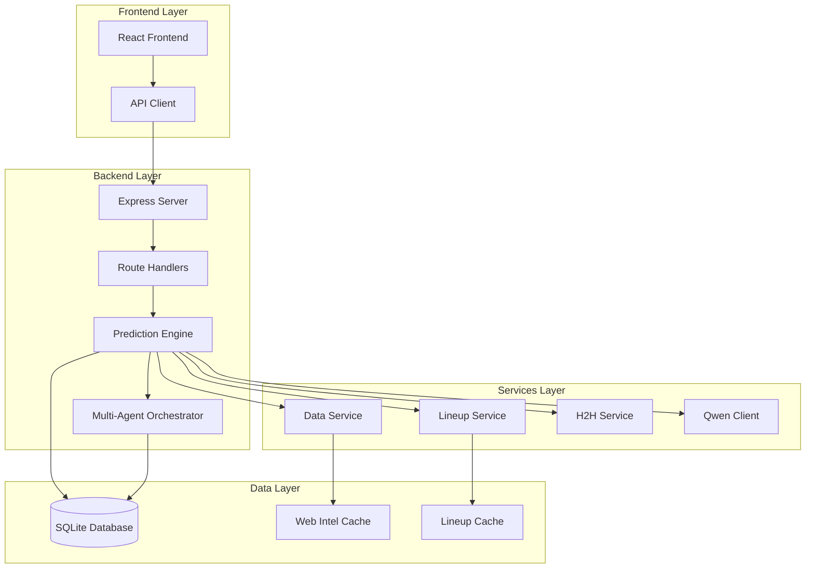
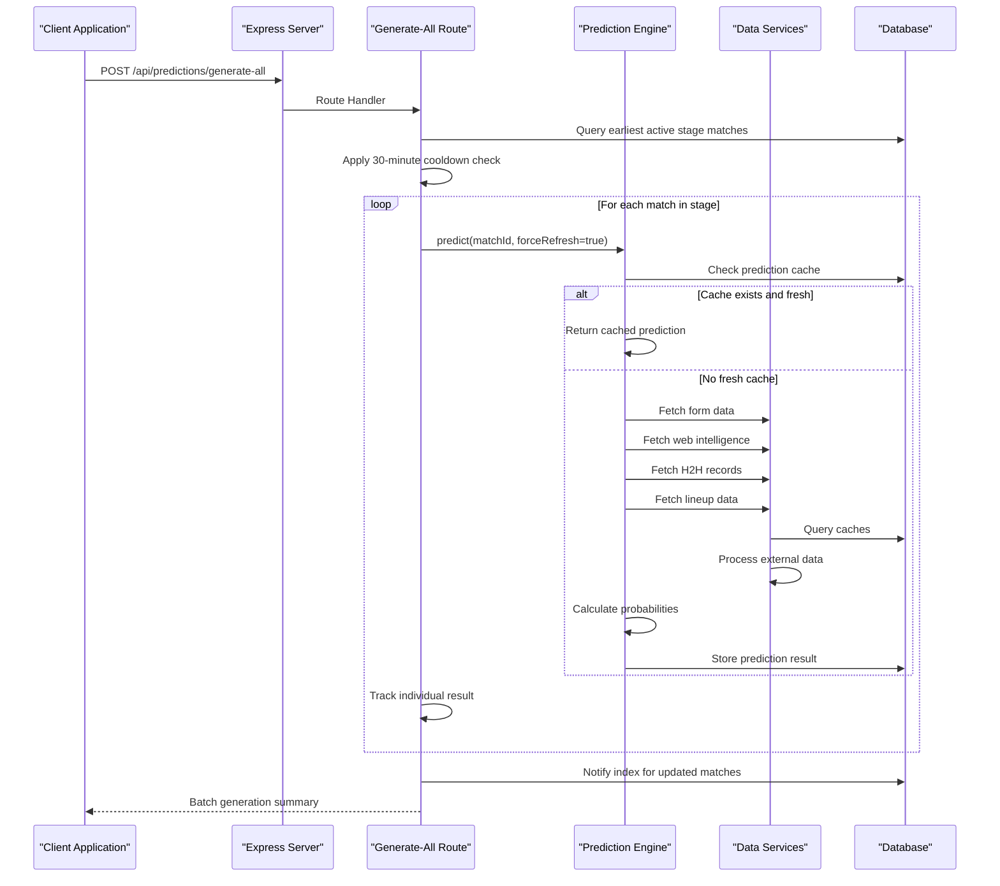
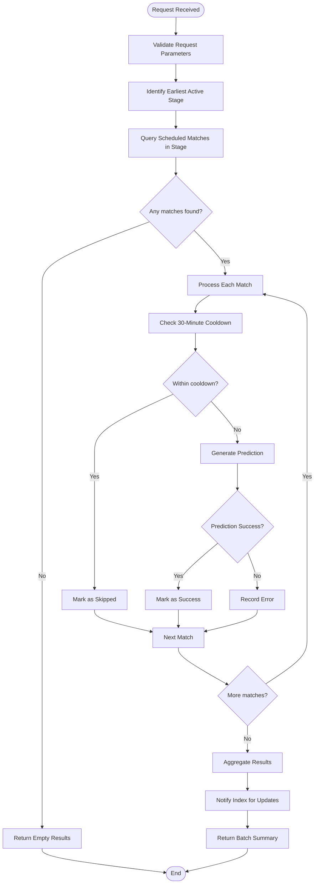
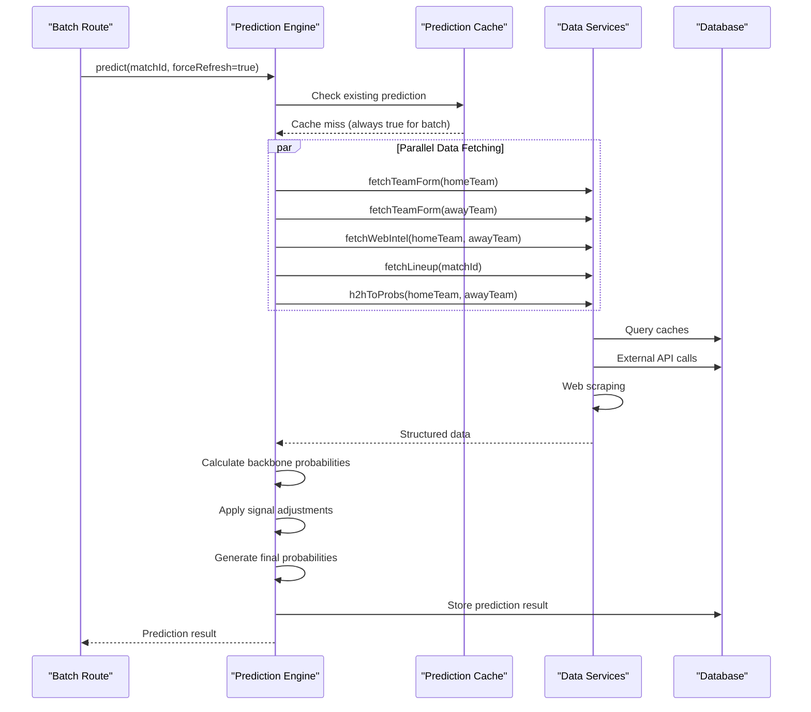
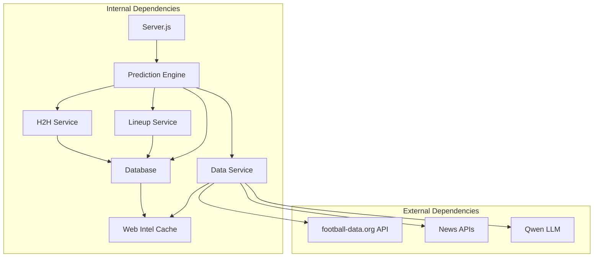

# Batch Prediction Generation

<cite>
**Referenced Files in This Document**
- [server.js](file://backend/server.js)
- [client.js](file://frontend/src/api/client.js)
- [predictionEngine.js](file://backend/services/predictionEngine.js)
- [dataService.js](file://backend/services/dataService.js)
- [lineupService.js](file://backend/services/lineupService.js)
- [h2hService.js](file://backend/services/h2hService.js)
- [orchestratorAgent.js](file://backend/services/agents/orchestratorAgent.js)
- [db.js](file://backend/database/db.js)
</cite>

## Table of Contents
1. [Introduction](#introduction)
2. [Project Structure](#project-structure)
3. [Core Components](#core-components)
4. [Architecture Overview](#architecture-overview)
5. [Detailed Component Analysis](#detailed-component-analysis)
6. [Dependency Analysis](#dependency-analysis)
7. [Performance Considerations](#performance-considerations)
8. [Troubleshooting Guide](#troubleshooting-guide)
9. [Conclusion](#conclusion)

## Introduction
This document provides comprehensive technical documentation for the POST /api/predictions/generate-all endpoint, which enables batch prediction generation across all scheduled World Cup 2026 matches. The endpoint orchestrates systematic prediction generation for the earliest active tournament stage, implements intelligent scheduling and cooldown mechanisms, and integrates with the prediction engine and data services to deliver accurate probabilistic forecasts.

The batch generation workflow targets the earliest active stage (GROUP, R32, R16, QF, SF, F, or THIRD_PLACE) and processes all scheduled matches within that stage. It includes sophisticated error handling, partial failure management, progress tracking, and performance optimization strategies including parallel processing and caching.

## Project Structure
The batch prediction generation spans multiple layers of the application architecture:

**Diagram sources**
- [server.js:399-461](file://backend/server.js#L399-L461)
- [predictionEngine.js:665-729](file://backend/services/predictionEngine.js#L665-L729)
- [dataService.js:413-490](file://backend/services/dataService.js#L413-L490)

**Section sources**
- [server.js:399-461](file://backend/server.js#L399-L461)
- [client.js:30-31](file://frontend/src/api/client.js#L30-L31)

## Core Components

### API Endpoint Implementation
The POST /api/predictions/generate-all endpoint serves as the primary interface for batch prediction generation. It implements intelligent stage prioritization, systematic match processing, and comprehensive error handling.

**Key Features:**
- **Stage Priority Logic**: Automatically identifies the earliest active tournament stage and processes all matches within that stage
- **Cooldown Protection**: Prevents excessive regeneration by enforcing a 30-minute cooldown period per match
- **Parallel Processing**: Processes multiple matches concurrently while maintaining individual error isolation
- **Progress Tracking**: Provides detailed results for each processed match including success/failure status
- **Smart Caching**: Leverages prediction engine's caching mechanism to avoid redundant computations

**Section sources**
- [server.js:399-461](file://backend/server.js#L399-L461)

### Prediction Engine Integration
The batch endpoint delegates individual prediction computation to the prediction engine, which implements a sophisticated multi-stage calculation pipeline:

1. **Cache Check**: First checks for existing predictions to avoid unnecessary recomputation
2. **Multi-Agent Path**: When enabled, coordinates specialized agents for comprehensive analysis
3. **Backbone Calculation**: Executes Dixon-Coles Poisson model with attack/defense ratings
4. **Signal Integration**: Incorporates form, head-to-head, intelligence, lineup, and rest-day factors
5. **Output Generation**: Produces probabilistic outcomes with confidence metrics and insights

**Section sources**
- [predictionEngine.js:665-729](file://backend/services/predictionEngine.js#L665-L729)
- [predictionEngine.js:732-800](file://backend/services/predictionEngine.js#L732-L800)

### Data Services Integration
The batch generation leverages multiple data services to enrich predictions with external information:

- **Form Data**: Recent team performance from football-data.org API and web scraping
- **Intelligence**: Pre-match injury news, squad news, and motivation factors
- **Lineup Information**: Confirmed starting XI strength and key absences
- **Historical Records**: Real head-to-head statistics from international results database

**Section sources**
- [dataService.js:68-133](file://backend/services/dataService.js#L68-L133)
- [dataService.js:413-490](file://backend/services/dataService.js#L413-L490)
- [lineupService.js:221-316](file://backend/services/lineupService.js#L221-L316)
- [h2hService.js:192-312](file://backend/services/h2hService.js#L192-L312)

## Architecture Overview

**Diagram sources**
- [server.js:399-461](file://backend/server.js#L399-L461)
- [predictionEngine.js:665-729](file://backend/services/predictionEngine.js#L665-L729)
- [dataService.js:68-133](file://backend/services/dataService.js#L68-L133)

## Detailed Component Analysis

### Request Processing Pipeline

The batch generation endpoint implements a sophisticated request processing pipeline with multiple optimization layers:

**Diagram sources**
- [server.js:399-461](file://backend/server.js#L399-L461)

### Prediction Generation Workflow

Each individual prediction follows a comprehensive workflow that balances computational efficiency with analytical depth:

**Diagram sources**
- [predictionEngine.js:732-800](file://backend/services/predictionEngine.js#L732-L800)
- [dataService.js:68-133](file://backend/services/dataService.js#L68-L133)

### Error Handling and Partial Failure Management

The batch system implements robust error handling to ensure graceful degradation:

**Individual Match Error Handling:**
- Each match processing is isolated from others
- Failures are recorded with specific error messages
- Successful matches continue processing unaffected
- Progress tracking maintains visibility into completion status

**System-Level Error Handling:**
- Network timeouts and external service failures are caught
- Database connection issues are handled gracefully
- Invalid match IDs and malformed requests are validated
- Resource exhaustion protection prevents cascading failures

**Section sources**
- [server.js:442-448](file://backend/server.js#L442-L448)

### Performance Optimization Strategies

The batch prediction system employs multiple optimization strategies to maximize throughput and minimize resource usage:

**Parallel Processing:**
- Individual match predictions execute concurrently
- Data fetching operations leverage Promise.allSettled for resilience
- Database operations are optimized with prepared statements
- Memory usage is controlled through streaming and batching

**Caching Mechanisms:**
- Prediction cache bypass for batch operations ensures fresh results
- Web intelligence caching reduces external API calls
- Lineup data caching prevents repeated scraping
- Database query result caching minimizes repeated computations

**Resource Management:**
- 30-minute cooldown prevents excessive regeneration
- Stage-based processing limits concurrent workload
- Timeout configurations protect against slow external services
- Connection pooling optimizes database access

**Section sources**
- [server.js:428-448](file://backend/server.js#L428-L448)
- [dataService.js:30-41](file://backend/services/dataService.js#L30-L41)

## Dependency Analysis

The batch prediction system creates a complex web of dependencies across multiple service layers:

**Diagram sources**
- [server.js:399-461](file://backend/server.js#L399-L461)
- [predictionEngine.js:665-729](file://backend/services/predictionEngine.js#L665-L729)
- [dataService.js:18-28](file://backend/services/dataService.js#L18-L28)

### Component Coupling Analysis

The batch system demonstrates moderate coupling with clear separation of concerns:

**High Cohesion Areas:**
- Prediction engine encapsulates all mathematical calculations
- Data services handle external data integration
- Database layer manages persistence and caching

**Interface Contracts:**
- Standardized prediction result format across all pathways
- Consistent error response structure
- Unified caching interface for all data services

**Potential Circular Dependencies:**
- Prediction engine imports data services and H2H services
- Data services import analysis service (broken via lazy loading)
- Multi-agent orchestrator imports prediction engine (broken via lazy loading)

**Section sources**
- [predictionEngine.js:37-53](file://backend/services/predictionEngine.js#L37-L53)
- [dataService.js:10-16](file://backend/services/dataService.js#L10-L16)

## Performance Considerations

### Throughput Optimization
The batch system achieves optimal throughput through strategic parallelization and resource management:

**Concurrency Control:**
- Individual match processing runs in parallel
- Data fetching operations utilize Promise.allSettled
- Database operations are optimized with prepared statements
- External API calls are rate-limited and cached

**Memory Management:**
- Streaming results prevent memory accumulation
- Temporary data structures are garbage collected promptly
- Large JSON objects are processed incrementally
- Database transactions are kept minimal

**Network Efficiency:**
- Shared HTTP clients reduce connection overhead
- Request batching minimizes network round trips
- Response compression reduces bandwidth usage
- Connection pooling optimizes resource utilization

### Scalability Factors
The system scales effectively due to its modular architecture and caching strategies:

**Horizontal Scaling:**
- Stateless design enables load balancing
- Database layer handles concurrent access
- Cache layer reduces database load
- External services are independently scalable

**Vertical Scaling:**
- CPU-intensive calculations benefit from multi-core systems
- Database optimization supports larger datasets
- Memory allocation scales with prediction volume
- Network bandwidth scales with concurrent requests

## Troubleshooting Guide

### Common Issues and Solutions

**Batch Generation Timeout:**
- **Symptoms**: Requests exceed 10-minute timeout
- **Causes**: Large number of matches, slow external services
- **Solutions**: Monitor external service health, adjust timeout settings, implement pagination

**External Service Failures:**
- **Symptoms**: Partial batch completion with errors
- **Causes**: API rate limits, network connectivity issues, service downtime
- **Solutions**: Implement retry logic, monitor service health, use fallback strategies

**Database Connection Problems:**
- **Symptoms**: Batch failures during persistence
- **Causes**: Connection pool exhaustion, database locks, disk space issues
- **Solutions**: Monitor connection pool usage, optimize queries, implement connection pooling

**Memory Exhaustion:**
- **Symptoms**: Out-of-memory errors during large batches
- **Causes**: Large prediction sets, inefficient data structures
- **Solutions**: Implement streaming, optimize data structures, monitor memory usage

### Monitoring and Debugging

**Key Metrics to Monitor:**
- Batch completion time per stage
- Individual match processing duration
- External service response times
- Database query performance
- Memory usage patterns
- Error rates by service

**Debugging Strategies:**
- Enable detailed logging for failed predictions
- Monitor external service health indicators
- Track database query performance
- Analyze cache hit ratios
- Review prediction accuracy metrics

**Section sources**
- [server.js:442-448](file://backend/server.js#L442-L448)
- [client.js:30-31](file://frontend/src/api/client.js#L30-L31)

## Conclusion

The POST /api/predictions/generate-all endpoint represents a sophisticated batch processing system that efficiently generates predictions across all scheduled World Cup 2026 matches. Its architecture balances computational efficiency with analytical depth, implementing robust error handling, intelligent scheduling, and comprehensive performance optimization.

Key strengths of the implementation include:
- **Intelligent Stage Processing**: Automatic identification and processing of the earliest active tournament stage
- **Robust Error Handling**: Isolated failure management with comprehensive progress tracking
- **Performance Optimization**: Strategic parallelization, caching, and resource management
- **Extensible Architecture**: Modular design enabling easy maintenance and future enhancements

The system successfully integrates multiple data sources, implements sophisticated prediction algorithms, and provides reliable batch processing capabilities essential for large-scale sports analytics applications. Future enhancements could focus on incremental processing, advanced caching strategies, and enhanced monitoring capabilities.