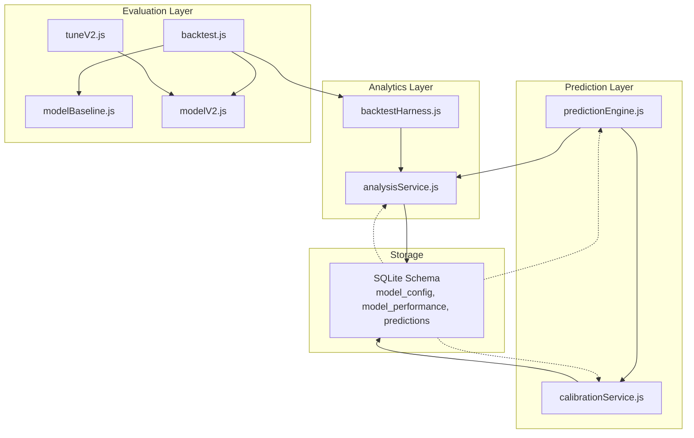
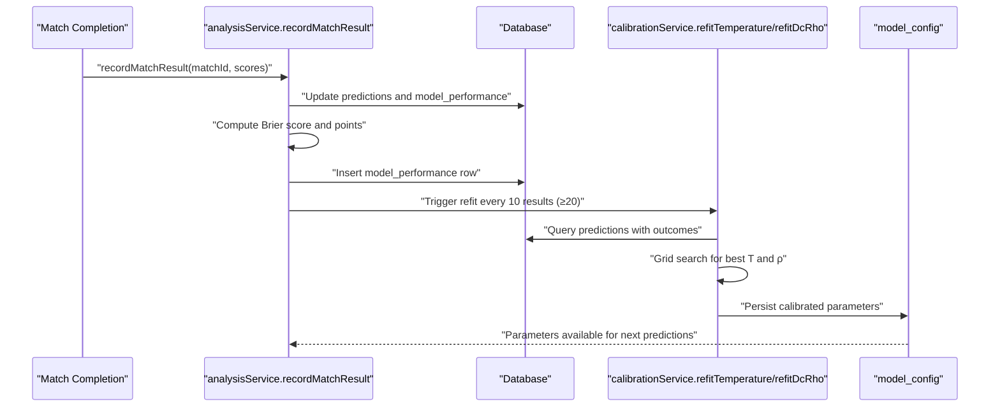
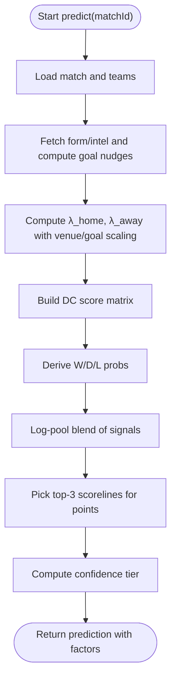
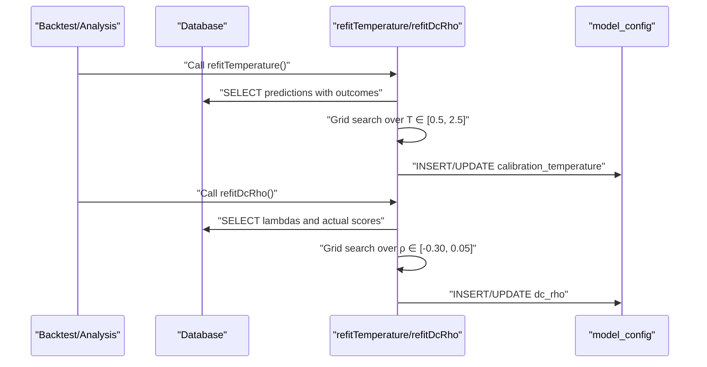
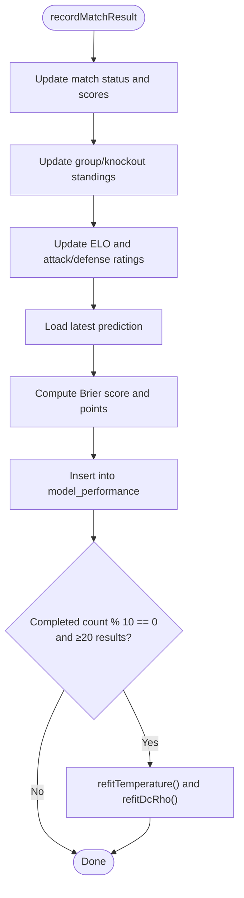
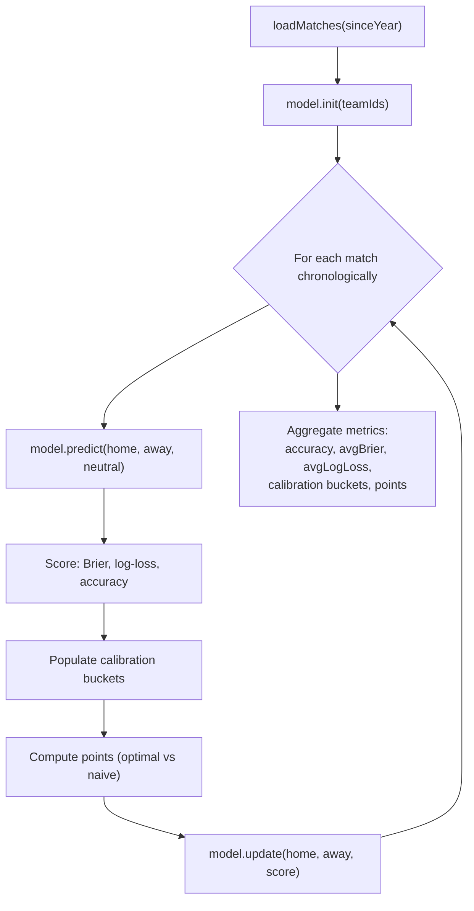
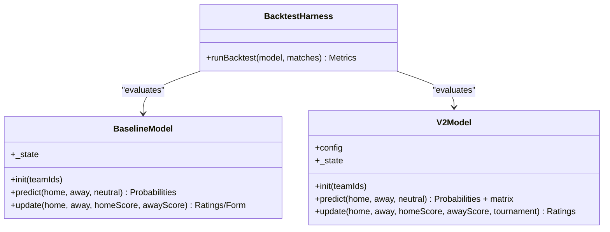
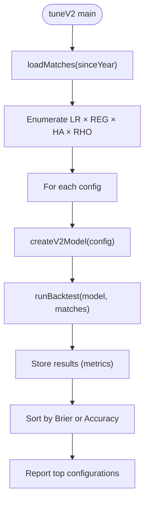
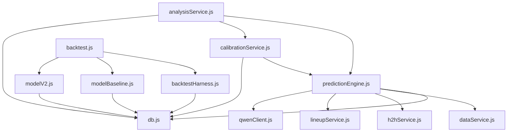

# Performance Metrics & Accuracy Tracking

<cite>
**Referenced Files in This Document**
- [predictionEngine.js](file://backend/services/predictionEngine.js)
- [calibrationService.js](file://backend/services/calibrationService.js)
- [analysisService.js](file://backend/services/analysisService.js)
- [backtest.js](file://backend/scripts/backtest.js)
- [backtestHarness.js](file://backend/scripts/backtestHarness.js)
- [modelBaseline.js](file://backend/scripts/modelBaseline.js)
- [modelV2.js](file://backend/scripts/modelV2.js)
- [tuneV2.js](file://backend/scripts/tuneV2.js)
- [predictionEngine.test.js](file://backend/services/predictionEngine.test.js)
- [db.js](file://backend/database/db.js)
</cite>

## Table of Contents
1. [Introduction](#introduction)
2. [Project Structure](#project-structure)
3. [Core Components](#core-components)
4. [Architecture Overview](#architecture-overview)
5. [Detailed Component Analysis](#detailed-component-analysis)
6. [Dependency Analysis](#dependency-analysis)
7. [Performance Considerations](#performance-considerations)
8. [Troubleshooting Guide](#troubleshooting-guide)
9. [Conclusion](#conclusion)

## Introduction
This document provides comprehensive coverage of prediction accuracy metrics, performance tracking, and model evaluation systems. It explains how accuracy is calculated, how confidence is assessed, how calibration is maintained, and how comparative analysis between prediction methods is performed. It also includes practical examples of metric computation, trend analysis, and model improvement tracking.

## Project Structure
The performance metrics system spans several core areas:
- Prediction Engine: computes match outcome probabilities, confidence, and scoreline distributions
- Calibration Service: applies temperature scaling and Dixon-Coles parameter fitting
- Analysis Service: records match results, computes Brier scores, tracks accuracy, and generates analytics
- Backtesting Framework: evaluates models using walk-forward validation and standard metrics
- Scripts: baseline model, V2 model, tuning sweeps, and backtest runners

**Diagram sources**
- [predictionEngine.js:665-830](file://backend/services/predictionEngine.js#L665-L830)
- [calibrationService.js:53-129](file://backend/services/calibrationService.js#L53-L129)
- [analysisService.js:76-218](file://backend/services/analysisService.js#L76-L218)
- [backtestHarness.js:72-153](file://backend/scripts/backtestHarness.js#L72-L153)
- [backtest.js:47-96](file://backend/scripts/backtest.js#L47-L96)
- [modelBaseline.js:146-225](file://backend/scripts/modelBaseline.js#L146-L225)
- [modelV2.js:132-237](file://backend/scripts/modelV2.js#L132-L237)
- [tuneV2.js:16-55](file://backend/scripts/tuneV2.js#L16-L55)
- [db.js:160-249](file://backend/database/db.js#L160-L249)

**Section sources**
- [predictionEngine.js:1-1020](file://backend/services/predictionEngine.js#L1-L1020)
- [calibrationService.js:1-132](file://backend/services/calibrationService.js#L1-L132)
- [analysisService.js:1-422](file://backend/services/analysisService.js#L1-L422)
- [backtest.js:1-102](file://backend/scripts/backtest.js#L1-L102)
- [backtestHarness.js:1-156](file://backend/scripts/backtestHarness.js#L1-L156)
- [modelBaseline.js:1-228](file://backend/scripts/modelBaseline.js#L1-L228)
- [modelV2.js:1-240](file://backend/scripts/modelV2.js#L1-L240)
- [tuneV2.js:1-58](file://backend/scripts/tuneV2.js#L1-L58)
- [db.js:160-249](file://backend/database/db.js#L160-L249)

## Core Components
This section outlines the primary components responsible for accuracy metrics, confidence assessment, calibration, and comparative evaluation.

- Prediction Engine
  - Computes backbone probabilities using a Dixon-Coles bivariate Poisson model
  - Applies log-pool blending of multiple signals (form, H2H, intelligence, lineup, rest days)
  - Derives confidence tiers and top-3 scorelines
  - Provides temperature scaling and DC ρ calibration hooks

- Calibration Service
  - Fits temperature scaling parameter T via grid search minimizing negative log-likelihood
  - Refits Dixon-Coles ρ parameter using observed scorelines
  - Stores calibrated parameters in model_config

- Analysis Service
  - Records match results and compares predictions to outcomes
  - Computes Brier scores and points-based scoring (3/2/1/0)
  - Tracks accuracy by stage and confidence level
  - Generates analysis notes and maintains model_performance logs

- Backtesting Framework
  - Implements walk-forward validation with warm-up period
  - Computes accuracy, Brier score, log loss, and calibration buckets
  - Evaluates top-3 picker performance versus naive selection
  - Supports comparative analysis between models

**Section sources**
- [predictionEngine.js:665-830](file://backend/services/predictionEngine.js#L665-L830)
- [calibrationService.js:53-129](file://backend/services/calibrationService.js#L53-L129)
- [analysisService.js:76-218](file://backend/services/analysisService.js#L76-L218)
- [backtestHarness.js:72-153](file://backend/scripts/backtestHarness.js#L72-L153)

## Architecture Overview
The system integrates prediction, calibration, and evaluation through a feedback loop. Predictions are generated, validated against outcomes, and used to refine future predictions and model parameters.

**Diagram sources**
- [analysisService.js:199-210](file://backend/services/analysisService.js#L199-L210)
- [calibrationService.js:53-129](file://backend/services/calibrationService.js#L53-L129)
- [db.js:160-249](file://backend/database/db.js#L160-L249)

## Detailed Component Analysis

### Prediction Engine: Accuracy and Confidence
The prediction engine builds a scoreline matrix from Dixon-Coles probabilities, derives outcome probabilities, and computes confidence tiers. It also selects top-3 scorelines optimized for points under the scoring rule.

**Diagram sources**
- [predictionEngine.js:665-830](file://backend/services/predictionEngine.js#L665-L830)

Key computations:
- Dixon-Coles matrix normalization ensures probabilities sum to 1
- Log-pool blending preserves confidence while combining heterogeneous signals
- Confidence tiers based on maximum outcome probability
- Top-3 selection maximizes expected points under 3/2/2/1/0 rule

**Section sources**
- [predictionEngine.js:135-174](file://backend/services/predictionEngine.js#L135-L174)
- [predictionEngine.js:214-238](file://backend/services/predictionEngine.js#L214-L238)
- [predictionEngine.js:364-371](file://backend/services/predictionEngine.js#L364-L371)
- [predictionEngine.js:400-460](file://backend/services/predictionEngine.js#L400-L460)

### Calibration Service: Temperature Scaling and DC ρ
Calibration adjusts output probabilities to improve reliability. Temperature scaling softens or sharpens probabilities, while Dixon-Coles ρ is fit to observed scorelines.

**Diagram sources**
- [calibrationService.js:53-129](file://backend/services/calibrationService.js#L53-L129)

Implementation highlights:
- Softmax scaling with temperature T: p_i^(1/T) normalized
- Negative log-likelihood minimization for T
- DC ρ fit using observed score probabilities from DC matrix
- Stored in model_config with timestamps

**Section sources**
- [calibrationService.js:28-51](file://backend/services/calibrationService.js#L28-L51)
- [calibrationService.js:84-129](file://backend/services/calibrationService.js#L84-L129)

### Analysis Service: Outcome Accuracy and Point Scoring
The analysis service validates predictions against outcomes, computes Brier scores, and tracks accuracy and points-based performance.

**Diagram sources**
- [analysisService.js:76-218](file://backend/services/analysisService.js#L76-L218)

Metrics computed:
- Outcome accuracy: proportion of correct predictions
- Brier score: mean squared error of probabilistic forecasts
- Points-based scoring: 3/2/1/0 based on top-3 picks and outcome match
- Upset detection: heavy favorite losses

**Section sources**
- [analysisService.js:37-71](file://backend/services/analysisService.js#L37-L71)
- [analysisService.js:140-198](file://backend/services/analysisService.js#L140-L198)
- [analysisService.js:321-384](file://backend/services/analysisService.js#L321-L384)

### Backtesting Framework: Comparative Evaluation
The backtesting framework evaluates models using walk-forward validation and standard metrics, enabling comparative analysis between different prediction methods.

**Diagram sources**
- [backtestHarness.js:72-153](file://backend/scripts/backtestHarness.js#L72-L153)
- [backtest.js:47-96](file://backend/scripts/backtest.js#L47-L96)

Metrics and evaluation:
- Accuracy: proportion of correctly predicted outcomes
- Average Brier score: lower is better
- Average log loss: lower is better
- Calibration buckets: observed vs predicted probability bands
- Points improvement: optimal picker vs naive selection

**Section sources**
- [backtestHarness.js:19-71](file://backend/scripts/backtestHarness.js#L19-L71)
- [backtest.js:21-45](file://backend/scripts/backtest.js#L21-L45)

### Baseline and V2 Models: Comparative Analysis
Two models are supported for comparative evaluation:
- Baseline: combines ELO, Poisson, and recent form with re-normalized weights
- V2: Dixon-Coles bivariate Poisson with online attack/defense updates

**Diagram sources**
- [modelBaseline.js:146-225](file://backend/scripts/modelBaseline.js#L146-L225)
- [modelV2.js:132-237](file://backend/scripts/modelV2.js#L132-L237)
- [backtestHarness.js:72-153](file://backend/scripts/backtestHarness.js#L72-L153)

**Section sources**
- [modelBaseline.js:146-225](file://backend/scripts/modelBaseline.js#L146-L225)
- [modelV2.js:132-237](file://backend/scripts/modelV2.js#L132-L237)

### Hyperparameter Tuning: V2 Sweep
Hyperparameter tuning explores combinations of learning rate, regularization, home advantage, and DC ρ to optimize performance metrics.

**Diagram sources**
- [tuneV2.js:16-55](file://backend/scripts/tuneV2.js#L16-L55)

**Section sources**
- [tuneV2.js:11-55](file://backend/scripts/tuneV2.js#L11-L55)

## Dependency Analysis
The system exhibits clear separation of concerns with explicit dependencies among modules.

**Diagram sources**
- [predictionEngine.js:37-53](file://backend/services/predictionEngine.js#L37-L53)
- [analysisService.js:13-16](file://backend/services/analysisService.js#L13-L16)
- [calibrationService.js:15-16](file://backend/services/calibrationService.js#L15-L16)
- [backtest.js:9-19](file://backend/scripts/backtest.js#L9-L19)
- [backtestHarness.js:1-17](file://backend/scripts/backtestHarness.js#L1-L17)
- [db.js:160-249](file://backend/database/db.js#L160-L249)

Key observations:
- Prediction engine depends on database, data services, and LLM client
- Analysis service orchestrates prediction recording, calibration, and performance logging
- Backtesting framework is decoupled and self-contained
- Calibration service reads predictions and writes to model_config

**Section sources**
- [predictionEngine.js:37-53](file://backend/services/predictionEngine.js#L37-L53)
- [analysisService.js:13-16](file://backend/services/analysisService.js#L13-L16)
- [calibrationService.js:15-16](file://backend/services/calibrationService.js#L15-L16)
- [backtest.js:9-19](file://backend/scripts/backtest.js#L9-L19)
- [backtestHarness.js:1-17](file://backend/scripts/backtestHarness.js#L1-L17)
- [db.js:160-249](file://backend/database/db.js#L160-L249)

## Performance Considerations
- Computational efficiency: Matrix construction and normalization are bounded by MAX_GOALS; careful choice of MAX_GOALS balances accuracy and speed.
- Numerical stability: Clipping and flooring ensure valid probabilities and gradients; softmax scaling prevents overflow.
- Calibration overhead: Grid search for T and ρ is efficient due to small search spaces and smooth objective surfaces.
- Backtesting scalability: Warm-up period avoids early instability; walk-forward validation mimics real deployment.

## Troubleshooting Guide
Common issues and resolutions:
- Calibration not updating: Verify completed count threshold and sampling criteria in refitTemperature/refitDcRho.
- Low-scoring matches affecting calibration: Ensure sufficient samples and consider minimum thresholds.
- Inconsistent accuracy metrics: Confirm deduplication logic in model_performance queries and proper staging of updates.
- Backtest divergence: Check model initialization and ensure consistent random seeds or deterministic state.

**Section sources**
- [calibrationService.js:61-63](file://backend/services/calibrationService.js#L61-L63)
- [analysisService.js:324-343](file://backend/services/analysisService.js#L324-L343)
- [backtestHarness.js:72-74](file://backend/scripts/backtestHarness.js#L72-L74)

## Conclusion
The system provides a robust pipeline for prediction accuracy tracking and model evaluation. It combines sophisticated probabilistic modeling with rigorous calibration and comprehensive metrics. The backtesting framework enables fair comparative analysis between prediction methods, while continuous calibration ensures reliable probability estimates. Together, these components support iterative model improvement and transparent performance monitoring.