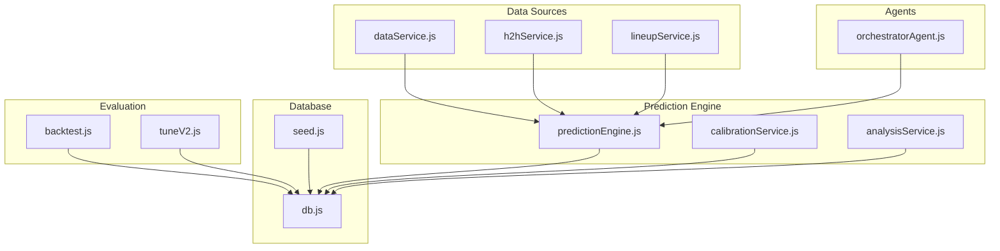
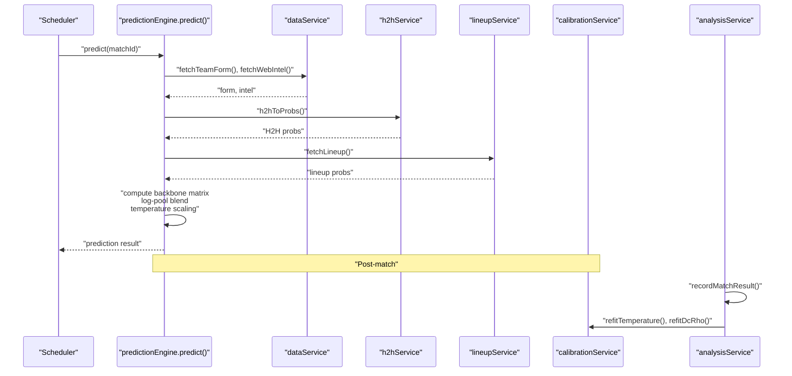
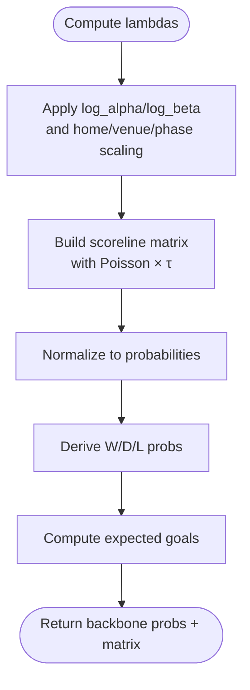
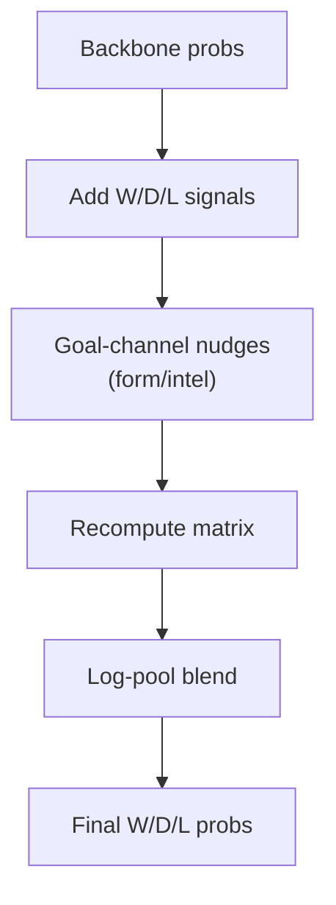
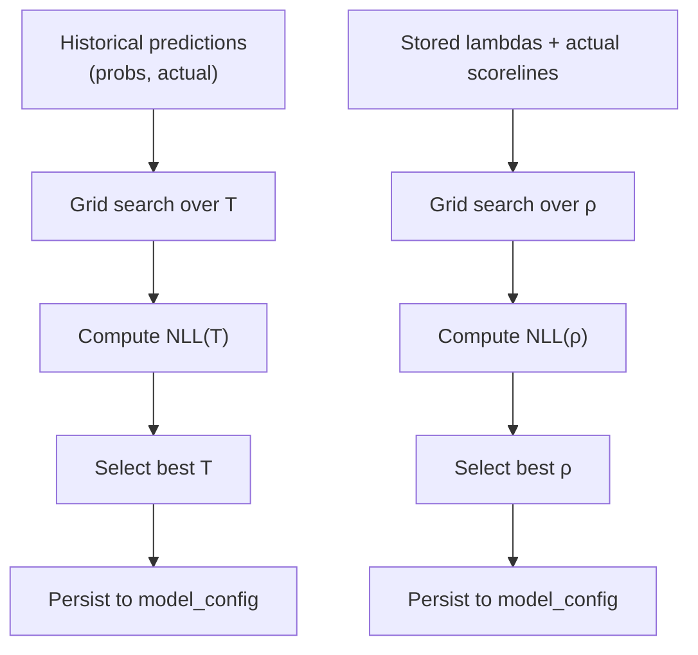
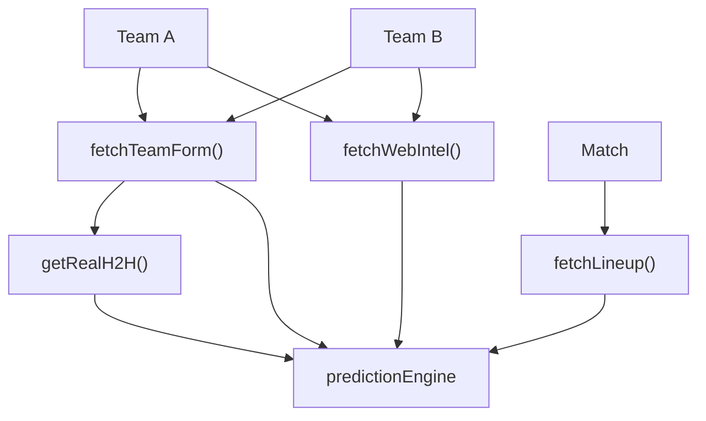
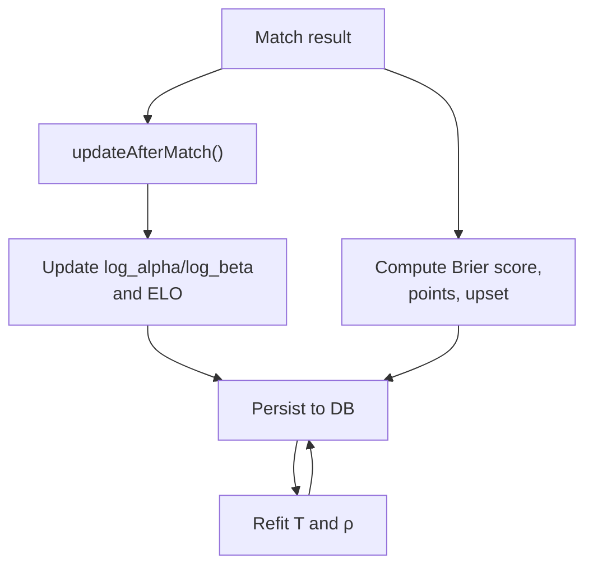
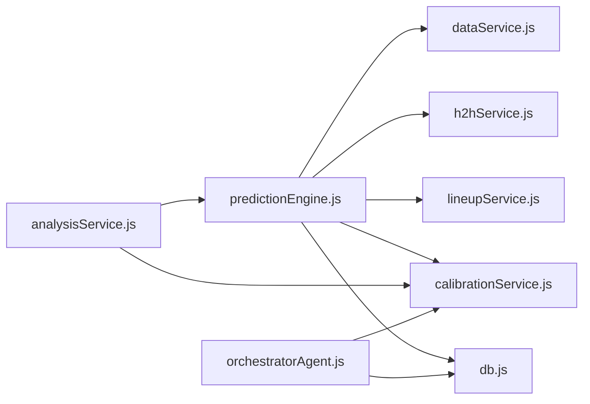

# Prediction Methodology & Algorithms

<cite>
**Referenced Files in This Document**
- [SPEC-PREDICT.md](file://specs/SPEC-PREDICT.md)
- [predictionEngine.js](file://backend/services/predictionEngine.js)
- [calibrationService.js](file://backend/services/calibrationService.js)
- [analysisService.js](file://backend/services/analysisService.js)
- [backtest.js](file://backend/scripts/backtest.js)
- [tuneV2.js](file://backend/scripts/tuneV2.js)
- [db.js](file://backend/database/db.js)
- [seed.js](file://backend/database/seed.js)
- [dataService.js](file://backend/services/dataService.js)
- [h2hService.js](file://backend/services/h2hService.js)
- [lineupService.js](file://backend/services/lineupService.js)
- [orchestratorAgent.js](file://backend/services/agents/orchestratorAgent.js)
</cite>

## Table of Contents
1. [Introduction](#introduction)
2. [Project Structure](#project-structure)
3. [Core Components](#core-components)
4. [Architecture Overview](#architecture-overview)
5. [Detailed Component Analysis](#detailed-component-analysis)
6. [Dependency Analysis](#dependency-analysis)
7. [Performance Considerations](#performance-considerations)
8. [Troubleshooting Guide](#troubleshooting-guide)
9. [Conclusion](#conclusion)
10. [Appendices](#appendices)

## Introduction
This document explains the prediction algorithms powering the World Cup 2026 predictor, focusing on:
- Dixon-Coles bivariate Poisson backbone with online attack/defense rating updates
- Temperature scaling for probability calibration
- Ensemble prediction blending via log-pool aggregation
- Mathematical foundations, model parameters, calibration techniques, uncertainty quantification, and accuracy metrics
- Implementation examples, parameter tuning, and performance evaluation

The system integrates multiple heterogeneous signals (head-to-head, recent form, intelligence, confirmed lineups, rest days) into a unified probabilistic forecast while maintaining rigorous calibration and interpretability.

## Project Structure
The prediction pipeline spans backend services, database schema, and evaluation scripts:
- Prediction engine computes match outcomes and scorelines using a Dixon-Coles Poisson model
- Calibration service fits temperature scaling and Dixon-Coles ρ parameters
- Analysis service records outcomes, computes accuracy metrics, and triggers recalibration
- Data services fetch external data (form, H2H, intelligence, lineups)
- Agents orchestrate multi-agent reasoning and negotiation
- Scripts enable backtesting and hyperparameter sweeps



**Diagram sources**
- [predictionEngine.js:665-896](file://backend/services/predictionEngine.js#L665-L896)
- [calibrationService.js:53-129](file://backend/services/calibrationService.js#L53-L129)
- [analysisService.js:76-218](file://backend/services/analysisService.js#L76-L218)
- [dataService.js:68-133](file://backend/services/dataService.js#L68-L133)
- [h2hService.js:272-312](file://backend/services/h2hService.js#L272-L312)
- [lineupService.js:399-422](file://backend/services/lineupService.js#L399-L422)
- [orchestratorAgent.js:290-470](file://backend/services/agents/orchestratorAgent.js#L290-L470)
- [db.js:23-252](file://backend/database/db.js#L23-L252)
- [seed.js:9-66](file://backend/database/seed.js#L9-L66)
- [backtest.js:47-101](file://backend/scripts/backtest.js#L47-L101)
- [tuneV2.js:16-57](file://backend/scripts/tuneV2.js#L16-L57)

**Section sources**
- [SPEC-PREDICT.md:1-147](file://specs/SPEC-PREDICT.md#L1-L147)
- [db.js:23-252](file://backend/database/db.js#L23-L252)

## Core Components
- Dixon-Coles bivariate Poisson backbone: builds a scoreline matrix with low-score correlation correction, derives outcome probabilities, and computes expected goals
- Adjustment signals: head-to-head, recent form, intelligence, confirmed lineup, and rest days, each producing a W/D/L probability vector
- Log-pool blending: geometric mean of probabilities raised to per-signal exponents, then normalized
- Temperature scaling: fits output temperature to minimize negative log-likelihood on historical predictions
- Post-match rating updates: regularized Poisson MLE gradient steps on attack/defense logs
- Multi-agent orchestration: parallel reasoning with conflict detection and negotiation

**Section sources**
- [predictionEngine.js:66-100](file://backend/services/predictionEngine.js#L66-L100)
- [predictionEngine.js:214-238](file://backend/services/predictionEngine.js#L214-L238)
- [predictionEngine.js:637-662](file://backend/services/predictionEngine.js#L637-L662)
- [calibrationService.js:53-82](file://backend/services/calibrationService.js#L53-L82)
- [predictionEngine.js:898-963](file://backend/services/predictionEngine.js#L898-L963)
- [orchestratorAgent.js:41-66](file://backend/services/agents/orchestratorAgent.js#L41-L66)

## Architecture Overview
End-to-end flow from match scheduling to prediction and evaluation:



**Diagram sources**
- [predictionEngine.js:665-896](file://backend/services/predictionEngine.js#L665-L896)
- [dataService.js:68-133](file://backend/services/dataService.js#L68-L133)
- [h2hService.js:272-312](file://backend/services/h2hService.js#L272-L312)
- [lineupService.js:221-316](file://backend/services/lineupService.js#L221-L316)
- [analysisService.js:76-218](file://backend/services/analysisService.js#L76-L218)
- [calibrationService.js:53-129](file://backend/services/calibrationService.js#L53-L129)

## Detailed Component Analysis

### Dixon-Coles Bivariate Poisson Model
- Backbonemodel: each team has log-alpha (attack) and log-beta (defense). Expected goals incorporate home advantage, venue effects, and tournament-phase scaling.
- Low-score correction: τ-function adjusts 0-0, 1-0, 0-1, and 1-1 cells to reduce overconfidence under independence.
- Scoreline matrix normalization yields outcome-class probabilities (W/D/L) and enables expected goals computation.

Implementation highlights:
- Poisson PMF, τ-correction, and matrix construction
- Outcome extraction and expected score calculation
- Phase-specific goal scaling (group vs knockout)



**Diagram sources**
- [predictionEngine.js:136-163](file://backend/services/predictionEngine.js#L136-L163)
- [predictionEngine.js:165-174](file://backend/services/predictionEngine.js#L165-L174)
- [predictionEngine.js:828-834](file://backend/services/predictionEngine.js#L828-L834)

**Section sources**
- [predictionEngine.js:66-100](file://backend/services/predictionEngine.js#L66-L100)
- [predictionEngine.js:136-174](file://backend/services/predictionEngine.js#L136-L174)
- [predictionEngine.js:828-834](file://backend/services/predictionEngine.js#L828-L834)

### Adjustment Signals and Log-Pool Blending
- Signals and weights:
  - Head-to-Head: 0.30 when ≥2 meetings
  - Recent form: 0.20 opponent-quality weighted
  - Intelligence: 0.20 when parsed
  - Confirmed lineup: 0.40 when available
  - Rest days: 0.10 when ≥1 day delta
- Goal-channel nudges: form and intelligence adjust λ before matrix building
- Log-pool: geometric mean of probabilities raised to per-signal exponents, then normalized



**Diagram sources**
- [predictionEngine.js:93-100](file://backend/services/predictionEngine.js#L93-L100)
- [predictionEngine.js:305-335](file://backend/services/predictionEngine.js#L305-L335)
- [predictionEngine.js:214-238](file://backend/services/predictionEngine.js#L214-L238)

**Section sources**
- [predictionEngine.js:240-362](file://backend/services/predictionEngine.js#L240-L362)
- [predictionEngine.js:214-238](file://backend/services/predictionEngine.js#L214-L238)

### Temperature Scaling for Probability Calibration
- Output calibration via temperature scaling p_i^(1/T), minimizing negative log-likelihood on historical predictions
- Fitted temperature stored in model_config and applied post-blend
- Dixon-Coles ρ refit: grid search over ρ to maximize likelihood of observed scorelines using stored lambdas



**Diagram sources**
- [calibrationService.js:53-82](file://backend/services/calibrationService.js#L53-L82)
- [calibrationService.js:88-129](file://backend/services/calibrationService.js#L88-L129)
- [predictionEngine.js:637-662](file://backend/services/predictionEngine.js#L637-L662)

**Section sources**
- [calibrationService.js:15-82](file://backend/services/calibrationService.js#L15-L82)
- [calibrationService.js:84-129](file://backend/services/calibrationService.js#L84-L129)
- [predictionEngine.js:637-662](file://backend/services/predictionEngine.js#L637-L662)

### Multi-Agent Prediction Orchestration
- Parallel agent tasks: statistical, H2H, form, intelligence, lineup
- Conflict detection: flags disagreements ≥ 0.20
- Negotiation: agents rebuttals when conflicts exist
- Final outputs: log-pool blend with negotiated weights
- Insight generation: LLM-generated analyst commentary

```mermaid
sequenceDiagram
participant OA as "orchestratorAgent"
participant Stat as "StatisticalAgent"
participant H2H as "H2HAgent"
participant Form as "FormAgent"
participant Intel as "IntelAgent"
participant LU as "LineupAgent"
OA->>Stat : "Build prompt"
OA->>H2H : "Build prompt (if ≥2 meetings)"
OA->>Form : "Build prompt"
OA->>Intel : "Build prompt"
OA->>LU : "Build prompt (if available)"
par "Round 1"
OA->>Stat : "Dispatch"
OA->>H2H : "Dispatch"
OA->>Form : "Dispatch"
OA->>Intel : "Dispatch"
OA->>LU : "Dispatch"
end
Stat-->>OA : "Output"
H2H-->>OA : "Output"
Form-->>OA : "Output"
Intel-->>OA : "Output"
LU-->>OA : "Output"
OA->>OA : "Detect conflicts"
alt "Conflicts found"
OA->>Stat : "Negotiate"
OA->>H2H : "Negotiate"
...
end
OA->>OA : "Build final outputs"
OA->>OA : "Log-pool blend + temperature"
OA-->>OA : "Generate insight"
```

**Diagram sources**
- [orchestratorAgent.js:290-470](file://backend/services/agents/orchestratorAgent.js#L290-L470)

**Section sources**
- [orchestratorAgent.js:1-473](file://backend/services/agents/orchestratorAgent.js#L1-L473)

### Data Services and External Inputs
- Form: API or web scrape; default generation from ELO-based win rate
- Head-to-Head: real historical results with competition weighting and recency weighting
- Intelligence: LLM parsing with anti-hallucination verification; fallback regex extraction
- Lineups: API or web scrape; strength scoring and key absence detection



**Diagram sources**
- [dataService.js:68-133](file://backend/services/dataService.js#L68-L133)
- [h2hService.js:192-266](file://backend/services/h2hService.js#L192-L266)
- [lineupService.js:221-316](file://backend/services/lineupService.js#L221-L316)

**Section sources**
- [dataService.js:68-133](file://backend/services/dataService.js#L68-L133)
- [h2hService.js:272-312](file://backend/services/h2hService.js#L272-L312)
- [lineupService.js:399-422](file://backend/services/lineupService.js#L399-L422)

### Post-Match Rating Updates and Evaluation
- Rating updates: Poisson MLE gradients clipped and regularized; updates both legacy ELO and v2 attack/defense logs
- Metrics: Brier score, outcome accuracy, points-based scoring (3/2/2/1/0), upset detection
- Calibration: refit temperature and DC ρ periodically as matches complete



**Diagram sources**
- [predictionEngine.js:898-963](file://backend/services/predictionEngine.js#L898-L963)
- [analysisService.js:76-218](file://backend/services/analysisService.js#L76-L218)
- [calibrationService.js:53-129](file://backend/services/calibrationService.js#L53-L129)

**Section sources**
- [predictionEngine.js:898-963](file://backend/services/predictionEngine.js#L898-L963)
- [analysisService.js:76-218](file://backend/services/analysisService.js#L76-L218)
- [calibrationService.js:53-129](file://backend/services/calibrationService.js#L53-L129)

## Dependency Analysis
- predictionEngine depends on:
  - dataService for form/intel
  - h2hService for H2H
  - lineupService for lineup
  - calibrationService for temperature/DC ρ
  - db for storage and model_config
- analysisService depends on predictionEngine outputs and calibrationService
- orchestratorAgent duplicates core math helpers to avoid circular dependencies



**Diagram sources**
- [predictionEngine.js:37-53](file://backend/services/predictionEngine.js#L37-L53)
- [analysisService.js:13-16](file://backend/services/analysisService.js#L13-L16)
- [orchestratorAgent.js:28-30](file://backend/services/agents/orchestratorAgent.js#L28-L30)

**Section sources**
- [predictionEngine.js:37-53](file://backend/services/predictionEngine.js#L37-L53)
- [analysisService.js:13-16](file://backend/services/analysisService.js#L13-L16)
- [orchestratorAgent.js:28-30](file://backend/services/agents/orchestratorAgent.js#L28-L30)

## Performance Considerations
- Computational complexity:
  - Scoreline matrix: O(max_goals²) per match; capped at 8×8
  - Log-pool aggregation: O(n_signals)
  - Grid search for calibration: O(T_steps) for temperature, O(ρ_steps) for DC ρ
- Caching and I/O:
  - Web intel and H2H cached with TTLs to reduce API calls
  - SQLite WAL mode and foreign keys enabled for reliability
- Numerical stability:
  - Clipping gradients and log-rates to prevent runaway updates
  - Soft flooring of probabilities in temperature scaling

[No sources needed since this section provides general guidance]

## Troubleshooting Guide
Common issues and remedies:
- Missing or stale predictions:
  - Verify match status and cache; predictions for LIVE matches are frozen
- Calibration instability:
  - Ensure sufficient completed matches before refitting; minimum samples enforced
- Data fetch failures:
  - API key missing or rate-limited; fallback scrapers used with timeouts
- Multi-agent failures:
  - If all agents fail, orchestrator throws an error; check agent prompts and LLM availability

**Section sources**
- [predictionEngine.js:665-695](file://backend/services/predictionEngine.js#L665-L695)
- [calibrationService.js:61-63](file://backend/services/calibrationService.js#L61-L63)
- [dataService.js:495-580](file://backend/services/dataService.js#L495-L580)
- [orchestratorAgent.js:384-386](file://backend/services/agents/orchestratorAgent.js#L384-L386)

## Conclusion
The system combines a robust Dixon-Coles Poisson backbone with calibrated ensemble blending and multi-agent reasoning to produce accurate, interpretable match forecasts. Temperature scaling and periodic DC ρ refitting maintain strong calibration, while comprehensive metrics and backtesting enable continuous improvement.

[No sources needed since this section summarizes without analyzing specific files]

## Appendices

### Mathematical Foundations and Parameters
- Backbonemodel parameters:
  - Home advantage log-space: ~0.26
  - Dixon-Coles ρ: tuned per tournament (-0.18)
  - Max goals: 8
  - Learning rate: 0.06
  - Regularization strength: 0.002
  - Clipping bounds for log-rates and gradients
  - Phase scaling: group vs knockout
- Signal weights (log-pool):
  - Backbone: 1.0
  - H2H: 0.30
  - Form: 0.20
  - Intel: 0.20
  - Lineup: 0.40
  - Rest: 0.10

**Section sources**
- [predictionEngine.js:66-100](file://backend/services/predictionEngine.js#L66-L100)
- [predictionEngine.js:93-100](file://backend/services/predictionEngine.js#L93-L100)

### Accuracy Metrics and Scoring Rules
- Outcome accuracy: proportion of matches with correct predicted outcome
- Brier score: lower is better; measures probabilistic calibration
- Points scoring (per match):
  - 3 points if predicted scoreline equals actual
  - 2 points if actual scoreline appears in top-3
  - 1 point if predicted outcome matches actual outcome
  - 0 points otherwise
- Additional metrics:
  - Upsets: heavy favorites losing
  - Confidence bins: accuracy by confidence tier

**Section sources**
- [analysisService.js:19-71](file://backend/services/analysisService.js#L19-L71)
- [analysisService.js:37-57](file://backend/services/analysisService.js#L37-L57)
- [SPEC-PREDICT.md:106-114](file://specs/SPEC-PREDICT.md#L106-L114)

### Parameter Tuning and Backtesting
- Hyperparameter sweep:
  - Grid over learning rate, regularization, home advantage, and DC ρ
  - Evaluate using Brier score and accuracy
- Backtesting:
  - Historical matches since a configurable year
  - Reports accuracy, Brier, log-loss, calibration buckets, and top-3 points lift

**Section sources**
- [tuneV2.js:16-57](file://backend/scripts/tuneV2.js#L16-L57)
- [backtest.js:47-101](file://backend/scripts/backtest.js#L47-L101)

### Database Schema Notes
- Key tables:
  - teams: ratings, stats, group stage totals
  - matches: schedule, scores, status
  - predictions: pre-match forecasts and post-match truths
  - model_performance: outcomes, Brier, points, analysis notes
  - model_config: tunable weights and calibration params
- Migrations:
  - Added attack/defense logs, top_scores, lambda capture, agent session linkage

**Section sources**
- [db.js:23-252](file://backend/database/db.js#L23-L252)
- [seed.js:9-66](file://backend/database/seed.js#L9-L66)