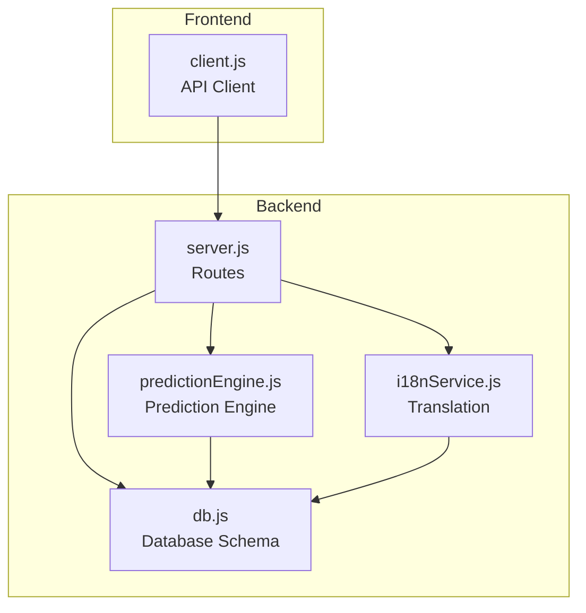
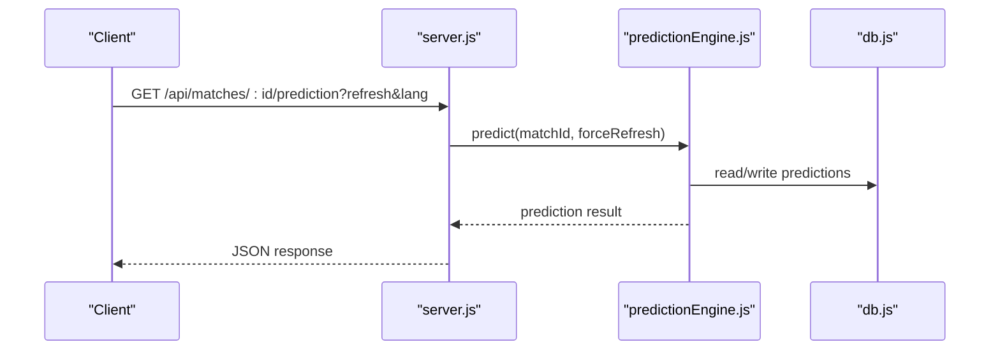
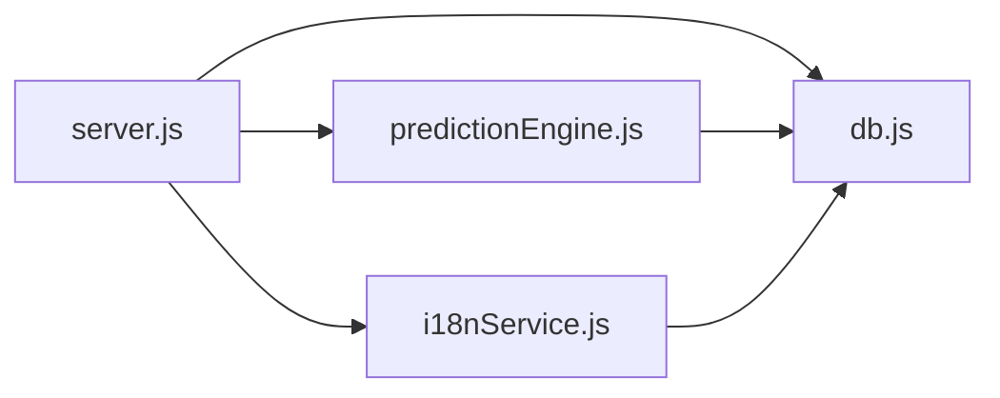

# Predictions API

<cite>
**Referenced Files in This Document**
- [server.js](file://backend/server.js)
- [predictionEngine.js](file://backend/services/predictionEngine.js)
- [i18nService.js](file://backend/services/i18nService.js)
- [db.js](file://backend/database/db.js)
- [client.js](file://frontend/src/api/client.js)
- [SPEC-PREDICT.md](file://specs/SPEC-PREDICT.md)
</cite>

## Table of Contents
1. [Introduction](#introduction)
2. [Project Structure](#project-structure)
3. [Core Components](#core-components)
4. [Architecture Overview](#architecture-overview)
5. [Detailed Component Analysis](#detailed-component-analysis)
6. [Dependency Analysis](#dependency-analysis)
7. [Performance Considerations](#performance-considerations)
8. [Troubleshooting Guide](#troubleshooting-guide)
9. [Conclusion](#conclusion)

## Introduction
This document provides comprehensive API documentation for the Predictions endpoints, covering prediction retrieval, multi-agent session analysis, prediction history, and batch prediction generation. It explains the prediction methodologies, agent session data, historical tracking, and performance metrics, with practical examples for developers integrating with the system.

## Project Structure
The Predictions API is implemented in the backend server module and integrates with prediction services, agent orchestration, and database storage. Frontend clients consume these endpoints via a dedicated API client.

**Diagram sources**
- [server.js:325-461](file://backend/server.js#L325-L461)
- [predictionEngine.js:664-800](file://backend/services/predictionEngine.js#L664-L800)
- [i18nService.js:17-63](file://backend/services/i18nService.js#L17-L63)
- [db.js:72-94](file://backend/database/db.js#L72-L94)

**Section sources**
- [server.js:325-461](file://backend/server.js#L325-L461)
- [SPEC-PREDICT.md:131-147](file://specs/SPEC-PREDICT.md#L131-L147)

## Core Components
- Prediction retrieval endpoint: GET /api/matches/:id/prediction with refresh and language options
- Multi-agent session endpoint: GET /api/matches/:id/agent-session for detailed agent analysis
- Prediction history endpoint: GET /api/matches/:id/predictions for historical tracking
- Batch prediction endpoint: POST /api/predictions/generate-all for bulk generation

These endpoints integrate with the prediction engine, multi-agent orchestration, and database persistence to deliver predictions, agent session logs, and historical records.

**Section sources**
- [server.js:325-461](file://backend/server.js#L325-L461)
- [predictionEngine.js:664-800](file://backend/services/predictionEngine.js#L664-L800)
- [db.js:72-94](file://backend/database/db.js#L72-L94)

## Architecture Overview
The Predictions API follows a layered architecture:
- HTTP routes define the API surface
- Route handlers delegate to prediction services
- Prediction engine computes outcomes and metadata
- Multi-agent orchestration coordinates specialized agents when enabled
- Database persists predictions, agent sessions, and related artifacts
- Internationalization service translates prediction content on demand

**Diagram sources**
- [server.js:325-341](file://backend/server.js#L325-L341)
- [predictionEngine.js:664-800](file://backend/services/predictionEngine.js#L664-L800)
- [db.js:72-94](file://backend/database/db.js#L72-L94)

## Detailed Component Analysis

### GET /api/matches/:id/prediction
Purpose: Retrieve the latest prediction for a specific match, with optional cache bypass and language translation.

Behavior:
- Query parameters:
  - refresh=true: Force recomputation and bypass cache
  - lang=zh: Translate insight, methodology, and factor descriptions to Chinese
- Response includes:
  - Probabilities for home win, draw, away win
  - Most likely scoreline and top scores
  - Confidence level
  - Factors influencing the prediction
  - Insight text and methodology
  - Agent session linkage (when applicable)
  - Metadata indicating cache usage

Implementation highlights:
- Route handler invokes the prediction engine and conditionally translates content
- Cache is respected for SCHEDULED matches until results are recorded
- On forced refresh, index notifications are sent

Example usage:
- Retrieve prediction with English insight: GET /api/matches/123/prediction
- Force refresh and receive JSON with updated fields: GET /api/matches/123/prediction?refresh=true
- Request Chinese translation: GET /api/matches/123/prediction?lang=zh

**Section sources**
- [server.js:325-341](file://backend/server.js#L325-L341)
- [predictionEngine.js:664-800](file://backend/services/predictionEngine.js#L664-L800)
- [i18nService.js:17-63](file://backend/services/i18nService.js#L17-L63)

### GET /api/matches/:id/agent-session
Purpose: Fetch the full multi-agent session log for the latest prediction run associated with a match.

Behavior:
- Locates the latest prediction with an agent session ID for the match
- Returns session metadata, agent messages, and conflict resolutions
- Messages include probabilities, confidence, evidence, and latency
- Conflict records capture agent pairings, deltas, and resolutions

Response structure:
- available: Boolean indicating presence of session data
- session: Session metadata (agents used, rounds, conflicts, synthesis method, timing)
- messages: Round 1 and Round 2 rebuttal entries
- conflicts: Detected conflicts and resolution outcomes

Use cases:
- Debugging prediction discrepancies
- Analyzing agent reasoning and evidence
- Monitoring multi-agent performance

**Section sources**
- [server.js:343-382](file://backend/server.js#L343-L382)
- [db.js:180-208](file://backend/database/db.js#L180-L208)

### GET /api/matches/:id/predictions
Purpose: Retrieve the complete prediction history for a match.

Behavior:
- Returns all prediction records ordered chronologically
- Fields include probabilities, score predictions, confidence, factors, insight, methodology, and post-match metrics (actual outcome, correctness, Brier score)

Use cases:
- Historical analysis and model performance tracking
- Investigating prediction evolution over time
- Research and reporting

**Section sources**
- [server.js:384-397](file://backend/server.js#L384-L397)
- [db.js:72-94](file://backend/database/db.js#L72-L94)

### POST /api/predictions/generate-all
Purpose: Trigger batch prediction generation for upcoming matches in the earliest active stage.

Behavior:
- Identifies the earliest active stage among SCHEDULED matches with populated teams
- Iterates through matches in that stage, respecting a cooldown period
- Generates predictions for eligible matches and records results
- Returns counts and per-match statuses
- Triggers index notifications for newly generated predictions

Operational details:
- Cooldown prevents excessive recomputation within a short timeframe
- Results include match IDs, success flags, and error messages when applicable
- Index notifications update search availability for generated matches

**Section sources**
- [server.js:399-461](file://backend/server.js#L399-L461)

### Prediction Methodologies
The prediction engine combines multiple signals using a log-pool blending approach:
- Backbone: Dixon-Coles bivariate Poisson with online attack/defense ratings
- Signals:
  - Head-to-Head (real historical data)
  - Recent form (opponent-quality weighted)
  - Pre-match intelligence (LLM-parsed)
  - Confirmed lineup (~1 hour before kickoff)
  - Rest days difference
- Output: Outcome probabilities, expected goals, most likely scoreline, top scorelines, confidence, factors, and insight

Multi-agent extension:
- When enabled, a dedicated orchestrator coordinates specialized agents
- Agents provide structured outputs with probabilities, confidence, evidence, and weight recommendations
- Conflicts are detected and resolved through negotiation rounds
- Final probabilities are computed via log-pool blending with adjusted weights

**Section sources**
- [predictionEngine.js:1-100](file://backend/services/predictionEngine.js#L1-L100)
- [predictionEngine.js:214-238](file://backend/services/predictionEngine.js#L214-L238)
- [predictionEngine.js:664-800](file://backend/services/predictionEngine.js#L664-L800)
- [SPEC-PREDICT.md:8-147](file://specs/SPEC-PREDICT.md#L8-L147)

### Agent Session Data
Agent sessions capture the reasoning and negotiation process:
- Sessions store metadata (agents used, rounds, conflicts, synthesis method, wall time)
- Messages include round, agent, role, probability distributions, confidence, evidence, raw responses, and latency
- Conflicts track agent pairings, deltas, resolutions, and winner decisions

**Section sources**
- [db.js:180-208](file://backend/database/db.js#L180-L208)
- [server.js:343-382](file://backend/server.js#L343-L382)

### Historical Tracking and Performance Metrics
Historical tracking:
- Predictions table stores all runs with timestamps and outcomes
- Post-match updates include actual outcomes, correctness, Brier score, and upset indicators
- Historical endpoint enables longitudinal analysis

Performance metrics:
- Accuracy and Brier score are tracked and exposed via analytics endpoints
- Multi-agent performance metrics include conflict detection, resolution, rounds, and latency

**Section sources**
- [db.js:72-94](file://backend/database/db.js#L72-L94)
- [server.js:527-570](file://backend/server.js#L527-L570)

### Examples

#### Example: Retrieving a Prediction
- Endpoint: GET /api/matches/{matchId}/prediction
- Query parameters:
  - refresh=true (optional)
  - lang=zh (optional)
- Response fields include probabilities, score predictions, confidence, factors, insight, methodology, and agent session linkage.

**Section sources**
- [server.js:325-341](file://backend/server.js#L325-L341)
- [client.js:19-25](file://frontend/src/api/client.js#L19-L25)

#### Example: Analyzing Agent Session Logs
- Endpoint: GET /api/matches/{matchId}/agent-session
- Response includes session metadata, messages (Round 1 and Round 2), and conflict resolutions.
- Use this to understand agent reasoning and resolve discrepancies.

**Section sources**
- [server.js:343-382](file://backend/server.js#L343-L382)
- [client.js:49](file://frontend/src/api/client.js#L49)

#### Example: Retrieving Prediction History
- Endpoint: GET /api/matches/{matchId}/predictions
- Response includes all historical runs with outcomes and performance metrics.

**Section sources**
- [server.js:384-397](file://backend/server.js#L384-L397)
- [client.js:27-28](file://frontend/src/api/client.js#L27-L28)

#### Example: Batch Prediction Generation
- Endpoint: POST /api/predictions/generate-all
- Response includes counts, active stage, and per-match results with success/error status.

**Section sources**
- [server.js:399-461](file://backend/server.js#L399-L461)
- [client.js:30-31](file://frontend/src/api/client.js#L30-L31)

## Dependency Analysis
The Predictions API depends on:
- Route handlers in server.js for endpoint exposure
- Prediction engine for computation and persistence
- Internationalization service for translation
- Database schema for storing predictions, agent sessions, and conflicts

**Diagram sources**
- [server.js:325-461](file://backend/server.js#L325-L461)
- [predictionEngine.js:664-800](file://backend/services/predictionEngine.js#L664-L800)
- [i18nService.js:17-63](file://backend/services/i18nService.js#L17-L63)
- [db.js:72-94](file://backend/database/db.js#L72-L94)

**Section sources**
- [server.js:325-461](file://backend/server.js#L325-L461)
- [predictionEngine.js:664-800](file://backend/services/predictionEngine.js#L664-L800)
- [i18nService.js:17-63](file://backend/services/i18nService.js#L17-L63)
- [db.js:72-94](file://backend/database/db.js#L72-L94)

## Performance Considerations
- Cache-first strategy: Predictions are served from cache for SCHEDULED matches until results are recorded, reducing computational overhead.
- Multi-agent mode: When enabled, parallel agent execution and negotiation introduce latency; monitor session timing and conflict resolution metrics.
- Batch generation: Cooldown prevents frequent recomputation; adjust intervals based on workload and data freshness requirements.
- Translation service: On-demand translation uses an LLM with in-memory caching; repeated requests for the same timestamp are served from cache.

[No sources needed since this section provides general guidance]

## Troubleshooting Guide
Common issues and resolutions:
- Match not found: Ensure the match ID exists and teams are populated.
- No multi-agent session: The latest prediction may not have an associated session; trigger a new prediction run.
- Translation failures: The translation service falls back to English if LLM calls fail; verify network connectivity and model availability.
- Batch generation errors: Inspect per-match results for error messages; ensure sufficient data and permissions.

**Section sources**
- [server.js:325-341](file://backend/server.js#L325-L341)
- [server.js:343-382](file://backend/server.js#L343-L382)
- [i18nService.js:59-62](file://backend/services/i18nService.js#L59-L62)

## Conclusion
The Predictions API provides robust endpoints for retrieving, analyzing, and generating match predictions. It supports cache-bypass refresh, language translation, detailed agent session logs, historical tracking, and batch processing. The underlying prediction engine and multi-agent orchestration deliver transparent, explainable forecasts with strong performance and observability.