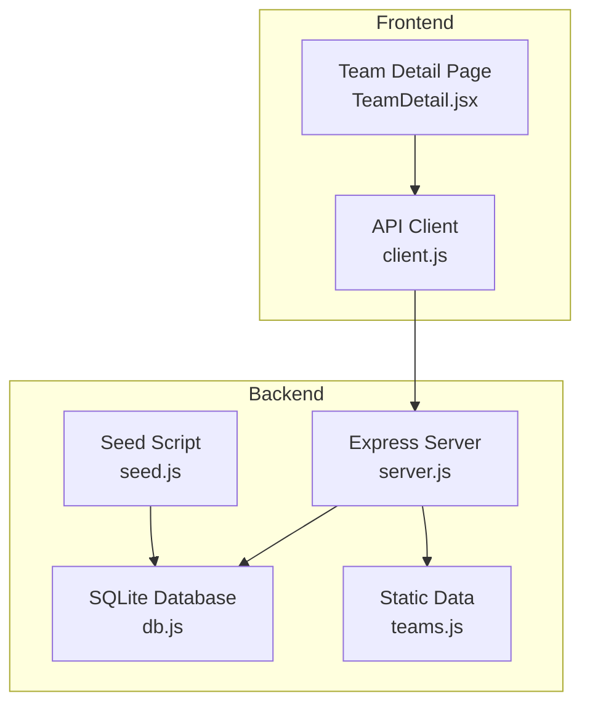
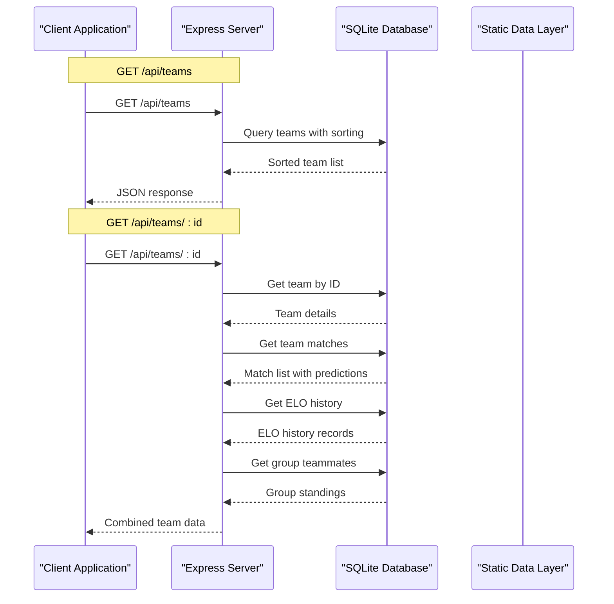
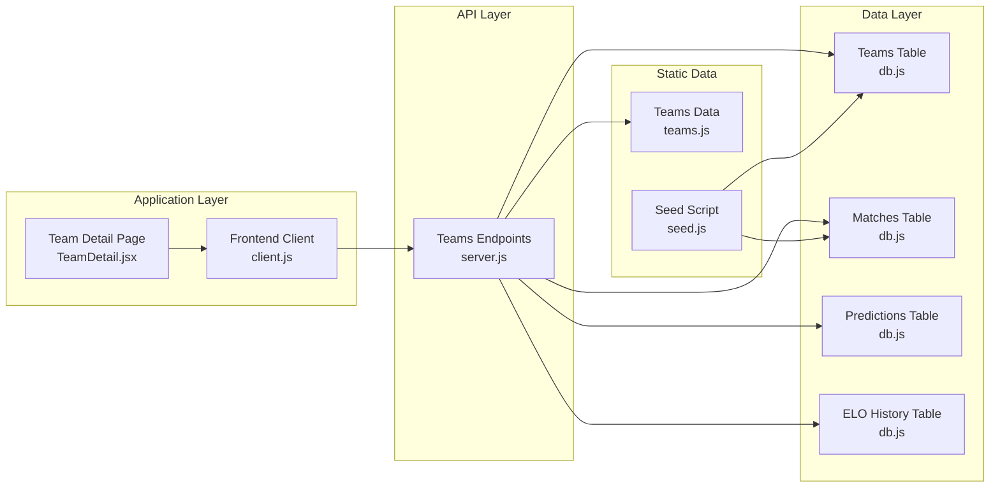

# Teams API

<cite>
**Referenced Files in This Document**
- [server.js](file://backend/server.js)
- [db.js](file://backend/database/db.js)
- [seed.js](file://backend/database/seed.js)
- [teams.js](file://backend/data/teams.js)
- [client.js](file://frontend/src/api/client.js)
- [TeamDetail.jsx](file://frontend/src/pages/TeamDetail.jsx)
</cite>

## Table of Contents
1. [Introduction](#introduction)
2. [Project Structure](#project-structure)
3. [Core Components](#core-components)
4. [Architecture Overview](#architecture-overview)
5. [Detailed Component Analysis](#detailed-component-analysis)
6. [Dependency Analysis](#dependency-analysis)
7. [Performance Considerations](#performance-considerations)
8. [Troubleshooting Guide](#troubleshooting-guide)
9. [Conclusion](#conclusion)

## Introduction
This document provides comprehensive API documentation for the Teams endpoints in the World Cup 2026 prediction application. It covers:
- GET /api/teams: Retrieve all teams with sorting by group and FIFA ranking
- GET /api/teams/:id: Retrieve detailed team information including matches, ELO history, and group teammates
- Response schemas, query parameters, filtering options, and pagination support
- Practical usage examples and integration patterns

The Teams API is part of a larger system that combines real-time data with AI-powered predictions to deliver a comprehensive World Cup experience.

## Project Structure
The Teams API endpoints are implemented in the backend server and backed by an SQLite database. The frontend integrates with these endpoints to display team profiles and related data.



**Diagram sources**
- [server.js:24-75](file://backend/server.js#L24-L75)
- [db.js:23-252](file://backend/database/db.js#L23-L252)
- [seed.js:1-69](file://backend/database/seed.js#L1-L69)
- [teams.js:1-234](file://backend/data/teams.js#L1-L234)
- [client.js:1-50](file://frontend/src/api/client.js#L1-L50)
- [TeamDetail.jsx:82-126](file://frontend/src/pages/TeamDetail.jsx#L82-L126)

**Section sources**
- [server.js:24-75](file://backend/server.js#L24-L75)
- [db.js:23-252](file://backend/database/db.js#L23-L252)
- [seed.js:1-69](file://backend/database/seed.js#L1-L69)
- [teams.js:1-234](file://backend/data/teams.js#L1-L234)
- [client.js:1-50](file://frontend/src/api/client.js#L1-L50)
- [TeamDetail.jsx:82-126](file://frontend/src/pages/TeamDetail.jsx#L82-L126)

## Core Components
The Teams API consists of two primary endpoints that serve different purposes:

### Endpoint 1: GET /api/teams
Retrieves all teams with comprehensive sorting and grouping capabilities.

### Endpoint 2: GET /api/teams/:id
Provides detailed team information including:
- Team statistics and metadata
- Upcoming and past matches with predictions
- ELO rating history
- Group teammates with standings context

Both endpoints leverage a sophisticated SQLite database schema that supports:
- Team profiles with FIFA rankings and ELO ratings
- Match scheduling and predictions
- ELO history tracking
- Group stage standings computation

**Section sources**
- [server.js:25-75](file://backend/server.js#L25-L75)
- [db.js:26-131](file://backend/database/db.js#L26-L131)

## Architecture Overview
The Teams API follows a layered architecture pattern with clear separation of concerns:



**Diagram sources**
- [server.js:25-75](file://backend/server.js#L25-L75)
- [db.js:26-131](file://backend/database/db.js#L26-L131)

The architecture ensures:
- Efficient data retrieval through optimized SQL queries
- Comprehensive team information aggregation
- Real-time ELO rating updates
- Predictive analytics integration

**Section sources**
- [server.js:25-75](file://backend/server.js#L25-L75)
- [db.js:26-131](file://backend/database/db.js#L26-L131)

## Detailed Component Analysis

### GET /api/teams Endpoint

#### Purpose
Retrieve all 48 World Cup teams with comprehensive sorting and group stage context.

#### Request Format
```
GET /api/teams
```

#### Response Schema
The endpoint returns an array of team objects with the following structure:

| Field | Type | Description |
|-------|------|-------------|
| id | string | Team identifier (3-letter code) |
| name | string | Team full name |
| flag | string | Emoji flag representation |
| group_code | string | Group letter (A-L) |
| confederation | string | FIFA confederation |
| fifa_rank | integer | Current FIFA world ranking |
| fifa_points | number | FIFA points used as ELO base |
| elo | number | Current ELO rating |
| avg_scored | number | Average goals scored (20 matches) |
| avg_conceded | number | Average goals conceded (20 matches) |
| wc_appearances | integer | World Cup appearances |
| last_wc_round | string | Last World Cup best round |
| gs_played | integer | Group stage matches played |
| gs_won | integer | Group stage matches won |
| gs_drawn | integer | Group stage matches drawn |
| gs_lost | integer | Group stage matches lost |
| gs_gf | integer | Group stage goals for |
| gs_ga | integer | Group stage goals against |
| gs_pts | integer | Group stage points |
| eliminated | integer | Elimination status |
| updated_at | string | Timestamp of last update |

#### Sorting Logic
Teams are sorted using a multi-criteria approach:
1. **Group precedence**: A, B, C, D, E, F, G, H, I, J, K, L
2. **Group points**: Descending order (gs_pts)
3. **FIFA ranking**: Ascending order (lower is better)

#### Implementation Details
The endpoint uses a single SQL query with CASE statement for group ordering and multiple sort criteria.

**Section sources**
- [server.js:25-36](file://backend/server.js#L25-L36)
- [db.js:26-49](file://backend/database/db.js#L26-L49)

### GET /api/teams/:id Endpoint

#### Purpose
Retrieve comprehensive team information including matches, predictions, ELO history, and group context.

#### Request Format
```
GET /api/teams/:id
```

#### Path Parameters
- `id` (required): Team identifier (3-letter code)

#### Response Schema
The endpoint returns a combined object containing:

**Main Response Object**
| Field | Type | Description |
|-------|------|-------------|
| team | object | Complete team details |
| matches | array | Team's match history with predictions |
| eloHistory | array | ELO rating changes over time |
| groupTeams | array | Group teammates with standings |

#### Team Details
Individual team object structure mirrors the `/api/teams` response with additional computed fields.

#### Match Details
Each match object includes:
- Basic match information (date, venue, stage)
- Team identifiers and names
- Scores and status
- Prediction data (probabilities, confidence, most likely score)
- Opponent team information

#### ELO History
Each ELO history record contains:
- ELO rating before and after match
- Opponent team information
- Match result (W/D/L)
- Stage of match
- Timestamp

#### Group Teams
Returns teammates in the same group with:
- Team identifiers and names
- Group stage statistics (played, won, drawn, lost, GF, GA, points)
- FIFA ranking for comparison

#### Implementation Details
The endpoint performs four separate database queries:
1. Team lookup by ID
2. Team matches with predictions (left joins)
3. ELO history records
4. Group teammates with standings calculation

**Section sources**
- [server.js:38-75](file://backend/server.js#L38-L75)
- [db.js:51-131](file://backend/database/db.js#L51-L131)

### Database Schema Integration

#### Teams Table
The teams table stores comprehensive team information including:
- Static attributes (name, flag, confederation)
- Ranking metrics (FIFA rank, points)
- Dynamic attributes (ELO rating)
- Group stage statistics (played, won, drawn, lost, goals for/against, points)
- Metadata (appearances, last round, timestamps)

#### Matches Table
Stores all match data with:
- Team relationships (home and away)
- Scheduling information (date, time, venue)
- Status tracking (scheduled, live, completed)
- Results and knockout progression
- Performance metadata

#### Predictions Table
Contains pre-match predictions with:
- Probability distributions (home, draw, away)
- Expected scores and most likely outcomes
- Confidence levels and methodology
- Agent session tracking for multi-agent predictions

#### ELO History Table
Tracks ELO rating changes:
- Before and after ratings
- Opponent identification
- Match results and stages
- Timestamps for trend analysis

**Section sources**
- [db.js:26-131](file://backend/database/db.js#L26-L131)

## Dependency Analysis



**Diagram sources**
- [server.js:25-75](file://backend/server.js#L25-L75)
- [db.js:26-131](file://backend/database/db.js#L26-L131)
- [teams.js:1-234](file://backend/data/teams.js#L1-L234)
- [seed.js:1-69](file://backend/database/seed.js#L1-L69)
- [client.js:1-50](file://frontend/src/api/client.js#L1-L50)
- [TeamDetail.jsx:82-126](file://frontend/src/pages/TeamDetail.jsx#L82-L126)

### External Dependencies
- **node-sqlite3-wasm**: SQLite database driver with WASM support
- **Express.js**: Web framework for API endpoints
- **Axios**: HTTP client for frontend requests
- **Environment variables**: Configuration for database path and CORS

### Internal Dependencies
- **Database initialization**: Schema creation and migration handling
- **Static data seeding**: Initial population of teams and fixtures
- **Frontend integration**: Client-side API consumption

**Section sources**
- [db.js:1-252](file://backend/database/db.js#L1-L252)
- [server.js:21-75](file://backend/server.js#L21-L75)
- [client.js:1-50](file://frontend/src/api/client.js#L1-L50)

## Performance Considerations

### Query Optimization
The Teams API employs several optimization strategies:

1. **Single-query sorting**: The `/api/teams` endpoint uses a single SQL query with CASE statement for efficient group ordering
2. **Indexed lookups**: Team ID lookups use primary key indexing
3. **Left joins**: Match and prediction joins minimize data duplication
4. **Limited result sets**: ELO history and match queries are ordered and limited appropriately

### Database Design
- **WAL mode**: Write-Ahead Logging for improved concurrency
- **Foreign key constraints**: Data integrity enforcement
- **Migration support**: Automatic schema updates for new features
- **Lock handling**: Stale lock cleanup for crash recovery

### Caching Strategy
- **Static data**: Teams and fixtures loaded from static JavaScript files
- **Real-time updates**: Match data refreshed based on current date
- **Client-side caching**: Frontend caches team data with automatic refresh on match days

### Scalability Considerations
- **SQLite limitations**: Suitable for current scale but may require migration to PostgreSQL for high-volume scenarios
- **Connection pooling**: Single database connection with proper locking
- **Query complexity**: Balanced between functionality and performance

**Section sources**
- [db.js:10-21](file://backend/database/db.js#L10-L21)
- [server.js:25-75](file://backend/server.js#L25-L75)

## Troubleshooting Guide

### Common Issues and Solutions

#### Team Not Found Error
**Symptom**: 404 response when accessing `/api/teams/:id`
**Cause**: Invalid team ID or team not seeded
**Solution**: Verify team ID exists in static data and database has been seeded

#### Database Connection Issues
**Symptom**: 500 errors on API requests
**Cause**: Database file corruption or lock issues
**Solution**: Check database path environment variable and remove stale locks

#### Missing Predictions
**Symptom**: Empty predictions array in team detail response
**Cause**: Predictions not yet generated or match not started
**Solution**: Trigger prediction generation or wait for match to start

#### Performance Degradation
**Symptom**: Slow response times
**Cause**: Large result sets or concurrent connections
**Solution**: Monitor query performance and consider database optimization

### Debugging Steps
1. **Verify database connectivity**: Check connection initialization
2. **Test individual queries**: Validate each SQL statement separately
3. **Check environment variables**: Ensure proper configuration
4. **Monitor database locks**: Look for stale lock files
5. **Validate static data**: Confirm teams.js contains all required teams

### Error Handling
The API implements basic error handling:
- Team not found returns 404 with error message
- Database connection errors propagate to client
- Query failures return appropriate HTTP status codes

**Section sources**
- [server.js:40-41](file://backend/server.js#L40-L41)
- [db.js:10-21](file://backend/database/db.js#L10-L21)

## Conclusion
The Teams API provides a comprehensive foundation for World Cup team data management and presentation. Its design balances functionality with performance while maintaining clear separation of concerns between data storage, business logic, and presentation layers.

Key strengths include:
- Efficient multi-criteria sorting for group stage organization
- Comprehensive team detail aggregation with related data
- Robust database schema supporting predictive analytics
- Clean separation between static data and dynamic calculations
- Well-structured frontend integration patterns

The API serves as a solid foundation for the broader World Cup prediction platform, supporting real-time data updates, AI-powered predictions, and comprehensive team analytics.