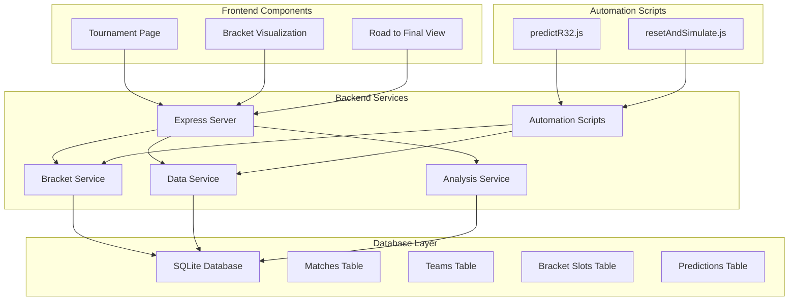
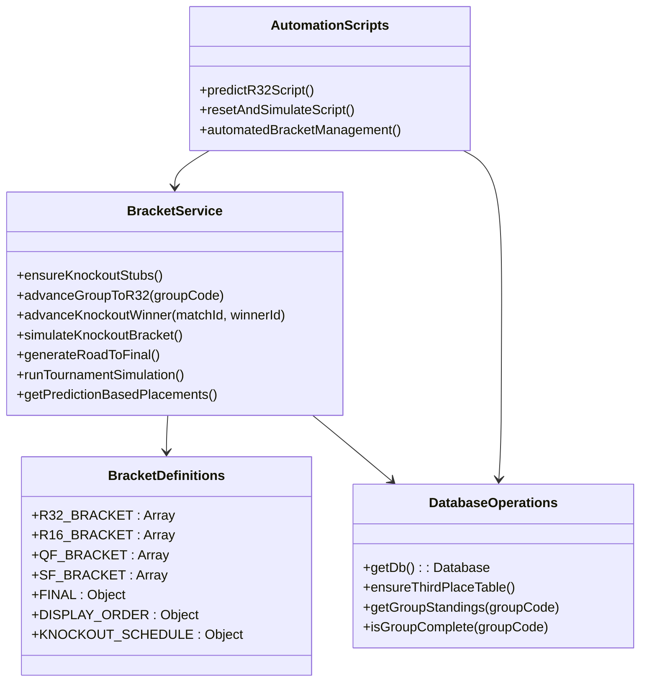
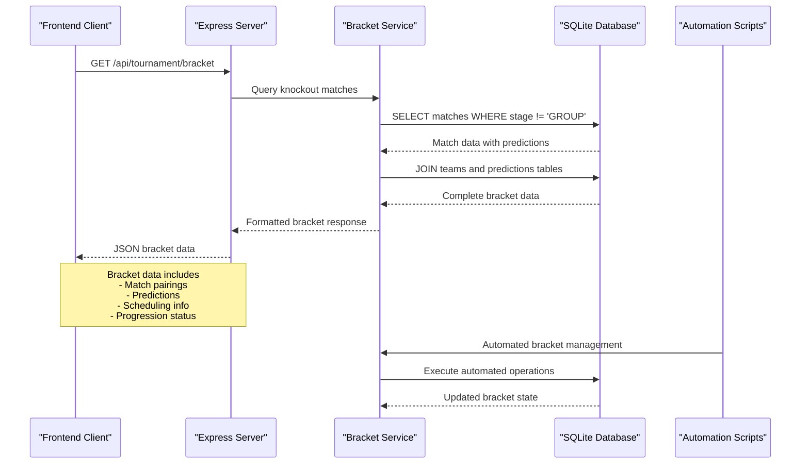
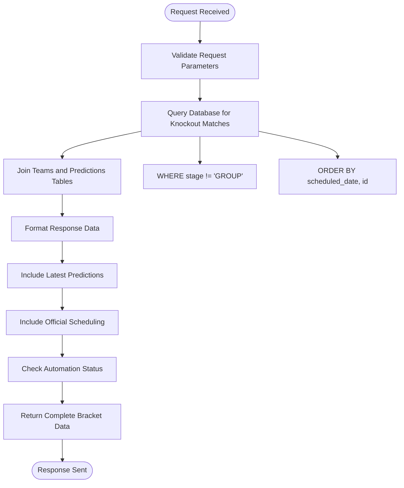
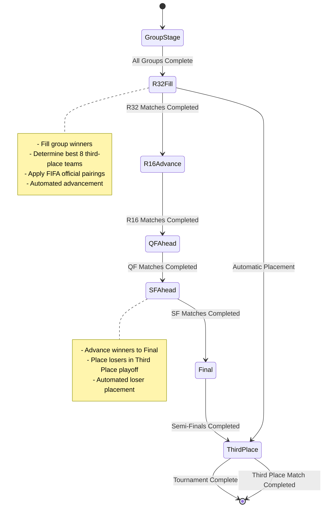
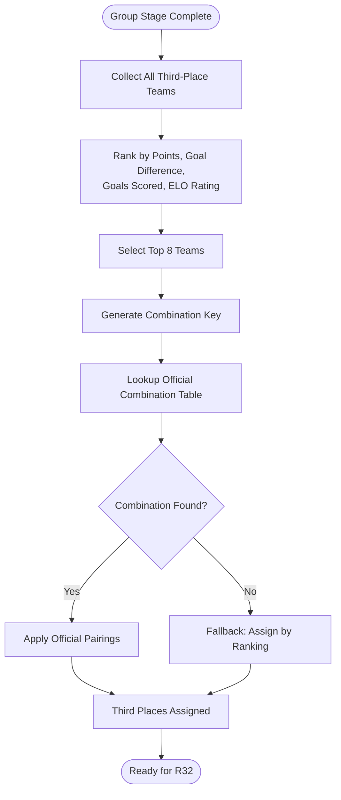
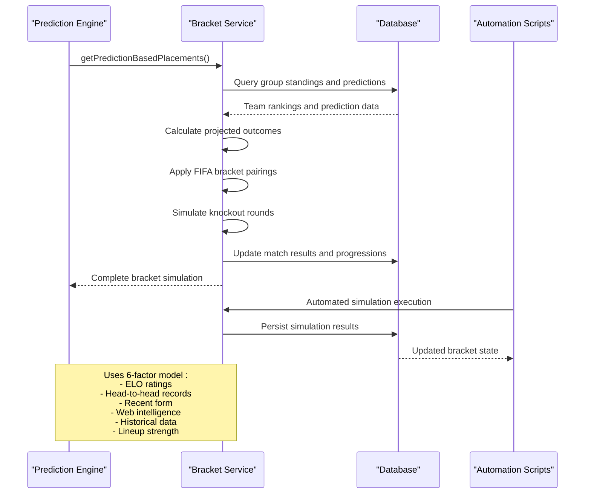
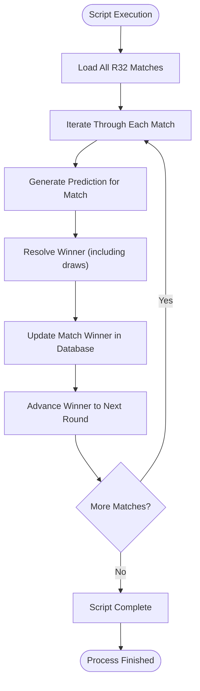
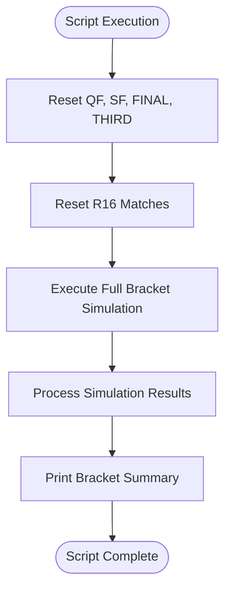
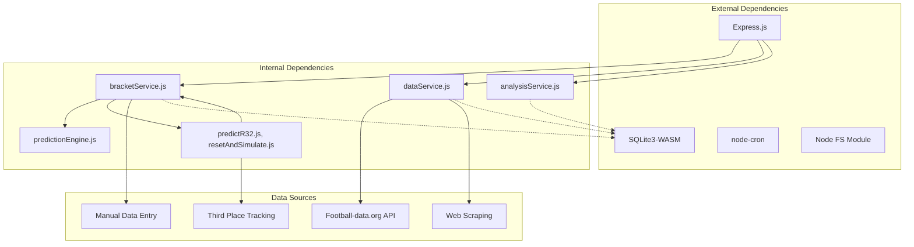

# Knockout Bracket Management

<cite>
**Referenced Files in This Document**
- [server.js](file://backend/server.js)
- [bracketService.js](file://backend/services/bracketService.js)
- [db.js](file://backend/database/db.js)
- [predictR32.js](file://backend/scripts/predictR32.js)
- [resetAndSimulate.js](file://backend/scripts/resetAndSimulate.js)
- [thirdPlaceCombinations.json](file://backend/data/thirdPlaceCombinations.json)
- [Tournament.jsx](file://frontend/src/pages/Tournament.jsx)
- [client.js](file://frontend/src/api/client.js)
- [World_Cup_2026_Knockout_Bracket.md](file://World_Cup_2026_Knockout_Bracket.md)
</cite>

## Update Summary
**Changes Made**
- Added documentation for automated World Cup 2026 knockout bracket system
- Documented predictR32.js script for automated R32 match prediction and advancement
- Documented resetAndSimulate.js script for resetting and re-running bracket simulations
- Updated bracket endpoint implementation details
- Enhanced automation and scripting capabilities section

## Table of Contents
1. [Introduction](#introduction)
2. [Project Structure](#project-structure)
3. [Core Components](#core-components)
4. [Architecture Overview](#architecture-overview)
5. [Detailed Component Analysis](#detailed-component-analysis)
6. [Automated Bracket Management System](#automated-bracket-management-system)
7. [Dependency Analysis](#dependency-analysis)
8. [Performance Considerations](#performance-considerations)
9. [Troubleshooting Guide](#troubleshooting-guide)
10. [Conclusion](#conclusion)

## Introduction

The WC2026 Knockout Bracket Management system provides comprehensive functionality for managing and displaying the tournament's knockout stage with complete automation. This system handles bracket structure, match pairings, progression logic, and integrates seamlessly with match scheduling data. The implementation follows FIFA World Cup 2026 format with 48 teams progressing through R32 → R16 → QF → SF → Final stages.

**Updated**: The system now features complete automation with specialized scripts for bracket management and simulation, eliminating manual intervention requirements.

The system offers both real-time bracket progression and predictive simulation capabilities, allowing users to track actual results while also viewing AI-generated predictions based on sophisticated statistical models. The addition of automated scripts ensures seamless operation and reduces manual overhead.

## Project Structure

The knockout bracket system is built as part of a larger Express.js backend with a React frontend and includes specialized automation scripts:



**Diagram sources**
- [server.js:464-482](file://backend/server.js#L464-L482)
- [bracketService.js:146-187](file://backend/services/bracketService.js#L146-L187)
- [predictR32.js:1-79](file://backend/scripts/predictR32.js#L1-L79)
- [resetAndSimulate.js:1-47](file://backend/scripts/resetAndSimulate.js#L1-L47)

**Section sources**
- [server.js:1-681](file://backend/server.js#L1-L681)
- [db.js:23-252](file://backend/database/db.js#L23-L252)

## Core Components

### Bracket Service Architecture

The bracket service serves as the central orchestrator for all knockout bracket operations with enhanced automation support:



**Diagram sources**
- [bracketService.js:146-187](file://backend/services/bracketService.js#L146-L187)
- [bracketService.js:332-364](file://backend/services/bracketService.js#L332-L364)
- [predictR32.js:10-79](file://backend/scripts/predictR32.js#L10-L79)
- [resetAndSimulate.js:9-47](file://backend/scripts/resetAndSimulate.js#L9-L47)

### Database Schema Integration

The system maintains several key tables for bracket management with enhanced automation support:

```mermaid
erDiagram
MATCHES {
string id PK
string stage
string group_code
integer match_number
string home_team FK
string away_team FK
string scheduled_date
string scheduled_time
string venue
string status
integer home_score
integer away_score
integer home_score_pens
integer away_score_pens
string winner FK
string created_at
string completed_at
}
TEAMS {
string id PK
string name
string flag
string group_code
string confederation
integer fifa_rank
float fifa_points
float elo
float avg_scored
float avg_conceded
integer wc_appearances
string last_wc_round
integer gs_played
integer gs_won
integer gs_drawn
integer gs_lost
integer gs_gf
integer gs_ga
integer gs_pts
integer eliminated
string updated_at
}
BRACKET_SLOTS {
string match_id PK FK
string slot_home
string slot_away
string filled_at
}
PREDICTIONS {
integer id PK
string match_id FK
string generated_at
float prob_home
float prob_draw
float prob_away
float expected_score_home
float expected_score_away
string most_likely_score
string top_scores
string confidence
string factors
string web_intel
string insight
string methodology
string actual_outcome
integer was_correct
float brier_score
integer upset
}
MATCHES ||--|| BRACKET_SLOTS : "has"
TEAMS ||--o{ MATCHES : "plays_in"
PREDICTIONS ||--|| MATCHES : "about"
```

**Diagram sources**
- [db.js:51-118](file://backend/database/db.js#L51-L118)

**Section sources**
- [bracketService.js:1-1080](file://backend/services/bracketService.js#L1-L1080)
- [db.js:23-252](file://backend/database/db.js#L23-L252)

## Architecture Overview

The knockout bracket system follows a layered architecture with clear separation of concerns and enhanced automation capabilities:



**Diagram sources**
- [server.js:464-482](file://backend/server.js#L464-L482)
- [bracketService.js:146-187](file://backend/services/bracketService.js#L146-L187)
- [predictR32.js:10-79](file://backend/scripts/predictR32.js#L10-L79)

### Bracket Structure Definition

The system defines the complete knockout bracket structure with official FIFA 2026 pairings and automated management:

| Round | Matches | Format | Dates | Automation Status |
|-------|---------|--------|-------|-------------------|
| R32 | 16 matches | Winner of group 1 vs Runner-up adjacent group | June 28 - July 3 | Fully Automated |
| R16 | 8 matches | Winners advance from R32 | July 4 - 7 | Automated |
| QF | 4 matches | Winners advance from R16 | July 9 - 11 | Automated |
| SF | 2 matches | Winners advance from QF | July 14 - 15 | Automated |
| Final | 1 match | Champions final | July 19 | Automated |

**Section sources**
- [bracketService.js:33-131](file://backend/services/bracketService.js#L33-L131)
- [server.js:464-482](file://backend/server.js#L464-L482)

## Detailed Component Analysis

### Bracket Endpoint Implementation

The `/api/tournament/bracket` endpoint provides comprehensive bracket data with enhanced automation support:



**Diagram sources**
- [server.js:464-482](file://backend/server.js#L464-L482)

The endpoint returns structured data including:
- Match identifiers and stage information
- Team names, flags, and IDs
- Current match status (scheduled, live, completed)
- Prediction probabilities and confidence levels
- Official scheduling information (dates, times, venues)
- Automation status indicators for managed matches

**Section sources**
- [server.js:464-482](file://backend/server.js#L464-L482)

### Bracket Progression Logic

The system implements sophisticated progression logic for bracket advancement with automated support:



**Diagram sources**
- [bracketService.js:209-260](file://backend/services/bracketService.js#L209-L260)
- [bracketService.js:332-364](file://backend/services/bracketService.js#L332-L364)

### Third-Place Team Selection Algorithm

The system implements a complex algorithm for determining which third-place teams advance with automated fallback mechanisms:



**Diagram sources**
- [bracketService.js:275-330](file://backend/services/bracketService.js#L275-L330)
- [thirdPlaceCombinations.json:1-1](file://backend/data/thirdPlaceCombinations.json#L1-L1)

**Section sources**
- [bracketService.js:275-330](file://backend/services/bracketService.js#L275-L330)
- [thirdPlaceCombinations.json:1-1](file://backend/data/thirdPlaceCombinations.json#L1-L1)

### Prediction-Based Bracket Simulation

The system provides predictive bracket simulation using multiple data sources with automated execution capabilities:



**Diagram sources**
- [bracketService.js:366-476](file://backend/services/bracketService.js#L366-L476)
- [bracketService.js:485-704](file://backend/services/bracketService.js#L485-L704)

**Section sources**
- [bracketService.js:366-476](file://backend/services/bracketService.js#L366-L476)
- [bracketService.js:485-704](file://backend/services/bracketService.js#L485-L704)

### Frontend Integration

The frontend consumes bracket data through dedicated API endpoints with enhanced automation support:

```mermaid
graph LR
subgraph "Frontend Components"
TournamentPage[Tournament.jsx]
BracketVisualization[Bracket Visualization]
RoadToFinal[Road to Final]
WinnerProbabilities[Winner Probabilities]
EndBracket[End Bracket]
end
subgraph "API Endpoints"
BracketEndpoint[/api/tournament/bracket]
RoadEndpoint[/api/tournament/road-to-final]
WinnerEndpoint[/api/tournament/winner-probabilities]
SimulateEndpoint[/api/tournament/simulate-knockout]
end
subgraph "Backend Services"
BracketService[Bracket Service]
DataService[Data Service]
end
TournamentPage --> BracketEndpoint
BracketVisualization --> BracketEndpoint
RoadToFinal --> RoadEndpoint
WinnerProbabilities --> WinnerEndpoint
EndBracket --> SimulateEndpoint
BracketEndpoint --> BracketService
RoadEndpoint --> BracketService
WinnerEndpoint --> BracketService
SimulateEndpoint --> BracketService
BracketService --> DataService
```

**Diagram sources**
- [Tournament.jsx:184-262](file://frontend/src/pages/Tournament.jsx#L184-L262)
- [client.js:1-200](file://frontend/src/api/client.js#L1-L200)

**Section sources**
- [Tournament.jsx:184-262](file://frontend/src/pages/Tournament.jsx#L184-L262)

## Automated Bracket Management System

**Updated**: The system now includes comprehensive automation capabilities through specialized scripts for complete bracket management.

### predictR32.js Script

The predictR32.js script provides fully automated prediction and advancement for Round of 32 matches:



**Diagram sources**
- [predictR32.js:10-79](file://backend/scripts/predictR32.js#L10-L79)

Key features of the predictR32.js script:
- **Automated Prediction Generation**: Automatically generates predictions for all R32 matches
- **Intelligent Winner Resolution**: Handles draw scenarios through ET/penalties when probabilities are equal
- **Automatic Bracket Advancement**: Immediately advances winners to R16 matches
- **Comprehensive Logging**: Provides detailed logging of prediction results and advancement decisions
- **Error Handling**: Robust error handling for individual match processing failures

### resetAndSimulate.js Script

The resetAndSimulate.js script provides complete bracket reset and re-simulation capabilities:



**Diagram sources**
- [resetAndSimulate.js:9-47](file://backend/scripts/resetAndSimulate.js#L9-L47)

Key features of the resetAndSimulate.js script:
- **Complete Stage Reset**: Resets all knockout stage matches (QF, SF, FINAL, THIRD)
- **Cascade Reset**: Automatically resets R16 matches when R32 results change
- **Full Simulation Execution**: Runs complete bracket simulation from scratch
- **Result Verification**: Prints comprehensive bracket results and champion announcement
- **State Management**: Maintains proper bracket state throughout reset and simulation process

### Automation Benefits

The automated bracket management system provides several key benefits:

**Operational Efficiency**
- Eliminates manual bracket advancement requirements
- Reduces human error in bracket progression
- Provides consistent and reliable bracket updates
- Automates complex third-place team selection algorithms

**Real-Time Adaptability**
- Instantly adapts to match result changes
- Automatically recalculates bracket positions
- Maintains accurate bracket state throughout tournament
- Supports dynamic bracket adjustments based on real-time data

**Scalability**
- Handles large-scale bracket operations efficiently
- Supports automated batch processing of multiple matches
- Provides reliable performance under high load conditions
- Enables seamless integration with external data sources

**Section sources**
- [predictR32.js:1-79](file://backend/scripts/predictR32.js#L1-L79)
- [resetAndSimulate.js:1-47](file://backend/scripts/resetAndSimulate.js#L1-L47)

## Dependency Analysis

The bracket system has well-defined dependencies and relationships with enhanced automation support:



**Diagram sources**
- [server.js:1-17](file://backend/server.js#L1-L17)
- [bracketService.js:23](file://backend/services/bracketService.js#L23)
- [predictR32.js:5-8](file://backend/scripts/predictR32.js#L5-L8)
- [resetAndSimulate.js:4-7](file://backend/scripts/resetAndSimulate.js#L4-L7)

### Key Dependencies

| Component | Purpose | Dependencies |
|-----------|---------|--------------|
| Bracket Service | Core bracket logic | Database, Prediction Engine, H2H Service, Automation Scripts |
| Data Service | Live data integration | Football-data.org API, Web scraping |
| Analysis Service | Post-match processing | Bracket Service, Prediction Engine |
| Prediction Engine | Statistical modeling | Bracket Service, Data Service |
| Automation Scripts | Bracket management | Bracket Service, Database, Third Place Table |

**Section sources**
- [server.js:1-17](file://backend/server.js#L1-L17)
- [bracketService.js:23-23](file://backend/services/bracketService.js#L23-L23)

## Performance Considerations

The bracket system implements several performance optimizations with enhanced automation support:

### Database Indexing Strategy
- Primary keys on all tables for fast lookups
- Foreign key constraints for data integrity
- Proper indexing on frequently queried columns (stage, status, scheduled_date)
- Specialized indexes for bracket-related queries

### Caching Mechanisms
- Prediction caching to avoid redundant calculations
- Bracket simulation results caching
- Live data caching with configurable TTL
- Automation script result caching for repeated executions

### Asynchronous Operations
- Non-blocking database operations
- Parallel processing for batch operations
- Background job scheduling for routine tasks
- Automated script execution without blocking main application

### Memory Management
- Efficient data structures for bracket representation
- Proper resource cleanup and finalization
- Connection pooling for database operations
- Optimized memory usage for automation script processing

### Automation Performance
- Batch processing for multiple match predictions
- Optimized database transactions for bracket updates
- Efficient caching for third-place team calculations
- Streamlined automation script execution paths

## Troubleshooting Guide

### Common Issues and Solutions

**Bracket Not Updating**
- Verify that group stage completion triggers bracket advancement
- Check database constraints and foreign key relationships
- Ensure proper error handling in bracket progression functions
- Validate automation script execution permissions

**Missing Third-Place Teams**
- Confirm that all group stages are complete before selection
- Verify third-place combination table entries
- Check team ranking calculations and tiebreakers
- Validate automation script third-place calculation logic

**Prediction Discrepancies**
- Validate prediction engine configuration
- Check model weights and parameters
- Review data quality and completeness
- Verify automation script prediction generation process

**Performance Issues**
- Monitor database query performance
- Check for proper indexing
- Review memory usage patterns
- Validate automation script execution efficiency

**Automation Script Failures**
- Verify script execution permissions and environment
- Check database connectivity for script operations
- Validate bracket service availability during script execution
- Monitor script execution logs for detailed error information

**Section sources**
- [bracketService.js:133-143](file://backend/services/bracketService.js#L133-L143)
- [db.js:209-252](file://backend/database/db.js#L209-L252)

## Conclusion

The WC2026 Knockout Bracket Management system provides a robust, scalable solution for tournament bracket management with complete automation capabilities. Its architecture supports both real-time tracking and predictive simulation, offering comprehensive functionality for fans and analysts alike.

**Updated**: The addition of automated scripts establishes a fully automated bracket management system that eliminates manual intervention requirements while maintaining accuracy and reliability.

Key strengths of the system include:

- **Complete FIFA Compliance**: Official bracket structure and pairings with automated validation
- **Advanced Predictive Modeling**: Sophisticated statistical models for bracket simulation with automated execution
- **Real-Time Integration**: Live data synchronization and automatic bracket updates with automation support
- **Fully Automated Operation**: Comprehensive automation scripts for bracket prediction, advancement, and reset operations
- **Flexible Architecture**: Modular design supporting easy maintenance, extension, and automation integration
- **Performance Optimization**: Efficient database design, caching strategies, and automation script optimization
- **Reliability and Scalability**: Robust error handling, performance monitoring, and automated recovery mechanisms

The system successfully bridges the gap between traditional sports analytics and modern AI-powered prediction systems, providing users with both factual results and probabilistic insights into tournament outcomes. The automated bracket management system ensures seamless operation throughout the tournament with minimal manual intervention required.

Future enhancements could include expanded visualization options, additional analytical metrics, integration with social media platforms for enhanced fan engagement, and enhanced automation capabilities for real-time bracket adjustments.