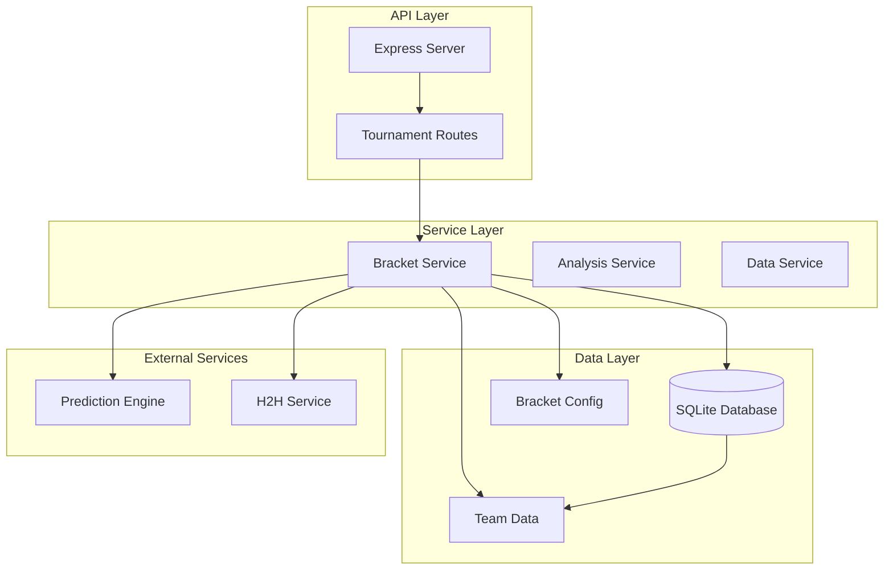
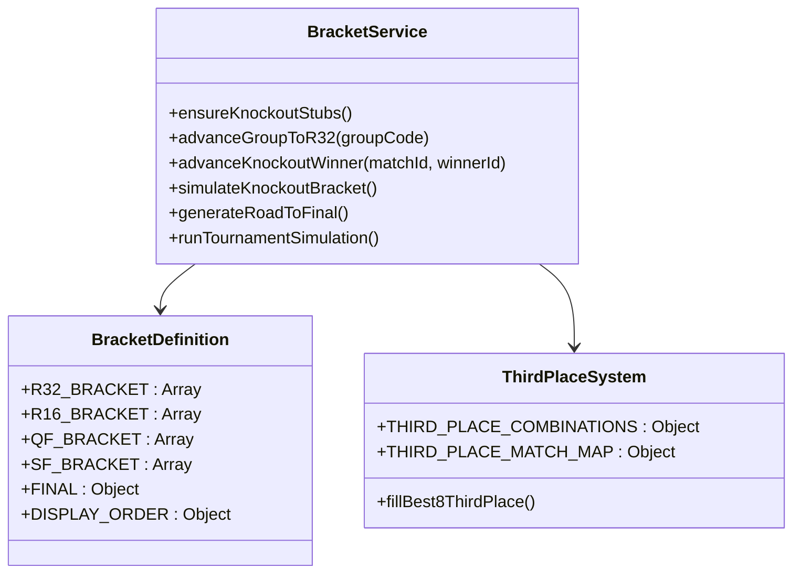
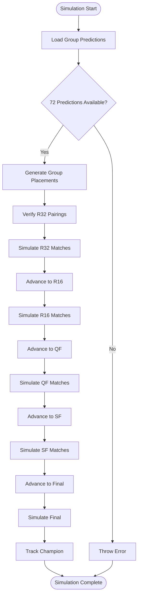
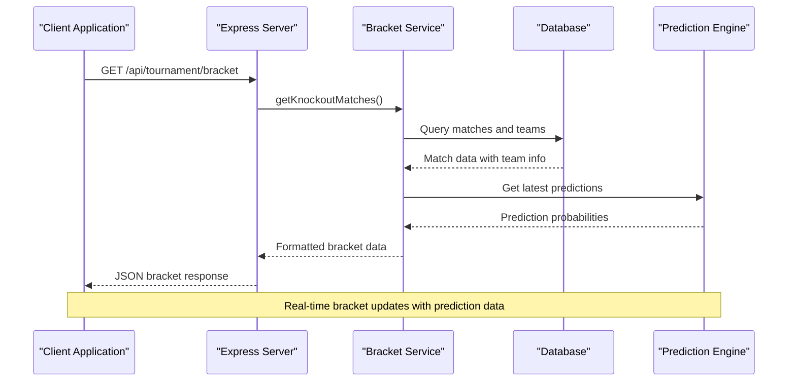
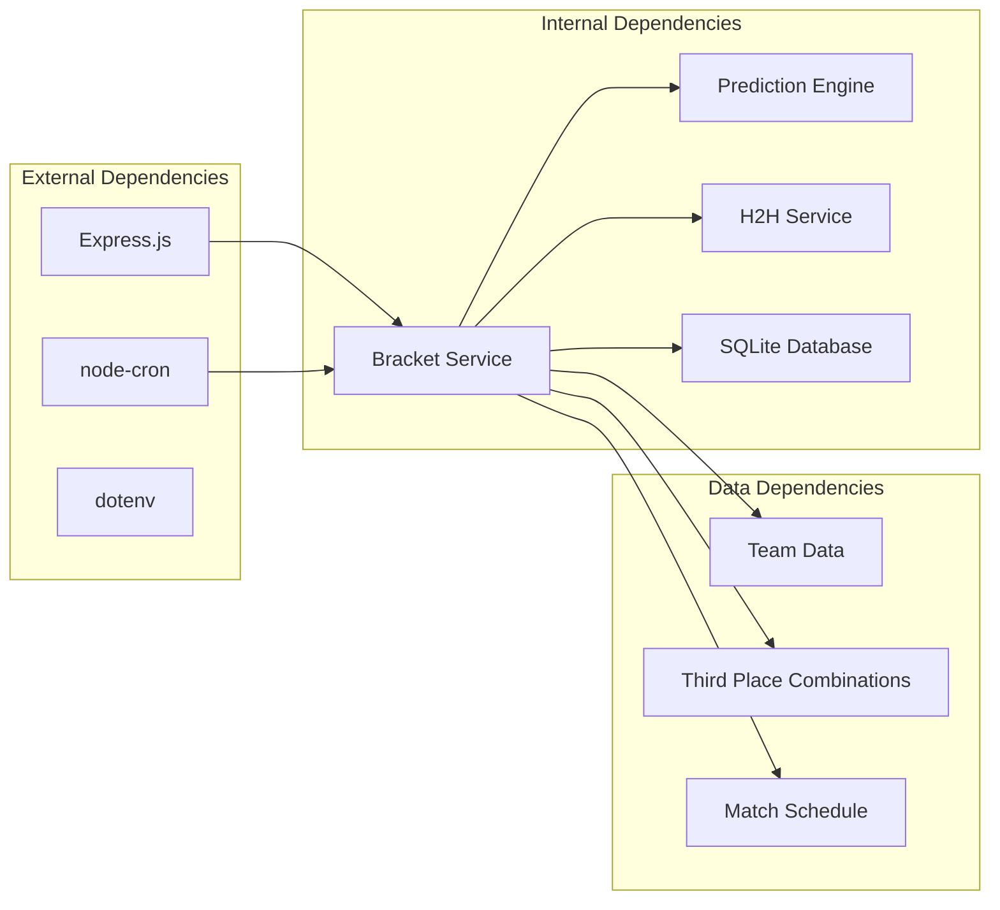

# Tournament API

<cite>
**Referenced Files in This Document**
- [server.js](file://backend/server.js)
- [bracketService.js](file://backend/services/bracketService.js)
- [teams.js](file://backend/data/teams.js)
- [thirdPlaceCombinations.json](file://backend/data/thirdPlaceCombinations.json)
</cite>

## Table of Contents
1. [Introduction](#introduction)
2. [Project Structure](#project-structure)
3. [Core Components](#core-components)
4. [Architecture Overview](#architecture-overview)
5. [Detailed Component Analysis](#detailed-component-analysis)
6. [Dependency Analysis](#dependency-analysis)
7. [Performance Considerations](#performance-considerations)
8. [Troubleshooting Guide](#troubleshooting-guide)
9. [Conclusion](#conclusion)

## Introduction

The Tournament API provides comprehensive coverage of the FIFA World Cup 2026 knockout stage, featuring real-time bracket tracking, championship simulation, and tournament progression analysis. This system manages the complete tournament lifecycle from group stage completion through the final match, offering both current state data and predictive analytics.

The API serves four primary endpoints:
- **GET /api/tournament/bracket**: Real-time knockout stage bracket with current match data
- **GET /api/tournament/winner-probabilities**: Monte Carlo simulation of tournament outcomes
- **GET /api/tournament/road-to-final**: Tournament progression snapshots showing advancement paths
- **POST /api/tournament/simulate-knockout**: Full bracket simulation with detailed match outcomes

## Project Structure

The Tournament API is built on a modular architecture with clear separation of concerns:



**Diagram sources**
- [server.js:463-512](file://backend/server.js#L463-L512)
- [bracketService.js:1067-1079](file://backend/services/bracketService.js#L1067-L1079)

**Section sources**
- [server.js:1-23](file://backend/server.js#L1-L23)
- [bracketService.js:1-50](file://backend/services/bracketService.js#L1-L50)

## Core Components

### Bracket Management System

The bracket management system handles the complete knockout tournament structure with automatic progression tracking:



**Diagram sources**
- [bracketService.js:33-91](file://backend/services/bracketService.js#L33-L91)
- [bracketService.js:262-330](file://backend/services/bracketService.js#L262-L330)

### Tournament Simulation Engine

The simulation engine performs Monte Carlo simulations with sophisticated tie-breaking mechanisms:



**Diagram sources**
- [bracketService.js:485-704](file://backend/services/bracketService.js#L485-L704)

**Section sources**
- [bracketService.js:478-704](file://backend/services/bracketService.js#L478-L704)

## Architecture Overview

The Tournament API follows a layered architecture pattern with clear separation between presentation, business logic, and data access layers:



**Diagram sources**
- [server.js:464-482](file://backend/server.js#L464-L482)
- [bracketService.js:464-482](file://backend/services/bracketService.js#L464-L482)

## Detailed Component Analysis

### GET /api/tournament/bracket

This endpoint provides real-time knockout stage bracket data with comprehensive match information:

**Response Structure:**
```javascript
[
  {
    "id": "R32-01",
    "stage": "R32",
    "status": "SCHEDULED",
    "scheduled_date": "2026-06-28",
    "scheduled_time": "19:00",
    "venue": "SoFi Stadium, Los Angeles",
    "home_team": "MEX",
    "away_team": "ZAF",
    "home_name": "Mexico",
    "home_flag": "🇲🇽",
    "away_name": "South Africa",
    "away_flag": "🇿🇦",
    "prob_home": 0.45,
    "prob_draw": 0.25,
    "prob_away": 0.30,
    "confidence": 0.85
  }
]
```

**Processing Logic:**
1. Queries all matches from knockout stages (excluding group stage)
2. Joins with team information for display names and flags
3. Retrieves latest predictions for probability data
4. Orders results by scheduled date and match ID

**Section sources**
- [server.js:464-482](file://backend/server.js#L464-L482)
- [bracketService.js:464-482](file://backend/services/bracketService.js#L464-L482)

### GET /api/tournament/winner-probabilities

This endpoint performs Monte Carlo simulations to calculate championship probabilities:

**Simulation Parameters:**
- **SIM_COUNT**: 50,000 simulations
- **Tie-breaking**: ELO rating when predictions indicate draws
- **Cache**: Results cached until invalidated by data changes

**Response Structure:**
```javascript
{
  "simCount": 50000,
  "probabilities": [
    {
      "teamId": "FRA",
      "name": "France",
      "flag": "🇫🇷",
      "elo": 1877,
      "probability": 0.156
    },
    {
      "teamId": "ARG",
      "name": "Argentina",
      "flag": "🇦🇷",
      "elo": 1875,
      "probability": 0.142
    }
  ]
}
```

**Section sources**
- [server.js:485-489](file://backend/server.js#L485-L489)
- [bracketService.js:852-906](file://backend/services/bracketService.js#L852-L906)

### GET /api/tournament/road-to-final

This endpoint generates comprehensive tournament progression analysis showing advancement paths:

**Data Structure:**
```javascript
{
  "elo": [
    {
      "id": "pre_tournament",
      "label": "Pre-tournament Prediction",
      "rounds": [
        {
          "stage": "R32",
          "label": "Round of 32",
          "isActual": false,
          "matches": [
            {
              "id": "R32-01",
              "home": {
                "id": "MEX",
                "name": "Mexico",
                "flag": "🇲🇽",
                "winPct": 55
              },
              "away": {
                "id": "ZAF",
                "name": "South Africa",
                "flag": "🇿🇦",
                "winPct": 45
              },
              "winner": null,
              "score": null,
              "isActual": false
            }
          ]
        }
      ]
    }
  ],
  "predicted": [
    {
      "id": "pre_tournament",
      "label": "Pre-tournament Prediction",
      "rounds": []
    }
  ]
}
```

**Section sources**
- [server.js:492-499](file://backend/server.js#L492-L499)
- [bracketService.js:909-1065](file://backend/services/bracketService.js#L909-L1065)

### POST /api/tournament/simulate-knockout

This endpoint performs full bracket simulation with detailed match outcomes:

**Simulation Workflow:**
1. Validates that all 72 group predictions exist
2. Generates predicted group placements
3. Verifies R32 pairings and simulates matches
4. Advances winners through subsequent rounds
5. Handles tie-breakers using H2H statistics and ELO ratings

**Response Structure:**
```javascript
{
  "groupStandings": {
    "A": {
      "1st": { "id": "MEX", "name": "Mexico", "flag": "🇲🇽" },
      "2nd": { "id": "ZAF", "name": "South Africa", "flag": "🇿🇦" }
    }
  },
  "best8ThirdPlace": [
    { "id": "CAN", "name": "Canada", "flag": "🇨🇦" },
    { "id": "USA", "name": "United States", "flag": "🇺🇸" }
  ],
  "r32Pairings": [
    {
      "matchId": "R32-01",
      "homeSlot": "2A",
      "home": { "id": "MEX", "name": "Mexico", "flag": "🇲🇽" },
      "awaySlot": "2B",
      "away": { "id": "ZAF", "name": "South Africa", "flag": "🇿🇦" },
      "verified": true
    }
  ],
  "bracket": [
    {
      "matchId": "R32-01",
      "stage": "R32",
      "real": false,
      "home": { "id": "MEX", "name": "Mexico", "flag": "🇲🇽", "slot": "2A" },
      "away": { "id": "ZAF", "name": "South Africa", "flag": "🇿🇦", "slot": "2B" },
      "winner": { "id": "MEX", "name": "Mexico", "flag": "🇲🇽" },
      "prob_home": 0.45,
      "prob_draw": 0.25,
      "prob_away": 0.30,
      "most_likely_score": "1-0",
      "tiebreaker": "ELO"
    }
  ],
  "champion": { "id": "FRA", "name": "France", "flag": "🇫🇷" }
}
```

**Section sources**
- [server.js:502-512](file://backend/server.js#L502-L512)
- [bracketService.js:485-704](file://backend/services/bracketService.js#L485-L704)

## Dependency Analysis

The Tournament API has several key dependencies that impact functionality and performance:



**Diagram sources**
- [server.js:13](file://backend/server.js#L13)
- [bracketService.js:1067-1079](file://backend/services/bracketService.js#L1067-L1079)

**Section sources**
- [server.js:1-23](file://backend/server.js#L1-L23)
- [bracketService.js:1-25](file://backend/services/bracketService.js#L1-L25)

## Performance Considerations

### Simulation Performance
- **SIM_COUNT**: 50,000 simulations provide statistical significance while maintaining reasonable response times
- **Cache Invalidation**: Automatic cache invalidation when match results change
- **Database Optimization**: Efficient queries with proper indexing on match IDs and team IDs

### Real-time Updates
- **Live Sync**: Automated synchronization of live results every 5 minutes
- **Background Processing**: Non-blocking prediction generation for upcoming matches
- **Caching Strategy**: Strategic caching of simulation results to reduce computational overhead

### Scalability Factors
- **Database Design**: Optimized for read-heavy tournament data access patterns
- **API Response Size**: Compact JSON responses minimize bandwidth usage
- **Batch Operations**: Group operations for match updates and predictions

## Troubleshooting Guide

### Common Issues and Solutions

**Missing Group Predictions Error:**
```
Error: Only 68/72 group predictions exist — generate all 72 first before simulating the bracket
```
- **Cause**: Insufficient prediction data for simulation
- **Solution**: Ensure all group stage predictions are generated before running simulation

**Bracket Generation Failures:**
- **Cause**: Missing team data or bracket configuration issues
- **Solution**: Verify team data integrity and bracket configuration files

**Performance Issues:**
- **Symptoms**: Slow response times during peak usage
- **Solutions**: Monitor cache effectiveness, optimize database queries, consider horizontal scaling

**Section sources**
- [bracketService.js:524-526](file://backend/services/bracketService.js#L524-L526)
- [server.js:508-511](file://backend/server.js#L508-L511)

## Conclusion

The Tournament API provides a comprehensive solution for World Cup 2026 tournament coverage with real-time bracket tracking, predictive analytics, and detailed progression analysis. The modular architecture ensures maintainability while the simulation engine delivers statistically robust predictions.

Key strengths include:
- **Real-time Integration**: Live match data synchronization
- **Advanced Analytics**: Monte Carlo simulations with sophisticated tie-breaking
- **Comprehensive Coverage**: From group stage completion to final match
- **Performance Optimization**: Strategic caching and efficient database design

The API serves as a foundation for tournament analysis applications, providing both current state data and predictive insights for fans and analysts alike.