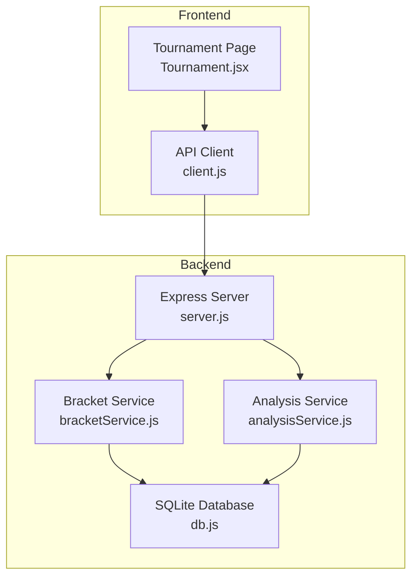
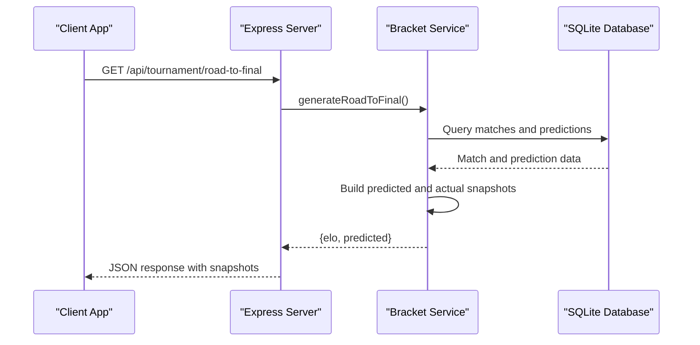
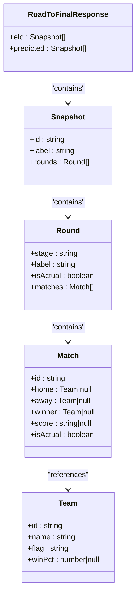
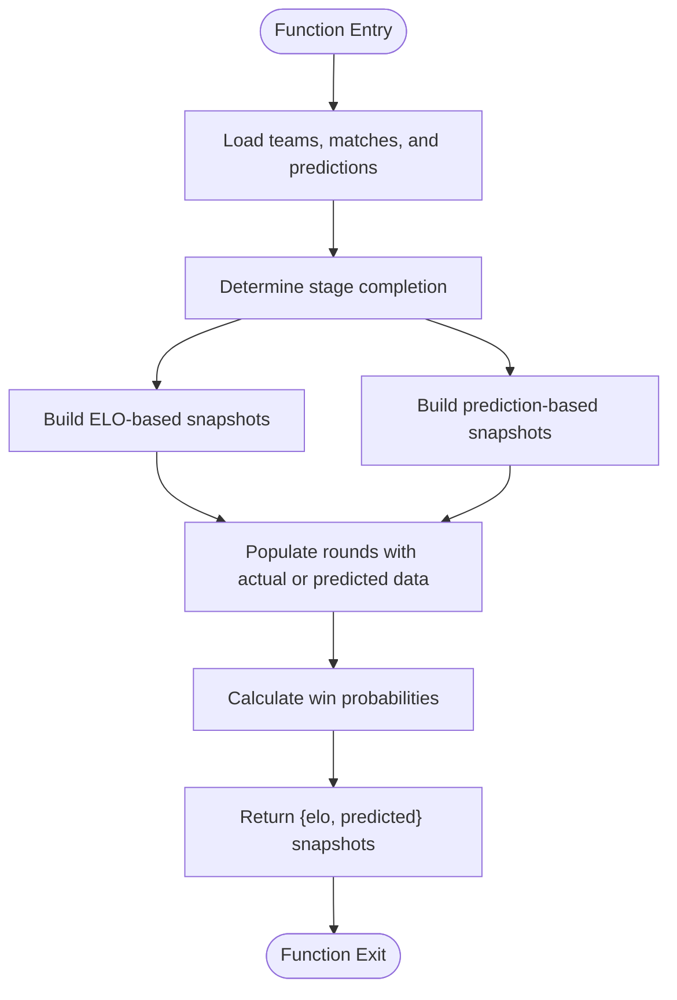
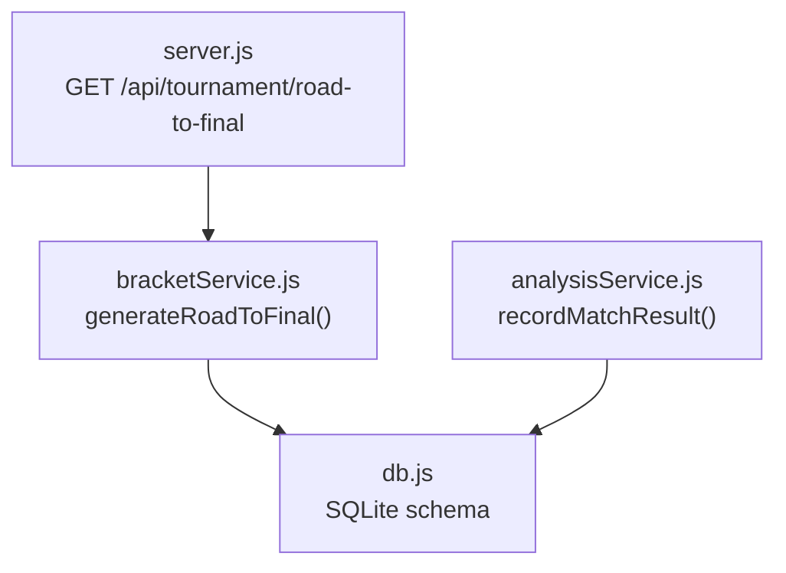

# Tournament Progression Analysis

<cite>
**Referenced Files in This Document**
- [server.js](file://backend/server.js)
- [bracketService.js](file://backend/services/bracketService.js)
- [analysisService.js](file://backend/services/analysisService.js)
- [db.js](file://backend/database/db.js)
- [client.js](file://frontend/src/api/client.js)
- [Tournament.jsx](file://frontend/src/pages/Tournament.jsx)
</cite>

## Table of Contents
1. [Introduction](#introduction)
2. [Project Structure](#project-structure)
3. [Core Components](#core-components)
4. [Architecture Overview](#architecture-overview)
5. [Detailed Component Analysis](#detailed-component-analysis)
6. [Dependency Analysis](#dependency-analysis)
7. [Performance Considerations](#performance-considerations)
8. [Troubleshooting Guide](#troubleshooting-guide)
9. [Conclusion](#conclusion)

## Introduction
This document provides comprehensive documentation for tournament progression analysis, focusing on the GET /api/tournament/road-to-final endpoint. It explains how predicted and actual tournament snapshots are generated across rounds, the data structures used, round-by-round analysis capabilities, and historical comparison features. The documentation also includes practical examples of progression tracking and scenario analysis to help users understand how the system builds and presents tournament progressions.

## Project Structure
The tournament progression analysis spans backend services, database schema, and frontend presentation:

- Backend API exposes the road-to-final endpoint and integrates with bracket and analysis services.
- The bracket service generates predicted and actual snapshots across knockout rounds.
- The analysis service manages match results and updates bracket progression.
- The database schema supports matches, predictions, and bracket tracking.
- The frontend consumes the API and renders interactive progression views.

**Diagram sources**
- [server.js:491-499](file://backend/server.js#L491-L499)
- [bracketService.js:908-1065](file://backend/services/bracketService.js#L908-L1065)
- [analysisService.js:76-218](file://backend/services/analysisService.js#L76-L218)
- [db.js:23-208](file://backend/database/db.js#L23-L208)
- [client.js:39](file://frontend/src/api/client.js#L39)
- [Tournament.jsx:184-262](file://frontend/src/pages/Tournament.jsx#L184-L262)

**Section sources**
- [server.js:491-499](file://backend/server.js#L491-L499)
- [bracketService.js:908-1065](file://backend/services/bracketService.js#L908-L1065)
- [analysisService.js:76-218](file://backend/services/analysisService.js#L76-L218)
- [db.js:23-208](file://backend/database/db.js#L23-L208)
- [client.js:39](file://frontend/src/api/client.js#L39)
- [Tournament.jsx:184-262](file://frontend/src/pages/Tournament.jsx#L184-L262)

## Core Components
This section documents the key components involved in tournament progression analysis:

- Road to Final Endpoint: Exposed by the backend server, it delegates to the bracket service to generate predicted and actual snapshots.
- Bracket Service: Implements the core logic for building snapshots across rounds, handling predicted and actual data, and combining ELO-based and prediction-based placements.
- Analysis Service: Manages match results, updates group standings, advances bracket winners, and recalculates ELO ratings.
- Database Schema: Supports matches, predictions, bracket slots, and model performance tracking.
- Frontend Integration: Consumes the endpoint and renders interactive progression views.

Key responsibilities:
- Generate predicted and actual snapshots for each round (R32, R16, QF, SF, Final).
- Combine real match outcomes with predicted outcomes to show historical comparisons.
- Support scenario analysis by allowing different placement models (ELO-based vs prediction-based).
- Provide round-by-round progression tracking with win probabilities and match results.

**Section sources**
- [server.js:491-499](file://backend/server.js#L491-L499)
- [bracketService.js:908-1065](file://backend/services/bracketService.js#L908-L1065)
- [analysisService.js:76-218](file://backend/services/analysisService.js#L76-L218)
- [db.js:51-94](file://backend/database/db.js#L51-L94)

## Architecture Overview
The road-to-final feature follows a layered architecture:

- API Layer: Exposes GET /api/tournament/road-to-final.
- Service Layer: The bracket service constructs snapshots using database data and prediction records.
- Data Layer: The database stores matches, predictions, and bracket-related metadata.
- Presentation Layer: The frontend retrieves snapshots and renders interactive bracket views.

**Diagram sources**
- [server.js:491-499](file://backend/server.js#L491-L499)
- [bracketService.js:908-1065](file://backend/services/bracketService.js#L908-L1065)
- [db.js:51-94](file://backend/database/db.js#L51-L94)

**Section sources**
- [server.js:491-499](file://backend/server.js#L491-L499)
- [bracketService.js:908-1065](file://backend/services/bracketService.js#L908-L1065)
- [db.js:51-94](file://backend/database/db.js#L51-L94)

## Detailed Component Analysis

### Road to Final Endpoint and Data Flow
The GET /api/tournament/road-to-final endpoint returns two snapshot lists:
- elo: Snapshots based on ELO-based group placements.
- predicted: Snapshots based on prediction-based group placements.

Each snapshot includes:
- id: Snapshot identifier (e.g., pre_tournament, after_r32, etc.).
- label: Human-readable description of the snapshot.
- rounds: Array of rounds with match details.

Each round includes:
- stage: Round identifier (R32, R16, QF, SF, F).
- label: Display label for the round.
- isActual: Boolean indicating whether the round reflects actual results.
- matches: Array of matches with home/away teams, winner, score, and win probabilities.

**Diagram sources**
- [bracketService.js:908-1065](file://backend/services/bracketService.js#L908-L1065)

**Section sources**
- [bracketService.js:908-1065](file://backend/services/bracketService.js#L908-L1065)

### Snapshot Construction Logic
The bracket service builds snapshots through the following steps:
- Load teams and matches from the database.
- Load latest predictions for knockout matches.
- Determine stage completion status based on match statuses.
- Build two sets of snapshots:
  - ELO-based: Uses ELO rankings for group placements when groups are incomplete.
  - Prediction-based: Uses prediction-derived placements for group standings.
- For each round:
  - If isActual is true, populate from real match data.
  - Otherwise, populate predicted teams and winners based on predictions or ELO.
  - Calculate win probabilities for predicted matches.

**Diagram sources**
- [bracketService.js:908-1065](file://backend/services/bracketService.js#L908-L1065)

**Section sources**
- [bracketService.js:908-1065](file://backend/services/bracketService.js#L908-L1065)

### Round-by-Round Analysis
The system supports round-by-round analysis by:
- Comparing predicted and actual outcomes for each match.
- Tracking progression through R32, R16, QF, SF, and Final.
- Displaying win probabilities alongside actual results for transparency.

Practical use cases:
- Compare predicted winners with actual winners in each round.
- Analyze how predictions evolve as more matches are completed.
- Visualize the impact of early-round results on later-stage progression.

**Section sources**
- [bracketService.js:983-1045](file://backend/services/bracketService.js#L983-L1045)

### Historical Comparison Features
Historical comparison is achieved by:
- Maintaining separate snapshot lists for ELO-based and prediction-based models.
- Using stage completion flags to distinguish between predicted and actual rounds.
- Allowing users to switch between snapshot models for comparative analysis.

Benefits:
- Users can evaluate how prediction accuracy changes across rounds.
- Provides context for why predicted outcomes differ from actual results.

**Section sources**
- [bracketService.js:1047-1059](file://backend/services/bracketService.js#L1047-L1059)

### Scenario Analysis Capabilities
Scenario analysis leverages:
- Prediction-based placements to simulate how different group outcomes would affect bracket seeding.
- ELO-based placements as a fallback when groups are incomplete.
- Combination tables for determining best third-place teams and their assignments.

Use cases:
- Explore how finishing positions in a group affect potential R32 matchups.
- Evaluate the impact of hypothetical match results on bracket progression.

**Section sources**
- [bracketService.js:366-476](file://backend/services/bracketService.js#L366-L476)
- [bracketService.js:275-330](file://backend/services/bracketService.js#L275-L330)

### Frontend Integration and Rendering
The frontend integrates with the road-to-final endpoint to:
- Fetch snapshots and initialize the selected model (default: predicted).
- Render interactive bracket views with match cards and connecting lines.
- Allow switching between snapshot models for comparative analysis.

Rendering highlights:
- Horizontal bracket layout with stage columns and SVG connectors.
- Visual indicators for actual vs predicted rounds.
- Responsive design with team flags and win percentages.

**Section sources**
- [client.js:39](file://frontend/src/api/client.js#L39)
- [Tournament.jsx:184-262](file://frontend/src/pages/Tournament.jsx#L184-L262)

## Dependency Analysis
The road-to-final feature depends on several backend services and database tables:

**Diagram sources**
- [server.js:491-499](file://backend/server.js#L491-L499)
- [bracketService.js:908-1065](file://backend/services/bracketService.js#L908-L1065)
- [analysisService.js:76-218](file://backend/services/analysisService.js#L76-L218)
- [db.js:51-94](file://backend/database/db.js#L51-L94)

Key dependencies:
- Matches and predictions tables provide the foundation for constructing snapshots.
- Bracket slots and knockout schedule support bracket construction.
- Model performance and prediction tables enable historical analysis.

**Section sources**
- [db.js:51-94](file://backend/database/db.js#L51-L94)
- [server.js:491-499](file://backend/server.js#L491-L499)
- [bracketService.js:908-1065](file://backend/services/bracketService.js#L908-L1065)
- [analysisService.js:76-218](file://backend/services/analysisService.js#L76-L218)

## Performance Considerations
- Snapshot generation queries a fixed set of knockout-stage matches and their latest predictions, minimizing overhead.
- Caching: The bracket service maintains a simulation cache for Monte Carlo simulations; similar caching could be considered for road-to-final if needed.
- Database indexing: Ensure appropriate indexes on matches (stage, status) and predictions (match_id, generated_at) for optimal query performance.
- Frontend rendering: Horizontal bracket layout uses SVG connectors; keep match counts manageable to maintain smooth rendering.

## Troubleshooting Guide
Common issues and resolutions:
- Empty or incomplete snapshots:
  - Verify that knockout-stage matches exist and have associated predictions.
  - Confirm that stage completion flags are correctly populated based on match statuses.
- Incorrect winners or probabilities:
  - Check prediction records for knockout matches and ensure they are up-to-date.
  - Validate ELO-based calculations when groups are incomplete.
- Frontend rendering anomalies:
  - Ensure snapshot data structures match expected shapes (rounds, matches, teams).
  - Verify stage ordering and display logic for predicted vs actual rounds.

**Section sources**
- [bracketService.js:908-1065](file://backend/services/bracketService.js#L908-L1065)
- [analysisService.js:76-218](file://backend/services/analysisService.js#L76-L218)

## Conclusion
The tournament progression analysis system provides a robust framework for tracking and visualizing World Cup 2026 bracket progressions. By combining predicted and actual outcomes across rounds, it enables users to compare scenarios, understand historical context, and gain insights into team advancement patterns. The modular architecture ensures maintainability and extensibility, while the frontend delivers an intuitive, interactive experience.