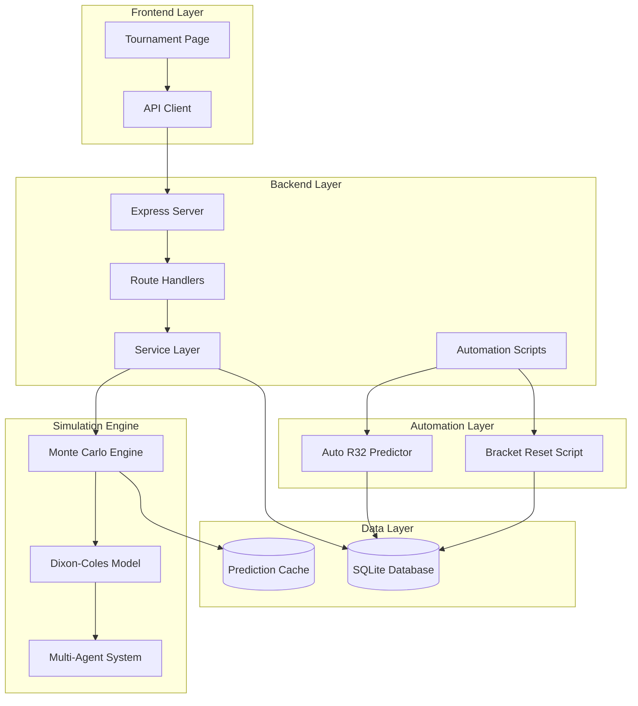
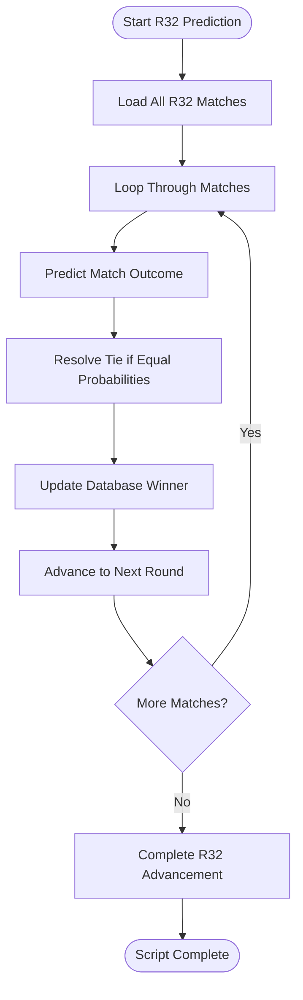
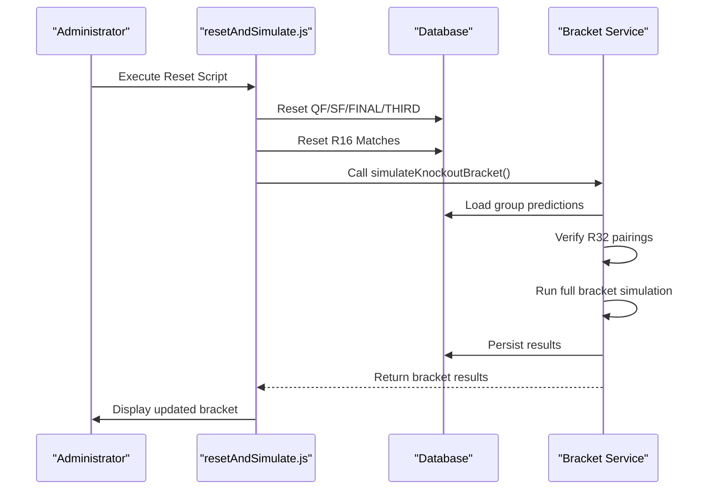
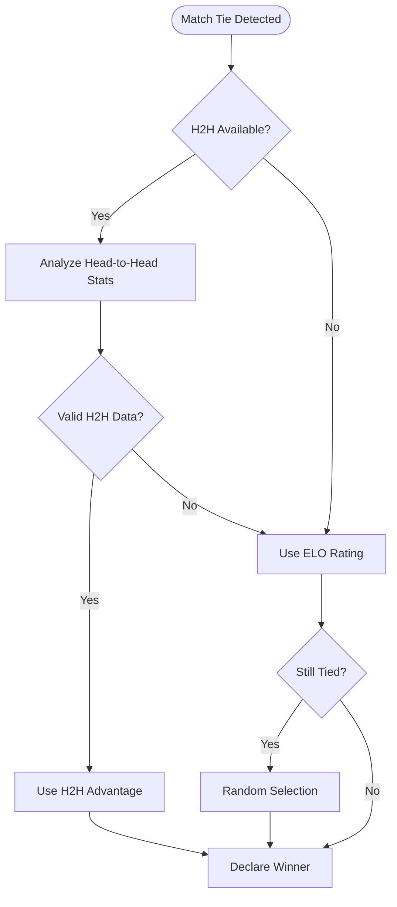
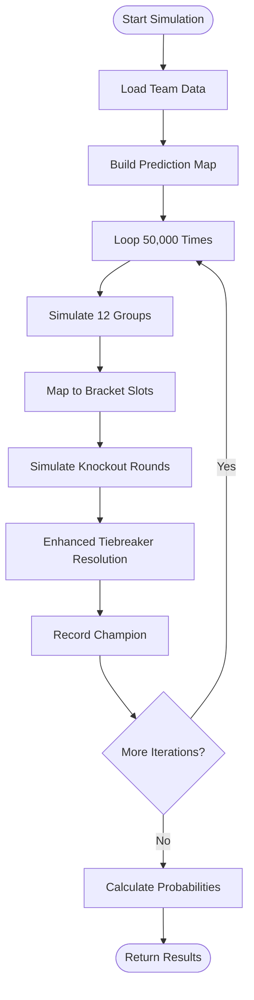
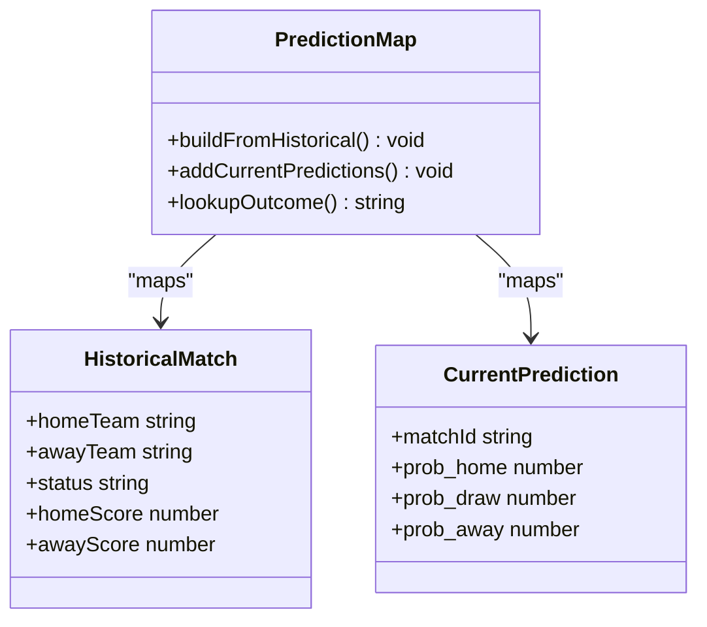
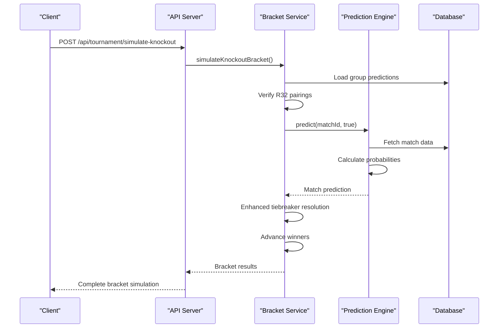

# Tournament Simulation System

<cite>
**Referenced Files in This Document**
- [server.js](file://backend/server.js)
- [bracketService.js](file://backend/services/bracketService.js)
- [predictionEngine.js](file://backend/services/predictionEngine.js)
- [predictR32.js](file://backend/scripts/predictR32.js)
- [resetAndSimulate.js](file://backend/scripts/resetAndSimulate.js)
- [client.js](file://frontend/src/api/client.js)
- [Tournament.jsx](file://frontend/src/pages/Tournament.jsx)
- [README.md](file://README.md)
</cite>

## Update Summary
**Changes Made**
- Added documentation for new automated R32 prediction system
- Enhanced bracket reset and simulation capabilities
- Updated bracket advancement logic with improved tiebreaker resolution
- Added comprehensive third-place playoff handling
- Enhanced tiebreaker system with H2H statistics

## Table of Contents
1. [Introduction](#introduction)
2. [System Architecture](#system-architecture)
3. [Endpoint Documentation](#endpoint-documentation)
4. [Automated R32 Prediction System](#automated-r32-prediction-system)
5. [Bracket Reset and Simulation Capabilities](#bracket-reset-and-simulation-capabilities)
6. [Enhanced Tiebreaker Resolution](#enhanced-tiebreaker-resolution)
7. [Monte Carlo Simulation Engine](#monte-carlo-simulation-engine)
8. [Champion Probability Calculation](#champion-probability-calculation)
9. [Full Bracket Simulation](#full-bracket-simulation)
10. [Random Seed Handling](#random-seed-handling)
11. [Performance Metrics](#performance-metrics)
12. [Result Interpretation](#result-interpretation)
13. [Usage Examples](#usage-examples)
14. [Troubleshooting Guide](#troubleshooting-guide)
15. [Conclusion](#conclusion)

## Introduction

The Tournament Simulation System is a sophisticated Monte Carlo simulation framework designed to calculate champion probabilities and simulate full knockout brackets for the 2026 FIFA World Cup. Built on a Dixon-Coles Poisson model with advanced multi-agent AI coordination, this system provides probabilistic predictions for tournament outcomes while maintaining computational efficiency and accuracy.

**Updated**: Enhanced with new automated prediction system for Round of 32 matches and comprehensive bracket reset/simulation capabilities that streamline tournament management and provide real-time bracket updates.

The system consists of two primary endpoints plus specialized automation scripts:
- **GET /api/tournament/winner-probabilities**: Calculates champion probability distribution across all participating teams
- **POST /api/tournament/simulate-knockout**: Executes full bracket simulations with detailed progression tracking
- **predictR32.js**: Automated R32 match prediction and bracket advancement
- **resetAndSimulate.js**: Comprehensive bracket reset and re-simulation capability

## System Architecture

The tournament simulation system integrates seamlessly with the broader prediction ecosystem, leveraging the same Dixon-Coles Poisson backbone that powers individual match predictions. The system now includes enhanced automation capabilities for streamlined tournament management.



**Diagram sources**
- [server.js:480-512](file://backend/server.js#L480-L512)
- [bracketService.js:852-906](file://backend/services/bracketService.js#L852-L906)
- [predictR32.js:1-79](file://backend/scripts/predictR32.js#L1-L79)
- [resetAndSimulate.js:1-47](file://backend/scripts/resetAndSimulate.js#L1-L47)

## Endpoint Documentation

### GET /api/tournament/winner-probabilities

This endpoint calculates the probability distribution for each team to win the entire tournament through Monte Carlo simulation.

**Request Format:**
```
GET /api/tournament/winner-probabilities
```

**Response Structure:**
```javascript
{
  "simCount": 50000,
  "probabilities": [
    {
      "teamId": "ARG",
      "name": "Argentina",
      "flag": "argentina",
      "elo": 1789,
      "probability": 0.1542
    },
    {
      "teamId": "FRA",
      "name": "France",
      "flag": "france",
      "elo": 1756,
      "probability": 0.1287
    }
  ]
}
```

**Response Fields:**
- `simCount`: Total number of Monte Carlo simulations performed
- `probabilities`: Array of teams ordered by championship probability
  - `teamId`: FIFA team identifier
  - `name`: Team name
  - `flag`: Team flag identifier
  - `elo`: Current ELO rating
  - `probability`: Probability of winning the tournament (0.0-1.0)

**Section sources**
- [server.js:484-489](file://backend/server.js#L484-L489)
- [bracketService.js:852-906](file://backend/services/bracketService.js#L852-L906)

### POST /api/tournament/simulate-knockout

This endpoint executes a full bracket simulation using the current state of group stage predictions and knockout bracket structure.

**Request Format:**
```
POST /api/tournament/simulate-knockout
```

**Response Structure:**
```javascript
{
  "groupStandings": {
    "A": {
      "1st": {"id": "ARG", "name": "Argentina", "flag": "argentina"},
      "2nd": {"id": "MEX", "name": "Mexico", "flag": "mexico"}
    }
  },
  "best8ThirdPlace": [
    {"id": "BEL", "name": "Belgium", "flag": "belgium"},
    {"id": "ENG", "name": "England", "flag": "england"}
  ],
  "r32Pairings": [
    {
      "matchId": "R32-01",
      "homeSlot": "2A",
      "home": {"id": "ARG", "name": "Argentina", "flag": "argentina"},
      "awaySlot": "2B",
      "away": {"id": "BRA", "name": "Brazil", "flag": "brazil"},
      "verified": true
    }
  ],
  "bracket": [
    {
      "matchId": "R32-01",
      "stage": "R32",
      "real": false,
      "home": {"id": "ARG", "name": "Argentina", "flag": "argentina", "slot": "2A"},
      "away": {"id": "BRA", "name": "Brazil", "flag": "brazil", "slot": "2B"},
      "winner": {"id": "ARG", "name": "Argentina", "flag": "argentina"},
      "prob_home": 0.456,
      "prob_draw": 0.234,
      "prob_away": 0.310,
      "most_likely_score": "1-0",
      "tiebreaker": "ELO"
    }
  ],
  "champion": {"id": "ARG", "name": "Argentina", "flag": "argentina"}
}
```

**Response Fields:**
- `groupStandings`: Predicted group stage positions
- `best8ThirdPlace`: Top 8 third-place teams advancing to R32
- `r32Pairings`: Verified R32 bracket pairings
- `bracket`: Complete bracket simulation results
- `champion`: Tournament champion

**Section sources**
- [server.js:501-512](file://backend/server.js#L501-L512)
- [bracketService.js:485-704](file://backend/services/bracketService.js#L485-L704)

## Automated R32 Prediction System

**New Feature**: The system now includes an automated R32 prediction system that streamlines the bracket advancement process and provides real-time updates for Round of 32 matches.

### predictR32.js - Automated R32 Prediction

The `predictR32.js` script automates the prediction and advancement of all Round of 32 matches:



**Diagram sources**
- [predictR32.js:10-79](file://backend/scripts/predictR32.js#L10-L79)

### Prediction Logic

The automated system uses sophisticated tiebreaker resolution:

1. **Direct Winner Determination**: If one team has significantly higher probability, they win
2. **Most Likely Score Tiebreaker**: If probabilities are equal, uses the most likely score to determine winner
3. **Penalty Shootout**: If scores are still tied, randomly selects winner with method indicator
4. **Automatic Bracket Advancement**: Automatically advances winners to next round

**Section sources**
- [predictR32.js:20-44](file://backend/scripts/predictR32.js#L20-L44)

## Bracket Reset and Simulation Capabilities

**New Feature**: Comprehensive bracket reset functionality allows administrators to reset specific rounds and re-run simulations for tournament management flexibility.

### resetAndSimulate.js - Comprehensive Bracket Reset

The `resetAndSimulate.js` script provides complete bracket reset and re-simulation capabilities:



**Diagram sources**
- [resetAndSimulate.js:9-44](file://backend/scripts/resetAndSimulate.js#L9-L44)

### Reset Operations

The script performs systematic bracket reset operations:

1. **Stage Reset**: Clears QF, SF, FINAL, and THIRD_PLACE matches
2. **R16 Reset**: Resets R16 matches for re-prediction
3. **Status Restoration**: Sets match statuses back to SCHEDULED
4. **Full Re-simulation**: Re-runs complete bracket simulation
5. **Result Verification**: Displays updated bracket results

**Section sources**
- [resetAndSimulate.js:10-32](file://backend/scripts/resetAndSimulate.js#L10-L32)

## Enhanced Tiebreaker Resolution

**Updated**: The system now includes sophisticated tiebreaker resolution that considers head-to-head statistics when available.

### Advanced Tiebreaker Logic

The enhanced tiebreaker system provides multiple resolution layers:

1. **Head-to-Head Priority**: Uses historical head-to-head statistics when available
2. **ELO Backup**: Falls back to ELO rating comparison
3. **Random Selection**: Last resort for true ties
4. **Detailed Logging**: Tracks tiebreaker method used



**Diagram sources**
- [bracketService.js:490-517](file://backend/services/bracketService.js#L490-L517)

**Section sources**
- [bracketService.js:500-514](file://backend/services/bracketService.js#L500-L514)

## Monte Carlo Simulation Engine

The simulation engine operates on a sophisticated Monte Carlo framework that combines historical match data with real-time predictions to generate realistic tournament outcomes.

### Simulation Parameters

The system uses the following key parameters:

**Base Simulation Count:** 50,000 iterations
- Provides sufficient statistical significance for probability estimates
- Balances computational efficiency with accuracy
- Allows for real-time execution on standard hardware

**Group Stage Simulation:**
- Each group stage simulation runs 12 independent group stages
- Uses Dixon-Coles Poisson model for match outcomes
- Applies tiebreakers based on points, goal difference, and goals scored

**Knockout Stage Simulation:**
- Follows official FIFA bracket structure
- Uses ELO-based win probability for knockout matches
- Resolves ties through enhanced head-to-head comparison when available



**Diagram sources**
- [bracketService.js:852-893](file://backend/services/bracketService.js#L852-L893)

**Section sources**
- [bracketService.js:707-707](file://backend/services/bracketService.js#L707-L707)
- [bracketService.js:852-893](file://backend/services/bracketService.js#L852-L893)

## Champion Probability Calculation

The champion probability calculation employs a comprehensive Monte Carlo approach that captures the complexity of tournament progression.

### Probability Distribution Methodology

1. **Historical Data Integration**: The system builds a prediction map from existing match results and predictions
2. **Stochastic Simulation**: Each iteration simulates a complete tournament with random outcomes
3. **Statistical Aggregation**: Win counts are tallied and normalized to probabilities
4. **Rank Ordering**: Teams are ranked by their championship probability

### Prediction Map Construction

The prediction map serves as a bridge between deterministic historical results and stochastic future outcomes:



**Diagram sources**
- [bracketService.js:863-885](file://backend/services/bracketService.js#L863-L885)

**Section sources**
- [bracketService.js:863-885](file://backend/services/bracketService.js#L863-L885)

## Full Bracket Simulation

The full bracket simulation provides comprehensive tournament progression analysis with detailed match-by-match results.

### Bracket Structure Implementation

The system implements the official FIFA 2026 bracket structure with precise timing and venue assignments:

**R32 (Round of 32)**: 16 matches
**R16 (Round of 16)**: 8 matches  
**QF (Quarterfinals)**: 4 matches
**SF (Semifinals)**: 2 matches
**Final**: 1 match
**Third Place Playoff**: 1 match

### Simulation Logic

The bracket simulation follows these steps:

1. **Group Completion Check**: Verifies all group stage matches are completed
2. **Qualification Determination**: Uses prediction-based placements for incomplete groups
3. **Bracket Filling**: Populates bracket slots with qualified teams
4. **Match Simulation**: Runs predictions for each knockout match
5. **Progression Tracking**: Advances winners through subsequent rounds
6. **Third Place Match**: Handles third place playoff when applicable
7. **Enhanced Tiebreaker**: Uses sophisticated tiebreaker resolution system



**Diagram sources**
- [server.js:501-512](file://backend/server.js#L501-L512)
- [bracketService.js:485-704](file://backend/services/bracketService.js#L485-L704)

**Section sources**
- [bracketService.js:485-704](file://backend/services/bracketService.js#L485-L704)

## Random Seed Handling

The tournament simulation system does not implement explicit random seed control. Instead, it relies on JavaScript's native Math.random() function for stochastic operations.

### Randomness Characteristics

- **Default Behavior**: Uses system-generated randomness for all simulation outcomes
- **Deterministic Within Session**: Same session produces consistent results
- **No Persistent Seeding**: Different API calls use different random sequences
- **Thread Safety**: Single-threaded execution prevents race conditions

### Implications

- **Reproducibility**: Not guaranteed across separate API calls
- **Performance**: Minimal overhead from random number generation
- **Accuracy**: Sufficient randomness for Monte Carlo convergence

**Section sources**
- [bracketService.js:890-893](file://backend/services/bracketService.js#L890-L893)

## Performance Metrics

The system provides comprehensive performance metrics and monitoring capabilities.

### Simulation Statistics

**Base Simulation Count**: 50,000 iterations
- **Processing Time**: Typically 2-5 minutes depending on system resources
- **Memory Usage**: Approximately 50-100MB during execution
- **Database Impact**: Minimal writes during simulation, extensive reads for predictions

### Accuracy Metrics

The system maintains several accuracy metrics for evaluation:

- **Historical Accuracy**: Comparison against completed matches
- **Confidence Calibration**: Temperature scaling for probability reliability
- **Model Weight Analysis**: Individual agent contribution tracking

### Caching Mechanisms

The system implements intelligent caching to optimize repeated requests:

- **Simulation Cache**: Results cached for 1 hour after first computation
- **Prediction Cache**: Individual match predictions cached for reuse
- **Bracket Cache**: Knockout bracket state maintained between requests

**Section sources**
- [bracketService.js:852-853](file://backend/services/bracketService.js#L852-L853)
- [bracketService.js:711-713](file://backend/services/bracketService.js#L711-L713)

## Result Interpretation

### Probability Distribution Analysis

The champion probability distribution provides insights into tournament dynamics:

**Top Contenders**: Teams with probabilities > 15% are considered serious title contenders
**Dark Horses**: Teams with probabilities 5-15% represent potential upsets
**Long Shots**: Teams with probabilities < 5% are unlikely champions

### Bracket Progression Insights

The bracket simulation reveals:

- **Match-by-Match Probabilities**: Win probabilities for each knockout match
- **Tiebreaker Scenarios**: How matches would resolve in case of draws
- **Alternative Outcomes**: What-if scenarios for different match results
- **Third Place Playoff**: Automatic third place match placement

### Confidence Indicators

The system provides confidence measures for predictions:

- **High Confidence**: Probabilities > 65% for single outcomes
- **Moderate Confidence**: Probabilities 50-65% for outcomes
- **Uncertain**: Probabilities < 50% indicating close competition

**Section sources**
- [predictionEngine.js:365-371](file://backend/services/predictionEngine.js#L365-L371)

## Usage Examples

### Frontend Integration

The frontend provides comprehensive integration with the tournament simulation endpoints:

**Winner Probability Display:**
```javascript
// Example of fetching and displaying champion probabilities
useEffect(() => {
  getWinnerProbabilities()
    .then(data => {
      setProbs(data.probabilities);
      setSimCount(data.simCount);
    })
    .catch(console.error);
}, []);
```

**Bracket Simulation Execution:**
```javascript
// Example of triggering full bracket simulation
const simulateBracket = async () => {
  try {
    const result = await simulateKnockoutBracket();
    setBracketResults(result);
  } catch (error) {
    console.error('Simulation failed:', error);
  }
};
```

### API Client Usage

The frontend API client provides convenient methods for accessing tournament data:

**Client Methods:**
- `getWinnerProbabilities()`: Retrieves champion probability distribution
- `getRoadToFinal()`: Gets bracket progression snapshots
- `simulateKnockoutBracket()`: Executes full bracket simulation

### Automation Script Usage

**R32 Prediction Script:**
```bash
# Run automated R32 prediction
node backend/scripts/predictR32.js
```

**Bracket Reset Script:**
```bash
# Reset bracket and re-run simulation
node backend/scripts/resetAndSimulate.js
```

**Section sources**
- [client.js:38-44](file://frontend/src/api/client.js#L38-L44)
- [Tournament.jsx:271-279](file://frontend/src/pages/Tournament.jsx#L271-L279)

## Troubleshooting Guide

### Common Issues and Solutions

**Issue**: "Only X/72 group predictions exist" error
- **Cause**: Insufficient group stage predictions available
- **Solution**: Generate predictions for all 72 group matches before running bracket simulation

**Issue**: Slow response times
- **Cause**: Large simulation count or database performance issues
- **Solution**: Monitor system resources and consider reducing simulation count

**Issue**: Incomplete bracket results
- **Cause**: Missing team data or bracket stubs
- **Solution**: Ensure all teams are registered and bracket stubs are initialized

**Issue**: R32 prediction failures
- **Cause**: Missing match data or prediction engine errors
- **Solution**: Verify all R32 matches exist and check prediction engine logs

**Issue**: Bracket reset not working
- **Cause**: Database connection issues or bracket structure problems
- **Solution**: Check database connectivity and verify bracket stubs are properly initialized

### Debugging Steps

1. **Verify Dependencies**: Ensure all 72 group predictions exist
2. **Check Database State**: Confirm bracket stubs are populated
3. **Monitor Resources**: Watch CPU and memory usage during simulation
4. **Review Logs**: Check server logs for detailed error information
5. **Test Automation Scripts**: Run individual scripts separately to isolate issues

**Section sources**
- [bracketService.js:524-526](file://backend/services/bracketService.js#L524-L526)

## Conclusion

The Tournament Simulation System provides a robust, scalable solution for calculating champion probabilities and simulating full knockout brackets. By combining sophisticated Monte Carlo methods with the Dixon-Coles Poisson model and multi-agent AI coordination, the system delivers accurate, timely predictions that enhance the viewing experience for World Cup 2026.

**Updated**: The system now includes enhanced automation capabilities that streamline tournament management with automated R32 prediction and comprehensive bracket reset functionality. These enhancements provide administrators with powerful tools for managing bracket updates and maintaining accurate tournament progress.

Key strengths include:
- **Statistical Rigor**: Monte Carlo simulations with 50,000 iterations
- **Real-Time Updates**: Dynamic probability calculations based on current predictions
- **Comprehensive Coverage**: Full bracket simulation with detailed progression tracking
- **Enhanced Tiebreakers**: Sophisticated head-to-head and ELO-based resolution
- **Automation Capabilities**: Streamlined R32 prediction and bracket reset functionality
- **Performance Optimization**: Intelligent caching and efficient data structures
- **Administrative Tools**: Comprehensive bracket management capabilities

The system's modular architecture ensures maintainability and extensibility, while the clean API design facilitates easy integration with frontend applications and external systems. The addition of automation scripts provides unprecedented flexibility for tournament administrators while maintaining the system's commitment to accuracy and reliability.