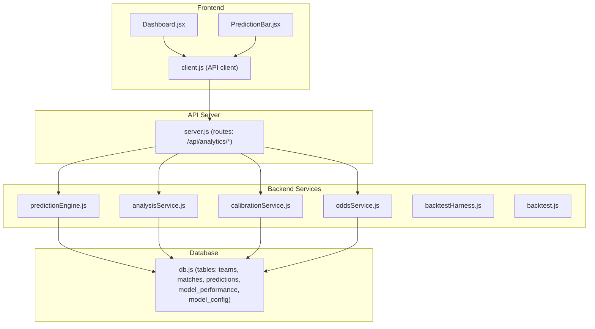
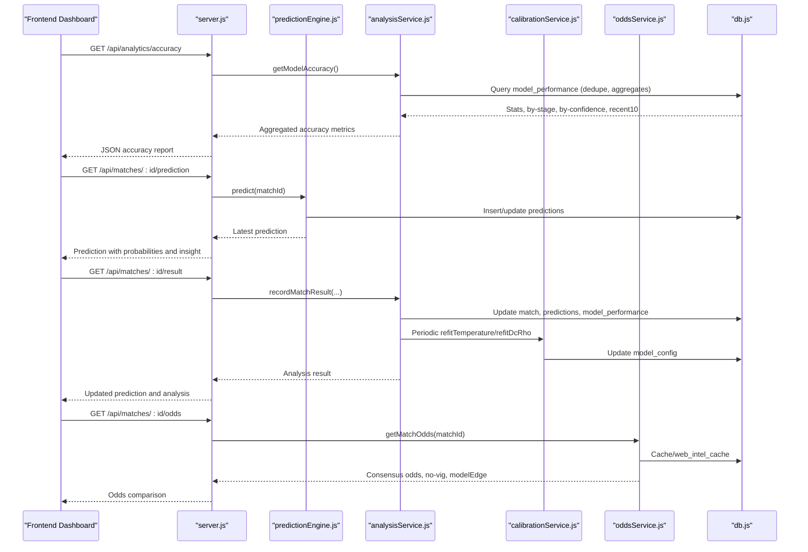
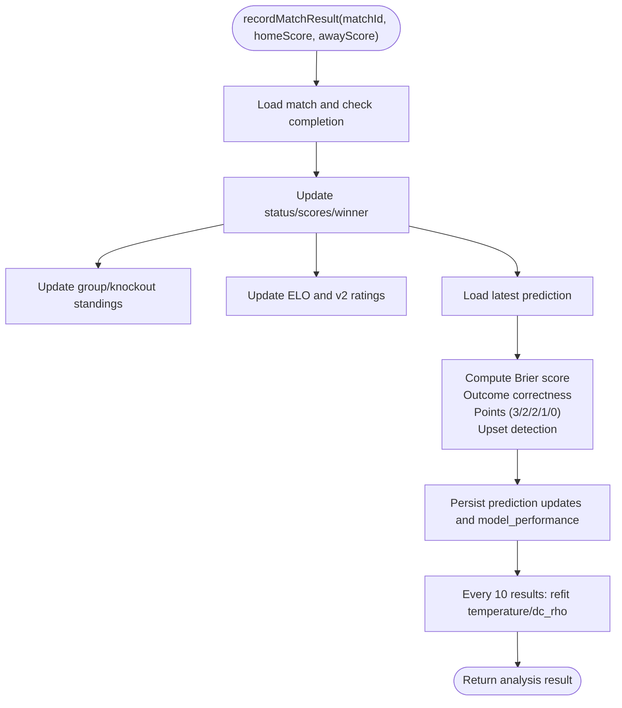
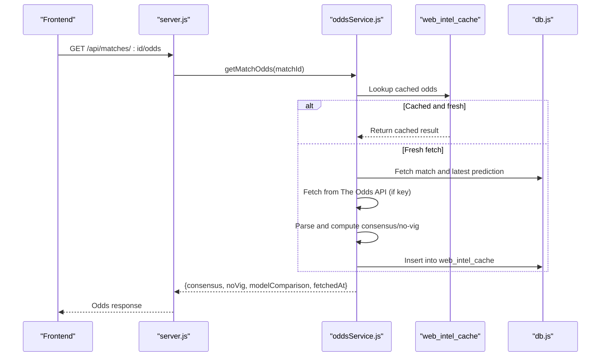
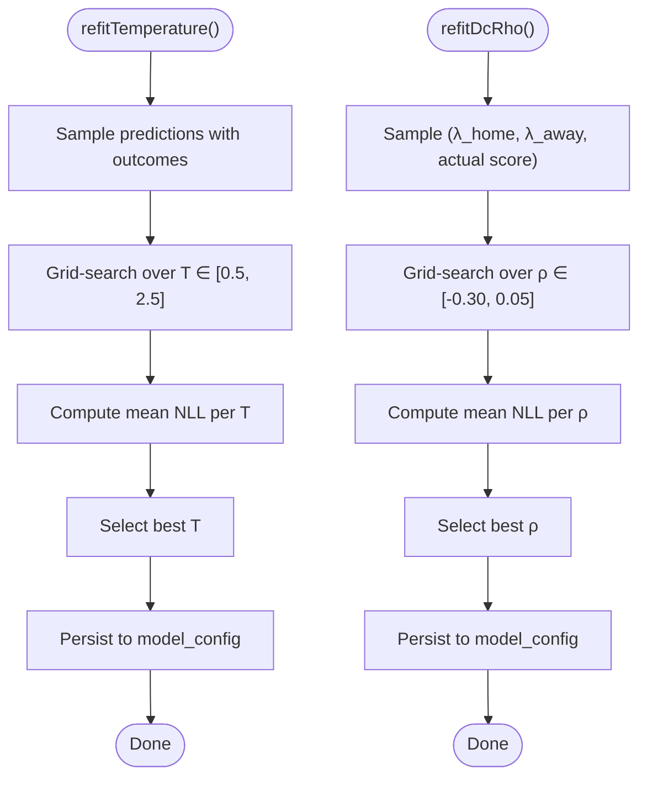
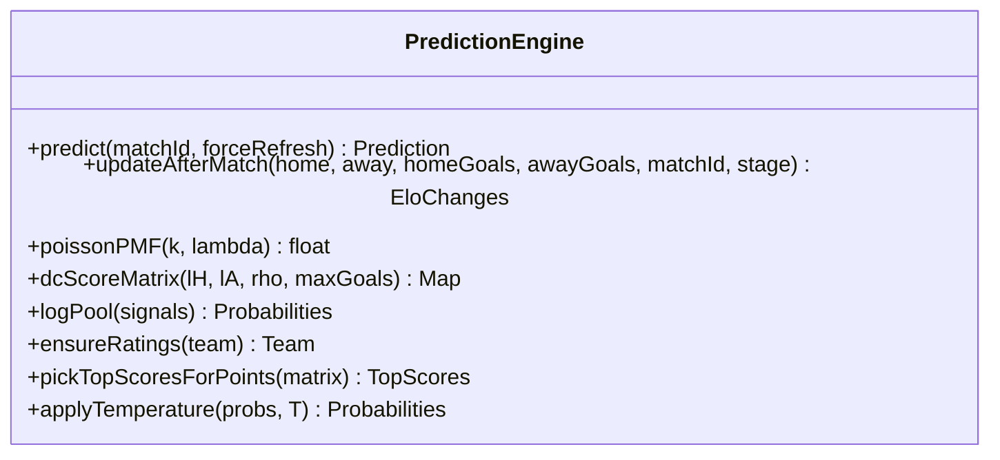
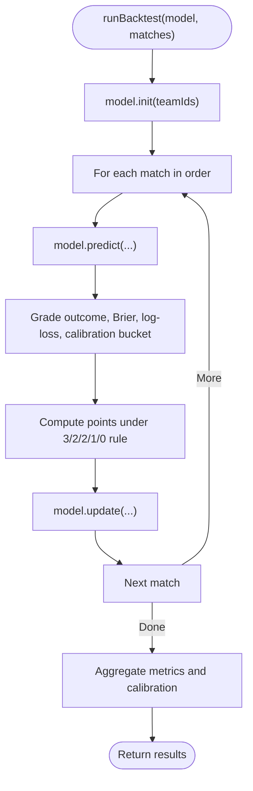
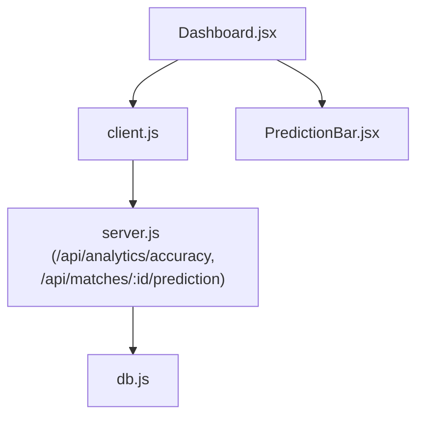
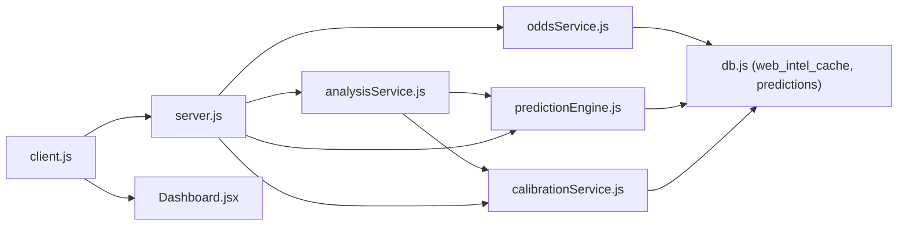

# Analytics and Reporting

<cite>
**Referenced Files in This Document**
- [analysisService.js](file://backend/services/analysisService.js)
- [oddsService.js](file://backend/services/oddsService.js)
- [calibrationService.js](file://backend/services/calibrationService.js)
- [predictionEngine.js](file://backend/services/predictionEngine.js)
- [backtest.js](file://backend/scripts/backtest.js)
- [backtestHarness.js](file://backend/scripts/backtestHarness.js)
- [db.js](file://backend/database/db.js)
- [server.js](file://backend/server.js)
- [client.js](file://frontend/src/api/client.js)
- [Dashboard.jsx](file://frontend/src/pages/Dashboard.jsx)
- [PredictionBar.jsx](file://frontend/src/components/PredictionBar.jsx)
</cite>

## Table of Contents
1. [Introduction](#introduction)
2. [Project Structure](#project-structure)
3. [Core Components](#core-components)
4. [Architecture Overview](#architecture-overview)
5. [Detailed Component Analysis](#detailed-component-analysis)
6. [Dependency Analysis](#dependency-analysis)
7. [Performance Considerations](#performance-considerations)
8. [Troubleshooting Guide](#troubleshooting-guide)
9. [Conclusion](#conclusion)
10. [Appendices](#appendices)

## Introduction
This document describes the analytics and reporting system that tracks model performance, computes accuracy metrics, compares betting markets, and surfaces insights for transparency and education. It covers:
- Post-match grading, Brier score computation, and performance trend analysis
- Betting odds integration, market consensus, and discrepancy analysis
- Confidence calibration and bias detection
- Statistical tools for agent performance and historical accuracy
- Reporting dashboard components for metrics and comparative analysis
- Mathematical foundations for calibration, significance testing, and predictive power assessment
- Integration with external sports analytics platforms and data validation

## Project Structure
The analytics stack spans backend services, database schema, and frontend dashboards:
- Backend services implement prediction, analysis, calibration, and odds retrieval
- Database stores matches, predictions, model performance, and configuration
- Frontend consumes analytics endpoints to render accuracy, probabilities, and comparative insights

**Diagram sources**
- [analysisService.js:1-422](file://backend/services/analysisService.js#L1-L422)
- [oddsService.js:1-242](file://backend/services/oddsService.js#L1-L242)
- [calibrationService.js:1-132](file://backend/services/calibrationService.js#L1-L132)
- [predictionEngine.js:1-1046](file://backend/services/predictionEngine.js#L1-L1046)
- [backtestHarness.js:1-156](file://backend/scripts/backtestHarness.js#L1-L156)
- [backtest.js:1-102](file://backend/scripts/backtest.js#L1-L102)
- [db.js:1-252](file://backend/database/db.js#L1-L252)
- [server.js:527-570](file://backend/server.js#L527-L570)
- [client.js:1-50](file://frontend/src/api/client.js#L1-L50)
- [Dashboard.jsx:137-706](file://frontend/src/pages/Dashboard.jsx#L137-L706)
- [PredictionBar.jsx:1-51](file://frontend/src/components/PredictionBar.jsx#L1-L51)

**Section sources**
- [db.js:23-227](file://backend/database/db.js#L23-L227)
- [server.js:527-570](file://backend/server.js#L527-L570)
- [client.js:41-42](file://frontend/src/api/client.js#L41-L42)
- [Dashboard.jsx:137-706](file://frontend/src/pages/Dashboard.jsx#L137-L706)

## Core Components
- Analysis service: post-match grading, Brier score, model performance storage, group standings, and accuracy aggregation
- Odds service: fetching real odds, consensus computation, no-vig normalization, and model-edge comparison
- Calibration service: temperature scaling and Dixon–Coles ρ fitting for probability calibration
- Prediction engine: DC backbone, log-pool blending, confidence derivation, and top-3 scoreline selection
- Backtesting framework: walk-forward evaluation, Brier/log-loss, calibration buckets, and scoring rule points
- Database schema: predictions, model performance, model config, and supporting tables
- API endpoints: analytics accuracy, model weights, agent performance, and sync
- Frontend dashboards: accuracy cards, top picks, and segmented probability bars

**Section sources**
- [analysisService.js:76-218](file://backend/services/analysisService.js#L76-L218)
- [analysisService.js:321-384](file://backend/services/analysisService.js#L321-L384)
- [oddsService.js:131-200](file://backend/services/oddsService.js#L131-L200)
- [calibrationService.js:53-82](file://backend/services/calibrationService.js#L53-L82)
- [calibrationService.js:88-129](file://backend/services/calibrationService.js#L88-L129)
- [predictionEngine.js:691-922](file://backend/services/predictionEngine.js#L691-L922)
- [backtestHarness.js:72-156](file://backend/scripts/backtestHarness.js#L72-L156)
- [db.js:72-166](file://backend/database/db.js#L72-L166)
- [server.js:527-570](file://backend/server.js#L527-L570)
- [client.js:41-42](file://frontend/src/api/client.js#L41-L42)
- [Dashboard.jsx:361-398](file://frontend/src/pages/Dashboard.jsx#L361-L398)
- [PredictionBar.jsx:1-51](file://frontend/src/components/PredictionBar.jsx#L1-L51)

## Architecture Overview
The analytics pipeline integrates prediction, post-match analysis, calibration, and reporting:
- Prediction engine generates probabilistic outcomes and top-3 scorelines
- Analysis service grades predictions post-match, computes Brier score, and updates performance logs
- Calibration service periodically refits temperature and DC ρ to improve probability reliability
- Odds service retrieves market consensus and computes model-edge for transparency
- API exposes analytics endpoints consumed by the frontend dashboard

**Diagram sources**
- [server.js:527-570](file://backend/server.js#L527-L570)
- [analysisService.js:76-218](file://backend/services/analysisService.js#L76-L218)
- [analysisService.js:321-384](file://backend/services/analysisService.js#L321-L384)
- [calibrationService.js:53-82](file://backend/services/calibrationService.js#L53-L82)
- [calibrationService.js:88-129](file://backend/services/calibrationService.js#L88-L129)
- [oddsService.js:131-200](file://backend/services/oddsService.js#L131-L200)
- [predictionEngine.js:691-922](file://backend/services/predictionEngine.js#L691-L922)
- [db.js:72-166](file://backend/database/db.js#L72-L166)

## Detailed Component Analysis

### Analysis Service: Post-Match Grading and Accuracy Tracking
- Post-match result recording updates match status, group standings, and ELO ratings
- Prediction grading computes Brier score, outcome correctness, points under the 3/2/2/1/0 rule, and upset detection
- Model performance logging captures predicted vs actual outcomes, confidence, and analysis notes
- Accuracy aggregation provides global stats, stage-wise accuracy, confidence bins, recent results, and current weights
- Group standings recalculations ensure idempotence and correctness across regrades

**Diagram sources**
- [analysisService.js:76-218](file://backend/services/analysisService.js#L76-L218)
- [analysisService.js:321-384](file://backend/services/analysisService.js#L321-L384)

**Section sources**
- [analysisService.js:76-218](file://backend/services/analysisService.js#L76-L218)
- [analysisService.js:321-384](file://backend/services/analysisService.js#L321-L384)

### Odds Service: Market Comparison and Discrepancy Analysis
- Fetches real odds from The Odds API, parses bookmaker data, and computes consensus odds
- Converts decimal odds to implied probabilities and removes vig to produce no-vig distributions
- Computes model-edge by comparing model probabilities to no-vig implied probabilities
- Implements caching to respect API quotas and returns illustrative odds when API key is missing

**Diagram sources**
- [oddsService.js:131-200](file://backend/services/oddsService.js#L131-L200)
- [oddsService.js:202-239](file://backend/services/oddsService.js#L202-L239)
- [db.js:147-157](file://backend/database/db.js#L147-L157)

**Section sources**
- [oddsService.js:131-200](file://backend/services/oddsService.js#L131-L200)
- [oddsService.js:202-239](file://backend/services/oddsService.js#L202-L239)

### Calibration Service: Confidence Calibration and Bias Detection
- Temperature scaling adjusts output probabilities to minimize negative log-likelihood
- Dixon–Coles ρ fitting calibrates low-score probabilities using observed scorelines
- Both refits occur periodically after sufficient samples to maintain stability

**Diagram sources**
- [calibrationService.js:53-82](file://backend/services/calibrationService.js#L53-L82)
- [calibrationService.js:88-129](file://backend/services/calibrationService.js#L88-L129)

**Section sources**
- [calibrationService.js:53-82](file://backend/services/calibrationService.js#L53-L82)
- [calibrationService.js:88-129](file://backend/services/calibrationService.js#L88-L129)

### Prediction Engine: Mathematical Framework and Derivations
- Uses Dixon–Coles bivariate Poisson with log-pool blending of multiple signals
- Applies temperature scaling and venue/home advantage adjustments
- Derives confidence tiers and top-3 scorelines optimized for the 3/2/2/1/0 points rule
- Provides factors list and insight generation for transparency

**Diagram sources**
- [predictionEngine.js:691-922](file://backend/services/predictionEngine.js#L691-L922)
- [predictionEngine.js:1024-1046](file://backend/services/predictionEngine.js#L1024-L1046)

**Section sources**
- [predictionEngine.js:691-922](file://backend/services/predictionEngine.js#L691-L922)
- [predictionEngine.js:1024-1046](file://backend/services/predictionEngine.js#L1024-L1046)

### Backtesting Framework: Statistical Significance and Predictive Power
- Walk-forward evaluation over historical matches with warm-up period
- Metrics: accuracy, Brier score, log-loss, calibration buckets, and points-based scoring
- Provides lift over naive picker to assess practical value

**Diagram sources**
- [backtestHarness.js:72-156](file://backend/scripts/backtestHarness.js#L72-L156)
- [backtest.js:47-96](file://backend/scripts/backtest.js#L47-L96)

**Section sources**
- [backtestHarness.js:72-156](file://backend/scripts/backtestHarness.js#L72-L156)
- [backtest.js:47-96](file://backend/scripts/backtest.js#L47-L96)

### Reporting Dashboard Components
- Accuracy cards display global accuracy percentage and outcome accuracy
- Top picks sidebar ranks teams by predicted winning probability
- Prediction bars visually segment win/draw/away probabilities
- API endpoints feed the dashboard with accuracy and prediction data

**Diagram sources**
- [Dashboard.jsx:361-398](file://frontend/src/pages/Dashboard.jsx#L361-L398)
- [client.js:41-42](file://frontend/src/api/client.js#L41-L42)
- [server.js:527-536](file://backend/server.js#L527-L536)
- [PredictionBar.jsx:1-51](file://frontend/src/components/PredictionBar.jsx#L1-L51)

**Section sources**
- [Dashboard.jsx:361-398](file://frontend/src/pages/Dashboard.jsx#L361-L398)
- [client.js:41-42](file://frontend/src/api/client.js#L41-L42)
- [server.js:527-536](file://backend/server.js#L527-L536)
- [PredictionBar.jsx:1-51](file://frontend/src/components/PredictionBar.jsx#L1-L51)

## Dependency Analysis
- analysisService depends on predictionEngine for ELO and rating updates, and on calibrationService for periodic refits
- oddsService depends on web_intel_cache and model predictions for model-edge computation
- predictionEngine depends on model_config for temperature and DC ρ, and on teams/matches tables for ratings and metadata
- server.js wires analytics endpoints to services and exposes them to the frontend

**Diagram sources**
- [analysisService.js:14-16](file://backend/services/analysisService.js#L14-L16)
- [calibrationService.js:15-16](file://backend/services/calibrationService.js#L15-L16)
- [predictionEngine.js:37-43](file://backend/services/predictionEngine.js#L37-L43)
- [oddsService.js:20-21](file://backend/services/oddsService.js#L20-L21)
- [server.js:10-16](file://backend/server.js#L10-L16)
- [client.js:1-50](file://frontend/src/api/client.js#L1-L50)
- [Dashboard.jsx:137-706](file://frontend/src/pages/Dashboard.jsx#L137-L706)

**Section sources**
- [analysisService.js:14-16](file://backend/services/analysisService.js#L14-L16)
- [calibrationService.js:15-16](file://backend/services/calibrationService.js#L15-L16)
- [predictionEngine.js:37-43](file://backend/services/predictionEngine.js#L37-L43)
- [oddsService.js:20-21](file://backend/services/oddsService.js#L20-L21)
- [server.js:10-16](file://backend/server.js#L10-L16)
- [client.js:1-50](file://frontend/src/api/client.js#L1-L50)
- [Dashboard.jsx:137-706](file://frontend/src/pages/Dashboard.jsx#L137-L706)

## Performance Considerations
- Deduplication in accuracy queries prevents double-counting when matches regrade
- Caching for odds reduces API calls and respects quota limits
- Temperature and DC ρ refits occur only after thresholds to avoid frequent recalibration
- Prediction caching avoids redundant computations for scheduled matches
- Cron jobs batch updates to reduce load spikes

[No sources needed since this section provides general guidance]

## Troubleshooting Guide
- Missing odds: when no API key is configured, the system returns illustrative odds derived from model probabilities
- Calibration refit failures: logged warnings when insufficient samples or refit fails
- Idempotent match result recording: prevents duplicate writes when the same score/status pair exists
- Data validation: strict checks for numeric scores and optional penalty scores in result submission

**Section sources**
- [oddsService.js:160-163](file://backend/services/oddsService.js#L160-L163)
- [calibrationService.js:61-63](file://backend/services/calibrationService.js#L61-L63)
- [analysisService.js:88-94](file://backend/services/analysisService.js#L88-L94)
- [server.js:282-302](file://backend/server.js#L282-L302)

## Conclusion
The analytics and reporting system combines robust post-match evaluation, market integration, and calibration to deliver reliable, transparent insights. The modular design enables continuous learning, accurate performance tracking, and user-friendly dashboards that educate and inform.

[No sources needed since this section summarizes without analyzing specific files]

## Appendices

### Mathematical Foundations
- Brier Score: Mean squared error between predicted and actual outcome probabilities
- Calibration: Temperature scaling to adjust probability sharpness; Dixon–Coles ρ to correct low-score probabilities
- Statistical Significance: Bootstrapped confidence intervals and permutation tests can be used for significance testing of accuracy differences
- Predictive Power: Area Under the ROC Curve (AUROC) and log-loss for probabilistic forecasts

[No sources needed since this section provides general guidance]