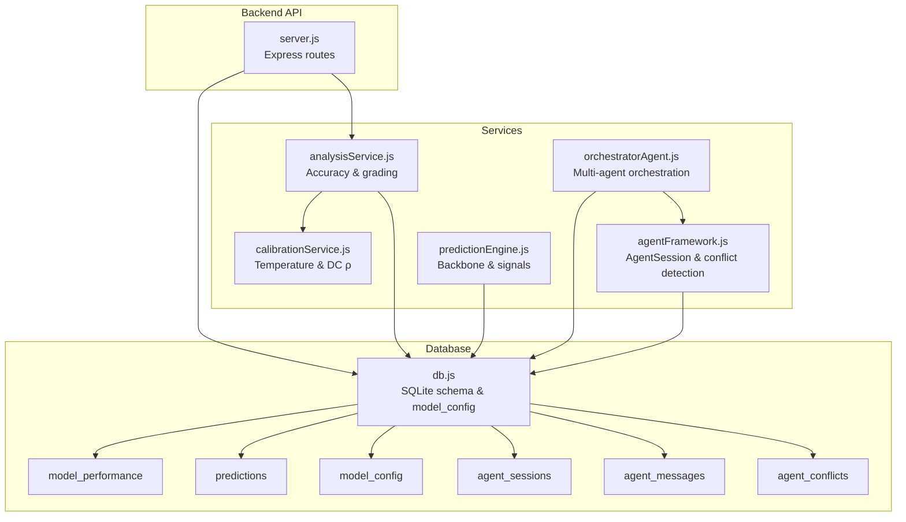
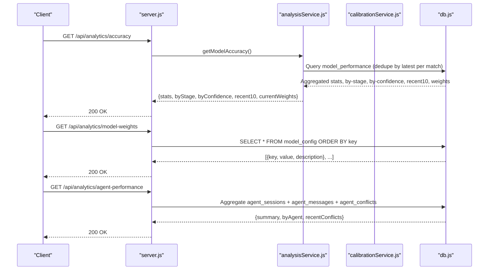
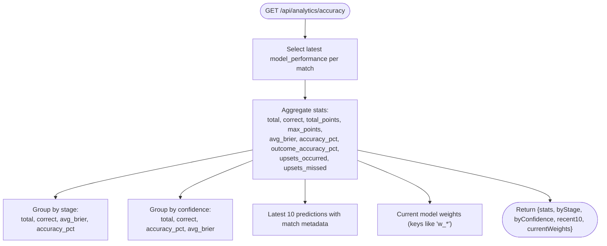
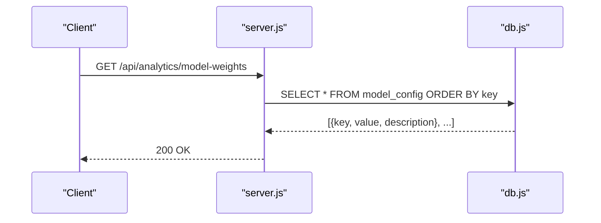
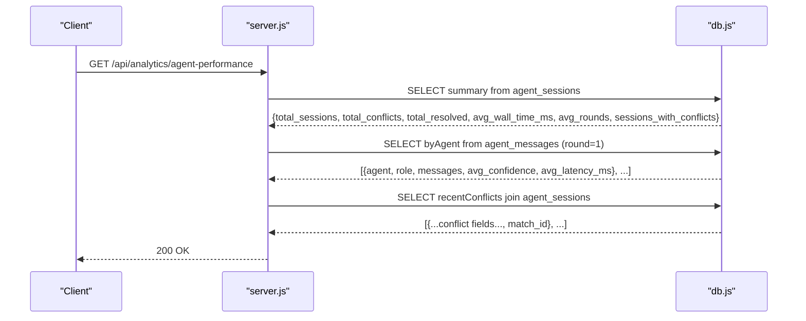
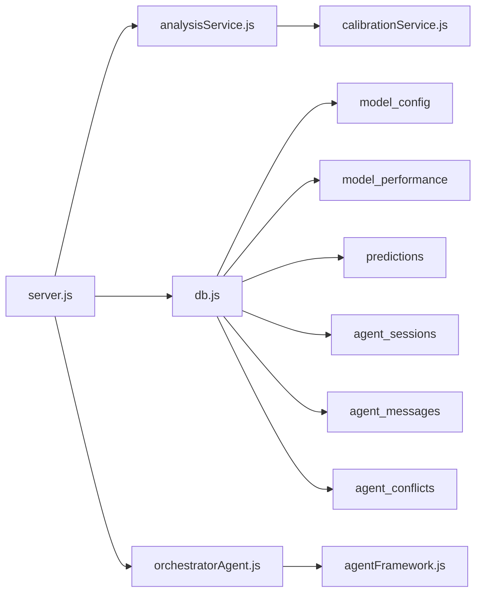

# Analytics API

<cite>
**Referenced Files in This Document**
- [server.js](file://backend/server.js)
- [analysisService.js](file://backend/services/analysisService.js)
- [db.js](file://backend/database/db.js)
- [calibrationService.js](file://backend/services/calibrationService.js)
- [predictionEngine.js](file://backend/services/predictionEngine.js)
- [orchestratorAgent.js](file://backend/services/agents/orchestratorAgent.js)
- [agentFramework.js](file://backend/services/agents/agentFramework.js)
- [SPEC.md](file://specs/SPEC.md)
- [README.md](file://README.md)
</cite>

## Table of Contents
1. [Introduction](#introduction)
2. [Project Structure](#project-structure)
3. [Core Components](#core-components)
4. [Architecture Overview](#architecture-overview)
5. [Detailed Component Analysis](#detailed-component-analysis)
6. [Dependency Analysis](#dependency-analysis)
7. [Performance Considerations](#performance-considerations)
8. [Troubleshooting Guide](#troubleshooting-guide)
9. [Conclusion](#conclusion)

## Introduction
This document provides API documentation for analytics and performance monitoring endpoints. It covers:
- GET /api/analytics/accuracy: model performance metrics including accuracy rates, Brier scores, and historical performance
- GET /api/analytics/model-weights: current model configuration weights and parameters
- GET /api/analytics/agent-performance: multi-agent system performance including conflict resolution statistics, agent effectiveness, and session metrics

It explains accuracy calculation methods, model weight structures, and agent performance indicators, and includes response schemas for performance dashboards, model configuration data, and agent evaluation metrics.

## Project Structure
The analytics endpoints are implemented in the backend server and rely on:
- Database schema with tables for model performance, predictions, model configuration, and multi-agent tracking
- Services that compute accuracy, maintain calibration, and orchestrate multi-agent sessions
- Orchestration logic for agent negotiation and final blending

**Diagram sources**
- [server.js:527-570](file://backend/server.js#L527-L570)
- [analysisService.js:321-384](file://backend/services/analysisService.js#L321-L384)
- [db.js:159-207](file://backend/database/db.js#L159-L207)
- [calibrationService.js:53-129](file://backend/services/calibrationService.js#L53-L129)
- [predictionEngine.js:67-100](file://backend/services/predictionEngine.js#L67-L100)
- [orchestratorAgent.js:329-423](file://backend/services/agents/orchestratorAgent.js#L329-L423)
- [agentFramework.js:31-53](file://backend/services/agents/agentFramework.js#L31-L53)

**Section sources**
- [server.js:527-570](file://backend/server.js#L527-L570)
- [db.js:159-207](file://backend/database/db.js#L159-L207)

## Core Components
- Analytics endpoints:
  - GET /api/analytics/accuracy: aggregates accuracy, Brier score, and recent performance
  - GET /api/analytics/model-weights: retrieves current model configuration weights
  - GET /api/analytics/agent-performance: reports multi-agent session metrics and conflict statistics
- Supporting services:
  - analysisService: computes Brier score, outcome correctness, points scoring, and accuracy summaries
  - calibrationService: refits temperature scaling and Dixon-Coles ρ parameters
  - predictionEngine: defines backbone signals and weights used by the model
  - orchestratorAgent and agentFramework: manage multi-agent sessions, conflicts, and final outputs

**Section sources**
- [server.js:527-570](file://backend/server.js#L527-L570)
- [analysisService.js:63-71](file://backend/services/analysisService.js#L63-L71)
- [calibrationService.js:53-129](file://backend/services/calibrationService.js#L53-L129)
- [predictionEngine.js:93-100](file://backend/services/predictionEngine.js#L93-L100)
- [orchestratorAgent.js:329-423](file://backend/services/agents/orchestratorAgent.js#L329-L423)
- [agentFramework.js:31-53](file://backend/services/agents/agentFramework.js#L31-L53)

## Architecture Overview
The analytics pipeline integrates prediction generation, post-match grading, calibration, and multi-agent orchestration. Accuracy metrics are derived from the model_performance table, while model weights and calibration parameters are stored in model_config. Multi-agent performance is tracked in agent_sessions, agent_messages, and agent_conflicts.

**Diagram sources**
- [server.js:527-570](file://backend/server.js#L527-L570)
- [analysisService.js:321-384](file://backend/services/analysisService.js#L321-L384)
- [db.js:159-207](file://backend/database/db.js#L159-L207)
- [calibrationService.js:53-129](file://backend/services/calibrationService.js#L53-L129)

## Detailed Component Analysis

### Endpoint: GET /api/analytics/accuracy
Purpose:
- Returns model performance metrics aggregated from model_performance
- Includes overall accuracy, Brier score, points-based scoring, and breakdowns by stage and confidence

Processing logic:
- Deduplicates entries by selecting the latest model_performance row per match to avoid double-counting
- Computes:
  - Total predictions, correct outcomes, total points, max possible points
  - Average Brier score
  - Outcome accuracy percentage
  - Upsets occurred and missed
  - By-stage and by-confidence aggregations
  - Recent 10 predictions with match metadata
  - Current model weights used for scoring

Response schema:
- stats: object with total, correct, total_points, max_points, avg_brier, accuracy_pct, outcome_accuracy_pct, upsets_occurred, upsets_missed
- byStage: array of { stage, total, correct, avg_brier, accuracy_pct }
- byConfidence: array of { confidence, total, correct, accuracy_pct, avg_brier }
- recent10: array of model_performance rows joined with match metadata
- currentWeights: array of model_config rows filtered by keys prefixed with "w_"

Accuracy calculation methods:
- Outcome correctness is based on 90-minute full-time result; extra time and penalties do not count
- Brier score computed as sum of squared differences between predicted and actual outcome probabilities
- Points scoring follows a 3/2/1/0 rule aligned with the headline scoreline and top scores

Response examples:
- Example response structure:
  - stats: { total: number, correct: number, total_points: number, max_points: number, avg_brier: number, accuracy_pct: number, outcome_accuracy_pct: number, upsets_occurred: number, upsets_missed: number }
  - byStage: [{ stage: string, total: number, correct: number, avg_brier: number, accuracy_pct: number }, ...]
  - byConfidence: [{ confidence: string, total: number, correct: number, accuracy_pct: number, avg_brier: number }, ...]
  - recent10: [{ match_id: string, stage: string, predicted_outcome: string, actual_outcome: string, was_correct: number, brier_score: number, prob_predicted: number, confidence: string, upset: number, created_at: string }, ...]
  - currentWeights: [{ key: string, value: number, description: string }, ...]

**Diagram sources**
- [analysisService.js:321-384](file://backend/services/analysisService.js#L321-L384)

**Section sources**
- [server.js:527-530](file://backend/server.js#L527-L530)
- [analysisService.js:321-384](file://backend/services/analysisService.js#L321-L384)
- [SPEC.md:160-169](file://specs/SPEC.md#L160-L169)

### Endpoint: GET /api/analytics/model-weights
Purpose:
- Retrieves current model configuration weights and parameters used by the prediction engine

Processing logic:
- Queries model_config ordered by key
- Returns key-value pairs along with descriptions

Response schema:
- Array of objects with:
  - key: string (e.g., "w_elo", "w_poisson", "elo_k_factor")
  - value: number
  - description: string

Response examples:
- Example response:
  - [{ key: "w_elo", value: 0.28, description: "ELO rating differential weight" }, ...]

**Diagram sources**
- [server.js:532-536](file://backend/server.js#L532-L536)
- [db.js:159-165](file://backend/database/db.js#L159-L165)

**Section sources**
- [server.js:532-536](file://backend/server.js#L532-L536)
- [db.js:229-248](file://backend/database/db.js#L229-L248)

### Endpoint: GET /api/analytics/agent-performance
Purpose:
- Reports multi-agent system performance including conflict resolution statistics, agent effectiveness, and session metrics

Processing logic:
- summary: aggregates counts and averages across agent_sessions
  - total_sessions, total_conflicts, total_resolved, avg_wall_time_ms, avg_rounds, sessions_with_conflicts
- byAgent: aggregates agent_messages for round 1
  - agent, role, messages, avg_confidence, avg_latency_ms
- recentConflicts: joins agent_conflicts with agent_sessions to show match_id and conflict details

Response schema:
- summary: object with numeric metrics
- byAgent: array of { agent, role, messages, avg_confidence, avg_latency_ms }
- recentConflicts: array of conflict records with match_id

Agent performance indicators:
- Conflict detection threshold: pairwise probability delta ≥ 0.20 triggers negotiation
- Weight adjustments: winner boosted by 1.3×, loser penalized to 0.6×
- Session metrics: wall time, rounds, conflicts detected/resolved

**Diagram sources**
- [server.js:538-570](file://backend/server.js#L538-L570)
- [agentFramework.js:31-53](file://backend/services/agents/agentFramework.js#L31-L53)

**Section sources**
- [server.js:538-570](file://backend/server.js#L538-L570)
- [agentFramework.js:31-53](file://backend/services/agents/agentFramework.js#L31-L53)
- [README.md:72-88](file://README.md#L72-L88)

## Dependency Analysis
- server.js routes depend on:
  - analysisService for accuracy computation and recent performance
  - db.js for schema access and model_config queries
  - calibrationService for temperature and DC ρ refits (triggered post-match)
  - orchestratorAgent and agentFramework for multi-agent orchestration and conflict handling

**Diagram sources**
- [server.js:527-570](file://backend/server.js#L527-L570)
- [analysisService.js:321-384](file://backend/services/analysisService.js#L321-L384)
- [db.js:159-207](file://backend/database/db.js#L159-L207)
- [calibrationService.js:53-129](file://backend/services/calibrationService.js#L53-L129)
- [orchestratorAgent.js:329-423](file://backend/services/agents/orchestratorAgent.js#L329-L423)
- [agentFramework.js:31-53](file://backend/services/agents/agentFramework.js#L31-L53)

**Section sources**
- [server.js:527-570](file://backend/server.js#L527-L570)
- [analysisService.js:321-384](file://backend/services/analysisService.js#L321-L384)
- [db.js:159-207](file://backend/database/db.js#L159-L207)
- [calibrationService.js:53-129](file://backend/services/calibrationService.js#L53-L129)
- [orchestratorAgent.js:329-423](file://backend/services/agents/orchestratorAgent.js#L329-L423)
- [agentFramework.js:31-53](file://backend/services/agents/agentFramework.js#L31-L53)

## Performance Considerations
- Accuracy endpoint uses a subquery to deduplicate model_performance per match; ensure appropriate indexing on match_id and id for optimal performance
- Agent performance aggregation relies on grouping and joins; consider adding indexes on agent_sessions (id), agent_messages (session_id, round), and agent_conflicts (session_id)
- Calibration refits occur every 10 completed matches; keep track of completed counts to avoid frequent recalculations
- Multi-agent orchestration involves parallel agent runs and negotiation; monitor latency and adjust agent weights to balance accuracy and speed

## Troubleshooting Guide
Common issues and resolutions:
- Empty or partial accuracy metrics:
  - Verify that model_performance contains entries for completed matches
  - Confirm deduplication logic selects the latest row per match
- Missing model weights:
  - Ensure model_config seeding populated default weights
  - Check for successful INSERT OR IGNORE operations
- Agent performance anomalies:
  - Validate conflict detection threshold and weight adjustments
  - Inspect agent_messages and agent_conflicts for session completeness
- Calibration not updating:
  - Confirm completed match count thresholds for refitTemperature and refitDcRho
  - Review NLL minimization results and sample sizes

**Section sources**
- [analysisService.js:321-384](file://backend/services/analysisService.js#L321-L384)
- [db.js:229-248](file://backend/database/db.js#L229-L248)
- [calibrationService.js:53-129](file://backend/services/calibrationService.js#L53-L129)
- [agentFramework.js:31-53](file://backend/services/agents/agentFramework.js#L31-L53)

## Conclusion
The analytics endpoints provide comprehensive insights into model performance, configuration weights, and multi-agent system behavior. They leverage structured database tables and service-layer computations to deliver accurate metrics and actionable performance indicators for continuous model improvement and operational oversight.