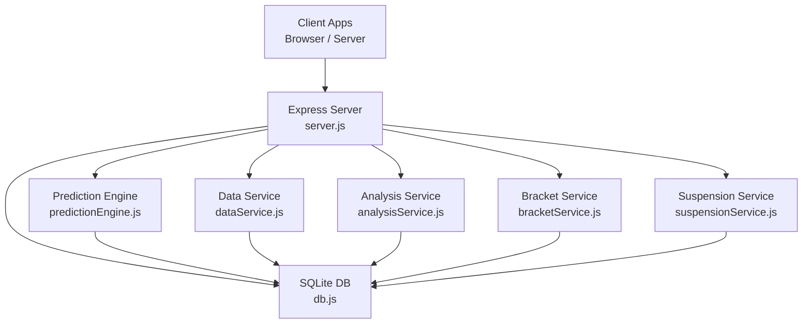
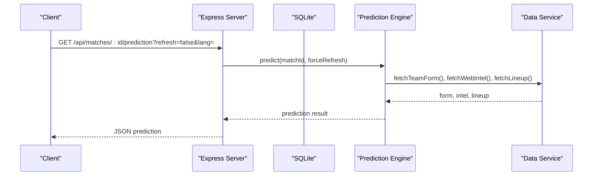
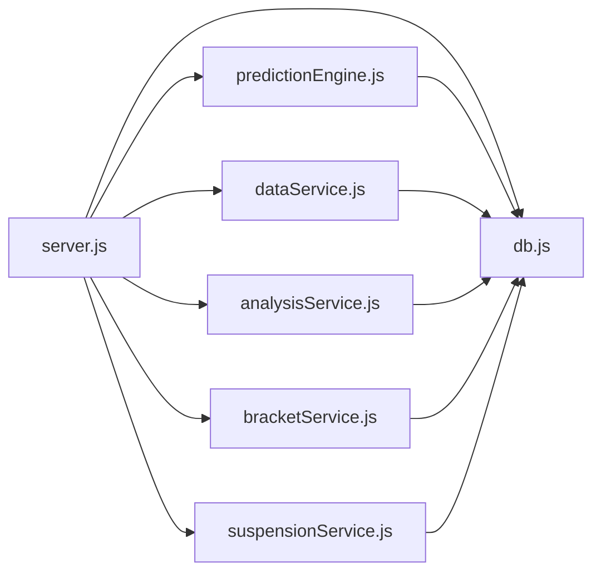

# Backend API Reference

<cite>
**Referenced Files in This Document**
- [server.js](file://backend/server.js)
- [db.js](file://backend/database/db.js)
- [analysisService.js](file://backend/services/analysisService.js)
- [bracketService.js](file://backend/services/bracketService.js)
- [suspensionService.js](file://backend/services/suspensionService.js)
- [dataService.js](file://backend/services/dataService.js)
- [predictionEngine.js](file://backend/services/predictionEngine.js)
- [package.json](file://backend/package.json)
- [SPEC.md](file://specs/SPEC.md)
- [README.md](file://README.md)
</cite>

## Table of Contents
1. [Introduction](#introduction)
2. [Project Structure](#project-structure)
3. [Core Components](#core-components)
4. [Architecture Overview](#architecture-overview)
5. [Detailed Component Analysis](#detailed-component-analysis)
6. [Dependency Analysis](#dependency-analysis)
7. [Performance Considerations](#performance-considerations)
8. [Troubleshooting Guide](#troubleshooting-guide)
9. [Conclusion](#conclusion)
10. [Appendices](#appendices)

## Introduction
This document describes the World Cup 2026 Prediction App backend REST API. It covers all HTTP endpoints requested, including team information and statistics, match schedules and predictions, group stage standings, knockout bracket data, analytics, and player suspension tracking. For each endpoint, you will find method, URL pattern, query parameters, response schemas, authentication, rate limiting, error handling, and practical client implementation guidelines. The API follows a straightforward REST approach with JSON payloads and uses SQLite for persistence.

## Project Structure
The backend is an Express.js server that exposes REST endpoints and orchestrates prediction, analysis, bracket, and suspension services. Data is persisted in a SQLite database initialized by the database module. Cron jobs keep predictions fresh and synchronize live results.

**Diagram sources**
- [server.js:18-724](file://backend/server.js#L18-L724)
- [db.js:1-252](file://backend/database/db.js#L1-L252)
- [predictionEngine.js:1-200](file://backend/services/predictionEngine.js#L1-L200)
- [dataService.js:1-602](file://backend/services/dataService.js#L1-L602)
- [analysisService.js:1-422](file://backend/services/analysisService.js#L1-L422)
- [bracketService.js:1-800](file://backend/services/bracketService.js#L1-L800)
- [suspensionService.js:1-152](file://backend/services/suspensionService.js#L1-L152)

**Section sources**
- [server.js:18-724](file://backend/server.js#L18-L724)
- [db.js:1-252](file://backend/database/db.js#L1-L252)

## Core Components
- Express server with CORS and JSON middleware
- SQLite database with WAL mode and foreign keys enabled
- Services for predictions, analysis, bracket progression, suspensions, and web intelligence
- Cron-based automation for live result sync and prediction regeneration

Key implementation highlights:
- Routes define all documented endpoints and delegate to services
- Services encapsulate business logic and interact with the database
- Predictions leverage a Dixon-Coles Poisson backbone with optional multi-agent Qwen orchestration
- Bracket progression and group standings are recalculated upon match results

**Section sources**
- [server.js:18-724](file://backend/server.js#L18-L724)
- [db.js:1-252](file://backend/database/db.js#L1-L252)
- [SPEC.md:125-177](file://specs/SPEC.md#L125-L177)

## Architecture Overview
The API is organized around resource-focused endpoints. Each endpoint delegates to specialized services that manage data access and computation. Predictions are generated by the prediction engine, which integrates signals from the data service and optionally multi-agent specialists. Results are recorded through the analysis service, which updates standings, ELO, and model performance.

**Diagram sources**
- [server.js:326-341](file://backend/server.js#L326-L341)
- [predictionEngine.js:1-200](file://backend/services/predictionEngine.js#L1-L200)
- [dataService.js:1-602](file://backend/services/dataService.js#L1-L602)

## Detailed Component Analysis

### Authentication, Rate Limiting, and Security
- Authentication: None. All endpoints are read-only for public consumption.
- CORS: Enabled for the configured frontend origin.
- Rate limiting: Not implemented at the API layer. Clients should implement client-side throttling if polling frequently.
- Error handling: Routes return JSON bodies with an error property on failures; HTTP status codes indicate the nature of the error.

**Section sources**
- [server.js:21-30](file://backend/server.js#L21-L30)
- [server.js:283-302](file://backend/server.js#L283-L302)

### Versioning and Backward Compatibility
- API version: No explicit version prefix in URLs; the project version is 1.0.0.
- Backward compatibility: The server initializes schema migrations and seeds default model weights, ensuring robustness across deployments.

**Section sources**
- [package.json:1-32](file://backend/package.json#L1-L32)
- [db.js:209-249](file://backend/database/db.js#L209-L249)

### Pagination, Filtering, and Sorting
- Pagination: Not implemented. Responses return arrays; clients should slice or paginate on the client side.
- Filtering: Query parameters supported on GET /api/matches for stage, status, date, and group.
- Sorting: Responses are sorted by scheduled date/time and match identifiers where applicable.

**Section sources**
- [server.js:110-142](file://backend/server.js#L110-L142)
- [server.js:167-216](file://backend/server.js#L167-L216)

### Endpoint Catalog

#### GET /api/teams
- Method: GET
- URL: /api/teams
- Query parameters: None
- Response: Array of team records ordered by group and performance criteria
- Example response shape: [ { id, name, flag, group_code, fifa_rank, fifa_points, elo, avg_scored, avg_conceded, wc_appearances, last_wc_round, gs_played, gs_won, gs_drawn, gs_lost, gs_gf, gs_ga, gs_pts, eliminated, updated_at }, ... ]

**Section sources**
- [server.js:24-36](file://backend/server.js#L24-L36)

#### GET /api/teams/:id
- Method: GET
- URL: /api/teams/:id
- Path parameters: id (team identifier)
- Query parameters: None
- Response: Object with team, matches, eloHistory, and groupTeammates
- Example response shape:
  - team: { id, name, flag, group_code, ... }
  - matches: Array of match records with home/away team names and predictions
  - eloHistory: Array of ELO changes with opponent metadata
  - groupTeams: Array of teams in the same group, ordered by standings

**Section sources**
- [server.js:38-75](file://backend/server.js#L38-L75)

#### GET /api/groups
- Method: GET
- URL: /api/groups
- Query parameters: None
- Response: Object keyed by group letter (A–L) containing teams and matches
- Example response shape: { A: { teams: [...], matches: [...] }, B: {...}, ... }

**Section sources**
- [server.js:77-86](file://backend/server.js#L77-L86)

#### GET /api/groups/:group
- Method: GET
- URL: /api/groups/:group
- Path parameters: group (single uppercase letter A–L)
- Query parameters: None
- Response: Object with teams and matches for the specified group
- Validation: Returns 400 for invalid group letters

**Section sources**
- [server.js:88-94](file://backend/server.js#L88-L94)

#### GET /api/groups/:group/scenarios
- Method: GET
- URL: /api/groups/:group/scenarios
- Path parameters: group (single uppercase letter A–L)
- Query parameters: None
- Response: Scenario analysis for qualification possibilities
- Validation: Returns 400 for invalid group letters

**Section sources**
- [server.js:96-107](file://backend/server.js#L96-L107)

#### GET /api/matches
- Method: GET
- URL: /api/matches
- Query parameters:
  - stage (string): filter by match stage (GROUP, R32, R16, QF, SF, F, THIRD_PLACE)
  - status (string): filter by match status (SCHEDULED, LIVE, COMPLETED)
  - date (string): filter by scheduled_date (YYYY-MM-DD)
  - group (string): filter by group_code (A–L)
- Response: Array of match records with home/away team names and predictions
- Sorting: By scheduled_date, then match id

**Section sources**
- [server.js:110-142](file://backend/server.js#L110-L142)

#### GET /api/matches/today
- Method: GET
- URL: /api/matches/today
- Query parameters: None
- Response: Array of today’s matches with predictions

**Section sources**
- [server.js:144-165](file://backend/server.js#L144-L165)

#### GET /api/matches/upcoming
- Method: GET
- URL: /api/matches/upcoming
- Query parameters: None
- Response: Object with dates array; each item contains date and matches grouped by scheduled date
- Behavior: Returns next 4 calendar days starting from the first future scheduled date

**Section sources**
- [server.js:167-216](file://backend/server.js#L167-L216)

#### GET /api/matches/upset-watch
- Method: GET
- URL: /api/matches/upset-watch
- Query parameters: None
- Response: Top 10 matches with high upset potential based on ELO and predicted probabilities
- Notes: Limits to 60 matches scanned, sorts by upset probability descending

**Section sources**
- [server.js:219-262](file://backend/server.js#L219-L262)

#### GET /api/matches/:id
- Method: GET
- URL: /api/matches/:id
- Path parameters: id (match identifier)
- Query parameters: None
- Response: Single match record with home/away team metadata
- Error: 404 if match not found

**Section sources**
- [server.js:264-280](file://backend/server.js#L264-L280)

#### POST /api/matches/:id/result
- Method: POST
- URL: /api/matches/:id/result
- Path parameters: id (match identifier)
- Request body:
  - homeScore (number)
  - awayScore (number)
  - homePens (optional number)
  - awayPens (optional number)
- Response: Result object with matchId, result, and optional analysis
- Side effects: Updates match status, standings, ELO, and model performance; invalidates simulation cache; notifies index

**Section sources**
- [server.js:283-302](file://backend/server.js#L283-L302)
- [analysisService.js:76-218](file://backend/services/analysisService.js#L76-L218)

#### GET /api/matches/:id/lineup
- Method: GET
- URL: /api/matches/:id/lineup
- Path parameters: id (match identifier)
- Query parameters: None
- Response: Lineup data or error

**Section sources**
- [server.js:305-312](file://backend/server.js#L305-L312)
- [dataService.js:1-602](file://backend/services/dataService.js#L1-L602)

#### GET /api/h2h/:teamA/:teamB
- Method: GET
- URL: /api/h2h/:teamA/:teamB
- Path parameters: teamA, teamB (team identifiers)
- Query parameters: None
- Response: Historical head-to-head data for the given pair

**Section sources**
- [server.js:315-322](file://backend/server.js#L315-L322)
- [dataService.js:190-265](file://backend/services/dataService.js#L190-L265)

#### GET /api/matches/:id/prediction
- Method: GET
- URL: /api/matches/:id/prediction
- Path parameters: id (match identifier)
- Query parameters:
  - refresh (string): "true" to force regeneration
  - lang (string): "zh" to translate insight to Chinese
- Response: Prediction object with probabilities, confidence, insight, and factors
- Notes: On forced refresh, notifies index if prediction is not served from cache

**Section sources**
- [server.js:326-341](file://backend/server.js#L326-L341)
- [predictionEngine.js:1-200](file://backend/services/predictionEngine.js#L1-L200)

#### GET /api/matches/:id/agent-session
- Method: GET
- URL: /api/matches/:id/agent-session
- Path parameters: id (match identifier)
- Query parameters: None
- Response: Multi-agent session data including session metadata, messages, and conflicts
- Notes: Returns "available: false" if no multi-agent session exists for the match

**Section sources**
- [server.js:344-382](file://backend/server.js#L344-L382)
- [predictionEngine.js:45-53](file://backend/services/predictionEngine.js#L45-L53)

#### GET /api/matches/:id/predictions
- Method: GET
- URL: /api/matches/:id/predictions
- Path parameters: id (match identifier)
- Query parameters: None
- Response: Array of prediction snapshots ordered by generation time

**Section sources**
- [server.js:385-397](file://backend/server.js#L385-L397)
- [predictionEngine.js:1-200](file://backend/services/predictionEngine.js#L1-L200)

#### POST /api/predictions/generate-all
- Method: POST
- URL: /api/predictions/generate-all
- Path parameters: None
- Query parameters: None
- Response: Object indicating number of generated predictions, active stage, and per-match results
- Notes: Generates predictions for the earliest active stage only, with a cooldown to avoid frequent regeneration

**Section sources**
- [server.js:400-461](file://backend/server.js#L400-L461)
- [predictionEngine.js:1-200](file://backend/services/predictionEngine.js#L1-L200)

#### GET /api/tournament/bracket
- Method: GET
- URL: /api/tournament/bracket
- Query parameters: None
- Response: Array of knockout-stage matches with predictions

**Section sources**
- [server.js:464-482](file://backend/server.js#L464-L482)
- [bracketService.js:1-800](file://backend/services/bracketService.js#L1-L800)

#### GET /api/tournament/winner-probabilities
- Method: GET
- URL: /api/tournament/winner-probabilities
- Query parameters: None
- Response: Object with simulation count and winner probability distribution

**Section sources**
- [server.js:485-489](file://backend/server.js#L485-L489)
- [bracketService.js:707-704](file://backend/services/bracketService.js#L707-L704)

#### GET /api/tournament/road-to-final
- Method: GET
- URL: /api/tournament/road-to-final
- Query parameters: None
- Response: Road-to-Final snapshots across rounds

**Section sources**
- [server.js:492-499](file://backend/server.js#L492-L499)
- [bracketService.js:1-800](file://backend/services/bracketService.js#L1-L800)

#### POST /api/tournament/simulate-knockout
- Method: POST
- URL: /api/tournament/simulate-knockout
- Query parameters: None
- Response: Simulation results including group placements, bracket outcomes, and champion
- Notes: Invalidates simulation cache after completion

**Section sources**
- [server.js:502-512](file://backend/server.js#L502-L512)
- [bracketService.js:485-704](file://backend/services/bracketService.js#L485-L704)

#### GET /api/analytics/accuracy
- Method: GET
- URL: /api/analytics/accuracy
- Query parameters: None
- Response: Accuracy metrics including overall stats, stage-wise accuracy, confidence bins, recent results, and current model weights

**Section sources**
- [server.js:528-530](file://backend/server.js#L528-L530)
- [analysisService.js:321-384](file://backend/services/analysisService.js#L321-L384)

#### GET /api/analytics/model-weights
- Method: GET
- URL: /api/analytics/model-weights
- Query parameters: None
- Response: Array of model configuration entries (keys, values, descriptions)

**Section sources**
- [server.js:532-536](file://backend/server.js#L532-L536)
- [db.js:229-248](file://backend/database/db.js#L229-L248)

#### GET /api/analytics/agent-performance
- Method: GET
- URL: /api/analytics/agent-performance
- Query parameters: None
- Response: Summary statistics, per-agent metrics, and recent conflicts

**Section sources**
- [server.js:539-570](file://backend/server.js#L539-L570)
- [predictionEngine.js:45-53](file://backend/services/predictionEngine.js#L45-L53)

#### GET /api/suspensions
- Method: GET
- URL: /api/suspensions
- Query parameters: None
- Response: Array of all suspensions across the tournament

**Section sources**
- [server.js:515-517](file://backend/server.js#L515-L517)
- [suspensionService.js:129-143](file://backend/services/suspensionService.js#L129-L143)

#### GET /api/matches/:id/suspensions
- Method: GET
- URL: /api/matches/:id/suspensions
- Path parameters: id (match identifier)
- Query parameters: None
- Response: Suspensions for the specified match, including suspended players and yellow-card watch list

**Section sources**
- [server.js:519-521](file://backend/server.js#L519-L521)
- [suspensionService.js:44-83](file://backend/services/suspensionService.js#L44-L83)

#### GET /api/teams/:id/suspensions
- Method: GET
- URL: /api/teams/:id/suspensions
- Path parameters: id (team identifier)
- Query parameters: None
- Response: Array of suspensions for the specified team

**Section sources**
- [server.js:523-525](file://backend/server.js#L523-L525)
- [suspensionService.js:108-120](file://backend/services/suspensionService.js#L108-L120)

### Data Models and Schemas

#### Matches
- Fields: id, stage, group_code, match_number, home_team, away_team, scheduled_date, scheduled_time, venue, status, home_score, away_score, home_score_pens, away_score_pens, winner, created_at, completed_at

**Section sources**
- [db.js:51-70](file://backend/database/db.js#L51-L70)

#### Teams
- Fields: id, name, flag, group_code, confederation, fifa_rank, fifa_points, elo, avg_scored, avg_conceded, wc_appearances, last_wc_round, gs_played, gs_won, gs_drawn, gs_lost, gs_gf, gs_ga, gs_pts, eliminated, updated_at

**Section sources**
- [db.js:25-49](file://backend/database/db.js#L25-L49)

#### Predictions
- Fields: id, match_id, generated_at, prob_home, prob_draw, prob_away, expected_score_home, expected_score_away, most_likely_score, top_scores, confidence, factors, web_intel, insight, methodology, actual_outcome, was_correct, brier_score, upset

**Section sources**
- [db.js:72-94](file://backend/database/db.js#L72-L94)

#### Model Performance
- Fields: id, match_id, stage, predicted_outcome, actual_outcome, was_correct, brier_score, prob_predicted, confidence, upset, analysis_notes, created_at

**Section sources**
- [db.js:96-110](file://backend/database/db.js#L96-L110)

#### Bracket Slots
- Fields: match_id, slot_home, slot_away, filled_at

**Section sources**
- [db.js:112-118](file://backend/database/db.js#L112-L118)

#### ELO History
- Fields: id, team_id, match_id, elo_before, elo_after, opponent_id, result, stage, recorded_at

**Section sources**
- [db.js:120-131](file://backend/database/db.js#L120-L131)

#### Suspensions
- Fields: id, team_id, player_name, reason, yellow_cards, suspended_for_match_id, source, notes, created_at, updated_at

**Section sources**
- [db.js:133-145](file://backend/database/db.js#L133-L145)

#### Web Intelligence Cache
- Fields: id, team_id, match_id, intel_type, content, source_url, fetched_at, expires_at

**Section sources**
- [db.js:147-157](file://backend/database/db.js#L147-L157)

#### Model Config
- Fields: key, value, description, updated_at

**Section sources**
- [db.js:159-165](file://backend/database/db.js#L159-L165)

#### Agent Sessions and Messages
- Fields: agent_sessions (id, match_id, agents_used, rounds, conflicts_detected, conflicts_resolved, synthesis_method, wall_time_ms, created_at)
- Fields: agent_messages (id, session_id, round, agent, role, probability, confidence, evidence, raw_response, latency_ms, created_at)
- Fields: agent_conflicts (id, session_id, agent_a, agent_b, delta, round_detected, resolution, winner, resolution_reasoning, created_at)

**Section sources**
- [db.js:167-207](file://backend/database/db.js#L167-L207)

## Dependency Analysis
The server composes multiple services to fulfill requests. The following diagram shows key dependencies among modules.

**Diagram sources**
- [server.js:1-724](file://backend/server.js#L1-L724)
- [db.js:1-252](file://backend/database/db.js#L1-L252)
- [predictionEngine.js:1-200](file://backend/services/predictionEngine.js#L1-L200)
- [dataService.js:1-602](file://backend/services/dataService.js#L1-L602)
- [analysisService.js:1-422](file://backend/services/analysisService.js#L1-L422)
- [bracketService.js:1-800](file://backend/services/bracketService.js#L1-L800)
- [suspensionService.js:1-152](file://backend/services/suspensionService.js#L1-L152)

**Section sources**
- [server.js:1-724](file://backend/server.js#L1-L724)

## Performance Considerations
- Prediction generation:
  - Multi-agent mode increases latency; use refresh=false to leverage cached predictions.
  - Predictions are locked once a match goes live to avoid churn.
- Live sync:
  - Cron job runs every 5 minutes to synchronize live results.
  - Hourly prediction regeneration targets the next three match days.
- Caching:
  - Web intelligence (form, H2H, intel) is cached with TTLs to reduce external API calls.
  - Bracket simulations are cached and invalidated on result updates.
- Database:
  - SQLite with WAL mode and foreign keys enabled; migrations ensure schema stability.

[No sources needed since this section provides general guidance]

## Troubleshooting Guide
Common issues and resolutions:
- 400 Bad Request: Occurs when invalid group letters are provided or when required numeric fields are missing in result submission.
- 404 Not Found: Returned when a team or match does not exist.
- 500 Internal Server Error: Indicates service-level failures; inspect server logs for stack traces.
- Prediction freshness: Use refresh=true to force regeneration; note that predictions are locked once a match goes live.

**Section sources**
- [server.js:88-94](file://backend/server.js#L88-L94)
- [server.js:283-302](file://backend/server.js#L283-L302)
- [server.js:315-322](file://backend/server.js#L315-L322)

## Conclusion
The backend provides a comprehensive, read-only REST API for the World Cup 2026 Prediction App. It supports team and match data, group standings, knockout bracket views, analytics, and suspensions. Predictions are generated using a robust Dixon-Coles backbone with optional multi-agent Qwen orchestration. The API is designed for simplicity and reliability, with predictable responses and minimal operational overhead.

[No sources needed since this section summarizes without analyzing specific files]

## Appendices

### Client Implementation Guidelines
- Browser:
  - Use fetch or XMLHttpRequest to call endpoints.
  - Implement retries with exponential backoff for transient failures.
  - Cache responses locally to reduce load and improve perceived performance.
- Server-side:
  - Use HTTP client libraries with connection pooling.
  - Implement circuit breaker patterns for optional integrations (e.g., live results).
  - Respect cache-control headers and TTLs where applicable.

[No sources needed since this section provides general guidance]

### Example Requests and Responses
- GET /api/teams
  - Request: curl https://localhost:6173/api/teams
  - Response: Array of team objects
- GET /api/matches?stage=GROUP&status=SCHEDULED
  - Request: curl "https://localhost:6173/api/matches?stage=GROUP&status=SCHEDULED"
  - Response: Array of match objects with predictions
- POST /api/matches/MATCH_ID/result
  - Request: curl -X POST https://localhost:6173/api/matches/MATCH_ID/result -H "Content-Type: application/json" -d '{"homeScore":2,"awayScore":1}'
  - Response: Result object with matchId, result, and optional analysis

**Section sources**
- [server.js:24-36](file://backend/server.js#L24-L36)
- [server.js:110-142](file://backend/server.js#L110-L142)
- [server.js:283-302](file://backend/server.js#L283-L302)