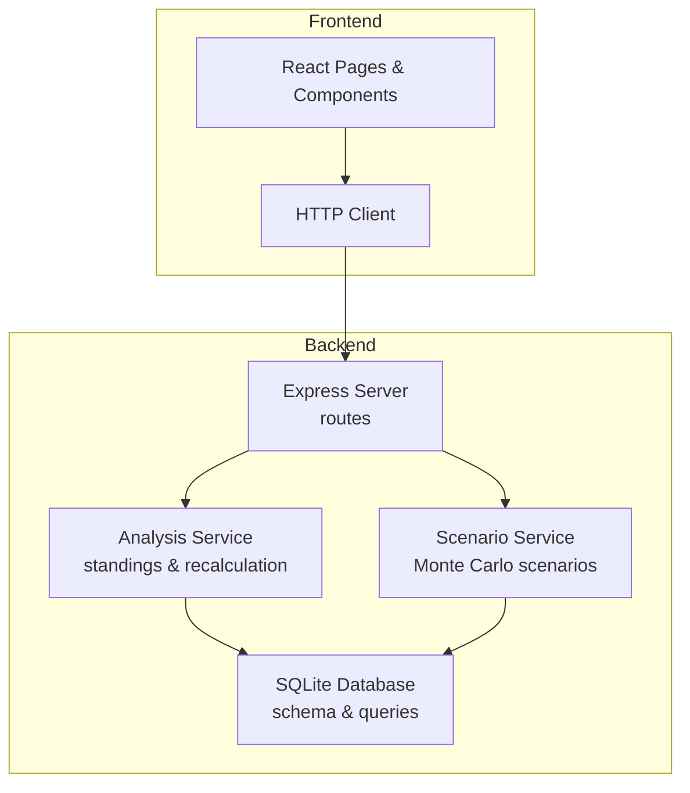
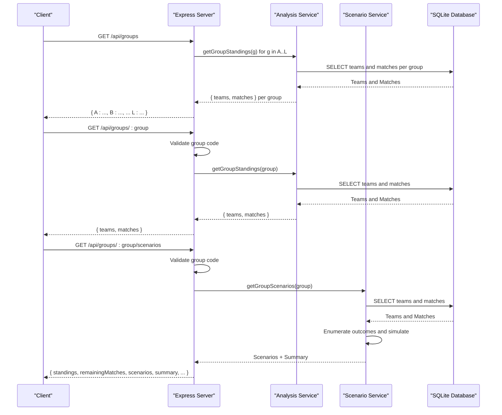
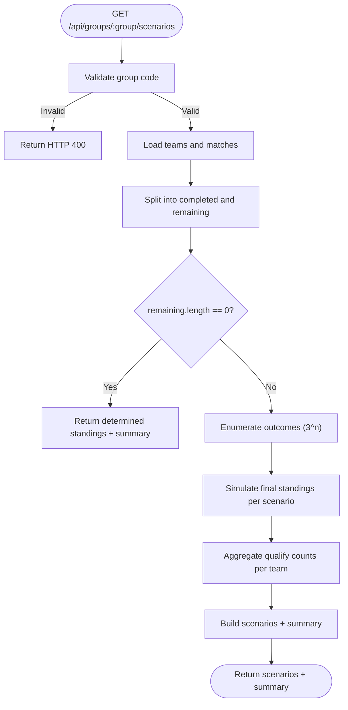
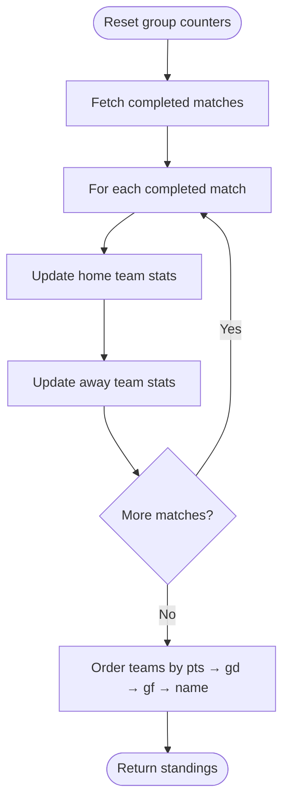
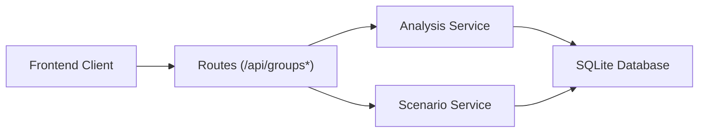

# Group Stage API

<cite>
**Referenced Files in This Document**
- [server.js](file://backend/server.js)
- [analysisService.js](file://backend/services/analysisService.js)
- [scenarioService.js](file://backend/services/scenarioService.js)
- [db.js](file://backend/database/db.js)
- [teams.js](file://backend/data/teams.js)
- [client.js](file://frontend/src/api/client.js)
- [Groups.jsx](file://frontend/src/pages/Groups.jsx)
- [GroupTable.jsx](file://frontend/src/components/GroupTable.jsx)
</cite>

## Table of Contents
1. [Introduction](#introduction)
2. [Project Structure](#project-structure)
3. [Core Components](#core-components)
4. [Architecture Overview](#architecture-overview)
5. [Detailed Component Analysis](#detailed-component-analysis)
6. [Dependency Analysis](#dependency-analysis)
7. [Performance Considerations](#performance-considerations)
8. [Troubleshooting Guide](#troubleshooting-guide)
9. [Conclusion](#conclusion)

## Introduction
This document provides comprehensive API documentation for the group stage endpoints that power live World Cup 2026 group standings and qualification scenario analysis. It covers:
- Retrieving all group standings across all 12 groups (A–L)
- Retrieving individual group standings with robust validation
- Computing qualification scenarios via Monte Carlo simulations and probability calculations
- Explaining how standings are calculated (points, goal difference, goals scored, and FIFA rankings)
- Providing response schemas for group tables and scenario results
- Demonstrating practical examples of group stage data structures and qualification pathway computations

## Project Structure
The group stage functionality spans the backend HTTP server, services, and database schema, with the frontend consuming these endpoints to render group tables and match schedules.

**Diagram sources**
- [server.js:77-107](file://backend/server.js#L77-L107)
- [analysisService.js:388-411](file://backend/services/analysisService.js#L388-L411)
- [scenarioService.js:71-177](file://backend/services/scenarioService.js#L71-L177)
- [db.js:23-208](file://backend/database/db.js#L23-L208)
- [client.js:33-35](file://frontend/src/api/client.js#L33-L35)

**Section sources**
- [server.js:77-107](file://backend/server.js#L77-L107)
- [db.js:23-208](file://backend/database/db.js#L23-L208)

## Core Components
- Group Standings Endpoint
  - GET /api/groups: Returns group standings for all 12 groups (A–L)
  - GET /api/groups/:group: Returns standings for a specific group with validation
- Scenario Endpoint
  - GET /api/groups/:group/scenarios: Computes qualification scenarios via Monte Carlo simulations
- Standings Calculation Engine
  - Recalculates group standings from completed matches and orders teams by points, goal difference, goals scored, and FIFA rank
- Scenario Engine
  - Enumerates possible outcomes for remaining matches and computes qualification probabilities

**Section sources**
- [server.js:77-107](file://backend/server.js#L77-L107)
- [analysisService.js:388-411](file://backend/services/analysisService.js#L388-L411)
- [scenarioService.js:71-177](file://backend/services/scenarioService.js#L71-L177)

## Architecture Overview
The group stage endpoints are implemented as Express routes that delegate to services. The Analysis Service handles group standings retrieval and recalculation, while the Scenario Service performs Monte Carlo simulations for qualification pathways.

**Diagram sources**
- [server.js:77-107](file://backend/server.js#L77-L107)
- [analysisService.js:388-411](file://backend/services/analysisService.js#L388-L411)
- [scenarioService.js:71-177](file://backend/services/scenarioService.js#L71-L177)
- [db.js:23-208](file://backend/database/db.js#L23-L208)

## Detailed Component Analysis

### Group Standings Endpoints
- GET /api/groups
  - Iterates over groups A–L and retrieves standings for each
  - Returns a JSON object keyed by group letter
- GET /api/groups/:group
  - Validates that the group parameter is a single uppercase letter from A–L
  - Returns the standings for the specified group

Response Schema (per group):
- teams: Array of team objects ordered by points, goal difference, goals for, and FIFA rank
  - Fields include identifiers, group code, stats (played, won, drawn, lost, gf, ga, pts), and ranking metrics
- matches: Array of match objects for the group, ordered by scheduled date

Validation:
- Non-alphabetic or multi-character group codes return HTTP 400 with an error message

**Section sources**
- [server.js:77-94](file://backend/server.js#L77-L94)
- [analysisService.js:388-411](file://backend/services/analysisService.js#L388-L411)

### Scenario Endpoint: GET /api/groups/:group/scenarios
Purpose:
- Compute qualification scenarios for a group with remaining matches using Monte Carlo enumeration
- Return current standings, completed and remaining matches, scenario outcomes, and a qualification summary

Behavior:
- For groups with zero remaining matches, returns already-determined standings and a summary indicating who advances or is a third-place contender
- For groups with up to three remaining matches, enumerates all 3^n possible outcomes and computes final standings for each
- For groups with more than three remaining matches, the service limits computation for performance reasons

Response Schema:
- groupCode: The requested group letter
- complete: Boolean indicating whether the group is finished
- standings: Current team standings
- completedMatches: Completed matches in the group
- remainingMatches: Remaining matches in the group
- totalScenarios: Total number of simulated scenarios (3^n for n remaining matches)
- scenarios: Array of scenario records, each containing:
  - results: Array of match result entries with match identifiers, team names, and result outcomes
  - outcome: Object describing the final standings for that scenario (first, second, third)
- summary: Per-team summary statistics:
  - id, name, flag
  - currentPts, currentGD
  - qualifyCount: Number of scenarios where the team finishes first or second
  - totalScenarios
  - qualifyPct: Rounded percentage of scenarios where the team qualifies
  - alwaysQualifies: True if qualifyCount equals totalScenarios
  - neverQualifies: True if qualifyCount equals zero
  - eliminated: Alias for neverQualifies

**Diagram sources**
- [server.js:96-107](file://backend/server.js#L96-L107)
- [scenarioService.js:71-177](file://backend/services/scenarioService.js#L71-L177)

**Section sources**
- [scenarioService.js:17-61](file://backend/services/scenarioService.js#L17-L61)
- [scenarioService.js:71-177](file://backend/services/scenarioService.js#L71-L177)

### Standings Calculation Logic
Standings are computed from completed matches and ordered by:
1. Points (gs_pts)
2. Goal difference (gs_gf - gs_ga)
3. Goals for (gs_gf)
4. Team name (alphabetical tiebreaker)

The recalculation process resets per-group counters and iterates through completed matches to update played, won/drawn/lost, goals for/against, and points.

**Diagram sources**
- [analysisService.js:238-293](file://backend/services/analysisService.js#L238-L293)
- [analysisService.js:388-411](file://backend/services/analysisService.js#L388-L411)

**Section sources**
- [analysisService.js:238-293](file://backend/services/analysisService.js#L238-L293)
- [analysisService.js:388-411](file://backend/services/analysisService.js#L388-L411)

### Data Models and Example Structures
Representative structures used across endpoints:

- Team object (selected fields):
  - id, name, flag, group_code
  - gs_played, gs_won, gs_drawn, gs_lost, gs_gf, gs_ga, gs_pts
  - fifa_rank, fifa_points
- Match object (selected fields):
  - id, stage, group_code, home_team, away_team, scheduled_date, scheduled_time, venue
  - status, home_score, away_score, home_score_pens, away_score_pens, winner
- Scenario outcome (selected fields):
  - first: { id, name, pts, gd }
  - second: { id, name, pts, gd }
  - third: { id, name, pts, gd } (may be null if not applicable)

These structures align with the database schema and are returned by the endpoints documented above.

**Section sources**
- [db.js:26-49](file://backend/database/db.js#L26-L49)
- [db.js:52-70](file://backend/database/db.js#L52-L70)
- [scenarioService.js:144-148](file://backend/services/scenarioService.js#L144-L148)

### Frontend Integration Examples
- The frontend fetches group data via the HTTP client:
  - getGroups(): GET /api/groups
  - getGroup(g): GET /api/groups/:group
  - getGroupScenarios(g): GET /api/groups/:group/scenarios
- The Groups page renders:
  - A selectable group tab interface
  - A group table showing positions, points, wins, draws, losses, goals for/against, goal difference, and qualification indicators
  - A list of group matches with predictions

**Section sources**
- [client.js:33-35](file://frontend/src/api/client.js#L33-L35)
- [Groups.jsx:18-23](file://frontend/src/pages/Groups.jsx#L18-L23)
- [GroupTable.jsx:18-70](file://frontend/src/components/GroupTable.jsx#L18-L70)

## Dependency Analysis
The group stage endpoints depend on:
- Express routes for HTTP handling and validation
- Analysis Service for retrieving and recalculating standings
- Scenario Service for Monte Carlo simulations and scenario summaries
- SQLite database for persisted team and match data

**Diagram sources**
- [server.js:77-107](file://backend/server.js#L77-L107)
- [analysisService.js:388-411](file://backend/services/analysisService.js#L388-L411)
- [scenarioService.js:71-177](file://backend/services/scenarioService.js#L71-L177)
- [db.js:23-208](file://backend/database/db.js#L23-L208)
- [client.js:33-35](file://frontend/src/api/client.js#L33-L35)

**Section sources**
- [server.js:77-107](file://backend/server.js#L77-L107)
- [analysisService.js:388-411](file://backend/services/analysisService.js#L388-L411)
- [scenarioService.js:71-177](file://backend/services/scenarioService.js#L71-L177)
- [db.js:23-208](file://backend/database/db.js#L23-L208)

## Performance Considerations
- Scenario computation is bounded by the number of remaining matches (≤3) to keep 3^n scenarios manageable
- Standings recalculation scans completed matches and updates counters in a single pass per group
- Database queries use indexed fields (group_code, status) to minimize overhead

[No sources needed since this section provides general guidance]

## Troubleshooting Guide
Common issues and resolutions:
- Invalid group parameter
  - Symptom: HTTP 400 error with an error message
  - Cause: Non-alphabetic or multi-character group code
  - Resolution: Ensure the group parameter is a single uppercase letter from A–L
- Empty or unexpected response
  - Symptom: Missing teams or matches
  - Cause: No completed matches yet or database initialization issues
  - Resolution: Verify that matches have progressed and the database schema is initialized
- Scenario computation errors
  - Symptom: HTTP 500 error
  - Cause: Unexpected state in remaining matches or team data
  - Resolution: Confirm that teams belong to the requested group and that match statuses are consistent

**Section sources**
- [server.js:88-107](file://backend/server.js#L88-L107)
- [scenarioService.js:94-111](file://backend/services/scenarioService.js#L94-L111)

## Conclusion
The group stage API provides fast, accurate group standings and rich qualification scenario insights powered by Monte Carlo simulations. The endpoints are validated, efficient, and aligned with the underlying database schema. The frontend integrates seamlessly to deliver an interactive experience for fans to track group progress and understand qualification probabilities.