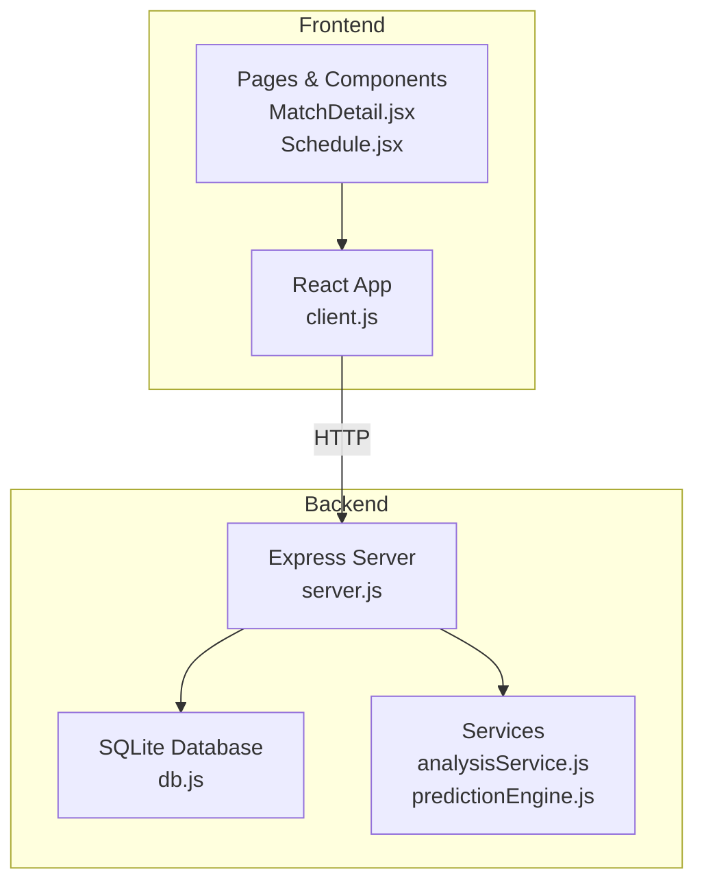
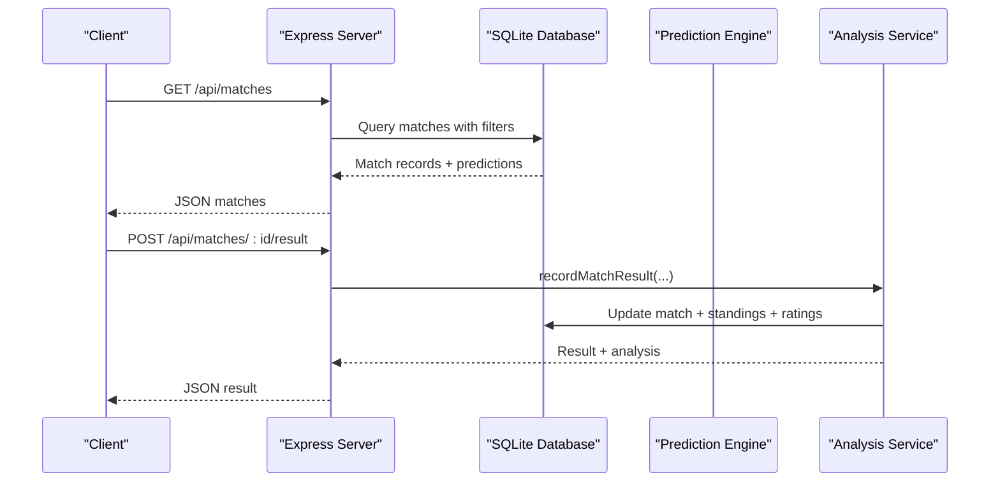
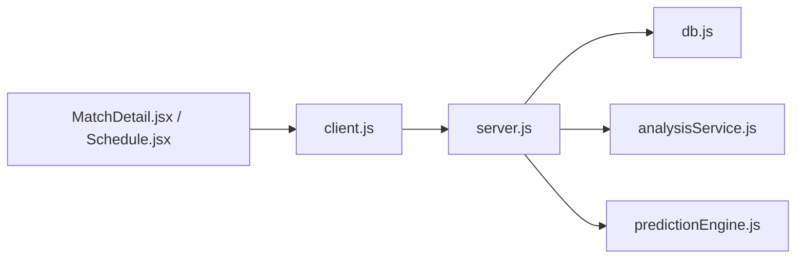

# Match Management API

<cite>
**Referenced Files in This Document**
- [server.js](file://backend/server.js)
- [db.js](file://backend/database/db.js)
- [SPEC.md](file://specs/SPEC.md)
- [client.js](file://frontend/src/api/client.js)
- [MatchDetail.jsx](file://frontend/src/pages/MatchDetail.jsx)
- [Schedule.jsx](file://frontend/src/pages/Schedule.jsx)
</cite>

## Table of Contents
1. [Introduction](#introduction)
2. [Project Structure](#project-structure)
3. [Core Components](#core-components)
4. [Architecture Overview](#architecture-overview)
5. [Detailed Component Analysis](#detailed-component-analysis)
6. [Dependency Analysis](#dependency-analysis)
7. [Performance Considerations](#performance-considerations)
8. [Troubleshooting Guide](#troubleshooting-guide)
9. [Conclusion](#conclusion)

## Introduction
This document provides comprehensive API documentation for match-related endpoints in the World Cup 2026 Prediction App. It covers match listing, filtering, real-time data, result submission, and prediction APIs. It also explains match status and stage enumerations, upset watch algorithm criteria, and response schemas with prediction data.

## Project Structure
The match management API is implemented in the backend Express server and backed by a SQLite database. Frontend clients consume these endpoints to render match schedules, predictions, and match details.

**Diagram sources**
- [server.js:1-724](file://backend/server.js#L1-L724)
- [db.js:1-252](file://backend/database/db.js#L1-L252)
- [client.js:1-50](file://frontend/src/api/client.js#L1-L50)

**Section sources**
- [server.js:1-724](file://backend/server.js#L1-L724)
- [db.js:1-252](file://backend/database/db.js#L1-L252)
- [SPEC.md:1-205](file://specs/SPEC.md#L1-L205)

## Core Components
- Match listing and filtering: GET /api/matches with query parameters for stage, status, date, and group.
- Today's matches: GET /api/matches/today.
- Upcoming fixtures: GET /api/matches/upcoming.
- Upset watch: GET /api/matches/upset-watch.
- Individual match details: GET /api/matches/:id.
- Submit match results: POST /api/matches/:id/result.
- Prediction APIs: GET /api/matches/:id/prediction and GET /api/matches/:id/predictions.

Key enumerations:
- Match status: SCHEDULED, LIVE, COMPLETED.
- Stage types: GROUP, R32, R16, QF, SF, F, THIRD_PLACE.

Response schemas include match metadata, team identities, predictions, confidence, and top scorelines.

**Section sources**
- [server.js:110-302](file://backend/server.js#L110-L302)
- [db.js:52-70](file://backend/database/db.js#L52-L70)
- [SPEC.md:11-22](file://specs/SPEC.md#L11-L22)

## Architecture Overview
The match management endpoints are implemented in the Express server and query the SQLite database. Predictions are generated by the prediction engine and cached in the database. Result submission triggers analysis and bracket advancement logic.

**Diagram sources**
- [server.js:110-302](file://backend/server.js#L110-L302)
- [analysisService.js:76-218](file://backend/services/analysisService.js#L76-L218)

## Detailed Component Analysis

### GET /api/matches
- Purpose: List matches with optional filtering.
- Query parameters:
  - stage: Filter by stage (GROUP, R32, R16, QF, SF, F, THIRD_PLACE).
  - status: Filter by match status (SCHEDULED, LIVE, COMPLETED).
  - date: Filter by scheduled date.
  - group: Filter by group code (A–L).
- Sorting: Matches are ordered by scheduled_date and id.
- Response: Array of match objects with team names, flags, ELO ratings, and latest prediction data (probabilities, most likely score, confidence, insight, and model performance points).

Example request:
- GET /api/matches?stage=R32&status=SCHEDULED&date=2026-06-15&group=A

Response schema highlights:
- Match metadata: id, stage, group_code, match_number, scheduled_date, scheduled_time, venue, status, home_score, away_score, home_score_pens, away_score_pens, winner.
- Team metadata: home_name, home_flag, home_elo, away_name, away_flag, away_elo.
- Prediction fields: prob_home, prob_draw, prob_away, most_likely_score, confidence, top_scores, insight, graded_points.

**Section sources**
- [server.js:110-142](file://backend/server.js#L110-L142)
- [db.js:52-94](file://backend/database/db.js#L52-L94)

### GET /api/matches/today
- Purpose: Retrieve matches scheduled for the current date.
- Behavior: Uses today’s date to filter matches and returns them with predictions.
- Response: Array of match objects with prediction data (probabilities, most likely score, confidence, insight).

**Section sources**
- [server.js:144-165](file://backend/server.js#L144-L165)

### GET /api/matches/upcoming
- Purpose: Retrieve upcoming fixtures for the next few days.
- Behavior: Finds the first day with scheduled matches, then returns matches for that day plus the next 3 calendar days (excluding completed matches). Results are grouped by date.
- Response: Object with dates array containing date keys and matches arrays.

**Section sources**
- [server.js:167-216](file://backend/server.js#L167-L216)

### GET /api/matches/upset-watch
- Purpose: Surface matches where the favorite has less than 45% win probability and ELO difference is at least 50 points.
- Algorithm criteria:
  - Status must be SCHEDULED.
  - Prediction must exist (prob_home/prob_away available).
  - Favorite’s win probability must be below 0.45.
  - ELO difference must be at least 50 points.
- Response: Array of match objects enriched with favorite/underdog details and upsetProbability.

**Section sources**
- [server.js:219-262](file://backend/server.js#L219-L262)

### GET /api/matches/:id
- Purpose: Retrieve detailed information for a specific match.
- Response: Match object with team metadata (names, flags, ELO, average goals, WC appearances) and basic match details.

**Section sources**
- [server.js:264-280](file://backend/server.js#L264-L280)

### POST /api/matches/:id/result
- Purpose: Record match results and optional penalty shootout scores.
- Request body:
  - homeScore: integer.
  - awayScore: integer.
  - homePens: optional integer (penalty shootout score).
  - awayPens: optional integer (penalty shootout score).
- Validation:
  - homeScore and awayScore must be numbers.
  - homePens and awayPens must be numbers if provided.
- Behavior:
  - Updates match status to COMPLETED.
  - Calculates outcome and winner (including penalty shootout for knockout matches).
  - Updates group standings (if applicable), advances knockout winners, updates ELO and ratings, and grades the prediction.
  - Triggers simulation cache invalidation and index notifications.
- Response: Object containing matchId, result (scores/outcome/winner), and analysis (predictedOutcome, actualOutcome, wasCorrect, brierScore, isUpset, notes, eloChange).

**Section sources**
- [server.js:282-302](file://backend/server.js#L282-L302)
- [analysisService.js:76-218](file://backend/services/analysisService.js#L76-L218)

### GET /api/matches/:id/prediction
- Purpose: Retrieve the latest prediction for a match, optionally forcing a refresh.
- Query parameters:
  - refresh: boolean to force regeneration.
  - lang: 'zh' to receive localized insight.
- Response: Prediction object with probabilities, confidence, insight, methodology, factors, top_scores, and metadata.

**Section sources**
- [server.js:326-341](file://backend/server.js#L326-L341)
- [SPEC.md:125-177](file://specs/SPEC.md#L125-L177)

### GET /api/matches/:id/predictions
- Purpose: Retrieve prediction history for a match.
- Response: Array of prediction snapshots with generated_at timestamps and fields like prob_home, prob_draw, prob_away, most_likely_score, confidence, methodology, insight, actual_outcome, was_correct, brier_score.

**Section sources**
- [server.js:385-397](file://backend/server.js#L385-L397)

### Data Model and Enumerations
- Match status: SCHEDULED, LIVE, COMPLETED.
- Stage types: GROUP, R32, R16, QF, SF, F, THIRD_PLACE.
- Prediction confidence tiers: LOW, MEDIUM, HIGH, VERY_HIGH.

**Section sources**
- [db.js:52-70](file://backend/database/db.js#L52-L70)
- [SPEC.md:125-177](file://specs/SPEC.md#L125-L177)

### Example Match Data Structures with Predictions
- Base match fields: id, stage, group_code, match_number, scheduled_date, scheduled_time, venue, status, home_score, away_score, home_score_pens, away_score_pens, winner.
- Team fields: home_name, home_flag, home_elo, away_name, away_flag, away_elo.
- Prediction fields: prob_home, prob_draw, prob_away, most_likely_score, confidence, top_scores (array of top scorelines with probabilities), insight, methodology, factors, web_intel, actual_outcome, was_correct, brier_score.

**Section sources**
- [server.js:110-142](file://backend/server.js#L110-L142)
- [SPEC.md:125-177](file://specs/SPEC.md#L125-L177)

## Dependency Analysis
- server.js depends on:
  - database/db.js for schema and queries.
  - services/analysisService.js for result recording and model performance.
  - services/predictionEngine.js for prediction generation and caching.
- Frontend client.js maps to server endpoints and passes query parameters and request bodies.

**Diagram sources**
- [client.js:12-25](file://frontend/src/api/client.js#L12-L25)
- [server.js:110-302](file://backend/server.js#L110-L302)
- [db.js:1-252](file://backend/database/db.js#L1-L252)

**Section sources**
- [client.js:1-50](file://frontend/src/api/client.js#L1-L50)
- [server.js:110-302](file://backend/server.js#L110-L302)

## Performance Considerations
- Filtering and sorting: Queries use indexed fields (stage, status, scheduled_date) to minimize overhead.
- Prediction caching: Predictions are cached and reused until match transitions to LIVE/COMPLETED or forced refresh is requested.
- Batch prediction generation: Endpoint to regenerate predictions for the active tournament stage avoids redundant work.

[No sources needed since this section provides general guidance]

## Troubleshooting Guide
Common issues and resolutions:
- Invalid group parameter: The group endpoint validates group letters (A–L) and returns a 400 error for invalid inputs.
- Match not found: Several endpoints return 404 when a match ID does not exist.
- Invalid query parameters: Ensure stage/status/date/group values match the enumerations and formats used by the API.
- Result submission validation: homeScore and awayScore must be numbers; homePens/awayPens must be numbers if provided.

**Section sources**
- [server.js:88-107](file://backend/server.js#L88-L107)
- [server.js:282-302](file://backend/server.js#L282-L302)

## Conclusion
The match management API provides robust endpoints for listing, filtering, and managing match data, along with prediction and result submission capabilities. The design leverages a clear status and stage model, efficient database queries, and a prediction pipeline that supports both single-agent and multi-agent modes. Clients can rely on consistent schemas and enumerations to integrate match data effectively.