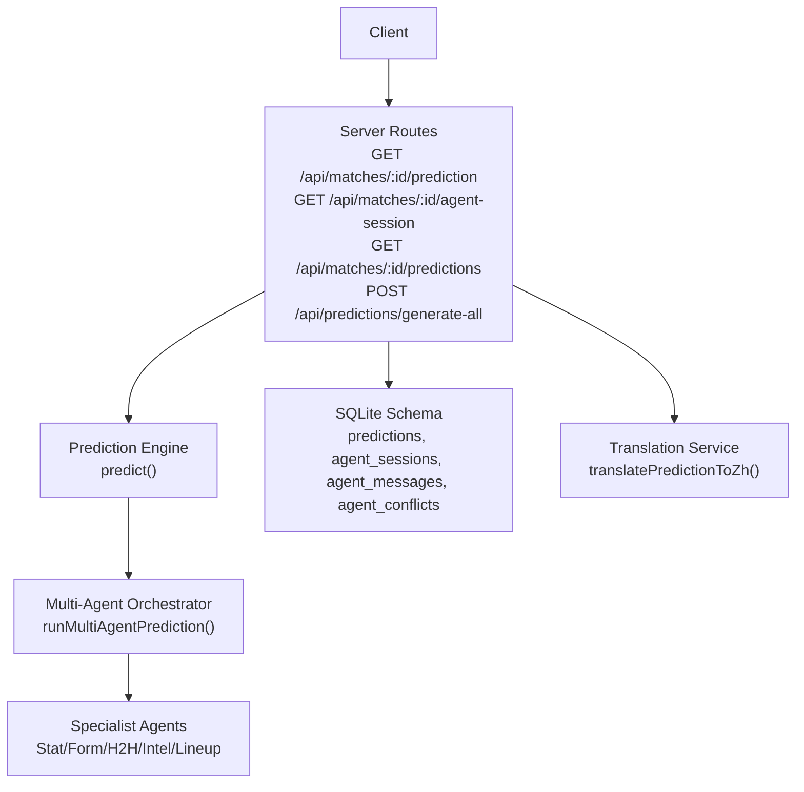
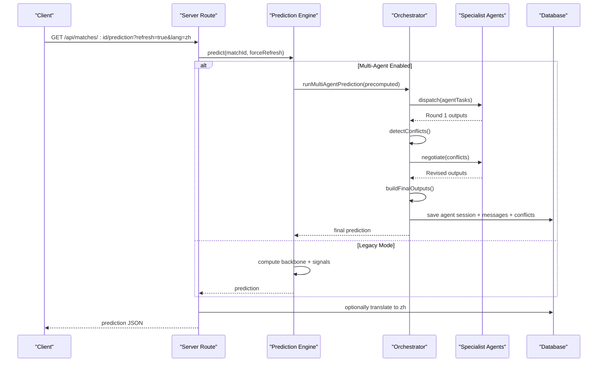
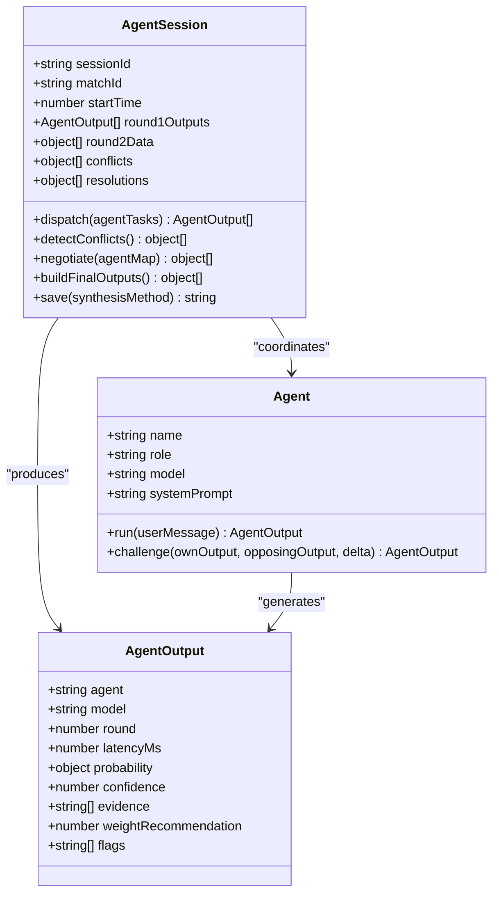
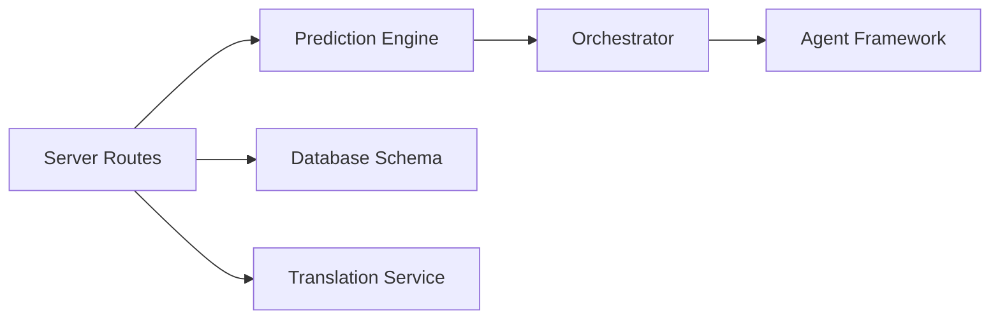

# Prediction API

<cite>
**Referenced Files in This Document**
- [server.js](file://backend/server.js)
- [predictionEngine.js](file://backend/services/predictionEngine.js)
- [orchestratorAgent.js](file://backend/services/agents/orchestratorAgent.js)
- [agentFramework.js](file://backend/services/agents/agentFramework.js)
- [db.js](file://backend/database/db.js)
- [i18nService.js](file://backend/services/i18nService.js)
- [SPEC-PREDICT.md](file://specs/SPEC-PREDICT.md)
</cite>

## Table of Contents
1. [Introduction](#introduction)
2. [Project Structure](#project-structure)
3. [Core Components](#core-components)
4. [Architecture Overview](#architecture-overview)
5. [Detailed Component Analysis](#detailed-component-analysis)
6. [Dependency Analysis](#dependency-analysis)
7. [Performance Considerations](#performance-considerations)
8. [Troubleshooting Guide](#troubleshooting-guide)
9. [Conclusion](#conclusion)

## Introduction
This document describes the prediction-related APIs for retrieving match predictions, prediction history, and multi-agent session logs. It also documents the batch prediction generation endpoint and explains the prediction response schema, confidence levels, methodology, and AI agent insights. Additionally, it covers the prediction cooldown mechanism and provides examples of prediction data structures and agent interaction logs.

## Project Structure
The prediction APIs are implemented in the backend server and orchestrated by the prediction engine and multi-agent framework. The database schema defines the persisted prediction and agent session data.

**Diagram sources**
- [server.js:325-461](file://backend/server.js#L325-L461)
- [predictionEngine.js:690-755](file://backend/services/predictionEngine.js#L690-L755)
- [orchestratorAgent.js:309-499](file://backend/services/agents/orchestratorAgent.js#L309-L499)
- [agentFramework.js:336-571](file://backend/services/agents/agentFramework.js#L336-L571)
- [db.js:72-207](file://backend/database/db.js#L72-L207)
- [i18nService.js:17-63](file://backend/services/i18nService.js#L17-L63)

**Section sources**
- [server.js:325-461](file://backend/server.js#L325-L461)
- [db.js:72-207](file://backend/database/db.js#L72-L207)

## Core Components
- Prediction retrieval endpoint with refresh and language support
- Multi-agent session log endpoint with round-by-round messages, conflicts, and negotiation history
- Prediction history endpoint returning all prediction runs for a match
- Batch prediction generation endpoint with cooldown and indexing integration
- Prediction response schema including probabilities, confidence, methodology, and AI insights
- Agent session structure with latency metrics and conflict resolution

**Section sources**
- [server.js:325-461](file://backend/server.js#L325-L461)
- [predictionEngine.js:690-755](file://backend/services/predictionEngine.js#L690-L755)
- [agentFramework.js:336-571](file://backend/services/agents/agentFramework.js#L336-L571)
- [db.js:72-207](file://backend/database/db.js#L72-L207)

## Architecture Overview
The prediction pipeline starts from the server routes and delegates to the prediction engine. When multi-agent mode is enabled, the orchestrator coordinates multiple specialist agents, detects conflicts, negotiates, and synthesizes a final prediction. The prediction is saved to the database along with the agent session metadata. Clients can retrieve a single prediction with optional refresh and language translation, view the agent session logs, inspect prediction history, or trigger batch generation.

**Diagram sources**
- [server.js:325-341](file://backend/server.js#L325-L341)
- [predictionEngine.js:690-755](file://backend/services/predictionEngine.js#L690-L755)
- [orchestratorAgent.js:309-499](file://backend/services/agents/orchestratorAgent.js#L309-L499)
- [agentFramework.js:336-571](file://backend/services/agents/agentFramework.js#L336-L571)
- [i18nService.js:17-63](file://backend/services/i18nService.js#L17-L63)

## Detailed Component Analysis

### GET /api/matches/:id/prediction
- Purpose: Retrieve the latest prediction for a match, with optional refresh and language translation.
- Path parameters:
  - id: match identifier
- Query parameters:
  - refresh: "true" forces recomputation; otherwise returns cached prediction if available and match is upcoming
  - lang: "zh" translates insight, methodology, and factor descriptions to Chinese
- Response: Prediction object (see Prediction Response Schema)
- Behavior:
  - If refresh is true and prediction is newly generated (not from cache), triggers IndexNow notification for the match page
  - If lang is "zh", translates insight, methodology, and factor descriptions using the translation service
- Notes:
  - For completed/live matches, returns the most recent prediction snapshot

**Section sources**
- [server.js:325-341](file://backend/server.js#L325-L341)
- [i18nService.js:17-63](file://backend/services/i18nService.js#L17-L63)
- [SPEC-PREDICT.md:131-147](file://specs/SPEC-PREDICT.md#L131-L147)

### GET /api/matches/:id/agent-session
- Purpose: Retrieve the full multi-agent session log for the latest prediction run associated with a match.
- Path parameters:
  - id: match identifier
- Response:
  - available: boolean indicating presence of a session
  - session: agent session metadata (agents_used, rounds, conflicts, synthesis method, timing)
  - messages: array of agent messages ordered by round and id, each containing:
    - round, agent, role ("analysis" or "rebuttal")
    - probability: JSON object with winHome, draw, winAway
    - confidence, evidence (array of strings), latency_ms
    - created_at
  - conflicts: array of conflict records with:
    - agent_a, agent_b, delta, resolution, winner, resolution_reasoning
- Behavior:
  - Finds the latest prediction with an agent_session_id for the match
  - Returns a structured session log if available; otherwise indicates unavailability

**Section sources**
- [server.js:343-382](file://backend/server.js#L343-L382)
- [agentFramework.js:510-571](file://backend/services/agents/agentFramework.js#L510-L571)
- [db.js:167-207](file://backend/database/db.js#L167-L207)

### GET /api/matches/:id/predictions
- Purpose: Retrieve the complete prediction history for a match (ordered by generation time).
- Path parameters:
  - id: match identifier
- Response: Array of prediction entries with the following fields:
  - id, match_id, generated_at
  - prob_home, prob_draw, prob_away
  - most_likely_score, confidence
  - methodology, insight
  - actual_outcome, was_correct, brier_score
- Notes:
  - Useful for auditing and backtesting

**Section sources**
- [server.js:384-397](file://backend/server.js#L384-L397)
- [db.js:72-94](file://backend/database/db.js#L72-L94)

### POST /api/predictions/generate-all
- Purpose: Batch generate predictions for all scheduled matches in the earliest active tournament stage.
- Behavior:
  - Determines the earliest active stage among scheduled matches
  - Iterates matches in that stage and generates predictions with force refresh
  - Applies a per-match cooldown (default 30 minutes) to avoid excessive recomputation
  - On success, notifies IndexNow for the affected matches and top pages
- Response:
  - generated: number of predictions generated
  - stage: active tournament stage
  - results: array of per-match results with matchId, ok, and either skipped or error details
- Notes:
  - Scheduled jobs periodically run similar logic for upcoming match days

**Section sources**
- [server.js:399-461](file://backend/server.js#L399-L461)

### Prediction Response Schema
The prediction object returned by the prediction engine and orchestrator includes:
- Core probabilities and outcomes:
  - prob_home, prob_draw, prob_away (probability distribution)
  - most_likely_score (e.g., "X-Y")
  - expected_score_home, expected_score_away (expected goals)
  - top_scores (array of top 3 scorelines with score and probability)
  - confidence (LOW | MEDIUM | HIGH | VERY_HIGH)
- Methodology and insights:
  - methodology (e.g., composition of agent weights)
  - insight (human-readable summary paragraph)
- Supporting metadata:
  - factors (array of factor objects with name, description, favors, impact, weight)
  - web_intel (scraped intelligence including injuries, motivation, key summary)
  - lineup (confirmed lineup strength and absences when available)
  - agent_session_id (link to multi-agent session)
  - fromCache (boolean indicating cache hit)
  - generated_at (timestamp)
- Additional fields for calibration and analytics:
  - lambda_home, lambda_away (backbone parameters)
  - actual_outcome, was_correct, brier_score (filled after match completion)

**Section sources**
- [predictionEngine.js:690-755](file://backend/services/predictionEngine.js#L690-L755)
- [orchestratorAgent.js:470-499](file://backend/services/agents/orchestratorAgent.js#L470-L499)
- [db.js:72-94](file://backend/database/db.js#L72-L94)

### Multi-Agent Session Structure
Agent sessions capture the full reasoning and negotiation process:
- Session metadata:
  - id (UUID), match_id, agents_used (array), rounds (1 or 2), conflicts_detected/resolved, synthesis_method, wall_time_ms, created_at
- Messages:
  - round 1: "analysis" role with initial estimates
  - round 2: "rebuttal" role with revised estimates after negotiation
  - probability, confidence, evidence, raw_response, latency_ms
- Conflicts and resolutions:
  - Records pairwise conflicts with delta and winner
  - Resolution reasoning indicating which agent conceded and by how much

**Diagram sources**
- [agentFramework.js:336-571](file://backend/services/agents/agentFramework.js#L336-L571)

**Section sources**
- [agentFramework.js:336-571](file://backend/services/agents/agentFramework.js#L336-L571)
- [db.js:167-207](file://backend/database/db.js#L167-L207)

### Prediction Cooldown Mechanism
- Per-match cooldown: 30 minutes
- Behavior:
  - When generating predictions in batch, if the last prediction for a match is younger than the cooldown, the match is skipped
  - This prevents redundant recomputations and respects upstream data freshness
- Integration:
  - Successful batch generations trigger IndexNow notifications for updated matches and top pages

**Section sources**
- [server.js:428-451](file://backend/server.js#L428-L451)

### Examples and Usage Patterns
- Single prediction with refresh and language:
  - Request: GET /api/matches/:id/prediction?refresh=true&lang=zh
  - Response: Prediction object with translated insight, methodology, and factor descriptions
- Agent session inspection:
  - Request: GET /api/matches/:id/agent-session
  - Response: Session metadata, messages (round 1 and 2), and conflict resolutions
- Prediction history:
  - Request: GET /api/matches/:id/predictions
  - Response: Ordered array of prediction runs with probabilities, confidence, and outcomes
- Batch generation:
  - Request: POST /api/predictions/generate-all
  - Response: Summary of generated predictions, stage, and per-match results

**Section sources**
- [server.js:325-341](file://backend/server.js#L325-L341)
- [server.js:343-397](file://backend/server.js#L343-L397)
- [server.js:399-461](file://backend/server.js#L399-L461)

## Dependency Analysis
The prediction APIs depend on the prediction engine and multi-agent framework. The database schema persists predictions and agent session artifacts. The translation service provides on-demand localization.

**Diagram sources**
- [server.js:325-461](file://backend/server.js#L325-L461)
- [predictionEngine.js:690-755](file://backend/services/predictionEngine.js#L690-L755)
- [orchestratorAgent.js:309-499](file://backend/services/agents/orchestratorAgent.js#L309-L499)
- [agentFramework.js:336-571](file://backend/services/agents/agentFramework.js#L336-L571)
- [db.js:72-207](file://backend/database/db.js#L72-L207)
- [i18nService.js:17-63](file://backend/services/i18nService.js#L17-L63)

**Section sources**
- [server.js:325-461](file://backend/server.js#L325-L461)
- [db.js:72-207](file://backend/database/db.js#L72-L207)

## Performance Considerations
- Multi-agent mode introduces parallel LLM calls and negotiation rounds; monitor latency and throughput
- Translation to Chinese uses batched translation for insight, methodology, and factor descriptions
- Cooldown prevents frequent recomputation; adjust cooldown duration if needed
- IndexNow notifications are triggered on refresh and batch generation to keep search engines updated

[No sources needed since this section provides general guidance]

## Troubleshooting Guide
- Prediction not updating:
  - Ensure refresh=true is passed to force recomputation
  - Verify the match is upcoming; completed/live matches return the latest snapshot
- Multi-agent session not available:
  - Sessions are only saved when multi-agent mode is enabled and a prediction run completes successfully
- Translation failures:
  - The translation service falls back to English on errors
- Batch generation skips matches:
  - Matches within the 30-minute cooldown window are intentionally skipped

**Section sources**
- [server.js:325-341](file://backend/server.js#L325-L341)
- [server.js:343-397](file://backend/server.js#L343-L397)
- [server.js:399-461](file://backend/server.js#L399-L461)
- [i18nService.js:59-63](file://backend/services/i18nService.js#L59-L63)

## Conclusion
The prediction APIs provide flexible access to single-match predictions, prediction histories, and detailed multi-agent reasoning traces. They support on-demand refresh, language localization, and batch generation with a protective cooldown. The response schemas and agent session logs enable deep understanding of the model’s methodology, confidence, and AI-driven insights.