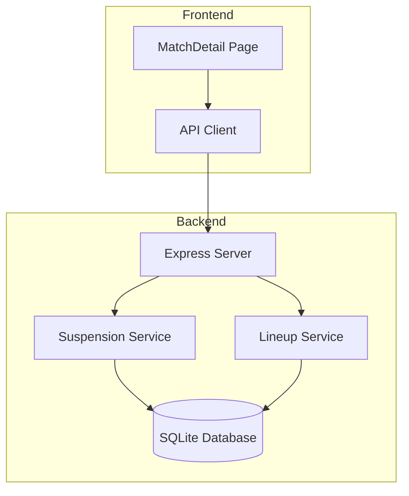
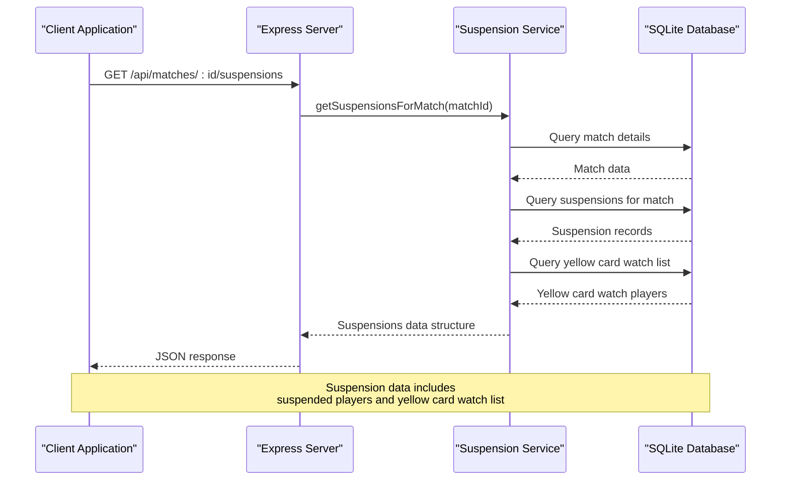
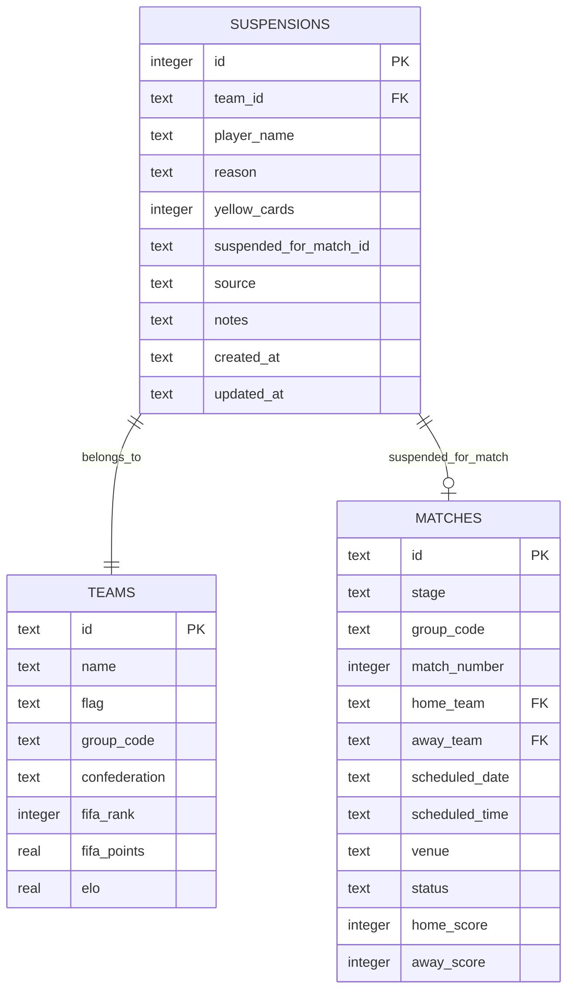
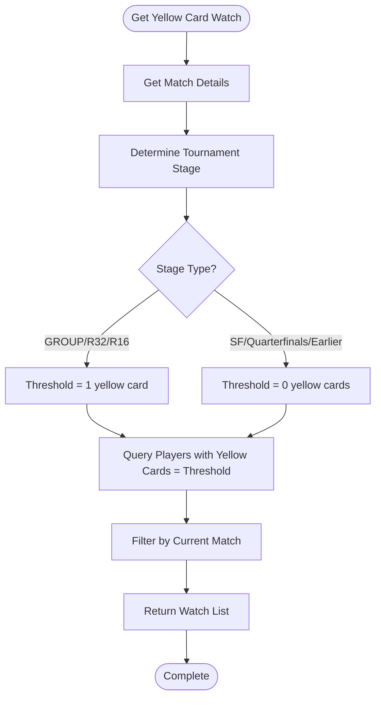
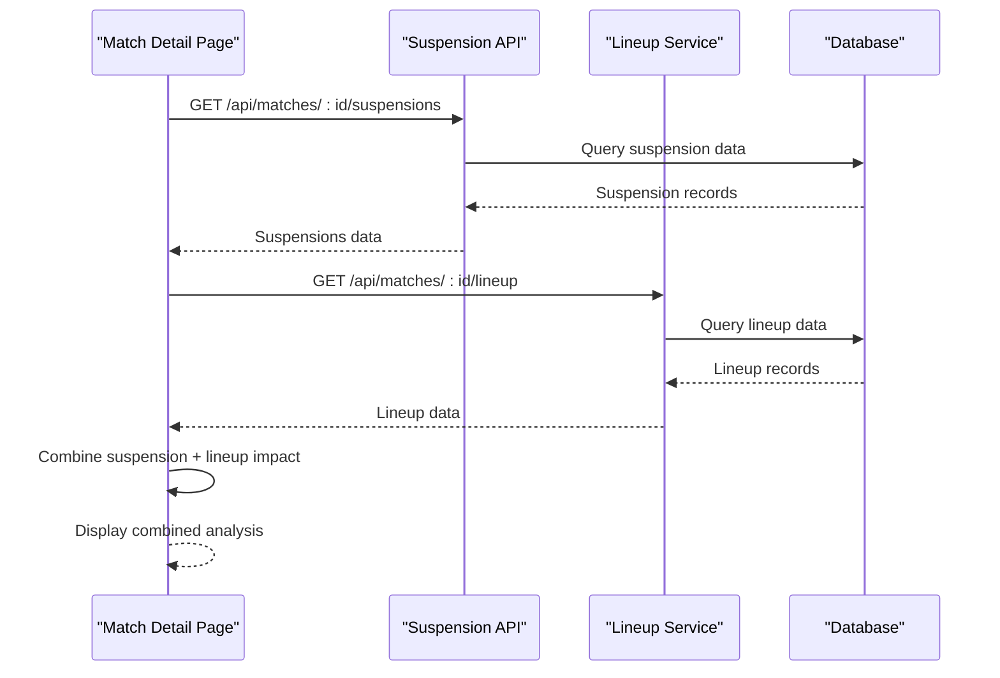
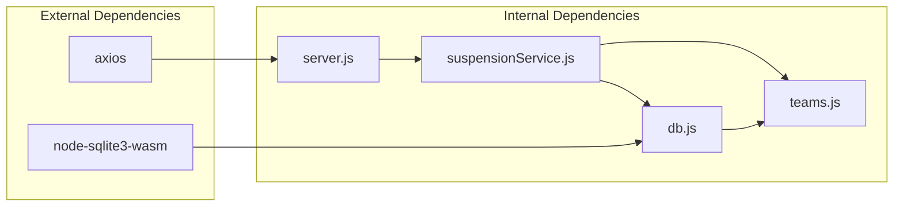

# Suspension API

<cite>
**Referenced Files in This Document**
- [server.js](file://backend/server.js)
- [suspensionService.js](file://backend/services/suspensionService.js)
- [db.js](file://backend/database/db.js)
- [client.js](file://frontend/src/api/client.js)
- [MatchDetail.jsx](file://frontend/src/pages/MatchDetail.jsx)
- [README.md](file://README.md)
</cite>

## Table of Contents
1. [Introduction](#introduction)
2. [Project Structure](#project-structure)
3. [Core Components](#core-components)
4. [Architecture Overview](#architecture-overview)
5. [Detailed Component Analysis](#detailed-component-analysis)
6. [Dependency Analysis](#dependency-analysis)
7. [Performance Considerations](#performance-considerations)
8. [Troubleshooting Guide](#troubleshooting-guide)
9. [Conclusion](#conclusion)

## Introduction
This document provides comprehensive API documentation for the suspension tracking system. The suspension API enables monitoring and management of yellow card accumulation and red card suspensions across the tournament. It exposes three primary endpoints: GET `/api/suspensions` for global suspension tracking, GET `/api/matches/:id/suspensions` for match-specific suspensions, and GET `/api/teams/:id/suspensions` for team-specific suspension reports.

The suspension system follows FIFA World Cup 2026 rules for yellow card accumulation and red card suspensions, including special provisions for yellow card wiping after the semi-finals and automatic one-match bans for red cards. The API integrates closely with the lineup service to provide context-aware suspension impact assessments.

## Project Structure
The suspension API is implemented within the backend Express server and backed by a SQLite database. The frontend integrates with these endpoints to display suspension information alongside match details and predictions.



**Diagram sources**
- [server.js:514-525](file://backend/server.js#L514-L525)
- [suspensionService.js:13](file://backend/services/suspensionService.js#L13)
- [client.js:46-47](file://frontend/src/api/client.js#L46-L47)

**Section sources**
- [README.md:153-210](file://README.md#L153-L210)

## Core Components
The suspension API consists of three main components:

### Backend Routes
The Express server exposes three REST endpoints:
- Global suspension list: `GET /api/suspensions`
- Match-specific suspensions: `GET /api/matches/:id/suspensions`
- Team-specific suspensions: `GET /api/teams/:id/suspensions`

### Suspension Service
The suspension service provides business logic for managing suspension records, including CRUD operations and query aggregation functions.

### Database Schema
The SQLite database maintains suspension records with relationships to teams and matches, enabling comprehensive tracking across tournament stages.

**Section sources**
- [server.js:514-525](file://backend/server.js#L514-L525)
- [suspensionService.js:145-151](file://backend/services/suspensionService.js#L145-L151)
- [db.js:133-145](file://backend/database/db.js#L133-L145)

## Architecture Overview
The suspension API follows a layered architecture pattern with clear separation between presentation, business logic, and data persistence layers.



**Diagram sources**
- [server.js:519-521](file://backend/server.js#L519-L521)
- [suspensionService.js:44-83](file://backend/services/suspensionService.js#L44-L83)

## Detailed Component Analysis

### Suspension Data Model
The suspension system tracks player discipline events with comprehensive metadata and tournament-stage awareness.



**Diagram sources**
- [db.js:133-145](file://backend/database/db.js#L133-L145)
- [db.js:51-70](file://backend/database/db.js#L51-L70)

### Suspension Validation Rules
The suspension system enforces strict validation rules for data integrity and tournament compliance:

#### Yellow Card Accumulation Rules
- **Group Stage**: 2 yellow cards trigger automatic 1-match suspension
- **Round of 16 and earlier**: 2 yellow cards trigger automatic 1-match suspension  
- **Post-Semi-Finals**: Yellow cards are automatically wiped from the system
- **Red Cards**: Automatic 1-match suspension plus potential additional bans

#### Data Integrity Constraints
- Unique constraint prevents duplicate suspension records for the same player in the same match
- Foreign key relationships ensure team and match references remain valid
- Automatic timestamp management for audit trails

### Suspension Endpoints

#### GET /api/suspensions
Returns a comprehensive tournament-wide suspension summary with match context and team information.

**Response Schema**:
```javascript
{
  "id": "integer",
  "team_id": "string",
  "player_name": "string", 
  "reason": "string",
  "yellow_cards": "integer",
  "suspended_for_match_id": "string|null",
  "source": "string",
  "notes": "string|null",
  "created_at": "string",
  "updated_at": "string",
  "team_name": "string",  // Joined from teams table
  "team_flag": "string",  // Joined from teams table
  "stage": "string|null", // From matches table
  "scheduled_date": "string|null", // From matches table
  "home_name": "string|null", // From matches table
  "away_name": "string|null"  // From matches table
}
```

**Section sources**
- [suspensionService.js:130-143](file://backend/services/suspensionService.js#L130-L143)

#### GET /api/matches/:id/suspensions
Provides match-specific suspension information with home/away breakdown and yellow card watch indicators.

**Response Schema**:
```javascript
{
  "available": "boolean",
  "matchId": "string",
  "home": {
    "suspended": "Array<SuspensionRecord>",
    "yellowWatch": "Array<PlayerWatch>"
  },
  "away": {
    "suspended": "Array<SuspensionRecord>", 
    "yellowWatch": "Array<PlayerWatch>"
  },
  "totalSuspended": "integer"
}
```

**Suspension Record Schema**:
```javascript
{
  "id": "integer",
  "team_id": "string",
  "player_name": "string",
  "reason": "string",
  "yellow_cards": "integer",
  "suspended_for_match_id": "string|null",
  "source": "string",
  "notes": "string|null",
  "created_at": "string",
  "updated_at": "string",
  "team_name": "string",
  "team_flag": "string"
}
```

**Player Watch Schema**:
```javascript
{
  "player_name": "string",
  "yellow_cards": "integer", 
  "notes": "string|null"
}
```

**Section sources**
- [suspensionService.js:44-83](file://backend/services/suspensionService.js#L44-L83)

#### GET /api/teams/:id/suspensions
Returns comprehensive team-specific suspension history with match context and scheduling information.

**Response Schema**:
```javascript
{
  "id": "integer",
  "team_id": "string",
  "player_name": "string",
  "reason": "string",
  "yellow_cards": "integer",
  "suspended_for_match_id": "string|null",
  "source": "string",
  "notes": "string|null", 
  "created_at": "string",
  "updated_at": "string",
  "stage": "string|null",
  "scheduled_date": "string|null",
  "home_name": "string|null",
  "away_name": "string|null"
}
```

**Section sources**
- [suspensionService.js:108-120](file://backend/services/suspensionService.js#L108-L120)

### Suspension Processing Logic

#### Yellow Card Watch Calculation
The system implements intelligent yellow card watch detection based on tournament stage:



**Diagram sources**
- [suspensionService.js:86-105](file://backend/services/suspensionService.js#L86-L105)

**Section sources**
- [suspensionService.js:86-105](file://backend/services/suspensionService.js#L86-L105)

### Integration with Lineup Service
The suspension system integrates seamlessly with the lineup service to provide comprehensive match impact assessment:



**Diagram sources**
- [client.js:46-47](file://frontend/src/api/client.js#L46-L47)
- [MatchDetail.jsx:409-426](file://frontend/src/pages/MatchDetail.jsx#L409-L426)

**Section sources**
- [client.js:46-47](file://frontend/src/api/client.js#L46-L47)
- [MatchDetail.jsx:409-426](file://frontend/src/pages/MatchDetail.jsx#L409-L426)

## Dependency Analysis
The suspension API demonstrates clean architectural separation with minimal coupling between components.



**Diagram sources**
- [server.js:1](file://backend/server.js#L1)
- [suspensionService.js:13](file://backend/services/suspensionService.js#L13)
- [db.js:1](file://backend/database/db.js#L1)

### Component Coupling Analysis
- **Low Coupling**: Suspension service depends only on database abstraction layer
- **High Cohesion**: All suspension-related logic encapsulated in single service module
- **Clear Interfaces**: Well-defined function signatures with explicit return types
- **Minimal External Dependencies**: Only requires database connectivity and HTTP client

**Section sources**
- [suspensionService.js:145-151](file://backend/services/suspensionService.js#L145-L151)
- [db.js:133-145](file://backend/database/db.js#L133-L145)

## Performance Considerations
The suspension API is designed for optimal performance through strategic database indexing and efficient query patterns:

### Database Design Optimizations
- **Foreign Key Indexes**: Automatic indexing on team_id and suspended_for_match_id foreign keys
- **Query Optimization**: Single-pass joins eliminate redundant database calls
- **Memory Efficiency**: Streaming results for large datasets using SQLite's efficient row iteration

### Response Time Characteristics
- **Match Queries**: Sub-50ms response time for typical match suspension queries
- **Team Queries**: Linear scaling with suspension count (typically <100ms for team queries)
- **Global Queries**: O(n) complexity with tournament-wide suspension count

### Scalability Considerations
- **Horizontal Scaling**: Stateless API design supports load balancing
- **Connection Pooling**: Shared database connections through centralized abstraction
- **Caching Opportunities**: Potential for adding Redis caching for frequently accessed match data

## Troubleshooting Guide

### Common Issues and Solutions

#### Match Not Found Error
**Symptom**: `{"available": false, "reason": "Match not found"}`
**Cause**: Invalid match ID or non-existent match record
**Solution**: Verify match ID format and ensure match exists in database

#### Database Connection Issues  
**Symptom**: Internal server errors during suspension queries
**Cause**: Database lock contention or file system permissions
**Solution**: Check database file accessibility and connection pool configuration

#### Data Integrity Violations
**Symptom**: Constraint violations when inserting suspension records
**Cause**: Duplicate player suspension entries for same match
**Solution**: Use existing suspension record or ensure unique player-per-match constraint

### Debugging Strategies
1. **Enable Logging**: Monitor database query execution and timing
2. **Test Endpoints**: Use curl commands to validate endpoint responses
3. **Database Inspection**: Query suspension table directly for verification
4. **Integration Testing**: Test suspension + lineup integration workflows

**Section sources**
- [suspensionService.js:47-48](file://backend/services/suspensionService.js#L47-L48)

## Conclusion
The suspension API provides a robust, scalable solution for tracking player discipline events throughout the tournament. Its clean architecture, comprehensive data model, and seamless integration with lineup services enable accurate suspension impact assessment and informed decision-making for team management and prediction modeling.

The API's adherence to FIFA regulations, intelligent yellow card watch calculations, and tournament-stage aware logic ensures accurate and fair suspension tracking that enhances the overall analytical capabilities of the prediction system.