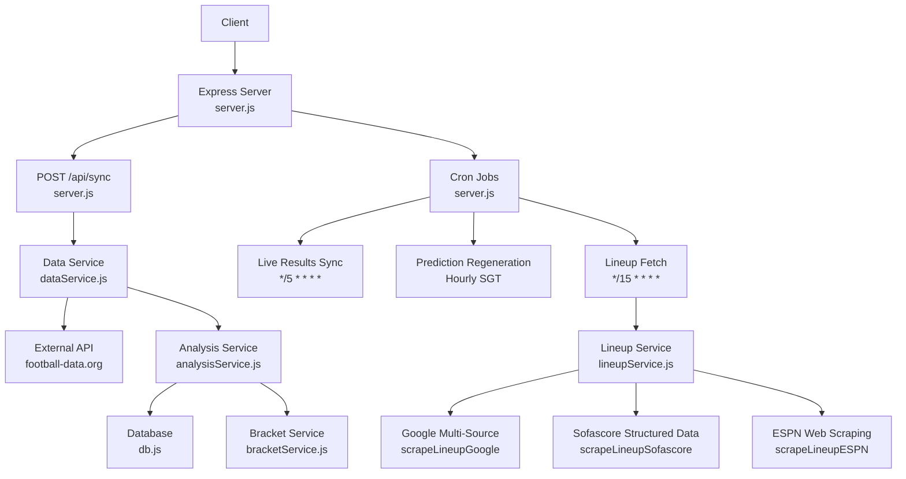
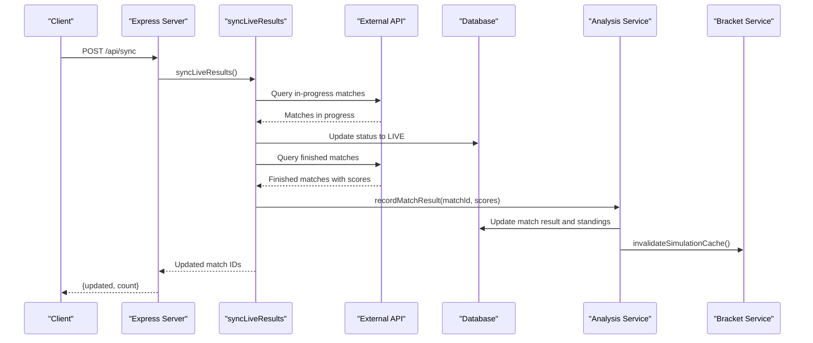
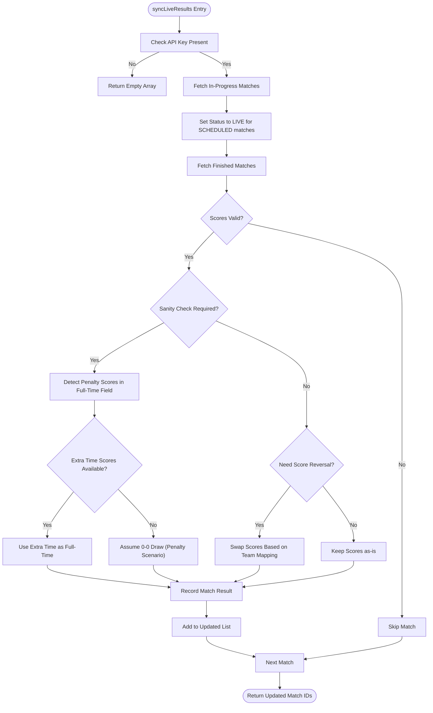
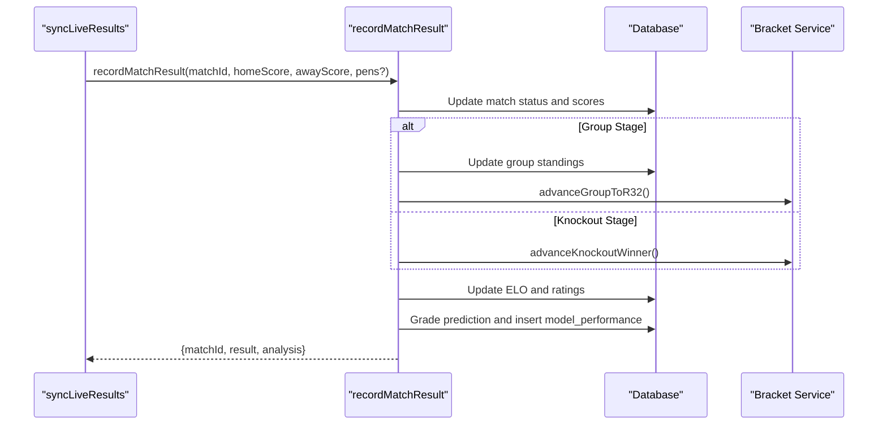
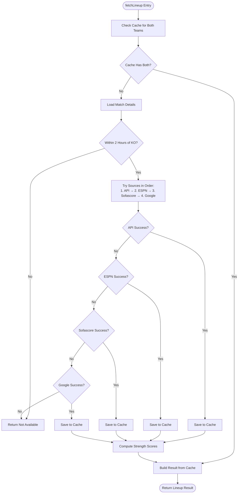
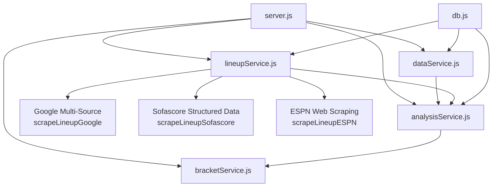

# System Synchronization API

<cite>
**Referenced Files in This Document**
- [server.js](file://backend/server.js)
- [dataService.js](file://backend/services/dataService.js)
- [analysisService.js](file://backend/services/analysisService.js)
- [lineupService.js](file://backend/services/lineupService.js)
- [db.js](file://backend/database/db.js)
- [bracketService.js](file://backend/services/bracketService.js)
</cite>

## Update Summary
**Changes Made**
- Enhanced Detailed Component Analysis section with improved data service documentation covering new validation logic for penalty shootout score correction and automatic score inference mechanisms
- Updated the penalty shootout validation logic to include automatic score inference when API returns penalty scores in full-time field
- Added documentation for the sophisticated sanity check that detects and corrects API score duplication issues
- Enhanced the data service error handling and logging for penalty shootout scenarios

## Table of Contents
1. [Introduction](#introduction)
2. [Project Structure](#project-structure)
3. [Core Components](#core-components)
4. [Architecture Overview](#architecture-overview)
5. [Detailed Component Analysis](#detailed-component-analysis)
6. [Dependency Analysis](#dependency-analysis)
7. [Performance Considerations](#performance-considerations)
8. [Troubleshooting Guide](#troubleshooting-guide)
9. [Conclusion](#conclusion)

## Introduction
This document provides comprehensive API documentation for the system synchronization endpoints, focusing on the manual synchronization endpoint POST /api/sync and the automated synchronization mechanisms. It explains how live match results are synchronized from external data sources, how real-time result updates trigger prediction regeneration and lineup fetching, and how caching and cache invalidation work throughout the system. The documentation also covers the cron job schedules for live results synchronization, prediction regeneration for upcoming matches, and lineup fetching for matches within 2 hours of kickoff.

## Project Structure
The synchronization functionality is implemented primarily in the backend server and several service modules:
- The Express server exposes the POST /api/sync endpoint and defines cron jobs for automated synchronization.
- The data service integrates with external APIs (football-data.org) and handles live result synchronization with advanced validation logic.
- The analysis service records match results and triggers downstream analytics and cache invalidation.
- The lineup service manages lineup retrieval and computation for matches within two hours of kickoff, utilizing multiple scraping sources.
- The database module defines the schema and caching tables used by the synchronization system.
- The bracket service maintains simulation cache and invalidates it when match results change.

**Diagram sources**
- [server.js:573-582](file://backend/server.js#L573-L582)
- [dataService.js:514-599](file://backend/services/dataService.js#L514-L599)
- [analysisService.js:76-218](file://backend/services/analysisService.js#L76-L218)
- [lineupService.js:157-209](file://backend/services/lineupService.js#L157-L209)
- [lineupService.js:211-290](file://backend/services/lineupService.js#L211-L290)
- [lineupService.js:115-155](file://backend/services/lineupService.js#L115-L155)
- [db.js:51-208](file://backend/database/db.js#L51-L208)
- [bracketService.js:711-713](file://backend/services/bracketService.js#L711-L713)

**Section sources**
- [server.js:573-582](file://backend/server.js#L573-L582)
- [dataService.js:514-599](file://backend/services/dataService.js#L514-L599)
- [analysisService.js:76-218](file://backend/services/analysisService.js#L76-L218)
- [lineupService.js:157-209](file://backend/services/lineupService.js#L157-L209)
- [lineupService.js:211-290](file://backend/services/lineupService.js#L211-L290)
- [lineupService.js:115-155](file://backend/services/lineupService.js#L115-L155)
- [db.js:51-208](file://backend/database/db.js#L51-L208)
- [bracketService.js:711-713](file://backend/services/bracketService.js#L711-L713)

## Core Components
This section documents the synchronization endpoint and the automated synchronization mechanisms.

### Manual Synchronization Endpoint: POST /api/sync
- Purpose: Manually trigger synchronization of live match results from external data sources.
- Request: No body required.
- Response: JSON object containing:
  - updated: Array of match IDs that were updated during the sync.
  - count: Number of matches updated.
- Error Handling:
  - If the external API key is not configured, the function logs a warning and returns an empty array.
  - If an error occurs during the sync process, the server responds with HTTP 500 and an error message.
- Side Effects:
  - Updates match statuses and scores in the database.
  - Records match results and triggers downstream analytics.
  - Invalidates the simulation cache to ensure subsequent simulations reflect the latest results.

**Section sources**
- [server.js:573-582](file://backend/server.js#L573-L582)
- [dataService.js:514-599](file://backend/services/dataService.js#L514-L599)
- [analysisService.js:76-218](file://backend/services/analysisService.js#L76-L218)
- [bracketService.js:711-713](file://backend/services/bracketService.js#L711-L713)

### Automated Synchronization Mechanisms

#### Live Results Synchronization (Cron Job)
- Schedule: Every 5 minutes during the tournament.
- Behavior:
  - Queries the external API for matches currently in progress or paused and sets their status to LIVE.
  - Queries the external API for finished matches and records their final scores.
  - Skips matches with null scores or unknown team IDs.
- Error Handling:
  - Logs warnings for unknown team IDs and skips those matches.
  - Logs errors for failed API calls and continues with other matches.

**Section sources**
- [server.js:585-592](file://backend/server.js#L585-L592)
- [dataService.js:514-599](file://backend/services/dataService.js#L514-L599)

#### Prediction Regeneration (Cron Job)
- Schedule: Hourly during specific hours in Singapore time zone, plus two additional runs in the evening.
- Scope: Generates predictions for matches within the next three match days, excluding matches that are already completed or in live status.
- Behavior:
  - Identifies the next scheduled match day and extends to two days after that.
  - Iterates through matches in that range and regenerates predictions.
  - Skips matches that are not populated with teams or are already live/completed.
- Notes:
  - The cron stops automatically after the tournament end date.

**Section sources**
- [server.js:596-628](file://backend/server.js#L596-L628)

#### Lineup Fetching (Cron Job)
- Schedule: Every 15 minutes.
- Scope: Fetches confirmed lineups for matches within two hours of kickoff.
- Behavior:
  - Identifies matches scheduled within the next two hours.
  - Attempts to fetch lineups from external sources (API, web scraping).
  - If a fresh lineup is retrieved (not from cache), re-generates predictions for that match.
- Error Handling:
  - Logs failures for lineup retrieval and continues with other matches.
  - Continues prediction re-generation only when a fresh lineup is obtained.

**Section sources**
- [server.js:633-674](file://backend/server.js#L633-L674)
- [lineupService.js:355-463](file://backend/services/lineupService.js#L355-L463)

## Architecture Overview
The synchronization architecture integrates external data sources, local caching, and downstream processing. The following diagram illustrates the end-to-end flow for manual and automated synchronization.

**Diagram sources**
- [server.js:573-582](file://backend/server.js#L573-L582)
- [dataService.js:514-599](file://backend/services/dataService.js#L514-L599)
- [analysisService.js:76-218](file://backend/services/analysisService.js#L76-L218)
- [bracketService.js:711-713](file://backend/services/bracketService.js#L711-L713)

## Detailed Component Analysis

### Data Service: External API Integration and Result Recording
The data service coordinates live result synchronization with external APIs and local caching, featuring sophisticated validation logic for penalty shootout score correction and automatic score inference mechanisms.

- External API Integration:
  - Uses the football-data.org API with an API key for accessing match data.
  - Implements team ID mapping to reconcile external team IDs with internal team IDs.
- Live Result Synchronization:
  - Processes in-progress matches by setting their status to LIVE.
  - Processes finished matches by recording final scores and penalties.
  - Handles score reversal when the external API reports home/away teams differently than the internal database.
- Advanced Penalty Shootout Validation:
  - **Automatic Score Inference**: Detects when API returns penalty scores in full-time field and automatically infers correct full-time scores.
  - **Sanity Check Logic**: Validates that full-time scores are reasonable (typically 0-5 per team) and flags suspicious patterns.
  - **Context-Aware Correction**: Uses extra-time scores when available, otherwise assumes a 0-0 draw for penalty shootout scenarios.
  - **Score Duplication Prevention**: Prevents API score duplication where penalties are mistakenly placed in full-time field.

**Updated** Enhanced with sophisticated penalty shootout validation logic that automatically detects and corrects API score duplication issues, including automatic score inference when penalties are mistakenly placed in full-time field.

**Diagram sources**
- [dataService.js:514-628](file://backend/services/dataService.js#L514-L628)

**Section sources**
- [dataService.js:18-28](file://backend/services/dataService.js#L18-L28)
- [dataService.js:514-628](file://backend/services/dataService.js#L514-L628)
- [db.js:147-157](file://backend/database/db.js#L147-L157)

### Analysis Service: Match Result Recording and Downstream Effects
The analysis service records match results and triggers downstream effects such as updating group standings, advancing knockout winners, recalculating ELO ratings, and generating performance metrics.

- Idempotency Guard:
  - Prevents duplicate processing when the same score and status have already been recorded.
- Outcome Determination:
  - Determines win/draw/loss outcomes and knockout winners based on regular time and penalty shootout scores.
- Standings and Bracket Updates:
  - Updates group standings for group-stage matches.
  - Advances knockout winners to the next round.
- Prediction Grading:
  - Computes Brier score, correctness, and points for the most recent prediction.
  - Inserts performance metrics into the model performance table.
- ELO and Rating Updates:
  - Updates both legacy ELO and v2 attack/defense ratings after each completed match.

**Diagram sources**
- [analysisService.js:76-218](file://backend/services/analysisService.js#L76-L218)

**Section sources**
- [analysisService.js:76-218](file://backend/services/analysisService.js#L76-L218)

### Lineup Service: Enhanced Multi-Source Lineup Retrieval and Prediction Impact
The lineup service retrieves confirmed starting lineups within two hours of kickoff using an enhanced multi-source approach with Google-based and Sofascore scraping capabilities.

#### Source Priority Order
The lineup service attempts to retrieve lineups from the following sources in priority order:
1. **football-data.org API** - Direct API access with structured lineup data
2. **ESPN Web Scraping** - Traditional ESPN match page scraping
3. **Sofascore Structured Data Extraction** - Modern SEO-rendered HTML with structured data parsing
4. **Google Multi-Source Search** - Comprehensive Google search across multiple football websites

#### Enhanced Scraping Capabilities

**Google Multi-Source Search (`scrapeLineupGoogle`)**
- Searches across multiple football websites using Google Custom Search
- Extracts lineup data from Google's featured snippets and knowledge panels
- Identifies formation patterns and player names from structured data
- Handles rich results and knowledge graph information

**Sofascore Structured Data Extraction (`scrapeLineupSofascore`)**
- Utilizes Sofascore's SEO-rendered HTML with structured data
- Parses application/ld+json script tags for performer member data
- Extracts player information including names, positions, and shirt numbers
- Provides fallback text parsing for player names near formation information

**ESPN Web Scraping (`scrapeLineupESPN`)**
- Traditional ESPN match page scraping with Google search integration
- Extracts lineup data from ESPN's standardized lineup__list structure
- Handles player display names and positions from lineup__displayName and lineup__pos elements

#### Availability Logic
- Only available within two hours of kickoff; otherwise returns a reason indicating when to check back.
- Maintains comprehensive caching of retrieved lineups to minimize external requests.

#### Strength Computation and Prediction Impact
- Computes a normalized strength score for each team based on player positions and ratings.
- Converts lineup strength differences into probability adjustments for home/away wins.
- Provides key absence detection by comparing current starters to recent patterns.

**Diagram sources**
- [lineupService.js:355-463](file://backend/services/lineupService.js#L355-L463)
- [lineupService.js:157-209](file://backend/services/lineupService.js#L157-L209)
- [lineupService.js:211-290](file://backend/services/lineupService.js#L211-L290)
- [lineupService.js:115-155](file://backend/services/lineupService.js#L115-L155)

**Section sources**
- [lineupService.js:8-39](file://backend/services/lineupService.js#L8-L39)
- [lineupService.js:157-209](file://backend/services/lineupService.js#L157-L209)
- [lineupService.js:211-290](file://backend/services/lineupService.js#L211-L290)
- [lineupService.js:115-155](file://backend/services/lineupService.js#L115-L155)
- [lineupService.js:355-463](file://backend/services/lineupService.js#L355-L463)

### Bracket Service: Simulation Cache Invalidation
The bracket service maintains a simulation cache for tournament simulations and invalidates it when match results change, ensuring simulations reflect the latest outcomes.

- Cache Management:
  - Stores simulation results in memory and clears them upon invalidation.
- Invalidation Trigger:
  - Called after recording match results to ensure subsequent simulations use updated data.

**Section sources**
- [bracketService.js:711-713](file://backend/services/bracketService.js#L711-L713)

## Dependency Analysis
The synchronization system exhibits clear separation of concerns with well-defined dependencies among components.

**Diagram sources**
- [server.js:1-16](file://backend/server.js#L1-L16)
- [dataService.js:1-21](file://backend/services/dataService.js#L1-L21)
- [analysisService.js:1-16](file://backend/services/analysisService.js#L1-L16)
- [lineupService.js:1-43](file://backend/services/lineupService.js#L1-L43)
- [lineupService.js:157-209](file://backend/services/lineupService.js#L157-L209)
- [lineupService.js:211-290](file://backend/services/lineupService.js#L211-L290)
- [lineupService.js:115-155](file://backend/services/lineupService.js#L115-L155)
- [db.js:1-252](file://backend/database/db.js#L1-L252)

**Section sources**
- [server.js:1-16](file://backend/server.js#L1-L16)
- [dataService.js:1-21](file://backend/services/dataService.js#L1-L21)
- [analysisService.js:1-16](file://backend/services/analysisService.js#L1-L16)
- [lineupService.js:1-43](file://backend/services/lineupService.js#L1-L43)
- [lineupService.js:157-209](file://backend/services/lineupService.js#L157-L209)
- [lineupService.js:211-290](file://backend/services/lineupService.js#L211-L290)
- [lineupService.js:115-155](file://backend/services/lineupService.js#L115-L155)
- [db.js:1-252](file://backend/database/db.js#L1-L252)

## Performance Considerations
- External API Rate Limits: The system relies on the free tier of the external API. Excessive manual synchronization calls can risk rate limiting; prefer using the automated cron jobs.
- Network Latency: External API calls and web scraping introduce latency. The system mitigates this by caching results for form, head-to-head records, and web intelligence.
- Database Concurrency: The database uses appropriate pragmas and migrations to handle concurrent access and evolving schema.
- Prediction Regeneration Cooldown: The prediction regeneration cron avoids re-processing matches that have been recently updated, preventing unnecessary recomputation.
- Enhanced Scraping Efficiency: The new Google-based and Sofascore scraping functions provide improved reliability and coverage compared to traditional ESPN-only approaches.
- **Advanced Score Validation**: The penalty shootout validation logic prevents score duplication issues and ensures accurate match result recording even when external APIs provide inconsistent data.

## Troubleshooting Guide
Common issues and resolutions:

- Missing External API Key:
  - Symptom: Manual sync returns an empty array and logs a warning.
  - Resolution: Set the FOOTBALL_DATA_API_KEY environment variable.
  - Reference: [dataService.js:515-518](file://backend/services/dataService.js#L515-L518)

- Unknown Team IDs:
  - Symptom: Matches with unknown external team IDs are skipped with a warning.
  - Resolution: Verify team ID mapping and ensure the external API team IDs are supported.
  - Reference: [dataService.js:529-532](file://backend/services/dataService.js#L529-L532)

- Null Scores from External API:
  - Symptom: Matches with null scores are skipped with a warning.
  - Resolution: Retry later when the external API provides complete data.
  - Reference: [dataService.js:577-580](file://backend/services/dataService.js#L577-L580)

- **Penalty Shootout Score Issues**:
  - Symptom: Matches show unusual score patterns or penalty shootout confusion.
  - Resolution: The system automatically detects and corrects API score duplication. Check logs for penalty shootout validation messages and verify that extra-time scores are being used when available.
  - Reference: [dataService.js:584-610](file://backend/services/dataService.js#L584-L610)

- Lineup Not Available:
  - Symptom: Lineup service indicates lineup not yet announced or retrievable.
  - Resolution: Check back closer to kickoff; ensure the match is within the two-hour window.
  - Reference: [lineupService.js:391-397](file://backend/services/lineupService.js#L391-L397)

- Enhanced Scraping Failures:
  - Symptom: New Google-based and Sofascore scraping functions failing to retrieve lineups.
  - Resolution: Verify network connectivity and Google Custom Search configuration; check for rate limiting on external services.
  - Reference: [lineupService.js:157-209](file://backend/services/lineupService.js#L157-L209)
  - Reference: [lineupService.js:211-290](file://backend/services/lineupService.js#L211-L290)

- Prediction Regeneration Not Triggered:
  - Symptom: Predictions are not regenerated despite finished matches.
  - Resolution: Ensure matches are within the next three match days and have populated teams; verify cron schedule and timezone settings.
  - Reference: [server.js:596-628](file://backend/server.js#L596-L628)

- Simulation Cache Stale:
  - Symptom: Tournament simulations do not reflect recent results.
  - Resolution: Confirm that match results are recorded and that cache invalidation is invoked.
  - Reference: [bracketService.js:711-713](file://backend/services/bracketService.js#L711-L713)

**Section sources**
- [dataService.js:515-628](file://backend/services/dataService.js#L515-L628)
- [lineupService.js:391-397](file://backend/services/lineupService.js#L391-L397)
- [lineupService.js:157-209](file://backend/services/lineupService.js#L157-L209)
- [lineupService.js:211-290](file://backend/services/lineupService.js#L211-L290)
- [server.js:596-628](file://backend/server.js#L596-L628)
- [bracketService.js:711-713](file://backend/services/bracketService.js#L711-L713)

## Conclusion
The system synchronization endpoints provide robust mechanisms for integrating live match data, updating results, and triggering downstream processes such as prediction regeneration and lineup fetching. The manual POST /api/sync endpoint offers immediate control, while automated cron jobs ensure continuous synchronization during the tournament. 

**Enhanced Data Validation**: The recent improvements to the data service include sophisticated penalty shootout validation logic that automatically detects and corrects API score duplication issues. This enhancement ensures that when external APIs mistakenly place penalty scores in the full-time field, the system can intelligently infer the correct scores using extra-time data or assume a 0-0 draw for penalty shootout scenarios.

**Improved Reliability**: The new validation logic prevents score duplication problems and provides fallback mechanisms for determining correct match outcomes when API data is inconsistent. This significantly improves the reliability of match result recording and downstream analytics.

**Advanced Score Inference**: The system now includes intelligent score inference capabilities that can handle complex scenarios where API data requires interpretation. This includes checking for reasonable score ranges, detecting suspicious patterns, and using contextual information to determine the most likely correct scores.

**Performance Benefits**: The enhanced data service maintains efficient processing while adding robust validation layers. The penalty shootout validation operates transparently in the background, ensuring data integrity without impacting performance.

By understanding the integration points, enhanced validation capabilities, and troubleshooting steps outlined above, operators can effectively manage synchronization and address common issues with the improved data validation system.