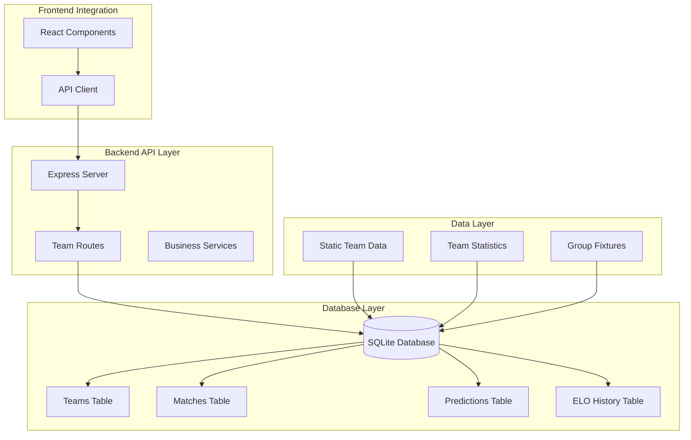
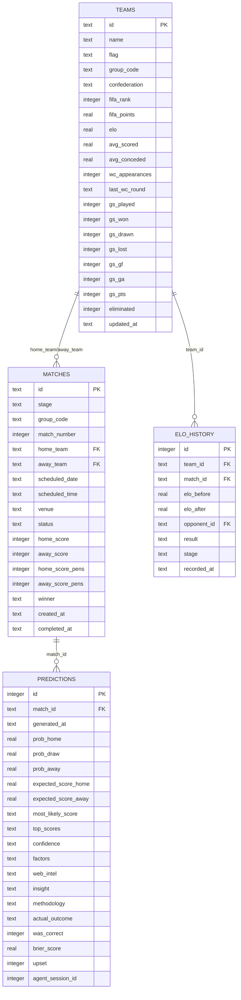
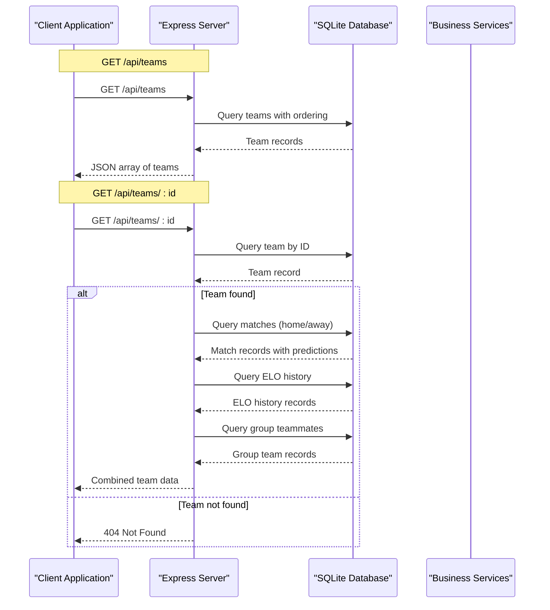
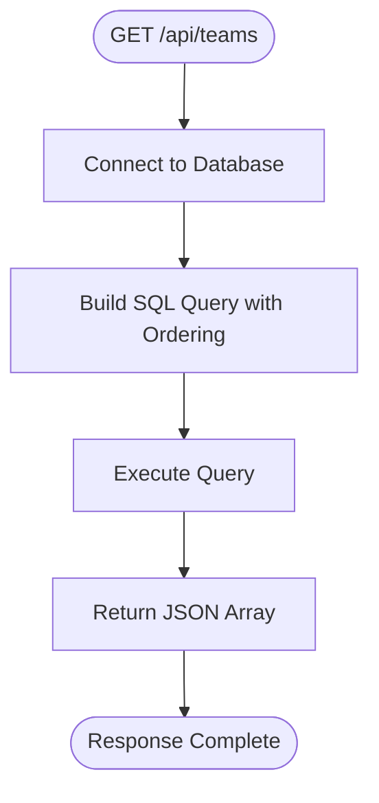
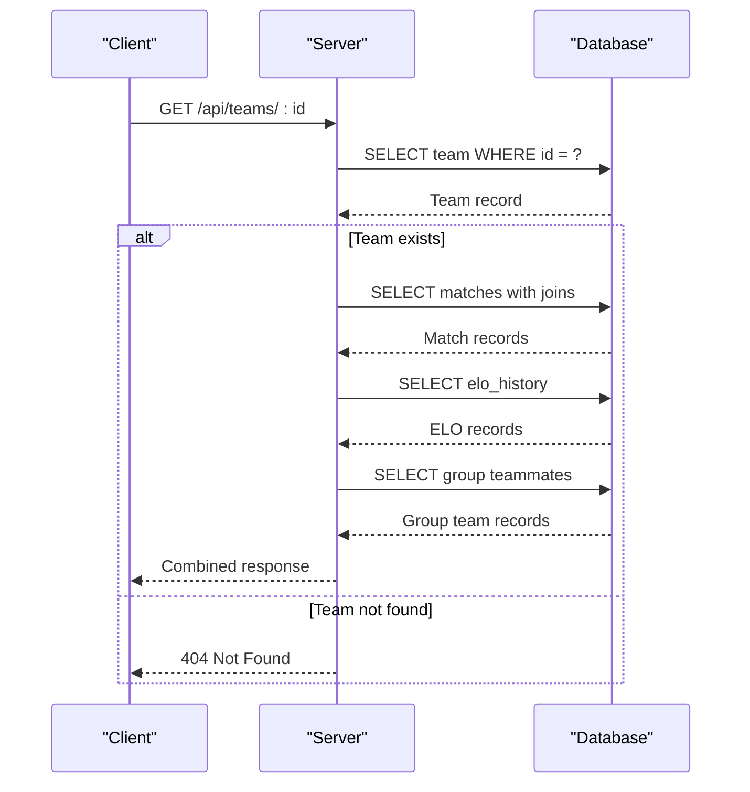
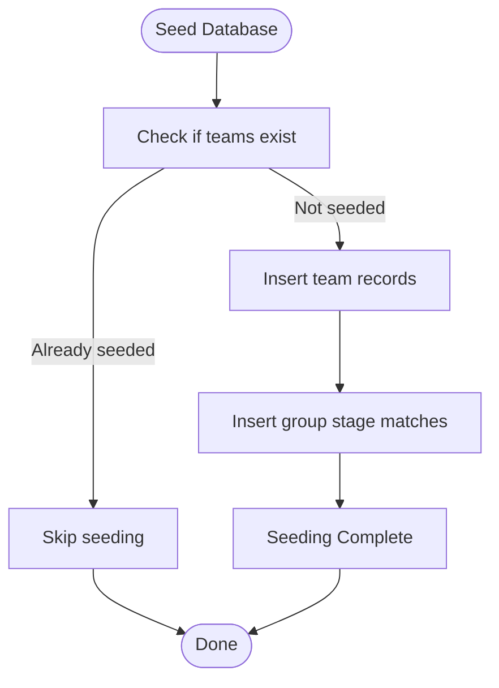
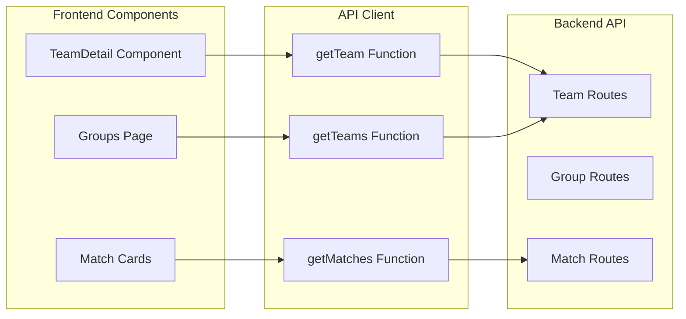
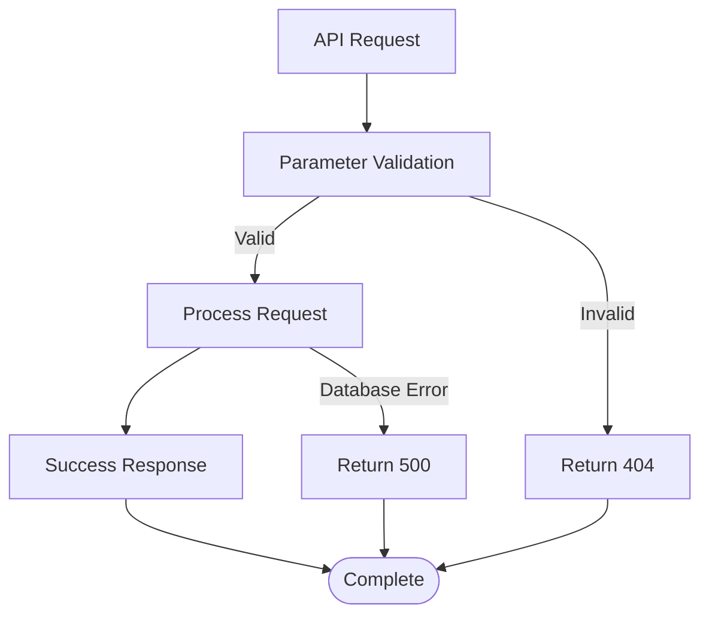

# Team Management API

<cite>
**Referenced Files in This Document**
- [server.js](file://backend/server.js)
- [db.js](file://backend/database/db.js)
- [seed.js](file://backend/database/seed.js)
- [teams.js](file://backend/data/teams.js)
- [client.js](file://frontend/src/api/client.js)
- [TeamDetail.jsx](file://frontend/src/pages/TeamDetail.jsx)
- [analysisService.js](file://backend/services/analysisService.js)
</cite>

## Table of Contents
1. [Introduction](#introduction)
2. [Project Structure](#project-structure)
3. [Core Components](#core-components)
4. [Architecture Overview](#architecture-overview)
5. [Detailed Component Analysis](#detailed-component-analysis)
6. [Dependency Analysis](#dependency-analysis)
7. [Performance Considerations](#performance-considerations)
8. [Troubleshooting Guide](#troubleshooting-guide)
9. [Conclusion](#conclusion)

## Introduction
This document provides comprehensive API documentation for team-related endpoints in the World Cup 2026 Prediction system. The API exposes endpoints for retrieving team information, group standings, and match data with integrated ELO ratings and FIFA rankings. The system combines static team data with dynamic predictions and ELO updates to provide real-time team insights.

## Project Structure
The team management API is implemented within the backend Express server, utilizing a SQLite database with structured team data, match fixtures, and prediction models.



**Diagram sources**
- [server.js:24-75](file://backend/server.js#L24-L75)
- [db.js:23-252](file://backend/database/db.js#L23-L252)

**Section sources**
- [server.js:1-724](file://backend/server.js#L1-L724)
- [db.js:1-252](file://backend/database/db.js#L1-L252)

## Core Components

### Team Data Model
The system maintains comprehensive team information with the following structure:

| Field | Type | Description |
|-------|------|-------------|
| id | TEXT (PK) | 3-letter team identifier |
| name | TEXT | Team name |
| flag | TEXT | Emoji flag representation |
| group_code | TEXT | Group designation (A-L) |
| confederation | TEXT | FIFA confederation |
| fifa_rank | INTEGER | Official FIFA ranking position |
| fifa_points | REAL | FIFA points used as ELO base |
| elo | REAL | Dynamic ELO rating updated after matches |
| avg_scored | REAL | Average goals scored (20-match rolling) |
| avg_conceded | REAL | Average goals conceded (20-match rolling) |
| wc_appearances | INTEGER | World Cup participation count |
| last_wc_round | TEXT | Last World Cup advancement |
| gs_played | INTEGER | Group stage matches played |
| gs_won | INTEGER | Group stage wins |
| gs_drawn | INTEGER | Group stage draws |
| gs_lost | INTEGER | Group stage losses |
| gs_gf | INTEGER | Group stage goals for |
| gs_ga | INTEGER | Group stage goals against |
| gs_pts | INTEGER | Group stage points |
| eliminated | INTEGER | Elimination status indicator |

### Database Schema Relationships


**Diagram sources**
- [db.js:26-131](file://backend/database/db.js#L26-L131)

**Section sources**
- [db.js:23-252](file://backend/database/db.js#L23-L252)
- [teams.js:7-132](file://backend/data/teams.js#L7-L132)

## Architecture Overview

The team management API follows a layered architecture with clear separation between data access, business logic, and presentation layers.



**Diagram sources**
- [server.js:25-75](file://backend/server.js#L25-L75)

**Section sources**
- [server.js:24-75](file://backend/server.js#L24-L75)

## Detailed Component Analysis

### Team Listing Endpoint
The `/api/teams` endpoint provides comprehensive team listings with sophisticated ordering criteria.

#### Request Parameters
- No query parameters required
- Response includes all teams with complete team objects

#### Response Schema
The endpoint returns an array of team objects with the following structure:

| Field | Type | Description |
|-------|------|-------------|
| id | string | Team identifier (3-letter code) |
| name | string | Team name |
| flag | string | Emoji flag |
| group_code | string | Group letter (A-L) |
| confederation | string | FIFA confederation |
| fifa_rank | number | FIFA ranking position |
| fifa_points | number | FIFA points (ELO base) |
| elo | number | Current ELO rating |
| avg_scored | number | Average goals scored |
| avg_conceded | number | Average goals conceded |
| wc_appearances | number | World Cup appearances |
| last_wc_round | string | Last World Cup advancement |
| gs_played | number | Group stage matches played |
| gs_won | number | Group stage wins |
| gs_drawn | number | Group stage draws |
| gs_lost | number | Group stage losses |
| gs_gf | number | Goals for |
| gs_ga | number | Goals against |
| gs_pts | number | Group stage points |
| eliminated | number | Elimination status |

#### Ordering Criteria
Teams are ordered using the following priority:
1. **Group Code**: A, B, C, D, E, F, G, H, I, J, K, L
2. **Group Points**: Descending order (gs_pts)
3. **FIFA Rank**: Ascending order (lower rank = better)

#### Implementation Details


**Diagram sources**
- [server.js:25-36](file://backend/server.js#L25-L36)

**Section sources**
- [server.js:25-36](file://backend/server.js#L25-L36)

### Individual Team Details Endpoint
The `/api/teams/:id` endpoint provides comprehensive team information including statistics, upcoming matches, ELO history, and group teammates.

#### Path Parameters
- `:id` - Team identifier (3-letter code, e.g., "ENG", "FRA")

#### Response Structure
The endpoint returns a combined object containing:

```javascript
{
  team: TeamObject,
  matches: MatchArray,
  eloHistory: EloHistoryArray,
  groupTeams: GroupTeamArray
}
```

#### Team Object Fields
Complete team object with all database fields as described in the data model.

#### Match Join Query
The endpoint performs a complex join query that includes:
- Match details (date, venue, status)
- Home team information (name, flag, ELO)
- Away team information (name, flag, ELO)
- Latest prediction data (probabilities, confidence, most likely score)

#### ELO History Format
ELO history records include:
- `elo_before`: ELO rating before match
- `elo_after`: ELO rating after match
- `opponent_name`: Opponent team name
- `opponent_flag`: Opponent team flag
- `result`: Match result (W/D/L)
- `stage`: Tournament stage
- `recorded_at`: Timestamp of recording

#### Group Teammates
Returns all teams in the same group ordered by:
1. Group points (descending)
2. Goal difference (descending)
3. Goals for (descending)
4. Team name (ascending)

#### Implementation Flow


**Diagram sources**
- [server.js:38-75](file://backend/server.js#L38-L75)

**Section sources**
- [server.js:38-75](file://backend/server.js#L38-L75)

### Team Data Population
The system seeds team data from static sources and initializes ELO ratings.

#### Initial Data Sources
- **Static Teams**: 48 World Cup teams with FIFA rankings
- **Team Statistics**: Historical performance data (20-match rolling averages)
- **Group Fixtures**: Complete match schedule for group stage

#### ELO Initialization
ELO ratings are initialized using FIFA points:
- `elo = fifa_points` (direct conversion)
- Updated dynamically after each match result

#### Seeding Process


**Diagram sources**
- [seed.js:9-66](file://backend/database/seed.js#L9-L66)

**Section sources**
- [seed.js:9-66](file://backend/database/seed.js#L9-L66)
- [teams.js:7-132](file://backend/data/teams.js#L7-L132)

## Dependency Analysis

### Frontend Integration
The frontend integrates with the team API through a dedicated client module.



**Diagram sources**
- [client.js:9-10](file://frontend/src/api/client.js#L9-L10)
- [TeamDetail.jsx:95](file://frontend/src/pages/TeamDetail.jsx#L95)

### Backend Dependencies
The team API depends on several backend services:

| Service | Purpose | Dependencies |
|---------|---------|--------------|
| Database Service | Data persistence | SQLite, node-sqlite3-wasm |
| Prediction Engine | Match predictions | Statistical models |
| Analysis Service | Group calculations | Mathematical algorithms |
| Bracket Service | Tournament progression | Simulation algorithms |

**Section sources**
- [client.js:1-50](file://frontend/src/api/client.js#L1-L50)
- [TeamDetail.jsx:82-117](file://frontend/src/pages/TeamDetail.jsx#L82-L117)

## Performance Considerations

### Database Optimization
- **Indexing Strategy**: Primary keys on teams (id) and matches (id)
- **Query Optimization**: Single-pass queries with JOINs for team details
- **Caching**: Predictions cached with timestamps for performance

### API Response Optimization
- **Selective Field Retrieval**: Only necessary fields returned for team lists
- **Pagination**: Not implemented but could be added for large datasets
- **Compression**: Enable gzip compression for large responses

### Real-time Updates
- **Live Refresh**: Team detail page automatically refreshes during match days
- **Cache Invalidation**: Predictions and ELO updates trigger cache invalidation
- **Background Processing**: Cron jobs handle periodic updates

## Troubleshooting Guide

### Common Issues

#### Invalid Team ID
**Symptoms**: 404 Not Found response
**Cause**: Non-existent team identifier
**Solution**: Verify team ID format (3-letter uppercase)

#### Database Connection Issues
**Symptoms**: Internal server errors
**Cause**: Database lock or corruption
**Solution**: Check database file permissions and integrity

#### Missing Team Data
**Symptoms**: Empty team arrays
**Cause**: Database not seeded
**Solution**: Run seed script: `node database/seed.js`

### Error Handling Implementation


**Diagram sources**
- [server.js:40-41](file://backend/server.js#L40-L41)

**Section sources**
- [server.js:40-41](file://backend/server.js#L40-L41)

## Conclusion

The Team Management API provides comprehensive team information with sophisticated ordering, ELO ratings, and FIFA rankings. The implementation demonstrates robust database design with proper relationships, efficient query patterns, and comprehensive error handling. The system successfully integrates static team data with dynamic predictions and real-time updates, providing a solid foundation for team-centric applications.

The API's design supports both simple team listings and detailed team profiles, making it suitable for various frontend components including team pages, group tables, and match prediction interfaces. The modular architecture ensures maintainability and extensibility for future enhancements.