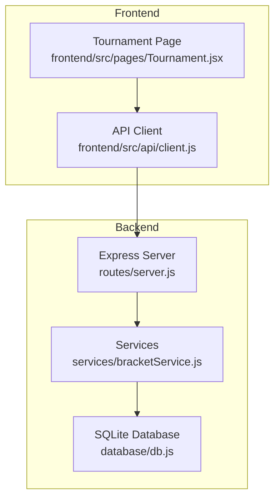
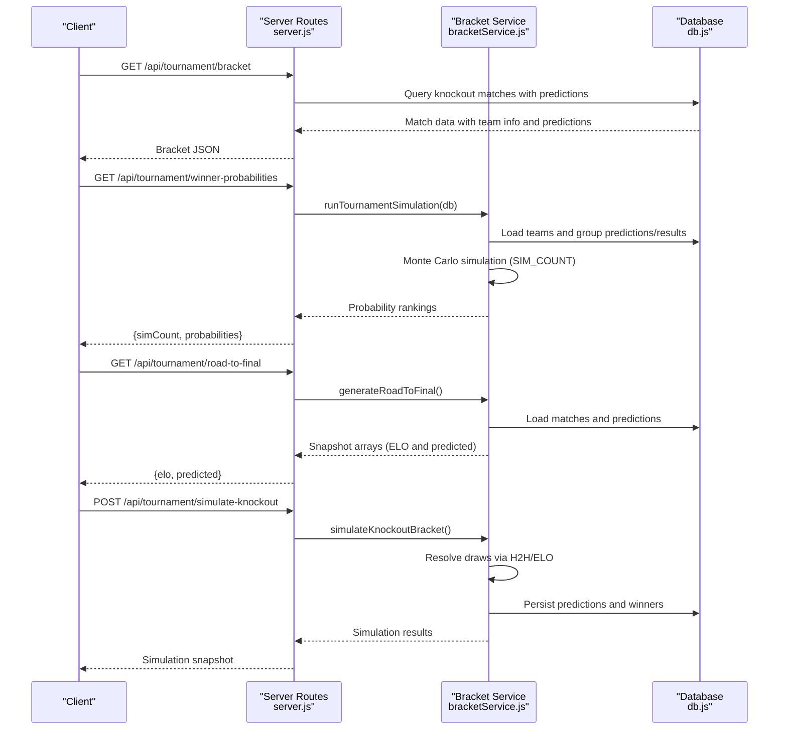
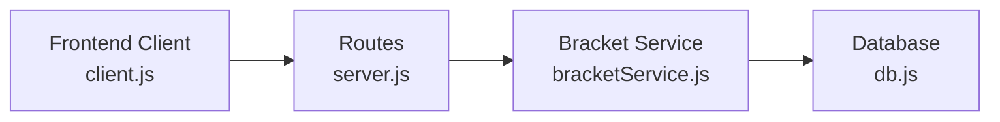

# Tournament API

<cite>
**Referenced Files in This Document**
- [server.js](file://backend/server.js)
- [bracketService.js](file://backend/services/bracketService.js)
- [client.js](file://frontend/src/api/client.js)
- [db.js](file://backend/database/db.js)
- [SPEC.md](file://specs/SPEC.md)
- [World_Cup_2026_Knockout_Bracket.md](file://World_Cup_2026_Knockout_Bracket.md)
</cite>

## Table of Contents
1. [Introduction](#introduction)
2. [Project Structure](#project-structure)
3. [Core Components](#core-components)
4. [Architecture Overview](#architecture-overview)
5. [Detailed Component Analysis](#detailed-component-analysis)
6. [Dependency Analysis](#dependency-analysis)
7. [Performance Considerations](#performance-considerations)
8. [Troubleshooting Guide](#troubleshooting-guide)
9. [Conclusion](#conclusion)

## Introduction
This document provides comprehensive API documentation for tournament bracket and simulation endpoints. It covers:
- GET /api/tournament/bracket for knockout stage matches with team information and predictions
- GET /api/tournament/winner-probabilities for Monte Carlo simulation results showing champion probabilities
- GET /api/tournament/road-to-final for predicted progression through tournament rounds
- POST /api/tournament/simulate-knockout for full bracket simulation with configurable simulation counts

It explains tournament simulation parameters, Monte Carlo methodology, result interpretation, response schemas, simulation cache invalidation, and includes examples of tournament data structures and simulation outputs.

## Project Structure
The tournament APIs are implemented in the backend server and backed by SQLite database storage. Frontend clients consume these endpoints to render bracket views, winner probabilities, and road-to-final snapshots.

**Diagram sources**
- [server.js:463-512](file://backend/server.js#L463-L512)
- [bracketService.js:1067-1079](file://backend/services/bracketService.js#L1067-L1079)
- [client.js:37-44](file://frontend/src/api/client.js#L37-L44)

**Section sources**
- [server.js:1-723](file://backend/server.js#L1-L723)
- [db.js:1-252](file://backend/database/db.js#L1-L252)

## Core Components
- Tournament Bracket Endpoint: Returns knockout-stage matches with team names, flags, and latest predictions.
- Winner Probabilities Endpoint: Executes Monte Carlo simulations to compute champion probability distribution.
- Road-to-Final Endpoint: Generates predicted progression snapshots across tournament rounds.
- Simulate Knockout Endpoint: Runs full bracket simulation using the prediction engine and resolves ties.

Key implementation references:
- Bracket endpoint handler: [server.js:463-482](file://backend/server.js#L463-L482)
- Winner probabilities handler: [server.js:484-489](file://backend/server.js#L484-L489)
- Road-to-Final handler: [server.js:491-499](file://backend/server.js#L491-L499)
- Simulate Knockout handler: [server.js:501-512](file://backend/server.js#L501-L512)
- Bracket service exports: [bracketService.js:1067-1079](file://backend/services/bracketService.js#L1067-L1079)

**Section sources**
- [server.js:463-512](file://backend/server.js#L463-L512)
- [bracketService.js:1067-1079](file://backend/services/bracketService.js#L1067-L1079)

## Architecture Overview
The tournament endpoints integrate with the prediction engine and bracket service to produce deterministic or stochastic outputs depending on the endpoint.

**Diagram sources**
- [server.js:463-512](file://backend/server.js#L463-L512)
- [bracketService.js:852-906](file://backend/services/bracketService.js#L852-L906)
- [bracketService.js:908-1065](file://backend/services/bracketService.js#L908-L1065)
- [bracketService.js:485-704](file://backend/services/bracketService.js#L485-L704)

## Detailed Component Analysis

### GET /api/tournament/bracket
Purpose: Retrieve all knockout stage matches with team information and latest predictions.

Behavior:
- Queries matches from stages other than GROUP.
- Joins team data (names, flags) and latest predictions.
- Returns an array of match objects.

Response Schema:
- Array of match objects with keys:
  - id: Match identifier
  - stage: Knockout stage (e.g., R32, R16, QF, SF, F)
  - scheduled_date, scheduled_time, venue: Match scheduling details
  - status: Current match status
  - home_team, away_team: Team identifiers
  - home_name, away_name: Team names
  - home_flag, away_flag: Team flags
  - prob_home, prob_draw, prob_away: Latest prediction probabilities
  - confidence: Prediction confidence level

Example response structure:
- Each element represents a knockout match with team identities and prediction probabilities.

Implementation reference:
- [server.js:463-482](file://backend/server.js#L463-L482)

**Section sources**
- [server.js:463-482](file://backend/server.js#L463-L482)

### GET /api/tournament/winner-probabilities
Purpose: Compute champion probability distribution using Monte Carlo simulation.

Methodology:
- Loads all teams and builds a prediction map from group stage predictions and completed results.
- Runs SIM_COUNT simulations (default 50,000).
- For each simulation:
  - Simulates all group stage outcomes using Dixon-Coles probabilities or ELO for unknown pairings.
  - Determines group winners/second-placed and best 8 third-place teams.
  - Advances through R32, R16, QF, SF using ELO knockout probabilities.
  - Records champion and increments win counts.
- Normalizes win counts to probabilities and sorts teams.

Response Schema:
- Object with:
  - simCount: Number of simulations performed
  - probabilities: Array of objects with:
    - teamId: Team identifier
    - name: Team name
    - flag: Team flag
    - elo: Team ELO rating
    - probability: Champion probability (0–1)

Simulation Parameters:
- SIM_COUNT: Default 50,000 simulations.
- Cache: Results cached until invalidated by result submission or explicit cache invalidation.

Implementation references:
- [bracketService.js:707-707](file://backend/services/bracketService.js#L707-L707)
- [bracketService.js:852-906](file://backend/services/bracketService.js#L852-L906)
- [server.js:484-489](file://backend/server.js#L484-L489)

**Section sources**
- [bracketService.js:707-707](file://backend/services/bracketService.js#L707-L707)
- [bracketService.js:852-906](file://backend/services/bracketService.js#L852-L906)
- [server.js:484-489](file://backend/server.js#L484-L489)

### GET /api/tournament/road-to-final
Purpose: Provide predicted progression snapshots across tournament rounds.

Approach:
- Builds snapshots for each completed stage and cumulative progress.
- Two models:
  - ELO-based: Uses ELO rankings for group placements and knockout win probabilities.
  - Predicted: Uses Dixon-Coles prediction-based placements for group stage.
- For each stage:
  - If actual: displays real results and winners.
  - Else: predicts winners based on latest predictions or ELO probabilities.
- Orders matches according to display wiring for bracket visuals.

Response Schema:
- Object with:
  - elo: Array of snapshot objects (ELO-based model)
  - predicted: Array of snapshot objects (predicted model)
- Each snapshot includes:
  - id: Snapshot identifier (e.g., pre_tournament, after_round)
  - label: Human-readable label
  - rounds: Array of stage snapshots with:
    - stage: Round identifier (R32, R16, QF, SF, F)
    - label: Human-readable round label
    - isActual: Whether results are factual or predicted
    - matches: Array of match objects with:
      - id: Match identifier
      - home/away: Team objects (id, name, flag, winPct)
      - winner: Predicted/factual winner team object
      - score: Actual score string if available

Implementation references:
- [bracketService.js:908-1065](file://backend/services/bracketService.js#L908-L1065)
- [server.js:491-499](file://backend/server.js#L491-L499)

**Section sources**
- [bracketService.js:908-1065](file://backend/services/bracketService.js#L908-L1065)
- [server.js:491-499](file://backend/server.js#L491-L499)

### POST /api/tournament/simulate-knockout
Purpose: Run a full bracket simulation using the prediction engine and persist results.

Process:
- Validates that all group predictions exist (72 matches).
- Computes predicted group placements using latest predictions or ELO fallback.
- Fills R32 slots with predicted teams and simulates each knockout match:
  - Resolves draws using H2H statistics and ELO as fallback.
  - Advances winners through R16, QF, SF, and places third-place losers.
- Persists predictions and winners to the database.
- Invalidates simulation cache.

Response Schema:
- Object containing:
  - groupStandings: Predicted group placements
  - best8ThirdPlace: Best 8 third-place teams
  - r32Pairings: Verified R32 pairings
  - bracket: Simulation results for each match with probabilities and tiebreakers
  - champion: Winner of the simulated final

Implementation references:
- [bracketService.js:485-704](file://backend/services/bracketService.js#L485-L704)
- [server.js:501-512](file://backend/server.js#L501-L512)

**Section sources**
- [bracketService.js:485-704](file://backend/services/bracketService.js#L485-L704)
- [server.js:501-512](file://backend/server.js#L501-L512)

### Simulation Cache Invalidation
- Winner probabilities endpoint caches results in memory.
- Cache is invalidated when:
  - A match result is submitted via POST /api/matches/:id/result
  - The system performs a manual sync via POST /api/sync
- This ensures subsequent calls to winner probabilities and road-to-final reflect updated data.

Implementation references:
- Cache invalidation function: [bracketService.js:711-713](file://backend/services/bracketService.js#L711-L713)
- Result submission route: [server.js:282-302](file://backend/server.js#L282-L302)
- Sync route: [server.js:574-582](file://backend/server.js#L574-L582)

**Section sources**
- [bracketService.js:711-713](file://backend/services/bracketService.js#L711-L713)
- [server.js:282-302](file://backend/server.js#L282-L302)
- [server.js:574-582](file://backend/server.js#L574-L582)

### Tournament Data Structures and Examples
- Knockout Bracket Structure: The bracket follows fixed FIFA 2026 pairings across R32, R16, QF, SF, and Final. See [World_Cup_2026_Knockout_Bracket.md:1-51](file://World_Cup_2026_Knockout_Bracket.md#L1-L51) for the official bracket and schedule.
- Database Schema: The matches table stores stage, status, teams, scores, and winner. See [db.js:51-70](file://backend/database/db.js#L51-L70).
- Frontend Consumption: The frontend client exposes helpers for these endpoints. See [client.js:37-44](file://frontend/src/api/client.js#L37-L44).

**Section sources**
- [World_Cup_2026_Knockout_Bracket.md:1-51](file://World_Cup_2026_Knockout_Bracket.md#L1-L51)
- [db.js:51-70](file://backend/database/db.js#L51-L70)
- [client.js:37-44](file://frontend/src/api/client.js#L37-L44)

## Dependency Analysis
The tournament endpoints depend on the bracket service and database layer. The server routes orchestrate calls to the service functions and handle caching invalidation.

**Diagram sources**
- [server.js:463-512](file://backend/server.js#L463-L512)
- [bracketService.js:1067-1079](file://backend/services/bracketService.js#L1067-L1079)
- [client.js:37-44](file://frontend/src/api/client.js#L37-L44)

**Section sources**
- [server.js:463-512](file://backend/server.js#L463-L512)
- [bracketService.js:1067-1079](file://backend/services/bracketService.js#L1067-L1079)
- [client.js:37-44](file://frontend/src/api/client.js#L37-L44)

## Performance Considerations
- Monte Carlo simulations (SIM_COUNT) scale linearly with computational cost. Adjust SIM_COUNT judiciously for responsiveness versus accuracy.
- Winner probabilities cache avoids repeated computation; ensure cache invalidation occurs after significant data changes.
- Road-to-Final snapshots are computed on demand; consider caching for frequent access patterns.
- Database queries for bracket and predictions are straightforward; ensure proper indexing on match stage and team references.

## Troubleshooting Guide
Common issues and resolutions:
- Missing group predictions: The simulate-knockout endpoint requires all 72 group predictions to be generated before running the bracket simulation.
- Empty or stale winner probabilities: Verify cache invalidation after result submissions or sync operations.
- Incomplete bracket data: Confirm that knockout stubs are initialized and that team assignments are correct.

Relevant references:
- Simulation prerequisites: [bracketService.js:521-526](file://backend/services/bracketService.js#L521-L526)
- Cache invalidation: [bracketService.js:711-713](file://backend/services/bracketService.js#L711-L713)
- Route handlers: [server.js:463-512](file://backend/server.js#L463-L512)

**Section sources**
- [bracketService.js:521-526](file://backend/services/bracketService.js#L521-L526)
- [bracketService.js:711-713](file://backend/services/bracketService.js#L711-L713)
- [server.js:463-512](file://backend/server.js#L463-L512)

## Conclusion
The tournament API suite provides robust endpoints for viewing knockout brackets, computing champion probabilities via Monte Carlo simulation, visualizing predicted progression through the competition, and running full bracket simulations. Proper cache invalidation and understanding of simulation parameters ensure accurate and timely results for consumers.