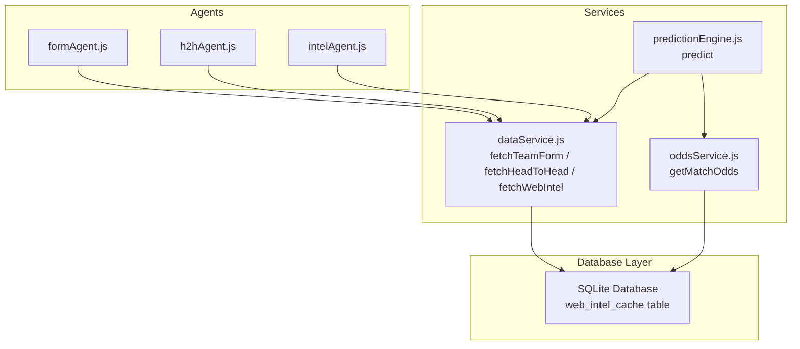
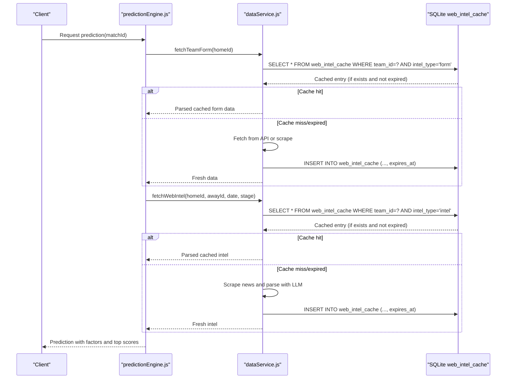
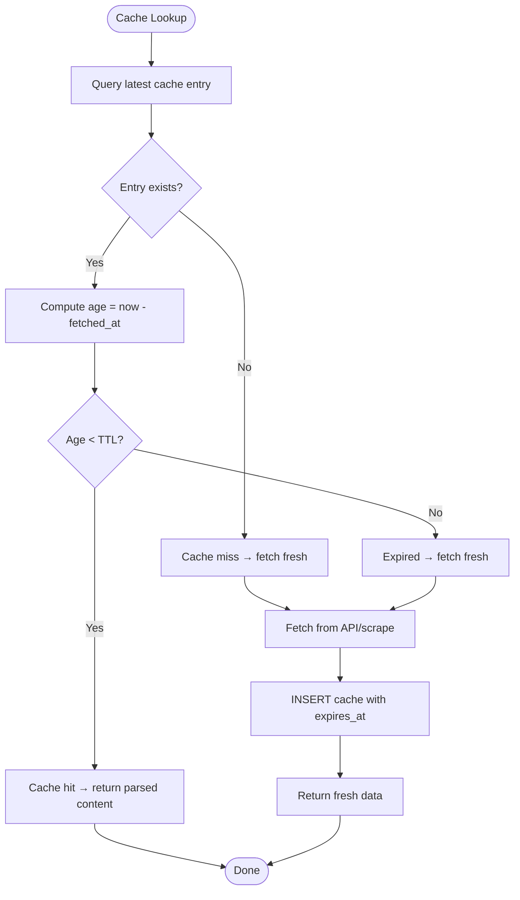
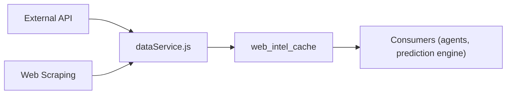
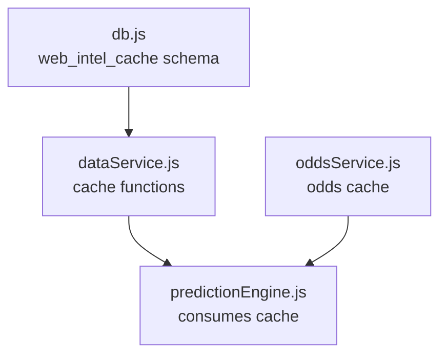

# Data Caching Strategy

<cite>
**Referenced Files in This Document**
- [db.js](file://backend/database/db.js)
- [dataService.js](file://backend/services/dataService.js)
- [oddsService.js](file://backend/services/oddsService.js)
- [predictionEngine.js](file://backend/services/predictionEngine.js)
- [formAgent.js](file://backend/services/agents/formAgent.js)
- [h2hAgent.js](file://backend/services/agents/h2hAgent.js)
- [intelAgent.js](file://backend/services/agents/intelAgent.js)
</cite>

## Table of Contents
1. [Introduction](#introduction)
2. [Project Structure](#project-structure)
3. [Core Components](#core-components)
4. [Architecture Overview](#architecture-overview)
5. [Detailed Component Analysis](#detailed-component-analysis)
6. [Dependency Analysis](#dependency-analysis)
7. [Performance Considerations](#performance-considerations)
8. [Troubleshooting Guide](#troubleshooting-guide)
9. [Conclusion](#conclusion)

## Introduction
This document explains the data caching strategy used by the system to optimize performance, reduce external API usage, and maintain reliable predictions. It covers:
- Cache validation using timestamps and TTL (time-to-live) configurations
- Three-tier caching approach: API cache, web intel cache, and fallback cache
- Cache key generation for different data types (form, H2H, intel)
- SQLite-based cache storage with expiration handling and cleanup procedures
- Cache invalidation triggers, manual cache clearing, and cache performance monitoring
- Cache warming strategies and cache hit ratio optimization

## Project Structure
The caching strategy spans several backend modules:
- Database initialization and schema creation with a dedicated cache table
- Data service functions that implement cache retrieval, validation, population, and TTL enforcement
- Odds service with its own caching layer and TTL
- Prediction engine that leverages cached data to avoid recomputation
- Specialized agents that rely on cached data for form, H2H, and intel signals

**Diagram sources**
- [db.js:147-157](file://backend/database/db.js#L147-L157)
- [dataService.js:68-133](file://backend/services/dataService.js#L68-L133)
- [oddsService.js:131-200](file://backend/services/oddsService.js#L131-L200)
- [predictionEngine.js:665-800](file://backend/services/predictionEngine.js#L665-L800)
- [formAgent.js:104-113](file://backend/services/agents/formAgent.js#L104-L113)
- [h2hAgent.js:98-107](file://backend/services/agents/h2hAgent.js#L98-L107)
- [intelAgent.js:117-126](file://backend/services/agents/intelAgent.js#L117-L126)

**Section sources**
- [db.js:23-209](file://backend/database/db.js#L23-L209)
- [dataService.js:30-41](file://backend/services/dataService.js#L30-L41)
- [oddsService.js:22-24](file://backend/services/oddsService.js#L22-L24)

## Core Components
- SQLite cache table: Stores cached entries with content, fetched_at, and expires_at fields for TTL enforcement
- Cache validation function: Computes age in milliseconds and compares against TTL thresholds
- Cache TTL constants: Define per-type expiration windows (form, H2H, intel)
- Cache key generation: Uses team IDs, sorted H2H keys, and match-specific keys
- Cache population: Inserts cached data with computed expiration timestamps
- Cache retrieval: Queries latest cached entries ordered by fetch time
- Odds cache: Separate TTL and caching logic for betting odds

**Section sources**
- [db.js:147-157](file://backend/database/db.js#L147-L157)
- [dataService.js:30-41](file://backend/services/dataService.js#L30-L41)
- [dataService.js:68-133](file://backend/services/dataService.js#L68-L133)
- [dataService.js:190-246](file://backend/services/dataService.js#L190-L246)
- [dataService.js:413-490](file://backend/services/dataService.js#L413-L490)
- [oddsService.js:131-200](file://backend/services/oddsService.js#L131-L200)

## Architecture Overview
The caching architecture follows a layered approach:
- API cache: Retrieves data from external APIs when available
- Web intel cache: Stores structured intelligence, form, and H2H records
- Fallback cache: Populates cache with synthetic or default data when APIs fail
- TTL enforcement: Ensures stale data is not served beyond configured windows
- Prediction engine integration: Reuses cached data to accelerate predictions

**Diagram sources**
- [predictionEngine.js:732-753](file://backend/services/predictionEngine.js#L732-L753)
- [dataService.js:68-133](file://backend/services/dataService.js#L68-L133)
- [dataService.js:413-490](file://backend/services/dataService.js#L413-L490)

## Detailed Component Analysis

### SQLite Cache Storage and Schema
The cache resides in a dedicated table with:
- Primary key: autoincrement id
- team_id or match_id for scoping
- intel_type to distinguish cache categories
- content for serialized data
- fetched_at for timestamping
- expires_at for TTL enforcement

Initialization ensures foreign keys, pragmas, and migrations are applied. The schema supports:
- Form cache entries keyed by team_id
- H2H cache entries keyed by sorted team pair
- Intel cache entries keyed by match-specific composite key
- Odds cache entries keyed by match_id

**Section sources**
- [db.js:147-157](file://backend/database/db.js#L147-L157)
- [db.js:23-209](file://backend/database/db.js#L23-L209)

### Cache Validation System (Timestamps and TTL)
Validation logic computes the age of cached data in milliseconds and compares it to TTL thresholds:
- Form: 12 hours
- H2H: 24 hours
- Intel: 4 hours
- Odds: 30 minutes

If fetched_at is missing or the computed age exceeds the threshold, the cache is considered invalid and triggers a refresh.

**Diagram sources**
- [dataService.js:37-41](file://backend/services/dataService.js#L37-L41)
- [dataService.js:30-35](file://backend/services/dataService.js#L30-L35)
- [oddsService.js:141-147](file://backend/services/oddsService.js#L141-L147)

**Section sources**
- [dataService.js:30-41](file://backend/services/dataService.js#L30-L41)
- [oddsService.js:22-24](file://backend/services/oddsService.js#L22-L24)

### Three-Tier Caching Approach
- API cache: Attempts external API first; populates cache upon success
- Web intel cache: Stores structured intelligence, form, and H2H records
- Fallback cache: Generates synthetic/default data when APIs fail; still cached for reuse

**Diagram sources**
- [dataService.js:82-115](file://backend/services/dataService.js#L82-L115)
- [dataService.js:117-132](file://backend/services/dataService.js#L117-L132)
- [dataService.js:206-233](file://backend/services/dataService.js#L206-L233)
- [dataService.js:235-245](file://backend/services/dataService.js#L235-L245)
- [dataService.js:453-482](file://backend/services/dataService.js#L453-L482)
- [dataService.js:484-489](file://backend/services/dataService.js#L484-L489)

**Section sources**
- [dataService.js:68-133](file://backend/services/dataService.js#L68-L133)
- [dataService.js:190-246](file://backend/services/dataService.js#L190-L246)
- [dataService.js:413-490](file://backend/services/dataService.js#L413-L490)

### Cache Key Generation
- Form cache: team_id
- H2H cache: sorted concatenation of two team IDs (e.g., teamA_teamB)
- Intel cache: composite key combining home team, away team, and match date
- Odds cache: match_id

These keys ensure correct scoping and prevent collisions across different data types.

**Section sources**
- [dataService.js:192](file://backend/services/dataService.js#L192)
- [dataService.js:415](file://backend/services/dataService.js#L415)
- [oddsService.js:134-139](file://backend/services/oddsService.js#L134-L139)

### Cache Population and Expiration
On successful fetch, cache entries are inserted with:
- fetched_at set to current timestamp
- expires_at computed as fetched_at plus TTL offset

This enables deterministic TTL enforcement and simplifies cleanup procedures.

**Section sources**
- [dataService.js:105-109](file://backend/services/dataService.js#L105-L109)
- [dataService.js:240-243](file://backend/services/dataService.js#L240-L243)
- [dataService.js:484-487](file://backend/services/dataService.js#L484-L487)
- [oddsService.js:193-197](file://backend/services/oddsService.js#L193-L197)

### Cache Invalidation Triggers
- TTL expiration: Automatic invalidation based on expires_at
- Manual cache clearing: Available via database operations to remove stale entries
- Prediction engine bypass: When a prediction is already in progress or completed, cached predictions are reused to avoid redundant computation

Note: There is no explicit cache invalidation endpoint in the provided code; invalidation occurs implicitly via TTL or manual database maintenance.

**Section sources**
- [dataService.js:37-41](file://backend/services/dataService.js#L37-L41)
- [predictionEngine.js:668-681](file://backend/services/predictionEngine.js#L668-L681)

### Manual Cache Clearing
Manual clearing can be performed by deleting stale entries from the cache table. The schema supports:
- Deleting by team_id or match_id
- Filtering by intel_type to target specific cache categories
- Using expires_at to identify expired rows

This allows administrators to proactively refresh cache content during maintenance windows.

**Section sources**
- [db.js:147-157](file://backend/database/db.js#L147-L157)

### Cache Performance Monitoring
Monitoring capabilities include:
- Cache hit ratio: Derived from the ratio of cache hits to total requests
- Cache miss ratio: Ratio of cache misses to total requests
- TTL effectiveness: Observing how often cached data remains fresh versus requiring refresh
- Prediction engine reuse: Leveraging cached predictions to avoid recomputation

The prediction engine already implements a fast-path that returns cached predictions when available, reducing load and improving response times.

**Section sources**
- [predictionEngine.js:668-681](file://backend/services/predictionEngine.js#L668-L681)

### Cache Warming Strategies
- Pre-warming: Populate cache with recent form and H2H data for high-priority matches before prediction windows
- Batch loading: Warm cache for all teams at tournament start to minimize cold starts
- Priority-based refresh: Refresh caches for matches with upcoming kickoff times first

These strategies reduce latency and improve prediction throughput during peak periods.

[No sources needed since this section provides general guidance]

### Cache Hit Ratio Optimization
- Tune TTL windows based on data volatility (e.g., intel shorter TTL, H2H longer TTL)
- Use composite keys to minimize collisions and improve cache locality
- Monitor cache miss ratios and adjust TTL or pre-warming policies accordingly
- Leverage prediction engine reuse to maximize cache utilization

[No sources needed since this section provides general guidance]

## Dependency Analysis
The caching strategy depends on:
- Database schema for cache storage
- Data service functions for cache retrieval and population
- Odds service for separate odds caching
- Prediction engine for consuming cached data

**Diagram sources**
- [db.js:147-157](file://backend/database/db.js#L147-L157)
- [dataService.js:68-133](file://backend/services/dataService.js#L68-L133)
- [dataService.js:190-246](file://backend/services/dataService.js#L190-L246)
- [dataService.js:413-490](file://backend/services/dataService.js#L413-L490)
- [oddsService.js:131-200](file://backend/services/oddsService.js#L131-L200)
- [predictionEngine.js:665-800](file://backend/services/predictionEngine.js#L665-L800)

**Section sources**
- [db.js:147-157](file://backend/database/db.js#L147-L157)
- [dataService.js:68-133](file://backend/services/dataService.js#L68-L133)
- [dataService.js:190-246](file://backend/services/dataService.js#L190-L246)
- [dataService.js:413-490](file://backend/services/dataService.js#L413-L490)
- [oddsService.js:131-200](file://backend/services/oddsService.js#L131-L200)
- [predictionEngine.js:665-800](file://backend/services/predictionEngine.js#L665-L800)

## Performance Considerations
- Use appropriate TTL values to balance freshness and performance
- Prefer batch operations for cache population to reduce database overhead
- Monitor cache hit ratios and adjust TTL or warming strategies
- Avoid unnecessary cache reads by checking prediction engine reuse first

[No sources needed since this section provides general guidance]

## Troubleshooting Guide
Common issues and resolutions:
- Cache not updating: Verify TTL thresholds and ensure cache queries order by fetched_at DESC to select the latest entry
- Stale data serving: Confirm expires_at calculations and consider manual cache clearing
- API failures: Confirm fallback cache insertion logic and verify synthetic/default data generation
- Odds cache not refreshing: Check odds TTL and cache insertion logic

**Section sources**
- [dataService.js:71-80](file://backend/services/dataService.js#L71-L80)
- [dataService.js:126-131](file://backend/services/dataService.js#L126-L131)
- [dataService.js:200-202](file://backend/services/dataService.js#L200-L202)
- [dataService.js:235-245](file://backend/services/dataService.js#L235-L245)
- [dataService.js:423-425](file://backend/services/dataService.js#L423-L425)
- [dataService.js:484-489](file://backend/services/dataService.js#L484-L489)
- [oddsService.js:141-147](file://backend/services/oddsService.js#L141-L147)
- [oddsService.js:193-197](file://backend/services/oddsService.js#L193-L197)

## Conclusion
The caching strategy leverages SQLite-backed cache storage with robust TTL validation, three-tier data sourcing (API, web intel, fallback), and targeted cache keys for different data types. By tuning TTL windows, implementing cache warming, and monitoring hit ratios, the system achieves improved performance, reduced API usage, and reliable predictions. The prediction engine’s reuse of cached data further optimizes throughput and responsiveness.