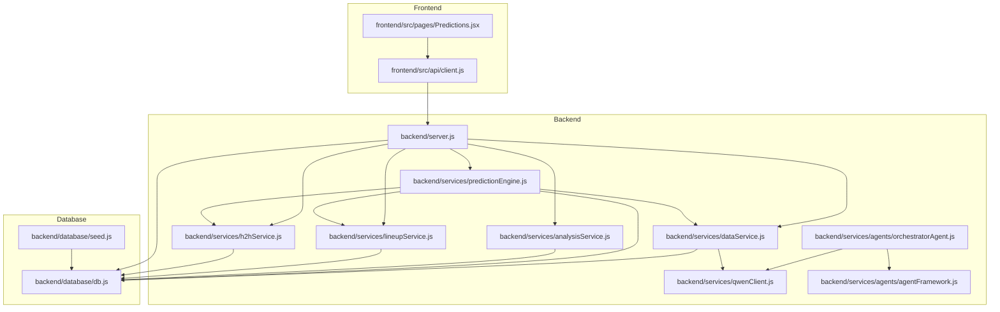
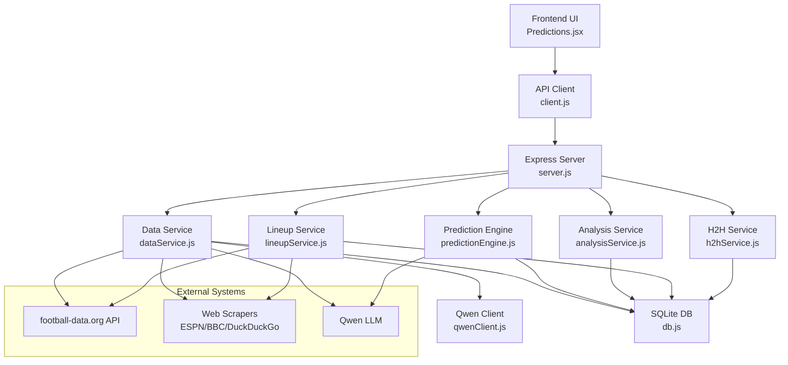
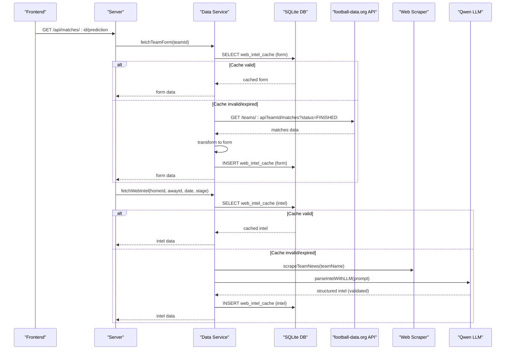
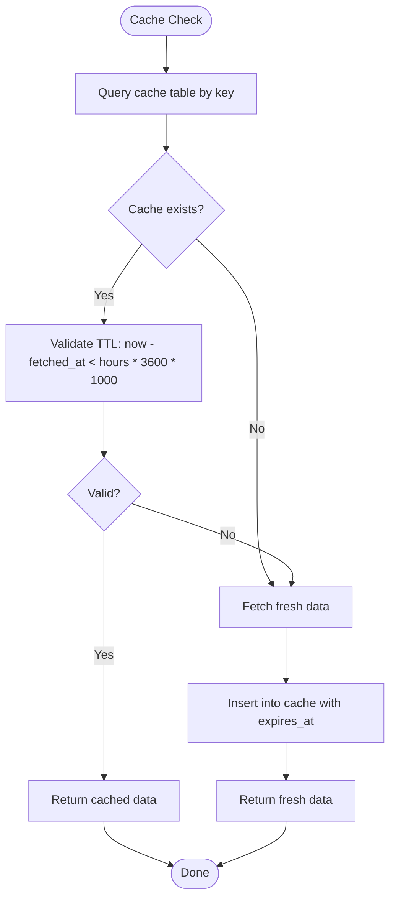
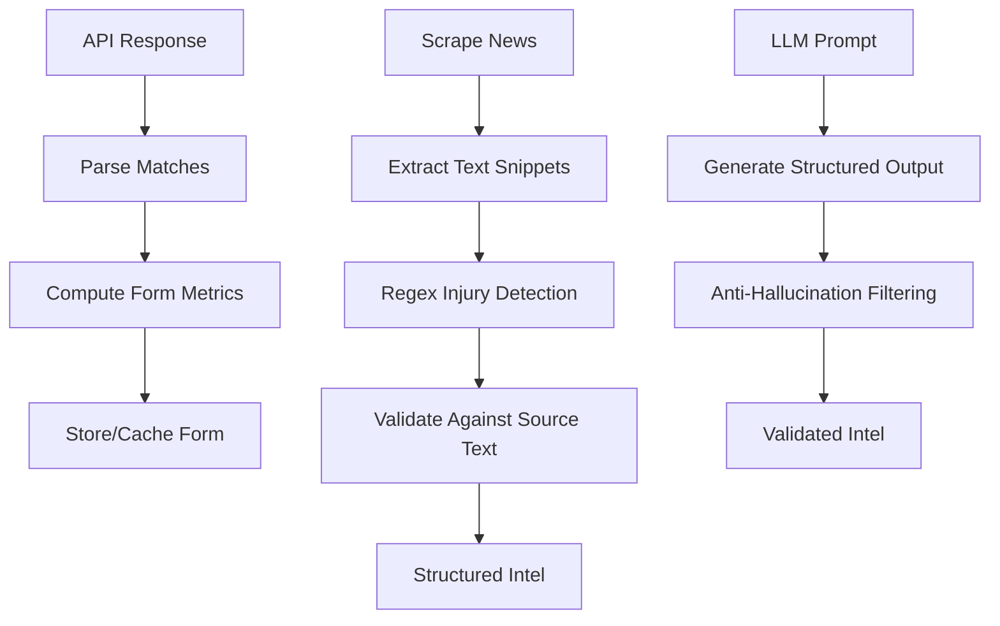
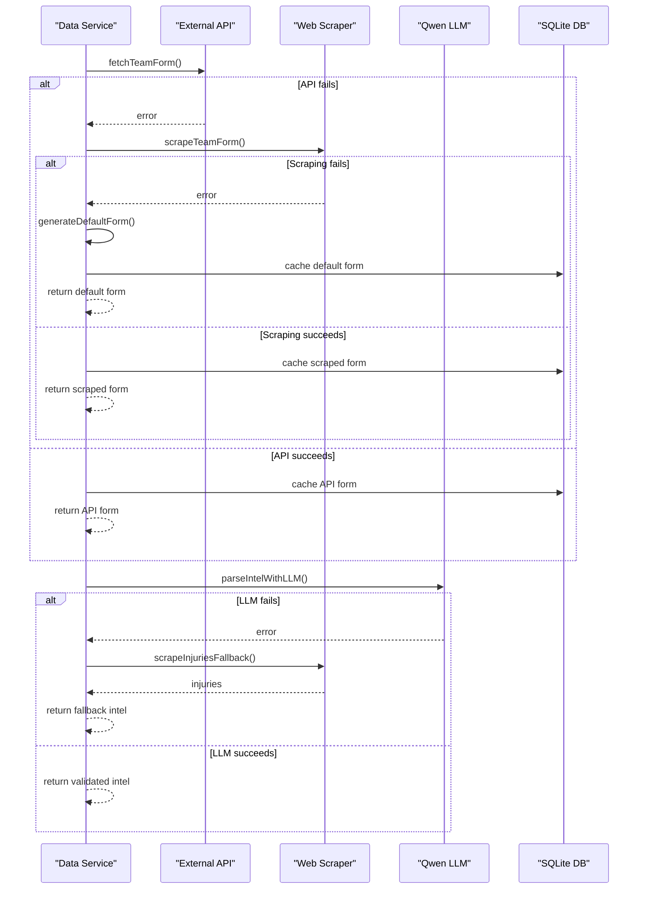
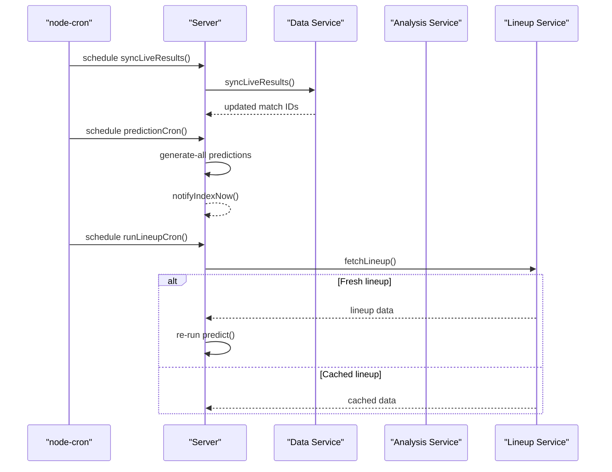
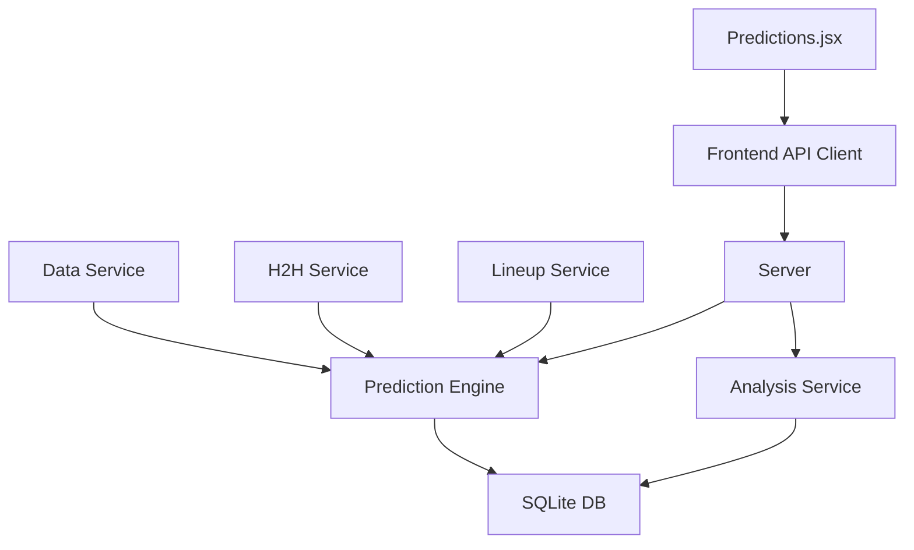
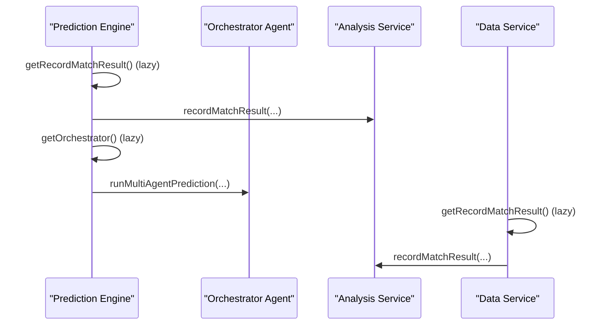
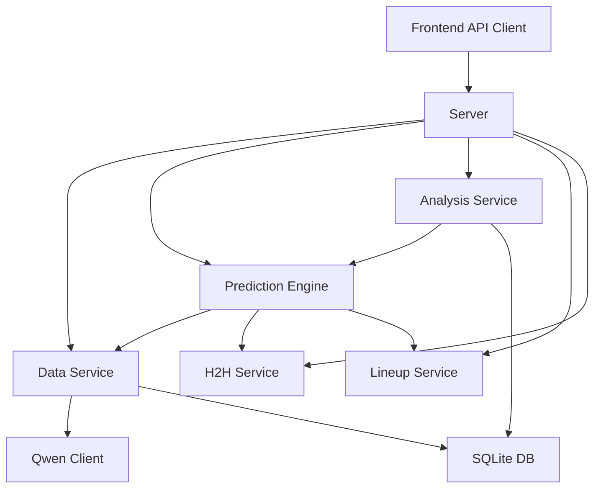

# Data Processing Pipeline

<cite>
**Referenced Files in This Document**
- [backend/services/dataService.js](file://backend/services/dataService.js)
- [backend/database/db.js](file://backend/database/db.js)
- [backend/services/predictionEngine.js](file://backend/services/predictionEngine.js)
- [backend/services/analysisService.js](file://backend/services/analysisService.js)
- [backend/services/qwenClient.js](file://backend/services/qwenClient.js)
- [backend/services/agents/orchestratorAgent.js](file://backend/services/agents/orchestratorAgent.js)
- [backend/services/agents/agentFramework.js](file://backend/services/agents/agentFramework.js)
- [backend/services/lineupService.js](file://backend/services/lineupService.js)
- [backend/services/h2hService.js](file://backend/services/h2hService.js)
- [backend/server.js](file://backend/server.js)
- [frontend/src/api/client.js](file://frontend/src/api/client.js)
- [frontend/src/pages/Predictions.jsx](file://frontend/src/pages/Predictions.jsx)
- [backend/database/seed.js](file://backend/database/seed.js)
</cite>

## Table of Contents
1. [Introduction](#introduction)
2. [Project Structure](#project-structure)
3. [Core Components](#core-components)
4. [Architecture Overview](#architecture-overview)
5. [Detailed Component Analysis](#detailed-component-analysis)
6. [Dependency Analysis](#dependency-analysis)
7. [Performance Considerations](#performance-considerations)
8. [Troubleshooting Guide](#troubleshooting-guide)
9. [Conclusion](#conclusion)

## Introduction
This document describes the comprehensive data processing pipeline that powers the World Cup 2026 prediction system. It covers data validation, transformation, caching, and error handling across all data services. The pipeline integrates external APIs, web scraping, AI-driven content validation, and structured database storage. It also documents cache management with TTL-based expiration, cache validation functions, and database storage patterns. The document explains data transformation workflows for API responses, web scraping extraction, and AI-generated content validation, along with robust error handling strategies, fallback mechanisms, retry logic, and graceful degradation patterns. Finally, it details data freshness policies, update frequencies, consistency guarantees, integration patterns with the prediction engine, user interface components, and analysis services, including circular dependency management, lazy loading strategies, and performance optimization techniques.

## Project Structure
The system is organized into backend services, database schema, and frontend components:
- Backend services encapsulate data fetching, transformation, AI integration, and orchestration.
- Database schema defines tables for teams, matches, predictions, model performance, agent sessions, and caching.
- Frontend components consume the backend API and render predictions and analytics.

**Diagram sources**
- [backend/server.js:1-723](file://backend/server.js#L1-L723)
- [backend/services/dataService.js:1-602](file://backend/services/dataService.js#L1-L602)
- [backend/services/predictionEngine.js:1-800](file://backend/services/predictionEngine.js#L1-L800)
- [backend/services/analysisService.js:1-422](file://backend/services/analysisService.js#L1-L422)
- [backend/services/qwenClient.js:1-123](file://backend/services/qwenClient.js#L1-L123)
- [backend/services/agents/orchestratorAgent.js:1-502](file://backend/services/agents/orchestratorAgent.js#L1-L502)
- [backend/services/agents/agentFramework.js:1-586](file://backend/services/agents/agentFramework.js#L1-L586)
- [backend/services/lineupService.js:1-425](file://backend/services/lineupService.js#L1-L425)
- [backend/services/h2hService.js:1-315](file://backend/services/h2hService.js#L1-L315)
- [backend/database/db.js:1-252](file://backend/database/db.js#L1-L252)
- [backend/database/seed.js:1-69](file://backend/database/seed.js#L1-L69)
- [frontend/src/api/client.js:1-50](file://frontend/src/api/client.js#L1-L50)
- [frontend/src/pages/Predictions.jsx:1-532](file://frontend/src/pages/Predictions.jsx#L1-L532)

**Section sources**
- [backend/server.js:1-723](file://backend/server.js#L1-L723)
- [backend/database/db.js:1-252](file://backend/database/db.js#L1-L252)

## Core Components
- Data Service: Fetches team form, head-to-head records, and web intelligence; validates caches and performs AI-driven content parsing with anti-hallucination checks; synchronizes live results.
- Prediction Engine: Implements a Dixon-Coles bivariate Poisson backbone with log-pool blending, venue effects, and multi-agent orchestration.
- Analysis Service: Records match results, computes Brier scores, updates model performance, recalculates group standings, and generates insights.
- Qwen Client: Provides a robust LLM client with retry logic and temperature calibration.
- Agent Framework: Manages multi-agent sessions, conflict detection, negotiation, and final output synthesis.
- Lineup Service: Retrieves confirmed starting XI from multiple sources, computes strength metrics, and detects key absences.
- H2H Service: Loads and maintains a historical head-to-head dataset, enriching with competition weights and recency.
- Database Layer: Defines schema, manages migrations, and provides caching tables for web intelligence and lineups.
- Frontend API Client: Wraps HTTP requests to the backend API with configurable base URLs and query parameters.
- Server: Exposes REST endpoints, schedules periodic jobs, and coordinates data flows.

**Section sources**
- [backend/services/dataService.js:1-602](file://backend/services/dataService.js#L1-L602)
- [backend/services/predictionEngine.js:1-800](file://backend/services/predictionEngine.js#L1-L800)
- [backend/services/analysisService.js:1-422](file://backend/services/analysisService.js#L1-L422)
- [backend/services/qwenClient.js:1-123](file://backend/services/qwenClient.js#L1-L123)
- [backend/services/agents/orchestratorAgent.js:1-502](file://backend/services/agents/orchestratorAgent.js#L1-L502)
- [backend/services/agents/agentFramework.js:1-586](file://backend/services/agents/agentFramework.js#L1-L586)
- [backend/services/lineupService.js:1-425](file://backend/services/lineupService.js#L1-L425)
- [backend/services/h2hService.js:1-315](file://backend/services/h2hService.js#L1-L315)
- [backend/database/db.js:1-252](file://backend/database/db.js#L1-L252)
- [frontend/src/api/client.js:1-50](file://frontend/src/api/client.js#L1-L50)
- [backend/server.js:1-723](file://backend/server.js#L1-L723)

## Architecture Overview
The pipeline follows a layered architecture:
- Presentation Layer: Frontend components request predictions and analytics via the API client.
- API Layer: Express routes expose endpoints for teams, matches, predictions, lineups, H2H, analytics, and synchronization.
- Service Layer: Data, prediction, analysis, agent, lineup, and H2H services encapsulate business logic.
- Data Access Layer: SQLite database with migrations and caching tables.
- External Integrations: Football-data.org API, web scraping, and Qwen LLM.

**Diagram sources**
- [frontend/src/pages/Predictions.jsx:1-532](file://frontend/src/pages/Predictions.jsx#L1-L532)
- [frontend/src/api/client.js:1-50](file://frontend/src/api/client.js#L1-L50)
- [backend/server.js:1-723](file://backend/server.js#L1-L723)
- [backend/services/dataService.js:1-602](file://backend/services/dataService.js#L1-L602)
- [backend/services/predictionEngine.js:1-800](file://backend/services/predictionEngine.js#L1-L800)
- [backend/services/analysisService.js:1-422](file://backend/services/analysisService.js#L1-L422)
- [backend/services/lineupService.js:1-425](file://backend/services/lineupService.js#L1-L425)
- [backend/services/h2hService.js:1-315](file://backend/services/h2hService.js#L1-L315)
- [backend/services/qwenClient.js:1-123](file://backend/services/qwenClient.js#L1-L123)
- [backend/database/db.js:1-252](file://backend/database/db.js#L1-L252)

## Detailed Component Analysis

### Data Service: Validation, Transformation, Caching, and Error Handling
The Data Service orchestrates fetching and caching of team form, head-to-head records, and web intelligence. It implements:
- Cache validation with TTL-based expiration for form, H2H, and intelligence data.
- Fallback strategies: API-first with web scraping fallback for team form; LLM parsing with regex fallback for injuries.
- AI-driven content validation: Anti-hallucination filtering ensures only validated injuries are returned.
- Live result synchronization with API and database updates.

**Diagram sources**
- [backend/services/dataService.js:68-133](file://backend/services/dataService.js#L68-L133)
- [backend/services/dataService.js:432-509](file://backend/services/dataService.js#L432-L509)
- [backend/database/db.js:147-157](file://backend/database/db.js#L147-L157)
- [backend/server.js:326-341](file://backend/server.js#L326-L341)

**Section sources**
- [backend/services/dataService.js:30-602](file://backend/services/dataService.js#L30-L602)
- [backend/database/db.js:147-157](file://backend/database/db.js#L147-L157)

### Cache Management System: TTL, Validation, and Storage Patterns
Cache management is implemented with:
- TTL constants for different intel types (form, H2H, intel).
- Cache validation function comparing fetched_at timestamps with TTL thresholds.
- Dedicated cache tables for web intelligence and lineups with expiry fields.
- Insertion of cached data with computed expiry timestamps.

**Diagram sources**
- [backend/services/dataService.js:30-41](file://backend/services/dataService.js#L30-L41)
- [backend/database/db.js:147-157](file://backend/database/db.js#L147-L157)

**Section sources**
- [backend/services/dataService.js:30-41](file://backend/services/dataService.js#L30-L41)
- [backend/database/db.js:147-157](file://backend/database/db.js#L147-L157)

### Data Transformation Workflows: API Parsing, Scraping, and AI Validation
Transformation occurs across three primary workflows:
- API response parsing: Extracts match results, transforms to standardized form, and computes recent form metrics.
- Web scraping extraction: Parses HTML/XML feeds to extract team news and injuries, with regex fallbacks.
- AI-generated content validation: Structured JSON parsing with anti-hallucination filtering to ensure only validated claims are retained.

**Diagram sources**
- [backend/services/dataService.js:86-103](file://backend/services/dataService.js#L86-L103)
- [backend/services/dataService.js:135-169](file://backend/services/dataService.js#L135-L169)
- [backend/services/dataService.js:313-399](file://backend/services/dataService.js#L313-L399)

**Section sources**
- [backend/services/dataService.js:86-103](file://backend/services/dataService.js#L86-L103)
- [backend/services/dataService.js:135-169](file://backend/services/dataService.js#L135-L169)
- [backend/services/dataService.js:313-399](file://backend/services/dataService.js#L313-L399)

### Error Handling Strategies: Fallbacks, Retry Logic, and Graceful Degradation
Robust error handling is implemented across services:
- API failures: Attempt fallback scraping or default synthetic data generation.
- LLM failures: Fallback to regex-based injury extraction; if both fail, return minimal intel with llmParsed=false.
- Network timeouts and 5xx errors: Qwen client implements retry logic with exponential backoff.
- Graceful degradation: Prediction engine continues with available signals; missing data results in neutral probabilities.

**Diagram sources**
- [backend/services/dataService.js:112-133](file://backend/services/dataService.js#L112-L133)
- [backend/services/dataService.js:478-501](file://backend/services/dataService.js#L478-L501)
- [backend/services/qwenClient.js:67-101](file://backend/services/qwenClient.js#L67-L101)

**Section sources**
- [backend/services/dataService.js:112-133](file://backend/services/dataService.js#L112-L133)
- [backend/services/dataService.js:478-501](file://backend/services/dataService.js#L478-L501)
- [backend/services/qwenClient.js:67-101](file://backend/services/qwenClient.js#L67-L101)

### Data Freshness Policies, Update Frequencies, and Consistency Guarantees
Freshness and consistency are managed through:
- Scheduled jobs: Live result sync every 5 minutes; hourly prediction regeneration for upcoming matches; lineup fetch within 2 hours of kickoff.
- Cache TTLs: Different TTLs per intel type to balance freshness and cost.
- Idempotency: Analysis service prevents duplicate writes by checking score and status parity.
- Group recalculation: Standings recomputed from scratch to avoid double-counting.

**Diagram sources**
- [backend/server.js:585-674](file://backend/server.js#L585-L674)
- [backend/services/dataService.js:514-599](file://backend/services/dataService.js#L514-L599)
- [backend/services/analysisService.js:76-218](file://backend/services/analysisService.js#L76-L218)
- [backend/services/lineupService.js:220-316](file://backend/services/lineupService.js#L220-L316)

**Section sources**
- [backend/server.js:585-674](file://backend/server.js#L585-L674)
- [backend/services/dataService.js:514-599](file://backend/services/dataService.js#L514-L599)
- [backend/services/analysisService.js:76-218](file://backend/services/analysisService.js#L76-L218)
- [backend/services/lineupService.js:220-316](file://backend/services/lineupService.js#L220-L316)

### Integration Patterns with Prediction Engine, UI, and Analysis Services
Integration points:
- Prediction Engine consumes Data Service outputs (form, intel) and H2H/lineup services to build predictions.
- Frontend consumes predictions via API client and renders them in Predictions page.
- Analysis Service updates model performance and standings after match completion.

**Diagram sources**
- [backend/services/predictionEngine.js:37-43](file://backend/services/predictionEngine.js#L37-L43)
- [backend/services/analysisService.js:13-16](file://backend/services/analysisService.js#L13-L16)
- [backend/server.js:326-341](file://backend/server.js#L326-L341)
- [frontend/src/api/client.js:1-50](file://frontend/src/api/client.js#L1-L50)
- [frontend/src/pages/Predictions.jsx:1-532](file://frontend/src/pages/Predictions.jsx#L1-L532)

**Section sources**
- [backend/services/predictionEngine.js:37-43](file://backend/services/predictionEngine.js#L37-L43)
- [backend/services/analysisService.js:13-16](file://backend/services/analysisService.js#L13-L16)
- [backend/server.js:326-341](file://backend/server.js#L326-L341)
- [frontend/src/api/client.js:1-50](file://frontend/src/api/client.js#L1-L50)
- [frontend/src/pages/Predictions.jsx:1-532](file://frontend/src/pages/Predictions.jsx#L1-L532)

### Circular Dependency Management and Lazy Loading
Circular dependencies are broken using lazy module loading:
- Prediction Engine lazily loads Analysis Service to record match results.
- Prediction Engine lazily loads Orchestrator Agent for multi-agent mode.
- Data Service lazily loads Analysis Service for live result recording.

**Diagram sources**
- [backend/services/predictionEngine.js:45-53](file://backend/services/predictionEngine.js#L45-L53)
- [backend/services/dataService.js:10-16](file://backend/services/dataService.js#L10-L16)
- [backend/services/agents/orchestratorAgent.js:46-53](file://backend/services/agents/orchestratorAgent.js#L46-L53)

**Section sources**
- [backend/services/predictionEngine.js:45-53](file://backend/services/predictionEngine.js#L45-L53)
- [backend/services/dataService.js:10-16](file://backend/services/dataService.js#L10-L16)
- [backend/services/agents/orchestratorAgent.js:46-53](file://backend/services/agents/orchestratorAgent.js#L46-L53)

### Performance Optimization Techniques
Optimization strategies include:
- Parallel data fetching: Promise.all for form and intel retrieval.
- Parallel agent execution: Multi-agent framework runs agents concurrently.
- Efficient database queries: Indexed cache tables and targeted inserts.
- Scheduled batching: Cron jobs batch operations to reduce overhead.
- TTL-based caching: Reduces repeated external API calls and scraping.

**Section sources**
- [backend/services/dataService.js:760-780](file://backend/services/dataService.js#L760-L780)
- [backend/services/agents/orchestratorAgent.js:331-338](file://backend/services/agents/orchestratorAgent.js#L331-L338)
- [backend/server.js:596-631](file://backend/server.js#L596-L631)

## Dependency Analysis
The system exhibits layered dependencies with clear separation of concerns:
- Data Service depends on Qwen Client and SQLite DB.
- Prediction Engine depends on Data Service, H2H Service, and Lineup Service.
- Analysis Service depends on Prediction Engine and SQLite DB.
- Server composes all services and exposes REST endpoints.
- Frontend depends on API client and server endpoints.

**Diagram sources**
- [backend/services/dataService.js:1-22](file://backend/services/dataService.js#L1-L22)
- [backend/services/predictionEngine.js:37-43](file://backend/services/predictionEngine.js#L37-L43)
- [backend/services/analysisService.js:13-16](file://backend/services/analysisService.js#L13-L16)
- [backend/server.js:1-723](file://backend/server.js#L1-L723)
- [frontend/src/api/client.js:1-50](file://frontend/src/api/client.js#L1-L50)

**Section sources**
- [backend/services/dataService.js:1-22](file://backend/services/dataService.js#L1-L22)
- [backend/services/predictionEngine.js:37-43](file://backend/services/predictionEngine.js#L37-L43)
- [backend/services/analysisService.js:13-16](file://backend/services/analysisService.js#L13-L16)
- [backend/server.js:1-723](file://backend/server.js#L1-L723)
- [frontend/src/api/client.js:1-50](file://frontend/src/api/client.js#L1-L50)

## Performance Considerations
- Use cache TTLs judiciously to balance freshness and cost.
- Prefer parallelization for independent data fetches.
- Implement retry logic with backoff for external services.
- Monitor and adjust cron schedules based on tournament phases.
- Index database tables used for frequent lookups (e.g., web_intel_cache).

## Troubleshooting Guide
Common issues and resolutions:
- API key missing: Data Service warns and falls back to scraping; Qwen client throws if API key is missing.
- Cache validation failures: Verify fetched_at and expires_at fields; ensure proper TTL configuration.
- LLM parsing errors: Check JSON extraction and sanitization; fallback to regex-based extraction.
- Live sync failures: Inspect API responses and team ID mappings; ensure DB team entries are correct.
- Frontend prediction fetch errors: Confirm API base URL and endpoint availability.

**Section sources**
- [backend/services/dataService.js:515-518](file://backend/services/dataService.js#L515-L518)
- [backend/services/qwenClient.js:60-62](file://backend/services/qwenClient.js#L60-L62)
- [backend/services/agents/agentFramework.js:122-156](file://backend/services/agents/agentFramework.js#L122-L156)
- [backend/server.js:585-592](file://backend/server.js#L585-L592)

## Conclusion
The data processing pipeline integrates external APIs, web scraping, and AI-driven content validation with robust caching, error handling, and scheduling. It ensures data freshness, consistency, and performance through TTL-based cache management, parallel processing, and idempotent writes. The modular architecture supports scalability and maintainability, while the frontend seamlessly consumes predictions and analytics.