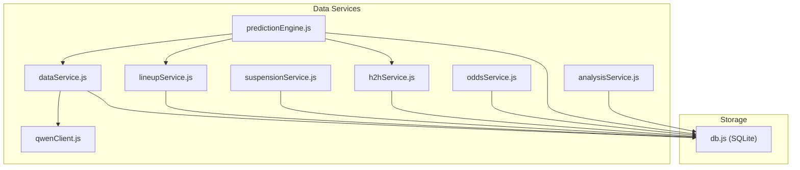
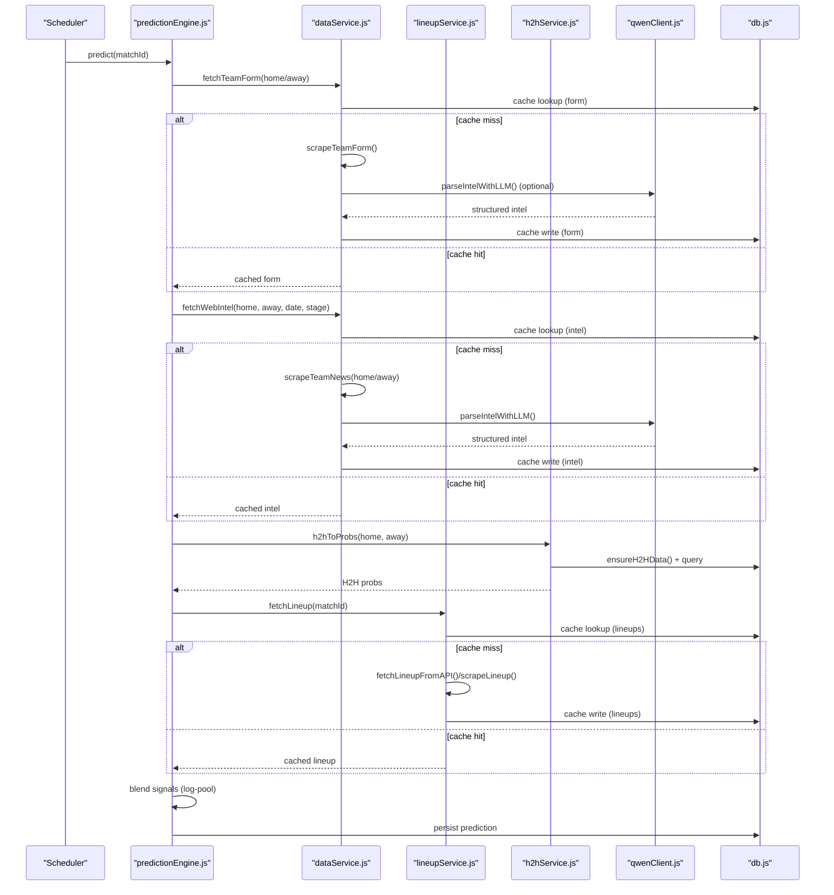
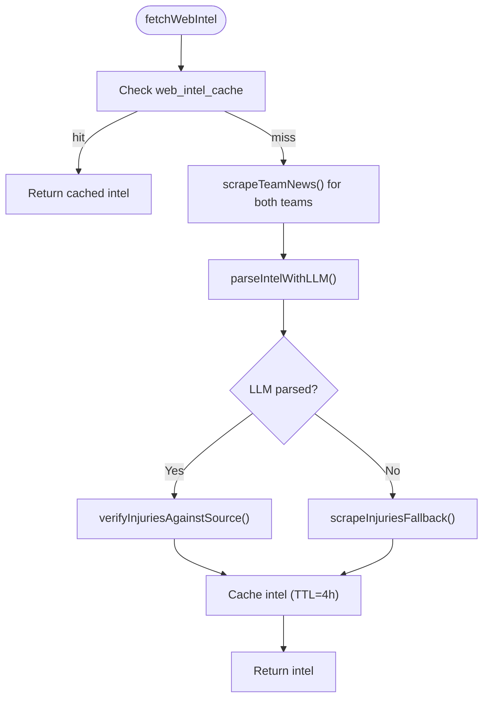
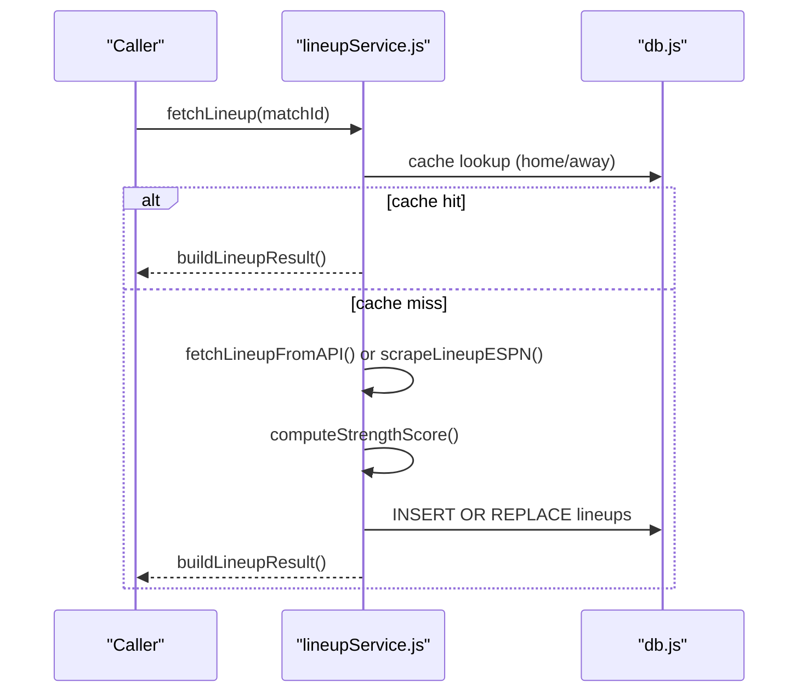
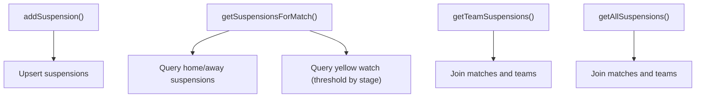
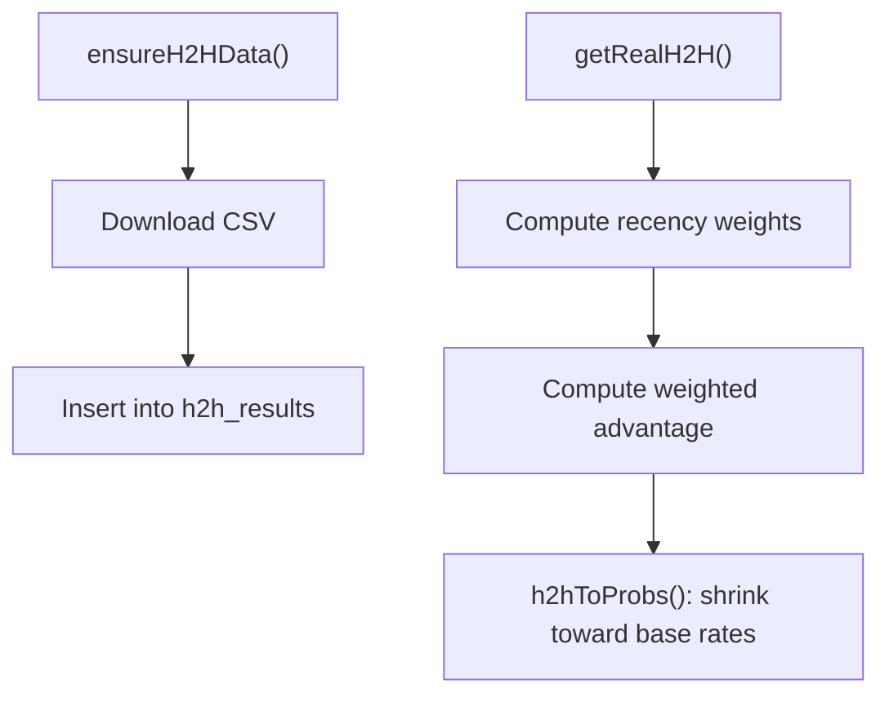
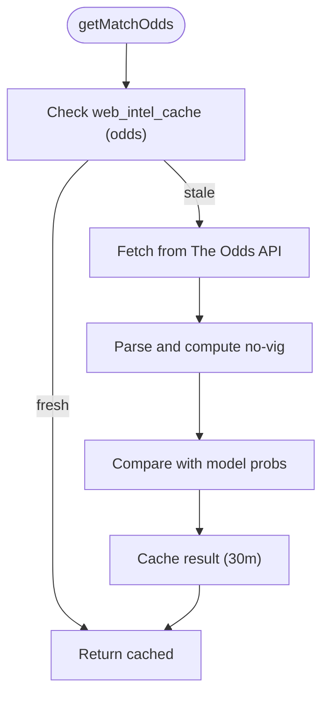
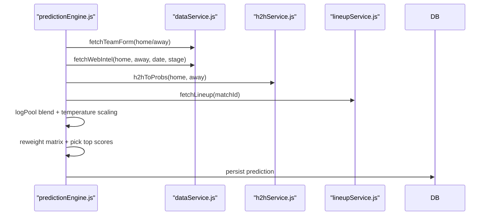
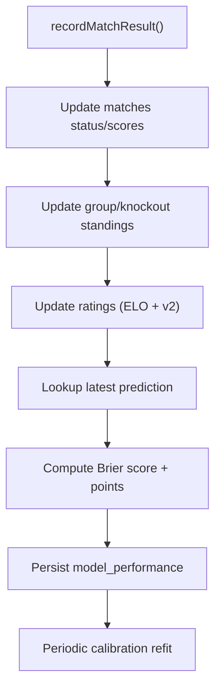
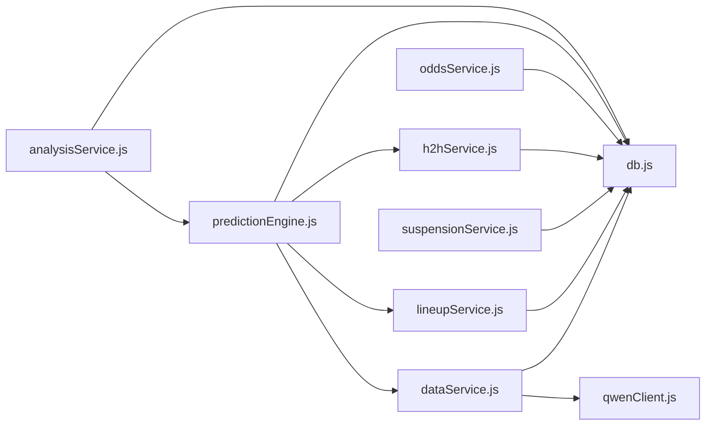

# Data Services

<cite>
**Referenced Files in This Document**
- [dataService.js](file://backend/services/dataService.js)
- [lineupService.js](file://backend/services/lineupService.js)
- [suspensionService.js](file://backend/services/suspensionService.js)
- [h2hService.js](file://backend/services/h2hService.js)
- [oddsService.js](file://backend/services/oddsService.js)
- [predictionEngine.js](file://backend/services/predictionEngine.js)
- [analysisService.js](file://backend/services/analysisService.js)
- [db.js](file://backend/database/db.js)
- [qwenClient.js](file://backend/services/qwenClient.js)
</cite>

## Table of Contents
1. [Introduction](#introduction)
2. [Project Structure](#project-structure)
3. [Core Components](#core-components)
4. [Architecture Overview](#architecture-overview)
5. [Detailed Component Analysis](#detailed-component-analysis)
6. [Dependency Analysis](#dependency-analysis)
7. [Performance Considerations](#performance-considerations)
8. [Troubleshooting Guide](#troubleshooting-guide)
9. [Conclusion](#conclusion)

## Introduction
This document describes the data services layer responsible for sourcing, transforming, validating, and serving data to the prediction engine and downstream consumers. It covers:
- External API integrations (football-data.org, The Odds API)
- Real-time live result synchronization
- Web scraping for injury and transfer news
- Lineup service for confirmed starting XI and lineup impact
- Suspension tracking service
- Head-to-head history service backed by a large historical dataset
- Data validation, error handling, retry mechanisms, and fallback strategies
- Data transformation pipelines and enrichment processes
- Integration with the prediction engine
- Rate limiting, API key management, and data freshness policies

## Project Structure
The data services layer is organized by functional domains:
- External data ingestion and caching: dataService.js
- Lineup and lineup impact: lineupService.js
- Suspension tracking: suspensionService.js
- Historical head-to-head: h2hService.js
- Odds integration: oddsService.js
- Prediction engine orchestration: predictionEngine.js
- Post-match analysis and learning: analysisService.js
- Database schema and caching tables: db.js
- LLM client for parsing and insights: qwenClient.js

**Diagram sources**
- [dataService.js:1-583](file://backend/services/dataService.js#L1-L583)
- [lineupService.js:1-425](file://backend/services/lineupService.js#L1-L425)
- [suspensionService.js:1-152](file://backend/services/suspensionService.js#L1-L152)
- [h2hService.js:1-315](file://backend/services/h2hService.js#L1-L315)
- [oddsService.js:1-242](file://backend/services/oddsService.js#L1-L242)
- [predictionEngine.js:1-1020](file://backend/services/predictionEngine.js#L1-L1020)
- [analysisService.js:1-422](file://backend/services/analysisService.js#L1-L422)
- [db.js:1-252](file://backend/database/db.js#L1-L252)
- [qwenClient.js:1-123](file://backend/services/qwenClient.js#L1-L123)

**Section sources**
- [dataService.js:1-583](file://backend/services/dataService.js#L1-L583)
- [lineupService.js:1-425](file://backend/services/lineupService.js#L1-L425)
- [suspensionService.js:1-152](file://backend/services/suspensionService.js#L1-L152)
- [h2hService.js:1-315](file://backend/services/h2hService.js#L1-L315)
- [oddsService.js:1-242](file://backend/services/oddsService.js#L1-L242)
- [predictionEngine.js:1-1020](file://backend/services/predictionEngine.js#L1-L1020)
- [analysisService.js:1-422](file://backend/services/analysisService.js#L1-L422)
- [db.js:1-252](file://backend/database/db.js#L1-L252)
- [qwenClient.js:1-123](file://backend/services/qwenClient.js#L1-L123)

## Core Components
- External API integration and caching:
  - football-data.org API client with timeouts and team ID mapping
  - Web scraping for team form, injuries, and news via Google News RSS and DuckDuckGo-friendly search
  - Structured LLM parsing with anti-hallucination verification
- Real-time live result synchronization:
  - In-progress and finished match sync with score normalization and reversal handling
- Lineup service:
  - Confirmed starting XI retrieval from multiple sources, strength scoring, and impact conversion
- Suspension tracking:
  - Yellow/red card accumulation, ban enforcement, and match-specific suspension queries
- Head-to-head history:
  - Large-scale historical CSV seeding and weighted historical records
- Odds service:
  - Integration with The Odds API and mock odds fallback
- Prediction engine integration:
  - Consumption of form, intel, H2H, lineup, and rest-day signals
- Database schema and caching:
  - Centralized caching tables and model configuration storage

**Section sources**
- [dataService.js:18-583](file://backend/services/dataService.js#L18-L583)
- [lineupService.js:1-425](file://backend/services/lineupService.js#L1-L425)
- [suspensionService.js:1-152](file://backend/services/suspensionService.js#L1-L152)
- [h2hService.js:1-315](file://backend/services/h2hService.js#L1-L315)
- [oddsService.js:1-242](file://backend/services/oddsService.js#L1-L242)
- [predictionEngine.js:1-1020](file://backend/services/predictionEngine.js#L1-L1020)
- [db.js:147-252](file://backend/database/db.js#L147-L252)

## Architecture Overview
The data services layer integrates external sources, caches data locally, and supplies enriched inputs to the prediction engine. The prediction engine orchestrates multiple signals (form, intel, H2H, lineup, rest days) and blends them using a log-pool mechanism.

**Diagram sources**
- [predictionEngine.js:665-896](file://backend/services/predictionEngine.js#L665-L896)
- [dataService.js:68-490](file://backend/services/dataService.js#L68-L490)
- [lineupService.js:221-316](file://backend/services/lineupService.js#L221-L316)
- [h2hService.js:272-312](file://backend/services/h2hService.js#L272-L312)
- [qwenClient.js:53-101](file://backend/services/qwenClient.js#L53-L101)
- [db.js:147-194](file://backend/database/db.js#L147-L194)

## Detailed Component Analysis

### External API Integration and Caching (dataService.js)
- football-data.org client:
  - Base URL and auth header construction
  - Team ID mapping to API team IDs
  - Timeout configuration
- Team form:
  - Cache validation by TTL
  - API fetch with finished matches and result derivation
  - Fallback to web scraping and synthetic generation
- Head-to-head:
  - API fetch filtered by opponent
  - Fallback to Elo-based estimates
- Web intelligence:
  - Google News RSS scraping for team news
  - LLM parsing with anti-hallucination filtering
  - Regex fallback for injuries
  - Cache with shorter TTL for intel
- Live result sync:
  - IN_PLAY/PAUSED → LIVE promotion
  - FINISHED → finalize scores and record results
  - Reversal handling for API/home-away mismatches

**Diagram sources**
- [dataService.js:413-490](file://backend/services/dataService.js#L413-L490)
- [dataService.js:273-411](file://backend/services/dataService.js#L273-L411)
- [dataService.js:294-380](file://backend/services/dataService.js#L294-L380)

**Section sources**
- [dataService.js:18-583](file://backend/services/dataService.js#L18-L583)

### Lineup Service (lineupService.js)
- Sources:
  - football-data.org API (lineups)
  - ESPN scrape
  - Manual override
- Strength scoring:
  - Position weights and ELO-derived player ratings
  - Normalized score 0–10
- Absence detection:
  - Compares current starters to recent lineup patterns
- Impact conversion:
  - Converts strength delta to probability adjustments for the prediction engine

**Diagram sources**
- [lineupService.js:221-316](file://backend/services/lineupService.js#L221-L316)
- [lineupService.js:158-183](file://backend/services/lineupService.js#L158-L183)
- [lineupService.js:318-362](file://backend/services/lineupService.js#L318-L362)

**Section sources**
- [lineupService.js:1-425](file://backend/services/lineupService.js#L1-L425)

### Suspension Tracking Service (suspensionService.js)
- Adds or updates suspensions with reasons and match-specific bans
- Retrieves suspensions for a match and yellow-card watch lists
- Provides team-level suspension history and global summary

**Diagram sources**
- [suspensionService.js:16-83](file://backend/services/suspensionService.js#L16-L83)
- [suspensionService.js:108-143](file://backend/services/suspensionService.js#L108-L143)

**Section sources**
- [suspensionService.js:1-152](file://backend/services/suspensionService.js#L1-L152)

### Head-to-Head History Service (h2hService.js)
- Seeding:
  - Downloads CSV from martj42/international_results
  - Normalizes team names and stores matches with competition weights
- Queries:
  - Returns last N matches with recency weighting and weighted advantage
- Conversion to probabilities:
  - Shrinks toward base international rates with sample-size dependent shrinkage

**Diagram sources**
- [h2hService.js:95-165](file://backend/services/h2hService.js#L95-L165)
- [h2hService.js:192-266](file://backend/services/h2hService.js#L192-L266)
- [h2hService.js:272-312](file://backend/services/h2hService.js#L272-L312)

**Section sources**
- [h2hService.js:1-315](file://backend/services/h2hService.js#L1-L315)

### Odds Service (oddsService.js)
- Fetches real odds from The Odds API
- Parses bookmaker markets and computes consensus odds and no-vig probabilities
- Provides model edge comparison against predictions
- Caches results for 30 minutes and offers mock odds fallback when API key is absent

**Diagram sources**
- [oddsService.js:131-200](file://backend/services/oddsService.js#L131-L200)
- [oddsService.js:203-242](file://backend/services/oddsService.js#L203-L242)

**Section sources**
- [oddsService.js:1-242](file://backend/services/oddsService.js#L1-L242)

### Prediction Engine Integration (predictionEngine.js)
- Consumes signals:
  - Form (opponent-quality weighted)
  - Intel (LLM-parsed, anti-hallucination)
  - H2H (real history)
  - Lineup (confirmed XI strength)
  - Rest days
- Blending:
  - Log-pool with per-signal weights
  - Temperature scaling for calibration
- Scoreline derivation:
  - Reweights backbone matrix to align with blended outcome probabilities
- Output:
  - Win/draw/lose probabilities, expected scores, top scorelines, factors, insight

**Diagram sources**
- [predictionEngine.js:665-896](file://backend/services/predictionEngine.js#L665-L896)
- [dataService.js:68-490](file://backend/services/dataService.js#L68-L490)
- [h2hService.js:272-312](file://backend/services/h2hService.js#L272-L312)
- [lineupService.js:221-316](file://backend/services/lineupService.js#L221-L316)

**Section sources**
- [predictionEngine.js:1-1020](file://backend/services/predictionEngine.js#L1-L1020)

### Post-Match Analysis and Learning (analysisService.js)
- Records match results, updates group/knockout standings, and recalculates group tables
- Updates both legacy ELO and v2 attack/defense ratings
- Computes Brier score, correctness, points, and generates analysis notes
- Triggers calibration refits periodically

**Diagram sources**
- [analysisService.js:76-218](file://backend/services/analysisService.js#L76-L218)

**Section sources**
- [analysisService.js:1-422](file://backend/services/analysisService.js#L1-L422)

## Dependency Analysis
- Circular dependency avoidance:
  - Lazy-loading of predictionEngine from dataService and analysisService to prevent circular requires
- External dependencies:
  - axios for HTTP requests
  - cheerio for HTML/XML parsing
  - node-sqlite3-wasm for database access
- Internal dependencies:
  - All services depend on db.js for schema initialization and queries
  - qwenClient.js provides LLM capabilities with retry/backoff

**Diagram sources**
- [dataService.js:1-21](file://backend/services/dataService.js#L1-L21)
- [lineupService.js:42-43](file://backend/services/lineupService.js#L42-L43)
- [suspensionService.js](file://backend/services/suspensionService.js#L13)
- [h2hService.js:20-21](file://backend/services/h2hService.js#L20-L21)
- [oddsService.js:19-20](file://backend/services/oddsService.js#L19-L20)
- [predictionEngine.js:37-43](file://backend/services/predictionEngine.js#L37-L43)
- [analysisService.js:13-16](file://backend/services/analysisService.js#L13-L16)
- [qwenClient.js:13-13](file://backend/services/qwenClient.js#L13-L13)
- [db.js:1-3](file://backend/database/db.js#L1-L3)

**Section sources**
- [dataService.js:1-21](file://backend/services/dataService.js#L1-L21)
- [lineupService.js:42-43](file://backend/services/lineupService.js#L42-L43)
- [suspensionService.js](file://backend/services/suspensionService.js#L13)
- [h2hService.js:20-21](file://backend/services/h2hService.js#L20-L21)
- [oddsService.js:19-20](file://backend/services/oddsService.js#L19-L20)
- [predictionEngine.js:37-43](file://backend/services/predictionEngine.js#L37-L43)
- [analysisService.js:13-16](file://backend/services/analysisService.js#L13-L16)
- [qwenClient.js:13-13](file://backend/services/qwenClient.js#L13-L13)
- [db.js:1-3](file://backend/database/db.js#L1-L3)

## Performance Considerations
- Caching:
  - Team form: 12 hours
  - Head-to-head: 24 hours
  - Intel: 4 hours
  - Odds: 30 minutes
- Parallelization:
  - Scrapes for both teams run concurrently
  - Signal fetching for prediction runs in parallel where possible
- Data freshness:
  - Live sync checks IN_PLAY/PAUSED and FINISHED matches
  - Cache invalidation occurs when TTL expires
- Database tuning:
  - Busy timeout, synchronous mode, foreign keys enabled
  - Indexes on frequently queried columns (e.g., h2h_results)
- LLM reliability:
  - Retry with exponential backoff on 5xx or timeouts
  - JSON extraction retry for robust parsing

[No sources needed since this section provides general guidance]

## Troubleshooting Guide
- API key issues:
  - Missing FOOTBALL_DATA_API_KEY disables live sync and API-based retrievals
  - Missing DASHSCOPE_API_KEY prevents LLM calls; fallbacks still work
  - Missing ODDS_API_KEY enables mock odds based on model predictions
- Network failures:
  - axios timeouts and retry logic in dataService and qwenClient
  - Web scraping failures fall back to defaults or synthetic data
- Cache anomalies:
  - Cache validation uses fetched_at and TTL; manual cache clearing may be needed
- Data mismatches:
  - syncLiveResults handles API/home-away reversals and skips unknown team IDs
- Database errors:
  - node-sqlite3-wasm lock cleanup on startup; migrations applied on first use

**Section sources**
- [dataService.js:496-580](file://backend/services/dataService.js#L496-L580)
- [qwenClient.js:60-101](file://backend/services/qwenClient.js#L60-L101)
- [oddsService.js:160-170](file://backend/services/oddsService.js#L160-L170)
- [db.js:10-21](file://backend/database/db.js#L10-L21)

## Conclusion
The data services layer provides a robust, resilient pipeline for ingesting, enriching, and serving match-related data. It balances external API reliability with web scraping and synthetic fallbacks, enforces data freshness via TTL-based caching, and integrates tightly with the prediction engine. The modular design, clear separation of concerns, and comprehensive error handling enable scalable operation and maintainability.