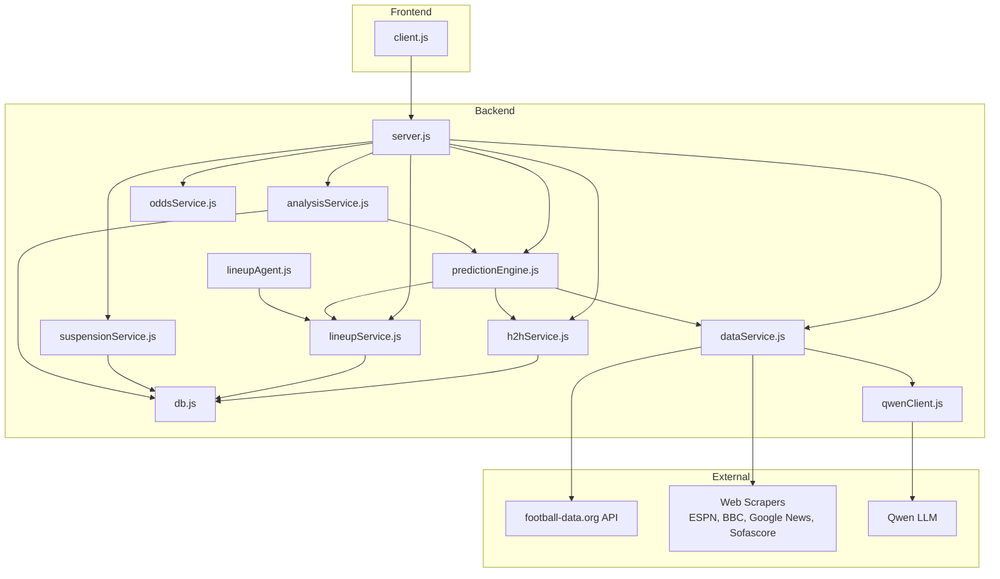
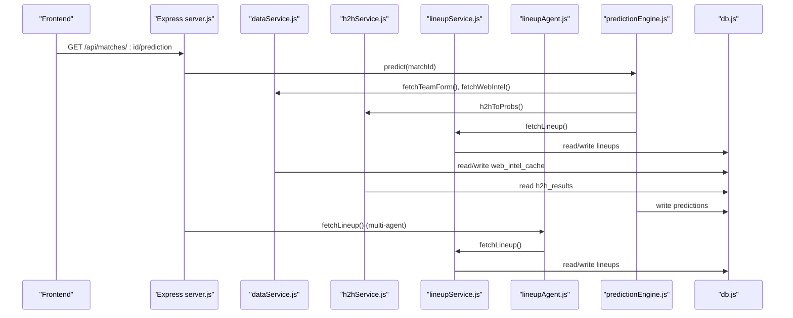
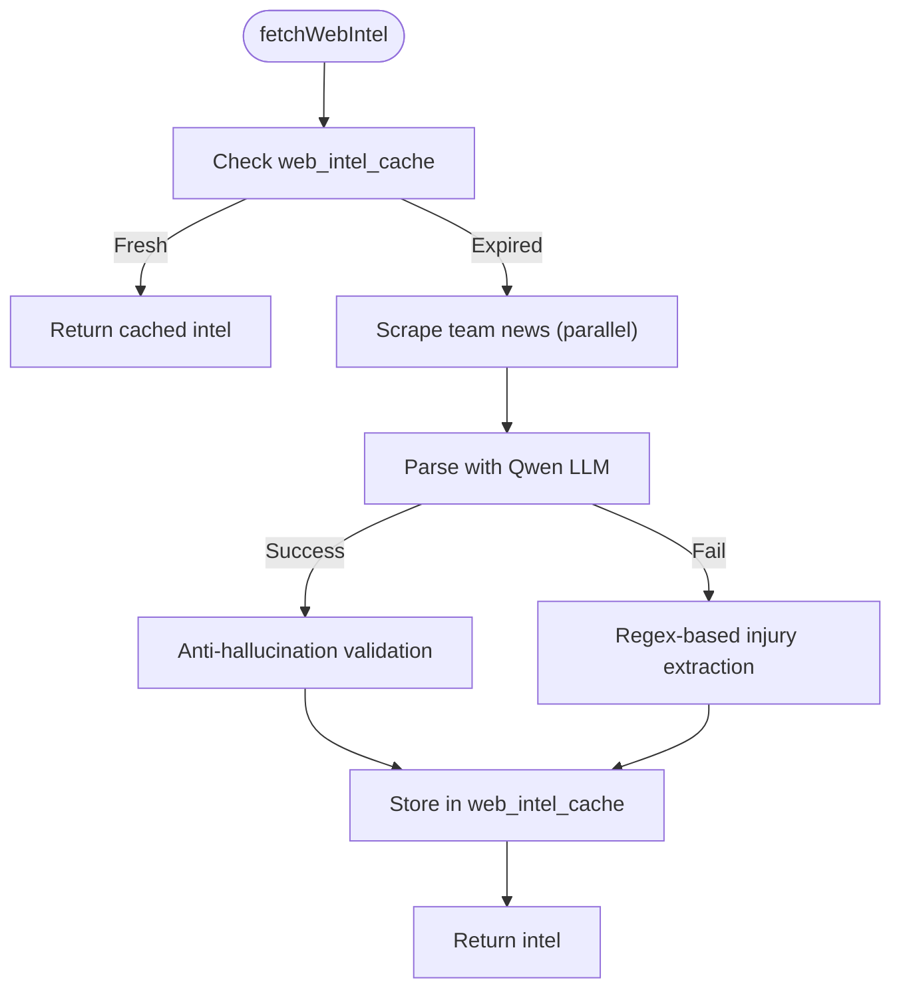
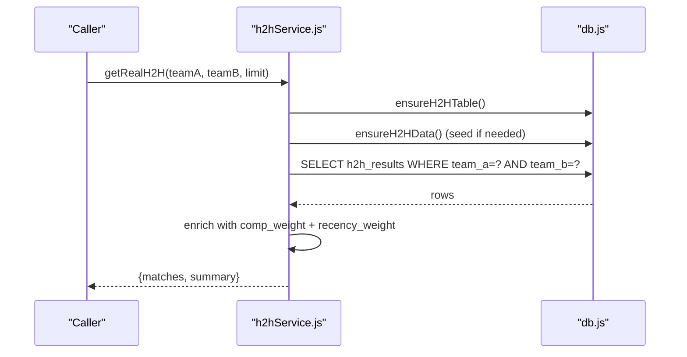
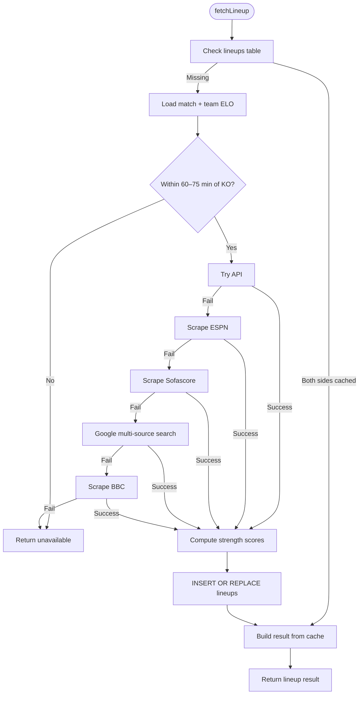
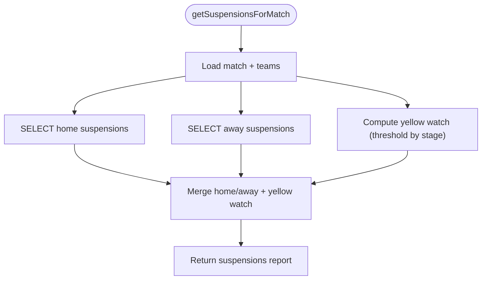
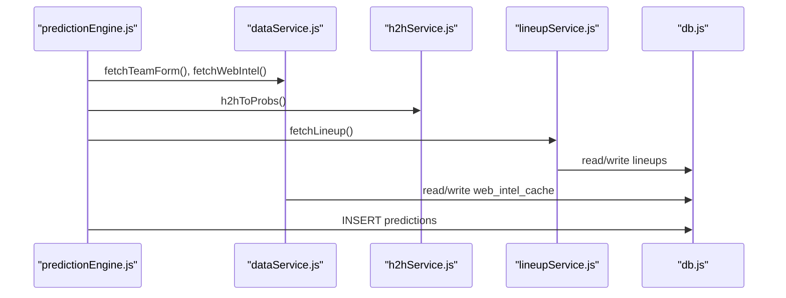
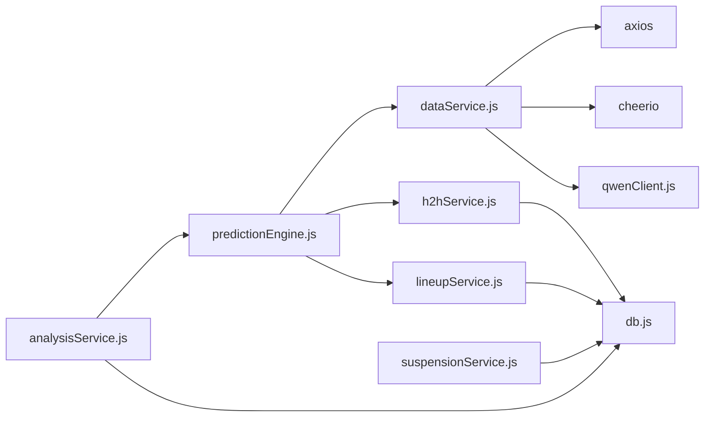

# Data Services

<cite>
**Referenced Files in This Document**
- [dataService.js](file://backend/services/dataService.js)
- [h2hService.js](file://backend/services/h2hService.js)
- [lineupService.js](file://backend/services/lineupService.js)
- [suspensionService.js](file://backend/services/suspensionService.js)
- [predictionEngine.js](file://backend/services/predictionEngine.js)
- [analysisService.js](file://backend/services/analysisService.js)
- [db.js](file://backend/database/db.js)
- [client.js](file://frontend/src/api/client.js)
- [server.js](file://backend/server.js)
- [qwenClient.js](file://backend/services/qwenClient.js)
- [oddsService.js](file://backend/services/oddsService.js)
- [lineupAgent.js](file://backend/services/agents/lineupAgent.js)
</cite>

## Update Summary
**Changes Made**
- Enhanced lineup service documentation to include new Google multi-source scraping capabilities
- Added Sofascore structured data extraction functionality
- Updated the multi-source fetching architecture documentation
- Expanded lineup tracking and strength modeling documentation to reflect new capabilities

## Table of Contents
1. [Introduction](#introduction)
2. [Project Structure](#project-structure)
3. [Core Components](#core-components)
4. [Architecture Overview](#architecture-overview)
5. [Detailed Component Analysis](#detailed-component-analysis)
6. [Dependency Analysis](#dependency-analysis)
7. [Performance Considerations](#performance-considerations)
8. [Troubleshooting Guide](#troubleshooting-guide)
9. [Conclusion](#conclusion)
10. [Appendices](#appendices)

## Introduction
This document describes the data services layer responsible for external data integration and processing in the World Cup 2026 prediction platform. It covers:
- External data sources: football-data.org API integration, web scraping for injuries and lineups, and real-time live result synchronization
- Historical head-to-head analysis using a 47k-match dataset
- Lineup tracking and player availability modeling with enhanced multi-source scraping capabilities
- Suspension tracking for yellow/red cards
- Data processing pipeline: validation, transformation, caching, error handling
- Rate limiting, retry mechanisms, and fallback strategies
- Data freshness policies, update frequencies, and consistency guarantees
- Integration patterns with the prediction engine and user interface

## Project Structure
The data services are implemented as modular Node.js services backed by a SQLite database. The backend exposes REST endpoints via Express and orchestrates data collection, processing, and caching. The frontend consumes these endpoints to render predictions and analytics.

**Diagram sources**
- [dataService.js:1-602](file://backend/services/dataService.js#L1-L602)
- [h2hService.js:1-315](file://backend/services/h2hService.js#L1-L315)
- [lineupService.js:1-572](file://backend/services/lineupService.js#L1-L572)
- [suspensionService.js:1-152](file://backend/services/suspensionService.js#L1-L152)
- [predictionEngine.js:1-1046](file://backend/services/predictionEngine.js#L1-L1046)
- [analysisService.js:1-422](file://backend/services/analysisService.js#L1-L422)
- [db.js:1-252](file://backend/database/db.js#L1-L252)
- [qwenClient.js:86-122](file://backend/services/qwenClient.js#L86-L122)
- [oddsService.js:1-156](file://backend/services/oddsService.js#L1-L156)
- [server.js:1-41](file://backend/server.js#L1-L41)
- [lineupAgent.js:1-118](file://backend/services/agents/lineupAgent.js#L1-L118)

**Section sources**
- [dataService.js:1-602](file://backend/services/dataService.js#L1-L602)
- [h2hService.js:1-315](file://backend/services/h2hService.js#L1-L315)
- [lineupService.js:1-572](file://backend/services/lineupService.js#L1-L572)
- [suspensionService.js:1-152](file://backend/services/suspensionService.js#L1-L152)
- [predictionEngine.js:1-1046](file://backend/services/predictionEngine.js#L1-L1046)
- [analysisService.js:1-422](file://backend/services/analysisService.js#L1-L422)
- [db.js:1-252](file://backend/database/db.js#L1-L252)
- [qwenClient.js:86-122](file://backend/services/qwenClient.js#L86-L122)
- [oddsService.js:1-156](file://backend/services/oddsService.js#L1-L156)
- [server.js:1-41](file://backend/server.js#L1-L41)

## Core Components
- dataService: Integrates football-data.org API and web scraping for team form, injuries, news, and live result synchronization. Implements caching and fallback strategies.
- h2hService: Loads and maintains a 47k-match historical dataset, computes competition-weighted head-to-head records, and converts them to probabilities.
- lineupService: Fetches confirmed starting XIs from multiple sources including API, ESPN, BBC, Google multi-source search, and Sofascore structured data extraction. Computes lineup strength, detects key absences, and translates lineup impact into probability adjustments.
- suspensionService: Tracks yellow/red card accumulations and suspensions across the tournament, with stage-aware thresholds and watch lists.
- predictionEngine: Orchestrates the prediction pipeline, blending backbone Poisson model with signals from dataService, h2hService, and lineupService.
- analysisService: Handles post-match analysis, updating standings, ELO/ratings, and model performance metrics.
- qwenClient: Provides robust LLM invocation with retries and timeouts for data parsing tasks.
- oddsService: Fetches betting odds from The Odds API with caching and quota preservation.

**Section sources**
- [dataService.js:1-602](file://backend/services/dataService.js#L1-L602)
- [h2hService.js:1-315](file://backend/services/h2hService.js#L1-L315)
- [lineupService.js:1-572](file://backend/services/lineupService.js#L1-L572)
- [suspensionService.js:1-152](file://backend/services/suspensionService.js#L1-L152)
- [predictionEngine.js:1-1046](file://backend/services/predictionEngine.js#L1-L1046)
- [analysisService.js:1-422](file://backend/services/analysisService.js#L1-L422)
- [qwenClient.js:86-122](file://backend/services/qwenClient.js#L86-L122)
- [oddsService.js:1-156](file://backend/services/oddsService.js#L1-L156)

## Architecture Overview
The data services layer follows a layered architecture:
- External integrations: API clients and scrapers feed raw data into the system
- Transformation: Services parse, validate, and enrich data
- Caching: SQLite-backed cache stores processed data with TTL controls
- Orchestration: predictionEngine composes signals and generates predictions
- Persistence: database persists predictions, model performance, and metadata
- Frontend integration: client.js calls backend endpoints to render UI

**Diagram sources**
- [server.js:1-41](file://backend/server.js#L1-L41)
- [predictionEngine.js:690-922](file://backend/services/predictionEngine.js#L690-L922)
- [dataService.js:68-133](file://backend/services/dataService.js#L68-L133)
- [h2hService.js:192-266](file://backend/services/h2hService.js#L192-L266)
- [lineupService.js:221-316](file://backend/services/lineupService.js#L221-L316)
- [lineupAgent.js:44-51](file://backend/services/agents/lineupAgent.js#L44-L51)
- [db.js:147-157](file://backend/database/db.js#L147-L157)

## Detailed Component Analysis

### dataService: External Integration and Live Sync
Responsibilities:
- Team form retrieval from API with fallback to web scraping and synthetic generation
- Head-to-head records from API with fallback to Elo-based estimates
- Pre-match intelligence via web scraping and LLM parsing with anti-hallucination validation
- Real-time live result synchronization with score reversal logic and penalty handling
- Caching with TTL controls for form, H2H, and intel

Key implementation patterns:
- Team ID mapping for API compatibility
- Parallel scraping for efficiency
- LLM parsing with strict validation against source text
- Cache-first strategy with TTL checks
- Lazy loading to avoid circular dependencies

**Diagram sources**
- [dataService.js:432-509](file://backend/services/dataService.js#L432-L509)
- [dataService.js:294-399](file://backend/services/dataService.js#L294-L399)
- [dataService.js:401-430](file://backend/services/dataService.js#L401-L430)

**Section sources**
- [dataService.js:18-41](file://backend/services/dataService.js#L18-L41)
- [dataService.js:68-133](file://backend/services/dataService.js#L68-L133)
- [dataService.js:190-246](file://backend/services/dataService.js#L190-L246)
- [dataService.js:432-509](file://backend/services/dataService.js#L432-L509)
- [dataService.js:514-599](file://backend/services/dataService.js#L514-L599)

### h2hService: Real Head-to-Head Dataset
Responsibilities:
- Seed 47k-match dataset from GitHub repository on first call
- Normalize team names to internal 3-letter codes
- Compute competition-weighted and recency-weighted head-to-head statistics
- Convert H2H records to probability vectors with shrinkage toward base rates

Implementation highlights:
- CSV parsing with quoted-field support
- Seeding guarded by a meta table and mutex to prevent concurrent downloads
- Weighted advantage computation and data quality scoring
- Fallback to neutral probabilities when insufficient history

**Diagram sources**
- [h2hService.js:95-165](file://backend/services/h2hService.js#L95-L165)
- [h2hService.js:192-266](file://backend/services/h2hService.js#L192-L266)

**Section sources**
- [h2hService.js:23-46](file://backend/services/h2hService.js#L23-L46)
- [h2hService.js:95-165](file://backend/services/h2hService.js#L95-L165)
- [h2hService.js:192-266](file://backend/services/h2hService.js#L192-L266)
- [h2hService.js:272-312](file://backend/services/h2hService.js#L272-L312)

### lineupService: Enhanced Lineup Tracking and Strength Modeling
**Updated** Enhanced with new Google multi-source scraping capabilities and Sofascore structured data extraction

Responsibilities:
- Fetch confirmed lineups from multiple sources: API, ESPN, BBC, Google multi-source search, and Sofascore structured data extraction
- Compute lineup strength scores using position weights and ELO-derived ratings
- Detect key absences by comparing current starters to recent patterns
- Translate lineup impact into probability adjustments for the prediction engine

Enhanced multi-source architecture:
- Priority order: API → ESPN → Sofascore → Google multi-source → BBC
- Google multi-source scraping searches across multiple football websites for lineup data
- Sofascore structured data extraction parses SEO-rendered HTML and application/ld+json structured data
- Robust fallback mechanisms ensure lineup data availability even for less-covered matches

Key features:
- Position importance weights summing to 10
- Strength normalization to 0–10 scale
- Absence detection via frequency analysis across previous lineups
- Manual lineup submission capability
- Multi-source redundancy for improved reliability

**Diagram sources**
- [lineupService.js:356-463](file://backend/services/lineupService.js#L356-L463)
- [lineupService.js:416-426](file://backend/services/lineupService.js#L416-L426)
- [lineupService.js:422-426](file://backend/services/lineupService.js#L422-L426)

**Section sources**
- [lineupService.js:46-61](file://backend/services/lineupService.js#L46-L61)
- [lineupService.js:158-183](file://backend/services/lineupService.js#L158-L183)
- [lineupService.js:190-218](file://backend/services/lineupService.js#L190-L218)
- [lineupService.js:221-316](file://backend/services/lineupService.js#L221-L316)
- [lineupService.js:399-422](file://backend/services/lineupService.js#L399-L422)
- [lineupService.js:416-426](file://backend/services/lineupService.js#L416-L426)
- [lineupService.js:422-426](file://backend/services/lineupService.js#L422-L426)

### suspensionService: Yellow/Red Card Tracking
Responsibilities:
- Track yellow card accumulation and red card suspensions
- Compute watch lists for players nearing suspension thresholds
- Stage-aware suspension rules (e.g., yellow wipe after semis)
- Provide per-match suspension reports and team-wide summaries

**Diagram sources**
- [suspensionService.js:44-83](file://backend/services/suspensionService.js#L44-L83)
- [suspensionService.js:86-105](file://backend/services/suspensionService.js#L86-L105)

**Section sources**
- [suspensionService.js:16-41](file://backend/services/suspensionService.js#L16-L41)
- [suspensionService.js:44-83](file://backend/services/suspensionService.js#L44-L83)
- [suspensionService.js:86-105](file://backend/services/suspensionService.js#L86-L105)

### Prediction Engine Integration
The prediction engine integrates data services as follows:
- Retrieves team form and injuries via dataService
- Obtains H2H probabilities via h2hService
- Fetches lineup data via lineupService
- Blends signals using log-pool weighting and applies temperature calibration
- Writes predictions to the database and generates insights

**Diagram sources**
- [predictionEngine.js:690-922](file://backend/services/predictionEngine.js#L690-L922)
- [dataService.js:68-133](file://backend/services/dataService.js#L68-L133)
- [h2hService.js:272-312](file://backend/services/h2hService.js#L272-L312)
- [lineupService.js:221-316](file://backend/services/lineupService.js#L221-L316)
- [db.js:147-157](file://backend/database/db.js#L147-L157)

**Section sources**
- [predictionEngine.js:39-43](file://backend/services/predictionEngine.js#L39-L43)
- [predictionEngine.js:758-822](file://backend/services/predictionEngine.js#L758-L822)
- [predictionEngine.js:835-846](file://backend/services/predictionEngine.js#L835-L846)

## Dependency Analysis
The data services layer exhibits clear separation of concerns with minimal coupling:
- dataService depends on axios, cheerio, and qwenClient for external integrations
- h2hService depends on SQLite for persistent storage of the 47k-match dataset
- lineupService and suspensionService depend on SQLite for caching and tracking
- predictionEngine orchestrates all services and persists results
- analysisService updates model performance and standings after matches

**Diagram sources**
- [dataService.js:7-21](file://backend/services/dataService.js#L7-L21)
- [h2hService.js:20-21](file://backend/services/h2hService.js#L20-L21)
- [lineupService.js:41-43](file://backend/services/lineupService.js#L41-L43)
- [suspensionService.js:13](file://backend/services/suspensionService.js#L13)
- [predictionEngine.js:37-43](file://backend/services/predictionEngine.js#L37-L43)
- [analysisService.js:13-16](file://backend/services/analysisService.js#L13-L16)
- [db.js:1-3](file://backend/database/db.js#L1-L3)

**Section sources**
- [dataService.js:7-21](file://backend/services/dataService.js#L7-L21)
- [h2hService.js:20-21](file://backend/services/h2hService.js#L20-L21)
- [lineupService.js:41-43](file://backend/services/lineupService.js#L41-L43)
- [suspensionService.js:13](file://backend/services/suspensionService.js#L13)
- [predictionEngine.js:37-43](file://backend/services/predictionEngine.js#L37-L43)
- [analysisService.js:13-16](file://backend/services/analysisService.js#L13-L16)
- [db.js:1-3](file://backend/database/db.js#L1-L3)

## Performance Considerations
- Caching: TTL-based caching for form (12h), H2H (24h), and intel (4h) minimizes external calls and improves response times.
- Parallelization: Web scraping for injuries and news runs in parallel to reduce latency.
- Database optimizations: WAL mode, foreign keys, and appropriate indexes improve concurrency and query performance.
- Backoff and retries: LLM calls implement exponential backoff to handle transient failures gracefully.
- Lightweight transformations: Position weights and strength scoring are computed in-process for quick turnaround.
- Multi-source redundancy: Enhanced lineup service provides multiple fallback options to ensure data availability.

## Troubleshooting Guide
Common issues and remedies:
- API key missing: Live sync and H2H API calls are skipped when the API key is not configured.
- Scraping failures: Fallbacks to regex-based extraction and synthetic data generation ensure continuity.
- LLM parsing errors: Anti-hallucination filtering removes invalid claims; fallback to regex extraction occurs automatically.
- Cache staleness: TTL checks ensure fresh data is fetched when cached entries expire.
- Database contention: Lock handling and transaction blocks prevent corruption during seeding and updates.
- Google search limitations: Multi-source Google scraping may fail if search results are not available or structured data is missing.

**Section sources**
- [dataService.js:514-518](file://backend/services/dataService.js#L514-L518)
- [dataService.js:294-399](file://backend/services/dataService.js#L294-L399)
- [dataService.js:401-430](file://backend/services/dataService.js#L401-L430)
- [h2hService.js:95-106](file://backend/services/h2hService.js#L95-L106)
- [db.js:10-21](file://backend/database/db.js#L10-L21)

## Conclusion
The data services layer provides a robust, resilient pipeline for integrating external data, transforming it into actionable signals, and feeding them into the prediction engine. Through careful caching, fallback strategies, and anti-hallucination validation, it ensures reliable predictions even under adverse conditions. The enhanced lineup service with multi-source scraping capabilities significantly improves data availability and reliability. The modular design enables easy maintenance and extension as new data sources and signals are introduced.

## Appendices

### Data Freshness and Update Frequencies
- Team form: cached for 12 hours; refreshed on demand or via periodic jobs
- Head-to-head: cached for 24 hours; static dataset seeded once and reused thereafter
- Pre-match intelligence: cached for 4 hours; refreshed frequently due to breaking news
- Lineups: cached per match; available within 60–75 minutes before kickoff with multi-source redundancy
- Suspensions: updated in real-time via manual entries and match events

**Section sources**
- [dataService.js:30-35](file://backend/services/dataService.js#L30-L35)
- [h2hService.js:95-165](file://backend/services/h2hService.js#L95-L165)
- [lineupService.js:250-262](file://backend/services/lineupService.js#L250-L262)

### Integration with Prediction Engine and UI
- Backend endpoints expose predictions, H2H, lineups, suspensions, and analytics
- Frontend client consumes these endpoints to render match details, predictions, and tournament insights
- Multi-agent orchestration can be toggled via environment variables and model configuration
- LineupAgent provides specialized tactical analysis when confirmed lineups are available

**Section sources**
- [server.js:1-41](file://backend/server.js#L1-L41)
- [client.js:19-50](file://frontend/src/api/client.js#L19-L50)
- [predictionEngine.js:56-61](file://backend/services/predictionEngine.js#L56-L61)
- [lineupAgent.js:110-118](file://backend/services/agents/lineupAgent.js#L110-L118)

### Enhanced Lineup Service Architecture
**Updated** New multi-source scraping capabilities

The lineup service now implements a sophisticated multi-source architecture:

1. **Primary Source**: football-data.org API (lineup field)
2. **Traditional Sources**: ESPN match page scrape, BBC Sport scrape
3. **Enhanced Sources**: 
   - Google multi-source search for structured data extraction
   - Sofascore structured data extraction from SEO-rendered HTML
4. **Fallback Mechanism**: Automatic switching between sources based on availability and reliability

**Section sources**
- [lineupService.js:8-39](file://backend/services/lineupService.js#L8-L39)
- [lineupService.js:158-209](file://backend/services/lineupService.js#L158-L209)
- [lineupService.js:212-290](file://backend/services/lineupService.js#L212-L290)
- [lineupService.js:416-426](file://backend/services/lineupService.js#L416-L426)