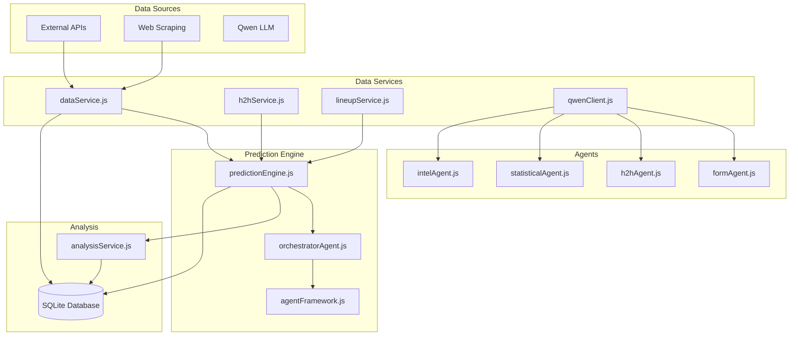
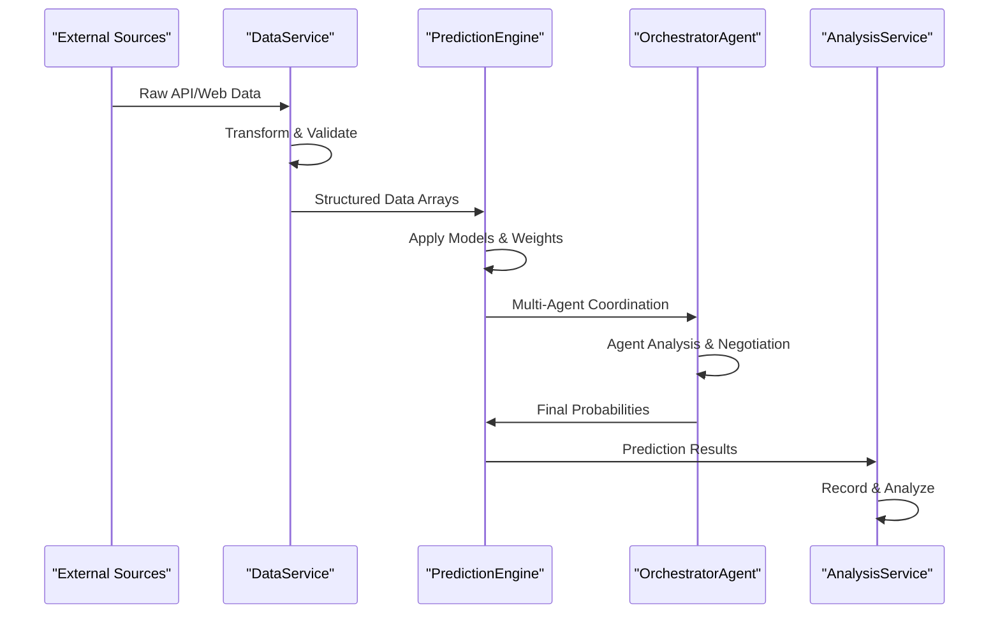
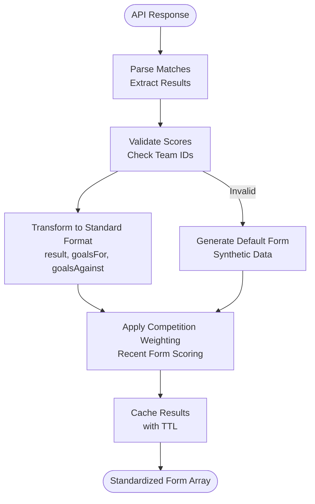
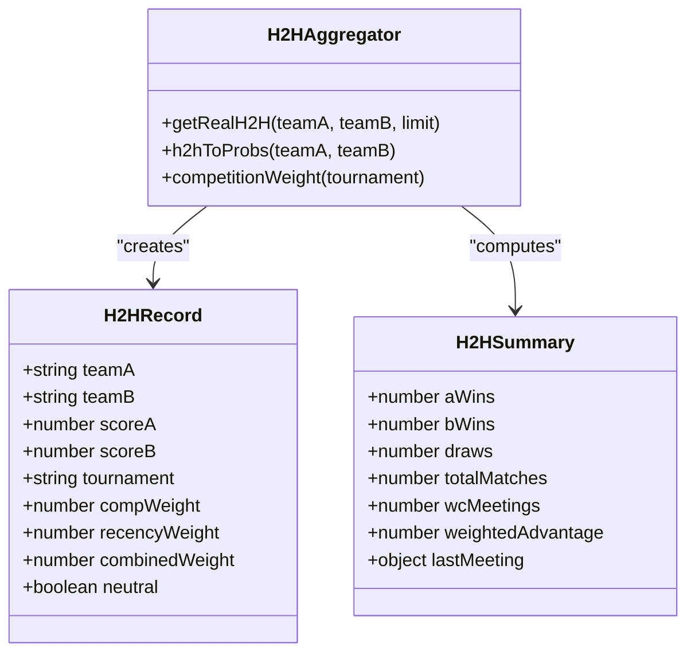
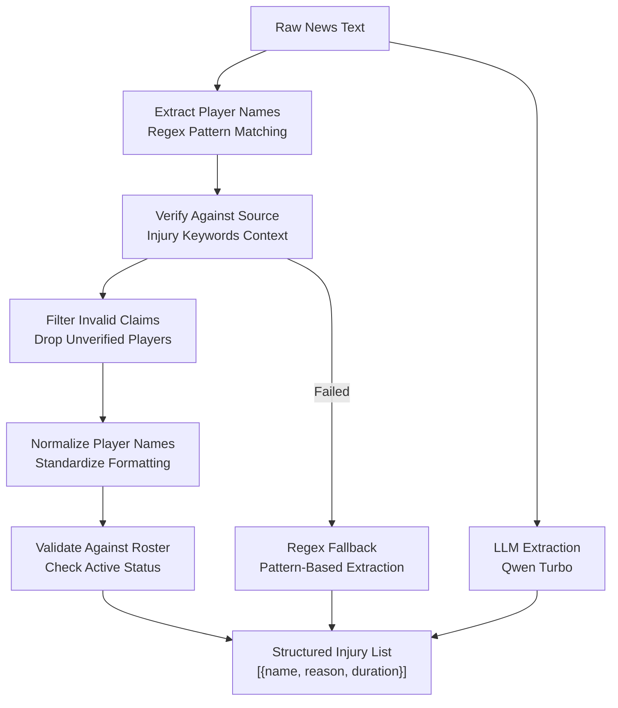
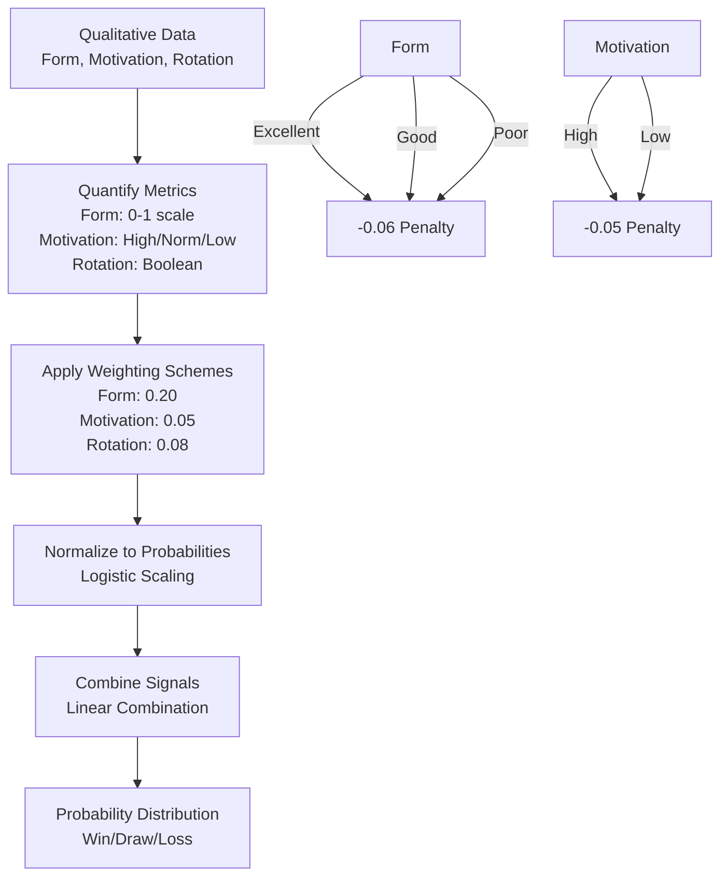
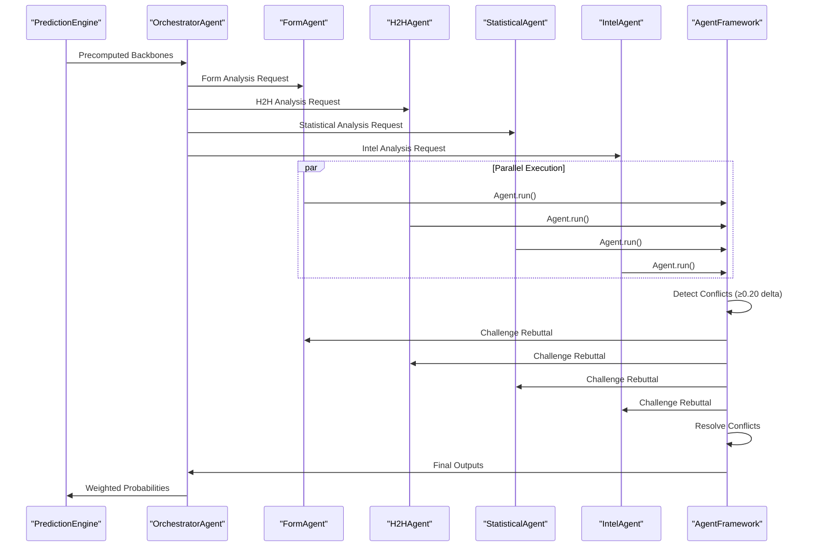
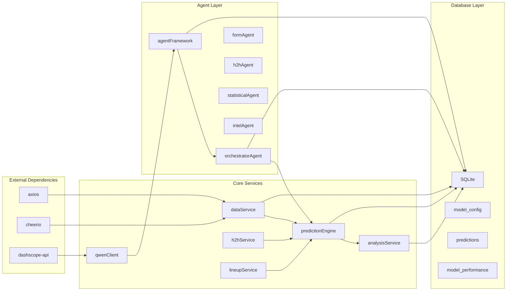

# Data Transformation Pipelines

<cite>
**Referenced Files in This Document**
- [dataService.js](file://backend/services/dataService.js)
- [predictionEngine.js](file://backend/services/predictionEngine.js)
- [analysisService.js](file://backend/services/analysisService.js)
- [h2hService.js](file://backend/services/h2hService.js)
- [lineupService.js](file://backend/services/lineupService.js)
- [qwenClient.js](file://backend/services/qwenClient.js)
- [db.js](file://backend/database/db.js)
- [teams.js](file://backend/data/teams.js)
- [formAgent.js](file://backend/services/agents/formAgent.js)
- [h2hAgent.js](file://backend/services/agents/h2hAgent.js)
- [statisticalAgent.js](file://backend/services/agents/statisticalAgent.js)
- [intelAgent.js](file://backend/services/agents/intelAgent.js)
- [orchestratorAgent.js](file://backend/services/agents/orchestratorAgent.js)
- [agentFramework.js](file://backend/services/agents/agentFramework.js)
</cite>

## Table of Contents
1. [Introduction](#introduction)
2. [Project Structure](#project-structure)
3. [Core Components](#core-components)
4. [Architecture Overview](#architecture-overview)
5. [Detailed Component Analysis](#detailed-component-analysis)
6. [Dependency Analysis](#dependency-analysis)
7. [Performance Considerations](#performance-considerations)
8. [Troubleshooting Guide](#troubleshooting-guide)
9. [Conclusion](#conclusion)

## Introduction

This document explains the data transformation pipelines that convert raw external data into structured formats for the prediction engine. The system processes multiple data sources including API responses, web scraping, and LLM-powered analysis to produce standardized result arrays and probability distributions for match outcomes.

The pipeline encompasses:
- Team form transformation from API responses to standardized result arrays
- Head-to-head data aggregation and scoring normalization
- Injury data processing pipeline from raw text to structured player lists
- Motivation and form assessment algorithms that convert qualitative data into quantitative metrics
- Data validation rules, error correction mechanisms, and data enrichment processes
- Integration with the analysis service for result recording

## Project Structure

The data transformation system is organized around several key services and agents:

**Diagram sources**
- [dataService.js:1-583](file://backend/services/dataService.js#L1-L583)
- [predictionEngine.js:1-1020](file://backend/services/predictionEngine.js#L1-L1020)
- [analysisService.js:1-422](file://backend/services/analysisService.js#L1-L422)

**Section sources**
- [dataService.js:1-583](file://backend/services/dataService.js#L1-L583)
- [predictionEngine.js:1-1020](file://backend/services/predictionEngine.js#L1-L1020)
- [analysisService.js:1-422](file://backend/services/analysisService.js#L1-L422)

## Core Components

### Data Service Layer

The data service layer handles external data acquisition and transformation:

- **Team Form Processing**: Converts API responses into standardized form arrays with result, goals, and competition weighting
- **Head-to-Head Aggregation**: Processes historical match data with competition weighting and recency factors
- **Injury Intelligence Pipeline**: Extracts structured injury data from raw web text using LLM verification
- **Live Result Sync**: Integrates with external APIs to synchronize match results

### Prediction Engine Core

The prediction engine transforms processed data into probability distributions:

- **Dixon-Coles Model**: Implements bivariate Poisson with low-score correction
- **Signal Weighting**: Applies logarithmic pooling to combine multiple prediction signals
- **Normalization Functions**: Converts qualitative assessments to quantitative metrics
- **Confidence Scoring**: Calculates prediction confidence tiers

### Multi-Agent Orchestration

The multi-agent system coordinates specialized agents:

- **Agent Framework**: Provides conflict detection and resolution mechanisms
- **Specialized Agents**: Form, H2H, Statistical, Intel, and Lineup agents
- **Session Management**: Tracks agent interactions and resolutions

**Section sources**
- [dataService.js:44-185](file://backend/services/dataService.js#L44-L185)
- [predictionEngine.js:665-800](file://backend/services/predictionEngine.js#L665-L800)
- [agentFramework.js:1-576](file://backend/services/agents/agentFramework.js#L1-L576)

## Architecture Overview

The data transformation pipeline follows a structured flow from raw external data to standardized prediction results:

**Diagram sources**
- [dataService.js:44-185](file://backend/services/dataService.js#L44-L185)
- [predictionEngine.js:665-800](file://backend/services/predictionEngine.js#L665-L800)
- [orchestratorAgent.js:290-470](file://backend/services/agents/orchestratorAgent.js#L290-L470)

## Detailed Component Analysis

### Team Form Transformation Pipeline

The team form transformation converts raw API responses into standardized result arrays:

**Diagram sources**
- [dataService.js:68-133](file://backend/services/dataService.js#L68-L133)
- [predictionEngine.js:254-281](file://backend/services/predictionEngine.js#L254-L281)

The transformation process includes:
- **Result Classification**: W/L/D determination based on score comparison
- **Competition Weighting**: Higher weights for World Cup and qualifying matches
- **Recency Factors**: Recent matches receive higher weights
- **Synthetic Data Generation**: Default form generation when API data is unavailable

**Section sources**
- [dataService.js:68-185](file://backend/services/dataService.js#L68-L185)
- [predictionEngine.js:254-281](file://backend/services/predictionEngine.js#L254-L281)

### Head-to-Head Data Aggregation

The H2H aggregation combines historical match data with sophisticated weighting:

**Diagram sources**
- [h2hService.js:181-312](file://backend/services/h2hService.js#L181-L312)

The aggregation process applies:
- **Competition Weighting**: World Cup = 4.0, Qualifiers = 2.5, Major = 2.0
- **Recency Weighting**: Most recent = 1.0, Oldest ≈ 0.3
- **Shrinkage to Base Rates**: Prevents overfitting with sparse data
- **Confidence Assessment**: Based on sample size and recency

**Section sources**
- [h2hService.js:55-312](file://backend/services/h2hService.js#L55-L312)

### Injury Data Processing Pipeline

The injury pipeline transforms raw text into structured player lists with validation:

**Diagram sources**
- [dataService.js:271-490](file://backend/services/dataService.js#L271-L490)

The pipeline includes:
- **LLM-Based Extraction**: Structured JSON parsing with injury verification
- **Regex Validation**: Fallback pattern matching for injury mentions
- **Source Context Verification**: Ensures injury claims appear near injury keywords
- **Player Name Normalization**: Handles variations in player naming across sources

**Section sources**
- [dataService.js:271-490](file://backend/services/dataService.js#L271-L490)

### Motivation and Form Assessment Algorithms

The assessment algorithms convert qualitative data into quantitative metrics:

**Diagram sources**
- [predictionEngine.js:269-303](file://backend/services/predictionEngine.js#L269-L303)

The algorithms implement:
- **Form Scoring**: 10-match rolling average with competition weighting
- **Motivation Assessment**: Must-win scenarios vs dead rubbers
- **Rotation Impact**: Squad rotation penalties
- **Synthetic Data Handling**: Default form generation for unavailable data

**Section sources**
- [predictionEngine.js:254-303](file://backend/services/predictionEngine.js#L254-L303)

### Multi-Agent Orchestration System

The multi-agent system coordinates specialized agents with conflict resolution:

**Diagram sources**
- [orchestratorAgent.js:290-470](file://backend/services/agents/orchestratorAgent.js#L290-L470)
- [agentFramework.js:345-493](file://backend/services/agents/agentFramework.js#L345-L493)

**Section sources**
- [orchestratorAgent.js:290-470](file://backend/services/agents/orchestratorAgent.js#L290-L470)
- [agentFramework.js:345-493](file://backend/services/agents/agentFramework.js#L345-L493)

## Dependency Analysis

The data transformation system exhibits well-defined dependencies:

**Diagram sources**
- [dataService.js:7-21](file://backend/services/dataService.js#L7-L21)
- [predictionEngine.js:37-43](file://backend/services/predictionEngine.js#L37-L43)
- [analysisService.js:13-16](file://backend/services/analysisService.js#L13-L16)

**Section sources**
- [dataService.js:7-21](file://backend/services/dataService.js#L7-L21)
- [predictionEngine.js:37-43](file://backend/services/predictionEngine.js#L37-L43)
- [analysisService.js:13-16](file://backend/services/analysisService.js#L13-L16)

## Performance Considerations

The system implements several optimization strategies:

### Caching Strategy
- **Team Form Cache**: 12-hour TTL for form data
- **H2H Cache**: 24-hour TTL for head-to-head data  
- **Intel Cache**: 4-hour TTL for injury intelligence
- **Database Indexing**: Optimized queries for frequent lookups

### Parallel Processing
- **Concurrent Data Fetching**: Promise.all for independent data sources
- **Parallel Agent Execution**: Multi-agent analysis runs concurrently
- **Batch Operations**: SQLite batch inserts for performance

### Memory Management
- **Lazy Loading**: Circular dependency breaking with lazy imports
- **Stream Processing**: Large datasets processed in chunks
- **Connection Pooling**: Efficient database connection reuse

## Troubleshooting Guide

### Common Issues and Solutions

**API Key Configuration**
- Ensure `FOOTBALL_DATA_API_KEY` and `DASHSCOPE_API_KEY` are set
- Verify API quotas and rate limits are not exceeded
- Check network connectivity to external services

**Data Validation Failures**
- Team ID mismatches: Verify TEAM_ID_MAP consistency
- Score validation: Check for null or invalid scores
- Competition weighting: Ensure tournament names match expected patterns

**LLM Parsing Errors**
- JSON extraction failures: Implement retry logic with stricter prompts
- Model availability: Monitor API status and implement fallbacks
- Context length: Optimize prompts to fit model limits

**Database Issues**
- Lock contention: Implement retry logic for concurrent writes
- Schema migrations: Ensure proper migration execution
- Index optimization: Monitor slow queries and add appropriate indexes

**Section sources**
- [dataService.js:18-28](file://backend/services/dataService.js#L18-L28)
- [qwenClient.js:60-101](file://backend/services/qwenClient.js#L60-L101)
- [db.js:10-21](file://backend/database/db.js#L10-L21)

## Conclusion

The data transformation pipeline demonstrates a sophisticated approach to converting diverse external data sources into standardized prediction results. The system balances multiple data streams through weighted aggregation, implements robust validation and error correction mechanisms, and provides extensible architecture for future enhancements.

Key strengths include:
- Comprehensive data validation and error handling
- Multi-layer caching for performance optimization
- Flexible agent-based architecture for specialized analysis
- Robust integration with external APIs and LLM services
- Comprehensive database schema supporting both prediction and analysis workflows

The pipeline successfully transforms raw external data into actionable insights while maintaining data integrity and system reliability.