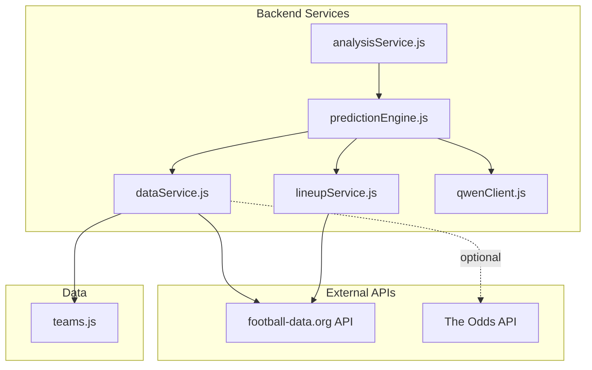
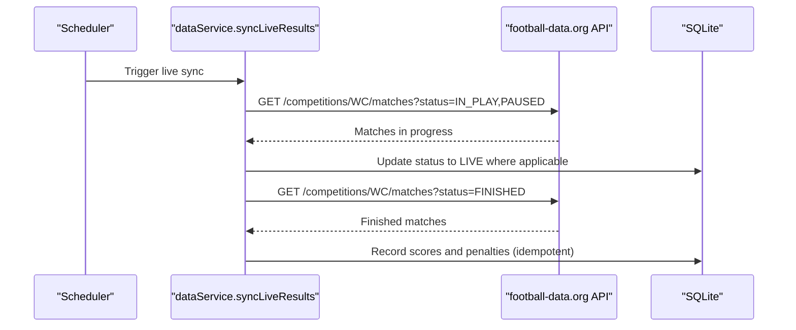
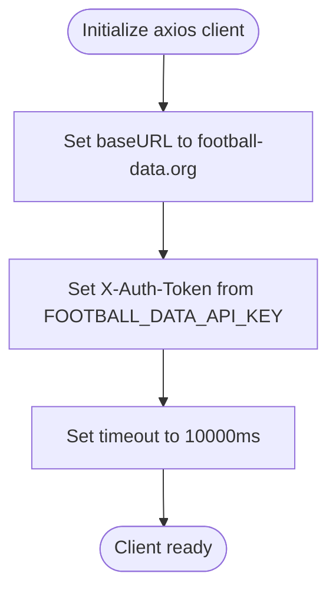
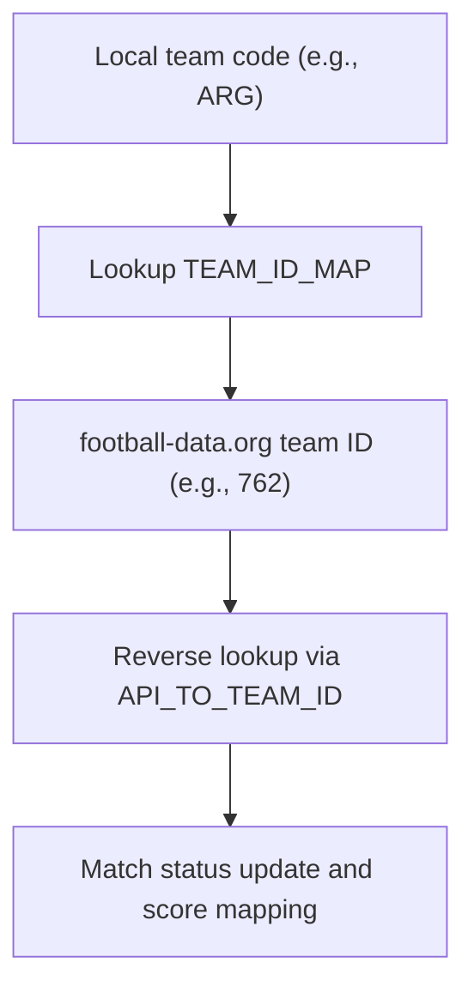
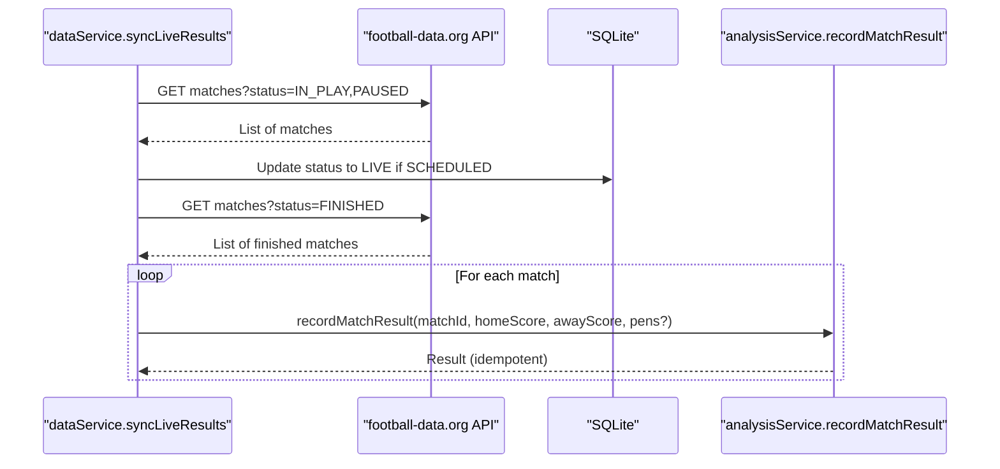
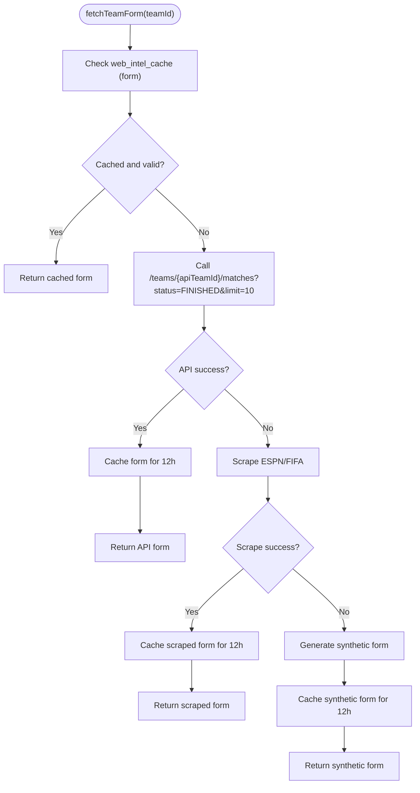
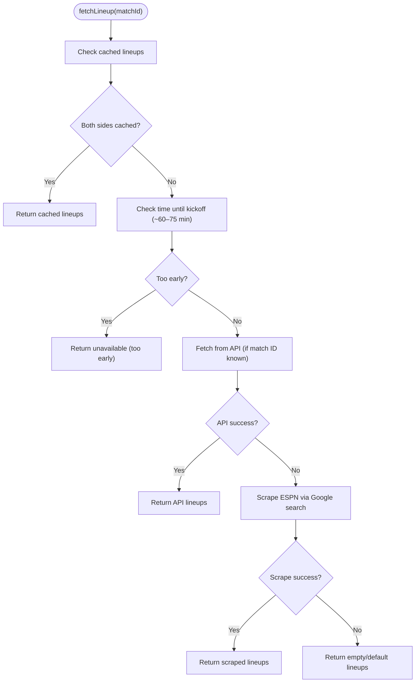
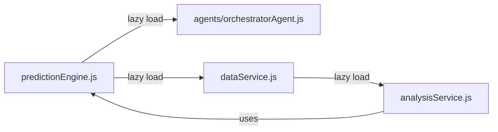
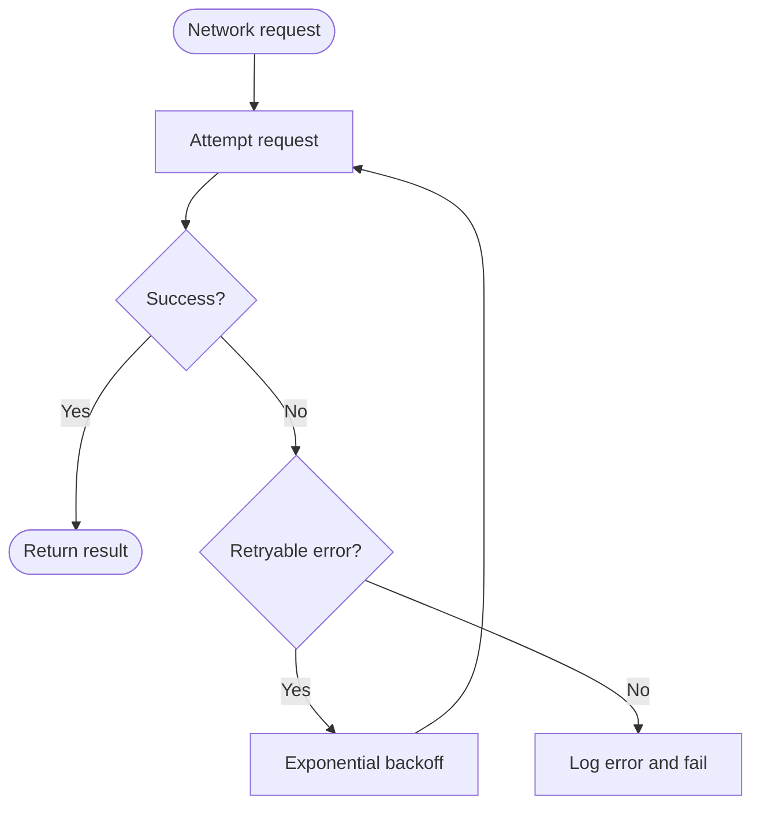
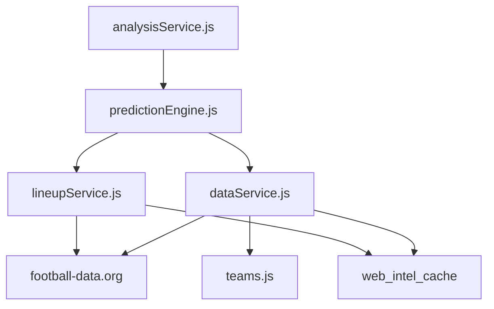

# External API Integration

<cite>
**Referenced Files in This Document**
- [dataService.js](file://backend/services/dataService.js)
- [lineupService.js](file://backend/services/lineupService.js)
- [predictionEngine.js](file://backend/services/predictionEngine.js)
- [analysisService.js](file://backend/services/analysisService.js)
- [teams.js](file://backend/data/teams.js)
- [qwenClient.js](file://backend/services/qwenClient.js)
- [README.md](file://README.md)
- [SETUP.md](file://SETUP.md)
</cite>

## Table of Contents
1. [Introduction](#introduction)
2. [Project Structure](#project-structure)
3. [Core Components](#core-components)
4. [Architecture Overview](#architecture-overview)
5. [Detailed Component Analysis](#detailed-component-analysis)
6. [Dependency Analysis](#dependency-analysis)
7. [Performance Considerations](#performance-considerations)
8. [Troubleshooting Guide](#troubleshooting-guide)
9. [Conclusion](#conclusion)

## Introduction
This document explains the external API integration for football-data.org within the system. It covers authentication, rate-limiting considerations, request patterns, client configuration, error handling, retry mechanisms, fallback strategies, team ID mapping, live result synchronization, match status tracking, score updating, API key management, timeouts, and network error handling. It also addresses circular dependency resolution for prediction engine integration.

## Project Structure
The external API integration spans several backend services:
- Data service: centralizes API client configuration, caching, and fallback logic for team form and head-to-head data.
- Lineup service: fetches confirmed lineups from the API or web scrapes.
- Prediction engine: orchestrates predictions and integrates with agents while avoiding circular dependencies.
- Analysis service: records match results and handles idempotent updates.
- Teams data: static team metadata and schedule used for mapping and display.
- Qwen client: provides robust retry logic for LLM calls (relevant for multi-agent orchestration).

**Diagram sources**
- [dataService.js:24-28](file://backend/services/dataService.js#L24-L28)
- [lineupService.js:84-92](file://backend/services/lineupService.js#L84-L92)
- [predictionEngine.js:37-53](file://backend/services/predictionEngine.js#L37-L53)
- [analysisService.js:76-94](file://backend/services/analysisService.js#L76-L94)
- [teams.js:1-234](file://backend/data/teams.js#L1-L234)
- [qwenClient.js:86-101](file://backend/services/qwenClient.js#L86-L101)

**Section sources**
- [dataService.js:24-28](file://backend/services/dataService.js#L24-L28)
- [lineupService.js:84-92](file://backend/services/lineupService.js#L84-L92)
- [predictionEngine.js:37-53](file://backend/services/predictionEngine.js#L37-L53)
- [analysisService.js:76-94](file://backend/services/analysisService.js#L76-L94)
- [teams.js:1-234](file://backend/data/teams.js#L1-L234)
- [qwenClient.js:86-101](file://backend/services/qwenClient.js#L86-L101)

## Core Components
- API client configuration and authentication:
  - Base URL and authentication header are configured centrally.
  - Timeout is set for all requests.
  - API key is loaded from environment variables.
- Team ID mapping:
  - Local 3-letter codes mapped to football-data.org numeric IDs.
  - Reverse mapping supports live result synchronization.
- Live result synchronization:
  - Queries matches by status, maps to local matches, flips status to LIVE, and records final scores.
- Fallback strategies:
  - Web scraping for form and lineup when API is unavailable.
  - Synthetic form generation when scraping fails.
- Circular dependency resolution:
  - Lazy loading of interdependent modules to prevent cycles.

**Section sources**
- [dataService.js:18-28](file://backend/services/dataService.js#L18-L28)
- [dataService.js:47-66](file://backend/services/dataService.js#L47-L66)
- [dataService.js:507-526](file://backend/services/dataService.js#L507-L526)
- [dataService.js:531-577](file://backend/services/dataService.js#L531-L577)
- [lineupService.js:84-113](file://backend/services/lineupService.js#L84-L113)
- [lineupService.js:116-155](file://backend/services/lineupService.js#L116-L155)
- [predictionEngine.js:45-53](file://backend/services/predictionEngine.js#L45-L53)

## Architecture Overview
The system integrates football-data.org for live scores and team form, with robust fallbacks and caching. The prediction engine coordinates multiple agents and signals, while avoiding circular dependencies through lazy module loading.

**Diagram sources**
- [dataService.js:495-580](file://backend/services/dataService.js#L495-L580)

**Section sources**
- [dataService.js:495-580](file://backend/services/dataService.js#L495-L580)

## Detailed Component Analysis

### API Client Configuration and Authentication
- Base URL: football-data.org v4 endpoint.
- Authentication: X-Auth-Token header populated from environment variable.
- Timeout: 10 seconds for primary data service requests.
- Rate limiting: free tier allows approximately 10 requests per minute; throttling is handled by the client and external service.

**Diagram sources**
- [dataService.js:24-28](file://backend/services/dataService.js#L24-L28)

**Section sources**
- [dataService.js:18-28](file://backend/services/dataService.js#L18-L28)
- [README.md:144-145](file://README.md#L144-L145)
- [SETUP.md:56-62](file://SETUP.md#L56-L62)

### Team ID Mapping System
- Local team codes (3-letter) mapped to football-data.org numeric IDs.
- Reverse mapping enables live result synchronization by matching API home/away teams to local matches.
- Validation logs unknown API team IDs and skips affected matches.

**Diagram sources**
- [dataService.js:47-66](file://backend/services/dataService.js#L47-L66)
- [dataService.js:507-526](file://backend/services/dataService.js#L507-L526)

**Section sources**
- [dataService.js:47-66](file://backend/services/dataService.js#L47-L66)
- [dataService.js:507-526](file://backend/services/dataService.js#L507-L526)

### Live Result Synchronization
- Status flip: in-progress matches are marked LIVE to prevent prediction re-computation during the match window.
- Final scores: finished matches are recorded with penalties if present.
- Idempotency: repeated runs do not re-record identical scores.
- Error handling: failures are logged and do not abort the entire sync.

**Diagram sources**
- [dataService.js:528-577](file://backend/services/dataService.js#L528-L577)
- [analysisService.js:76-94](file://backend/services/analysisService.js#L76-L94)

**Section sources**
- [dataService.js:528-577](file://backend/services/dataService.js#L528-L577)
- [analysisService.js:76-94](file://backend/services/analysisService.js#L76-L94)

### Request Patterns and Caching
- Team form: fetches last 10 finished matches; caches for 12 hours.
- Head-to-head: filters matches by opponent; caches for 24 hours.
- Injury/news: caches for 4 hours to refresh frequently.
- Fallbacks: web scraping from ESPN/FIFA; synthetic form generation when necessary.

**Diagram sources**
- [dataService.js:68-133](file://backend/services/dataService.js#L68-L133)
- [dataService.js:135-169](file://backend/services/dataService.js#L135-L169)
- [dataService.js:171-185](file://backend/services/dataService.js#L171-L185)

**Section sources**
- [dataService.js:68-133](file://backend/services/dataService.js#L68-L133)
- [dataService.js:135-169](file://backend/services/dataService.js#L135-L169)
- [dataService.js:171-185](file://backend/services/dataService.js#L171-L185)

### Lineup Fetching and Fallbacks
- API fetch: retrieves confirmed lineups shortly before kickoff.
- Web scrape: Google search + ESPN page parsing for lineups.
- Strength scoring: computes a normalized strength score from starters and team ELO.
- Key absence detection: compares current starters to historical patterns.

**Diagram sources**
- [lineupService.js:221-279](file://backend/services/lineupService.js#L221-L279)
- [lineupService.js:84-113](file://backend/services/lineupService.js#L84-L113)
- [lineupService.js:116-155](file://backend/services/lineupService.js#L116-L155)

**Section sources**
- [lineupService.js:221-279](file://backend/services/lineupService.js#L221-L279)
- [lineupService.js:84-113](file://backend/services/lineupService.js#L84-L113)
- [lineupService.js:116-155](file://backend/services/lineupService.js#L116-L155)

### Circular Dependency Resolution
- Prediction engine lazily loads the orchestrator agent to avoid a cycle with specialist agents.
- Data service uses lazy loading for analysis service to record match results, preventing cycles with prediction engine.
- This pattern ensures clean separation and safe initialization order.

**Diagram sources**
- [predictionEngine.js:45-53](file://backend/services/predictionEngine.js#L45-L53)
- [dataService.js:10-16](file://backend/services/dataService.js#L10-L16)

**Section sources**
- [predictionEngine.js:45-53](file://backend/services/predictionEngine.js#L45-L53)
- [dataService.js:10-16](file://backend/services/dataService.js#L10-L16)

### Error Handling and Retry Mechanisms
- Network errors: logged and retried where appropriate.
- API key missing: live sync is skipped with a warning.
- Idempotent writes: prevents duplicate side effects on repeated runs.
- LLM retry logic: exponential backoff for transient failures.

**Diagram sources**
- [dataService.js:540-542](file://backend/services/dataService.js#L540-L542)
- [dataService.js:575-577](file://backend/services/dataService.js#L575-L577)
- [qwenClient.js:86-101](file://backend/services/qwenClient.js#L86-L101)

**Section sources**
- [dataService.js:540-542](file://backend/services/dataService.js#L540-L542)
- [dataService.js:575-577](file://backend/services/dataService.js#L575-L577)
- [qwenClient.js:86-101](file://backend/services/qwenClient.js#L86-L101)

## Dependency Analysis
- External dependencies:
  - football-data.org API for live scores, team form, and head-to-head data.
  - The Odds API for betting odds (optional).
  - Web scraping targets (ESPN/FIFA) for fallbacks.
- Internal dependencies:
  - dataService depends on SQLite cache and teams metadata.
  - predictionEngine depends on dataService, lineupService, and agents.
  - analysisService depends on predictionEngine indirectly via dataService.

**Diagram sources**
- [dataService.js:68-133](file://backend/services/dataService.js#L68-L133)
- [lineupService.js:84-113](file://backend/services/lineupService.js#L84-L113)
- [predictionEngine.js:37-53](file://backend/services/predictionEngine.js#L37-L53)
- [analysisService.js:76-94](file://backend/services/analysisService.js#L76-L94)
- [teams.js:1-234](file://backend/data/teams.js#L1-L234)

**Section sources**
- [dataService.js:68-133](file://backend/services/dataService.js#L68-L133)
- [lineupService.js:84-113](file://backend/services/lineupService.js#L84-L113)
- [predictionEngine.js:37-53](file://backend/services/predictionEngine.js#L37-L53)
- [analysisService.js:76-94](file://backend/services/analysisService.js#L76-L94)
- [teams.js:1-234](file://backend/data/teams.js#L1-L234)

## Performance Considerations
- Caching reduces API calls and improves responsiveness.
- Timeouts prevent long-blocking requests.
- Lazy loading avoids unnecessary module initialization.
- Web scraping is used sparingly and only when API data is unavailable.

## Troubleshooting Guide
- Missing API key:
  - Symptom: live sync logs warnings and skips updates.
  - Action: set FOOTBALL_DATA_API_KEY in environment.
- Unknown team IDs:
  - Symptom: matches skipped with warnings during live sync.
  - Action: verify TEAM_ID_MAP and API_TO_TEAM_ID mappings.
- Null scores:
  - Symptom: matches skipped due to missing full-time scores.
  - Action: wait for API to populate scores or check penalties availability.
- Network timeouts or 5xx errors:
  - Symptom: retries occur with exponential backoff; failures logged.
  - Action: monitor external service health and adjust timeouts if needed.
- Idempotent recording:
  - Symptom: repeated runs do not re-record identical scores.
  - Action: expected behavior; indicates correct idempotency.

**Section sources**
- [dataService.js:496-499](file://backend/services/dataService.js#L496-L499)
- [dataService.js:510-512](file://backend/services/dataService.js#L510-L512)
- [dataService.js:558-560](file://backend/services/dataService.js#L558-L560)
- [qwenClient.js:86-101](file://backend/services/qwenClient.js#L86-L101)
- [analysisService.js:88-94](file://backend/services/analysisService.js#L88-L94)

## Conclusion
The external API integration leverages football-data.org for live scores and team form, with robust caching, fallbacks, and idempotent writes. The system avoids circular dependencies through lazy loading and provides clear error handling and retry strategies. Proper API key management and awareness of rate limits ensure reliable operation.