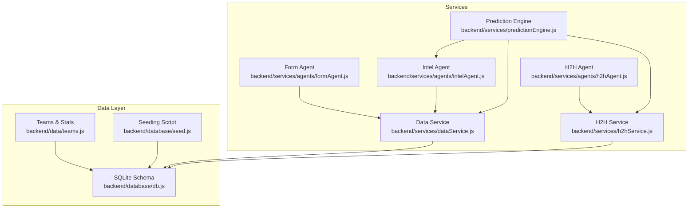
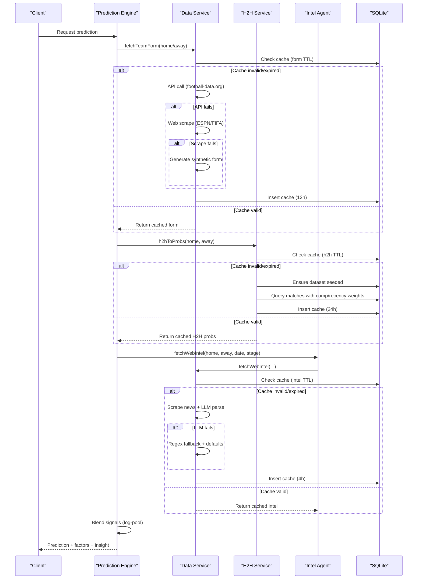
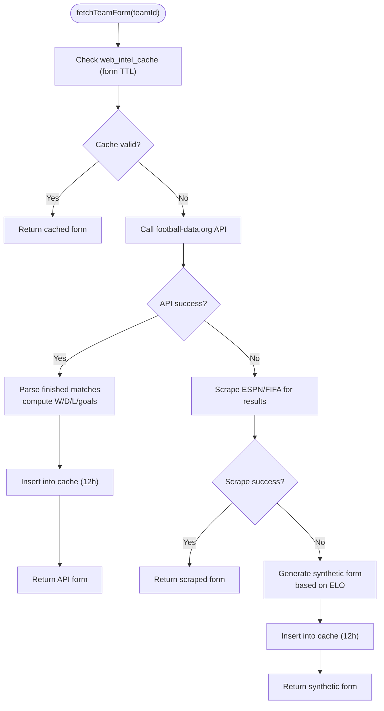
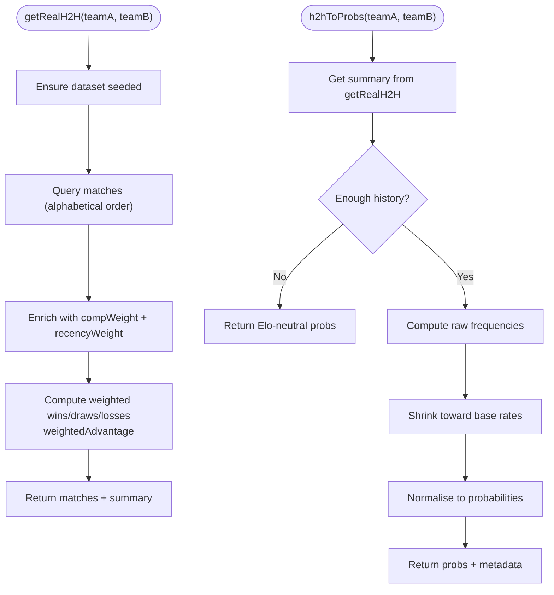
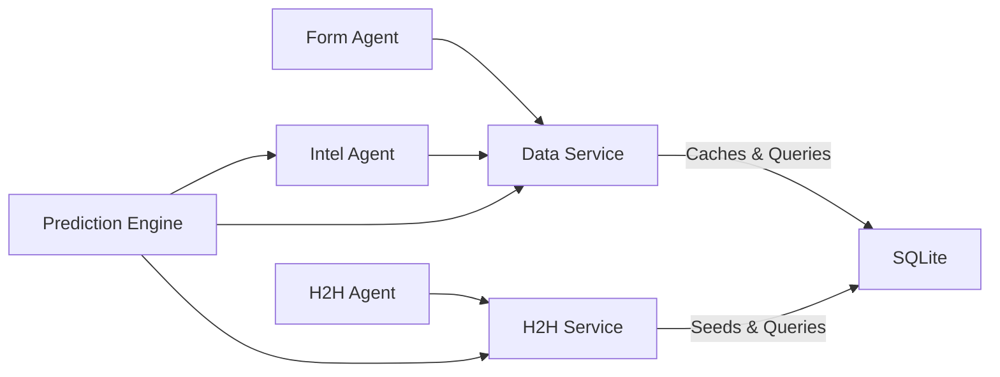

# Historical Data Services

<cite>
**Referenced Files in This Document**
- [teams.js](file://backend/data/teams.js)
- [db.js](file://backend/database/db.js)
- [seed.js](file://backend/database/seed.js)
- [dataService.js](file://backend/services/dataService.js)
- [h2hService.js](file://backend/services/h2hService.js)
- [formAgent.js](file://backend/services/agents/formAgent.js)
- [h2hAgent.js](file://backend/services/agents/h2hAgent.js)
- [intelAgent.js](file://backend/services/agents/intelAgent.js)
- [predictionEngine.js](file://backend/services/predictionEngine.js)
- [SPEC.md](file://specs/SPEC.md)
</cite>

## Table of Contents
1. [Introduction](#introduction)
2. [Project Structure](#project-structure)
3. [Core Components](#core-components)
4. [Architecture Overview](#architecture-overview)
5. [Detailed Component Analysis](#detailed-component-analysis)
6. [Dependency Analysis](#dependency-analysis)
7. [Performance Considerations](#performance-considerations)
8. [Troubleshooting Guide](#troubleshooting-guide)
9. [Conclusion](#conclusion)

## Introduction
This document explains the historical data services powering team form tracking and head-to-head (H2H) analysis. It details how recent form is fetched from APIs and web scraping, how synthetic data is generated when needed, and how the system maps between internal team IDs and external API identifiers. It also documents the H2H service that leverages a 47,000-match dataset, applies competition weighting and recency, and generates Elo-based defaults when historical data is insufficient. Cache management strategies are covered with distinct TTLs for form (12h), H2H (24h), and intelligence (4h). Finally, it describes error handling, data freshness policies, and the relationship with the prediction engine for historical pattern analysis.

## Project Structure
The historical data services span several modules:
- Data seeding and schema: teams and matches are seeded and persisted in a SQLite database.
- Data service: orchestrates API retrieval, web scraping, synthetic generation, and caching for form and intelligence.
- H2H service: manages the 47k match dataset, competition weighting, recency weighting, and conversion to probabilities.
- Agents: specialized modules that consume historical data and interpret it for the prediction engine.
- Prediction engine: blends historical signals (form, H2H, intelligence) with backbone models to produce predictions.

**Diagram sources**
- [teams.js:1-234](file://backend/data/teams.js#L1-234)
- [db.js:23-208](file://backend/database/db.js#L23-208)
- [seed.js:9-65](file://backend/database/seed.js#L9-65)
- [dataService.js:68-133](file://backend/services/dataService.js#L68-133)
- [h2hService.js:192-312](file://backend/services/h2hService.js#L192-312)
- [formAgent.js:42-102](file://backend/services/agents/formAgent.js#L42-102)
- [h2hAgent.js:38-96](file://backend/services/agents/h2hAgent.js#L38-96)
- [intelAgent.js:50-117](file://backend/services/agents/intelAgent.js#L50-117)
- [predictionEngine.js:691-800](file://backend/services/predictionEngine.js#L691-800)

**Section sources**
- [teams.js:1-234](file://backend/data/teams.js#L1-234)
- [db.js:23-208](file://backend/database/db.js#L23-208)
- [seed.js:9-65](file://backend/database/seed.js#L9-65)

## Core Components
- Team form tracking: fetches recent results from an API, falls back to web scraping, and generates synthetic form when necessary. Results are cached with a 12-hour TTL.
- Head-to-head analysis: loads and seeds a 47k match dataset, applies competition and recency weighting, and converts records to probabilities. Defaults to Elo-based probabilities when insufficient data exists. Cached with a 24-hour TTL.
- Pre-match intelligence: scrapes news, validates claims against source text, and structures signals for the prediction engine. Cached with a 4-hour TTL.
- Cache validation: unified TTL checks ensure data freshness across all domains.
- Relationship with prediction engine: historical signals inform both the backbone model and multi-agent interpretation.

**Section sources**
- [dataService.js:30-41](file://backend/services/dataService.js#L30-41)
- [dataService.js:68-133](file://backend/services/dataService.js#L68-133)
- [h2hService.js:26-165](file://backend/services/h2hService.js#L26-165)
- [h2hService.js:272-312](file://backend/services/h2hService.js#L272-312)
- [intelAgent.js:50-117](file://backend/services/agents/intelAgent.js#L50-117)
- [predictionEngine.js:691-800](file://backend/services/predictionEngine.js#L691-800)

## Architecture Overview
The historical data pipeline integrates external APIs, web scraping, and synthetic generation, with robust caching and validation. Agents consume processed historical signals and feed them into the prediction engine.

**Diagram sources**
- [dataService.js:68-133](file://backend/services/dataService.js#L68-133)
- [h2hService.js:192-312](file://backend/services/h2hService.js#L192-312)
- [intelAgent.js:50-117](file://backend/services/agents/intelAgent.js#L50-117)
- [predictionEngine.js:691-800](file://backend/services/predictionEngine.js#L691-800)

## Detailed Component Analysis

### Team Form Tracking Pipeline
The form tracking system retrieves recent results for a team, parses outcomes, and caches the results. It follows a strict fallback chain: API → web scraping → synthetic generation. Cache validation ensures freshness with a 12-hour TTL.

**Diagram sources**
- [dataService.js:68-133](file://backend/services/dataService.js#L68-133)
- [dataService.js:135-185](file://backend/services/dataService.js#L135-185)

**Section sources**
- [dataService.js:68-133](file://backend/services/dataService.js#L68-133)
- [dataService.js:135-185](file://backend/services/dataService.js#L135-185)

### TEAM_ID_MAP and Reverse Mapping
The system maintains a mapping between internal team IDs and the external API’s team IDs. A reverse mapping is computed to reconcile API responses with internal storage.

- TEAM_ID_MAP: Internal 3-letter code → API team ID.
- API_TO_TEAM_ID: Reverse mapping for reconciling API responses.

These mappings are essential for syncing live results and for H2H queries that rely on API team IDs.

**Section sources**
- [dataService.js:51-66](file://backend/services/dataService.js#L51-66)
- [dataService.js:527-544](file://backend/services/dataService.js#L527-544)

### H2H Record System and Elo-Based Defaults
The H2H service manages a 47,000-match dataset, applying competition weighting and recency weighting. When sufficient data exists, it computes weighted advantages and converts them to probabilities. With insufficient data, it falls back to Elo-based defaults.

**Diagram sources**
- [h2hService.js:192-266](file://backend/services/h2hService.js#L192-266)
- [h2hService.js:272-312](file://backend/services/h2hService.js#L272-312)

**Section sources**
- [h2hService.js:192-266](file://backend/services/h2hService.js#L192-266)
- [h2hService.js:272-312](file://backend/services/h2hService.js#L272-312)

### Cache Management Strategies
The system uses a unified cache table and TTL constants to manage freshness across domains:
- Form: 12 hours
- H2H: 24 hours
- Intelligence: 4 hours

Cache validation compares fetched timestamps against TTL thresholds. On expiration, the system refreshes data and updates expiry timestamps.

**Section sources**
- [dataService.js:30-41](file://backend/services/dataService.js#L30-41)
- [dataService.js:68-133](file://backend/services/dataService.js#L68-133)
- [h2hService.js:95-165](file://backend/services/h2hService.js#L95-165)

### Data Freshness Policies and Error Handling
- Freshness: Predictions are refreshed nightly and while matches are scheduled; once live, predictions are locked to preserve pre-match state.
- Error handling: Each domain operation logs warnings on failures and falls back to safer defaults (scraping → synthetic generation; LLM → regex fallback; API → dataset defaults).
- Integrity: Live result sync reconciles API home/away mismatches using reverse mappings and records results atomically.

**Section sources**
- [SPEC.md:170-199](file://specs/SPEC.md#L170-L199)
- [dataService.js:112-124](file://backend/services/dataService.js#L112-124)
- [dataService.js:230-233](file://backend/services/dataService.js#L230-233)
- [dataService.js:490-501](file://backend/services/dataService.js#L490-501)
- [dataService.js:526-544](file://backend/services/dataService.js#L526-544)

### Relationship with the Prediction Engine
The prediction engine consumes historical signals:
- Form: computed from recent results and converted to probabilities.
- H2H: competition-weighted record translated to probabilities.
- Intelligence: structured signals (injuries, motivation, rotation) interpreted to adjust probabilities.
- Backboning: the engine’s Dixon–Coles Poisson model provides a stable baseline; historical signals are blended via log-pool weighting.

Agents complement the engine by interpreting signals and offering alternative perspectives when multi-agent mode is enabled.

**Section sources**
- [predictionEngine.js:240-303](file://backend/services/predictionEngine.js#L240-303)
- [predictionEngine.js:691-800](file://backend/services/predictionEngine.js#L691-800)
- [formAgent.js:42-102](file://backend/services/agents/formAgent.js#L42-102)
- [h2hAgent.js:38-96](file://backend/services/agents/h2hAgent.js#L38-96)
- [intelAgent.js:50-117](file://backend/services/agents/intelAgent.js#L50-117)

## Dependency Analysis
Historical data services depend on:
- Database schema for caching and persistence.
- External API (football-data.org) for live and recent results.
- Web scraping for form and intelligence when APIs fail.
- Synthetic generation for defaults when no data is available.
- Agents for structured interpretation of historical signals.

**Diagram sources**
- [dataService.js:68-133](file://backend/services/dataService.js#L68-133)
- [h2hService.js:95-165](file://backend/services/h2hService.js#L95-165)
- [formAgent.js:13-15](file://backend/services/agents/formAgent.js#L13-15)
- [h2hAgent.js:14-16](file://backend/services/agents/h2hAgent.js#L14-16)
- [intelAgent.js:16-18](file://backend/services/agents/intelAgent.js#L16-18)
- [predictionEngine.js:39-41](file://backend/services/predictionEngine.js#L39-41)

**Section sources**
- [db.js:147-157](file://backend/database/db.js#L147-157)
- [dataService.js:68-133](file://backend/services/dataService.js#L68-133)
- [h2hService.js:95-165](file://backend/services/h2hService.js#L95-165)

## Performance Considerations
- Parallelization: The system fetches form for both teams concurrently and performs parallel scraping for intelligence.
- Lightweight caching: SQLite cache avoids repeated network calls and reduces latency.
- Conservative shinkage: H2H probabilities shrink toward base rates to prevent overfitting on sparse data.
- Goal-channel nudges: Small λ adjustments keep the backbone dominant while incorporating form/intel signals.

[No sources needed since this section provides general guidance]

## Troubleshooting Guide
Common issues and resolutions:
- API failures: The system logs warnings and falls back to scraping or synthetic generation. Verify API keys and endpoint availability.
- Scrape failures: If web scraping fails, synthetic form is generated and cached. Monitor target sites for changes.
- Insufficient H2H data: When fewer than two meetings exist, Elo-neutral probabilities are returned. This is expected for new pairings.
- Cache staleness: Ensure cache TTLs are respected and that the cache table is properly indexed for fast lookups.
- Live result reconciliation: If API home/away differs from DB, the sync routine swaps scores accordingly.

**Section sources**
- [dataService.js:112-124](file://backend/services/dataService.js#L112-124)
- [dataService.js:230-233](file://backend/services/dataService.js#L230-233)
- [h2hService.js:275-278](file://backend/services/h2hService.js#L275-278)
- [dataService.js:526-544](file://backend/services/dataService.js#L526-544)

## Conclusion
The historical data services provide robust, layered ingestion of team form, head-to-head records, and pre-match intelligence. Through API-first design, web scraping fallback, and synthetic generation, the system remains resilient and accurate. Competition and recency weighting, combined with Elo-based defaults, ensure meaningful H2H signals even for sparse histories. Unified caching and validation maintain data freshness, while the prediction engine blends these signals with a strong backbone model to deliver reliable predictions.