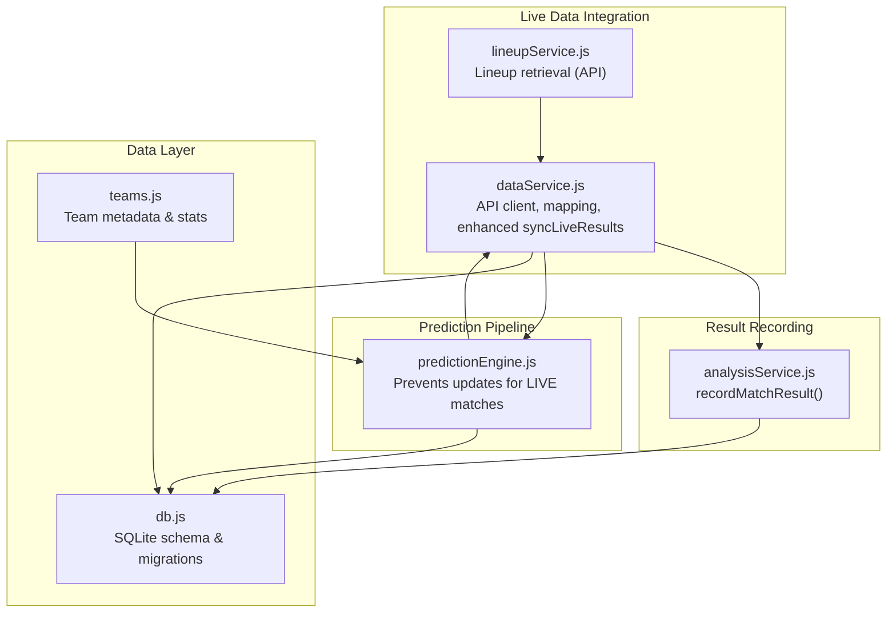
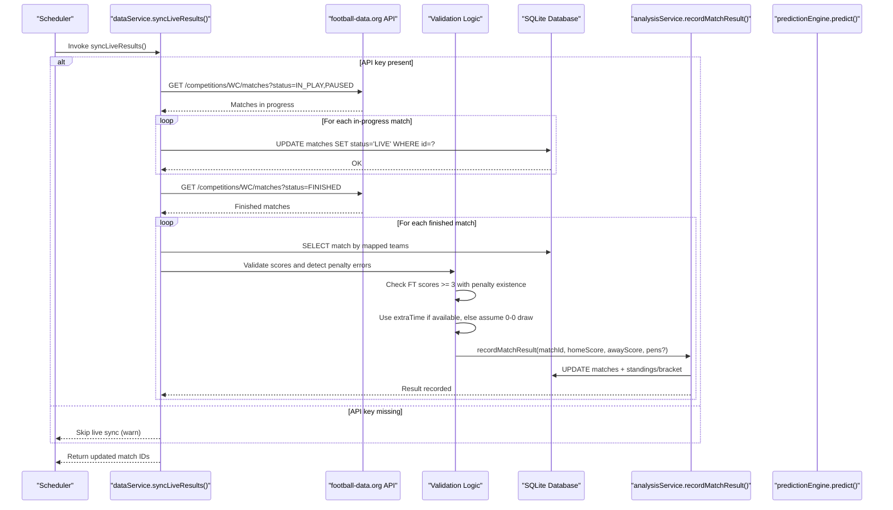
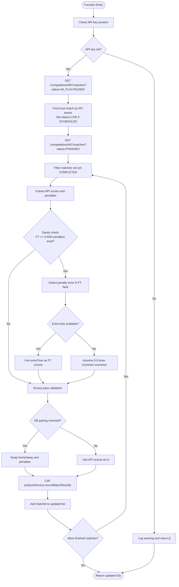
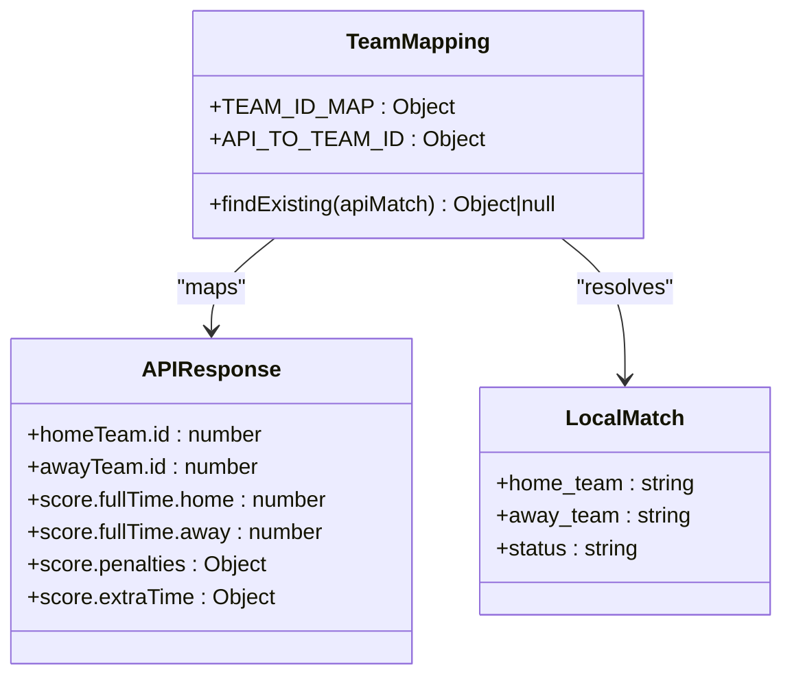
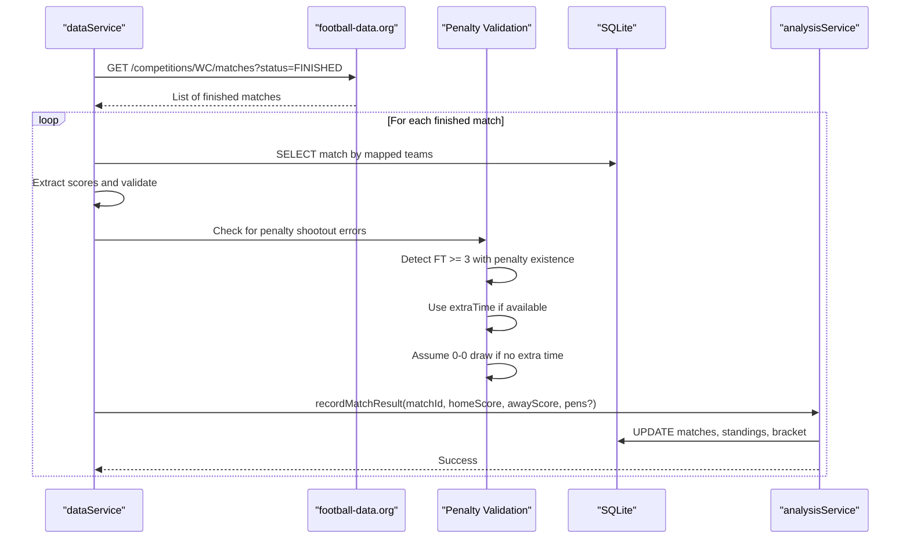
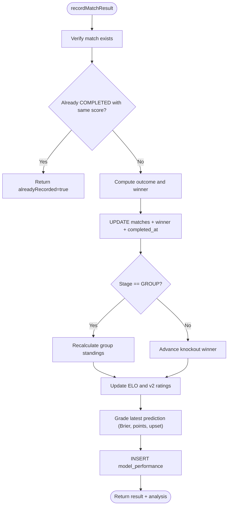
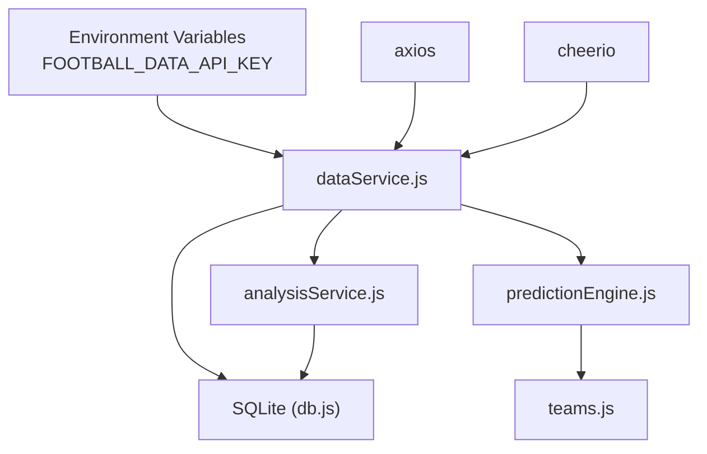

# Live Data Integration

<cite>
**Referenced Files in This Document**
- [dataService.js](file://backend/services/dataService.js)
- [analysisService.js](file://backend/services/analysisService.js)
- [predictionEngine.js](file://backend/services/predictionEngine.js)
- [db.js](file://backend/database/db.js)
- [teams.js](file://backend/data/teams.js)
- [lineupService.js](file://backend/services/lineupService.js)
</cite>

## Update Summary
**Changes Made**
- Enhanced syncLiveResults function documentation with sophisticated penalty shootout validation logic
- Added comprehensive sanity checks for detecting incorrectly placed penalty scores in full-time fields
- Updated data synchronization pipeline to include automatic correction mechanisms for improved accuracy
- Revised detailed component analysis to reflect the new validation and correction capabilities

## Table of Contents
1. [Introduction](#introduction)
2. [Project Structure](#project-structure)
3. [Core Components](#core-components)
4. [Architecture Overview](#architecture-overview)
5. [Detailed Component Analysis](#detailed-component-analysis)
6. [Dependency Analysis](#dependency-analysis)
7. [Performance Considerations](#performance-considerations)
8. [Troubleshooting Guide](#troubleshooting-guide)
9. [Conclusion](#conclusion)

## Introduction
This document explains the live data integration system that synchronizes real-time match data from the football-data.org API. It covers the enhanced syncLiveResults function implementation with sophisticated validation logic to detect and correct penalty shootout scores incorrectly placed in full-time fields, API client configuration, authentication handling, match status tracking, and the end-to-end data synchronization pipeline. It also documents the team ID mapping system for API compatibility, reverse lookup functionality, error handling strategies, rate limiting considerations, retry mechanisms, fallback strategies for API failures, integration with the prediction engine to prevent prediction updates during active matches, caching strategies for live data, and the relationship with the analysis service for result recording.

## Project Structure
The live data integration spans several backend modules:
- Data service: Provides API client configuration, authentication, team ID mapping, and the enhanced syncLiveResults function with sophisticated validation logic.
- Analysis service: Records match results, updates standings, advances brackets, and triggers model performance updates.
- Prediction engine: Prevents prediction updates for matches marked as LIVE and generates predictions for scheduled matches.
- Database: Defines schema and migration logic for matches, predictions, and supporting tables.
- Teams data: Contains team metadata and statistics used by the prediction engine.



**Diagram sources**
- [dataService.js:18-28](file://backend/services/dataService.js#L18-L28)
- [dataService.js:514-631](file://backend/services/dataService.js#L514-L631)
- [analysisService.js:76-218](file://backend/services/analysisService.js#L76-L218)
- [predictionEngine.js:710-721](file://backend/services/predictionEngine.js#L710-L721)
- [db.js:23-252](file://backend/database/db.js#L23-L252)
- [teams.js:1-234](file://backend/data/teams.js#L1-L234)
- [lineupService.js:268-273](file://backend/services/lineupService.js#L268-L273)

**Section sources**
- [dataService.js:1-631](file://backend/services/dataService.js#L1-L631)
- [analysisService.js:1-422](file://backend/services/analysisService.js#L1-L422)
- [predictionEngine.js:700-922](file://backend/services/predictionEngine.js#L700-L922)
- [db.js:23-252](file://backend/database/db.js#L23-L252)
- [teams.js:1-234](file://backend/data/teams.js#L1-L234)
- [lineupService.js:238-273](file://backend/services/lineupService.js#L238-L273)

## Core Components
- API client configuration and authentication:
  - Base URL and headers configured with X-Auth-Token header.
  - Timeout set for requests.
  - Environment variable FOOTBALL_DATA_API_KEY required for live sync.
- Team ID mapping system:
  - Forward mapping: TEAMS to football-data.org numeric IDs.
  - Reverse mapping: football-data.org IDs to internal 3-letter codes.
  - Used to reconcile API responses with local matches.
- Enhanced live sync pipeline:
  - Detects in-progress matches and sets status to LIVE to prevent prediction regeneration.
  - Processes finished matches with sophisticated validation logic to detect and correct penalty shootout scores.
  - Validates scores using sanity checks and automatically corrects incorrectly placed penalty scores.
  - Records results via analysisService with improved accuracy.
- Caching strategy:
  - Web intelligence cache with configurable TTLs for form, H2H, and intel.
  - Prevents redundant network calls and supports offline resilience.
- Prediction engine integration:
  - Skips prediction generation for matches with status LIVE or COMPLETED.
  - Ensures predictions remain frozen during active matches.

**Section sources**
- [dataService.js:18-28](file://backend/services/dataService.js#L18-L28)
- [dataService.js:47-66](file://backend/services/dataService.js#L47-L66)
- [dataService.js:514-631](file://backend/services/dataService.js#L514-L631)
- [dataService.js:30-41](file://backend/services/dataService.js#L30-L41)
- [predictionEngine.js:710-721](file://backend/services/predictionEngine.js#L710-L721)

## Architecture Overview
The live data integration follows a two-stage synchronization with enhanced validation:
1. Status synchronization: Switch matches from SCHEDULED to LIVE when the API reports IN_PLAY or PAUSED.
2. Result synchronization: Record final scores for FINISHED matches with sophisticated validation and correction mechanisms for penalty shootout accuracy.



**Diagram sources**
- [dataService.js:514-631](file://backend/services/dataService.js#L514-L631)
- [analysisService.js:76-218](file://backend/services/analysisService.js#L76-L218)
- [predictionEngine.js:710-721](file://backend/services/predictionEngine.js#L710-L721)

## Detailed Component Analysis

### Enhanced syncLiveResults Implementation
The enhanced syncLiveResults function orchestrates live match synchronization with sophisticated validation logic:
- Authentication gating: Returns early if FOOTBALL_DATA_API_KEY is not set.
- In-progress detection: Queries API for IN_PLAY and PAUSED matches, maps to local matches, and sets status to LIVE when transitioning from SCHEDULED.
- Enhanced finished match processing: Queries FINISHED matches, filters unprocessed ones, validates scores using comprehensive sanity checks, detects incorrectly placed penalty scores, applies automatic corrections, and records results.
- Penalty shootout validation: Detects when penalty scores are incorrectly placed in full-time fields using sophisticated criteria.
- Automatic correction mechanisms: Uses extraTime scores when available, assumes 0-0 draw when necessary, and handles API inconsistencies.
- Error handling: Wraps each stage in try/catch blocks and logs warnings/errors without failing the entire cycle.

**Updated** Enhanced with sophisticated validation logic to detect and correct penalty shootout scores incorrectly placed in full-time fields, including comprehensive sanity checks and automatic correction mechanisms.



**Diagram sources**
- [dataService.js:514-631](file://backend/services/dataService.js#L514-L631)

**Section sources**
- [dataService.js:514-631](file://backend/services/dataService.js#L514-L631)

### API Client Configuration and Authentication
- Base URL: https://api.football-data.org/v4
- Headers: X-Auth-Token: <FOOTBALL_DATA_API_KEY>
- Timeout: 10 seconds
- Environment variable requirement: FOOTBALL_DATA_API_KEY must be set for live sync to proceed.

**Section sources**
- [dataService.js:18-28](file://backend/services/dataService.js#L18-L28)

### Team ID Mapping System
The system maintains bidirectional mappings between internal 3-letter team codes and football-data.org numeric IDs:
- Forward mapping: Internal code → API numeric ID (used to query API endpoints).
- Reverse mapping: API numeric ID → Internal code (used to reconcile API responses with local matches).
- The findExisting helper resolves local matches by attempting direct and swapped home/away pairings, logging warnings when API home/away differs from DB.



**Diagram sources**
- [dataService.js:47-66](file://backend/services/dataService.js#L47-L66)
- [dataService.js:526-545](file://backend/services/dataService.js#L526-L545)

**Section sources**
- [dataService.js:47-66](file://backend/services/dataService.js#L47-L66)
- [dataService.js:526-545](file://backend/services/dataService.js#L526-L545)

### Enhanced Data Synchronization Pipeline
- In-progress detection:
  - Queries API for IN_PLAY and PAUSED matches.
  - Uses findExisting to locate corresponding local matches.
  - Updates status to LIVE to freeze predictions.
- Enhanced finished match processing:
  - Queries API for FINISHED matches.
  - Filters out matches already marked COMPLETED.
  - Applies sophisticated validation logic to detect and correct penalty shootout scores.
  - Uses sanity checks to identify when penalty scores are incorrectly placed in full-time fields.
  - Automatically corrects scores by using extraTime data when available or assuming 0-0 draw scenarios.
  - Handles home/away reversal via reverse mapping.
  - Calls analysisService.recordMatchResult to persist results and update standings/bracket.

**Updated** Enhanced with sophisticated validation logic that detects incorrectly placed penalty scores and automatically corrects them using extraTime data or reasonable assumptions.



**Diagram sources**
- [dataService.js:564-631](file://backend/services/dataService.js#L564-L631)
- [analysisService.js:76-218](file://backend/services/analysisService.js#L76-L218)

**Section sources**
- [dataService.js:564-631](file://backend/services/dataService.js#L564-L631)
- [analysisService.js:76-218](file://backend/services/analysisService.js#L76-L218)

### Prediction Engine Integration and Prevention of Updates During Active Matches
The prediction engine checks match status and prevents generating new predictions for:
- COMPLETED matches (returns latest cached prediction).
- LIVE matches (returns latest cached prediction).
This ensures predictions remain frozen during active matches, preventing overwriting of pre-match predictions.

```mermaid
flowchart TD
StartPE([predict(matchId)]) --> LoadMatch["Load match from DB"]
LoadMatch --> CheckStatus{"status == COMPLETED or LIVE?"}
CheckStatus --> |Yes| ReturnPrev["Return latest cached prediction"]
CheckStatus --> |No| Proceed["Proceed with prediction generation"]
ReturnPrev --> EndPE([Exit])
Proceed --> EndPE
```

**Diagram sources**
- [predictionEngine.js:710-721](file://backend/services/predictionEngine.js#L710-L721)

**Section sources**
- [predictionEngine.js:710-721](file://backend/services/predictionEngine.js#L710-L721)

### Caching Strategy for Live Data
- Web intelligence cache:
  - Stores form, H2H, and intel data with TTLs (hours).
  - Prevents repeated network calls and supports graceful degradation.
- Cache validation:
  - isCacheValid compares fetched_at with TTL thresholds.
- Cache insertion:
  - After successful API fetch or fallback scrape, inserts into web_intel_cache with expiry timestamps.

**Section sources**
- [dataService.js:30-41](file://backend/services/dataService.js#L30-L41)
- [dataService.js:68-133](file://backend/services/dataService.js#L68-L133)
- [dataService.js:188-265](file://backend/services/dataService.js#L188-L265)
- [dataService.js:432-509](file://backend/services/dataService.js#L432-L509)

### Relationship with Analysis Service for Result Recording
The analysis service encapsulates result recording and downstream effects:
- Idempotency guard: Skips re-processing identical scores/status pairs.
- Outcome determination: Derives HOME/AWAY/DRAW and knockout winner from full-time or penalty scores.
- Standings and bracket updates: Group stage standings recalculated; knockout winners advanced.
- Model performance tracking: Updates model_performance with Brier score, points, and insights.
- Calibration refit: Periodically refits output calibration temperature and Dixon-Coles rho.



**Diagram sources**
- [analysisService.js:76-218](file://backend/services/analysisService.js#L76-L218)

**Section sources**
- [analysisService.js:76-218](file://backend/services/analysisService.js#L76-L218)

### Rate Limiting, Retry Mechanisms, and Fallback Strategies
- API client:
  - Configured with timeout to prevent hanging requests.
  - Authentication via X-Auth-Token header.
- Retry and fallback:
  - The data service does not implement explicit retry loops for API calls.
  - Fallbacks exist for form and H2H data when API calls fail (default synthetic data).
  - Injury intel parsing falls back to regex extraction if LLM parsing fails.
- External dependencies:
  - Uses axios for HTTP requests and cheerio for HTML parsing.
  - Relies on SQLite for persistence and caching.

**Section sources**
- [dataService.js:18-28](file://backend/services/dataService.js#L18-L28)
- [dataService.js:117-133](file://backend/services/dataService.js#L117-L133)
- [dataService.js:230-233](file://backend/services/dataService.js#L230-L233)
- [dataService.js:395-398](file://backend/services/dataService.js#L395-L398)
- [dataService.js:401-430](file://backend/services/dataService.js#L401-L430)

### Integration with Lineup Service for API Compatibility
The lineup service demonstrates API integration patterns:
- Attempts to fetch confirmed lineups from the football-data.org API when the environment variable is set.
- Implements a time-based availability check (typically ~60–75 minutes before kickoff).
- Uses the same API client pattern as the data service.

**Section sources**
- [lineupService.js:268-273](file://backend/services/lineupService.js#L268-L273)

## Dependency Analysis
The live data integration depends on:
- Environment configuration: FOOTBALL_DATA_API_KEY enables live sync.
- Database schema: matches, predictions, web_intel_cache, model_performance tables.
- Team metadata: TEAMS and TEAM_STATS inform prediction generation and validation.
- Circular dependency management: Lazy loading of analysisService.recordMatchResult within dataService to avoid circular requires.



**Diagram sources**
- [dataService.js:1-28](file://backend/services/dataService.js#L1-L28)
- [db.js:23-252](file://backend/database/db.js#L23-L252)
- [teams.js:1-234](file://backend/data/teams.js#L1-L234)
- [analysisService.js:1-422](file://backend/services/analysisService.js#L1-L422)
- [predictionEngine.js:1-100](file://backend/services/predictionEngine.js#L1-L100)

**Section sources**
- [dataService.js:1-28](file://backend/services/dataService.js#L1-L28)
- [db.js:23-252](file://backend/database/db.js#L23-L252)
- [teams.js:1-234](file://backend/data/teams.js#L1-L234)
- [analysisService.js:1-422](file://backend/services/analysisService.js#L1-L422)
- [predictionEngine.js:1-100](file://backend/services/predictionEngine.js#L1-L100)

## Performance Considerations
- Network timeouts: Requests are bounded by a 10-second timeout to prevent stalls.
- Parallelization: Data service fetches form and H2H data in parallel where applicable.
- Caching: TTL-based caching reduces API load and improves responsiveness.
- Status freezing: LIVE status prevents unnecessary prediction recomputation during matches.
- Enhanced validation: Sophisticated penalty shootout detection adds minimal overhead while significantly improving data accuracy.

## Troubleshooting Guide
Common issues and resolutions:
- Missing API key:
  - Symptom: Live sync logs a warning and returns immediately.
  - Resolution: Set FOOTBALL_DATA_API_KEY environment variable.
- Null scores from API:
  - Symptom: Warning logged and match skipped.
  - Resolution: Verify API response and retry later; ensure mapping correctness.
- API home/away mismatch:
  - Symptom: Warning about reversed pairing; scores swapped accordingly.
  - Resolution: Confirm team ID mappings and DB pairing alignment.
- Penalty shootout score errors:
  - Symptom: FT scores appear unusually high (>= 3) with penalty existence.
  - Resolution: System automatically detects and corrects by using extraTime data or assuming 0-0 draw.
- Prediction updates during active matches:
  - Behavior: Predictions are returned from cache for LIVE/COMPLETED matches.
  - Resolution: Allow predictions to remain frozen until match completion is recorded.

**Updated** Added troubleshooting guidance for penalty shootout score errors and the automatic correction mechanisms.

**Section sources**
- [dataService.js:515-518](file://backend/services/dataService.js#L515-L518)
- [dataService.js:577-580](file://backend/services/dataService.js#L577-L580)
- [dataService.js:541-542](file://backend/services/dataService.js#L541-L542)
- [dataService.js:584-610](file://backend/services/dataService.js#L584-L610)
- [predictionEngine.js:710-721](file://backend/services/predictionEngine.js#L710-L721)

## Conclusion
The live data integration system provides robust synchronization with the football-data.org API, ensuring accurate match status transitions and result recording. The enhanced syncLiveResults function includes sophisticated validation logic to detect and correct penalty shootout scores incorrectly placed in full-time fields, significantly improving data accuracy. It leverages team ID mappings, caching, and careful error handling to maintain reliability. By setting matches to LIVE during active play, it prevents prediction updates and preserves pre-match predictions. The analysis service then safely records results, updates standings and brackets, and feeds model performance metrics, completing the end-to-end pipeline with enhanced accuracy and reliability.