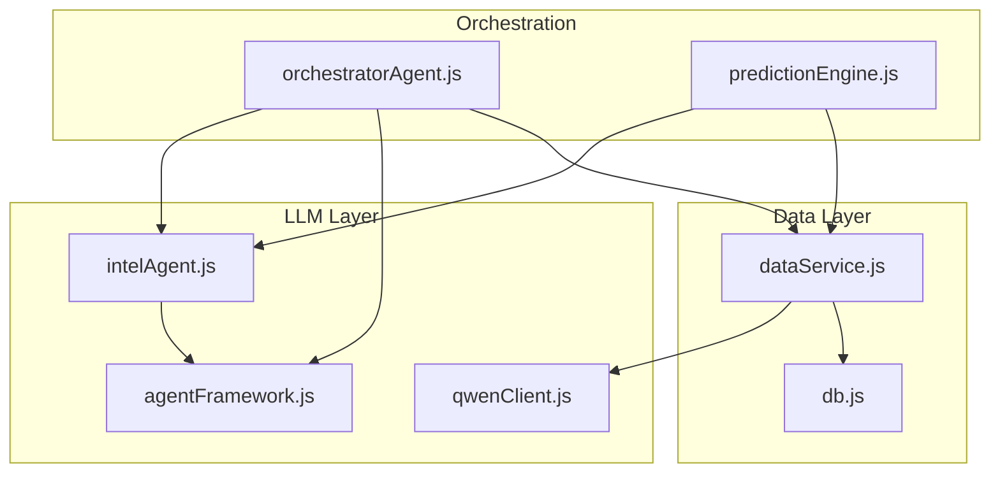
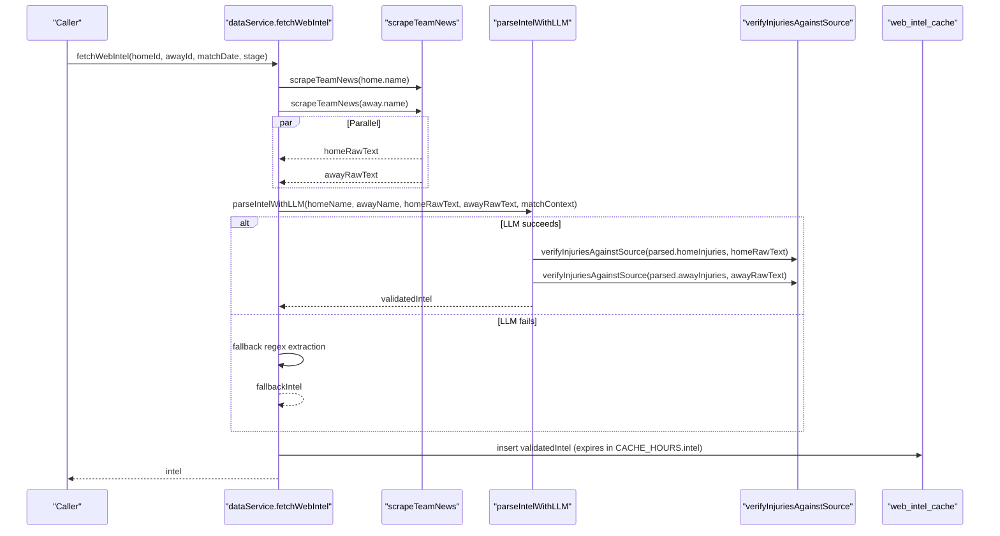
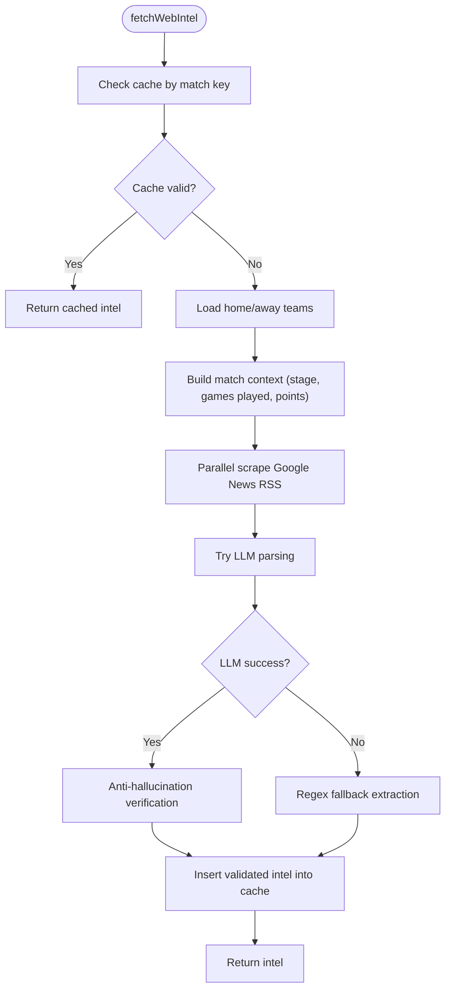
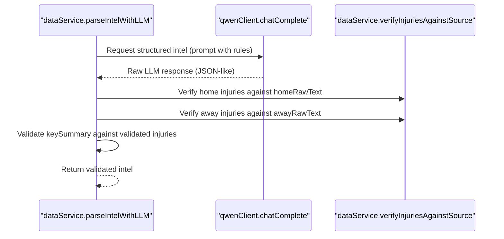
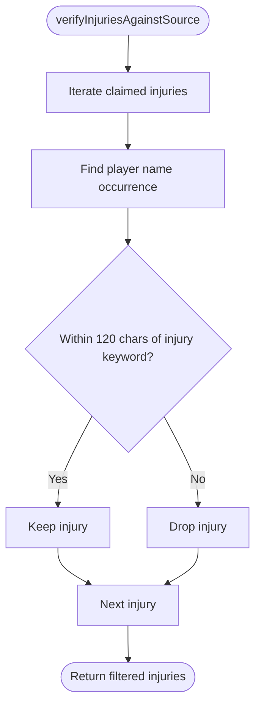
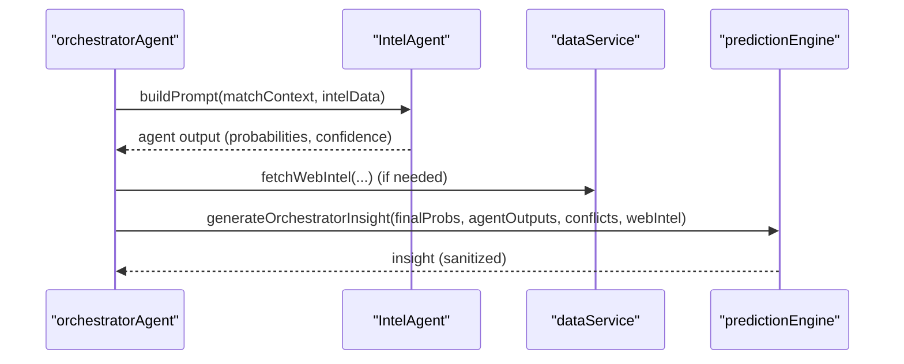
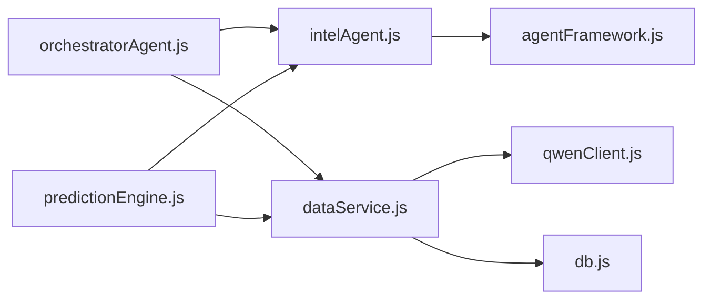

# Web Intelligence Service

<cite>
**Referenced Files in This Document**
- [dataService.js](file://backend/services/dataService.js)
- [intelAgent.js](file://backend/services/agents/intelAgent.js)
- [agentFramework.js](file://backend/services/agents/agentFramework.js)
- [qwenClient.js](file://backend/services/qwenClient.js)
- [db.js](file://backend/database/db.js)
- [orchestratorAgent.js](file://backend/services/agents/orchestratorAgent.js)
- [predictionEngine.js](file://backend/services/predictionEngine.js)
</cite>

## Table of Contents
1. [Introduction](#introduction)
2. [Project Structure](#project-structure)
3. [Core Components](#core-components)
4. [Architecture Overview](#architecture-overview)
5. [Detailed Component Analysis](#detailed-component-analysis)
6. [Dependency Analysis](#dependency-analysis)
7. [Performance Considerations](#performance-considerations)
8. [Troubleshooting Guide](#troubleshooting-guide)
9. [Conclusion](#conclusion)

## Introduction
This document explains the web intelligence service that extracts pre-match insights from web sources using AI-powered analysis. It covers the fetchWebIntel function implementation, including parallel web scraping, Google News RSS integration, and DuckDuckGo Lite usage. It documents the AI-powered intelligence parsing using Qwen models for structured data extraction (injuries, form assessment, motivation levels, and squad rotation indicators), the anti-hallucination verification system using regex matching and context validation, and the fallback mechanisms including regex-based injury extraction and synthetic intelligence generation. It also details cache management for intelligence data, context-aware processing for group versus knockout stages, integration with the prediction engine, the player name validation system, motivation assessment rules, and the relationship with team statistics for context-aware analysis.

## Project Structure
The web intelligence service spans several modules:
- Data service: orchestrates web scraping, LLM parsing, anti-hallucination checks, fallbacks, and caching.
- Qwen client: wraps the DashScope-compatible API for model calls.
- Intel agent: interprets structured intelligence into probabilistic shifts.
- Agent framework: provides the multi-agent orchestration, conflict detection, and synthesis.
- Database: persists cached intelligence and agent session data.
- Orchestrator agent: coordinates multi-agent prediction runs and integrates web intelligence.
- Prediction engine: generates human-readable insights and validates claims against verified intelligence.

**Diagram sources**
- [dataService.js:1-602](file://backend/services/dataService.js#L1-L602)
- [qwenClient.js:1-123](file://backend/services/qwenClient.js#L1-L123)
- [intelAgent.js:1-128](file://backend/services/agents/intelAgent.js#L1-L128)
- [agentFramework.js:1-586](file://backend/services/agents/agentFramework.js#L1-L586)
- [db.js:1-252](file://backend/database/db.js#L1-L252)
- [orchestratorAgent.js:1-502](file://backend/services/agents/orchestratorAgent.js#L1-L502)
- [predictionEngine.js:625-654](file://backend/services/predictionEngine.js#L625-L654)

**Section sources**
- [dataService.js:1-602](file://backend/services/dataService.js#L1-L602)
- [qwenClient.js:1-123](file://backend/services/qwenClient.js#L1-L123)
- [intelAgent.js:1-128](file://backend/services/agents/intelAgent.js#L1-L128)
- [agentFramework.js:1-586](file://backend/services/agents/agentFramework.js#L1-L586)
- [db.js:1-252](file://backend/database/db.js#L1-L252)
- [orchestratorAgent.js:1-502](file://backend/services/agents/orchestratorAgent.js#L1-L502)
- [predictionEngine.js:625-654](file://backend/services/predictionEngine.js#L625-L654)

## Core Components
- fetchWebIntel: primary function that orchestrates parallel web scraping, LLM parsing, anti-hallucination verification, fallback extraction, and caching.
- scrapeTeamNews: uses Google News RSS to collect recent team-related articles for both teams concurrently.
- parseIntelWithLLM: sends combined raw text to Qwen (qwen-plus) to extract structured intelligence with strict validation rules.
- Anti-hallucination verification: regex-based validation ensures claimed injuries are backed by nearby injury-related context.
- Fallback mechanisms: regex-based injury extraction and synthetic intelligence generation for robustness.
- Cache management: SQLite-backed caching for web intelligence with TTL controls.
- Context-aware processing: adjusts motivation assessments based on tournament stage and current standings.
- Integration with prediction engine: intel is included in the final prediction metadata and used to generate insights.

**Section sources**
- [dataService.js:271-509](file://backend/services/dataService.js#L271-L509)
- [dataService.js:294-399](file://backend/services/dataService.js#L294-L399)
- [dataService.js:401-430](file://backend/services/dataService.js#L401-L430)
- [dataService.js:313-399](file://backend/services/dataService.js#L313-L399)
- [db.js:147-157](file://backend/database/db.js#L147-L157)
- [intelAgent.js:20-127](file://backend/services/agents/intelAgent.js#L20-L127)
- [orchestratorAgent.js:376-383](file://backend/services/agents/orchestratorAgent.js#L376-L383)
- [predictionEngine.js:625-654](file://backend/services/predictionEngine.js#L625-L654)

## Architecture Overview
The web intelligence pipeline follows a deterministic flow:
1. Parallel scraping of Google News RSS for both teams.
2. Optional LLM parsing to structured intelligence with anti-hallucination checks.
3. Fallback extraction when LLM fails or produces incomplete data.
4. Caching of results with TTL.
5. Consumption by IntelAgent for qualitative interpretation and integration into the multi-agent prediction.

**Diagram sources**
- [dataService.js:432-509](file://backend/services/dataService.js#L432-L509)
- [dataService.js:271-292](file://backend/services/dataService.js#L271-L292)
- [dataService.js:294-399](file://backend/services/dataService.js#L294-L399)
- [dataService.js:401-430](file://backend/services/dataService.js#L401-L430)
- [db.js:147-157](file://backend/database/db.js#L147-L157)

## Detailed Component Analysis

### fetchWebIntel Implementation
- Parallel scraping: two Google News RSS queries run concurrently to maximize throughput.
- LLM parsing: structured extraction with strict validation rules and anti-hallucination checks.
- Fallback: regex-based injury extraction when LLM fails or returns incomplete data.
- Caching: inserts validated intelligence into web_intel_cache with a 4-hour TTL.

**Diagram sources**
- [dataService.js:432-509](file://backend/services/dataService.js#L432-L509)
- [dataService.js:271-292](file://backend/services/dataService.js#L271-L292)
- [dataService.js:294-399](file://backend/services/dataService.js#L294-L399)
- [dataService.js:401-430](file://backend/services/dataService.js#L401-L430)
- [db.js:147-157](file://backend/database/db.js#L147-L157)

**Section sources**
- [dataService.js:432-509](file://backend/services/dataService.js#L432-L509)

### AI-Powered Intelligence Parsing with Qwen
- Structured extraction prompt enforces strict field definitions and rules.
- Temperature tuned for deterministic responses.
- Anti-hallucination validation filters claimed injuries and key summaries based on proximity to injury-related keywords.
- Motivation assessment respects tournament stage and match context.

**Diagram sources**
- [dataService.js:313-399](file://backend/services/dataService.js#L313-L399)
- [qwenClient.js:53-101](file://backend/services/qwenClient.js#L53-L101)

**Section sources**
- [dataService.js:313-399](file://backend/services/dataService.js#L313-L399)
- [qwenClient.js:53-101](file://backend/services/qwenClient.js#L53-L101)

### Anti-Hallucination Verification System
- Injury validation requires a player’s name to appear in the raw text within a bounded window around an injury-related keyword.
- If any injury is dropped, the key summary is cleared to prevent misleading narratives.
- Additional validation ensures keySummary does not reference absent players not present in the validated injuries list.

**Diagram sources**
- [dataService.js:294-311](file://backend/services/dataService.js#L294-L311)

**Section sources**
- [dataService.js:294-311](file://backend/services/dataService.js#L294-L311)
- [dataService.js:363-393](file://backend/services/dataService.js#L363-L393)

### Fallback Mechanisms
- Regex-based injury extraction: targeted Google News RSS queries to locate injury-related mentions and extract player names.
- Synthetic intelligence generation: default forms and head-to-head records are synthesized when APIs are unavailable.

**Section sources**
- [dataService.js:401-430](file://backend/services/dataService.js#L401-L430)
- [dataService.js:171-185](file://backend/services/dataService.js#L171-L185)
- [dataService.js:248-265](file://backend/services/dataService.js#L248-L265)

### Cache Management
- Cache keys include match identifiers and intel type.
- TTLs differ by intel type: 4 hours for web intelligence, shorter for form and h2h.
- Cache storage includes content, source URL, fetched time, and expiry time.

**Section sources**
- [dataService.js:30-41](file://backend/services/dataService.js#L30-L41)
- [dataService.js:436-444](file://backend/services/dataService.js#L436-L444)
- [db.js:147-157](file://backend/database/db.js#L147-L157)

### Context-Aware Processing for Group vs Knockout Stages
- Group stage motivation is normalized to “normal” for teams that have not yet played any matches, preventing false “must-win” pressure assumptions.
- Knockout stage context emphasizes elimination scenarios.

**Section sources**
- [dataService.js:483-489](file://backend/services/dataService.js#L483-L489)
- [dataService.js:316-318](file://backend/services/dataService.js#L316-L318)

### Integration with the Prediction Engine
- IntelAgent consumes structured intelligence and interprets its impact on outcome probabilities.
- The orchestrator composes multi-agent outputs, including IntelAgent, and blends them into final predictions.
- Human-readable insights are generated and sanitized to remove unverified absence claims.

**Diagram sources**
- [intelAgent.js:42-117](file://backend/services/agents/intelAgent.js#L42-L117)
- [orchestratorAgent.js:376-383](file://backend/services/agents/orchestratorAgent.js#L376-L383)
- [orchestratorAgent.js:436-439](file://backend/services/agents/orchestratorAgent.js#L436-L439)
- [predictionEngine.js:625-654](file://backend/services/predictionEngine.js#L625-L654)

**Section sources**
- [intelAgent.js:42-117](file://backend/services/agents/intelAgent.js#L42-L117)
- [orchestratorAgent.js:376-383](file://backend/services/agents/orchestratorAgent.js#L376-L383)
- [orchestratorAgent.js:436-439](file://backend/services/agents/orchestratorAgent.js#L436-L439)
- [predictionEngine.js:625-654](file://backend/services/predictionEngine.js#L625-L654)

### Player Name Validation System
- Player names are extracted from raw text and validated against injury-related context windows.
- Claims in keySummary are cross-checked against validated injuries to prevent hallucinations.

**Section sources**
- [dataService.js:300-311](file://backend/services/dataService.js#L300-L311)
- [dataService.js:378-393](file://backend/services/dataService.js#L378-L393)

### Motivation Assessment Rules
- “High” motivation applies only to genuine elimination pressure or knockout matches.
- In group stage, teams with zero games played are normalized to “normal” motivation to avoid false must-win assumptions.

**Section sources**
- [dataService.js:348-348](file://backend/services/dataService.js#L348-L348)
- [dataService.js:483-489](file://backend/services/dataService.js#L483-L489)

### Relationship with Team Statistics
- Intelligence is enriched with group stage context (games played, points) to inform motivation and form assessments.
- Head-to-head and recent form data provide complementary signals for context-aware analysis.

**Section sources**
- [dataService.js:450-456](file://backend/services/dataService.js#L450-L456)
- [dataService.js:188-246](file://backend/services/dataService.js#L188-L246)

## Dependency Analysis
The web intelligence service exhibits clear separation of concerns:
- dataService depends on qwenClient for LLM calls and db for caching.
- intelAgent depends on dataService for structured intelligence and agentFramework for output formatting.
- orchestratorAgent coordinates multiple agents and integrates web intelligence into the prediction pipeline.
- predictionEngine consumes web intelligence to generate insights and validates claims.

**Diagram sources**
- [dataService.js:1-602](file://backend/services/dataService.js#L1-L602)
- [qwenClient.js:1-123](file://backend/services/qwenClient.js#L1-L123)
- [intelAgent.js:1-128](file://backend/services/agents/intelAgent.js#L1-L128)
- [agentFramework.js:1-586](file://backend/services/agents/agentFramework.js#L1-L586)
- [orchestratorAgent.js:1-502](file://backend/services/agents/orchestratorAgent.js#L1-L502)
- [predictionEngine.js:625-654](file://backend/services/predictionEngine.js#L625-L654)

**Section sources**
- [dataService.js:1-602](file://backend/services/dataService.js#L1-L602)
- [qwenClient.js:1-123](file://backend/services/qwenClient.js#L1-L123)
- [intelAgent.js:1-128](file://backend/services/agents/intelAgent.js#L1-L128)
- [agentFramework.js:1-586](file://backend/services/agents/agentFramework.js#L1-L586)
- [orchestratorAgent.js:1-502](file://backend/services/agents/orchestratorAgent.js#L1-L502)
- [predictionEngine.js:625-654](file://backend/services/predictionEngine.js#L625-L654)

## Performance Considerations
- Parallel scraping reduces latency by overlapping network requests.
- Deterministic LLM prompts with low temperature improve consistency.
- Cache TTLs balance freshness and cost; adjust based on volatility of intelligence sources.
- Retry logic in qwenClient mitigates transient failures.

[No sources needed since this section provides general guidance]

## Troubleshooting Guide
Common issues and remedies:
- LLM parsing failures: fallback to regex extraction; verify API key and model availability.
- Anti-hallucination drops: indicates raw text lacks strong context; review source queries and keywords.
- Cache misses: confirm cache key composition and TTL; inspect web_intel_cache entries.
- Motivation anomalies: ensure match context reflects correct stage and games played.

**Section sources**
- [dataService.js:395-398](file://backend/services/dataService.js#L395-L398)
- [dataService.js:498-500](file://backend/services/dataService.js#L498-L500)
- [db.js:147-157](file://backend/database/db.js#L147-L157)
- [dataService.js:483-489](file://backend/services/dataService.js#L483-L489)

## Conclusion
The web intelligence service combines robust parallel scraping, strict AI-driven parsing, and anti-hallucination validation to deliver reliable pre-match insights. Its cache-first design, context-aware processing, and seamless integration with the multi-agent prediction pipeline ensure timely, accurate, and explainable intelligence for match outcome modeling.