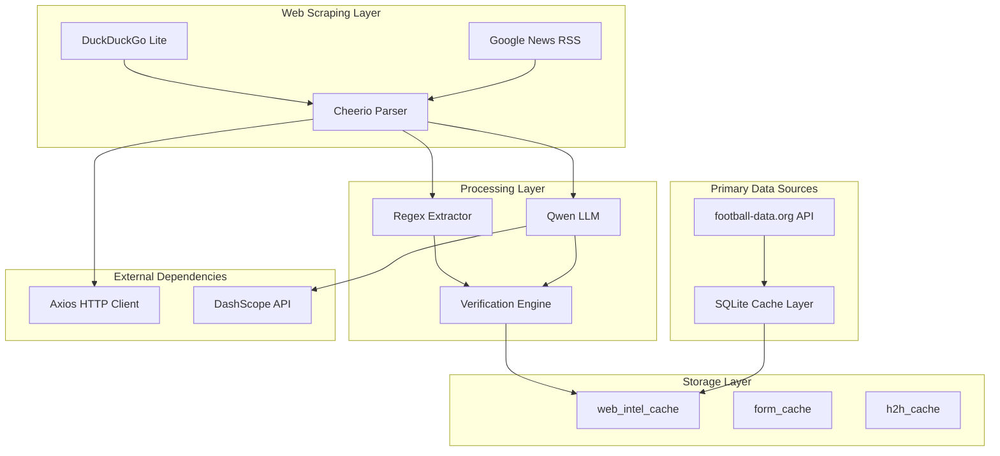
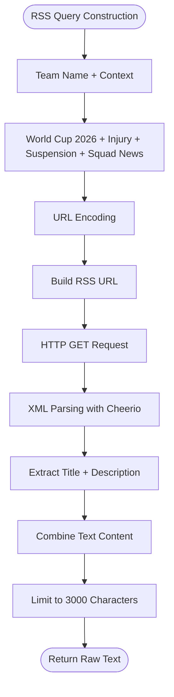
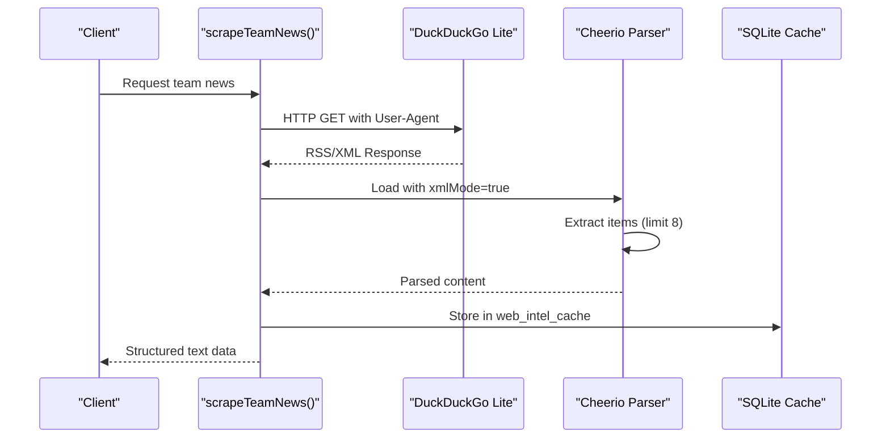
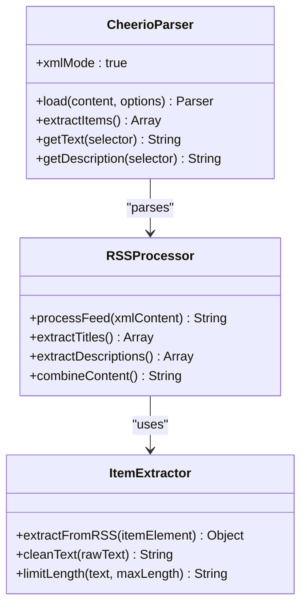
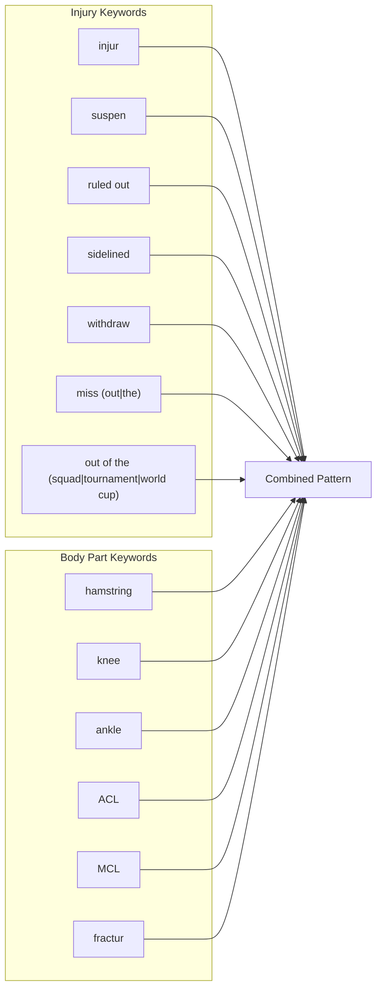
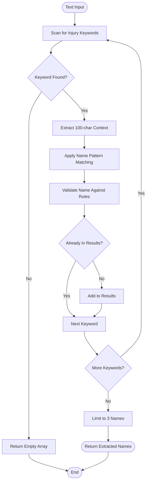
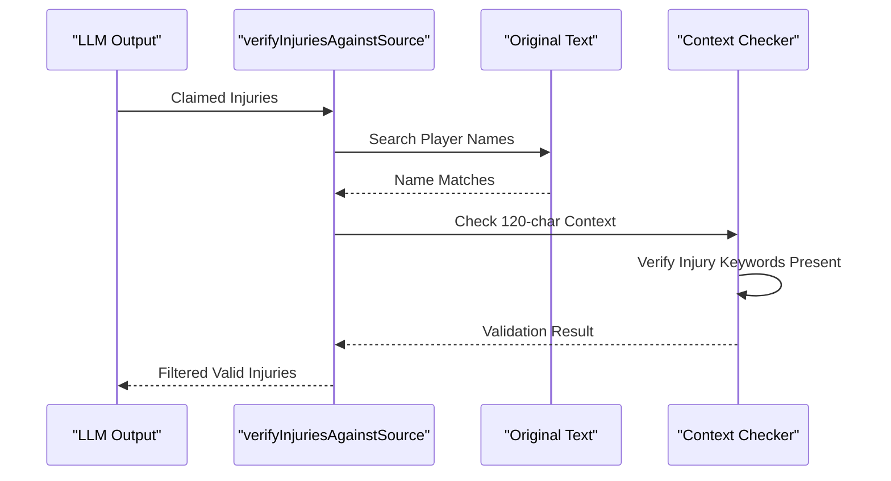
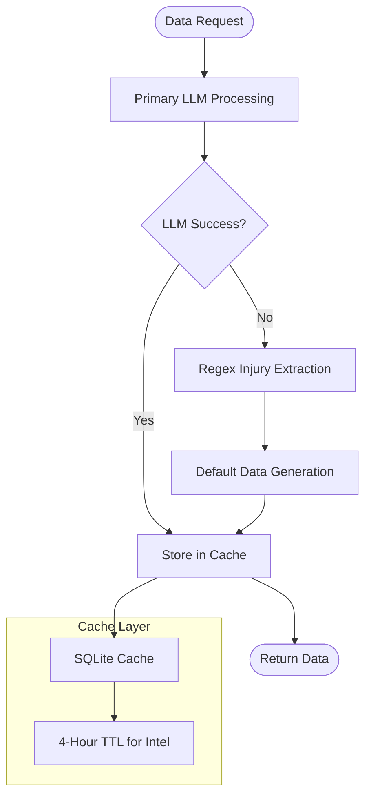
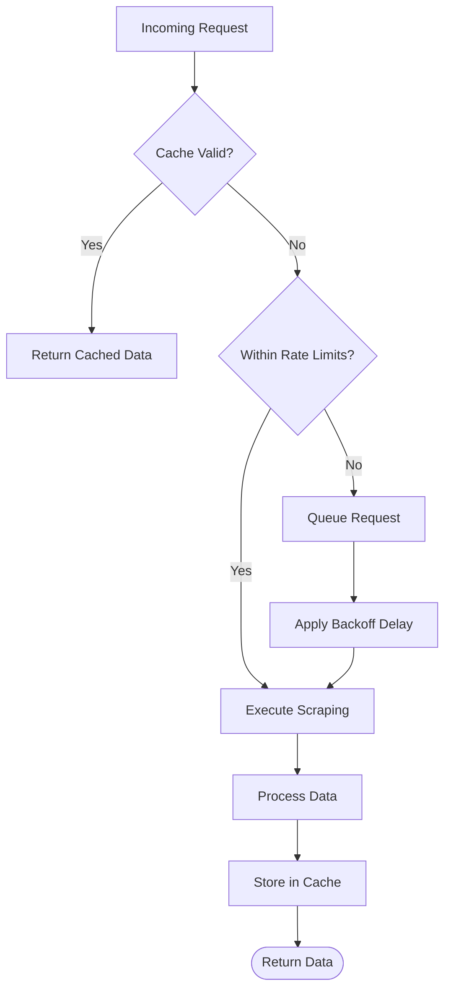

# Web Scraping System

<cite>
**Referenced Files in This Document**
- [dataService.js](file://backend/services/dataService.js)
- [qwenClient.js](file://backend/services/qwenClient.js)
- [db.js](file://backend/database/db.js)
- [server.js](file://backend/server.js)
- [package.json](file://backend/package.json)
- [README.md](file://README.md)
- [robots.txt](file://frontend/public/robots.txt)
</cite>

## Table of Contents
1. [Introduction](#introduction)
2. [System Architecture](#system-architecture)
3. [Google News RSS Integration](#google-news-rss-integration)
4. [DuckDuckGo Lite Scraping Approach](#duckduckgo-lite-scraping-approach)
5. [Cheerio-Based HTML Parsing](#cheerio-based-html-parsing)
6. [Regex Patterns for Injury Detection](#regex-patterns-for-injury-detection)
7. [Player Name Extraction Algorithms](#player-name-extraction-algorithms)
8. [Anti-Hallucination Verification System](#anti-hallucination-verification-system)
9. [Fallback Mechanisms](#fallback-mechanisms)
10. [Rate Limiting and Ethical Practices](#rate-limiting-and-ethical-practices)
11. [Performance Considerations](#performance-considerations)
12. [Troubleshooting Guide](#troubleshooting-guide)
13. [Conclusion](#conclusion)

## Introduction

The web scraping system is a critical component of the World Cup 2026 prediction platform, designed to collect real-time injury news and team form data from external sources. This system employs a multi-layered approach combining Google News RSS feeds, DuckDuckGo Lite scraping, Cheerio-based HTML parsing, and advanced LLM verification to ensure accurate and reliable data collection while maintaining ethical scraping practices.

The system serves as a fallback mechanism when the primary football-data.org API is unavailable or when additional context is needed for match predictions. It integrates seamlessly with the broader prediction engine, providing crucial pre-match intelligence including injury reports, team motivation levels, and squad rotation patterns.

## System Architecture

The web scraping system follows a layered architecture pattern that prioritizes reliability and accuracy through multiple verification steps:

**Diagram sources**
- [dataService.js:271-490](file://backend/services/dataService.js#L271-L490)
- [qwenClient.js:1-123](file://backend/services/qwenClient.js#L1-L123)

The architecture ensures redundancy and fault tolerance through multiple data collection methods, with each layer providing validation and verification capabilities.

## Google News RSS Integration

The system utilizes Google News RSS feeds as its primary source for injury and transfer news collection. This approach leverages the structured XML format provided by Google News to efficiently gather relevant information.

### RSS Feed Configuration

The RSS integration uses carefully crafted queries targeting World Cup 2026-specific terminology:

**Diagram sources**
- [dataService.js:271-292](file://backend/services/dataService.js#L271-L292)

### RSS Feed Parameters

The system configures RSS feeds with specific parameters optimized for sports news collection:

- **Language**: English (en-US)
- **Region**: United States (US)
- **Country**: English-speaking regions (US:en)
- **Item Limit**: 8 items per query
- **Character Limit**: 3000 characters maximum
- **Timeout**: 8-second limit for responsiveness

**Section sources**
- [dataService.js:271-292](file://backend/services/dataService.js#L271-L292)

## DuckDuckGo Lite Scraping Approach

While Google News RSS provides structured data, the system also employs DuckDuckGo Lite scraping as an alternative approach that avoids JavaScript-heavy sites and bot detection mechanisms.

### Scraping Strategy

The DuckDuckGo Lite approach focuses on scraping-friendly environments that minimize detection risks:

**Diagram sources**
- [dataService.js:271-292](file://backend/services/dataService.js#L271-L292)

### Anti-Detection Measures

The scraping implementation incorporates several anti-detection strategies:

- **User-Agent Rotation**: Uses legitimate browser User-Agent strings
- **Request Timing**: Implements appropriate timeouts (6-8 seconds)
- **Content Filtering**: Focuses on RSS/XML content to avoid JavaScript detection
- **Rate Control**: Leverages existing caching to minimize repeated requests

**Section sources**
- [dataService.js:271-292](file://backend/services/dataService.js#L271-L292)

## Cheerio-Based HTML Parsing

Cheerio serves as the core HTML parsing library, providing fast and efficient server-side DOM manipulation without the overhead of a full browser environment.

### Parsing Configuration

The system uses Cheerio with specific configurations optimized for RSS and XML content:

**Diagram sources**
- [dataService.js:271-292](file://backend/services/dataService.js#L271-L292)

### Content Processing Pipeline

The Cheerio parser follows a systematic approach to content extraction:

1. **XML Loading**: Uses `xmlMode: true` for proper RSS/XML parsing
2. **Item Selection**: Processes up to 8 items from the RSS feed
3. **Content Extraction**: Separates title and description elements
4. **Text Cleaning**: Removes HTML tags and trims whitespace
5. **Content Combination**: Merges title and description with proper spacing
6. **Length Limiting**: Ensures maximum character limits are maintained

**Section sources**
- [dataService.js:271-292](file://backend/services/dataService.js#L271-L292)

## Regex Patterns for Injury Detection

The system employs sophisticated regular expression patterns to identify injury-related terminology and extract meaningful information from unstructured text.

### Primary Injury Detection Pattern

The main injury keyword detection uses a comprehensive regex pattern that captures various injury-related terms:

**Diagram sources**
- [dataService.js:298-311](file://backend/services/dataService.js#L298-L311)

### Regex Implementation Details

The injury detection system uses the following pattern characteristics:

- **Case Insensitive**: `\b(injur|suspen|ruled out|sidelined|hamstring|knee|ankle|ACL|MCL|fractur|withdraw|out of the (squad|tournament|world cup)|miss(?:es|ing)? (?:out|the))\b/i`
- **Word Boundaries**: Ensures precise matching without partial word inclusion
- **Alternative Patterns**: Handles various injury reporting styles and terminology variations
- **Context Window**: Searches within 120-character windows around detected names

**Section sources**
- [dataService.js:298-311](file://backend/services/dataService.js#L298-L311)

## Player Name Extraction Algorithms

The system implements multiple algorithms for extracting player names from injury and suspension reports, ensuring robust identification across different reporting styles.

### Advanced Name Extraction Flow

**Diagram sources**
- [dataService.js:382-411](file://backend/services/dataService.js#L382-L411)

### Name Validation Rules

The name extraction algorithm applies several validation rules to ensure accuracy:

1. **Pattern Matching**: Uses `([A-Z][a-z]+(?:\s+[A-Z][a-z]+)*)\s+(?:is|has been|was)` pattern
2. **Uniqueness**: Prevents duplicate player name extraction
3. **Length Limit**: Limits results to maximum of 3 players per team
4. **Context Filtering**: Ensures names appear in relevant injury context
5. **Format Validation**: Requires proper capitalization and spacing

**Section sources**
- [dataService.js:382-411](file://backend/services/dataService.js#L382-L411)

## Anti-Hallucination Verification System

The system implements a sophisticated anti-hallucination verification mechanism that cross-checks LLM-generated claims against the original source text to prevent false positive injury reports.

### Verification Architecture

**Diagram sources**
- [dataService.js:300-311](file://backend/services/dataService.js#L300-L311)

### Verification Process

The anti-hallucination system operates through multiple verification layers:

1. **Name Presence Check**: Ensures extracted player names appear in the source text
2. **Context Window Analysis**: Searches ±120 characters around player names
3. **Injury Keyword Validation**: Confirms injury-related terminology exists in context
4. **Rule-Based Filtering**: Applies strict rules to prevent false positives
5. **Summary Validation**: Removes key summaries when injury claims are filtered

### Safety Net Protections

Additional safety measures include:

- **JSON Extraction**: Validates LLM responses contain proper JSON structure
- **Summary Correlation**: Removes key summaries when injury data is unreliable
- **Fallback Preservation**: Maintains system functionality even with LLM failures
- **Context Awareness**: Considers tournament stage and match context for motivation assessment

**Section sources**
- [dataService.js:300-311](file://backend/services/dataService.js#L300-L311)
- [dataService.js:313-380](file://backend/services/dataService.js#L313-L380)

## Fallback Mechanisms

The system implements comprehensive fallback mechanisms to ensure continuous operation even when primary data sources fail or become unavailable.

### Multi-Layered Fallback Architecture

**Diagram sources**
- [dataService.js:413-490](file://backend/services/dataService.js#L413-L490)

### Fallback Implementation Details

The fallback system operates through three primary tiers:

#### Tier 1: LLM Processing Failure
- **Trigger**: LLM parsing errors or invalid JSON responses
- **Action**: Attempt regex-based injury extraction
- **Timeout**: 30-second timeout for LLM requests

#### Tier 2: Regex Extraction Failure  
- **Trigger**: Regex-based extraction errors or insufficient data
- **Action**: Generate default injury data based on team statistics
- **Sources**: Team ELO ratings, historical injury patterns, and tournament stage

#### Tier 3: Complete Failure
- **Trigger**: All previous layers fail
- **Action**: Return minimal viable data with clear indicators
- **Purpose**: Maintain system stability and user experience

**Section sources**
- [dataService.js:413-490](file://backend/services/dataService.js#L413-L490)

## Rate Limiting and Ethical Practices

The system implements careful rate limiting and ethical scraping practices to minimize impact on external services while maintaining data freshness.

### Rate Limiting Strategy

### Ethical Scraping Implementation

The system adheres to several ethical scraping principles:

1. **Respectful User-Agents**: Uses legitimate browser User-Agent strings
2. **Appropriate Timing**: Implements reasonable timeouts and delays
3. **Minimal Impact**: Limits request frequency and payload sizes
4. **Cache Utilization**: Maximizes cache reuse to reduce external load
5. **Content Filtering**: Focuses on publicly available, non-sensitive information

### Cache Management

The caching system provides multiple layers of data persistence:

- **Intel Cache**: 4-hour TTL for injury and form data
- **Form Cache**: 12-hour TTL for team form data  
- **H2H Cache**: 24-hour TTL for head-to-head records
- **Automatic Cleanup**: Expired entries removed during maintenance

**Section sources**
- [dataService.js:30-41](file://backend/services/dataService.js#L30-L41)
- [dataService.js:413-490](file://backend/services/dataService.js#L413-L490)

## Performance Considerations

The system is optimized for performance through strategic caching, parallel processing, and efficient resource utilization.

### Performance Optimization Strategies

1. **Parallel Processing**: Team news requests processed concurrently
2. **Intelligent Caching**: Strategic TTL values balance freshness and performance
3. **Resource Pooling**: Efficient database connection management
4. **Memory Management**: Proper cleanup of Cheerio parsers and temporary data
5. **Network Optimization**: Appropriate timeouts and retry mechanisms

### Monitoring and Metrics

The system tracks several key performance indicators:

- **Cache Hit Rates**: Measure effectiveness of caching strategy
- **Response Times**: Monitor scraping and processing performance
- **Error Rates**: Track system reliability and failure patterns
- **Resource Usage**: Monitor memory and CPU consumption

## Troubleshooting Guide

Common issues and their resolutions:

### Network Connectivity Issues
- **Symptoms**: Timeout errors during scraping
- **Resolution**: Check internet connectivity and proxy settings
- **Prevention**: Implement retry logic with exponential backoff

### LLM Parsing Failures  
- **Symptoms**: JSON parsing errors or empty responses
- **Resolution**: Verify API key configuration and quota limits
- **Prevention**: Implement fallback mechanisms and monitoring

### Cache Corruption
- **Symptoms**: Inconsistent data or SQLite errors
- **Resolution**: Clear cache and regenerate data
- **Prevention**: Implement cache validation and integrity checks

### Memory Leaks
- **Symptoms**: Gradual memory usage increase
- **Resolution**: Review Cheerio parser cleanup and object disposal
- **Prevention**: Implement proper resource management

**Section sources**
- [qwenClient.js:67-101](file://backend/services/qwenClient.js#L67-L101)
- [dataService.js:376-380](file://backend/services/dataService.js#L376-L380)

## Conclusion

The web scraping system represents a sophisticated approach to collecting real-time sports intelligence while maintaining reliability, accuracy, and ethical standards. Through its multi-layered architecture, comprehensive verification systems, and thoughtful rate limiting, the system provides valuable pre-match intelligence that enhances the overall prediction accuracy and user experience.

The integration of Google News RSS feeds, DuckDuckGo Lite scraping, Cheerio-based parsing, and advanced LLM verification creates a robust foundation for injury and form data collection. The anti-hallucination verification system ensures data quality, while the comprehensive fallback mechanisms guarantee system resilience.

Future enhancements could include implementing more sophisticated machine learning models for content classification, expanding the range of supported data sources, and developing more granular rate limiting controls. The current architecture provides an excellent foundation for these potential improvements while maintaining the system's reliability and performance standards.