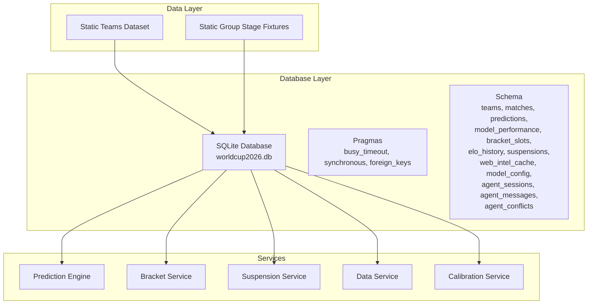
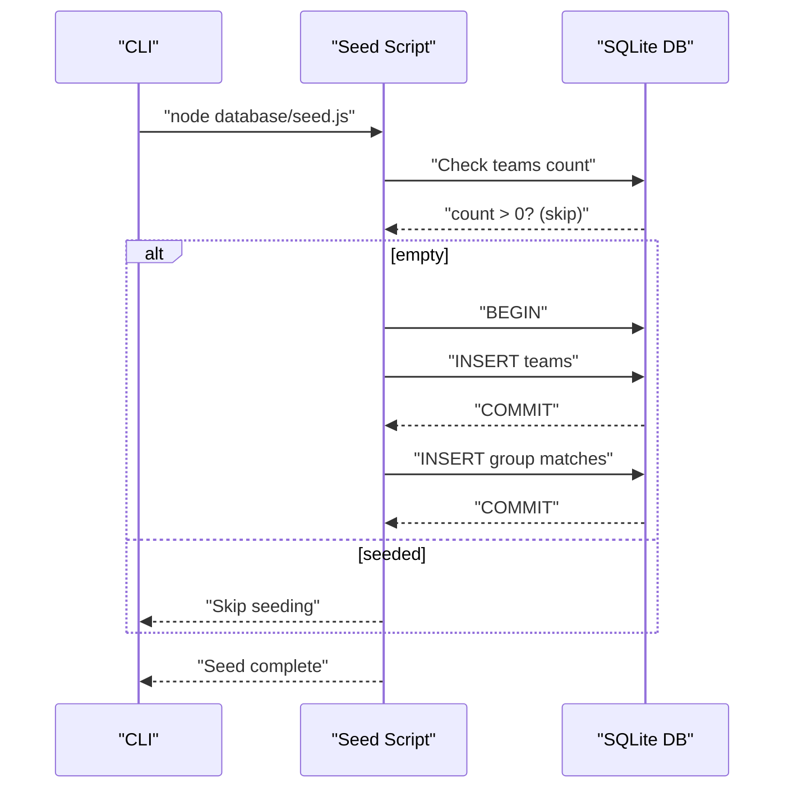
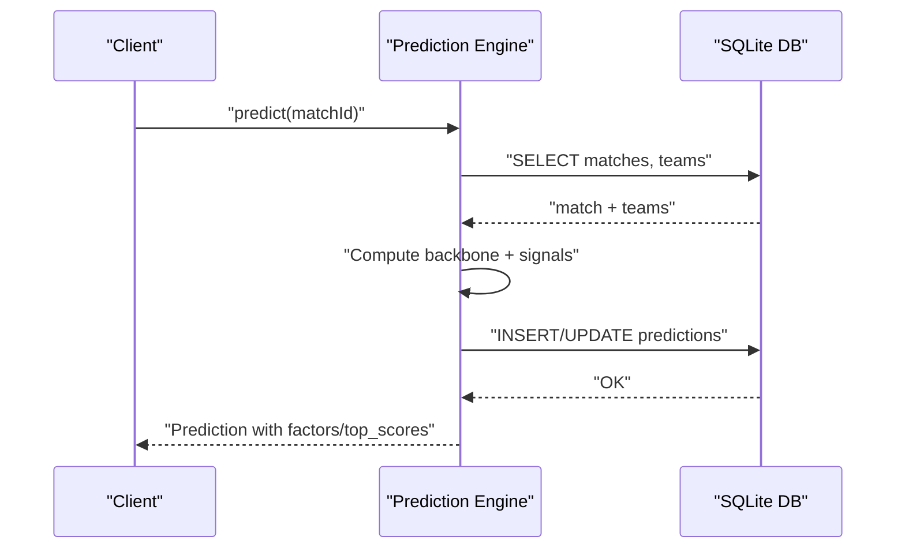
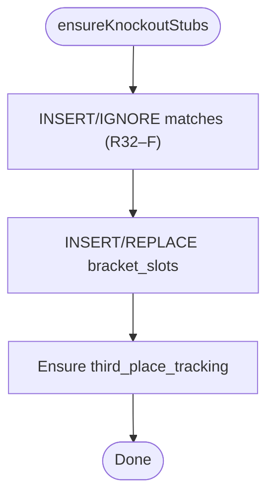
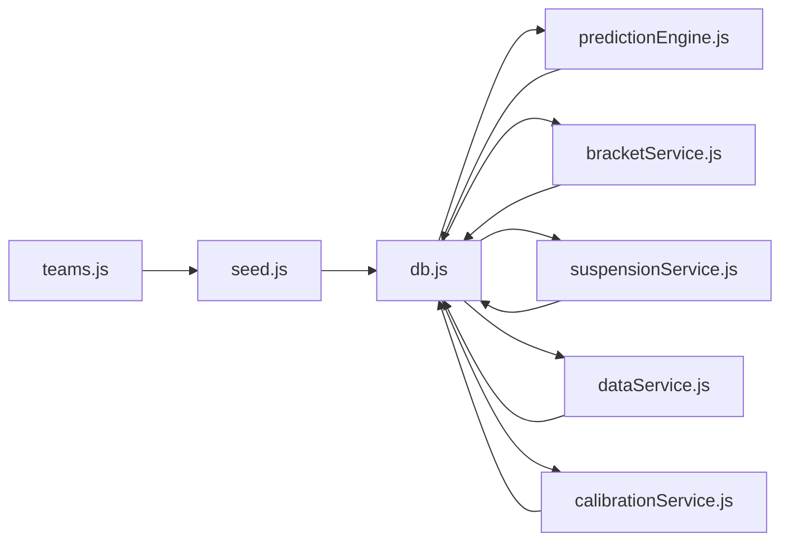

# Database Design

<cite>
**Referenced Files in This Document**
- [db.js](file://backend/database/db.js)
- [seed.js](file://backend/database/seed.js)
- [teams.js](file://backend/data/teams.js)
- [predictionEngine.js](file://backend/services/predictionEngine.js)
- [bracketService.js](file://backend/services/bracketService.js)
- [suspensionService.js](file://backend/services/suspensionService.js)
- [dataService.js](file://backend/services/dataService.js)
- [calibrationService.js](file://backend/services/calibrationService.js)
- [sync-db.sh](file://sync-db.sh)
- [README.md](file://README.md)
- [SETUP.md](file://SETUP.md)
</cite>

## Table of Contents
1. [Introduction](#introduction)
2. [Project Structure](#project-structure)
3. [Core Components](#core-components)
4. [Architecture Overview](#architecture-overview)
5. [Detailed Component Analysis](#detailed-component-analysis)
6. [Dependency Analysis](#dependency-analysis)
7. [Performance Considerations](#performance-considerations)
8. [Troubleshooting Guide](#troubleshooting-guide)
9. [Conclusion](#conclusion)
10. [Appendices](#appendices)

## Introduction
This document provides comprehensive database design documentation for the World Cup 2026 Prediction App. It covers the SQLite schema optimized for sports analytics, entity relationships among Teams, Matches, Players, and Tournament structures, data types, constraints, indexing strategies, and operational procedures. The schema supports both the legacy single-model prediction engine and the advanced multi-agent system, with robust data seeding, caching, and maintenance workflows.

## Project Structure
The database layer is implemented in a dedicated module that initializes the schema, enforces referential integrity, and manages migrations. Seed data is provided via a static dataset and loaded through a one-time seed script. Services consume the database for predictions, bracket progression, suspensions, and calibration.



**Diagram sources**
- [db.js:10-21](file://backend/database/db.js#L10-L21)
- [seed.js:9-66](file://backend/database/seed.js#L9-L66)
- [teams.js:1-234](file://backend/data/teams.js#L1-L234)
- [predictionEngine.js:691-755](file://backend/services/predictionEngine.js#L691-L755)
- [bracketService.js:146-187](file://backend/services/bracketService.js#L146-L187)
- [suspensionService.js:16-33](file://backend/services/suspensionService.js#L16-L33)
- [dataService.js:68-133](file://backend/services/dataService.js#L68-L133)
- [calibrationService.js:103-129](file://backend/services/calibrationService.js#L103-L129)

**Section sources**
- [db.js:10-21](file://backend/database/db.js#L10-L21)
- [seed.js:9-66](file://backend/database/seed.js#L9-L66)
- [teams.js:1-234](file://backend/data/teams.js#L1-L234)

## Core Components
This section documents the core database entities and their relationships, constraints, and business rules.

- Teams
  - Purpose: Stores national team metadata, ELO ratings, and group-stage statistics.
  - Primary key: id (TEXT)
  - Notable fields: name, flag, group_code, confederation, fifa_rank, fifa_points, elo, avg_scored, avg_conceded, wc_appearances, last_wc_round, gs_* running totals, eliminated, updated_at.
  - Constraints: group_code indicates group stage grouping; gs_* fields maintain cumulative group-stage performance.

- Matches
  - Purpose: Captures all fixtures (group stage and knockout).
  - Primary key: id (TEXT)
  - Foreign keys: home_team, away_team reference teams(id); winner references teams(id).
  - Notable fields: stage ('GROUP' | 'R32' | 'R16' | 'QF' | 'SF' | 'F'), group_code, match_number, venue, scheduled_date, scheduled_time, status ('SCHEDULED' | 'LIVE' | 'COMPLETED'), scores and penalties, created_at, completed_at.
  - Constraints: status governs prediction availability; winner links to advancing team.

- Predictions
  - Purpose: Pre-match probabilistic forecasts with metadata.
  - Primary key: id (INTEGER, autoincrement)
  - Foreign key: match_id references matches(id).
  - Notable fields: generated_at, prob_home, prob_draw, prob_away, expected_score_home, expected_score_away, most_likely_score, top_scores (JSON), confidence ('LOW' | 'MEDIUM' | 'HIGH' | 'VERY_HIGH'), factors (JSON), web_intel (JSON), insight, methodology, actual_outcome ('HOME' | 'DRAW' | 'AWAY'), was_correct (0|1), brier_score, upset (0|1), lambda_home, lambda_away, agent_session_id.
  - Constraints: top_scores and factors/web_intel are JSON blobs; agent_session_id links to multi-agent sessions.

- Model Performance
  - Purpose: Tracks model accuracy and calibration metrics.
  - Primary key: id (INTEGER, autoincrement)
  - Foreign key: match_id references matches(id).
  - Notable fields: stage, predicted_outcome, actual_outcome, was_correct, brier_score, prob_predicted, confidence, upset, analysis_notes, created_at, points (scoring rule points computed later).
  - Constraints: points column added via migration for scoring rule alignment.

- Bracket Slots
  - Purpose: Tracks knockout bracket assignments and progress.
  - Primary key: match_id (TEXT) referencing matches(id)
  - Notable fields: slot_home, slot_away, filled_at

- Elo History
  - Purpose: Records ELO changes after each completed match.
  - Primary key: id (INTEGER, autoincrement)
  - Foreign keys: team_id, opponent_id reference teams(id); match_id references matches(id).
  - Notable fields: elo_before, elo_after, result ('W'|'D'|'L'), stage, recorded_at

- Suspensions
  - Purpose: Tracks player suspensions (yellow/red cards).
  - Primary key: id (INTEGER, autoincrement)
  - Foreign key: team_id references teams(id).
  - Notable fields: player_name, reason ('yellow_accumulation'|'red_card'|'disciplinary'), yellow_cards, suspended_for_match_id, source ('manual'|'api'|'scraped'), notes, created_at, updated_at

- Web Intel Cache
  - Purpose: Caches scraped/pre-fetched intelligence (injury news, form, lineups).
  - Primary key: id (INTEGER, autoincrement)
  - Notable fields: team_id, match_id, intel_type ('injury'|'form'|'lineup'|'news'), content (TEXT), source_url, fetched_at, expires_at

- Model Config
  - Purpose: Stores tunable model weights and calibration parameters.
  - Primary key: key (TEXT)
  - Notable fields: value (REAL), description, updated_at

- Agent Sessions, Messages, Conflicts
  - Purpose: Track multi-agent prediction sessions, messages, and conflict resolution.
  - Primary key: agent_sessions.id (TEXT), agent_messages.id (INTEGER), agent_conflicts.id (INTEGER)
  - Foreign key: agent_messages.session_id references agent_sessions(id)

**Section sources**
- [db.js:23-226](file://backend/database/db.js#L23-L226)
- [teams.js:7-79](file://backend/data/teams.js#L7-L79)
- [teams.js:135-231](file://backend/data/teams.js#L135-L231)

## Architecture Overview
The database architecture emphasizes:
- Immutable seeding for teams and group fixtures
- Dynamic prediction storage with JSON metadata
- Multi-agent session tracking for transparency
- Calibration and performance tracking
- Referential integrity enforced via foreign keys

```mermaid
erDiagram
TEAMS {
text id PK
text name
text flag
text group_code
text confederation
int fifa_rank
float fifa_points
float elo
float avg_scored
float avg_conceded
int wc_appearances
text last_wc_round
int gs_played
int gs_won
int gs_drawn
int gs_lost
int gs_gf
int gs_ga
int gs_pts
int eliminated
text updated_at
}
MATCHES {
text id PK
text stage
text group_code
int match_number
text home_team FK
text away_team FK
text scheduled_date
text scheduled_time
text venue
text status
int home_score
int away_score
int home_score_pens
int away_score_pens
text winner FK
text created_at
text completed_at
}
PREDICTIONS {
int id PK
text match_id FK
text generated_at
float prob_home
float prob_draw
float prob_away
float expected_score_home
float expected_score_away
text most_likely_score
text top_scores
text confidence
text factors
text web_intel
text insight
text methodology
text actual_outcome
int was_correct
float brier_score
int upset
float lambda_home
float lambda_away
text agent_session_id
}
MODEL_PERFORMANCE {
int id PK
text match_id FK
text stage
text predicted_outcome
text actual_outcome
int was_correct
float brier_score
float prob_predicted
text confidence
int upset
text analysis_notes
text created_at
int points
}
BRACKET_SLOTS {
text match_id PK FK
text slot_home
text slot_away
text filled_at
}
ELO_HISTORY {
int id PK
text team_id FK
text match_id FK
float elo_before
float elo_after
text opponent_id FK
text result
text stage
text recorded_at
}
SUSPENSIONS {
int id PK
text team_id FK
text player_name
text reason
int yellow_cards
text suspended_for_match_id
text source
text notes
text created_at
text updated_at
}
WEB_INTEL_CACHE {
int id PK
text team_id
text match_id
text intel_type
text content
text source_url
text fetched_at
text expires_at
}
MODEL_CONFIG {
text key PK
float value
text description
text updated_at
}
AGENT_SESSIONS {
text id PK
text match_id FK
text agents_used
int rounds
int conflicts_detected
int conflicts_resolved
text synthesis_method
int wall_time_ms
text created_at
}
AGENT_MESSAGES {
int id PK
text session_id FK
int round
text agent
text role
text probability
float confidence
text evidence
text raw_response
int latency_ms
text created_at
}
AGENT_CONFLICTS {
int id PK
text session_id FK
text agent_a
text agent_b
float delta
int round_detected
text resolution
text winner
text resolution_reasoning
text created_at
}
TEAMS ||--o{ MATCHES : "home_team/away_team"
TEAMS ||--o{ ELO_HISTORY : "team_id/opponent_id"
MATCHES ||--o{ PREDICTIONS : "match_id"
MATCHES ||--o{ MODEL_PERFORMANCE : "match_id"
MATCHES ||--o{ BRACKET_SLOTS : "match_id"
TEAMS ||--o{ SUSPENSIONS : "team_id"
MATCHES ||--o{ SUSPENSIONS : "suspended_for_match_id"
MATCHES ||--o{ WEB_INTEL_CACHE : "match_id"
TEAMS ||--o{ WEB_INTEL_CACHE : "team_id"
AGENT_SESSIONS ||--o{ AGENT_MESSAGES : "session_id"
AGENT_SESSIONS ||--o{ AGENT_CONFLICTS : "session_id"
```

**Diagram sources**
- [db.js:23-226](file://backend/database/db.js#L23-L226)

## Detailed Component Analysis

### Schema Initialization and Pragmas
- Connection initialization sets:
  - busy_timeout = 10000
  - synchronous = NORMAL
  - foreign_keys = ON
- Schema creation includes:
  - Teams, Matches, Predictions, Model Performance, Bracket Slots, Elo History, Suspensions, Web Intel Cache, Model Config, Agent Sessions, Agent Messages, Agent Conflicts
- Migrations add optional columns:
  - scheduled_time for matches
  - top_scores for predictions
  - log_alpha, log_beta, log_alpha_prior, log_beta_prior for teams
  - points for model_performance
  - lambda_home, lambda_away for predictions
  - agent_session_id for predictions

**Section sources**
- [db.js:10-21](file://backend/database/db.js#L10-L21)
- [db.js:23-226](file://backend/database/db.js#L23-L226)

### Data Seeding Workflow
- One-time seed script:
  - Checks if teams exist; if yes, skips seeding
  - Inserts teams with FIFA-based ELO and historical stats
  - Inserts group stage fixtures with dates, times, and venues
  - Uses transactions for atomicity



**Diagram sources**
- [seed.js:9-66](file://backend/database/seed.js#L9-L66)
- [teams.js:7-79](file://backend/data/teams.js#L7-L79)
- [teams.js:135-231](file://backend/data/teams.js#L135-L231)

**Section sources**
- [seed.js:9-66](file://backend/database/seed.js#L9-L66)
- [teams.js:7-79](file://backend/data/teams.js#L7-L79)
- [teams.js:135-231](file://backend/data/teams.js#L135-L231)

### Prediction Data Flow
- Prediction engine:
  - Loads match and teams
  - Computes Dixon-Coles Poisson backbone with venue and stage adjustments
  - Applies form, intel, lineup, and rest-day signals
  - Blends via log-pool and temperature scaling
  - Stores prediction with JSON metadata and optional agent session linkage



**Diagram sources**
- [predictionEngine.js:691-755](file://backend/services/predictionEngine.js#L691-L755)
- [db.js:23-226](file://backend/database/db.js#L23-L226)

**Section sources**
- [predictionEngine.js:691-755](file://backend/services/predictionEngine.js#L691-L755)
- [db.js:23-226](file://backend/database/db.js#L23-L226)

### Bracket Progression Tracking
- Ensures knockout match stubs and bracket slots exist
- Populates match schedules and venues for R32–Final
- Maintains third-place tracking table



**Diagram sources**
- [bracketService.js:146-187](file://backend/services/bracketService.js#L146-L187)

**Section sources**
- [bracketService.js:146-187](file://backend/services/bracketService.js#L146-L187)

### Suspension Management
- Adds or updates suspensions with deduplication by team/player/match
- Retrieves team and tournament-wide suspensions with match and team details

**Section sources**
- [suspensionService.js:16-33](file://backend/services/suspensionService.js#L16-L33)
- [suspensionService.js:108-120](file://backend/services/suspensionService.js#L108-L120)
- [suspensionService.js:130-142](file://backend/services/suspensionService.js#L130-L142)

### Data Caching and Intelligence
- Web intel cache stores form, H2H, injury, lineup, and news data with expiry
- Data service fetches from APIs and web scrapers, with fallbacks and caching

**Section sources**
- [dataService.js:68-133](file://backend/services/dataService.js#L68-L133)
- [db.js:148-157](file://backend/database/db.js#L148-L157)

### Model Calibration
- Refits temperature scaling and Dixon-Coles ρ parameter using observed scorelines
- Persists calibrated parameters into model_config

**Section sources**
- [calibrationService.js:103-129](file://backend/services/calibrationService.js#L103-L129)
- [db.js:160-165](file://backend/database/db.js#L160-L165)

## Dependency Analysis
The database layer is consumed by multiple services. The following diagram highlights key dependencies and data flows.



**Diagram sources**
- [db.js:10-21](file://backend/database/db.js#L10-L21)
- [seed.js:9-66](file://backend/database/seed.js#L9-L66)
- [teams.js:1-234](file://backend/data/teams.js#L1-L234)
- [predictionEngine.js:691-755](file://backend/services/predictionEngine.js#L691-L755)
- [bracketService.js:146-187](file://backend/services/bracketService.js#L146-L187)
- [suspensionService.js:16-33](file://backend/services/suspensionService.js#L16-L33)
- [dataService.js:68-133](file://backend/services/dataService.js#L68-L133)
- [calibrationService.js:103-129](file://backend/services/calibrationService.js#L103-L129)

**Section sources**
- [db.js:10-21](file://backend/database/db.js#L10-L21)
- [seed.js:9-66](file://backend/database/seed.js#L9-L66)
- [teams.js:1-234](file://backend/data/teams.js#L1-L234)
- [predictionEngine.js:691-755](file://backend/services/predictionEngine.js#L691-L755)
- [bracketService.js:146-187](file://backend/services/bracketService.js#L146-L187)
- [suspensionService.js:16-33](file://backend/services/suspensionService.js#L16-L33)
- [dataService.js:68-133](file://backend/services/dataService.js#L68-L133)
- [calibrationService.js:103-129](file://backend/services/calibrationService.js#L103-L129)

## Performance Considerations
- Concurrency and locking:
  - busy_timeout configured to reduce deadlocks during concurrent writes
  - foreign_keys enabled for strict referential integrity
- Indexing strategy:
  - Primary keys are indexed by SQLite by default
  - Recommended secondary indexes for frequent queries:
    - matches(status, scheduled_date)
    - matches(stage, group_code)
    - predictions(match_id, generated_at)
    - model_performance(match_id)
    - web_intel_cache(team_id, intel_type, fetched_at)
    - suspensions(team_id, suspended_for_match_id)
    - elo_history(team_id, match_id)
    - agent_messages(session_id, round)
- Caching:
  - Web intel cache with expiry reduces external API load
  - Predictions cache retrieval avoids recomputation for upcoming matches
- Data partitioning:
  - Separate tables for predictions, model performance, and agent artifacts isolate write-heavy workloads
- Batch operations:
  - Seed script uses transactions to minimize WAL overhead during initial load

[No sources needed since this section provides general guidance]

## Troubleshooting Guide
- Database connectivity and locks:
  - Stale directory-based locks are removed on startup; ensure filesystem permissions allow directory deletion
- Foreign key violations:
  - Enforce referential integrity; ensure teams exist before inserting matches and predictions
- Migration failures:
  - ALTER TABLE statements are wrapped in try/catch; verify schema evolution across environments
- Production sync safety:
  - Use the provided sync script to backup remote DB, transfer local DB, and restart backend

**Section sources**
- [db.js:10-21](file://backend/database/db.js#L10-L21)
- [db.js:210-226](file://backend/database/db.js#L210-L226)
- [sync-db.sh:28-55](file://sync-db.sh#L28-L55)

## Conclusion
The database schema for the World Cup 2026 Prediction App is designed for reliability, scalability, and analytical depth. It supports both deterministic and multi-agent prediction workflows, maintains historical records for calibration, and integrates tightly with services for real-time data ingestion and caching. The documented initialization, seeding, and operational procedures ensure smooth deployment and maintenance.

[No sources needed since this section summarizes without analyzing specific files]

## Appendices

### A. SQLite Schema Details
- Teams: id (PK), name, flag, group_code, confederation, fifa_rank, fifa_points, elo, avg_scored, avg_conceded, wc_appearances, last_wc_round, gs_* fields, eliminated, updated_at
- Matches: id (PK), stage, group_code, match_number, home_team (FK), away_team (FK), scheduled_date, scheduled_time, venue, status, scores, winner (FK), timestamps
- Predictions: id (PK), match_id (FK), generated_at, probabilities, expected scores, most_likely_score, top_scores (JSON), confidence, factors (JSON), web_intel (JSON), insight, methodology, actual_outcome, was_correct, brier_score, upset, lambdas, agent_session_id
- Model Performance: id (PK), match_id (FK), stage, predicted_outcome, actual_outcome, was_correct, brier_score, prob_predicted, confidence, upset, analysis_notes, created_at, points
- Bracket Slots: match_id (PK, FK), slot_home, slot_away, filled_at
- Elo History: id (PK), team_id (FK), match_id (FK), elo_before, elo_after, opponent_id (FK), result, stage, recorded_at
- Suspensions: id (PK), team_id (FK), player_name, reason, yellow_cards, suspended_for_match_id, source, notes, created_at, updated_at
- Web Intel Cache: id (PK), team_id, match_id, intel_type, content, source_url, fetched_at, expires_at
- Model Config: key (PK), value, description, updated_at
- Agent Sessions: id (PK), match_id (FK), agents_used (JSON), rounds, conflicts_detected, conflicts_resolved, synthesis_method, wall_time_ms, created_at
- Agent Messages: id (PK), session_id (FK), round, agent, role, probability (JSON), confidence, evidence (JSON), raw_response, latency_ms, created_at
- Agent Conflicts: id (PK), session_id (FK), agent_a, agent_b, delta, round_detected, resolution, winner, resolution_reasoning, created_at

**Section sources**
- [db.js:23-226](file://backend/database/db.js#L23-L226)

### B. Sample Data Examples
- Teams: 48 FIFA-ranked teams with group assignments, flags, confederations, and historical stats
- Group Stage Fixtures: 72 matches with scheduled dates/times and venues
- Example prediction record: includes probabilities, expected score, top scorelines, confidence, factors, and methodology

**Section sources**
- [teams.js:7-79](file://backend/data/teams.js#L7-L79)
- [teams.js:135-231](file://backend/data/teams.js#L135-L231)
- [predictionEngine.js:691-755](file://backend/services/predictionEngine.js#L691-L755)

### C. Operational Procedures
- Seed database: node database/seed.js
- Re-seed anytime: npm run seed in backend
- Production sync: bash sync-db.sh (backs up remote DB, transfers local DB, restarts backend)

**Section sources**
- [seed.js:9-66](file://backend/database/seed.js#L9-L66)
- [SETUP.md:134-137](file://SETUP.md#L134-L137)
- [sync-db.sh:28-55](file://sync-db.sh#L28-L55)

### D. Security, Backups, and Disaster Recovery
- Security:
  - API keys managed via environment variables (.env)
  - CORS configured for frontend origins
- Backups:
  - Remote backup pulled locally before overwriting production
- Disaster Recovery:
  - Local backup retained after successful sync
  - Backend restart ensures schema consistency

**Section sources**
- [README.md:139-151](file://README.md#L139-L151)
- [SETUP.md:53-63](file://SETUP.md#L53-L63)
- [sync-db.sh:28-55](file://sync-db.sh#L28-L55)