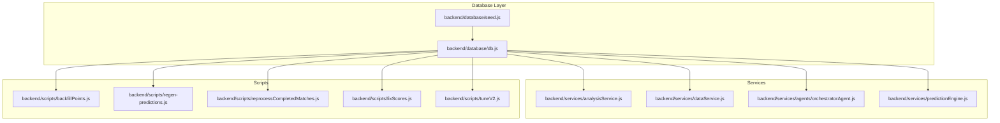
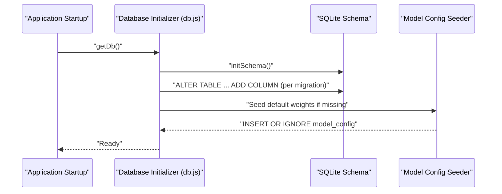
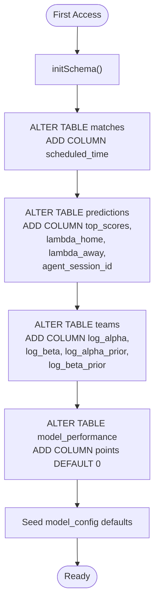
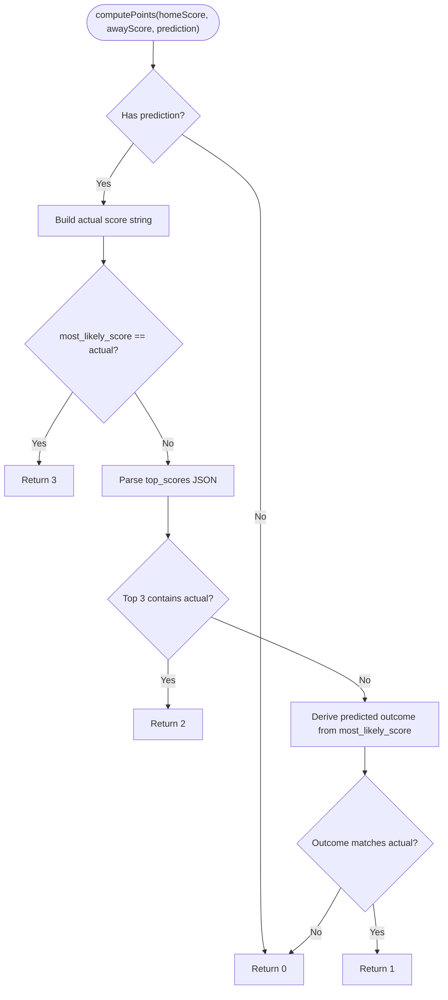
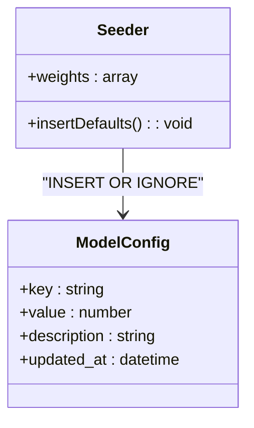
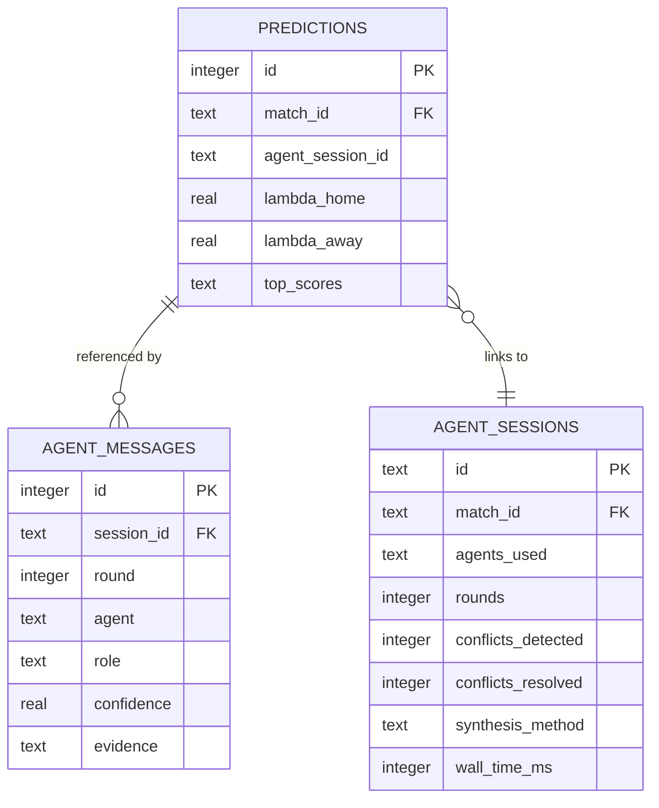
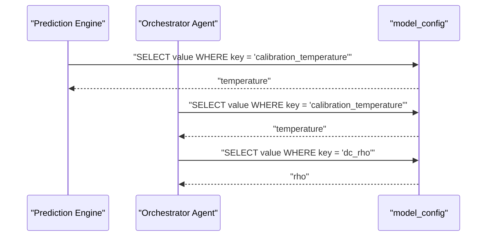
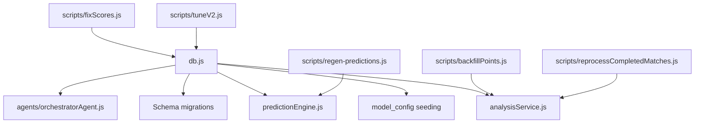

# Data Migrations

<cite>
**Referenced Files in This Document**
- [db.js](file://backend/database/db.js)
- [seed.js](file://backend/database/seed.js)
- [analysisService.js](file://backend/services/analysisService.js)
- [dataService.js](file://backend/services/dataService.js)
- [backfillPoints.js](file://backend/scripts/backfillPoints.js)
- [regen-predictions.js](file://backend/scripts/regen-predictions.js)
- [reprocessCompletedMatches.js](file://backend/scripts/reprocessCompletedMatches.js)
- [fixScores.js](file://backend/scripts/fixScores.js)
- [tuneV2.js](file://backend/scripts/tuneV2.js)
- [orchestratorAgent.js](file://backend/services/agents/orchestratorAgent.js)
- [predictionEngine.js](file://backend/services/predictionEngine.js)
</cite>

## Table of Contents
1. [Introduction](#introduction)
2. [Project Structure](#project-structure)
3. [Core Components](#core-components)
4. [Architecture Overview](#architecture-overview)
5. [Detailed Component Analysis](#detailed-component-analysis)
6. [Dependency Analysis](#dependency-analysis)
7. [Performance Considerations](#performance-considerations)
8. [Troubleshooting Guide](#troubleshooting-guide)
9. [Conclusion](#conclusion)
10. [Appendices](#appendices)

## Introduction
This document describes the data migration strategy for the WC26-Qwen-Qoder database evolution. It covers schema additions, model configuration seeding, scoring system changes, calibration parameters, and multi-agent session linking. It also documents backward compatibility, upgrade paths for existing databases, model configuration seeding defaults, and practical migration execution and verification steps. Rollback and data preservation strategies are included, along with guidance for handling migration issues and recovery.

## Project Structure
The migration logic is primarily encapsulated in the database initialization module, with supporting scripts and services that implement scoring, calibration, and operational fixes. The following diagram shows the relationship between the core database initializer and related services and scripts involved in migrations.

**Diagram sources**
- [db.js:23-249](file://backend/database/db.js#L23-L249)
- [seed.js:9-68](file://backend/database/seed.js#L9-L68)
- [analysisService.js:1-422](file://backend/services/analysisService.js#L1-L422)
- [dataService.js:1-583](file://backend/services/dataService.js#L1-L583)
- [backfillPoints.js:1-77](file://backend/scripts/backfillPoints.js#L1-L77)
- [regen-predictions.js:1-31](file://backend/scripts/regen-predictions.js#L1-L31)
- [reprocessCompletedMatches.js:1-65](file://backend/scripts/reprocessCompletedMatches.js#L1-L65)
- [fixScores.js:73-108](file://backend/scripts/fixScores.js#L73-L108)
- [tuneV2.js:1-58](file://backend/scripts/tuneV2.js#L1-L58)

**Section sources**
- [db.js:23-249](file://backend/database/db.js#L23-L249)
- [seed.js:9-68](file://backend/database/seed.js#L9-L68)

## Core Components
- Database initializer and migrations: Adds columns to existing tables and seeds default model configuration.
- Scoring engine: Implements points-based scoring rules for predictions.
- Calibration services: Manage temperature scaling and Dixon-Coles ρ fitting.
- Operational scripts: Backfill points, regenerate predictions, reprocess completed matches, fix scores, and tune model hyperparameters.

Key migration targets:
- Matches table: scheduled_time column added.
- Predictions table: top_scores, lambda_home, lambda_away, agent_session_id columns added.
- Teams table: Dixon-Coles log_alpha, log_beta, and priors added.
- Model performance table: points column added.
- Model configuration: default weights and flags seeded.

**Section sources**
- [db.js:210-227](file://backend/database/db.js#L210-L227)
- [db.js:228-249](file://backend/database/db.js#L228-L249)
- [analysisService.js:18-57](file://backend/services/analysisService.js#L18-L57)

## Architecture Overview
The migration architecture ensures backward compatibility by adding optional columns and seeding defaults. Existing databases are upgraded automatically upon first access. The scoring system and calibration rely on persisted model configuration values.

**Diagram sources**
- [db.js:10-21](file://backend/database/db.js#L10-L21)
- [db.js:23-209](file://backend/database/db.js#L23-L209)
- [db.js:228-249](file://backend/database/db.js#L228-L249)

## Detailed Component Analysis

### Migration Strategy and Backward Compatibility
- Automatic upgrades: On first access, the initializer adds missing columns to matches, predictions, teams, and model_performance tables. This preserves existing data while enabling new features.
- Optional columns: New columns are added via ALTER TABLE statements wrapped in try/catch blocks to avoid failures on already-upgraded databases.
- Seeding defaults: The model_config table is populated with default weights and flags using INSERT OR IGNORE, ensuring existing configurations are preserved.

**Diagram sources**
- [db.js:210-227](file://backend/database/db.js#L210-L227)
- [db.js:228-249](file://backend/database/db.js#L228-L249)

**Section sources**
- [db.js:210-227](file://backend/database/db.js#L210-L227)
- [db.js:228-249](file://backend/database/db.js#L228-L249)

### Points-Based Scoring System
The scoring system assigns points based on how closely the actual scoreline matches the prediction:
- 3 points: Actual scoreline equals the headline most_likely_score.
- 2 points: Actual scoreline appears in the top_scores list (top 3).
- 1 point: Outcome matches the headline most_likely_score.
- 0 points: Otherwise.

The computePoints function reads prediction.top_scores as JSON and compares against the actual scoreline. It derives predicted outcome from most_likely_score for outcome-only credit.

**Diagram sources**
- [analysisService.js:37-57](file://backend/services/analysisService.js#L37-L57)

**Section sources**
- [analysisService.js:18-57](file://backend/services/analysisService.js#L18-L57)

### Model Configuration Seeding and Default Weight Initialization
The initializer seeds the model_config table with default weights and flags. These values are used by prediction and calibration services:
- Feature weights (e.g., w_elo, w_poisson, w_form, w_h2h, w_intel, w_wc_exp, w_lineup, w_host, w_rest)
- Elo K-factor
- Global average goals
- Feature flags (e.g., use_multi_agent)

The seeding uses INSERT OR IGNORE to avoid overriding existing values.

**Diagram sources**
- [db.js:228-249](file://backend/database/db.js#L228-L249)

**Section sources**
- [db.js:228-249](file://backend/database/db.js#L228-L249)

### Multi-Agent Session Linking
New prediction records can be linked to multi-agent sessions via agent_session_id. The agent sessions and messages tables track agent usage, conflicts, and synthesis methods. The predictions table’s agent_session_id column enables tracing which multi-agent run produced a given prediction.

**Diagram sources**
- [db.js:72-94](file://backend/database/db.js#L72-L94)
- [db.js:167-207](file://backend/database/db.js#L167-L207)

**Section sources**
- [db.js:72-94](file://backend/database/db.js#L72-L94)
- [db.js:167-207](file://backend/database/db.js#L167-L207)

### Calibration Parameters: Temperature Scaling and Dixon-Coles ρ
Calibration services read fitted values from model_config:
- calibration_temperature: Temperature scaling applied to outcome probabilities.
- dc_rho: Dixon-Coles ρ parameter used to adjust dependence between low-scoring teams.

These values are read by prediction and orchestrator agents to calibrate outputs.

**Diagram sources**
- [predictionEngine.js:639-648](file://backend/services/predictionEngine.js#L639-L648)
- [orchestratorAgent.js:68-71](file://backend/services/agents/orchestratorAgent.js#L68-L71)
- [orchestratorAgent.js:91-94](file://backend/services/agents/orchestratorAgent.js#L91-L94)

**Section sources**
- [predictionEngine.js:639-648](file://backend/services/predictionEngine.js#L639-L648)
- [orchestratorAgent.js:68-71](file://backend/services/agents/orchestratorAgent.js#L68-L71)
- [orchestratorAgent.js:91-94](file://backend/services/agents/orchestratorAgent.js#L91-L94)

### Migration Execution and Verification Steps
- Upgrade existing database: Start the application or run any operation that accesses the database. The initializer automatically adds missing columns and seeds defaults.
- Verify schema changes: Confirm that the new columns exist in matches, predictions, teams, and model_performance tables.
- Verify model configuration: Ensure default weights and flags are present in model_config.
- Backfill points: If scoring rules changed, run the backfill script to regrade existing model_performance rows.
- Regenerate predictions: Use the regeneration script to re-run predictions with updated weights and scorelines.
- Reprocess completed matches: Use the reprocessing script to rebuild model_performance entries and update ELO and brackets.
- Fix scores: Use the fix script to reconcile incorrect or missing scores in matches.

Example commands:
- Backfill points: node backend/scripts/backfillPoints.js
- Regenerate predictions: node backend/scripts/regen-predictions.js
- Reprocess completed matches: node backend/scripts/reprocessCompletedMatches.js
- Fix scores: node backend/scripts/fixScores.js
- Tune model hyperparameters: node backend/scripts/tuneV2.js

**Section sources**
- [db.js:210-227](file://backend/database/db.js#L210-L227)
- [db.js:228-249](file://backend/database/db.js#L228-L249)
- [backfillPoints.js:1-77](file://backend/scripts/backfillPoints.js#L1-L77)
- [regen-predictions.js:1-31](file://backend/scripts/regen-predictions.js#L1-L31)
- [reprocessCompletedMatches.js:1-65](file://backend/scripts/reprocessCompletedMatches.js#L1-L65)
- [fixScores.js:73-108](file://backend/scripts/fixScores.js#L73-L108)
- [tuneV2.js:1-58](file://backend/scripts/tuneV2.js#L1-L58)

## Dependency Analysis
The migration logic depends on:
- Database initializer for schema additions and seeding.
- Analysis service for scoring and model performance storage.
- Prediction engine and orchestrator agent for calibration parameters.
- Scripts for operational tasks like backfilling, regeneration, and fixing.

**Diagram sources**
- [db.js:23-249](file://backend/database/db.js#L23-L249)
- [analysisService.js:1-422](file://backend/services/analysisService.js#L1-L422)
- [predictionEngine.js:639-648](file://backend/services/predictionEngine.js#L639-L648)
- [orchestratorAgent.js:68-71](file://backend/services/agents/orchestratorAgent.js#L68-L71)
- [backfillPoints.js:1-77](file://backend/scripts/backfillPoints.js#L1-L77)
- [regen-predictions.js:1-31](file://backend/scripts/regen-predictions.js#L1-L31)
- [reprocessCompletedMatches.js:1-65](file://backend/scripts/reprocessCompletedMatches.js#L1-L65)
- [fixScores.js:73-108](file://backend/scripts/fixScores.js#L73-L108)
- [tuneV2.js:1-58](file://backend/scripts/tuneV2.js#L1-L58)

**Section sources**
- [db.js:23-249](file://backend/database/db.js#L23-L249)
- [analysisService.js:1-422](file://backend/services/analysisService.js#L1-L422)
- [predictionEngine.js:639-648](file://backend/services/predictionEngine.js#L639-L648)
- [orchestratorAgent.js:68-71](file://backend/services/agents/orchestratorAgent.js#L68-L71)
- [backfillPoints.js:1-77](file://backend/scripts/backfillPoints.js#L1-L77)
- [regen-predictions.js:1-31](file://backend/scripts/regen-predictions.js#L1-L31)
- [reprocessCompletedMatches.js:1-65](file://backend/scripts/reprocessCompletedMatches.js#L1-L65)
- [fixScores.js:73-108](file://backend/scripts/fixScores.js#L73-L108)
- [tuneV2.js:1-58](file://backend/scripts/tuneV2.js#L1-L58)

## Performance Considerations
- Migration overhead: ALTER TABLE operations are lightweight but should be performed once during first access. Subsequent runs are no-ops due to try/catch wrappers.
- Seeding cost: INSERT OR IGNORE is efficient and idempotent; it avoids repeated writes on subsequent runs.
- Scoring computation: computePoints performs JSON parsing and comparisons; keep top_scores compact to minimize overhead.
- Script execution: Batch operations (backfill, regeneration, reprocessing) can be resource-intensive; schedule during off-peak hours.

[No sources needed since this section provides general guidance]

## Troubleshooting Guide
Common issues and recovery procedures:
- Migration fails due to concurrent access: The initializer uses a directory-based lock for SQLite WASM. Stale locks are removed automatically; if persistent failures occur, manually remove the lock directory and retry.
- Missing columns after upgrade: Verify that ALTER TABLE statements executed successfully. If not, rerun the application to trigger the initializer again.
- Overwritten model configuration: The seeding uses INSERT OR IGNORE, so existing values are preserved. To restore defaults, delete the offending keys from model_config and restart the app.
- Incorrect points after rule changes: Use the backfill script to regrade model_performance rows based on the latest scoring rules.
- Prediction inconsistencies: Use the regeneration script to re-run predictions for scheduled matches.
- Completed match discrepancies: Use the reprocessing script to rebuild model_performance entries and update ELO and brackets.
- Live sync issues: The data service relies on external APIs and caching; check API keys and network connectivity. If scores are missing, use the fix script to reconcile.

**Section sources**
- [db.js:10-21](file://backend/database/db.js#L10-L21)
- [db.js:210-227](file://backend/database/db.js#L210-L227)
- [db.js:228-249](file://backend/database/db.js#L228-L249)
- [backfillPoints.js:1-77](file://backend/scripts/backfillPoints.js#L1-L77)
- [regen-predictions.js:1-31](file://backend/scripts/regen-predictions.js#L1-L31)
- [reprocessCompletedMatches.js:1-65](file://backend/scripts/reprocessCompletedMatches.js#L1-L65)
- [fixScores.js:73-108](file://backend/scripts/fixScores.js#L73-L108)
- [dataService.js:495-580](file://backend/services/dataService.js#L495-L580)

## Conclusion
The WC26-Qwen-Qoder migration strategy ensures backward compatibility by adding optional columns and seeding defaults upon first access. The points-based scoring system and calibration parameters are persisted in model_config, enabling robust evaluation and adaptation. Operational scripts support maintenance and recovery tasks. By following the documented execution and verification steps, administrators can safely upgrade existing databases and maintain data integrity.

[No sources needed since this section summarizes without analyzing specific files]

## Appendices

### Appendix A: Migration Rollback Procedures and Data Preservation
- Rollback strategy: Since migrations add optional columns and seed defaults, true rollback is often unnecessary. If needed, drop the new columns and revert model_config entries manually. However, this risks losing new data and should be avoided.
- Data preservation: 
  - Use INSERT OR IGNORE for seeding to preserve existing model_config values.
  - Wrap ALTER TABLE operations in try/catch to prevent failures on already-upgraded databases.
  - Use BEGIN/COMMIT/ROLLBACK in scripts to ensure atomicity for batch operations.

**Section sources**
- [db.js:210-227](file://backend/database/db.js#L210-L227)
- [db.js:228-249](file://backend/database/db.js#L228-L249)
- [seed.js:26-42](file://backend/database/seed.js#L26-L42)
- [reprocessCompletedMatches.js:50-58](file://backend/scripts/reprocessCompletedMatches.js#L50-L58)