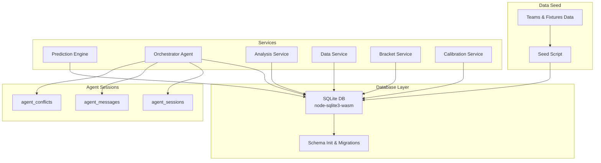
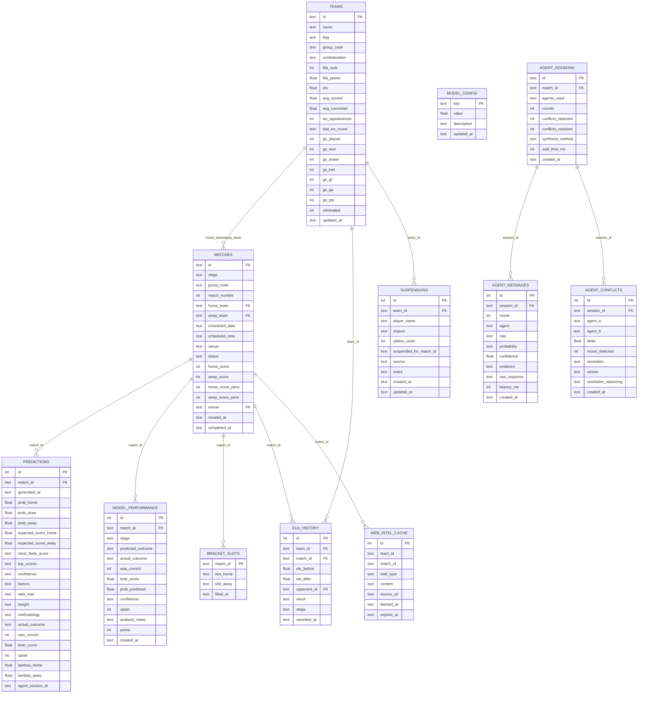
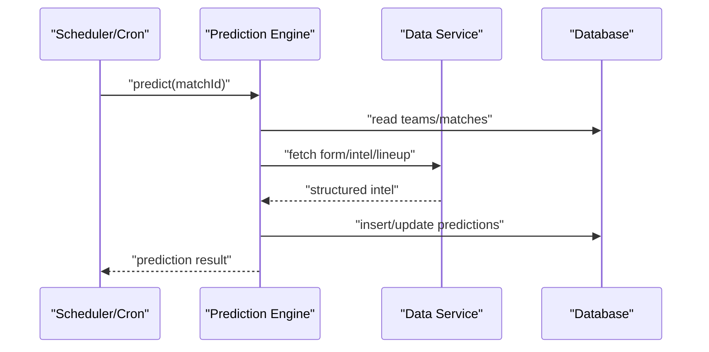

# Database Schema

<cite>
**Referenced Files in This Document**
- [db.js](file://backend/database/db.js)
- [seed.js](file://backend/database/seed.js)
- [teams.js](file://backend/data/teams.js)
- [predictionEngine.js](file://backend/services/predictionEngine.js)
- [orchestratorAgent.js](file://backend/services/agents/orchestratorAgent.js)
- [analysisService.js](file://backend/services/analysisService.js)
- [dataService.js](file://backend/services/dataService.js)
- [bracketService.js](file://backend/services/bracketService.js)
- [calibrationService.js](file://backend/services/calibrationService.js)
- [SPEC.md](file://specs/SPEC.md)
- [reprocessCompletedMatches.js](file://backend/scripts/reprocessCompletedMatches.js)
</cite>

## Table of Contents
1. [Introduction](#introduction)
2. [Project Structure](#project-structure)
3. [Core Components](#core-components)
4. [Architecture Overview](#architecture-overview)
5. [Detailed Component Analysis](#detailed-component-analysis)
6. [Dependency Analysis](#dependency-analysis)
7. [Performance Considerations](#performance-considerations)
8. [Troubleshooting Guide](#troubleshooting-guide)
9. [Conclusion](#conclusion)
10. [Appendices](#appendices)

## Introduction
This document provides comprehensive data model documentation for the WC26-Qwen-Qoder database schema. It covers entity relationships among teams, matches, predictions, and agent sessions; describes table schemas, constraints, and indexes; explains validation and business rules; documents the 48-team dataset and 104-match fixture structure; details prediction storage and multi-agent orchestration; and outlines performance tracking, historical data management, lifecycle, retention, and migration strategies.

## Project Structure
The database schema is initialized and migrated by the backend database module, seeded with teams and fixtures, and consumed by prediction, analysis, and bracket services. Multi-agent orchestration persists agent session metadata and messages alongside predictions.

**Diagram sources**
- [db.js:23-251](file://backend/database/db.js#L23-L251)
- [seed.js:9-68](file://backend/database/seed.js#L9-L68)
- [teams.js:1-234](file://backend/data/teams.js#L1-L234)
- [predictionEngine.js:665-730](file://backend/services/predictionEngine.js#L665-L730)
- [orchestratorAgent.js:288-468](file://backend/services/agents/orchestratorAgent.js#L288-L468)
- [analysisService.js:76-218](file://backend/services/analysisService.js#L76-L218)
- [dataService.js:495-580](file://backend/services/dataService.js#L495-L580)
- [bracketService.js:146-187](file://backend/services/bracketService.js#L146-L187)
- [calibrationService.js:53-129](file://backend/services/calibrationService.js#L53-L129)

**Section sources**
- [db.js:10-21](file://backend/database/db.js#L10-L21)
- [seed.js:9-68](file://backend/database/seed.js#L9-L68)
- [teams.js:1-234](file://backend/data/teams.js#L1-L234)

## Core Components
- Teams: ELO and Dixon–Coles attack/defense ratings, group-stage statistics, and metadata.
- Matches: Fixture structure with stage, group, scheduling, venue, and status.
- Predictions: Pre-match probabilistic forecasts, score predictions, confidence, and post-match grading.
- Model performance: Aggregated metrics for accuracy, Brier score, and points scoring.
- Bracket slots: Knockout bracket placeholders and slot assignments.
- Elo history: Per-match ELO and attack/defense rating updates.
- Suspensions: Player suspension tracking.
- Web intel cache: Structured pre-match intelligence with TTL.
- Model config: Adjustable weights and calibration parameters.
- Agent sessions: Multi-agent orchestration metadata and outputs.
- Agent messages/conflicts: Round-by-round agent reasoning and conflict resolution.

**Section sources**
- [db.js:23-166](file://backend/database/db.js#L23-L166)
- [db.js:167-208](file://backend/database/db.js#L167-L208)

## Architecture Overview
The schema supports a prediction pipeline with optional multi-agent orchestration. Predictions are generated from a Dixon–Coles backbone enriched by form, head-to-head, intelligence, lineup, and rest-day signals. After results are recorded, model performance is tracked, ELO and ratings are updated, and bracket progression proceeds.

**Diagram sources**
- [db.js:23-166](file://backend/database/db.js#L23-L166)
- [db.js:167-208](file://backend/database/db.js#L167-L208)

## Detailed Component Analysis

### Teams Table
- Purpose: Store team metadata, ELO, Dixon–Coles ratings, and group-stage stats.
- Primary key: id (text).
- Notable columns:
  - ELO and attack/defense ratings (legacy and v2).
  - Group-stage running totals (played, won, drawn, lost, GF, GA, points).
  - FIFA ranking and points.
- Constraints:
  - gs_* columns default to zero.
  - Eliminated flag defaults to zero.
  - Updated timestamp defaults to now.

**Section sources**
- [db.js:26-49](file://backend/database/db.js#L26-L49)

### Matches Table
- Purpose: Fixture structure for group and knockout stages.
- Primary key: id (text).
- Foreign keys: home_team, away_team, winner reference teams.id.
- Status lifecycle: SCHEDULED → LIVE → COMPLETED.
- Additional columns: scheduled_datetime, venue, optional penalty scores, completion timestamp.

**Section sources**
- [db.js:52-70](file://backend/database/db.js#L52-L70)
- [seed.js:46-62](file://backend/database/seed.js#L46-L62)
- [teams.js:135-231](file://backend/data/teams.js#L135-L231)

### Predictions Table
- Purpose: Stores pre-match predictions with probabilities, expected scores, confidence, and post-match grading.
- Primary key: id (autoincrement integer).
- Foreign key: match_id references matches.id.
- JSON fields: top_scores, factors, web_intel.
- Post-match fields: actual_outcome, was_correct, brier_score, upset.
- Multi-agent linkage: agent_session_id references agent_sessions.id.

**Section sources**
- [db.js:72-94](file://backend/database/db.js#L72-L94)
- [predictionEngine.js:665-730](file://backend/services/predictionEngine.js#L665-L730)
- [orchestratorAgent.js:242-272](file://backend/services/agents/orchestratorAgent.js#L242-L272)

### Model Performance Tracking
- Purpose: Aggregate metrics for model evaluation.
- Primary key: id (autoincrement integer).
- Foreign key: match_id references matches.id.
- Columns: predicted/actual outcomes, correctness, Brier score, confidence, upset, points, analysis notes, timestamps.

**Section sources**
- [db.js:96-110](file://backend/database/db.js#L96-L110)
- [analysisService.js:178-187](file://backend/services/analysisService.js#L178-L187)

### Bracket Slots
- Purpose: Track knockout bracket placeholders and slot assignments.
- Primary key: match_id (text), referencing matches.id.
- Columns: slot_home, slot_away, filled_at.

**Section sources**
- [db.js:112-118](file://backend/database/db.js#L112-L118)
- [bracketService.js:146-187](file://backend/services/bracketService.js#L146-L187)

### Elo History
- Purpose: Persist ELO and v2 rating changes per match.
- Primary key: id (autoincrement integer).
- Foreign keys: team_id, opponent_id reference teams.id; match_id references matches.id.
- Columns: elo_before, elo_after, result (W/D/L), stage, recorded timestamp.

**Section sources**
- [db.js:120-131](file://backend/database/db.js#L120-L131)
- [predictionEngine.js:926-935](file://backend/services/predictionEngine.js#L926-L935)

### Suspensions
- Purpose: Track player suspensions and cards.
- Primary key: id (autoincrement integer).
- Foreign key: team_id references teams.id.
- Columns: player_name, reason, yellow_cards, suspended_for_match_id, source, notes, timestamps.

**Section sources**
- [db.js:133-145](file://backend/database/db.js#L133-L145)

### Web Intel Cache
- Purpose: Cache structured pre-match intelligence with TTL.
- Primary key: id (autoincrement integer).
- Columns: team_id, match_id, intel_type, content (JSON), source_url, fetched_at, expires_at.

**Section sources**
- [db.js:147-157](file://backend/database/db.js#L147-L157)
- [dataService.js:413-490](file://backend/services/dataService.js#L413-L490)

### Model Config
- Purpose: Store adjustable weights and calibration parameters.
- Primary key: key (text).
- Columns: value (float), description, updated_at.

**Section sources**
- [db.js:159-165](file://backend/database/db.js#L159-L165)
- [calibrationService.js:74-78](file://backend/services/calibrationService.js#L74-L78)

### Agent Sessions and Messages
- Agent Sessions: Track multi-agent runs, agents used, rounds, conflicts, synthesis method, timing.
- Agent Messages: Round 1 and 2 outputs, probabilities, confidence, evidence, raw responses, latency.
- Agent Conflicts: Detected gaps, resolutions, and winner.

**Section sources**
- [db.js:167-208](file://backend/database/db.js#L167-L208)
- [orchestratorAgent.js:288-468](file://backend/services/agents/orchestratorAgent.js#L288-L468)

### Data Validation Rules and Business Logic
- Match status transitions: SCHEDULED → LIVE → COMPLETED; predictions are locked upon LIVE.
- Outcome correctness: Based on 90-minute full-time result; penalties do not alter outcome.
- Points scoring: 3 for exact scoreline, 2 for top-3 scorelines, 1 for correct outcome, 0 otherwise.
- Brier score: Probability calibration error computed from predicted probabilities and actual outcome.
- Upset detection: Heavy favourite loses (probability thresholds).
- Confidence tiers: Derived from maximum predicted probability.
- Multi-agent conflict threshold: Gap ≥ 20% triggers negotiation.
- Venue and host adjustments: Lambda scaling by altitude/heat and host advantage.
- Model calibration: Temperature scaling and Dixon–Coles ρ refitted every 10 results after ≥20.

**Section sources**
- [SPEC.md:160-177](file://specs/SPEC.md#L160-L177)
- [analysisService.js:30-57](file://backend/services/analysisService.js#L30-L57)
- [analysisService.js:63-71](file://backend/services/analysisService.js#L63-L71)
- [analysisService.js:140-177](file://backend/services/analysisService.js#L140-L177)
- [predictionEngine.js:364-371](file://backend/services/predictionEngine.js#L364-L371)
- [predictionEngine.js:704-730](file://backend/services/predictionEngine.js#L704-L730)
- [calibrationService.js:53-82](file://backend/services/calibrationService.js#L53-L82)
- [calibrationService.js:88-129](file://backend/services/calibrationService.js#L88-L129)

### Prediction Storage Format
- Probabilities: prob_home, prob_draw, prob_away.
- Expected goals: expected_score_home, expected_score_away.
- Score predictions: most_likely_score, top_scores (JSON array of top scorelines with probabilities).
- Factors: factors (JSON array of contributor signals).
- Intelligence: web_intel (JSON with injuries, form, motivation, key summary).
- Insight: human-readable summary paragraph.
- Methodology: synthesis breakdown.
- Multi-agent: agent_session_id links to agent_sessions; agent messages and conflicts recorded separately.

**Section sources**
- [db.js:72-94](file://backend/database/db.js#L72-L94)
- [orchestratorAgent.js:242-272](file://backend/services/agents/orchestratorAgent.js#L242-L272)

### Sample Data Examples
- Teams: 48 FIFA-ranked teams across 12 groups with ELO initialized from FIFA points and historical stats.
- Fixtures: 104 matches (group stage 48 + knockout 56) with official dates/times and venues.
- Predictions: Example fields include probabilities, expected goals, top scorelines, confidence, and factors.

**Section sources**
- [teams.js:7-131](file://backend/data/teams.js#L7-L131)
- [teams.js:135-231](file://backend/data/teams.js#L135-L231)
- [seed.js:19-42](file://backend/database/seed.js#L19-L42)
- [seed.js:46-62](file://backend/database/seed.js#L46-L62)

### Data Access Patterns
- Predictions: Latest snapshot per match for user-facing display; post-match grading updates actual outcome and metrics.
- Live sync: API polling sets matches LIVE and records results, triggering standings, ELO, and performance updates.
- Group recalculations: Standings recomputed from completed matches to avoid double counting.
- Bracket progression: Group completion triggers qualification; knockout winners advance automatically.

**Section sources**
- [predictionEngine.js:669-695](file://backend/services/predictionEngine.js#L669-L695)
- [dataService.js:495-580](file://backend/services/dataService.js#L495-L580)
- [analysisService.js:223-293](file://backend/services/analysisService.js#L223-L293)
- [bracketService.js:146-187](file://backend/services/bracketService.js#L146-L187)

### Data Lifecycle and Retention
- Freshness: Predictions refresh nightly and on new information while scheduled; locked upon kickoff.
- History: All prediction snapshots retained; model_performance deduplicated by latest per match.
- Calibration: Refitted every 10 results after ≥20; retains best-fit parameters in model_config.
- Retention: No explicit TTL on core tables; cache entries expire per TTL in web_intel_cache.

**Section sources**
- [SPEC.md:170-177](file://specs/SPEC.md#L170-L177)
- [analysisService.js:321-384](file://backend/services/analysisService.js#L321-L384)
- [calibrationService.js:53-82](file://backend/services/calibrationService.js#L53-L82)
- [dataService.js:30-41](file://backend/services/dataService.js#L30-L41)

### Migration Strategies
- Schema migrations: ALTER TABLE additions for new columns (e.g., scheduled_time, top_scores, log_alpha, log_beta, points, lambdas, agent_session_id).
- Weight seeding: Default model_config weights inserted on first run.
- Backfilling: Scripts to reprocess completed matches and update model_performance and ratings.

**Section sources**
- [db.js:210-249](file://backend/database/db.js#L210-L249)
- [reprocessCompletedMatches.js:28-62](file://backend/scripts/reprocessCompletedMatches.js#L28-L62)

## Dependency Analysis
The prediction pipeline depends on teams and matches for context, enriches predictions with web intel and lineup data, and persists multi-agent metadata. Results drive model performance, ELO updates, and bracket progression.

**Diagram sources**
- [predictionEngine.js:665-730](file://backend/services/predictionEngine.js#L665-L730)
- [dataService.js:68-133](file://backend/services/dataService.js#L68-L133)
- [db.js:23-166](file://backend/database/db.js#L23-L166)

**Section sources**
- [predictionEngine.js:665-730](file://backend/services/predictionEngine.js#L665-L730)
- [dataService.js:495-580](file://backend/services/dataService.js#L495-L580)

## Performance Considerations
- SQLite pragmas: busy_timeout, synchronous, foreign_keys enabled for reliability.
- Indexed columns: Primary keys on all tables; implicit index on PK; consider adding indexes on frequently queried columns (e.g., matches(status, scheduled_date), predictions(match_id, generated_at), model_performance(match_id, created_at)).
- Batch operations: Seed script uses transactions to reduce overhead.
- Caching: Web intel cache with TTL prevents repeated network calls.
- Concurrency: Directory-based lock removed on startup to recover from crashes.

[No sources needed since this section provides general guidance]

## Troubleshooting Guide
- Duplicate recordings: analysisService guards against reprocessing identical scores.
- Multi-agent failures: Orchestrator throws if all agents fail; check agent prompts and data availability.
- Live sync issues: API key missing or rate limits; verify environment variable and retry.
- Calibration not updating: Requires sufficient samples and triggers at 10-result boundaries.

**Section sources**
- [analysisService.js:82-94](file://backend/services/analysisService.js#L82-L94)
- [orchestratorAgent.js:382-384](file://backend/services/agents/orchestratorAgent.js#L382-L384)
- [dataService.js:495-580](file://backend/services/dataService.js#L495-L580)
- [calibrationService.js:61-63](file://backend/services/calibrationService.js#L61-L63)

## Conclusion
The WC26-Qwen-Qoder schema integrates a robust prediction pipeline with multi-agent orchestration, rigorous post-match analysis, and automated bracket progression. Its design balances real-time responsiveness with historical fidelity, enabling accurate modeling, transparent explainability, and scalable maintenance.

[No sources needed since this section summarizes without analyzing specific files]

## Appendices

### Entity Relationship Summary
- Teams ↔ Matches: home_team/away_team/winner FKs.
- Matches ↔ Predictions: match_id FK.
- Predictions ↔ Model Performance: match_id FK.
- Matches ↔ Elo History: team_id/match_id FKs.
- Agent Sessions ↔ Agent Messages/Conflicts: session_id FK.

**Section sources**
- [db.js:23-208](file://backend/database/db.js#L23-L208)